<a href="/projects/" class="back-to-projects btn">&larr; Back to Projects</a>

<h1>Federal Job Market Analytics Pipeline (Python, SQLite, Streamlit)</h1>

<blockquote>
  
Automated ETL pipeline that collects federal job postings daily from the USAJobs API, stores them in a SQLite database, and visualizes insights through an interactive Streamlit dashboard deployed on Streamlit Community Cloud.

</blockquote>

  
<strong>Project Overview</strong>

  

  <h3>Overview</h3>
  
This project builds a fully automated data pipeline that collects, transforms, and loads federal job posting data from the USAJobs Search API into a SQLite database. A Streamlit dashboard deployed on Streamlit Community Cloud provides interactive exploration of hiring trends, salary distributions, geographic demand, and agency-level breakdowns across nine analyst and technical role categories in the federal workforce.

  <h3>Business Context</h3>
  
The federal job market is one of the largest and most structured employers in the United States, but its data is scattered across thousands of individual postings on USAJobs.gov. Job seekers targeting federal analyst and data roles lack a consolidated view of which agencies are hiring, what salaries look like by role and location, and where demand is concentrated. Workforce planners and career advisors face the same gap when guiding candidates toward federal opportunities. This pipeline aggregates that data into a single, queryable source with daily refreshes.

  <h3>Objectives</h3>
  <ul>
    <li>Build an automated API integration that collects federal job postings daily using GitHub Actions, with pagination and retry logic to handle API limits reliably</li>
    <li>Design an ETL pipeline that flattens nested JSON responses, deduplicates records by control number, classifies roles into categories, and standardizes salary data including hourly-to-annual conversion</li>
    <li>Implement a normalized SQLite database with upsert logic and pipeline run logging to support incremental data accumulation over time</li>
    <li>Deploy an interactive, multi-page Streamlit dashboard on Streamlit Community Cloud for exploring hiring volume, salary analysis, geographic demand, and agency breakdowns</li>
    <li>Automate the full pipeline end-to-end so it runs daily without manual intervention, building a growing historical dataset</li>
  </ul>

  <h3>Tools &amp; Skills Demonstrated</h3>
  <ul>
    <li><strong>Python:</strong> Core language for all pipeline stages and the dashboard application</li>
    <li><strong>requests:</strong> API calls with pagination, retry logic, and timeout handling</li>
    <li><strong>pandas:</strong> Data manipulation, aggregation, and filtering for dashboard analytics</li>
    <li><strong>SQLite:</strong> Lightweight relational database with upsert logic and pipeline logging</li>
    <li><strong>Streamlit:</strong> Interactive dashboard framework with multi-page navigation and sidebar filters</li>
    <li><strong>Plotly:</strong> Interactive charts including bar, histogram, scatter geo, pie, heatmap, and line charts</li>
    <li><strong>GitHub Actions:</strong> Scheduled daily pipeline execution (cron at 6 AM UTC)</li>
    <li><strong>Git:</strong> Version control for pipeline code and automated database commits</li>
  </ul>

  
<strong>Architecture &amp; Pipeline Design</strong>

  

  <h3>ETL Pipeline Flow</h3>
  
The pipeline runs daily on a schedule through GitHub Actions. Each stage is a standalone Python module that can also be run independently for testing.

<pre><code>GitHub Actions (cron: 6 AM UTC)
        |
        v
  collect.py
  - Calls USAJobs Search API
  - 9 role keywords, paginated
  - Retry logic (3 attempts per request)
  - Saves raw JSON to data/raw/
        |
        v
  transform.py
  - Reads latest raw JSON
  - Flattens nested API structure
  - Deduplicates by control_number
  - Classifies roles by title/keyword
  - Parses and annualizes salaries
  - Returns clean record list
        |
        v
  load.py
  - SQLite upsert (INSERT OR IGNORE)
  - Pipeline run logging
  - Outputs summary counts
        |
        v
  jobs.db (SQLite)
  - 23-column job_postings table
  - pipeline_log table
        |
        v
  app.py (Streamlit)
  - Deployed on Streamlit Community Cloud
  - 4 dashboard pages + data explorer
  - Sidebar filters for role, state, department
</code></pre>

  <h3>Stage Breakdown</h3>

  <h4>1. Collection (collect.py)</h4>
  
Loops through nine search keywords against the USAJobs Search API. Each keyword request handles pagination automatically (up to 500 results per page) and retries failed requests up to three times with a delay between attempts. Raw JSON responses are saved with timestamps for traceability.

  <h4>2. Transformation (transform.py)</h4>
  
Reads the latest raw JSON file and flattens the deeply nested API response structure into flat dictionaries matching the database schema. Records are deduplicated by <code>control_number</code> (the unique posting identifier). Each posting is classified into a role category based on title text matching with keyword fallback. Salary values are parsed from formatted strings, and hourly rates are annualized using the OPM standard of 2,087 work hours per year.

  <h4>3. Loading (load.py)</h4>
  
Creates the SQLite database and tables if they do not exist. Uses <code>INSERT OR IGNORE</code> to handle duplicate control numbers across runs, so existing records are preserved and only new postings are added. Each pipeline run is logged with timestamps, record counts, and insert/skip tallies.

  <h4>4. Dashboard (app.py)</h4>
  
A multi-page Streamlit application that reads directly from the SQLite database. Sidebar filters for role category, state, and department apply across all pages. Deployed on Streamlit Community Cloud with automatic reloads when the database updates.

  
<strong>Data Source</strong>

  

  <h3>USAJobs Search API</h3>
  
The pipeline uses the <a href="https://developer.usajobs.gov/" target="_blank" rel="noopener">USAJobs Search API</a>, a free, public-domain data source maintained by the U.S. Office of Personnel Management. The API returns currently open federal job postings in JSON format. No authentication barriers exist beyond a free API key and email registration.

  <h3>Role Categories Tracked</h3>
  
The pipeline searches for nine role categories covering the analyst, data, and technical job families most relevant to the data analytics field:

  <ul>
    <li>Data Analyst</li>
    <li>Data Scientist</li>
    <li>Data Engineer</li>
    <li>Business Intelligence</li>
    <li>Business Analyst</li>
    <li>Statistician</li>
    <li>Program Analyst</li>
    <li>Management Analyst</li>
    <li>IT Specialist</li>
  </ul>

  <h3>Database Schema</h3>
  
The <code>job_postings</code> table contains 23 columns:

  <ul>
    <li><strong>Primary key:</strong> <code>control_number</code> (unique posting identifier from USAJobs)</li>
    <li><strong>Position fields:</strong> <code>position_title</code>, <code>organization_name</code>, <code>department_name</code>, <code>sub_agency</code></li>
    <li><strong>Compensation:</strong> <code>job_grade</code>, <code>pay_plan</code>, <code>salary_min</code>, <code>salary_max</code>, <code>salary_mid</code>, <code>salary_interval</code></li>
    <li><strong>Location:</strong> <code>location_name</code>, <code>city</code>, <code>state</code>, <code>country</code>, <code>latitude</code>, <code>longitude</code></li>
    <li><strong>Metadata:</strong> <code>position_url</code>, <code>open_date</code>, <code>close_date</code>, <code>role_category</code>, <code>search_keyword</code>, <code>collected_date</code></li>
  </ul>

  <h3>Data Volume</h3>
  
The initial collection pulled 1,632 raw postings across all nine keywords. After deduplication by <code>control_number</code> (the same posting can match multiple search keywords), 1,131 unique job postings were loaded into the database.

  
<strong>Dashboard -- Executive Overview</strong>

  

  
The Executive Overview page provides a high-level snapshot of the federal job market across all tracked role categories. KPI cards at the top summarize total postings, average salary, number of agencies hiring, and states with active postings.

  <figure style="margin: 20px 0;">
    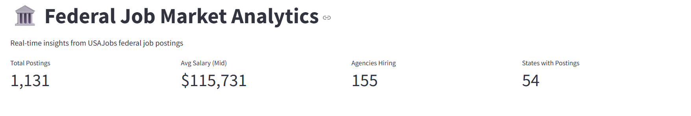
    <figcaption style="font-size: 0.95em; color: #555; margin-top: 8px;">
      KPI cards (total postings, average salary, agencies hiring, states) and postings by role category bar chart.
      
        <a href="images/pipeline-dashboard-1a.png">Open full-size</a>
      
    </figcaption>
  </figure>

  <figure style="margin: 20px 0;">
    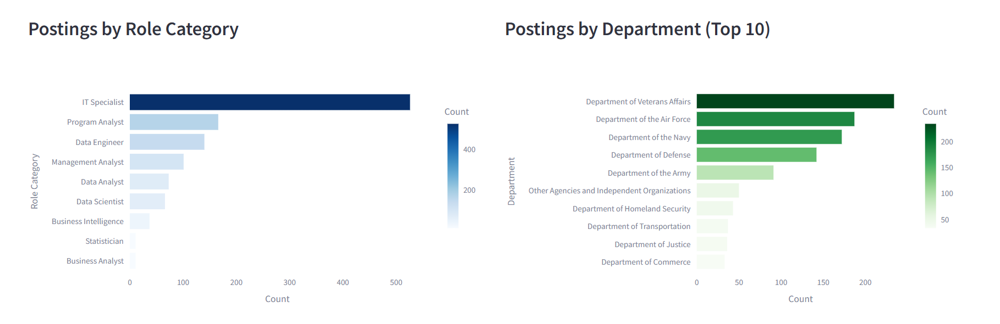
    <figcaption style="font-size: 0.95em; color: #555; margin-top: 8px;">
      Top 10 departments by posting volume.
      
        <a href="images/pipeline-dashboard-1b.png">Open full-size</a>
      
    </figcaption>
  </figure>

  <figure style="margin: 20px 0;">
    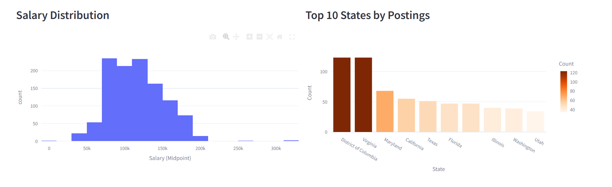
    <figcaption style="font-size: 0.95em; color: #555; margin-top: 8px;">
      Salary distribution histogram and top 10 states by posting volume.
      
        <a href="images/pipeline-dashboard-1c.png">Open full-size</a>
      
    </figcaption>
  </figure>

  <h3>Key Insights</h3>
  <ul>
    <li><strong>IT Specialist dominates posting volume:</strong> IT Specialist postings far outnumber other role categories, reflecting the federal government's broad use of this classification for technology-related positions.</li>
    <li><strong>Department of Veterans Affairs leads hiring:</strong> The VA is the top hiring department by volume, consistent with its status as the largest civilian federal employer.</li>
    <li><strong>Salaries cluster around $100K-$150K:</strong> The salary distribution histogram shows a clear concentration in the $100,000 to $150,000 range, reflecting the GS-12 to GS-14 pay bands that most analyst roles fall into.</li>
    <li><strong>DC, Virginia, and Maryland lead in postings:</strong> The top states by posting volume mirror the concentration of federal agencies in the Washington, D.C. metro area.</li>
  </ul>

  
<strong>Dashboard -- Salary Analysis</strong>

  

  
The Salary Analysis page breaks down compensation patterns by role category, state, and job grade. Summary statistics at the top show median, average, minimum, and maximum salary values across all filtered postings.

  <figure style="margin: 20px 0;">
    
    <figcaption style="font-size: 0.95em; color: #555; margin-top: 8px;">
      Salary summary KPIs and median salary by role category.
      
        <a href="images/pipeline-dashboard-2a.png">Open full-size</a>
      
    </figcaption>
  </figure>

  <figure style="margin: 20px 0;">
    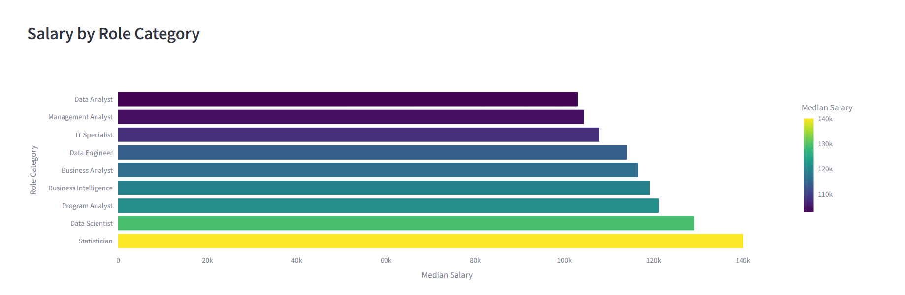
    <figcaption style="font-size: 0.95em; color: #555; margin-top: 8px;">
      Median salary by state (top 15 states with at least 3 postings).
      
        <a href="images/pipeline-dashboard-2b.png">Open full-size</a>
      
    </figcaption>
  </figure>

  <figure style="margin: 20px 0;">
    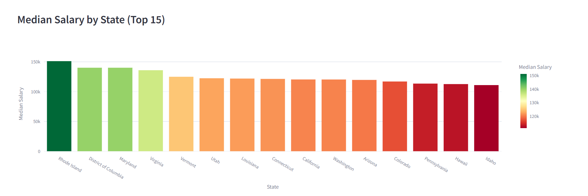
    <figcaption style="font-size: 0.95em; color: #555; margin-top: 8px;">
      Median salary by job grade, showing clear salary progression across GS levels.
      
        <a href="images/pipeline-dashboard-2c.png">Open full-size</a>
      
    </figcaption>
  </figure>

  <h3>Key Insights</h3>
  <ul>
    <li><strong>Data Scientists and Data Engineers command higher salaries:</strong> These two categories sit at the top of the salary ranking, reflecting the specialized technical skills required and competitive hiring pressure from the private sector.</li>
    <li><strong>DC metro area states top the salary charts:</strong> The District of Columbia, Virginia, and Maryland consistently rank highest in median salary, driven by locality pay adjustments for the Washington metro area.</li>
    <li><strong>Clear salary progression by GS grade:</strong> The salary-by-grade chart shows a predictable step pattern from lower grades through GS-15, confirming the structured nature of the federal pay system.</li>
    <li><strong>Wide salary ranges within role categories:</strong> Even within a single role category, salary ranges span $50,000 or more, reflecting differences in grade level, location, and agency.</li>
  </ul>

  
<strong>Dashboard -- Geographic Demand</strong>

  

  
The Geographic Demand page maps job posting locations across the United States and ranks states and cities by hiring volume. A location type breakdown shows the proportion of single-location, multiple-location, and negotiable postings.

  <figure style="margin: 20px 0;">
    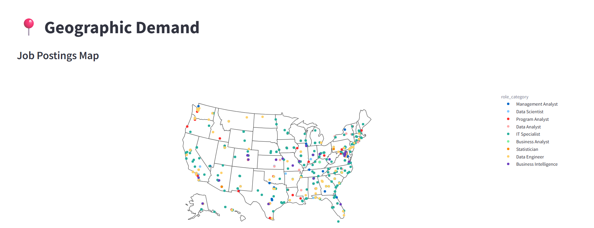
    <figcaption style="font-size: 0.95em; color: #555; margin-top: 8px;">
      Interactive US map showing job posting locations, color-coded by role category.
      
        <a href="images/pipeline-dashboard-3a.png">Open full-size</a>
      
    </figcaption>
  </figure>

  <figure style="margin: 20px 0;">
    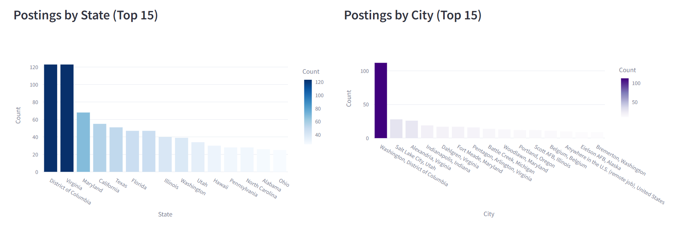
    <figcaption style="font-size: 0.95em; color: #555; margin-top: 8px;">
      Top 15 states and top 15 cities ranked by posting volume.
      
        <a href="images/pipeline-dashboard-3b.png">Open full-size</a>
      
    </figcaption>
  </figure>

  <figure style="margin: 20px 0;">
    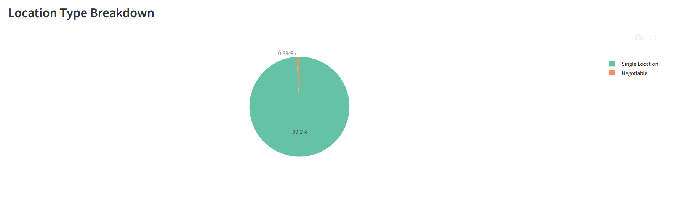
    <figcaption style="font-size: 0.95em; color: #555; margin-top: 8px;">
      Location type breakdown: single location, multiple locations, and negotiable postings.
      
        <a href="images/pipeline-dashboard-3c.png">Open full-size</a>
      
    </figcaption>
  </figure>

  <h3>Key Insights</h3>
  <ul>
    <li><strong>Heavy concentration in the DC metro area:</strong> The map shows a dense cluster of postings around Washington, D.C., which is expected given that most federal agency headquarters are located there.</li>
    <li><strong>Virginia and Maryland benefit from proximity to federal agencies:</strong> Both states rank among the top hiring locations, driven by the large number of federal offices and contractors in Northern Virginia and the Maryland suburbs of DC.</li>
    <li><strong>Some postings offer remote or negotiable locations:</strong> A portion of postings list "Negotiable" or "Multiple Locations" as the duty station, indicating growing flexibility in federal hiring for certain roles.</li>
    <li><strong>Secondary hubs exist outside DC:</strong> States like Texas, California, and Georgia show meaningful posting volumes, reflecting regional federal installations and VA medical centers distributed across the country.</li>
  </ul>

  
<strong>Dashboard -- Agency Analysis</strong>

  

  
The Agency Analysis page examines hiring patterns at the organization and department level. It surfaces which agencies hire the most, how salary varies by department, and which role categories each department prioritizes.

  <figure style="margin: 20px 0;">
    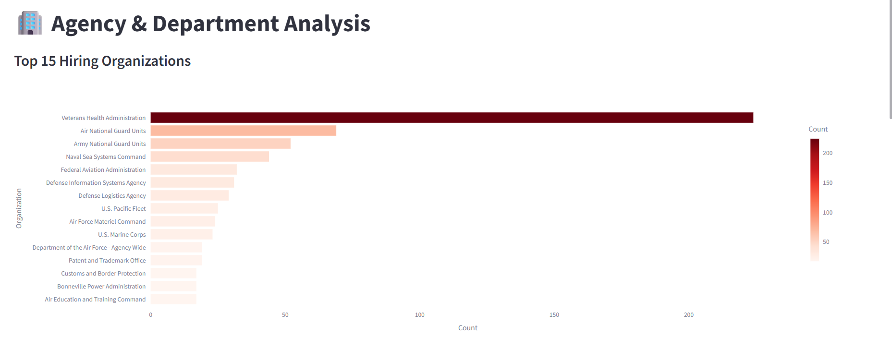
    <figcaption style="font-size: 0.95em; color: #555; margin-top: 8px;">
      Top 15 hiring organizations ranked by posting volume.
      
        <a href="images/pipeline-dashboard-4a.png">Open full-size</a>
      
    </figcaption>
  </figure>

  <figure style="margin: 20px 0;">
    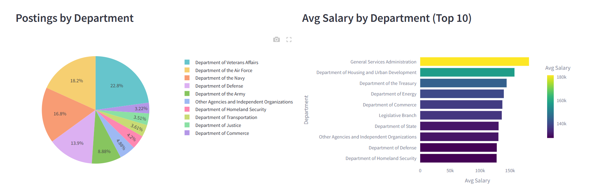
    <figcaption style="font-size: 0.95em; color: #555; margin-top: 8px;">
      Department breakdown by posting share and average salary by department (top 10).
      
        <a href="images/pipeline-dashboard-4b.png">Open full-size</a>
      
    </figcaption>
  </figure>

  <figure style="margin: 20px 0;">
    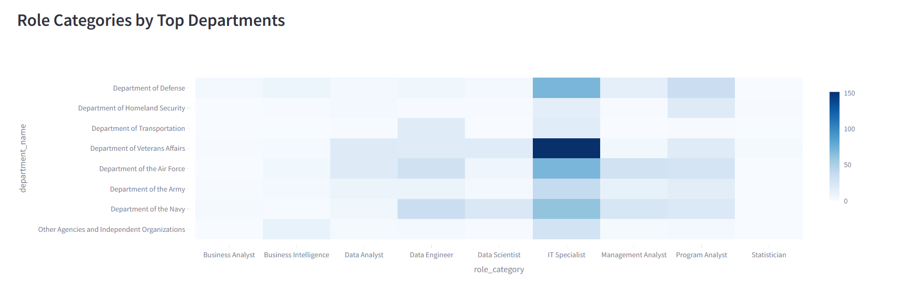
    <figcaption style="font-size: 0.95em; color: #555; margin-top: 8px;">
      Role category distribution across top departments (heatmap).
      
        <a href="images/pipeline-dashboard-4c.png">Open full-size</a>
      
    </figcaption>
  </figure>

  <h3>Key Insights</h3>
  <ul>
    <li><strong>Veterans Affairs dominates hiring volume:</strong> The VA posts significantly more analyst and technical roles than any other department, driven by the scale of its healthcare, benefits, and IT operations.</li>
    <li><strong>Defense-related agencies are major employers:</strong> The Department of Defense and its sub-agencies (Army, Navy, Air Force) collectively represent a large share of postings, particularly for IT Specialist and Program Analyst roles.</li>
    <li><strong>Salary varies significantly by department:</strong> Average salaries differ by $20,000 or more between departments, reflecting differences in grade levels, locality pay, and the types of roles each agency hires for.</li>
    <li><strong>Role category mix differs by department:</strong> The heatmap reveals that some departments hire heavily for IT Specialist roles while others focus on Management Analyst or Program Analyst positions, suggesting distinct workforce needs across agencies.</li>
  </ul>

  
<strong>Code Highlights</strong>

  

  
The pipeline is built from four Python modules, each handling a distinct stage. Below are key excerpts showing the core logic.

  <h3>API Collection with Pagination and Retry Logic (collect.py)</h3>
  
The <code>fetch_keyword</code> function handles paginated API requests with automatic retry on failure. Each keyword can return hundreds of results spread across multiple pages.

<pre><code class="language-python">def fetch_keyword(keyword, max_retries=3, delay=5):
    """
    Fetch all job postings for a given keyword.
    Handles pagination and retries.
    """
    all_items = []
    page = 1

    while True:
        params = {
            "Keyword": keyword,
            "ResultsPerPage": RESULTS_PER_PAGE,
            "Page": page,
        }

        # Retry logic
        for attempt in range(1, max_retries + 1):
            try:
                response = requests.get(
                    BASE_URL, headers=HEADERS, params=params, timeout=30
                )
                response.raise_for_status()
                data = response.json()
                break
            except (requests.RequestException, json.JSONDecodeError) as e:
                print(f"  Attempt {attempt}/{max_retries} failed: {e}")
                if attempt < max_retries:
                    time.sleep(delay)
                else:
                    return all_items

        items = data.get("SearchResult", {}).get("SearchResultItems", [])
        if not items:
            break

        all_items.extend(items)

        total_results = int(
            data.get("SearchResult", {}).get("SearchResultCountAll", 0)
        )
        if page * RESULTS_PER_PAGE >= total_results:
            break

        page += 1
        time.sleep(1)  # Rate limiting

    return all_items</code></pre>

  <h3>Deduplication and Salary Parsing (transform.py)</h3>
  
Records are deduplicated by <code>control_number</code> as they are processed. Salary strings are parsed into numeric values, and hourly rates are annualized using the OPM standard of 2,087 work hours per year.

<pre><code class="language-python">def parse_salary(salary_str):
    """Extract numeric salary from string like '$72,553.00'"""
    if not salary_str:
        return None
    cleaned = re.sub(r'[^\d.]', '', salary_str)
    try:
        value = float(cleaned)
        return value if value > 0 else None
    except (ValueError, TypeError):
        return None

def transform_raw_file(filepath=None):
    """
    Reads raw JSON, flattens all records, and deduplicates by control_number.
    """
    if filepath is None:
        filepath = get_latest_raw_file()

    with open(filepath, "r", encoding="utf-8") as f:
        raw_data = json.load(f)

    all_records = []
    seen_control_numbers = set()

    for keyword, items in raw_data.items():
        for item in items:
            record = flatten_job(item, keyword)

            # Deduplicate by control number
            cn = record["control_number"]
            if cn and cn not in seen_control_numbers:
                seen_control_numbers.add(cn)
                all_records.append(record)

    return all_records</code></pre>

  <h3>Database Upsert and Pipeline Logging (load.py)</h3>
  
The load stage uses <code>INSERT OR IGNORE</code> for safe upserts, preventing duplicate records across daily runs. Each run is logged with counts for auditing.

<pre><code class="language-python">def load_records(records, source="daily"):
    """
    Load clean records into the database.
    Uses INSERT OR IGNORE to skip duplicates already in the database.
    """
    conn = get_connection()
    create_tables(conn)

    placeholders = ", ".join(["?"] * len(columns))
    column_names = ", ".join(columns)
    sql = f"INSERT OR IGNORE INTO job_postings ({column_names}) VALUES ({placeholders})"

    inserted = 0
    skipped = 0

    for record in records:
        values = tuple(record.get(col) for col in columns)
        cursor = conn.execute(sql, values)
        if cursor.rowcount > 0:
            inserted += 1
        else:
            skipped += 1

    # Log the pipeline run
    conn.execute("""
        INSERT INTO pipeline_log (run_timestamp, records_collected,
                                   records_after_dedup, records_inserted,
                                   records_skipped, source)
        VALUES (?, ?, ?, ?, ?, ?)
    """, (
        datetime.now().strftime("%Y-%m-%d %H:%M:%S"),
        len(records) + skipped, len(records), inserted, skipped, source
    ))

    conn.commit()
    conn.close()

    return {"inserted": inserted, "skipped": skipped}</code></pre>

  <h3>Streamlit Dashboard with Cached Data and Dynamic Filters (app.py)</h3>
  
The dashboard uses Streamlit's TTL-based caching to load data from SQLite, applies multi-select sidebar filters across all pages, and renders KPI metric cards with interactive Plotly visualizations.

<pre><code class="language-python">@st.cache_data(ttl=3600)
def load_data():
    conn = sqlite3.connect(DB_PATH)
    df = pd.read_sql_query("SELECT * FROM job_postings", conn)
    conn.close()
    return df

df = load_data()

# --- Sidebar Filters ---
st.sidebar.title("🔍 Filters")

all_roles = sorted(df["role_category"].dropna().unique())
selected_roles = st.sidebar.multiselect("Role Category", all_roles, default=all_roles)

all_states = sorted(df["state"].dropna().unique())
selected_states = st.sidebar.multiselect("State", all_states)

all_depts = sorted(df["department_name"].dropna().unique())
selected_depts = st.sidebar.multiselect("Department", all_depts)

# Apply filters
filtered = df.copy()
if selected_roles:
    filtered = filtered[filtered["role_category"].isin(selected_roles)]
if selected_states:
    filtered = filtered[filtered["state"].isin(selected_states)]
if selected_depts:
    filtered = filtered[filtered["department_name"].isin(selected_depts)]

# --- Executive Overview KPI Cards ---
col1, col2, col3, col4 = st.columns(4)
with col1:
    st.metric("Total Postings", f"{len(filtered):,}")
with col2:
    avg_salary = filtered["salary_mid"].dropna().mean()
    st.metric("Avg Salary (Mid)", f"${avg_salary:,.0f}" if pd.notna(avg_salary) else "N/A")
with col3:
    unique_agencies = filtered["organization_name"].nunique()
    st.metric("Agencies Hiring", f"{unique_agencies:,}")
with col4:
    unique_states = filtered["state"].dropna().nunique()
    st.metric("States with Postings", f"{unique_states}")</code></pre>

  <h3>Source Code</h3>
  <ul>
    <li><a href="code/collect.py">collect.py</a> -- API collection with pagination and retry logic</li>
    <li><a href="code/transform.py">transform.py</a> -- JSON flattening, deduplication, role classification, salary parsing</li>
    <li><a href="code/load.py">load.py</a> -- SQLite upsert loading and pipeline run logging</li>
    <li><a href="code/app.py">app.py</a> -- Streamlit dashboard application</li>
    <li><a href="https://github.com/nadeaujonny/usajobs-analytics-pipeline" target="_blank" rel="noopener">Full GitHub Repository</a></li>
  </ul>

  
<strong>Links &amp; Resources</strong>

  

  <ul>
    <li>
      <strong>Live Dashboard:</strong>
      <a href="https://usajobs-analytics-pipeline.streamlit.app" target="_blank" rel="noopener">
        usajobs-analytics-pipeline.streamlit.app
      </a>
    </li>
    <li>
      <strong>GitHub Repository:</strong>
      <a href="https://github.com/nadeaujonny/usajobs-analytics-pipeline" target="_blank" rel="noopener">
        github.com/nadeaujonny/usajobs-analytics-pipeline
      </a>
    </li>
    <li>
      <strong>Pipeline Code:</strong>
      <a href="code/collect.py">collect.py</a> |
      <a href="code/transform.py">transform.py</a> |
      <a href="code/load.py">load.py</a> |
      <a href="code/app.py">app.py</a>
    </li>
  </ul>

  
<strong>Limitations &amp; Future Enhancements</strong>

  

  <h3>Current Limitations</h3>
  <ul>
    <li><strong>No historical backfill:</strong> The USAJobs Historical API does not support filtering by keyword or role category, so the database starts from the pipeline's launch date. There is no way to retroactively collect postings that were open before the pipeline began running.</li>
    <li><strong>Only open postings are captured:</strong> The Search API returns only currently open job postings. Once a posting closes, it is no longer returned by the API. The pipeline preserves previously collected records in the database, but any posting that opens and closes between daily runs may be missed.</li>
    <li><strong>Grade format parsing issue:</strong> The "Salary by Job Grade" chart filters for grades that are purely numeric (e.g., "13", "14"). Some postings use non-standard grade formats (e.g., "13/14" for promotion ladders) that are excluded from the grade chart, reducing its coverage.</li>
  </ul>

  <h3>Future Enhancements</h3>
  <ul>
    <li><strong>Trend analysis over time:</strong> As the database accumulates daily snapshots, add a "Trends Over Time" dashboard page showing how posting volume, salary distributions, and role category mix change week over week and month over month.</li>
    <li><strong>New posting alerts:</strong> Implement email or webhook notifications when new postings match specific criteria (e.g., "Data Scientist" roles above GS-13 in a target state), useful for active job seekers.</li>
    <li><strong>PostgreSQL migration:</strong> If data volume grows significantly over time, migrate from SQLite to PostgreSQL for better concurrent access and more robust querying under load.</li>
    <li><strong>Improved grade parsing:</strong> Handle promotion ladder grades (e.g., "12/13/14") by extracting the target grade or displaying the full range, increasing coverage of the salary-by-grade analysis.</li>
  </ul>

