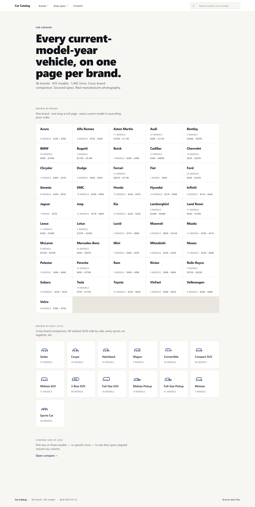
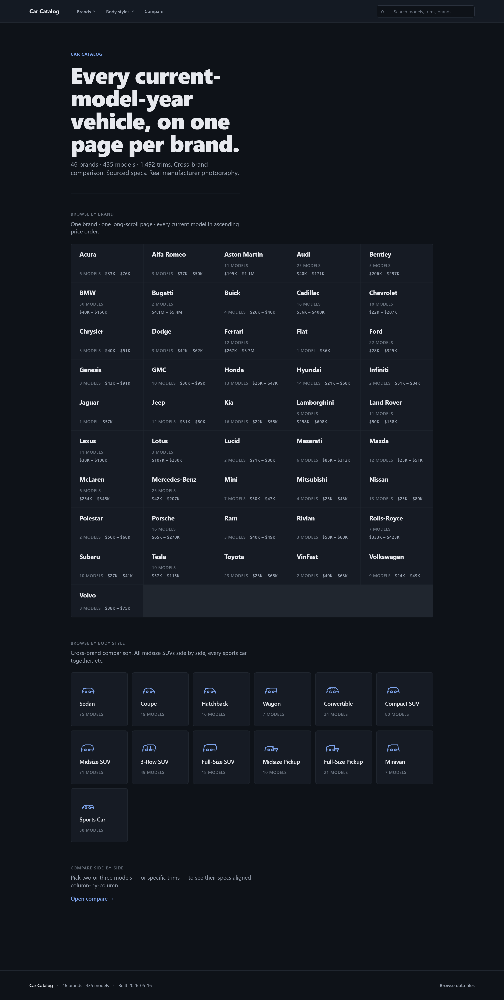
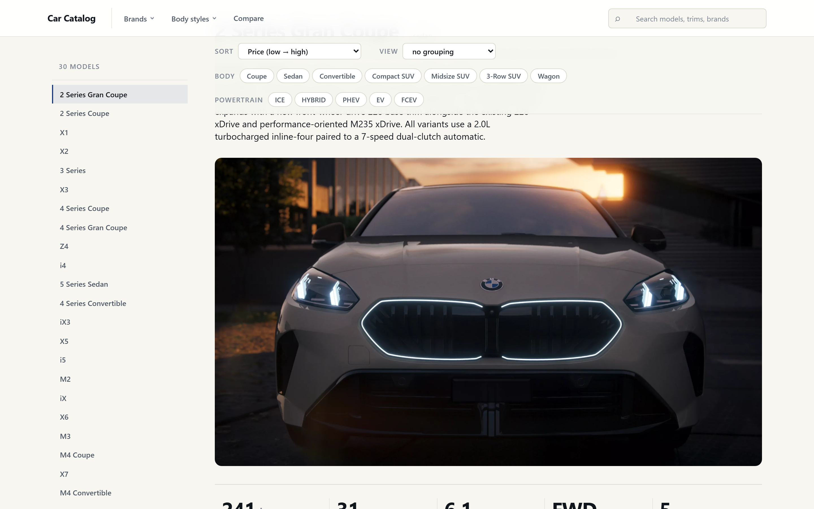
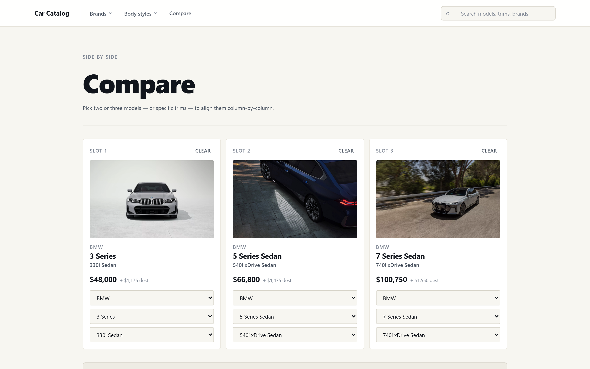

<a href="/projects/" class="back-to-projects btn" aria-label="Back to projects page">&larr; Back to Projects</a>

# Car Catalog

  <a class="btn btn-primary" href="https://nadeaujonny.github.io/car-catalog/" target="_blank" rel="noopener">Live Demo &rarr;</a>
  <a class="btn" href="https://github.com/nadeaujonny/car-catalog" target="_blank" rel="noopener">GitHub Repo &rarr;</a>

**Stack:** Vanilla HTML &middot; CSS &middot; JavaScript &middot; schema-versioned JSON dataset (v1.3) &middot; no framework, no backend, no build step

---

<strong>Overview</strong>

A structured dataset and reference catalog of <strong>1,492 vehicle trims across 435 models and 46 brands</strong>, with every spec field individually sourced and cited. Built as a vanilla-JavaScript single-page catalog that opens offline from <code>file://</code> &mdash; no framework, no backend, no build step. The interesting work is in the data layer: schema-versioned JSON, a manufacturer-only source policy enforced per field, and a verification pipeline that flags coverage gaps and citation drift before release.

The catalog interface is the deliverable users see. The portfolio story is the dataset behind it and the discipline used to build it.

<figure style="margin: 20px 0;">
  
  <figcaption style="font-size: 0.95em; color: var(--muted); margin-top: 8px; text-align: center;">Dark mode home view.</figcaption>
</figure>

<strong>Key stats</strong>

<ul>
  <li><strong>46</strong> brands</li>
  <li><strong>435</strong> models</li>
  <li><strong>1,492</strong> trims</li>
  <li><strong>~40</strong> fields per row</li>
  <li><strong>98%+</strong> MSRP completion</li>
  <li><strong>~73%</strong> manufacturer-sourced image coverage <em>(structural ceiling under the source policy)</em></li>
  <li><strong>Zero</strong> verification blockers at v1.3</li>
  <li><strong>JD Power 2026 VDS</strong> reliability data, current</li>
</ul>

<strong>Technical approach</strong>

The data layer is a schema-versioned JSON dataset (v1.3). Each row covers a single trim and carries ~40 fields spanning powertrain, dimensions, performance, MSRP, image references, and a citation block tying every value back to a manufacturer source. The front end is plain HTML, CSS, and vanilla JavaScript &mdash; no React, no build tooling &mdash; so the catalog is fully portable and inspectable. The site can be opened directly from a local file path or served from any static host.

<strong>Source policy:</strong> manufacturer-only. Third-party aggregators were rejected during ingestion. Every field has an associated citation in the schema, validated at build time.

<figure style="margin: 20px 0;">
  
  <figcaption style="font-size: 0.95em; color: var(--muted); margin-top: 8px; text-align: center;">Brand detail page showing trim-level specs.</figcaption>
</figure>

<strong>Engineering discipline / verification system</strong>

The project was built across <strong>16 chained Claude Code sessions</strong>, each with explicit safety rules, checkpoints, and verification gates. This was a deliberate workflow choice: small, scoped sessions with hard stops between phases produce a clearer audit trail than one long agentic run, and the verification gates catch regressions before they propagate.

Two moments worth highlighting:

<ul>
  <li><strong>Session 9 &mdash; regex separator bug.</strong> A field-parsing regex was silently misparsing a separator character across multiple brands, producing data that looked plausible but was wrong on the margins. The bug was caught by the row-level spot-check guard during a verification gate and fixed before release.</li>
  <li><strong>Session 15 &mdash; anti-bot poisoning.</strong> A manufacturer source had quietly started serving altered values to automated requests. The spot-check guard caught the discrepancy, the affected ingestion run was reverted using the per-session <code>.bak</code> snapshots, and the ingest path was changed to bypass the poisoned route.</li>
</ul>

These are the kinds of failures that don't show up in summary metrics &mdash; they show up in row-level audits. The verification system was scoped explicitly to surface them.

<strong>Example analyses</strong>

Three short analytical writeups are included in the catalog repo, demonstrating use of the dataset as an analysis substrate rather than just a browsing tool:

<ul>
  <li><strong>Price-performance landscape.</strong> Plug-in hybrids cluster heavily at the $120K+ luxury performance tier &mdash; PHEV technology is being deployed as a performance multiplier on top-end vehicles rather than as a mass-market efficiency play.</li>
  <li><strong>Brand reliability rankings.</strong> Using JD Power 2026 VDS data: Lexus ranks #1, Volkswagen ranks last. The full ordering and the gap between tiers are in the writeup.</li>
  <li><strong>EV market positioning.</strong> The Lucid Air leads on range at 512 miles. The writeup maps each EV in the dataset against price, range, and segment, surfacing which manufacturers are competing on which axes.</li>
</ul>

<figure style="margin: 20px 0;">
  
  <figcaption style="font-size: 0.95em; color: var(--muted); margin-top: 8px; text-align: center;">Side-by-side trim comparison.</figcaption>
</figure>

<strong>Honest limitations</strong>

<ul>
  <li><strong>Image coverage ceiling.</strong> Manufacturer-only sourcing caps photographic coverage at ~73%. Lifting the ceiling would require relaxing the source policy, which would compromise the citation discipline the rest of the project depends on.</li>
  <li><strong>Snapshot, not a feed.</strong> The dataset is a point-in-time snapshot at v1.3. Trims change across model years; the catalog reflects current production at the time of capture and is not auto-refreshed.</li>
  <li><strong>No backend.</strong> All filtering and comparison runs client-side over the JSON dataset. The architecture is intentional but means there is no query layer for ad-hoc analysis beyond what the UI exposes.</li>
  <li><strong>Scope of analyses.</strong> The three included writeups are illustrative rather than exhaustive. Many other slices of the data would reward closer inspection.</li>
</ul>

---

Built by Jonathan Nadeau.

[Live demo](https://nadeaujonny.github.io/car-catalog/) &middot; [GitHub source](https://github.com/nadeaujonny/car-catalog) &middot; [nadeau.jonny@gmail.com](mailto:nadeau.jonny@gmail.com) &middot; [linkedin.com/in/nadeau-jonathan](https://linkedin.com/in/nadeau-jonathan)
