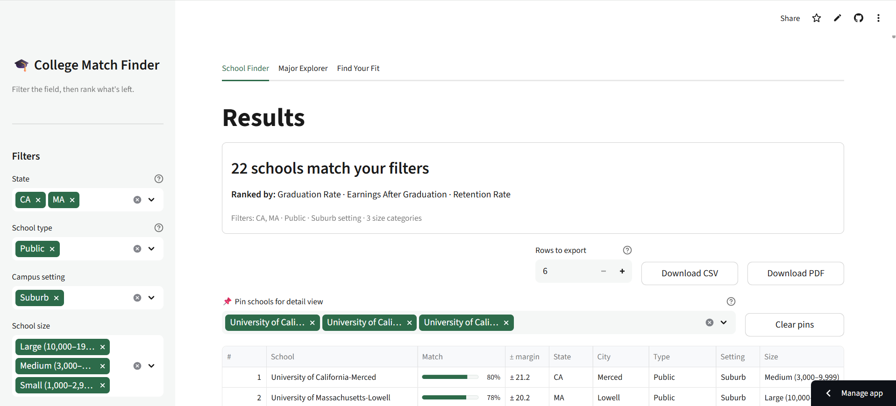
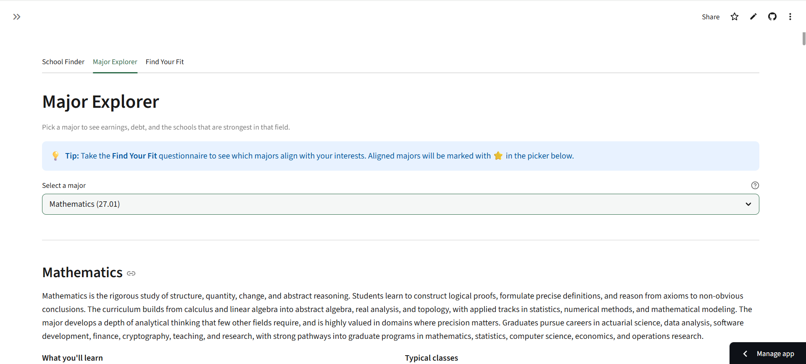
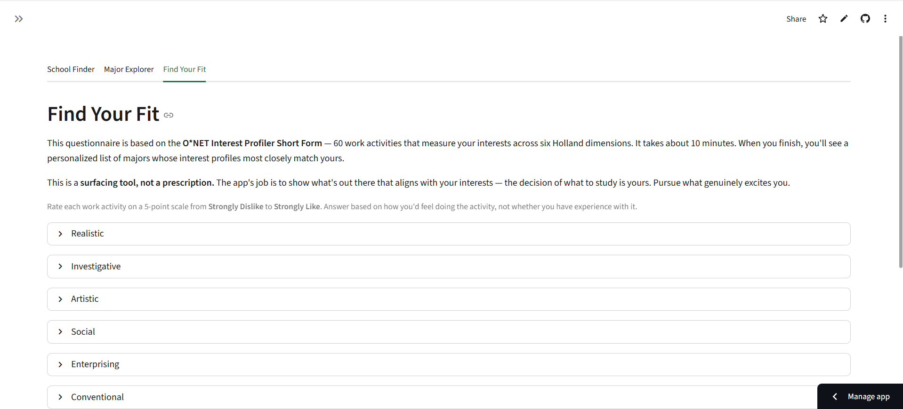

# College Match Finder

> Interactive college discovery tool — weighted multi-criteria scoring over federal
> education and labor-market data, with major-first exploration and a RIASEC
> interest-fit questionnaire.

**[Launch app →](https://nadeaujonnycollegematchfinder.streamlit.app)**
<!-- Portfolio page link added after Block 4 (index.md authoring) -->

---

## What it is

College Match Finder is a Streamlit app that helps students identify colleges and
majors that fit their priorities — not the rankings. Users weight eight scoring
dimensions (selectivity, earnings, cost, diversity, and more), filter to their
realistic applicant pool, and rank 3,500+ institutions against their own criteria.
A second tab flips the lens to majors-first: pick a field of study and see
state-level employment maps, wage percentiles, projected growth, and which schools
have the strongest programs in that field. A third tab runs a 60-item RIASEC
interest questionnaire and returns majors aligned to the user's interest profile.

## Why this project

Every college ranking tool publishes a composite score it defines for you. This
one exposes the weights and lets users define "fit" for themselves. The harder
problem was the data layer: 12 independent federal and labor-market datasets at
different granularities, update cycles, and unit structures — joined, normalized,
and queryable in a few hundred milliseconds from a Streamlit frontend.

## Highlights

- **12 federal data sources integrated:** College Scorecard (institution-level +
  field-of-study), BLS OEWS (national, state, industry-level), BLS Employment
  Projections, O\*NET Work Context and Interests, NY Fed College Labor Market
  data, and NCES CIP–SOC crosswalk
- **297 tests** covering scoring logic, data pipeline integrity, and UI component
  contracts
- **WCAG AA contrast verified** on all palette colors; Lighthouse-audited; tested
  on mobile viewport and dark mode
- **Cross-tab session-state handoff with widget-state shadow handling** — manual
  verification surfaced a bug 296 tests had missed, fixed and regression-tested
- **Accessibility-first:** every chart has a descriptive caption; acceptance-tier
  badges carry screen-reader labels; all interactive elements have explicit
  `aria-label` context
- **PDF export** of ranked school results with active filter state and scoring
  weights embedded

## Tech stack

Streamlit · pandas · plotly · fpdf2 · PyYAML · NumPy · openpyxl · pytest

## Data sources

12 sources from the U.S. Department of Education (College Scorecard), Bureau of
Labor Statistics (OEWS, Employment Projections), O\*NET Center, NY Federal
Reserve, and NCES. Open the **About the Data** expander on any tab of the live
app for snapshot dates, source URLs, and methodology notes for each.

## Quick start

```bash
git clone https://github.com/nadeaujonny/nadeaujonny.github.io.git
cd nadeaujonny.github.io/projects/college-match-finder
python -m venv .venv
.venv\Scripts\activate        # Windows
# source .venv/bin/activate   # macOS / Linux
pip install -r requirements.txt
streamlit run app.py
```

`data/cleaned/` is committed — cleaned data ships with the repo. `streamlit run
app.py` works immediately after `pip install`. The `data_prep_*.py` scripts
regenerate cleaned data from raw source files; they are not needed for normal use.

## Project structure

```
college-match-finder/
├── app.py                  # Entry point: sidebar, tab routing, session state
├── config.py               # Constants, column mappings, scoring dimensions, PALETTE
├── scoring.py              # Weighted multi-criteria scoring engine
├── utils.py                # Shared helpers: badge rendering, formatting, contrast
├── page_modules/           # One module per tab: school_finder, major_explorer,
│                           #   find_your_fit, about_the_data
├── data/
│   ├── cleaned/            # 12 pre-built CSVs — committed, loaded at startup
│   └── processed/          # nyfed_outcomes.parquet — committed
├── tests/                  # 297 pytest tests
└── docs/                   # ACCESSIBILITY.md (audit notes), SESSION_STATE.md
```

## Screenshots







## License & attribution

MIT — see [LICENSE](LICENSE).

Data: O\*NET data © O\*NET Center (CC BY 4.0) · BLS and College Scorecard data
are U.S. government public domain.
