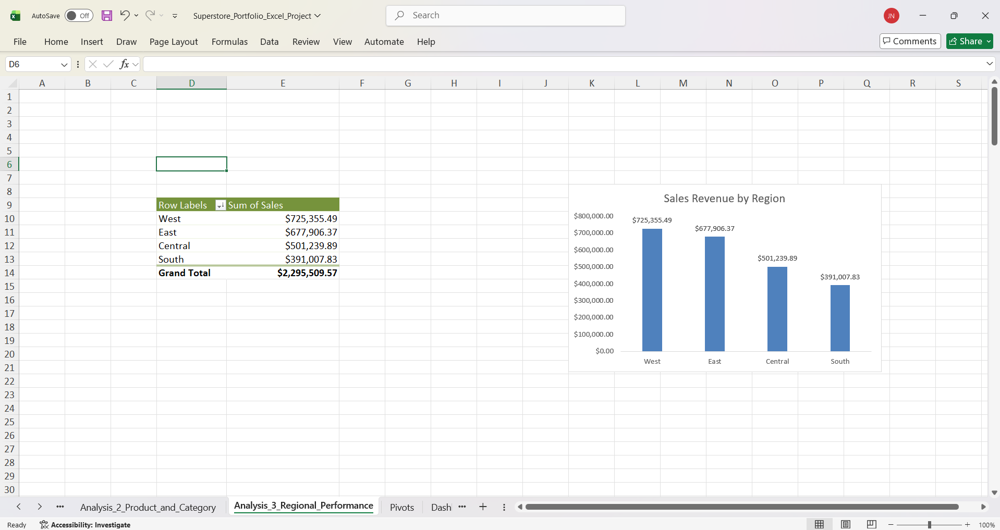
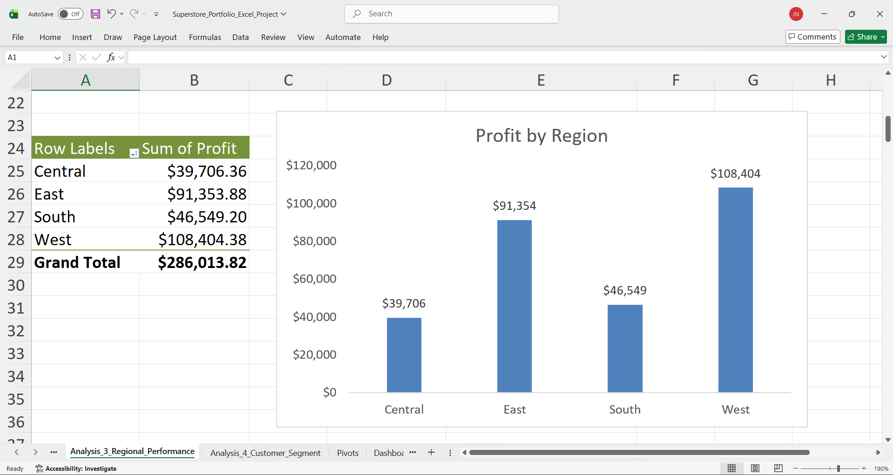
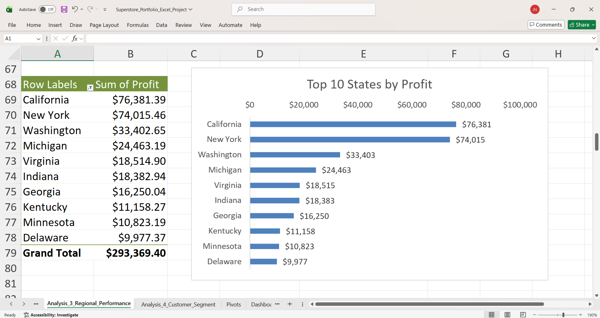
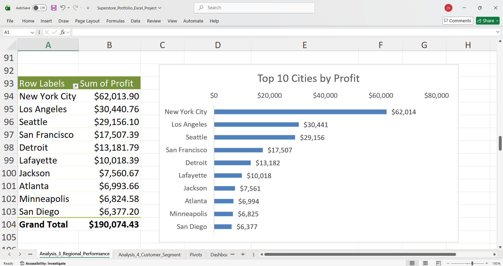
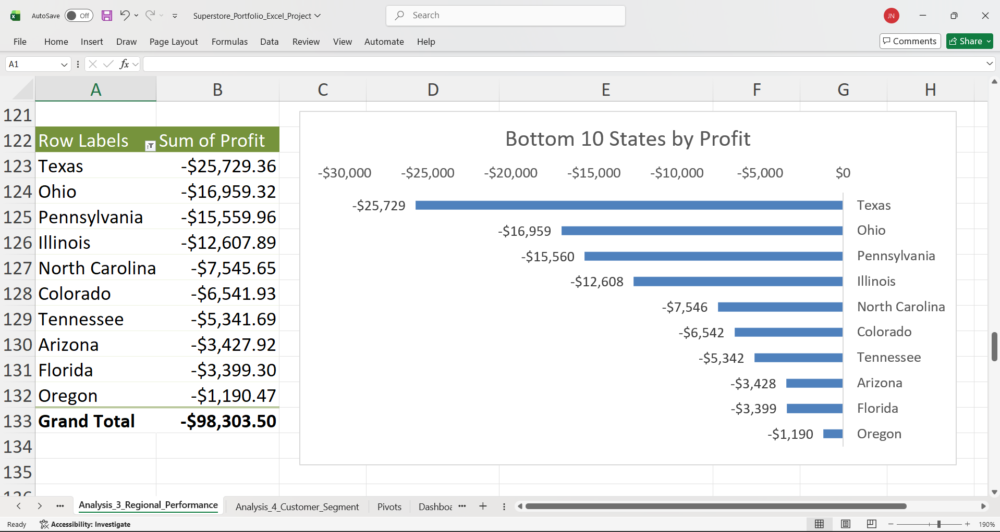
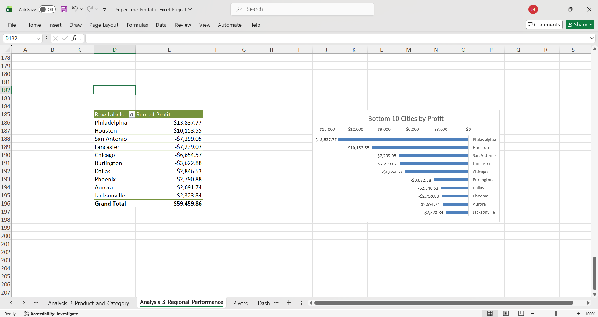

<h1>Sales Dashboard – Superstore Dataset (Excel)</h1>

<blockquote>
  
An end-to-end Excel analytics project demonstrating Power Query data cleaning, KPI development, pivot-table analysis, and executive dashboard design using the Superstore retail dataset.

</blockquote>

<h2>Project Overview</h2>

  
<strong>Click to expand/collapse</strong>

  
  

  <h3>Overview</h3>
  
This project analyzes Superstore retail sales data in Microsoft Excel to uncover trends in revenue, profit, customer segments, regional performance, and return impact. The goal is to demonstrate practical Excel analytics skills used in business environments: Power Query (ETL), pivot-driven analysis, KPI modeling, and dashboard design.

  <h3>Business Context</h3>
  
This analysis simulates a retail company evaluating sales performance, profitability, customer behavior, and operational efficiency to support data-driven decision making by executives and category managers.

  <h3>Objectives</h3>
  <ul>
    <li>Define and calculate core KPIs: revenue, profit, profit margin, units sold, and return rate</li>
    <li>Clean and standardize raw orders using Power Query (data types, text cleanup, de-duplication, derived date fields)</li>
    <li>Analyze performance using pivot tables and calculated fields (time trends, product mix, regional efficiency, segments, returns)</li>
    <li>Build an executive-style dashboard with connected slicers for interactive exploration</li>
  </ul>

  <h3>Dataset Overview</h3>
  <ul>
    <li><strong>Dataset:</strong> Superstore (public retail sample dataset)</li>
    <li><strong>Time range:</strong> 2014–2017</li>
    <li><strong>Granularity:</strong> One row per order line item</li>
    <li><strong>Core tables:</strong> Orders, Returns</li>
  </ul>

  <h3>Tools &amp; Skills Demonstrated</h3>
  <ul>
    <li><strong>Power Query:</strong> ETL, data types, text cleanup, de-duplication, derived date fields</li>
    <li><strong>Pivot Tables:</strong> grouping, sorting, filters, calculated fields</li>
    <li><strong>KPI Modeling:</strong> profit margin, return rate, performance comparisons</li>
    <li><strong>Excel Functions:</strong> XLOOKUP, SUMIFS/COUNTIFS, IF/IFERROR, date &amp; text functions</li>
    <li><strong>Visualization:</strong> pivot charts, conditional formatting, slicers, dashboard layout</li>
  </ul>

  <h3>KPI Definitions</h3>
  <ul>
    <li><strong>Revenue:</strong> SUM(Sales)</li>
    <li><strong>Profit:</strong> SUM(Profit)</li>
    <li><strong>Profit Margin:</strong> Profit / Revenue</li>
    <li><strong>Units Sold:</strong> SUM(Quantity)</li>
    <li><strong>Return Rate:</strong> Returned Sales / Total Sales (sales-based return rate)</li>
  </ul>

<h2>Data Preparation (Power Query / ETL)</h2>

  
<strong>Click to expand/collapse</strong>

  
  

  
Before building KPIs, pivot tables, and charts, I cleaned and standardized the Superstore Orders dataset using <strong>Excel Power Query</strong>. The goal was to create a reliable, refreshable table (<code>Clean_Orders</code>) that serves as the single source of truth for all downstream analysis and dashboarding.

  <h3>ETL Summary</h3>
  <ul>
    <li><strong>Input:</strong> Raw Orders data (<code>.xls</code>) preserved as <code>Raw_Orders</code> (no manual edits)</li>
    <li><strong>Tool:</strong> Excel Power Query (Get &amp; Transform)</li>
    <li><strong>Output:</strong> Cleaned dataset loaded to <code>Clean_Orders</code> (used by all pivots, charts, and KPIs)</li>
    <li><strong>Refreshable:</strong> Can update via <em>Data → Refresh All</em> without redoing manual steps</li>
  </ul>

  <h3>Power Query Applied Steps (Evidence)</h3>
  <figure style="margin: 20px 0;">
    
    <figcaption style="font-size: 0.95em; color: #555; margin-top: 8px;">
      Power Query Editor showing Applied Steps used to produce <code>Clean_Orders</code>.
      
        <a href="images/excel-data-prep-power-query.png">Open full-size</a>
      
    </figcaption>
  </figure>

  <h3>Cleaning &amp; Transformation Steps</h3>
  <ol>
    <li>
      <strong>Import &amp; preserve raw data</strong>
      <ul>
        <li>Imported raw Superstore Orders and preserved the original table unchanged.</li>
      </ul>
    </li>
    <li>
      <strong>Standardize data types</strong>
      <ul>
        <li>Converted <code>Order Date</code> and <code>Ship Date</code> to Date-only values.</li>
        <li>Set <code>Postal Code</code> to Text to preserve leading zeros.</li>
        <li>Validated numeric fields (<code>Sales</code>, <code>Profit</code>, <code>Discount</code>, <code>Quantity</code>) as numeric types.</li>
      </ul>
    </li>
    <li>
      <strong>Clean text columns</strong>
      <ul>
        <li>Trimmed whitespace and removed non-printable characters across key text fields.</li>
        <li>Improved pivot grouping stability (e.g., prevents "duplicate labels" caused by trailing spaces).</li>
      </ul>
    </li>
    <li>
      <strong>Remove invalid / blank records</strong>
      <ul>
        <li>Removed blank rows and incomplete records that could distort totals and trends.</li>
      </ul>
    </li>
    <li>
      <strong>Remove duplicates</strong>
      <ul>
        <li>Removed duplicates using a composite key: <code>Order ID + Product ID</code>.</li>
        <li>Ensured each row represents a unique order line item (avoids double counting).</li>
      </ul>
    </li>
    <li>
      <strong>Create derived time fields</strong>
      <ul>
        <li>Created <code>Order Year</code>, <code>Order Month</code>, and <code>Order Year-Month</code> (YYYY-MM) for consistent time-series reporting.</li>
      </ul>
    </li>
    <li>
      <strong>Load to <code>Clean_Orders</code></strong>
      <ul>
        <li>Loaded the final cleaned table to Excel for analysis, pivots, and dashboarding.</li>
      </ul>
    </li>
  </ol>

  <h3>Why This Matters</h3>
  <ul>
    <li><strong>Accuracy:</strong> prevents inflated KPIs due to duplicates and invalid records</li>
    <li><strong>Consistency:</strong> stable grouping and filtering in pivots (clean types + clean text)</li>
    <li><strong>Repeatability:</strong> refreshable pipeline for maintainable analytics workflows</li>
  </ul>

<h2>Analysis 1 — Sales &amp; Profit Trends Over Time</h2>

  
<strong>Click to expand/collapse</strong>

  
  

  <h3>Business Question</h3>
  
How have sales and profitability evolved over time from 2014 to 2017? Are there trends, seasonality, or periods of volatility that could inform forecasting, inventory planning, and cost control?

  <h3>Method</h3>
  <ul>
    <li>Used <code>Clean_Orders</code> as the data source.</li>
    <li>Built pivot tables grouped by <code>Order Year-Month</code>.</li>
    <li>Created line charts for monthly revenue and monthly profit.</li>
    <li>Reviewed overall KPIs to contextualize the trends.</li>
  </ul>

  <h3>Results</h3>

  <figure style="margin: 20px 0;">
    
    <figcaption style="font-size: 0.95em; color: #555; margin-top: 8px;">
      Overall KPI summary used to contextualize trend performance.
      
        <a href="images/excel-analysis-1-kpi-summary.png">Open full-size</a>
      
    </figcaption>
  </figure>

  <figure style="margin: 20px 0;">
    
    <figcaption style="font-size: 0.95em; color: #555; margin-top: 8px;">
      Monthly revenue trend grouped by Year–Month.
      
        <a href="images/excel-analysis-1-monthly-sales.png">Open full-size</a>
      
    </figcaption>
  </figure>

  <figure style="margin: 20px 0;">
    
    <figcaption style="font-size: 0.95em; color: #555; margin-top: 8px;">
      Monthly profit trend highlighting volatility and negative-profit periods.
      
        <a href="images/excel-analysis-1-monthly-profit.png">Open full-size</a>
      
    </figcaption>
  </figure>

  <h3>Key Insights</h3>
  <ul>
    <li><strong>Revenue grows consistently:</strong> Sales show a clear upward trend from 2014 to 2017 with predictable seasonal peaks.</li>
    <li><strong>Profit is volatile:</strong> While revenue grows steadily, profit swings significantly month-to-month, including several negative-profit periods.</li>
    <li><strong>Margin pressure during growth:</strong> Revenue increases don't always translate to proportional profit gains, suggesting cost or discount issues.</li>
    <li><strong>Seasonality is predictable:</strong> Recurring high-demand periods offer opportunities for better inventory and capacity planning.</li>
  </ul>

  <h3>Business Recommendations</h3>
  <ul>
    <li><strong>Plan inventory around seasonal peaks:</strong> Use historical patterns to stock high-demand products 60-90 days ahead of peak periods.</li>
    <li><strong>Investigate negative-profit months:</strong> Drill down by category, discount level, and shipping method to find the root causes.</li>
    <li><strong>Set discount limits:</strong> Require manager approval for discounts above 20%, especially on low-margin products like Furniture.</li>
    <li><strong>Track profit margin monthly:</strong> Add margin to executive dashboards alongside revenue to prevent hidden profit erosion.</li>
  </ul>

<h2>Analysis 2 — Product &amp; Category Performance</h2>

  
<strong>Click to expand/collapse</strong>

  
  

  <h3>Business Question</h3>
  
Which categories and products contribute the most to revenue and profit? Where do profitability differences suggest pricing, discounting, inventory, or product strategy changes?

  <h3>Method</h3>
  <ul>
    <li>Used <code>Clean_Orders</code> as the data source.</li>
    <li>Built category pivots for Revenue, Profit, and Profit Margin (Profit / Sales).</li>
    <li>Built a product pivot sorted by Profit (descending) to identify top profit contributors.</li>
    <li>Created pivot charts with labels for fast comparison.</li>
  </ul>

  <h3>Category KPI Summary</h3>
  <table style="border-collapse: collapse; width: 100%; max-width: 780px; margin: 20px 0;">
    <thead>
      <tr>
        <th style="text-align:left; border-bottom: 2px solid #ddd; padding: 8px 6px;">Category</th>
        <th style="text-align:right; border-bottom: 2px solid #ddd; padding: 8px 6px;">Revenue</th>
        <th style="text-align:right; border-bottom: 2px solid #ddd; padding: 8px 6px;">Profit</th>
        <th style="text-align:right; border-bottom: 2px solid #ddd; padding: 8px 6px;">Profit Margin</th>
      </tr>
    </thead>
    <tbody>
      <tr>
        <td style="padding: 8px 6px; border-bottom: 1px solid #eee;">Technology</td>
        <td style="padding: 8px 6px; text-align:right; border-bottom: 1px solid #eee;">$835,759.74</td>
        <td style="padding: 8px 6px; text-align:right; border-bottom: 1px solid #eee;">$145,386.13</td>
        <td style="padding: 8px 6px; text-align:right; border-bottom: 1px solid #eee;">17.4%</td>
      </tr>
      <tr>
        <td style="padding: 8px 6px; border-bottom: 1px solid #eee;">Office Supplies</td>
        <td style="padding: 8px 6px; text-align:right; border-bottom: 1px solid #eee;">$718,317.79</td>
        <td style="padding: 8px 6px; text-align:right; border-bottom: 1px solid #eee;">$122,247.40</td>
        <td style="padding: 8px 6px; text-align:right; border-bottom: 1px solid #eee;">17.0%</td>
      </tr>
      <tr>
        <td style="padding: 8px 6px; border-bottom: 1px solid #eee;">Furniture</td>
        <td style="padding: 8px 6px; text-align:right; border-bottom: 1px solid #eee;">$741,432.04</td>
        <td style="padding: 8px 6px; text-align:right; border-bottom: 1px solid #eee;">$18,380.28</td>
        <td style="padding: 8px 6px; text-align:right; border-bottom: 1px solid #eee;">2.5%</td>
      </tr>
      <tr>
        <td style="padding: 8px 6px; font-weight:700;">Total</td>
        <td style="padding: 8px 6px; text-align:right; font-weight:700;">$2,295,509.57</td>
        <td style="padding: 8px 6px; text-align:right; font-weight:700;">$286,013.82</td>
        <td style="padding: 8px 6px; text-align:right; font-weight:700;">12.5%</td>
      </tr>
    </tbody>
  </table>

  <h3>Results (Charts)</h3>

  <figure style="margin: 20px 0;">
    
    <figcaption style="font-size:0.95em; color:#555; margin-top:8px;">
      Revenue by category.
      
        <a href="images/excel-analysis-2-sales-revenue-by-category.png">Open full-size</a>
      
    </figcaption>
  </figure>

  <figure style="margin: 20px 0;">
    
    <figcaption style="font-size:0.95em; color:#555; margin-top:8px;">
      Profit by category (profit is concentrated in Technology and Office Supplies).
      
        <a href="images/excel-analysis-2-profit-by-category.png">Open full-size</a>
      
    </figcaption>
  </figure>

  <figure style="margin: 20px 0;">
    
    <figcaption style="font-size:0.95em; color:#555; margin-top:8px;">
      Profit margin by category (Furniture is a low-margin outlier).
      
        <a href="images/excel-analysis-2-profit-margin-by-category.png">Open full-size</a>
      
    </figcaption>
  </figure>

  <figure style="margin: 20px 0;">
    
    <figcaption style="font-size:0.95em; color:#555; margin-top:8px;">
      Top 10 products by total profit.
      
        <a href="images/excel-analysis-2-top-10-products-by-profit.png">Open full-size</a>
      
    </figcaption>
  </figure>

  <h3>Key Insights</h3>
  <ul>
    <li><strong>Technology and Office Supplies drive 93.6% of profit:</strong> These two categories generate $267,633 of the $286,014 total profit despite being only 67.7% of revenue.</li>
    <li><strong>Furniture has a margin problem:</strong> Furniture generates 32.3% of revenue but only 6.4% of profit, with a 2.5% margin that's 7x lower than top categories.</li>
    <li><strong>Profit is concentrated in few products:</strong> The top 10 products contribute a disproportionate share of total profit.</li>
    <li><strong>Categories need different strategies:</strong> The 7x margin difference between categories means uniform pricing and discount policies don't work.</li>
  </ul>

  <h3>Business Recommendations</h3>
  <ul>
    <li><strong>Prioritize high-margin category inventory:</strong> Ensure 98%+ in-stock rates for Technology and Office Supplies to protect the profit core.</li>
    <li><strong>Fix Furniture profitability:</strong> Analyze Furniture by sub-category, discount level, and shipping method to find margin killers. Raise prices or reduce discounts.</li>
    <li><strong>Limit discounts by category margin:</strong> Set maximum discounts based on category baseline—Technology/Office Supplies (25% max), Furniture (15% max).</li>
    <li><strong>Eliminate low-profit products:</strong> Review the bottom 20% of SKUs by profit and discontinue or consolidate overlapping low-margin items.</li>
  </ul>

<h2>Analysis 3 — Regional Performance &amp; Market Efficiency</h2>

  
<strong>Click to expand/collapse</strong>

  
  

  <h3>Business Question</h3>
  
Which regions are driving the most profit and where are we seeing efficiency gaps (low profit margin)? Which states and cities are the largest profit contributors—and which locations are consistently unprofitable?

  <h3>Method</h3>
  <ul>
    <li>Used <code>Clean_Orders</code> as the source for all pivots.</li>
    <li>Built region pivots for Revenue, Profit, and Profit Margin (Profit / Sales).</li>
    <li>Ranked Top 10 and Bottom 10 States and Cities by Profit.</li>
    <li>Visualized results using pivot charts with labels for readability.</li>
  </ul>

  <h3>Results (Charts)</h3>

  <figure style="margin: 20px 0;">
    
    <figcaption style="font-size:0.95em; color:#555; margin-top:8px;">
      Revenue by region.
      <a href="images/excel-analysis-3-sales-by-region.png">Open full-size</a>
    </figcaption>
  </figure>

  <figure style="margin: 20px 0;">
    
    <figcaption style="font-size:0.95em; color:#555; margin-top:8px;">
      Profit by region.
      <a href="images/excel-analysis-3-profit-by-region.png">Open full-size</a>
    </figcaption>
  </figure>

  <figure style="margin: 20px 0;">
    
    <figcaption style="font-size:0.95em; color:#555; margin-top:8px;">
      Profit margin (efficiency) by region.
      <a href="images/excel-analysis-3-profit-margin-by-region.png">Open full-size</a>
    </figcaption>
  </figure>

  <figure style="margin: 20px 0;">
    
    <figcaption style="font-size:0.95em; color:#555; margin-top:8px;">
      Top 10 states by profit.
      <a href="images/excel-analysis-3-top-10-states-by-profit.png">Open full-size</a>
    </figcaption>
  </figure>

  <figure style="margin: 20px 0;">
    
    <figcaption style="font-size:0.95em; color:#555; margin-top:8px;">
      Top 10 cities by profit.
      <a href="images/excel-analysis-3-top-10-cities-by-profit.png">Open full-size</a>
    </figcaption>
  </figure>

  <figure style="margin: 20px 0;">
    
    <figcaption style="font-size:0.95em; color:#555; margin-top:8px;">
      Bottom 10 states by profit (loss markets).
      <a href="images/excel-analysis-3-bottom-10-states-by-profit.png">Open full-size</a>
    </figcaption>
  </figure>

  <figure style="margin: 20px 0;">
    
    <figcaption style="font-size:0.95em; color:#555; margin-top:8px;">
      Bottom 10 cities by profit (loss pockets).
      <a href="images/excel-analysis-3-bottom-10-cities-by-profit.png">Open full-size</a>
    </figcaption>
  </figure>

  <h3>Key Insights</h3>
  <ul>
    <li><strong>Profit is concentrated geographically:</strong> California and New York alone generate ~52% of total profit, creating geographic risk.</li>
    <li><strong>Regional margins vary significantly:</strong> West and East regions show higher efficiency than South and Central, suggesting operational differences.</li>
    <li><strong>Loss markets are concentrated:</strong> Bottom 10 states collectively represent $98K+ in losses, with Texas ($-25,729), Ohio ($-16,959), and Pennsylvania ($-15,560) as the biggest drags.</li>
    <li><strong>Urban markets perform best:</strong> Top cities (NYC, LA, Seattle) demonstrate that dense markets support premium pricing and efficient delivery.</li>
  </ul>

  <h3>Business Recommendations</h3>
  <ul>
    <li><strong>Protect top-profit markets:</strong> Prioritize service levels and inventory for California and New York to defend the 52% profit base.</li>
    <li><strong>Fix loss markets:</strong> Analyze Texas, Ohio, and Pennsylvania by category, discount level, and shipping method. Implement 15% discount caps and consider 3-5% price increases.</li>
    <li><strong>Copy successful region strategies:</strong> Document and replicate West/East region practices in South/Central to improve their margins by 200-300 basis points.</li>
    <li><strong>Add geographic tracking:</strong> Build state and city-level dashboards with monthly reviews to catch declining markets early.</li>
  </ul>

<h2>Analysis 4 — Customer Segment Analysis</h2>

  
<strong>Click to expand/collapse</strong>

  
  

  <h3>Business Question</h3>
  
Which customer segments drive the most revenue and profit, and which segments are the most efficient (highest profit margin)? How should the business prioritize growth, pricing, and retention across Consumer, Corporate, and Home Office?

  <h3>Method</h3>
  <ul>
    <li>Used <code>Clean_Orders</code> as the data source.</li>
    <li>Built a pivot grouped by <strong>Segment</strong> for Sales, Profit, and Profit Margin.</li>
    <li>Created charts for Sales, Profit, and Profit Margin to compare segment performance.</li>
  </ul>

  <h3>Results (Charts)</h3>

  <figure style="margin: 20px 0;">
    
    <figcaption style="font-size: 0.95em; color: #555; margin-top: 8px;">
      Segment summary KPI table.
      <a href="images/excel-analysis-4-segment-summary.png">Open full-size</a>
    </figcaption>
  </figure>

  <figure style="margin: 20px 0;">
    
    <figcaption style="font-size: 0.95em; color: #555; margin-top: 8px;">
      Sales by segment.
      <a href="images/excel-analysis-4-sales-by-segment.png">Open full-size</a>
    </figcaption>
  </figure>

  <figure style="margin: 20px 0;">
    
    <figcaption style="font-size: 0.95em; color: #555; margin-top: 8px;">
      Profit by segment.
      <a href="images/excel-analysis-4-profit-by-segment.png">Open full-size</a>
    </figcaption>
  </figure>

  <figure style="margin: 20px 0;">
    
    <figcaption style="font-size: 0.95em; color: #555; margin-top: 8px;">
      Profit margin (efficiency) by segment.
      <a href="images/excel-analysis-4-profit-margin-by-segment.png">Open full-size</a>
    </figcaption>
  </figure>

  <h3>Key Insights</h3>
  <ul>
    <li><strong>Consumer dominates volume but has lowest margin:</strong> Generates 50.6% of revenue ($1,161,013) but only 11.5% margin—every 1% improvement yields $11,600 profit.</li>
    <li><strong>Home Office is most efficient:</strong> Achieves 14.0% margin, 220 basis points above average, despite being only 18.7% of revenue.</li>
    <li><strong>Corporate balances scale and efficiency:</strong> Strong 13.0% margin with substantial $705,602 revenue represents the scalable profit sweet spot.</li>
    <li><strong>Segment strategies should differ:</strong> The 250 basis point margin spread means uniform discounting over-discounts high-margin segments while under-addressing Consumer issues.</li>
  </ul>

  <h3>Business Recommendations</h3>
  <ul>
    <li><strong>Improve Consumer margin:</strong> Analyze Consumer by discount level, category, and shipping. Focus discounts on high-margin items only. Test 2-3% price increases on commodities.</li>
    <li><strong>Grow Home Office segment:</strong> Launch targeted campaigns, subscription programs, and business-focused bundles to scale the highest-margin segment by 25-30%.</li>
    <li><strong>Scale Corporate with contracts:</strong> Develop tiered programs with volume commitments and standing orders. Offer 10-15% discounts that still beat Consumer margins.</li>
    <li><strong>Track segment KPIs monthly:</strong> Set margin targets (Consumer 12.5%, Corporate 13.5%, Home Office 14.0%) and tie incentives to segment profitability, not just revenue.</li>
  </ul>

<h2>Analysis 5 — Returns Analysis &amp; Revenue Impact</h2>

  
<strong>Click to expand/collapse</strong>

  
  

  <h3>Business Question</h3>
  <ul>
    <li>How much revenue and profit are impacted by returns?</li>
    <li>Which sub-categories have the highest return rates (sales-based)?</li>
    <li>Which products drive the greatest return impact by sales and profit?</li>
  </ul>

  <h3>Method</h3>
  <ul>
    <li>Created a return flag by joining Orders to Returns using <strong>Order ID</strong>.</li>
    <li>Built pivots for Returned vs Not Returned (Sales, Profit, return %).</li>
    <li>Built return-rate pivots by Month and Sub-Category.</li>
    <li>Ranked products by Returned Sales and Returned Profit impact.</li>
  </ul>

  <h3>Results (Charts)</h3>

  <figure style="margin: 20px 0;">
    
    <figcaption style="font-size:0.95em; color:#555; margin-top:8px;">
      Returns KPI summary (returned vs not returned).
      <a href="images/excel-analysis-5-returns-kpi-summary.png">Open full-size</a>
    </figcaption>
  </figure>

  <figure style="margin: 20px 0;">
    
    <figcaption style="font-size:0.95em; color:#555; margin-top:8px;">
      Monthly return rate trend (sales-based).
      <a href="images/excel-analysis-5-returns-sales-rate-by-month-year.png">Open full-size</a>
    </figcaption>
  </figure>

  <figure style="margin: 20px 0;">
    
    <figcaption style="font-size:0.95em; color:#555; margin-top:8px;">
      Return rate by sub-category (sales-based).
      <a href="images/excel-analysis-5-returns-sales-rate-by-sub-category.png">Open full-size</a>
    </figcaption>
  </figure>

  <figure style="margin: 20px 0;">
    
    <figcaption style="font-size:0.95em; color:#555; margin-top:8px;">
      Top products by returned sales ($).
      <a href="images/excel-analysis-5-top-10-products-by-return-sales.png">Open full-size</a>
    </figcaption>
  </figure>

  <figure style="margin: 20px 0;">
    
    <figcaption style="font-size:0.95em; color:#555; margin-top:8px;">
      Top products by returned profit impact ($).
      <a href="images/excel-analysis-5-top-10-products-by-return-profit.png">Open full-size</a>
    </figcaption>
  </figure>

  <h3>Key Insights</h3>
  <ul>
    <li><strong>Returns erase one month of profit:</strong> $180,504 in returned sales (7.86%) and $23,232 in lost profit (8.12%)—effectively eliminating one month's earnings.</li>
    <li><strong>Return rates vary by category:</strong> Copiers (12.84%), Furnishings (10.48%), Appliances (9.42%) vs Binders (4.91%)—a 2.6x spread suggesting product-specific issues.</li>
    <li><strong>Returns hit high-margin products harder:</strong> Returns destroy more profit (8.12%) than revenue (7.86%), indicating returned items tend to be higher-margin.</li>
    <li><strong>Impact is concentrated:</strong> Top 10 products drive disproportionate return impact, enabling targeted fixes rather than broad policy changes.</li>
  </ul>

  <h3>Business Recommendations</h3>
  <ul>
    <li><strong>Fix high-return categories first:</strong> Focus on Copiers (12.84%) and Furnishings (10.48%). Improve product descriptions, add comparison charts, enhance packaging, and conduct vendor quality audits.</li>
    <li><strong>Target high-impact products:</strong> Analyze top 10 return products for quality issues, listing accuracy, and packaging problems. Create setup guides and offer proactive customer support.</li>
    <li><strong>Investigate return spikes:</strong> Filter high-return months by discount level, shipping method, region, and product to find root causes. Tighten discount limits on return-prone items.</li>
    <li><strong>Track returns as a KPI:</strong> Add return rate tracking to dashboards by category and month. Set targets: high-complexity products (≤8%), standard (≤6%), commodities (≤4%).</li>
  </ul>

<h2>Project Implementation &amp; Deliverables</h2>

  
<strong>Click to expand/collapse</strong>

  
  

  <h3>Workbook Structure</h3>
  <ul>
    <li><strong>Raw_Orders</strong> — Original imported dataset (preserved; no manual edits)</li>
    <li><strong>Clean_Orders</strong> — Power Query cleaned, analysis-ready table (single source of truth)</li>
    <li><strong>Returns</strong> — Returned orders reference table</li>
    <li><strong>People</strong> — Region/manager reference table</li>
    <li><strong>Pivots</strong> — Pivot tables + pivot charts used for analysis and the dashboard</li>
    <li><strong>Dashboard</strong> — Final profit-oriented, single-screen interactive dashboard</li>
  </ul>

  <h3>Dashboard Features</h3>
  <ul>
    <li><strong>Profit-oriented, single-screen layout</strong> designed for clean portfolio screenshots</li>
    <li><strong>Connected slicers</strong> for <em>Order Year</em> and <em>Order Month</em> that filter every chart</li>
    <li><strong>Core visuals:</strong> Monthly Profit Trend, Return Profit Impact, Top Profit Sub-Categories, Top Profit States, Segment Profit</li>
  </ul>

  <h3>Final Dashboard</h3>
  <figure style="margin: 20px 0;">
    
    <figcaption style="font-size: 0.95em; color: #555; margin-top: 8px;">
      Final profit-oriented dashboard with fully connected slicers.
      
        <a href="images/excel-project-profit-oriented-dashboard.png">Open full-size</a>
      
    </figcaption>
  </figure>

  <h3>Downloads</h3>
  <ul>
    <li>
      <strong>Excel Workbook:</strong>
      <a href="workbook/Superstore_Portfolio_Excel_Project.xlsx" target="_blank" rel="noopener">
        Download Superstore_Portfolio_Excel_Project.xlsx
      </a>
       
      <em>Best viewed in Microsoft Excel (desktop) to use slicers and full interactivity.</em>
    </li>
    <li>
      <strong>Raw Dataset:</strong>
      <a href="data/superstore_raw.xls" target="_blank" rel="noopener">
        Download superstore_raw.xls
      </a>
    </li>
  </ul>

  <h3>Conclusion</h3>
  
This project demonstrates an end-to-end Excel analytics workflow: importing raw retail data, transforming it with Power Query, building pivot-driven analysis, and delivering a polished, interactive dashboard optimized for stakeholder reporting. The final dashboard supports fast profit-based exploration by time and surfaces key profitability drivers (category mix, region performance, segment efficiency) along with the revenue/profit impact of returns.

