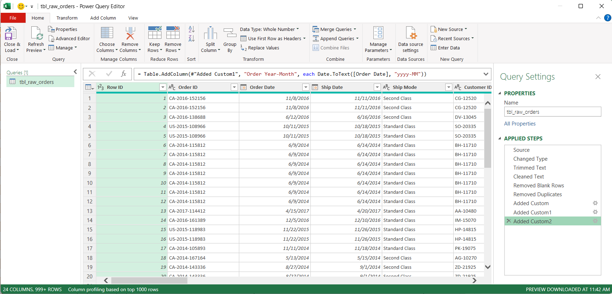
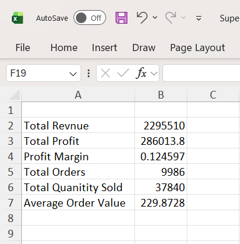
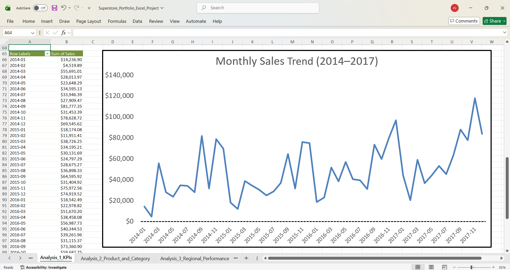
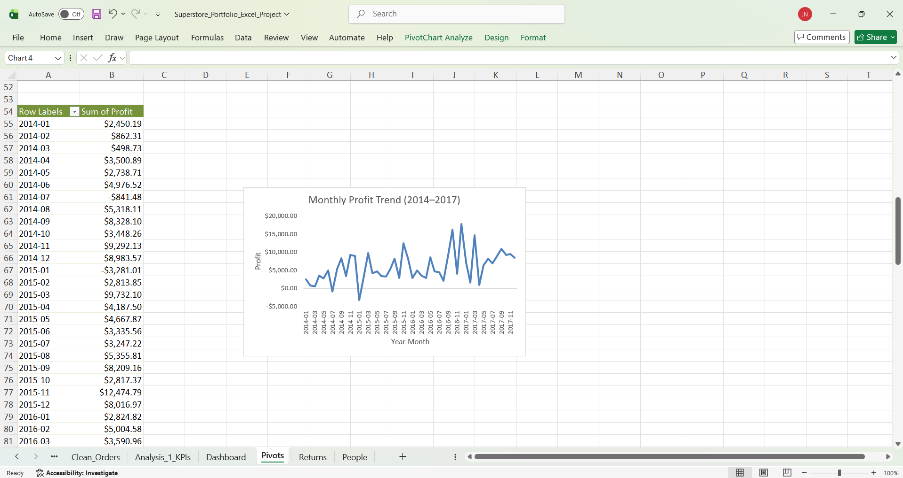
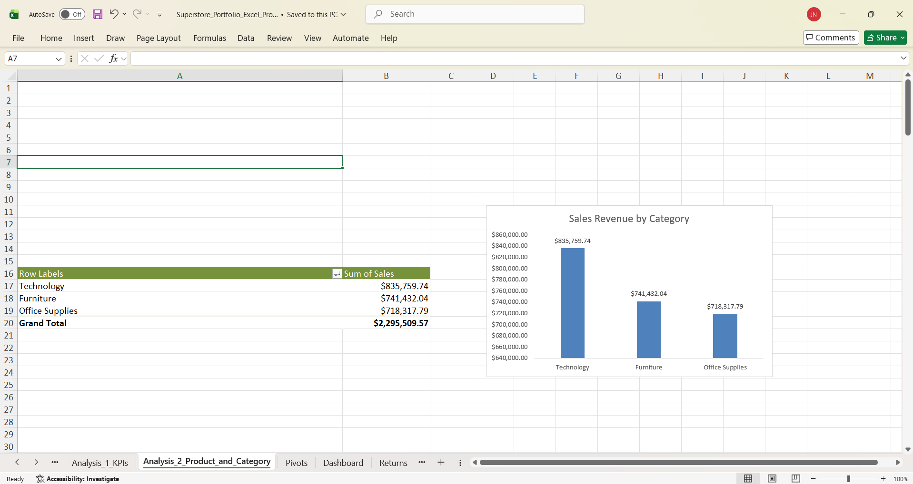
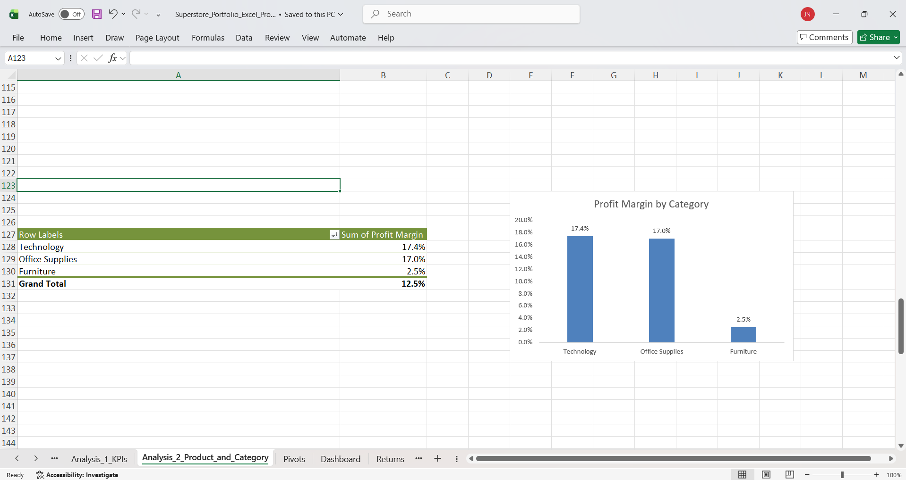
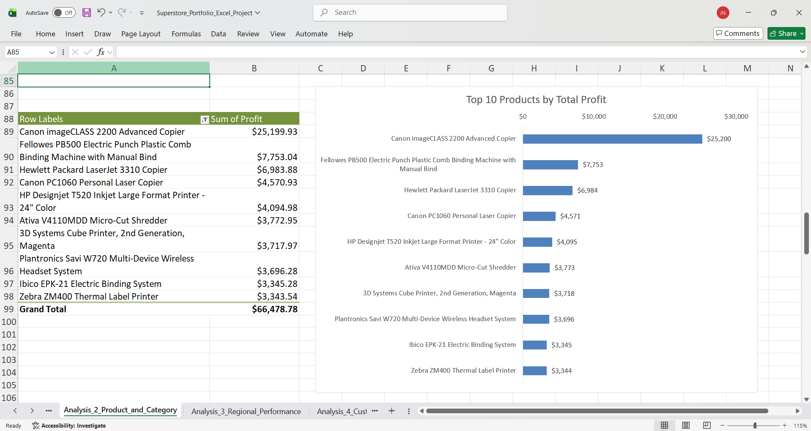

<a href="/projects" class="back-btn">← Back to Projects</a>

# Sales Dashboard – Superstore Dataset (Excel)

> An end-to-end Excel analytics project demonstrating data cleaning, KPI development, pivot-table analysis, and executive dashboard design using a widely used public retail sample dataset.

---

  
<strong>Project Overview</strong>

  <h2>Overview</h2>
  

    This project analyzes retail sales data using Microsoft Excel to uncover trends in revenue, profit, customer segments, and regional performance.
    The goal is to demonstrate real-world Excel analytics skills used in business environments.
  

  

  <h2>Business Context</h2>
  

    This analysis simulates a retail company evaluating sales performance, profitability, customer behavior, and operational efficiency
    to support data-driven decision making by executives and category managers.
  

  

  <h2>Objectives</h2>
  <ul>
    <li>Build and calculate key business KPIs (revenue, profit, profit margin, units sold, return rate)</li>
    <li>Clean and transform raw data using Power Query</li>
    <li>Perform analysis using pivot tables and calculated fields</li>
    <li>Design an interactive executive-style dashboard</li>
  </ul>

  

  <h2>Dataset Overview</h2>
  

    The Superstore dataset is a public retail transaction dataset commonly used for analytics and business intelligence practice.
    It represents order-level sales data for a fictional office supply retailer.
  

  
<strong>Key tables / structure:</strong>

  <ul>
    <li>Orders (order date, ship date, customer, segment, region, product, category, sales, profit, quantity)</li>
    <li>Returns (returned flag by order ID)</li>
  </ul>

  

    <strong>Time range:</strong> 2014–2017 
    <strong>Granularity:</strong> One row per order line item 
    <strong>Records:</strong> ~10,000 rows
  

  
<strong>Key dimensions:</strong>

  <ul>
    <li>Customer segment</li>
    <li>Product category & sub-category</li>
    <li>Region, state, city</li>
    <li>Order & ship dates</li>
  </ul>

  
<strong>Key measures:</strong>

  <ul>
    <li>Sales (revenue)</li>
    <li>Profit</li>
    <li>Quantity</li>
  </ul>

  
<strong>Limitations:</strong>

  <ul>
    <li>Fictional data (not from a real company)</li>
    <li>No marketing or acquisition channel data</li>
    <li>Limited customer demographics</li>
    <li>Returns data may be incomplete depending on version</li>
  </ul>

  

  <h2>Tools & Skills Demonstrated</h2>

  
<strong>Data Preparation</strong>

  <ul>
    <li>Power Query</li>
    <li>Data validation & normalization</li>
  </ul>

  
<strong>Analysis</strong>

  <ul>
    <li>Pivot tables</li>
    <li>Calculated fields</li>
    <li>KPI modeling</li>
  </ul>

  
<strong>Excel Functions</strong>

  <ul>
    <li>XLOOKUP</li>
    <li>SUMIFS / COUNTIFS</li>
    <li>IF / IFERROR</li>
    <li>Date & text functions</li>
  </ul>

  
<strong>Visualization</strong>

  <ul>
    <li>Pivot charts</li>
    <li>Conditional formatting</li>
    <li>Slicers & timelines</li>
    <li>Dashboard layout design</li>
  </ul>

  

  <h2>KPI Definitions</h2>
  <ul>
    <li><strong>Revenue</strong> = SUM(Sales)</li>
    <li><strong>Profit</strong> = SUM(Profit)</li>
    <li><strong>Profit Margin</strong> = Profit / Revenue</li>
    <li><strong>Units Sold</strong> = SUM(Quantity)</li>
    <li><strong>Return Rate</strong> = # Returned Orders / # Total Orders</li>
  </ul>

  

  <h2>Data Preparation</h2>
  <ul>
    <li>Removed duplicates and invalid records</li>
    <li>Standardized date formats and categories</li>
    <li>Created calculated columns for profit margin and return flags</li>
    <li>Built a clean analysis table using Power Query</li>
  </ul>

---

  
<strong>Data Preparation</strong>

  

    Before building KPIs, pivot tables, and charts, I cleaned and standardized the Superstore Orders dataset using
    <strong>Excel Power Query</strong>. The goal was to create a reliable, refreshable table (<code>Clean_Orders</code>)
    that serves as the single source of truth for all downstream analysis and dashboarding.
  

  <h3>Overview</h3>
  <ul>
    <li><strong>Input:</strong> Raw Superstore Orders data (<code>.xls</code>) preserved as <code>Raw_Orders</code> (no manual edits).</li>
    <li><strong>Tool:</strong> Excel Power Query (Get &amp; Transform).</li>
    <li><strong>Output:</strong> Cleaned dataset loaded into <code>Clean_Orders</code>.</li>
    <li><strong>Why Power Query:</strong> Transformations are documented, repeatable, and refreshable.</li>
  </ul>

  <h3>Power Query Applied Steps (Evidence)</h3>
  

    The screenshot below shows the Power Query Editor with the <em>Applied Steps</em> panel, documenting the full
    cleaning pipeline from raw input to cleaned output.
  

  <figure style="margin: 0;">
    
    <figcaption style="font-size: 0.95em; color: #555; margin-top: 6px;">
      Power Query: applied transformations used to produce <code>Clean_Orders</code>.
    </figcaption>
  </figure>

  <h3>Cleaning &amp; Transformation Steps</h3>

  <h4>1) Import &amp; Preserve Raw Data</h4>
  <ul>
    <li>Imported the dataset into Power Query Editor and preserved the original <code>Raw_Orders</code> table unchanged.</li>
  </ul>

  <h4>2) Standardize Column Data Types</h4>
  <ul>
    <li>Converted <code>Order Date</code> and <code>Ship Date</code> from DateTime to Date-only values.</li>
    <li>Set <code>Postal Code</code> to Text to preserve leading zeros.</li>
    <li>Validated numeric fields (<code>Sales</code>, <code>Profit</code>, <code>Discount</code>, <code>Quantity</code>) as numeric types.</li>
    <li>Ensured IDs and categorical fields were treated as text for stable grouping and filtering.</li>
  </ul>

  <h4>3) Clean Text Fields</h4>
  <ul>
    <li>Trimmed whitespace and removed non-printable characters across key text columns.</li>
    <li>Standardized customer/product and category/geographic fields to improve pivot consistency.</li>
  </ul>

  <h4>4) Remove Blank / Invalid Rows</h4>
  <ul>
    <li>Removed blank rows and incomplete records that could distort summaries and charts.</li>
  </ul>

  <h4>5) Remove Duplicate Records</h4>
  <ul>
    <li>Removed duplicates using a composite key: <code>Order ID + Product ID</code>.</li>
    <li>Ensured each row represents a unique product line within an order.</li>
  </ul>

  <h4>6) Create Derived Time Fields</h4>
  <ul>
    <li>Created <code>Order Year</code>, <code>Order Month</code>, and <code>Order Year-Month</code> (YYYY-MM) for time-series analysis.</li>
  </ul>

  <h4>7) Load Output to <code>Clean_Orders</code></h4>
  <ul>
    <li>Loaded the transformed result into <code>Clean_Orders</code>, which serves as the source for all pivots, charts, and KPIs.</li>
  </ul>

---

  
<strong>Analysis 1 – Sales & Profit Trends Over Time</strong>

  

  

  <h3>Business Question</h3>
  

    How have sales and profitability evolved over time from 2014 to 2017? Are there observable trends, seasonality,
    or periods of financial volatility that could inform forecasting, inventory planning, and cost control strategies?
  

  <h3>Method</h3>
  <ul>
    <li>Used the cleaned <code>Clean_Orders</code> table as the data source.</li>
    <li>Built pivot tables grouped by <code>Order Year-Month</code>.</li>
    <li>Created line charts to visualize monthly revenue and monthly profit.</li>
    <li>Calculated key performance indicators (KPIs) to contextualize trends.</li>
  </ul>

  <h3>Key Performance Indicators (Overall)</h3>
  <figure style="margin: 0 0 16px 0;">
    
    <figcaption style="font-size: 0.95em; color: #555; margin-top: 6px;">
      Overall revenue, profit, profit margin, total orders, units sold, and average order value.
    </figcaption>
  </figure>

  <h3>Monthly Sales Trend</h3>
  <figure style="margin: 0 0 16px 0;">
    
    <figcaption style="font-size: 0.95em; color: #555; margin-top: 6px;">
      Monthly revenue trend grouped by year and month.
    </figcaption>
  </figure>

  <h3>Monthly Profit Trend</h3>
  <figure style="margin: 0 0 16px 0;">
    
    <figcaption style="font-size: 0.95em; color: #555; margin-top: 6px;">
      Monthly profit trend highlighting volatility and negative-profit periods.
    </figcaption>
  </figure>

  <h3>Insights</h3>
  <ul>
    <li>Revenue shows a clear upward long-term trend, indicating overall business growth.</li>
    <li>Sales exhibit strong seasonality, with recurring spikes toward the end of each year.</li>
    <li>Profit is significantly more volatile than revenue, with several months operating at a loss.</li>
    <li>Early years show more frequent negative-profit periods, while later years appear more stable.</li>
    <li>Revenue growth does not always translate proportionally to profit growth, suggesting cost or discount pressure.</li>
  </ul>

  <h3>Business Recommendations</h3>
  <ul>
    <li>Increase inventory and staffing ahead of Q4 to capitalize on predictable seasonal demand.</li>
    <li>Investigate negative-profit months to identify unprofitable products, excessive discounting, or high shipping costs.</li>
    <li>Introduce profit-based performance monitoring in addition to revenue targets.</li>
    <li>Develop short-term sales and profit forecasts using historical seasonality patterns.</li>
    <li>Evaluate pricing and logistics strategies to stabilize margins during high-growth periods.</li>
  </ul>

---

<strong>Analysis 2 – Product & Category Performance</strong>

 

<h3>Business Question</h3>

Which product categories and individual products contribute the most to revenue and profit? 
Are there meaningful differences in profitability across categories that could inform pricing, 
inventory, and product strategy?

<h3>Method</h3>

<ul>
  <li>Used the cleaned <code>Clean_Orders</code> table as the data source.</li>
  <li>Built pivot tables grouped by <strong>Category</strong> to calculate:
    <ul>
      <li>Total Sales (Revenue)</li>
      <li>Total Profit</li>
      <li>Profit Margin (calculated field = Profit / Sales)</li>
    </ul>
  </li>
  <li>Built a pivot table grouped by <strong>Product Name</strong> and sorted by <strong>Sum of Profit (descending)</strong> to identify the top 10 most profitable products.</li>
  <li>Created column and bar charts to visualize category-level and product-level performance.</li>
</ul>

<h3>Sales Revenue by Category</h3>

<h3>Profit by Category</h3>

<h3>Profit Margin by Category</h3>

<h3>Top 10 Products by Total Profit</h3>

<h3>Insights</h3>

<ul>
  <li><strong>Technology</strong> generates the highest revenue and profit among all categories, making it the strongest overall performer.</li>
  <li><strong>Office Supplies</strong> generates substantial revenue and maintains a strong profit margin comparable to Technology.</li>
  <li><strong>Furniture</strong> produces high revenue but significantly lower profit and profit margin, indicating weaker efficiency.</li>
  <li>Profit margins vary substantially by category:
    <ul>
      <li>Technology and Office Supplies operate near ~17% margins.</li>
      <li>Furniture operates near ~2–3%, signaling potential pricing or cost issues.</li>
    </ul>
  </li>
  <li>A small number of products account for a disproportionately large share of total profit, indicating a strong long-tail distribution of product performance.</li>
</ul>

<h3>Business Recommendations</h3>

<ul>
  <li>Prioritize inventory availability and marketing investment for <strong>Technology</strong> and <strong>Office Supplies</strong>, as they deliver both high revenue and strong margins.</li>
  <li>Conduct a pricing, discounting, and cost analysis for <strong>Furniture</strong> to improve profitability or reconsider product assortment.</li>
  <li>Protect and monitor the <strong>top-profit products</strong> closely to avoid stockouts or supplier disruptions.</li>
  <li>Use product-level profit rankings to guide:
    <ul>
      <li>Promotional strategy</li>
      <li>Product bundling</li>
      <li>Discontinuation of consistently low-margin items</li>
    </ul>
  </li>
  <li>Introduce margin-based KPIs alongside revenue targets to avoid growth that erodes profitability.</li>
</ul>

---

  
<strong>Analysis 3 — Regional Performance & Market Efficiency</strong>

  <h3>Business Question</h3>
  

    Which regions are driving the most revenue and profit, and where are we seeing efficiency gaps (low profit margin)?
    Which states and cities are the biggest profit contributors—and which locations are consistently unprofitable and may require corrective action?
  

  <h3>Method</h3>
  <ul>
    <li>Used the cleaned <code>Clean_Orders</code> table as the source for all pivots.</li>
    <li>Built region-level pivots for <strong>Total Sales</strong>, <strong>Total Profit</strong>, and <strong>Profit Margin</strong> (calculated field = Profit / Sales).</li>
    <li>Created ranked pivots for <strong>Top 10</strong> and <strong>Bottom 10</strong> <strong>States</strong> and <strong>Cities</strong> by <strong>Sum of Profit</strong>.</li>
    <li>Visualized results with column and horizontal bar charts and added data labels for readability.</li>
  </ul>

  <h3>Sales Revenue by Region</h3>
  

  <h3>Profit by Region</h3>
  

  <h3>Profit Margin by Region</h3>
  

  <h3>Top 10 States by Profit</h3>
  

  <h3>Top 10 Cities by Profit</h3>
  

  <h3>Bottom 10 States by Profit</h3>
  

  <h3>Bottom 10 Cities by Profit</h3>
  

  <h3>Insights</h3>
  <ul>
    <li>High sales regions do not always correspond to high profit margins, indicating efficiency differences.</li>
    <li>A small group of states and cities contribute a disproportionate share of total profit.</li>
    <li>Several locations consistently generate losses, likely due to discounting, shipping costs, or unfavorable product mix.</li>
  </ul>

  <h3>Recommendations</h3>
  <ul>
    <li>Prioritize inventory availability and marketing in top-profit states and cities.</li>
    <li>Analyze margin drivers by category, discount level, and shipping mode in low-margin regions.</li>
    <li>Revisit pricing strategy, discount policies, and fulfillment costs in chronically unprofitable locations.</li>
  </ul>

---

  
<strong>Analysis 4 — Customer Segment Analysis</strong>

<strong>Business Question:</strong>

  
(write your question here)

  
<strong>Data &amp; Method:</strong>

  
(describe what you built in Excel: pivots, KPIs, calculated fields, slicers, charts)

  
<strong>Key Findings:</strong>

  <ul>
    <li>(finding 1)</li>
    <li>(finding 2)</li>
    <li>(finding 3)</li>
  </ul>

  
<strong>Business Recommendations:</strong>

  <ul>
    <li>(recommendation 1)</li>
    <li>(recommendation 2)</li>
    <li>(recommendation 3)</li>
  </ul>

---

  
<strong>Analysis 5 — Returns Analysis &amp; Revenue Impact</strong>

<strong>Business Question:</strong>

  
(write your question here)

  
<strong>Data &amp; Method:</strong>

  
(describe what you built in Excel: pivots, KPIs, calculated fields, slicers, charts)

  
<strong>Key Findings:</strong>

  <ul>
    <li>(finding 1)</li>
    <li>(finding 2)</li>
    <li>(finding 3)</li>
  </ul>

  
<strong>Business Recommendations:</strong>

  <ul>
    <li>(recommendation 1)</li>
    <li>(recommendation 2)</li>
    <li>(recommendation 3)</li>
  </ul>

---

  
<strong>Project Implementation &amp; Deliverables</strong>

  <h2>Workbook Structure</h2>
  <ul>
    <li>Raw Data (original import)</li>
    <li>Power Query (cleaning steps)</li>
    <li>Analysis Table (final cleaned table)</li>
    <li>Pivot Tables (model + calculations)</li>
    <li>Dashboard (final presentation)</li>
  </ul>

  

  <h2>Dashboard Features</h2>
  <ul>
    <li>Interactive slicers for region, category, and time</li>
    <li>KPI summary cards</li>
    <li>Trend visualizations</li>
    <li>Top / bottom product rankings</li>
    <li>Dynamic filtering across all charts</li>
  </ul>

  

  <h2>Final Dashboard</h2>
  
(Screenshot will be added here)

  

  <h2>Project Deliverables</h2>
  <ul>
    <li>Fully interactive Excel dashboard workbook</li>
    <li>Cleaned analysis-ready dataset</li>
    <li>SQL-style business question documentation</li>
  </ul>

  

  <h2>Files</h2>
  <ul>
    <li>Raw dataset</li>
    <li>Cleaned dataset</li>
    <li>Excel workbook</li>
  </ul>

  

  <h2>Conclusion</h2>
  
(Concluding statements)

