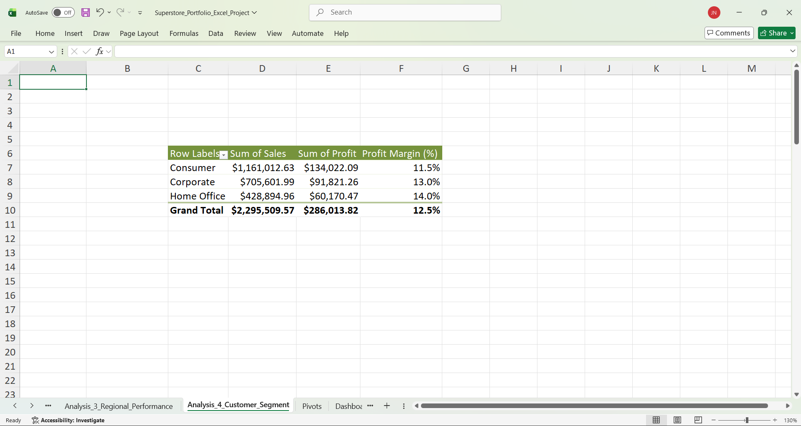
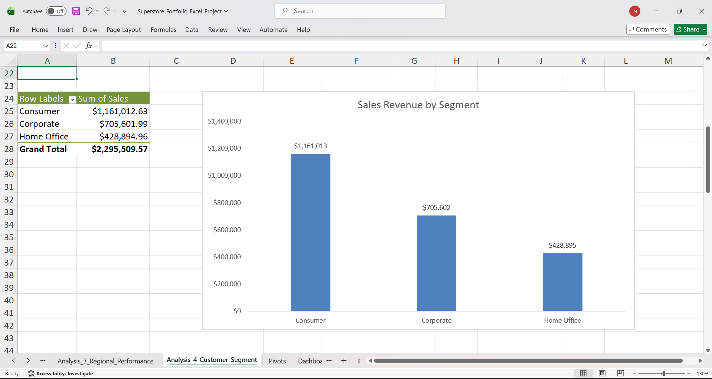
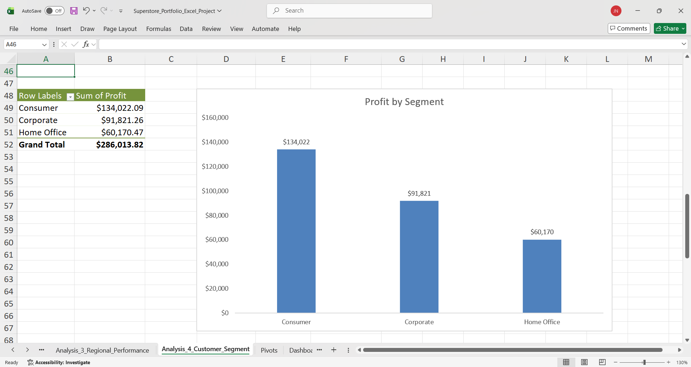
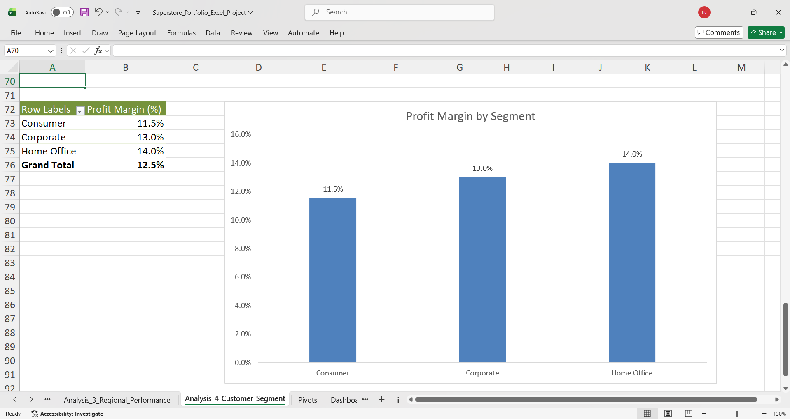
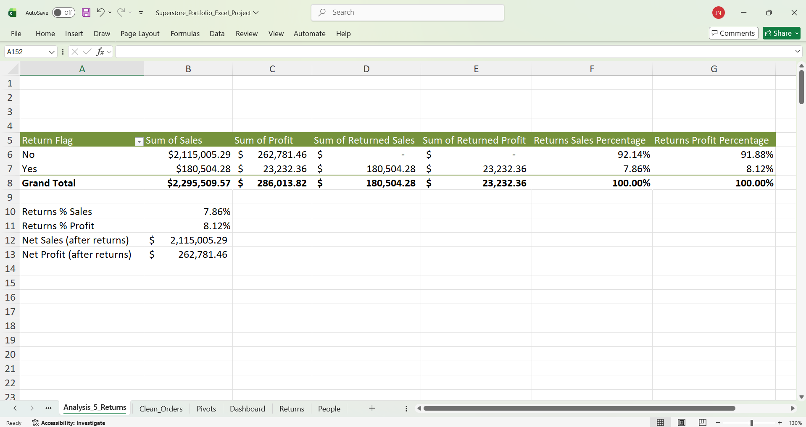
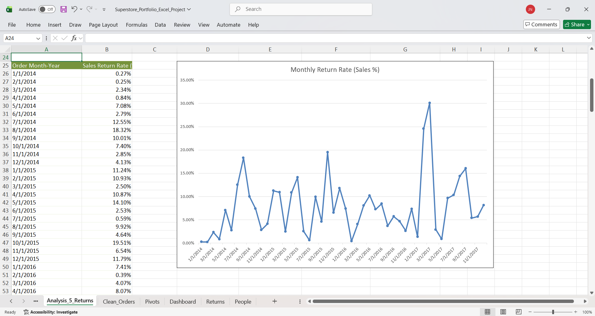
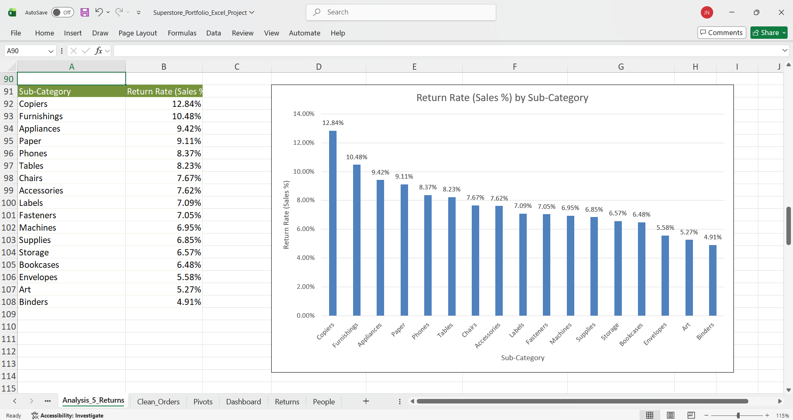
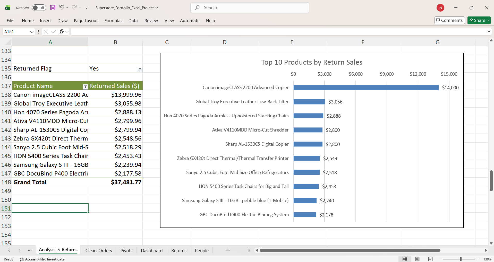
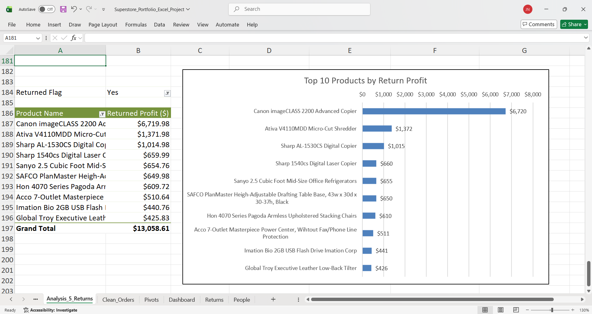

<a href="/projects" class="back-btn">← Back to Projects</a>

# Sales Dashboard – Superstore Dataset (Excel)

> An end-to-end Excel analytics project demonstrating data cleaning, KPI development, pivot-table analysis, and executive dashboard design using a widely used public retail sample dataset.

---

  
<strong>Project Overview</strong>

  <h3>Overview</h3>
  

    This project analyzes Superstore retail sales data in Microsoft Excel to uncover trends in revenue, profit,
    customer segments, and regional performance. The goal is to demonstrate practical Excel analytics skills
    used in business environments—data cleaning (Power Query), pivot-based analysis, KPI modeling, and dashboard design.
  

  <h3>Business Context</h3>
  

    This analysis simulates a retail company evaluating sales performance, profitability, customer behavior,
    and operational efficiency to support data-driven decision making by executives and category managers.
  

  <h3>Objectives</h3>
  <ul>
    <li>Define and calculate core KPIs: revenue, profit, profit margin, units sold, and return rate</li>
    <li>Clean and standardize raw orders using Power Query (types, trimming/cleaning text fields, deduping)</li>
    <li>Analyze performance using pivot tables and calculated fields (time trends, product mix, regional efficiency)</li>
    <li>Build an executive-style dashboard with slicers/timelines for interactive exploration</li>
  </ul>

  <h3>Dataset Overview</h3>
  

    The Superstore dataset is a public retail transaction dataset commonly used for analytics and BI practice.
    It contains order-level sales data for a fictional office supply retailer.
  

  
<strong>At a glance</strong>

  <ul>
    <li><strong>Time range:</strong> 2014–2017</li>
    <li><strong>Granularity:</strong> one row per order line item</li>
    <li><strong>Size:</strong> ~10,000 rows</li>
    <li><strong>Core tables:</strong> Orders, Returns</li>
  </ul>

  
<strong>Key fields</strong>

  <ul>
    <li><strong>Dimensions:</strong> segment, category/sub-category, region/state/city, order/ship dates</li>
    <li><strong>Measures:</strong> sales (revenue), profit, quantity</li>
  </ul>

  
<strong>Limitations</strong>

  <ul>
    <li>Fictional data (not from a real company)</li>
    <li>No marketing/acquisition channel data</li>
    <li>Limited customer demographics</li>
    <li>Returns coverage depends on dataset version</li>
  </ul>

  <h3>Tools &amp; Skills Demonstrated</h3>
  <ul>
    <li><strong>Power Query:</strong> ETL, data types, text cleanup, de-duplication, derived date fields</li>
    <li><strong>Pivot Tables:</strong> grouping, sorting, filters, calculated fields</li>
    <li><strong>KPI Modeling:</strong> profit margin, return rate, performance comparisons</li>
    <li><strong>Excel Functions:</strong> XLOOKUP, SUMIFS/COUNTIFS, IF/IFERROR, date &amp; text functions</li>
    <li><strong>Visualization:</strong> pivot charts, conditional formatting, slicers/timelines, dashboard layout</li>
  </ul>

  <h3>KPI Definitions</h3>
  <ul>
    <li><strong>Revenue:</strong> SUM(Sales)</li>
    <li><strong>Profit:</strong> SUM(Profit)</li>
    <li><strong>Profit Margin:</strong> Profit / Revenue</li>
    <li><strong>Units Sold:</strong> SUM(Quantity)</li>
    <li><strong>Return Rate:</strong> # Returned Orders / # Total Orders</li>
  </ul>

  <h3>Data Preparation</h3>
  <ul>
    <li>Removed duplicates and invalid records</li>
    <li>Standardized date formats and category/location text fields</li>
    <li>Created derived columns (e.g., Year, Month, Year-Month; optional Profit Margin)</li>
    <li>Loaded a clean analysis table for pivots and dashboarding</li>
  </ul>

---

  
<strong>Data Preparation</strong>

  

    Before building KPIs, pivot tables, and charts, I cleaned and standardized the Superstore Orders dataset using
    <strong>Excel Power Query</strong>. The goal was to create a reliable, refreshable table (<code>Clean_Orders</code>)
    that serves as the single source of truth for all downstream analysis and dashboarding.
  

  <h3>ETL Overview (At a Glance)</h3>
  <ul>
    <li><strong>Input:</strong> Raw Superstore Orders data (<code>.xls</code>) preserved as <code>Raw_Orders</code> (no manual edits).</li>
    <li><strong>Tool:</strong> Excel Power Query (Get &amp; Transform).</li>
    <li><strong>Query:</strong> Power Query pipeline documented in the Applied Steps panel (repeatable transformations).</li>
    <li><strong>Output:</strong> Cleaned dataset loaded into <code>Clean_Orders</code> (used by all pivots, charts, and KPIs).</li>
    <li><strong>Refreshability:</strong> Updates can be applied via <em>Data → Refresh All</em> without redoing manual steps.</li>
  </ul>

  <h3>Power Query Applied Steps (Evidence)</h3>
  

    The screenshot below shows the Power Query Editor with the <em>Applied Steps</em> panel, documenting the cleaning pipeline
    (e.g., Source → Changed Type → Trim/Clean Text → Remove blanks/duplicates → Add derived columns). This provides traceable
    evidence of the transformation workflow.
  

  <figure style="margin: 0;">
    
    <figcaption style="font-size: 0.95em; color: #555; margin-top: 6px;">
      Power Query Editor showing Applied Steps used to produce <code>Clean_Orders</code>.
      
        <a href="images/excel-data-prep-power-query.png">Open full-size</a>
      
    </figcaption>
  </figure>

  <h3>Cleaning &amp; Transformation Steps</h3>
  <ol>
    <li>
      <strong>Import &amp; Preserve Raw Data (Source)</strong>
      <ul>
        <li>Imported the dataset into Power Query and preserved the original <code>Raw_Orders</code> table unchanged.</li>
      </ul>
    </li>

    <li>
      <strong>Standardize Data Types (Changed Type)</strong>
      <ul>
        <li>Converted <code>Order Date</code> and <code>Ship Date</code> from DateTime to Date-only values for consistent time grouping.</li>
        <li>Set <code>Postal Code</code> to Text to preserve leading zeros.</li>
        <li>Validated numeric fields (<code>Sales</code>, <code>Profit</code>, <code>Discount</code>, <code>Quantity</code>) as numeric types.</li>
        <li>Ensured IDs and categorical fields were treated as text for stable grouping/filtering in pivots.</li>
      </ul>
    </li>

    <li>
      <strong>Clean Text Columns (Trimmed Text / Cleaned Text)</strong>
      <ul>
        <li>Trimmed whitespace and removed non-printable characters across key text columns.</li>
        <li>Standardized customer/product and category/geographic fields to prevent “duplicate label” issues in pivots.</li>
      </ul>
    </li>

    <li>
      <strong>Remove Blank / Invalid Records (Removed Blank Rows)</strong>
      <ul>
        <li>Removed blank rows and incomplete records that could distort KPI totals and chart trends.</li>
      </ul>
    </li>

    <li>
      <strong>Remove Duplicate Records (Removed Duplicates)</strong>
      <ul>
        <li>Removed duplicates using a composite key: <code>Order ID + Product ID</code>.</li>
        <li>Ensured each row represents a unique product line within an order (avoids double-counting revenue/profit).</li>
      </ul>
    </li>

    <li>
      <strong>Create Derived Time Fields (Added Custom Columns)</strong>
      <ul>
        <li>Created <code>Order Year</code>, <code>Order Month</code>, and <code>Order Year-Month</code> (YYYY-MM) for time-series analysis.</li>
        <li>These fields support consistent monthly trend pivots and timeline/slicer-friendly reporting.</li>
      </ul>
    </li>

    <li>
      <strong>Load Output to <code>Clean_Orders</code></strong>
      <ul>
        <li>Loaded the transformed result into <code>Clean_Orders</code>, which serves as the source for all pivots, charts, and KPIs.</li>
      </ul>
    </li>
  </ol>

  <h3>Data Quality Checks (Validation)</h3>
  <ul>
    <li>Verified key fields required for analysis (dates, location, category, sales, profit) were populated and correctly typed.</li>
    <li>Confirmed Postal Codes remain stable as text (prevents grouping errors from dropped leading zeros).</li>
    <li>Reviewed that duplicates were removed to prevent inflated revenue/profit totals.</li>
  </ul>

  <h3>Why This Matters</h3>
  <ul>
    <li><strong>Accuracy:</strong> Removing duplicates and invalid rows prevents inflated KPIs and misleading rankings.</li>
    <li><strong>Consistency:</strong> Cleaned text + standardized types eliminate pivot inconsistencies (e.g., “NY” vs “NY ”).</li>
    <li><strong>Repeatability:</strong> Power Query steps are documented and refreshable, enabling a maintainable analytics workflow.</li>
  </ul>

---

  
<strong>Analysis 1 – Sales & Profit Trends Over Time</strong>

  

  

  <h3>Business Question</h3>
  

    How have sales and profitability evolved over time from 2014 to 2017? Are there observable trends, seasonality,
    or periods of financial volatility that could inform forecasting, inventory planning, and cost control strategies?
  

  <h3>Method</h3>
  <ul>
    <li>Used the cleaned <code>Clean_Orders</code> table as the data source.</li>
    <li>Built pivot tables grouped by <code>Order Year-Month</code>.</li>
    <li>Created line charts to visualize monthly revenue and monthly profit.</li>
    <li>Calculated key performance indicators (KPIs) to contextualize trends.</li>
  </ul>

  <h3>Key Performance Indicators (Overall)</h3>
  <figure style="margin: 0 0 16px 0;">
    
    <figcaption style="font-size: 0.95em; color: #555; margin-top: 6px;">
      Overall revenue, profit, profit margin, total orders, units sold, and average order value.
    </figcaption>
  </figure>

  <h3>Monthly Sales Trend</h3>
  <figure style="margin: 0 0 16px 0;">
    
    <figcaption style="font-size: 0.95em; color: #555; margin-top: 6px;">
      Monthly revenue trend grouped by year and month.
    </figcaption>
  </figure>

  <h3>Monthly Profit Trend</h3>
  <figure style="margin: 0 0 16px 0;">
    
    <figcaption style="font-size: 0.95em; color: #555; margin-top: 6px;">
      Monthly profit trend highlighting volatility and negative-profit periods.
    </figcaption>
  </figure>

  <h3>Insights</h3>
  <ul>
    <li><strong>Growth is clear over time:</strong> the revenue line shows a sustained upward trend from 2014 through 2017, indicating expanding sales volume and/or higher order values.</li>
    <li><strong>Seasonality is consistent:</strong> revenue spikes recur late each year (Q4), suggesting predictable holiday/EOY purchasing behavior that can be planned for.</li>
    <li><strong>Profit is more volatile than revenue:</strong> the profit line shows sharper swings than sales and includes several negative months, meaning some periods are generating revenue but destroying margin.</li>
    <li><strong>Margin pressure appears during certain periods:</strong> revenue growth does not always translate proportionally into profit growth, pointing to discounting, shipping costs, or product-mix shifts as likely drivers.</li>
    <li><strong>Stability improves later:</strong> later years look less frequently negative, suggesting operational improvements or a healthier mix—worth understanding so those drivers can be replicated.</li>
  </ul>

  <h3>Business Recommendations</h3>
  <ul>
    <li><strong>Plan for Q4 demand:</strong> increase inventory coverage and fulfillment capacity ahead of seasonal spikes to reduce stockouts and expedite costs while capturing predictable demand.</li>
    <li><strong>Build a “loss month drilldown”:</strong> create a pivot that filters to negative-profit months and breaks results down by <em>Sub-Category</em>, <em>Discount band</em>, and <em>Ship Mode</em> to identify the primary margin killers.</li>
    <li><strong>Set discount guardrails:</strong> implement rules such as “no discounts above X% for low-margin sub-categories” and require approval if projected line margin falls below a threshold.</li>
    <li><strong>Reduce shipping-driven margin erosion:</strong> analyze loss months by shipping mode and test policies like higher free-shipping thresholds, bundling incentives, or prioritizing cost-efficient ship modes.</li>
    <li><strong>Track profit alongside revenue:</strong> add profit margin as a first-class KPI on the dashboard and monitor it monthly so revenue growth doesn’t hide profitability deterioration.</li>
    <li><strong>Forecast using seasonality:</strong> use historical Year–Month patterns to build a simple revenue/profit forecast (baseline + seasonal uplift) to improve budgeting and inventory planning.</li>
  </ul>

---

  
<strong>Analysis 2 – Product &amp; Category Performance</strong>

  

  

  <h3>Business Question</h3>
  

    Which product categories and individual products contribute the most to revenue and profit?
    Are there meaningful differences in profitability across categories that should inform pricing,
    discounting, inventory, and product strategy?
  

  <h3>Method</h3>
  <ul>
    <li>Used the cleaned <code>Clean_Orders</code> table as the data source.</li>
    <li>Built category-level pivots for <strong>Total Sales (Revenue)</strong>, <strong>Total Profit</strong>, and <strong>Profit Margin</strong> (Profit / Sales).</li>
    <li>Built a product-level pivot and sorted by <strong>Sum of Profit (descending)</strong> to identify the top 10 most profitable products.</li>
    <li>Created column and horizontal bar charts with data labels for fast comparison.</li>
  </ul>

  <h3>Category KPI Summary</h3>
  

    Summary of category performance (values from pivots). This table highlights the revenue–profit tradeoff and where margin efficiency differs.
  

  <table style="border-collapse: collapse; width: 100%; max-width: 760px; margin-bottom: 14px;">
    <thead>
      <tr>
        <th style="text-align:left; border-bottom: 2px solid #ddd; padding: 8px 6px;">Category</th>
        <th style="text-align:right; border-bottom: 2px solid #ddd; padding: 8px 6px;">Revenue</th>
        <th style="text-align:right; border-bottom: 2px solid #ddd; padding: 8px 6px;">Profit</th>
        <th style="text-align:right; border-bottom: 2px solid #ddd; padding: 8px 6px;">Profit Margin</th>
      </tr>
    </thead>
    <tbody>
      <tr>
        <td style="padding: 8px 6px; border-bottom: 1px solid #eee;">Technology</td>
        <td style="padding: 8px 6px; text-align:right; border-bottom: 1px solid #eee;">$835,759.74</td>
        <td style="padding: 8px 6px; text-align:right; border-bottom: 1px solid #eee;">$145,386.13</td>
        <td style="padding: 8px 6px; text-align:right; border-bottom: 1px solid #eee;">17.4%</td>
      </tr>
      <tr>
        <td style="padding: 8px 6px; border-bottom: 1px solid #eee;">Office Supplies</td>
        <td style="padding: 8px 6px; text-align:right; border-bottom: 1px solid #eee;">$718,317.79</td>
        <td style="padding: 8px 6px; text-align:right; border-bottom: 1px solid #eee;">$122,247.40</td>
        <td style="padding: 8px 6px; text-align:right; border-bottom: 1px solid #eee;">17.0%</td>
      </tr>
      <tr>
        <td style="padding: 8px 6px; border-bottom: 1px solid #eee;">Furniture</td>
        <td style="padding: 8px 6px; text-align:right; border-bottom: 1px solid #eee;">$741,432.04</td>
        <td style="padding: 8px 6px; text-align:right; border-bottom: 1px solid #eee;">$18,380.28</td>
        <td style="padding: 8px 6px; text-align:right; border-bottom: 1px solid #eee;">2.5%</td>
      </tr>
      <tr>
        <td style="padding: 8px 6px; font-weight:700;">Total</td>
        <td style="padding: 8px 6px; text-align:right; font-weight:700;">$2,295,509.57</td>
        <td style="padding: 8px 6px; text-align:right; font-weight:700;">$286,013.82</td>
        <td style="padding: 8px 6px; text-align:right; font-weight:700;">12.5%</td>
      </tr>
    </tbody>
  </table>

  <h3>Sales Revenue by Category</h3>
  <figure style="margin: 0 0 16px 0;">
    
    <figcaption style="font-size:0.95em; color:#555; margin-top:6px;">
      Technology leads revenue, with Furniture and Office Supplies close behind.
    </figcaption>
  </figure>

  <h3>Profit by Category</h3>
  <figure style="margin: 0 0 16px 0;">
    
    <figcaption style="font-size:0.95em; color:#555; margin-top:6px;">
      Profit is concentrated in Technology and Office Supplies; Furniture contributes comparatively little profit.
    </figcaption>
  </figure>

  <h3>Profit Margin by Category</h3>
  <figure style="margin: 0 0 16px 0;">
    
    <figcaption style="font-size:0.95em; color:#555; margin-top:6px;">
      Technology (~17.4%) and Office Supplies (~17.0%) are high-efficiency categories; Furniture (~2.5%) is a margin outlier.
    </figcaption>
  </figure>

  <h3>Top 10 Products by Total Profit</h3>
  <figure style="margin: 0 0 16px 0;">
    
    <figcaption style="font-size:0.95em; color:#555; margin-top:6px;">
      Profit is “top-heavy”: the #1 product (Canon imageCLASS 2200 Advanced Copier) contributes $25,199.93 profit alone.
    </figcaption>
  </figure>

  <h3>Insights</h3>
  <ul>
    <li><strong>Technology is the best overall performer:</strong> highest revenue ($835.8K) and highest profit ($145.4K) with a strong margin (17.4%).</li>
    <li><strong>Office Supplies is nearly as efficient as Technology:</strong> margin is also ~17.0% while contributing $122.2K profit.</li>
    <li><strong>Furniture is the efficiency problem:</strong> despite high revenue ($741.4K), profit is only $18.4K and margin is ~2.5%, far below the overall 12.5% margin.</li>
    <li><strong>Profit is highly concentrated:</strong> Technology + Office Supplies account for ~94% of total profit, making these categories “must-protect” from margin erosion.</li>
    <li><strong>Product profits are top-heavy:</strong> the top 10 products generate $66.5K profit (~23% of total profit), and the top product alone contributes ~$25.2K (~9% of total profit), creating both opportunity and concentration risk.</li>
  </ul>

  <h3>Business Recommendations</h3>
  <ul>
    <li><strong>Scale what works:</strong> prioritize in-stock rates, merchandising, and targeted promotions for Technology and Office Supplies to protect the majority of profit contribution.</li>
    <li><strong>Fix Furniture margin with a drilldown:</strong> create pivots for Furniture by <em>Sub-Category</em> × <em>Discount band</em> × <em>Ship Mode</em> to identify whether losses come from discounting, freight, or mix.</li>
    <li><strong>Introduce discount guardrails:</strong> set category/sub-category discount limits and require approval if projected margin drops below a threshold (especially in Furniture).</li>
    <li><strong>Protect top-profit products:</strong> set reorder points and monitor supplier lead times for the top products; these drive a large share of profit and stockouts would be expensive.</li>
    <li><strong>Use profit-based KPIs:</strong> track profit margin by category monthly so revenue growth doesn’t mask margin deterioration.</li>
  </ul>

---

  
<strong>Analysis 3 — Regional Performance &amp; Market Efficiency</strong>

  <h3>Business Question</h3>
  

    Which regions are driving the most revenue and profit, and where are we seeing efficiency gaps (low profit margin)?
    Which states and cities are the biggest profit contributors—and which locations are consistently unprofitable and may require corrective action?
  

  <h3>Method</h3>
  <ul>
    <li>Used the cleaned <code>Clean_Orders</code> table as the source for all pivots.</li>
    <li>Built region-level pivots for <strong>Total Sales</strong>, <strong>Total Profit</strong>, and <strong>Profit Margin</strong> (calculated field = Profit / Sales).</li>
    <li>Created ranked pivots for <strong>Top 10</strong> and <strong>Bottom 10</strong> <strong>States</strong> and <strong>Cities</strong> by <strong>Sum of Profit</strong>.</li>
    <li>Visualized results with column and horizontal bar charts and added data labels for readability.</li>
  </ul>

  <h3>Sales Revenue by Region</h3>
  

    
  

  <h3>Profit by Region</h3>
  

    
  

  <h3>Profit Margin by Region</h3>
  

    
  

  <h3>Top 10 States by Profit</h3>
  

    
  

  <h3>Top 10 Cities by Profit</h3>
  

    
  

  <h3>Bottom 10 States by Profit</h3>
  

    
  

  <h3>Bottom 10 Cities by Profit</h3>
  

    
  

  <h3>Insights</h3>
  <ul>
    <li>
      <strong>West and East are the growth engines.</strong> West leads both revenue (~$725K) and profit (~$108K), with East close behind (~$678K revenue; ~$91K profit). :contentReference[oaicite:1]{index=1}
    </li>
    <li>
      <strong>Efficiency gap: Central is the margin problem.</strong> Central’s profit margin is ~<strong>7.9%</strong>, roughly half of West’s ~<strong>14.9%</strong>, despite Central producing meaningful revenue (~$501K). This is a classic sign of discount/shipping/product-mix pressure. :contentReference[oaicite:2]{index=2}
    </li>
    <li>
      <strong>Profit is highly concentrated in a few states.</strong> California (~$76K) and New York (~$74K) together generate about <strong>$150K</strong> profit—roughly <strong>half of total profit</strong> in this dataset (~$286K). This makes these markets “must-protect” from stockouts, service issues, or margin erosion. :contentReference[oaicite:3]{index=3}
    </li>
    <li>
      <strong>A few cities drive outsized profitability.</strong> New York City alone contributes ~<strong>$62K</strong> profit (about <strong>one-fifth</strong> of total profit), with Los Angeles and Seattle also major contributors. These metros are strong candidates for targeted campaigns and assortment expansion. :contentReference[oaicite:4]{index=4}
    </li>
    <li>
      <strong>Losses are localized—but material.</strong> The bottom 10 states total ~<strong>-$98K</strong> profit (Texas is the biggest drag at ~<strong>-$26K</strong>). These losses partially offset gains from the top-performing states. :contentReference[oaicite:5]{index=5}
    </li>
    <li>
      <strong>City-level loss pockets point to fixable operational issues.</strong> Philadelphia (~-$14K), Houston (~-$10K), and San Antonio (~-$7K) suggest recurring patterns such as heavy discounting, high freight costs, or a low-margin category mix in specific markets. :contentReference[oaicite:6]{index=6}
    </li>
  </ul>

  <h3>Business Recommendations</h3>
  <ul>
    <li>
      <strong>Defend and scale the profit core (West/East + top metros).</strong> Prioritize in-stock rates, faster fulfillment, and targeted promotions in top-profit states/cities (CA, NY; NYC, LA, Seattle) to protect the largest profit pools. :contentReference[oaicite:7]{index=7}
    </li>
    <li>
      <strong>Fix Central margin with a structured root-cause drilldown.</strong> For Central, build pivots by <em>Category → Sub-Category → Ship Mode</em> and add <em>Discount bands</em> (e.g., 0%, 1–10%, 11–20%, 21%+). Identify which combinations collapse margin and adjust pricing/discount rules accordingly. :contentReference[oaicite:8]{index=8}
    </li>
    <li>
      <strong>Implement discount guardrails tied to margin.</strong> Replace blanket discounting with rules like: “No discounts above X% on low-margin sub-categories” and “Require manager approval if projected line margin falls below a threshold.” This directly targets the gap between high revenue and low profitability. :contentReference[oaicite:9]{index=9}
    </li>
    <li>
      <strong>Create a “loss-market watchlist” and intervene systematically.</strong> Start with Texas, Ohio, Pennsylvania, Illinois, and the bottom-profit cities. For each, isolate the top 3 drivers of loss (sub-category, ship mode, discount band) and define a corrective action (pricing update, assortment change, shipping policy change). :contentReference[oaicite:10]{index=10}
    </li>
    <li>
      <strong>Reduce freight-driven losses with shipping policy tests.</strong> Test changes like: raising free-shipping thresholds, incentivizing lower-cost ship modes, or bundling orders to reduce per-order shipping cost—especially in chronic loss cities/states. :contentReference[oaicite:11]{index=11}
    </li>
    <li>
      <strong>Operationalize this into the dashboard.</strong> Add regional KPI cards (Revenue, Profit, Margin) plus a “Bottom Locations” table that updates with slicers. Track month-over-month movement so losses don’t persist unnoticed. :contentReference[oaicite:12]{index=12}
    </li>
  </ul>

---

  
<strong>Analysis 4 – Customer Segment Analysis</strong>

  

  

  <h3>Business Question</h3>
  

    Which customer segments drive the most revenue and profit, and which segments are the most efficient
    (highest profit margin)? How should the business prioritize growth, pricing, and retention strategies
    across <strong>Consumer</strong>, <strong>Corporate</strong>, and <strong>Home Office</strong>?
  

  <h3>Method</h3>
  <ul>
    <li>Used the cleaned <code>Clean_Orders</code> table as the data source.</li>
    <li>Built a pivot table grouped by <strong>Segment</strong> to calculate:
      <ul>
        <li><strong>Total Sales (Revenue)</strong> = Sum of Sales</li>
        <li><strong>Total Profit</strong> = Sum of Profit</li>
        <li><strong>Profit Margin (%)</strong> = Profit / Sales (calculated field)</li>
      </ul>
    </li>
    <li>Created separate column charts for Sales, Profit, and Profit Margin to make segment comparisons clear.</li>
  </ul>

  

  <h3>Segment KPI Summary</h3>
  <figure style="margin: 0 0 16px 0;">
    
    <figcaption style="font-size: 0.95em; color: #555; margin-top: 6px;">
      Summary pivot by Segment: Sales, Profit, and Profit Margin (%).
    </figcaption>
  </figure>

  <h3>Sales Revenue by Segment</h3>
  <figure style="margin: 0 0 16px 0;">
    
    <figcaption style="font-size: 0.95em; color: #555; margin-top: 6px;">
      Revenue contribution by segment: Consumer leads total revenue.
    </figcaption>
  </figure>

  <h3>Profit by Segment</h3>
  <figure style="margin: 0 0 16px 0;">
    
    <figcaption style="font-size: 0.95em; color: #555; margin-top: 6px;">
      Profit contribution by segment: Consumer generates the most total profit.
    </figcaption>
  </figure>

  <h3>Profit Margin by Segment</h3>
  <figure style="margin: 0 0 16px 0;">
    
    <figcaption style="font-size: 0.95em; color: #555; margin-top: 6px;">
      Profit margin efficiency by segment: Home Office has the highest margin.
    </figcaption>
  </figure>

  

  <h3>Insights</h3>
  <ul>
    <li>
      <strong>Consumer</strong> is the primary growth engine, generating the highest <strong>Sales</strong>
      (<strong>$1,161,012.63</strong>) and the highest <strong>Profit</strong> (<strong>$134,022.09</strong>).
      However, it has the <strong>lowest profit margin</strong> at <strong>11.5%</strong>, suggesting heavier discounting,
      higher fulfillment costs, or a greater mix of low-margin products.
    </li>
    <li>
      <strong>Corporate</strong> produces solid performance with <strong>$705,601.99</strong> in sales and
      <strong>$91,821.26</strong> in profit, while maintaining a stronger <strong>13.0% margin</strong>.
      This segment appears more efficient than Consumer and may be less price-sensitive or have more repeatable order patterns.
    </li>
    <li>
      <strong>Home Office</strong> is the most efficient segment with the <strong>highest profit margin</strong>
      (<strong>14.0%</strong>) but contributes the smallest totals (<strong>$428,894.96</strong> sales; <strong>$60,170.47</strong> profit).
      This indicates an opportunity to grow this segment without sacrificing profitability.
    </li>
    <li>
      Overall performance across all segments totals <strong>$2,295,509.57</strong> in revenue and <strong>$286,013.82</strong> in profit,
      yielding an overall <strong>12.5% profit margin</strong>. The mix of segments suggests the business relies on Consumer for scale,
      while Corporate and Home Office support stronger margins.
    </li>
  </ul>

  <h3>Business Recommendations</h3>
  <ul>
    <li>
      <strong>Protect Consumer volume while improving margin:</strong> audit discounting and shipping costs within the Consumer segment.
      Identify sub-categories or products that drive sales but dilute profitability, and test small pricing/discount adjustments
      (or shipping threshold incentives) to lift margins without materially reducing demand.
    </li>
    <li>
      <strong>Scale Home Office efficiently:</strong> because Home Office has the highest margin (14.0%) but the smallest revenue base,
      invest in targeted campaigns (email offers, bundles, or subscriptions for frequently purchased items) to increase share
      while preserving its strong profitability.
    </li>
    <li>
      <strong>Expand Corporate through repeatable contracts:</strong> Corporate has a healthy 13.0% margin and sizable revenue.
      Prioritize retention and upsell through account-based offers (bulk pricing tiers, office replenishment programs, and faster shipping options)
      to grow revenue in a predictable, high-efficiency way.
    </li>
    <li>
      <strong>Implement segment-level KPI monitoring:</strong> track Sales, Profit, and Profit Margin by segment monthly.
      Set margin guardrails (e.g., “Consumer margin should not fall below X%”) to prevent revenue growth that erodes profitability.
    </li>
    <li>
      <strong>Use segment strategy in planning:</strong> allocate inventory and promotions differently by segment—Consumer for volume-driven campaigns,
      Corporate for recurring/bulk orders, and Home Office for high-margin growth initiatives.
    </li>
  </ul>

---

  
<strong>Analysis 5 — Returns Analysis &amp; Revenue Impact</strong>

   

  <h3>Business Question</h3>
  <ul>
    <li>How much revenue and profit is impacted by returns?</li>
    <li>Which product areas (sub-categories) have the highest return rates?</li>
    <li>Which specific products drive the highest returned sales and returned profit impact?</li>
  </ul>

  <h3>Method / Pivot Table(s)</h3>
  <ul>
    <li>Created a <strong>Return Flag</strong> (Yes/No) by matching <strong>Order ID</strong> from the Orders table to the Returns table.</li>
    <li>Summarized <strong>Total Sales</strong> and <strong>Total Profit</strong> for returned vs non-returned orders.</li>
    <li>Calculated:
      <ul>
        <li><strong>Returned Sales %</strong> = Returned Sales / Total Sales</li>
        <li><strong>Returned Profit %</strong> = Returned Profit / Total Profit</li>
        <li><strong>Net Sales / Net Profit (after returns)</strong> by excluding returned orders</li>
      </ul>
    </li>
    <li>Built additional pivots to analyze:
      <ul>
        <li><strong>Monthly Return Rate (Sales %)</strong> over time</li>
        <li><strong>Return Rate (Sales %)</strong> by <strong>Sub-Category</strong></li>
        <li><strong>Top 10 Products</strong> by <strong>Returned Sales</strong> and by <strong>Returned Profit</strong></li>
      </ul>
    </li>
  </ul>

  <h3>Results (Screenshots)</h3>

  
<strong>Returns KPI Summary (Returned vs Not Returned)</strong>

  
  
<em>Figure 5.1 — KPI summary of sales/profit impact from returns.</em>

  
<strong>Monthly Return Rate (Sales %)</strong>

  
  
<em>Figure 5.2 — Monthly return rate trend (sales-based).</em>

  
<strong>Return Rate (Sales %) by Sub-Category</strong>

  
  
<em>Figure 5.3 — Sub-category return rate comparison.</em>

  
<strong>Top 10 Products by Returned Sales ($)</strong>

  
  
<em>Figure 5.4 — Highest returned sales products.</em>

  
<strong>Top 10 Products by Returned Profit ($)</strong>

  
  
<em>Figure 5.5 — Highest returned profit impact products.</em>

  <h3>Insights</h3>
  <ul>
    <li><strong>Returns represent a meaningful revenue and profit headwind:</strong>
      <ul>
        <li><strong>Total Sales:</strong> $2,295,509.57</li>
        <li><strong>Total Profit:</strong> $286,013.82</li>
        <li><strong>Returned Sales:</strong> $180,504.28 (<strong>7.86%</strong> of total sales)</li>
        <li><strong>Returned Profit:</strong> $23,232.36 (<strong>8.12%</strong> of total profit)</li>
        <li><strong>Net after excluding returns:</strong> $2,115,005.29 sales and $262,781.46 profit</li>
      </ul>
    </li>

    <li><strong>Returns impact profit slightly more than revenue:</strong> Returned Profit % (8.12%) is higher than Returned Sales % (7.86%), suggesting returns are somewhat concentrated in higher-profit items.</li>

    <li><strong>Returns vary significantly over time:</strong> the monthly return rate is volatile with notable spikes, indicating returns are influenced by period-specific factors (promotions, shipping conditions, product mix, etc.).</li>

    <li><strong>Highest return-rate sub-categories (sales-based):</strong>
      <ul>
        <li>Copiers — <strong>12.84%</strong></li>
        <li>Furnishings — <strong>10.48%</strong></li>
        <li>Appliances — <strong>9.42%</strong></li>
        <li>Paper — <strong>9.11%</strong></li>
        <li>Phones — <strong>8.37%</strong></li>
      </ul>
      Lowest observed: Binders — <strong>4.91%</strong>.
    </li>

    <li><strong>Return impact is concentrated in a few high-dollar products:</strong> The <em>Canon imageCLASS 2200 Advanced Copier</em> is the largest driver, with <strong>$13,999.96</strong> in returned sales and <strong>$6,719.98</strong> in returned profit impact.</li>

    <li><strong>Interpreting “returned profit” values:</strong> Profit values represent the profit on the original sale line.
      <ul>
        <li><strong>Positive</strong> returned profit indicates profitable sales that were later returned (profit at risk).</li>
        <li><strong>Negative</strong> profit on returned items indicates products that were unprofitable even before the return (often discounting/shipping/cost issues).</li>
      </ul>
    </li>
  </ul>

  <h3>Business Recommendations</h3>
  <ul>
    <li><strong>Prioritize return reduction in high-return sub-categories (especially Copiers):</strong> improve product expectation-setting (descriptions/specs), packaging, and post-purchase support to reduce “mismatch” and damage returns.</li>

    <li><strong>Investigate the biggest return spikes by month:</strong> drill down by discount levels, ship mode, region, and product mix during spike periods to identify operational or promotional drivers.</li>

    <li><strong>Target the highest-impact SKUs with focused interventions:</strong>
      <ul>
        <li>Implement stricter QC and packaging for high-dollar items (e.g., the Canon copier).</li>
        <li>Consider exchange/repair workflows for high-ticket products to reduce full-refund returns.</li>
      </ul>
    </li>

    <li><strong>Review loss-making items that also get returned:</strong> if a product is frequently discounted into negative profit and also returns often, tighten discount guardrails and reassess pricing/cost structure.</li>

    <li><strong>Dashboard KPI suggestion:</strong> include “Returned Sales ($)”, “Returned Profit ($)”, and “Return Rate (Sales %)” with slicers for Year, Category, Sub-Category, and Region to monitor return health.</li>
  </ul>

   

---

  
<strong>Project Implementation &amp; Deliverables</strong>

  <h2>Workbook Structure</h2>
  <ul>
    <li>Raw Data (original import)</li>
    <li>Power Query (cleaning steps)</li>
    <li>Analysis Table (final cleaned table)</li>
    <li>Pivot Tables (model + calculations)</li>
    <li>Dashboard (final presentation)</li>
  </ul>

  

  <h2>Dashboard Features</h2>
  <ul>
    <li>Interactive slicers for region, category, and time</li>
    <li>KPI summary cards</li>
    <li>Trend visualizations</li>
    <li>Top / bottom product rankings</li>
    <li>Dynamic filtering across all charts</li>
  </ul>

  

  <h2>Final Dashboard</h2>
  
(Screenshot will be added here)

  

  <h2>Project Deliverables</h2>
  <ul>
    <li>Fully interactive Excel dashboard workbook</li>
    <li>Cleaned analysis-ready dataset</li>
    <li>SQL-style business question documentation</li>
  </ul>

  

  <h2>Files</h2>
  <ul>
    <li>Raw dataset</li>
    <li>Cleaned dataset</li>
    <li>Excel workbook</li>
  </ul>

  

  <h2>Conclusion</h2>
  
(Concluding statements)

