<a href="/projects/" class="back-to-projects btn">&larr; Back to Projects</a>

# Julius AI &mdash; U.S. Chronic Disease Indicators Analysis

> Used Julius AI to analyze the CDC&rsquo;s U.S. Chronic Disease Indicators dataset through natural language prompts &mdash; exploring state-level disease trends, demographic disparities, and lifestyle-health correlations without writing code.

**Tools:** Julius AI &middot; CDC Open Data &middot; Natural Language Prompting &middot; AI-Generated Visualizations

---

  
<strong>Project Overview</strong>

  

  <h3>Overview</h3>
  

    This project demonstrates how Julius AI &mdash; an AI-powered data analysis platform &mdash; can be used to explore
    a large-scale public health dataset entirely through natural language prompts. The dataset analyzed is the CDC&rsquo;s
    <strong>U.S. Chronic Disease Indicators (CDI)</strong>, a comprehensive collection of chronic disease surveillance data
    covering topics such as diabetes, asthma, cardiovascular disease, mental health, tobacco use, and obesity across all
    50 U.S. states and territories.
  

  <h3>Business Context</h3>
  

    Public health agencies and analysts rely on chronic disease surveillance data to identify at-risk populations,
    allocate resources, and evaluate intervention programs. However, the CDI dataset is massive (96+ MB, hundreds of
    thousands of records) and requires significant technical skill to query and visualize effectively. AI-powered tools
    like Julius AI make this data accessible to non-technical stakeholders &mdash; enabling rapid exploration, hypothesis
    testing, and visualization generation through plain English conversation.
  

  <h3>Objectives</h3>
  <ul>
    <li>Upload and explore the full U.S. Chronic Disease Indicators dataset in Julius AI</li>
    <li>Investigate state-level diabetes prevalence trends over time</li>
    <li>Examine racial and ethnic disparities in asthma prevalence</li>
    <li>Test the correlation between physical inactivity and cardiovascular disease mortality</li>
    <li>Compare mental health distress rates between males and females across states</li>
    <li>Visualize tobacco use disparities by race/ethnicity</li>
    <li>Track national obesity prevalence trends over time</li>
    <li>Evaluate Julius AI as a tool for rapid public health data exploration</li>
  </ul>

  <h3>Skills Demonstrated</h3>
  <ul>
    <li><strong>AI-Assisted Analysis:</strong> Leveraging Julius AI for end-to-end data exploration without manual coding</li>
    <li><strong>Prompt Engineering:</strong> Crafting effective natural language prompts to guide AI-generated analysis and visualizations</li>
    <li><strong>Public Health Data Literacy:</strong> Interpreting chronic disease indicators, understanding age-adjusted rates, and contextualizing health disparities</li>
    <li><strong>Data Storytelling:</strong> Translating AI-generated outputs into coherent narratives with actionable public health insights</li>
    <li><strong>Exploratory Data Analysis:</strong> Trend analysis, demographic breakdowns, correlation assessment, and comparative analysis</li>
    <li><strong>Critical Evaluation:</strong> Assessing AI-generated results for accuracy, statistical validity, and public health relevance</li>
  </ul>

  
<strong>Dataset</strong>

  

  <h3>Data Source</h3>
  

    The dataset is the <strong>U.S. Chronic Disease Indicators (CDI)</strong>, published by the Centers for Disease
    Control and Prevention (CDC). It contains over 800,000 rows of chronic disease surveillance data spanning multiple
    years, all 50 states plus territories, and dozens of health topics. The file
    (<code>U.S._Chronic_Disease_Indicators_20260206.csv</code>, 96 MB) was uploaded directly to Julius AI for analysis.
  

  <figure style="margin: 18px 0;">
    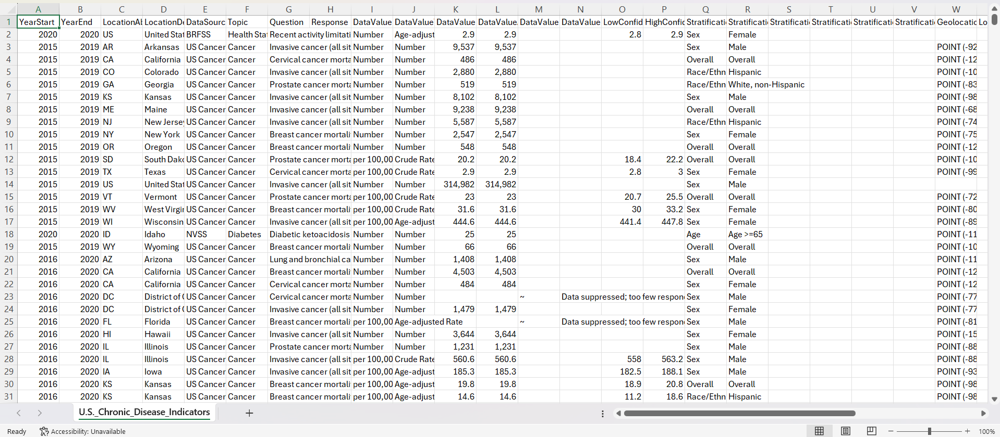
    <figcaption style="font-size:0.95em; color:#555; margin-top:6px;">
      Preview of the U.S. Chronic Disease Indicators dataset showing key columns and record structure.
    </figcaption>
  </figure>

  <h3>Key Variables</h3>
  <table>
    <thead>
      <tr><th>Column</th><th>Description</th></tr>
    </thead>
    <tbody>
      <tr><td>YearStart / YearEnd</td><td>Reporting period for each indicator record</td></tr>
      <tr><td>LocationAbbr / LocationDesc</td><td>State or territory abbreviation and full name</td></tr>
      <tr><td>Topic</td><td>Chronic disease category (e.g., Diabetes, Asthma, Cardiovascular Disease, Mental Health)</td></tr>
      <tr><td>Question</td><td>Specific indicator measured (e.g., &ldquo;Invasive cancer, all sites&rdquo;)</td></tr>
      <tr><td>DataValueType</td><td>Type of measure (age-adjusted prevalence, crude rate, number, etc.)</td></tr>
      <tr><td>DataValue</td><td>The reported numeric value for the indicator</td></tr>
      <tr><td>Stratification1</td><td>Demographic breakdown (race/ethnicity, gender, overall)</td></tr>
      <tr><td>DataSource</td><td>Surveillance system (BRFSS, NVSS, etc.)</td></tr>
    </tbody>
  </table>

  <h3>Data Characteristics</h3>
  

    The dataset covers chronic disease indicators from the Behavioral Risk Factor Surveillance System (BRFSS),
    National Vital Statistics System (NVSS), and other CDC surveillance programs. Records are stratified by
    state, year, demographic group, and data value type &mdash; enabling multi-dimensional public health analysis.
    Julius AI automatically detected column types and handled the 96 MB file upon upload.
  

  
<strong>Analysis 1 &mdash; Diabetes Prevalence: California vs. Texas</strong>

  

  <h3>Question</h3>
  

    How has the prevalence of diabetes changed in California vs. Texas over the last 5 years?
  

  <h3>Prompt Used</h3>
  

    <em>&ldquo;How has the prevalence of &lsquo;Diabetes&rsquo; changed in California vs. Texas over the last 5 years?&rdquo;</em>
  

  <figure style="margin: 18px 0;">
    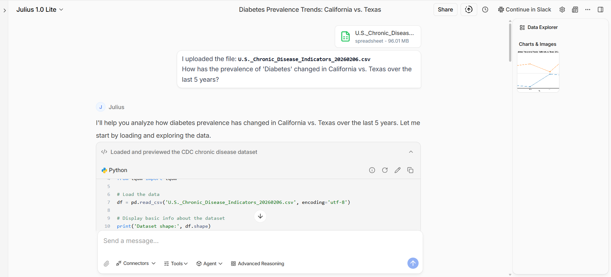
    <figcaption style="font-size:0.95em; color:#555; margin-top:6px;">
      Julius AI prompt and generated Python code for analyzing diabetes prevalence trends.
    </figcaption>
  </figure>

  <h3>Results</h3>
  

    Julius AI filtered the CDI dataset for diabetes prevalence records in California and Texas, extracted age-adjusted
    rates from 2019 to 2022, and produced a comparative line chart. The platform automatically handled data filtering,
    aggregation, and visualization formatting from a single conversational prompt.
  

  <figure style="margin: 18px 0;">
    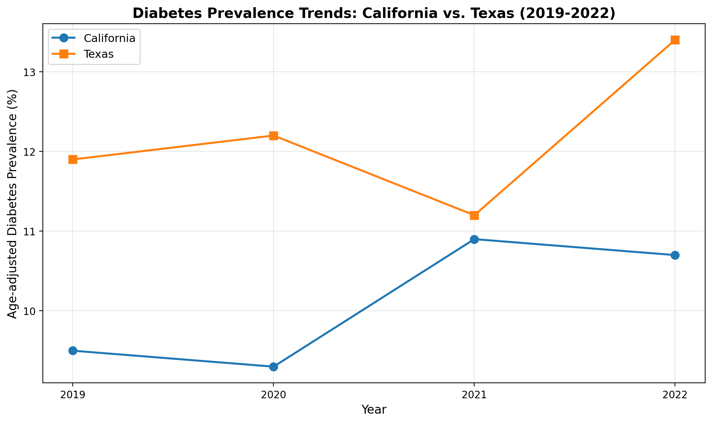
    <figcaption style="font-size:0.95em; color:#555; margin-top:6px;">
      Age-adjusted diabetes prevalence in California vs. Texas (2019&ndash;2022), generated by Julius AI.
    </figcaption>
  </figure>

  <h3>Insights</h3>
  <ul>
    <li><strong>Texas consistently higher:</strong> Texas maintained a higher age-adjusted diabetes prevalence than California across all four years, ranging from approximately 11.2% to 13.4% compared to California&rsquo;s 9.3% to 10.9%.</li>
    <li><strong>Upward trend in both states:</strong> Both states showed an overall upward trend in diabetes prevalence from 2019 to 2022, with California rising from approximately 9.5% to 10.7% and Texas spiking to 13.4% by 2022.</li>
    <li><strong>Texas 2021 dip then sharp rise:</strong> Texas experienced a temporary decline to approximately 11.2% in 2021 before surging to its highest recorded value of 13.4% in 2022 &mdash; potentially reflecting delayed reporting effects or post-pandemic diagnostic catch-up.</li>
    <li><strong>Persistent 2&ndash;3 point gap:</strong> The prevalence gap between the two states remained consistently in the 2&ndash;3 percentage point range, suggesting structural differences in population health risk factors, demographics, or healthcare access.</li>
  </ul>

  
<strong>Analysis 2 &mdash; Asthma Prevalence by Race/Ethnicity</strong>

  

  <h3>Question</h3>
  

    Which racial/ethnic groups are disproportionately affected by asthma?
  

  <h3>Prompt Used</h3>
  

    <em>&ldquo;Break down &lsquo;Asthma&rsquo; prevalence by Race/Ethnicity. Which groups are disproportionately affected?&rdquo;</em>
  

  <figure style="margin: 18px 0;">
    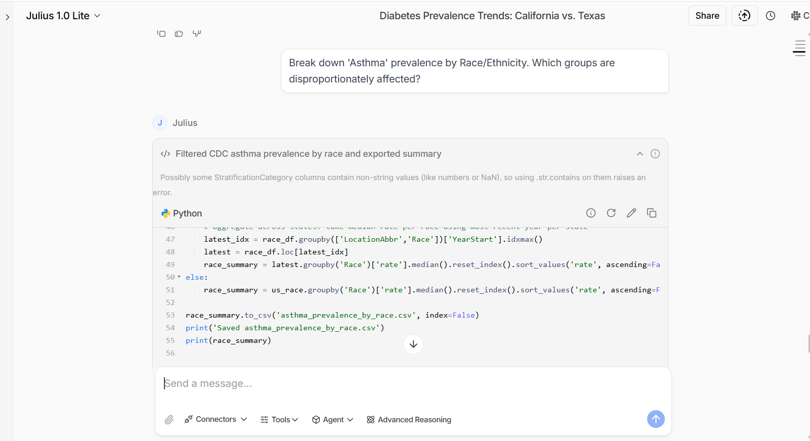
    <figcaption style="font-size:0.95em; color:#555; margin-top:6px;">
      Julius AI prompt and Python code filtering CDC asthma prevalence data by race/ethnicity.
    </figcaption>
  </figure>

  <h3>Results</h3>
  

    Julius AI filtered the dataset for asthma prevalence by racial/ethnic stratification, aggregated median rates
    across states using the most recent available year per state, and produced a ranked summary table. The platform
    handled the grouping, median calculation, and sorting automatically.
  

  <figure style="margin: 18px 0;">
    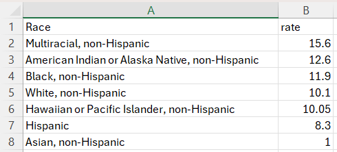
    <figcaption style="font-size:0.95em; color:#555; margin-top:6px;">
      Asthma prevalence rates by race/ethnicity, ranked from highest to lowest.
    </figcaption>
  </figure>

  <h3>Insights</h3>
  <ul>
    <li><strong>Multiracial non-Hispanic highest:</strong> The Multiracial, non-Hispanic group reported the highest asthma prevalence rate at 15.6%, more than 50% above the White, non-Hispanic rate of 10.1%.</li>
    <li><strong>American Indian/Alaska Native elevated:</strong> American Indian or Alaska Native, non-Hispanic populations showed the second-highest rate at 12.6%, consistent with known environmental and socioeconomic risk factors in these communities.</li>
    <li><strong>Black non-Hispanic disproportionately affected:</strong> At 11.9%, the Black, non-Hispanic rate was notably above the overall average, aligning with established research on asthma disparities linked to environmental exposures and healthcare access inequities.</li>
    <li><strong>Asian non-Hispanic lowest:</strong> The Asian, non-Hispanic group had the lowest reported rate at 1.0%, a significant gap from all other groups that may reflect both biological factors and potential data reporting differences.</li>
    <li><strong>Hispanic below average:</strong> The Hispanic population reported an 8.3% rate, below the White non-Hispanic rate, though this figure may mask heterogeneity across Hispanic subpopulations.</li>
  </ul>

  
<strong>Analysis 3 &mdash; Physical Inactivity vs. Cardiovascular Disease Mortality</strong>

  

  <h3>Question</h3>
  

    Is there a correlation between states with high physical inactivity and states with high cardiovascular disease mortality?
  

  <h3>Prompt Used</h3>
  

    <em>&ldquo;Is there a correlation between states with high &lsquo;Physical Inactivity&rsquo; and states with high
    &lsquo;Cardiovascular Disease&rsquo; mortality? Make a scatter plot with a regression line with physical inactivity
    plotted on the x axis and cardiovascular disease plotted on the y axes and each point being a state.&rdquo;</em>
  

  <figure style="margin: 18px 0;">
    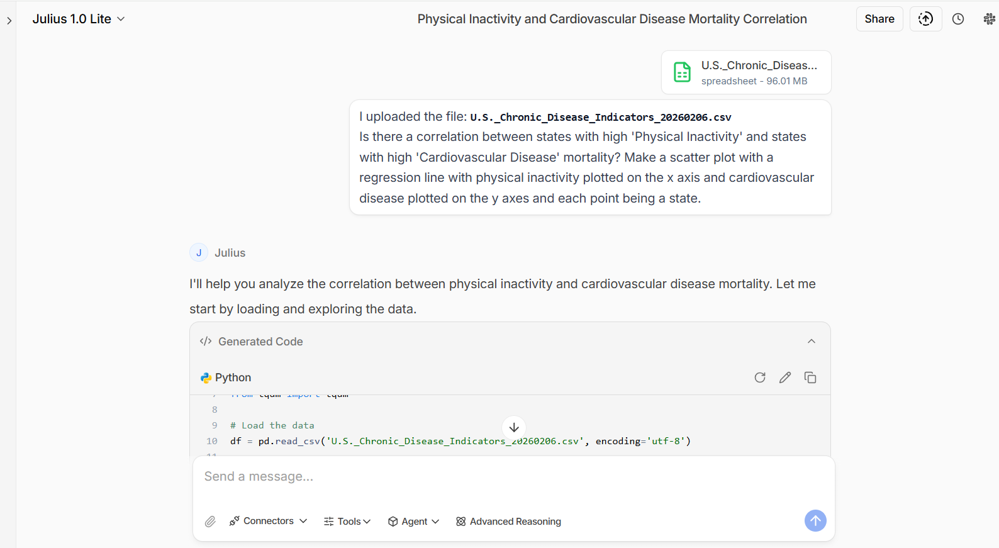
    <figcaption style="font-size:0.95em; color:#555; margin-top:6px;">
      Julius AI prompt and generated code for the physical inactivity vs. cardiovascular disease correlation analysis.
    </figcaption>
  </figure>

  <h3>Results</h3>
  

    Julius AI extracted physical inactivity rates and cardiovascular disease mortality rates for each state, merged the
    datasets, computed correlation statistics, and generated a scatter plot with a regression line &mdash; including
    Pearson r, R&sup2;, and p-value annotations directly on the chart.
  

  <figure style="margin: 18px 0;">
    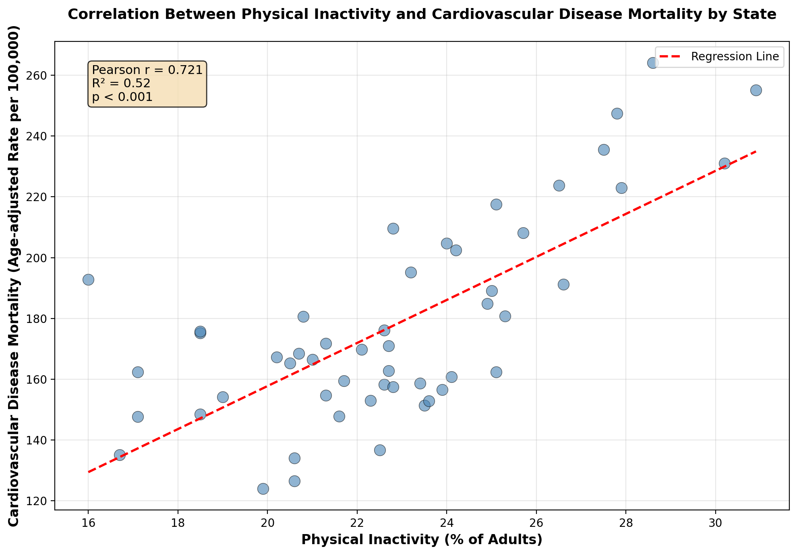
    <figcaption style="font-size:0.95em; color:#555; margin-top:6px;">
      Correlation between physical inactivity and cardiovascular disease mortality by state, with regression line and statistics (Pearson r = 0.721, R&sup2; = 0.52, p &lt; 0.001).
    </figcaption>
  </figure>

  <h3>Insights</h3>
  <ul>
    <li><strong>Strong positive correlation:</strong> A Pearson correlation coefficient of r = 0.721 indicates a strong positive relationship between state-level physical inactivity and cardiovascular disease mortality.</li>
    <li><strong>Statistically significant:</strong> With p &lt; 0.001, the relationship is highly statistically significant, meaning it is extremely unlikely to be due to chance.</li>
    <li><strong>52% of variance explained:</strong> The R&sup2; value of 0.52 means that physical inactivity alone explains over half of the state-to-state variation in cardiovascular disease mortality rates &mdash; a substantial effect for a single predictor in population-level health data.</li>
    <li><strong>Policy implications:</strong> States with physical inactivity rates above 28% of adults tended to cluster at the highest cardiovascular mortality levels (220&ndash;260 per 100,000), suggesting that public health interventions targeting sedentary behavior could meaningfully reduce cardiovascular deaths.</li>
    <li><strong>Clear gradient:</strong> The scatter plot shows a clear upward gradient from states with ~16% inactivity and ~130 deaths per 100,000 to states with ~30% inactivity and ~240 deaths per 100,000, reinforcing the dose-response nature of the relationship.</li>
  </ul>

  
<strong>Analysis 4 &mdash; Mental Health Distress: Males vs. Females</strong>

  

  <h3>Question</h3>
  

    How do rates of frequent mental distress compare between men and women across the top 10 most populous states?
  

  <h3>Prompt Used</h3>
  

    <em>&ldquo;Compare the rates of &lsquo;Frequent Mental Distress&rsquo; between men and women across the top 10 most populous states.&rdquo;</em>
  

  <figure style="margin: 18px 0;">
    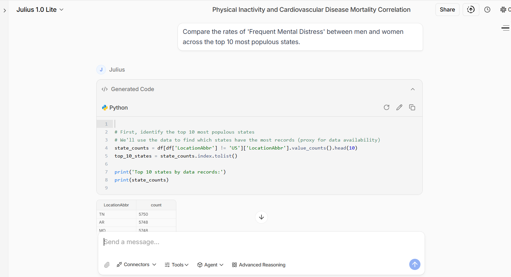
    <figcaption style="font-size:0.95em; color:#555; margin-top:6px;">
      Julius AI prompt and generated code identifying top states and comparing mental distress rates by gender.
    </figcaption>
  </figure>

  <h3>Results</h3>
  

    Julius AI identified the top 10 states by data record volume, filtered for frequent mental distress indicators
    stratified by gender for 2022, and produced a grouped bar chart with labeled percentages for each state. The
    platform handled the multi-step filtering, grouping, and visualization in a single conversation flow.
  

  <figure style="margin: 18px 0;">
    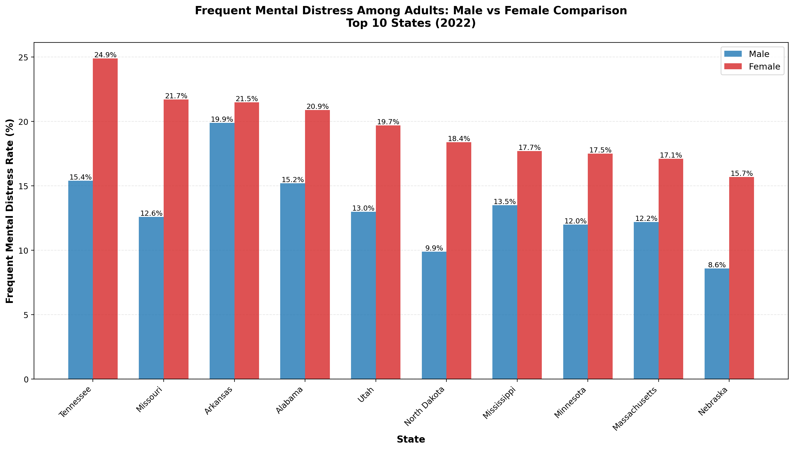
    <figcaption style="font-size:0.95em; color:#555; margin-top:6px;">
      Frequent mental distress rates among adults: male vs. female comparison across top 10 states (2022).
    </figcaption>
  </figure>

  <h3>Insights</h3>
  <ul>
    <li><strong>Females consistently higher:</strong> In every state analyzed, females reported higher rates of frequent mental distress than males, with gaps ranging from approximately 4 to 9.5 percentage points.</li>
    <li><strong>Tennessee had the highest rates:</strong> Tennessee reported the highest rates for both genders &mdash; 15.4% for males and 24.9% for females &mdash; with nearly one in four women experiencing frequent mental distress.</li>
    <li><strong>Largest gender gap in Tennessee:</strong> The 9.5 percentage point gap between males (15.4%) and females (24.9%) in Tennessee was the widest observed, pointing to potential gender-specific stressors or reporting differences.</li>
    <li><strong>Geographic variation:</strong> Southern states (Tennessee, Arkansas, Alabama, Missouri) tended to report higher rates for both genders compared to states like Nebraska, Minnesota, and Massachusetts &mdash; consistent with known regional patterns in mental health outcomes and healthcare access.</li>
    <li><strong>Nebraska lowest overall:</strong> Nebraska had the lowest rates at 8.6% (male) and 15.7% (female), yet still showed the same female-exceeds-male pattern, suggesting the gender disparity in mental distress is consistent regardless of baseline prevalence.</li>
  </ul>

  
<strong>Analysis 5 &mdash; Cigarette Smoking by Race/Ethnicity</strong>

  

  <h3>Question</h3>
  

    How does current cigarette smoking prevalence vary among different racial/ethnic groups?
  

  <h3>Prompt Used</h3>
  

    <em>&ldquo;Visualize the disparity in &lsquo;Current Cigarette Smoking&rsquo; among different race/ethnicity categories for the year 2021.&rdquo;</em>
  

  <figure style="margin: 18px 0;">
    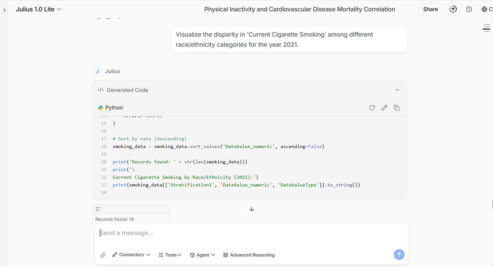
    <figcaption style="font-size:0.95em; color:#555; margin-top:6px;">
      Julius AI prompt and generated code filtering and sorting smoking data by race/ethnicity for 2021.
    </figcaption>
  </figure>

  <h3>Results</h3>
  

    Julius AI filtered the CDI dataset for current cigarette smoking indicators in 2021, stratified by race/ethnicity,
    extracted age-adjusted prevalence rates, and generated a horizontal bar chart ranked from highest to lowest. The
    platform correctly identified the relevant records from the 96 MB dataset and produced a publication-ready
    visualization.
  

  <figure style="margin: 18px 0;">
    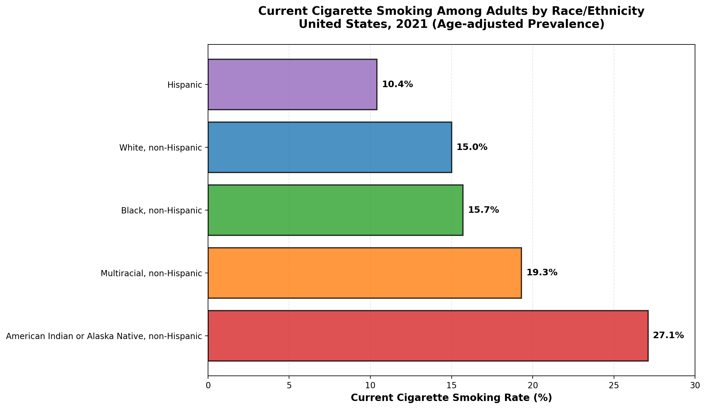
    <figcaption style="font-size:0.95em; color:#555; margin-top:6px;">
      Current cigarette smoking among adults by race/ethnicity, United States, 2021 (age-adjusted prevalence).
    </figcaption>
  </figure>

  <h3>Insights</h3>
  <ul>
    <li><strong>American Indian/Alaska Native highest:</strong> At 27.1%, the American Indian or Alaska Native, non-Hispanic population had the highest smoking prevalence &mdash; more than 2.6 times the rate of Hispanic adults (10.4%). This stark disparity underscores longstanding health inequities affecting Indigenous communities.</li>
    <li><strong>Multiracial non-Hispanic second highest:</strong> The Multiracial, non-Hispanic group reported a 19.3% smoking rate, significantly above the national overall rate, suggesting compounding risk factors across multiple demographic dimensions.</li>
    <li><strong>Black and White rates similar:</strong> Black, non-Hispanic (15.7%) and White, non-Hispanic (15.0%) adults had similar smoking prevalence, though the health impacts may differ due to other co-occurring risk factors and disparities in healthcare access.</li>
    <li><strong>Hispanic adults lowest:</strong> At 10.4%, Hispanic adults had the lowest cigarette smoking rate among all groups measured &mdash; a pattern sometimes referred to as the &ldquo;Hispanic health paradox&rdquo; in epidemiological literature.</li>
    <li><strong>Targeted interventions needed:</strong> The nearly 17 percentage point gap between the highest and lowest groups (27.1% vs. 10.4%) highlights the need for culturally tailored tobacco cessation programs rather than one-size-fits-all public health approaches.</li>
  </ul>

  
<strong>Analysis 6 &mdash; National Obesity Trend</strong>

  

  <h3>Question</h3>
  

    What is the national trend in adult obesity prevalence over time?
  

  <h3>Prompt Used</h3>
  

    <em>&ldquo;Plot the trend of &lsquo;Obesity among adults&rsquo; from the earliest available year to the latest for the entire United States.&rdquo;</em>
  

  <figure style="margin: 18px 0;">
    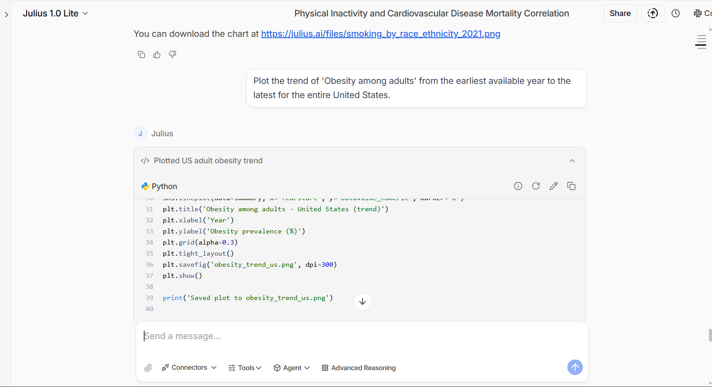
    <figcaption style="font-size:0.95em; color:#555; margin-top:6px;">
      Julius AI prompt and generated Python code plotting the national obesity trend line.
    </figcaption>
  </figure>

  <h3>Results</h3>
  

    Julius AI filtered the CDI dataset for national-level (&ldquo;United States&rdquo;) obesity among adults indicators,
    aggregated the data by year, and generated a time series line chart showing obesity prevalence from 2019 to 2022.
    The platform handled date extraction, aggregation, and chart formatting from a single natural language prompt.
  

  <figure style="margin: 18px 0;">
    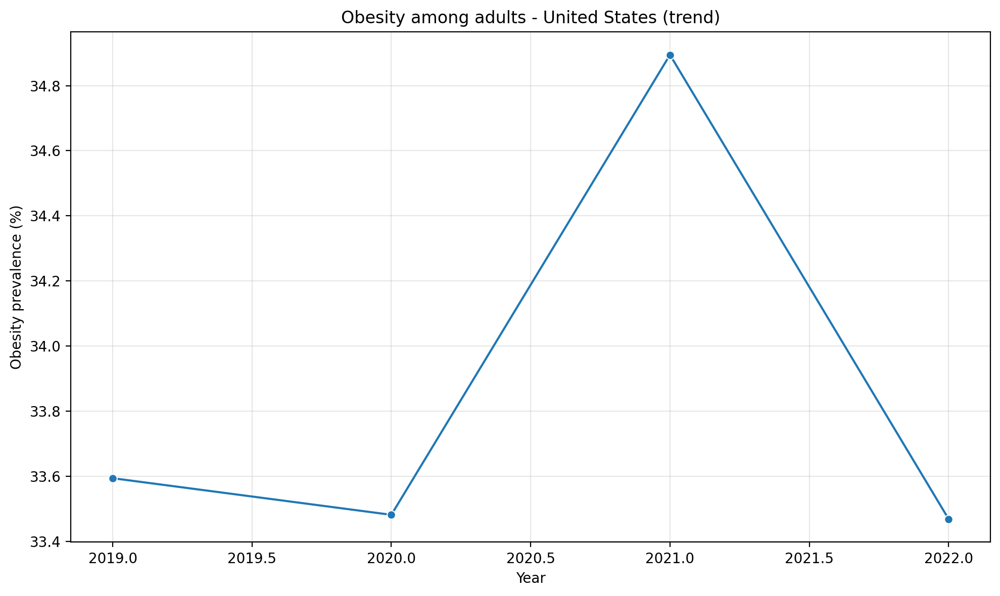
    <figcaption style="font-size:0.95em; color:#555; margin-top:6px;">
      National obesity prevalence among adults, United States (2019&ndash;2022).
    </figcaption>
  </figure>

  <h3>Insights</h3>
  <ul>
    <li><strong>2021 peak:</strong> Adult obesity prevalence in the United States peaked at approximately 34.9% in 2021, up from 33.5% in 2020 &mdash; likely reflecting the impact of pandemic-era lifestyle disruptions including reduced physical activity, increased sedentary behavior, and dietary changes.</li>
    <li><strong>2022 decline:</strong> Prevalence dropped back to approximately 33.5% in 2022, returning to near pre-pandemic levels. This partial reversal may indicate a return to normal activity patterns as pandemic restrictions eased.</li>
    <li><strong>Narrow range, high baseline:</strong> The entire range spans only about 1.4 percentage points (33.5% to 34.9%), but the baseline itself is alarming &mdash; one in three American adults qualified as obese throughout the entire period.</li>
    <li><strong>Pandemic disruption visible:</strong> The pattern of a slight dip in 2020, sharp rise in 2021, and partial recovery in 2022 mirrors the timeline of COVID-19 lockdowns and reopening, consistent with research linking the pandemic to weight gain at the population level.</li>
    <li><strong>No sustained improvement:</strong> Despite the 2022 decline, there is no evidence of a sustained downward trend &mdash; prevalence in 2022 (~33.5%) remained essentially unchanged from 2019 (~33.6%), suggesting that existing public health interventions have not yet reversed the obesity epidemic.</li>
  </ul>

  
<strong>Key Findings &amp; Recommendations</strong>

  

  <h3>Key Findings</h3>
  <ul>
    <li><strong>Chronic disease burden varies significantly by state:</strong> Diabetes prevalence in Texas (13.4%) was consistently 2&ndash;3 percentage points higher than in California (10.7%), reflecting differences in demographics, lifestyle factors, and healthcare infrastructure.</li>
    <li><strong>Racial and ethnic disparities are pervasive:</strong> Both asthma and tobacco use showed stark disparities, with American Indian/Alaska Native and Multiracial populations bearing disproportionate burden across multiple chronic disease categories.</li>
    <li><strong>Physical inactivity is a powerful predictor:</strong> The strong correlation (r = 0.721) between physical inactivity and cardiovascular mortality across states suggests that population-level exercise promotion could meaningfully reduce heart disease deaths.</li>
    <li><strong>Mental health distress disproportionately affects women:</strong> Females reported higher rates of frequent mental distress in every state examined, with the gap widest in Southern states &mdash; indicating a need for gender-responsive mental health services.</li>
    <li><strong>Obesity remains stubbornly high:</strong> National obesity prevalence hovered around 33&ndash;35% with no meaningful downward trend, reinforcing that the obesity epidemic requires sustained, multi-sector intervention.</li>
    <li><strong>AI-assisted analysis is viable for large public health datasets:</strong> Julius AI successfully queried, filtered, and visualized a 96 MB dataset with hundreds of thousands of records entirely through natural language prompts.</li>
  </ul>

  <h3>Recommendations</h3>
  <ul>
    <li><strong>Target high-burden states:</strong> States like Texas (diabetes) and Tennessee (mental health distress) should be prioritized for federal chronic disease prevention funding and tailored intervention programs.</li>
    <li><strong>Address racial/ethnic disparities:</strong> Culturally tailored public health programs are needed &mdash; particularly for American Indian/Alaska Native communities, which showed the highest rates in both asthma and tobacco use.</li>
    <li><strong>Promote physical activity at scale:</strong> Given the strong inactivity-cardiovascular mortality link, investment in walkable infrastructure, community exercise programs, and workplace wellness initiatives could yield outsized public health returns.</li>
    <li><strong>Expand gender-responsive mental health services:</strong> The consistent female-exceeds-male pattern in mental distress warrants expanded access to women&rsquo;s mental health services, especially in high-prevalence Southern states.</li>
    <li><strong>Use AI tools for rapid surveillance:</strong> Public health agencies can leverage platforms like Julius AI for rapid initial exploration of surveillance data, accelerating hypothesis generation before committing to formal statistical analyses.</li>
  </ul>

  
<strong>Julius AI &mdash; Tool Evaluation</strong>

  

  <h3>What Worked Well</h3>
  <ul>
    <li><strong>Handled large datasets:</strong> Julius AI successfully loaded and queried a 96 MB CSV file with hundreds of thousands of rows &mdash; performing filtering, aggregation, and visualization without performance issues.</li>
    <li><strong>Speed of exploration:</strong> All six analyses were completed through simple conversational prompts, with each producing results in under a minute &mdash; tasks that would typically require 30&ndash;60 minutes of manual Python coding.</li>
    <li><strong>Automatic visualization:</strong> Julius AI generated well-formatted charts with appropriate scales, labels, legends, and annotations (including statistical values on the scatter plot) without manual styling.</li>
    <li><strong>Statistical awareness:</strong> The platform correctly computed Pearson correlation, R&sup2;, and p-values when prompted, and applied appropriate data transformations (age-adjusted rates, median aggregation, group comparisons).</li>
    <li><strong>Iterative refinement:</strong> Follow-up prompts allowed rapid iteration &mdash; adjusting chart types, adding annotations, or drilling into subsets without rewriting code.</li>
  </ul>

  <h3>Limitations Observed</h3>
  <ul>
    <li><strong>Black-box methodology:</strong> While Julius AI shows the Python code it generates, users must verify the statistical approach is appropriate for their data and question.</li>
    <li><strong>Prompt sensitivity:</strong> Results varied based on how questions were phrased &mdash; more specific prompts (e.g., specifying axes and chart type) produced more reliable and targeted outputs.</li>
    <li><strong>Reproducibility:</strong> Exact outputs may vary between sessions, making traditional scripted workflows preferable for production-grade analysis or regulatory reporting.</li>
    <li><strong>Data interpretation required:</strong> Julius AI produces the numbers and charts, but domain expertise is still needed to contextualize findings within the broader public health landscape.</li>
  </ul>

  <h3>When to Use Julius AI</h3>
  <table>
    <thead>
      <tr><th>Use Case</th><th>Suitability</th></tr>
    </thead>
    <tbody>
      <tr><td>Initial data profiling &amp; EDA on large datasets</td><td>Excellent</td></tr>
      <tr><td>Quick hypothesis testing with visualizations</td><td>Good</td></tr>
      <tr><td>Generating presentation-ready charts</td><td>Good</td></tr>
      <tr><td>Exploring unfamiliar datasets through conversation</td><td>Excellent</td></tr>
      <tr><td>Production data pipelines</td><td>Not recommended</td></tr>
      <tr><td>Highly regulated or reproducible analysis</td><td>Not recommended</td></tr>
    </tbody>
  </table>

