<a href="/projects/" class="back-to-projects btn" aria-label="Back to projects page">&larr; Back to Projects</a>

# Machine Learning &mdash; Customer Churn Prediction

> End-to-end ML pipeline that cleans, explores, and models 7,000 telecom customer records to predict churn &mdash; comparing 5 classification algorithms, explaining predictions with SHAP, and deploying an interactive Streamlit app for real-time risk scoring.

**Tools:** Python &middot; pandas &middot; NumPy &middot; scikit-learn &middot; XGBoost &middot; LightGBM &middot; SHAP &middot; matplotlib &middot; seaborn &middot; Streamlit &middot; Jupyter Notebook

**Live App:** <a href="https://nadeaujonnyappio-ba7xf6aknjidd9ppd5ww3t.streamlit.app" target="_blank">Launch Streamlit Churn Predictor &rarr;</a>

---

  
<strong>Project Overview</strong>

  

  <h3>Overview</h3>
  

    This project builds an end-to-end machine learning pipeline that cleans, explores, and models 7,000 telecom
    customer records to predict churn &mdash; comparing five classification algorithms head-to-head, explaining
    predictions with SHAP values, and deploying an interactive Streamlit web app for real-time risk scoring.
    The pipeline spans six phases: data cleaning, exploratory data analysis, feature engineering &amp; preprocessing,
    model training &amp; comparison, hyperparameter tuning, and SHAP explainability &mdash; each implemented in
    dedicated Jupyter notebooks with all artifacts saved for downstream consumption.
  

  

    The final deployed model is a <strong>Logistic Regression classifier</strong> (class_weight='balanced') achieving
    <strong>0.83 AUC</strong> and <strong>79% recall</strong> on the held-out test set. The model is served through a
    four-page Streamlit application where users can input any customer profile and receive a churn probability score
    with a SHAP waterfall explanation showing exactly which features drove that prediction.
  

  <h3>Business Context</h3>
  

    Customer churn &mdash; when a customer cancels their service &mdash; is one of the most expensive problems in
    subscription businesses. Acquiring a new customer costs 5&ndash;7&times; more than retaining an existing one.
    Telecom companies, SaaS platforms, streaming services, and any company with recurring revenue build churn
    prediction models to identify at-risk customers before they leave, target retention offers to the right people,
    quantify the financial impact of churn reduction, and understand which factors drive customer attrition.
  

  

    This project simulates the role of a data analyst or data scientist tasked with building a churn prediction
    system for a telecom company's customer success team. The dataset comes from IBM's Telco Customer Churn sample
    on Kaggle &mdash; 7,043 customers with 21 attributes covering demographics, service subscriptions, account
    details, and churn status.
  

  <h3>Why Recall Is the Priority Metric</h3>
  

    In churn prediction, the costs of errors are asymmetric. A <strong>false negative</strong> (missed churner) means
    a lost customer and lost lifetime revenue. A <strong>false positive</strong> (flagging a loyal customer) means
    sending an unnecessary retention offer &mdash; a much cheaper mistake. This cost asymmetry means we optimize for
    <strong>recall</strong>: catching as many actual churners as possible, even if it means generating some false alarms.
    Every model in this project handles class imbalance explicitly (via <code>class_weight='balanced'</code> or
    <code>scale_pos_weight</code>), and model selection prioritizes recall alongside AUC.
  

  <h3>Pipeline Architecture</h3>
  

    The project follows a structured six-phase pipeline, each phase in its own Jupyter notebook with shared
    utilities in a dedicated Python module:
  

  <table>
    <thead>
      <tr><th>Phase</th><th>Notebook</th><th>Purpose</th><th>Key Output</th></tr>
    </thead>
    <tbody>
      <tr>
        <td>1 &mdash; Data Cleaning</td>
        <td><code>01_data_cleaning.ipynb</code></td>
        <td>Load, inspect, fix dtypes, handle NaNs, encode target</td>
        <td><code>telco_churn_cleaned.csv</code></td>
      </tr>
      <tr>
        <td>2 &mdash; EDA</td>
        <td><code>02_eda.ipynb</code></td>
        <td>7 visualizations, churn driver identification</td>
        <td>7 chart PNGs, documented findings</td>
      </tr>
      <tr>
        <td>3 &mdash; Feature Engineering</td>
        <td><code>03_feature_engineering.ipynb</code></td>
        <td>5 engineered features, preprocessing pipeline, train/test split</td>
        <td><code>preprocessor.pkl</code>, <code>feature_names.pkl</code></td>
      </tr>
      <tr>
        <td>4 &mdash; Model Training</td>
        <td><code>04_model_training.ipynb</code></td>
        <td>Train 5 models, cross-validate, compare on test set</td>
        <td><code>best_model.pkl</code>, <code>model_comparison.csv</code></td>
      </tr>
      <tr>
        <td>5 &mdash; Tuning</td>
        <td><code>05_tuning_evaluation.ipynb</code></td>
        <td>RandomizedSearchCV (50 iterations), default vs tuned comparison</td>
        <td>Decision: keep default balanced model</td>
      </tr>
      <tr>
        <td>6 &mdash; SHAP</td>
        <td><code>05_tuning_evaluation.ipynb</code></td>
        <td>Global importance, waterfall explanations, business translations</td>
        <td>3 SHAP chart PNGs</td>
      </tr>
    </tbody>
  </table>

  <h3>Key Code: Shared Feature Engineering Function</h3>
  

    Feature engineering must be identical between training notebooks and the deployed Streamlit app. To guarantee
    consistency, all feature logic lives in a single shared function in <code>feature_helpers.py</code>, used by
    both the notebooks and the app:
  

  <pre><code class="language-python">def engineer_features(df):
    """
    Apply all feature engineering transformations.
    Single source of truth — used by BOTH training notebooks and Streamlit app.
    """
    df = df.copy()
    service_cols = ['OnlineSecurity', 'OnlineBackup', 'DeviceProtection',
                    'TechSupport', 'StreamingTV', 'StreamingMovies']
    df['ServiceCount'] = df[service_cols].apply(
        lambda row: (row == 'Yes').sum(), axis=1
    )
    df['HasInternet'] = (df['InternetService'] != 'No').astype(int)
    df['HasPhone'] = (df['PhoneService'] == 'Yes').astype(int)
    df['AvgMonthlyCharge'] = df.apply(
        lambda row: row['TotalCharges'] / row['tenure'] if row['tenure'] > 0
        else row['MonthlyCharges'], axis=1
    )
    def tenure_bucket(t):
        if t <= 12: return 0
        elif t <= 24: return 1
        elif t <= 48: return 2
        else: return 3
    df['TenureGroup'] = df['tenure'].apply(tenure_bucket)
    return df</code></pre>

  <h3>Key Code: Preprocessing Pipeline</h3>
  

    The preprocessing pipeline uses scikit-learn's <code>ColumnTransformer</code> to apply <code>StandardScaler</code>
    to 9 numeric features and <code>OneHotEncoder</code> (with <code>drop='first'</code> to avoid the dummy variable
    trap) to 15 categorical features. The pipeline is fit on training data only, then applied to both train and test
    sets to prevent data leakage:
  

  <pre><code class="language-python">from sklearn.compose import ColumnTransformer
from sklearn.preprocessing import StandardScaler, OneHotEncoder

numeric_features = ['SeniorCitizen', 'tenure', 'MonthlyCharges', 'TotalCharges',
                    'ServiceCount', 'HasInternet', 'HasPhone', 'AvgMonthlyCharge',
                    'TenureGroup']

categorical_features = ['gender', 'Partner', 'Dependents', 'PhoneService',
                        'MultipleLines', 'InternetService', 'OnlineSecurity',
                        'OnlineBackup', 'DeviceProtection', 'TechSupport',
                        'StreamingTV', 'StreamingMovies', 'Contract',
                        'PaperlessBilling', 'PaymentMethod']

preprocessor = ColumnTransformer(
    transformers=[
        ('num', StandardScaler(), numeric_features),
        ('cat', OneHotEncoder(drop='first', sparse_output=False,
                              handle_unknown='ignore'), categorical_features)
    ]
)

# Fit on training data ONLY — transform both
X_train_processed = preprocessor.fit_transform(X_train)
X_test_processed = preprocessor.transform(X_test)</code></pre>

  <h3>Key Code: 5-Model Training &amp; Cross-Validation</h3>
  

    Five classification algorithms &mdash; covering linear, ensemble, gradient boosting, and geometric model
    families &mdash; are trained and evaluated with 5-fold stratified cross-validation. All five models include
    explicit class imbalance handling:
  

  <pre><code class="language-python">from sklearn.linear_model import LogisticRegression
from sklearn.ensemble import RandomForestClassifier
from xgboost import XGBClassifier
from lightgbm import LGBMClassifier
from sklearn.svm import SVC

# Class weight ratio for gradient boosting models
pos_weight = y_train.value_counts()[0] / y_train.value_counts()[1]  # ≈ 2.76

models = {
    'Logistic Regression': LogisticRegression(
        class_weight='balanced', max_iter=1000, random_state=42
    ),
    'Random Forest': RandomForestClassifier(
        class_weight='balanced', n_estimators=100, random_state=42
    ),
    'XGBoost': XGBClassifier(
        scale_pos_weight=pos_weight, n_estimators=100,
        random_state=42, eval_metric='logloss'
    ),
    'LightGBM': LGBMClassifier(
        scale_pos_weight=pos_weight, n_estimators=100,
        random_state=42, verbose=-1
    ),
    'SVM': SVC(
        class_weight='balanced', probability=True, random_state=42
    ),
}

# 5-fold stratified cross-validation per model
cv = StratifiedKFold(n_splits=5, shuffle=True, random_state=42)
for name, model in models.items():
    cv_auc = cross_val_score(model, X_train_processed, y_train,
                              cv=cv, scoring='roc_auc')
    print(f"{name}: AUC={cv_auc.mean():.4f} (±{cv_auc.std():.4f})")</code></pre>

  <h3>Key Code: Hyperparameter Tuning (RandomizedSearchCV)</h3>
  

    After Logistic Regression was identified as the best model, hyperparameter tuning was performed using
    <code>RandomizedSearchCV</code> with 50 random combinations across 5 CV folds, optimizing for AUC:
  

  <pre><code class="language-python">from sklearn.model_selection import RandomizedSearchCV

param_dist = {
    'C': [0.001, 0.01, 0.1, 0.5, 1, 5, 10, 50, 100],
    'penalty': ['l1', 'l2'],
    'solver': ['liblinear', 'saga'],
    'class_weight': ['balanced', None],
    'max_iter': [1000]
}

search = RandomizedSearchCV(
    LogisticRegression(random_state=42),
    param_distributions=param_dist,
    n_iter=50, scoring='roc_auc',
    cv=StratifiedKFold(n_splits=5, shuffle=True, random_state=42),
    random_state=42, n_jobs=-1
)
search.fit(X_train_processed, y_train)
# Best CV AUC: 0.8459</code></pre>

  <h3>Key Code: SHAP Explainability</h3>
  

    SHAP (SHapley Additive exPlanations) values are computed for all 1,407 test set customers using
    <code>LinearExplainer</code>. The beeswarm summary plot shows global feature importance with direction
    of impact, and waterfall plots explain individual predictions feature-by-feature:
  

  <pre><code class="language-python">import shap

# Create explainer for logistic regression
explainer = shap.LinearExplainer(model, X_train_processed,
                                  feature_names=all_feature_names)
shap_values = explainer.shap_values(X_test_processed)

# Global importance — beeswarm summary plot
shap.summary_plot(shap_values, X_test_processed,
                  feature_names=all_feature_names, show=False)
plt.savefig('outputs/figures/shap_summary.png', dpi=150, bbox_inches='tight')

# Individual explanation — waterfall for highest-risk customer
high_risk_idx = y_prob_final.argmax()
explanation = shap.Explanation(
    values=shap_values[high_risk_idx],
    base_values=explainer.expected_value,
    data=X_test_processed[high_risk_idx],
    feature_names=all_feature_names
)
shap.waterfall_plot(explanation, max_display=10, show=False)
plt.savefig('outputs/figures/shap_waterfall_example.png', dpi=150,
            bbox_inches='tight')</code></pre>

  <h3>Key Code: Streamlit Prediction Pipeline</h3>
  

    The deployed Streamlit app loads the serialized model and preprocessor, accepts customer attribute inputs,
    engineers features using the same shared function, and produces a churn probability with a SHAP waterfall
    explanation:
  

  <pre><code class="language-python"># Load serialized artifacts
model = joblib.load('best_model.pkl')
preprocessor = joblib.load('preprocessor.pkl')

# User submits customer attributes via Streamlit form...
# Build DataFrame from inputs, auto-compute TotalCharges
input_data['TotalCharges'] = input_data['MonthlyCharges'] * input_data['tenure']

# Apply shared feature engineering (identical to training)
input_engineered = engineer_features(input_data)
input_final = input_engineered[numeric_features + categorical_features]

# Preprocess and predict
input_processed = preprocessor.transform(input_final)
churn_prob = model.predict_proba(input_processed)[0][1]

# Generate per-prediction SHAP explanation
explainer = shap.LinearExplainer(model, input_processed,
                                  feature_names=all_names)
shap_values = explainer.shap_values(input_processed)

# Display: risk level (High/Medium/Low) + SHAP waterfall plot
if churn_prob >= 0.5:
    st.error(f"⚠️ HIGH RISK — Churn Probability: {churn_prob:.1%}")
elif churn_prob >= 0.3:
    st.warning(f"⚡ MEDIUM RISK — Churn Probability: {churn_prob:.1%}")
else:
    st.success(f"✅ LOW RISK — Churn Probability: {churn_prob:.1%}")</code></pre>

  <h3>Key Results at a Glance</h3>
  <table>
    <thead>
      <tr><th>Metric</th><th>Value</th></tr>
    </thead>
    <tbody>
      <tr><td>Best Model</td><td>Logistic Regression (class_weight='balanced')</td></tr>
      <tr><td>Test AUC</td><td>0.8344</td></tr>
      <tr><td>Test Recall</td><td>0.7888 (79% of churners caught)</td></tr>
      <tr><td>Test F1</td><td>0.6033</td></tr>
      <tr><td>Test Accuracy</td><td>0.7242</td></tr>
      <tr><td>Models Compared</td><td>5 (Logistic Regression, Random Forest, XGBoost, LightGBM, SVM)</td></tr>
      <tr><td>Tuning Decision</td><td>Kept default &mdash; tuned model lost 22pp recall for marginal AUC gain</td></tr>
      <tr><td>SHAP #1 Feature</td><td>tenure (low tenure strongly predicts churn)</td></tr>
      <tr><td>Deployed App</td><td>4-page Streamlit app with real-time predictions</td></tr>
    </tbody>
  </table>

  <h3>Skills Demonstrated</h3>
  <table>
    <thead>
      <tr><th>Skill Area</th><th>What This Project Shows</th></tr>
    </thead>
    <tbody>
      <tr>
        <td>Data Cleaning</td>
        <td>dtype conversion, NaN handling decisions, target encoding, data quality validation</td>
      </tr>
      <tr>
        <td>Exploratory Data Analysis</td>
        <td>7 publication-quality visualizations, churn driver identification, statistical summaries</td>
      </tr>
      <tr>
        <td>Feature Engineering</td>
        <td>5 domain-informed features (ServiceCount, HasInternet, HasPhone, AvgMonthlyCharge, TenureGroup) with shared Python module for train/serve consistency</td>
      </tr>
      <tr>
        <td>Machine Learning</td>
        <td>5-model head-to-head comparison across 3 algorithmic families (linear, ensemble, geometric), stratified cross-validation, class imbalance handling</td>
      </tr>
      <tr>
        <td>Hyperparameter Tuning</td>
        <td>RandomizedSearchCV (50 iterations, 5 folds), principled decision to reject tuned model based on recall loss &mdash; demonstrates business-aware model selection</td>
      </tr>
      <tr>
        <td>Model Explainability</td>
        <td>SHAP LinearExplainer for global feature importance and per-customer waterfall explanations &mdash; translating predictions into business-readable insights</td>
      </tr>
      <tr>
        <td>Deployment</td>
        <td>4-page Streamlit app with real-time prediction, serialized model/preprocessor loading, SHAP waterfall generation on-the-fly</td>
      </tr>
      <tr>
        <td>Python Ecosystem</td>
        <td>pandas &middot; NumPy &middot; scikit-learn &middot; XGBoost &middot; LightGBM &middot; SHAP &middot; matplotlib &middot; seaborn &middot; Streamlit &middot; joblib</td>
      </tr>
      <tr>
        <td>Communication</td>
        <td>Business translations of SHAP findings, cost-asymmetry framing of metric selection, actionable retention recommendations</td>
      </tr>
    </tbody>
  </table>

  <h3>Live Application</h3>
  

    <strong><a href="https://nadeaujonnyappio-ba7xf6aknjidd9ppd5ww3t.streamlit.app" target="_blank">Launch Streamlit Churn Predictor &rarr;</a></strong>
    &mdash; Input any customer profile and receive a churn risk score with a SHAP waterfall explanation.
  

  
<strong>Dataset</strong>

  

  <h3>Source &amp; Overview</h3>
  

    This project uses the <strong>Telco Customer Churn</strong> dataset &mdash; an IBM sample dataset hosted on
    Kaggle at
    <a href="https://www.kaggle.com/datasets/blastchar/telco-customer-churn" target="_blank">kaggle.com/datasets/blastchar/telco-customer-churn</a>.
    The dataset contains records for 7,043 customers of a fictional telecom company, with 21 columns capturing
    customer demographics, service subscriptions, account details, and whether the customer churned (cancelled
    their service) in the last month.
  

  <table>
    <thead>
      <tr><th>Property</th><th>Value</th></tr>
    </thead>
    <tbody>
      <tr><td>File</td><td><code>WA_Fn-UseC_-Telco-Customer-Churn.csv</code></td></tr>
      <tr><td>File Size</td><td>~955 KB</td></tr>
      <tr><td>Raw Dimensions</td><td>7,043 rows &times; 21 columns</td></tr>
      <tr><td>Cleaned Dimensions</td><td>7,032 rows &times; 20 columns</td></tr>
      <tr><td>Target Variable</td><td><code>Churn</code> (Yes/No &rarr; 1/0, binary classification)</td></tr>
      <tr><td>Class Distribution</td><td>73.4% No Churn (5,163) / 26.6% Churn (1,869) &mdash; moderately imbalanced</td></tr>
    </tbody>
  </table>

  <h3>Key Code: Loading &amp; Initial Inspection</h3>
  

    The raw dataset was loaded and inspected in <code>01_data_cleaning.ipynb</code>. The first inspection
    confirmed 7,043 rows, identified <code>TotalCharges</code> as an incorrectly typed object column, and
    verified zero explicit nulls and zero duplicates in the raw data:
  

  <pre><code class="language-python">import pandas as pd
import numpy as np

# Load the raw dataset
df = pd.read_csv('../data/WA_Fn-UseC_-Telco-Customer-Churn.csv')

print(f"Shape: {df.shape}")
print(f"\nColumn dtypes:\n{df.dtypes}")
# Output: Shape: (7043, 21)
# TotalCharges shows as 'object' — should be numeric

# Confirm no explicit nulls and no duplicates
print(f"Missing values per column:\n{df.isnull().sum()}")
print(f"\nDuplicate rows: {df.duplicated().sum()}")
# Output: 0 missing values across all columns, 0 duplicates

# Check cardinality of each column
print(f"\nUnique values per column:\n{df.nunique()}")
# Output: customerID=7043 (unique), gender=2, SeniorCitizen=2,
# tenure=73, MonthlyCharges=1585, TotalCharges=6531, etc.</code></pre>

  <h3>Column Descriptions &mdash; Customer Demographics (5 columns)</h3>
  <table>
    <thead>
      <tr><th>Column</th><th>Type</th><th>Values</th><th>Description</th></tr>
    </thead>
    <tbody>
      <tr>
        <td><code>customerID</code></td>
        <td>string</td>
        <td>7,043 unique</td>
        <td>Unique customer identifier &mdash; dropped before modeling (not a predictive feature)</td>
      </tr>
      <tr>
        <td><code>gender</code></td>
        <td>categorical</td>
        <td>Male, Female</td>
        <td>Customer gender &mdash; EDA showed no meaningful difference in churn rates</td>
      </tr>
      <tr>
        <td><code>SeniorCitizen</code></td>
        <td>binary</td>
        <td>0, 1</td>
        <td>Whether customer is 65+ &mdash; already numeric (unlike other binary columns which use Yes/No), treated as a numeric feature during preprocessing</td>
      </tr>
      <tr>
        <td><code>Partner</code></td>
        <td>categorical</td>
        <td>Yes, No</td>
        <td>Whether customer has a partner</td>
      </tr>
      <tr>
        <td><code>Dependents</code></td>
        <td>categorical</td>
        <td>Yes, No</td>
        <td>Whether customer has dependents</td>
      </tr>
    </tbody>
  </table>

  <h3>Column Descriptions &mdash; Service Information (10 columns)</h3>
  <table>
    <thead>
      <tr><th>Column</th><th>Type</th><th>Values</th><th>Description</th></tr>
    </thead>
    <tbody>
      <tr>
        <td><code>tenure</code></td>
        <td>integer</td>
        <td>0&ndash;72 months</td>
        <td>Number of months the customer has been with the company &mdash; emerged as the single strongest SHAP feature</td>
      </tr>
      <tr>
        <td><code>PhoneService</code></td>
        <td>categorical</td>
        <td>Yes, No</td>
        <td>Whether customer has phone service</td>
      </tr>
      <tr>
        <td><code>MultipleLines</code></td>
        <td>categorical</td>
        <td>Yes, No, No phone service</td>
        <td>Whether customer has multiple phone lines &mdash; "No phone service" is a distinct category, not missing data</td>
      </tr>
      <tr>
        <td><code>InternetService</code></td>
        <td>categorical</td>
        <td>DSL, Fiber optic, No</td>
        <td>Type of internet service &mdash; fiber optic customers showed significantly higher churn rates despite paying more</td>
      </tr>
      <tr>
        <td><code>OnlineSecurity</code></td>
        <td>categorical</td>
        <td>Yes, No, No internet service</td>
        <td>Whether customer has online security add-on &mdash; absence correlates strongly with churn</td>
      </tr>
      <tr>
        <td><code>OnlineBackup</code></td>
        <td>categorical</td>
        <td>Yes, No, No internet service</td>
        <td>Whether customer has online backup add-on</td>
      </tr>
      <tr>
        <td><code>DeviceProtection</code></td>
        <td>categorical</td>
        <td>Yes, No, No internet service</td>
        <td>Whether customer has device protection add-on</td>
      </tr>
      <tr>
        <td><code>TechSupport</code></td>
        <td>categorical</td>
        <td>Yes, No, No internet service</td>
        <td>Whether customer has tech support add-on &mdash; absence correlates strongly with churn</td>
      </tr>
      <tr>
        <td><code>StreamingTV</code></td>
        <td>categorical</td>
        <td>Yes, No, No internet service</td>
        <td>Whether customer has streaming TV add-on</td>
      </tr>
      <tr>
        <td><code>StreamingMovies</code></td>
        <td>categorical</td>
        <td>Yes, No, No internet service</td>
        <td>Whether customer has streaming movies add-on</td>
      </tr>
    </tbody>
  </table>

  <h3>Column Descriptions &mdash; Account Information (5 columns)</h3>
  <table>
    <thead>
      <tr><th>Column</th><th>Type</th><th>Values</th><th>Description</th></tr>
    </thead>
    <tbody>
      <tr>
        <td><code>Contract</code></td>
        <td>categorical</td>
        <td>Month-to-month, One year, Two year</td>
        <td>Contract type &mdash; the single strongest churn predictor in EDA (42.7% churn for month-to-month vs. 2.8% for two-year)</td>
      </tr>
      <tr>
        <td><code>PaperlessBilling</code></td>
        <td>categorical</td>
        <td>Yes, No</td>
        <td>Whether customer uses paperless billing</td>
      </tr>
      <tr>
        <td><code>PaymentMethod</code></td>
        <td>categorical</td>
        <td>Electronic check, Mailed check, Bank transfer (automatic), Credit card (automatic)</td>
        <td>Payment method &mdash; electronic check showed noticeably higher churn than other methods</td>
      </tr>
      <tr>
        <td><code>MonthlyCharges</code></td>
        <td>float</td>
        <td>18.25&ndash;118.75</td>
        <td>Monthly charge amount in dollars &mdash; churners skew toward $70&ndash;$100/month plans</td>
      </tr>
      <tr>
        <td><code>TotalCharges</code></td>
        <td>string &rarr; float</td>
        <td>varies</td>
        <td>Total amount charged over customer lifetime &mdash; stored as string in raw data with whitespace entries for tenure=0 customers (see Known Data Issues below)</td>
      </tr>
    </tbody>
  </table>

  <h3>Column Descriptions &mdash; Target Variable (1 column)</h3>
  <table>
    <thead>
      <tr><th>Column</th><th>Type</th><th>Values</th><th>Description</th></tr>
    </thead>
    <tbody>
      <tr>
        <td><code>Churn</code></td>
        <td>categorical &rarr; binary</td>
        <td>Yes &rarr; 1, No &rarr; 0</td>
        <td>Whether the customer churned (cancelled service) in the last month &mdash; this is the prediction target</td>
      </tr>
    </tbody>
  </table>

  <h3>Class Distribution</h3>
  

    The target variable is <strong>moderately imbalanced</strong>: 73.4% of customers did not churn (class 0) while
    26.6% did churn (class 1). This imbalance is not extreme enough to require synthetic oversampling (SMOTE), but it
    is significant enough that all five models in this project use explicit class imbalance handling &mdash;
    <code>class_weight='balanced'</code> for Logistic Regression, Random Forest, and SVM, and
    <code>scale_pos_weight</code> (ratio of negatives to positives &asymp; 2.76) for XGBoost and LightGBM. Evaluation
    also prioritizes recall and AUC over raw accuracy, since a naive "predict no churn for everyone" model would
    achieve 73.4% accuracy while catching zero churners.
  

  <pre><code class="language-python"># Verify class distribution after encoding
print(df['Churn'].value_counts(normalize=True).round(4))
# Output:
# Churn
# 0    0.7342
# 1    0.2658

# Compute class weight ratio for gradient boosting models
pos_weight = y_train.value_counts()[0] / y_train.value_counts()[1]
# pos_weight ≈ 2.76</code></pre>

  <h3>Known Data Issues Handled</h3>
  

    The dataset is relatively clean &mdash; no explicit missing values and no duplicate rows in the raw data.
    However, three data issues required attention during cleaning:
  

  <h4>Issue 1: TotalCharges Stored as String</h4>
  

    The <code>TotalCharges</code> column was loaded as <code>object</code> dtype instead of numeric. Investigation
    revealed that 11 rows contained whitespace strings instead of numeric values &mdash; all corresponding to
    customers with <code>tenure=0</code> (brand new customers with no billing history). Converting with
    <code>pd.to_numeric(errors='coerce')</code> turned these into NaN, and the 11 rows were dropped (0.16% of
    data &mdash; negligible impact on model training).
  

  <pre><code class="language-python"># Fix TotalCharges: convert from string to numeric
# Whitespace entries (tenure=0 customers) will become NaN
df['TotalCharges'] = pd.to_numeric(df['TotalCharges'], errors='coerce')

# Check how many NaNs this created
print(f"TotalCharges NaNs after conversion: {df['TotalCharges'].isna().sum()}")
# Output: TotalCharges NaNs after conversion: 11

# Investigate: all NaN rows are tenure=0 customers
print(df[df['TotalCharges'].isna()][['customerID', 'tenure', 'MonthlyCharges', 'TotalCharges']])
# Output:
#       customerID  tenure  MonthlyCharges  TotalCharges
# 488   4472-LVYGI       0           52.55           NaN
# 753   3115-CZMZD       0           20.25           NaN
# 936   5709-LVOEQ       0           80.85           NaN
# 1082  4367-NUYAO       0           25.75           NaN
# 1340  1371-DWPAZ       0           56.05           NaN
# 3331  7644-OMVMY       0           19.85           NaN
# 3826  3213-VVOLG       0           25.35           NaN
# 4380  2520-SGTTA       0           20.00           NaN
# 5218  2923-ARZLG       0           19.70           NaN
# 6670  4075-WKNIU       0           73.35           NaN
# 6754  2775-SEFEE       0           61.90           NaN

# Drop the 11 rows — 0.16% of data, all tenure=0 with no billing history
df = df.dropna(subset=['TotalCharges'])</code></pre>

  <h4>Issue 2: SeniorCitizen Already Encoded as 0/1</h4>
  

    Unlike every other binary column in the dataset (which uses Yes/No string values), <code>SeniorCitizen</code>
    is already encoded as 0/1 integers. This means it does not need one-hot encoding and is treated as a
    <strong>numeric feature</strong> during preprocessing. Applying <code>StandardScaler</code> to a 0/1 column
    is harmless and maintains pipeline consistency.
  

  <h4>Issue 3: "No internet service" and "No phone service" Values</h4>
  

    Six service columns (<code>OnlineSecurity</code>, <code>OnlineBackup</code>, <code>DeviceProtection</code>,
    <code>TechSupport</code>, <code>StreamingTV</code>, <code>StreamingMovies</code>) contain the value
    "No internet service" for customers who do not have internet at all, and <code>MultipleLines</code> contains
    "No phone service" for customers without phone service. These are <strong>informative categories, not missing
    data</strong> &mdash; they carry meaningful signal (a customer who doesn't have internet at all is different
    from a customer who has internet but opted out of a specific add-on). These values are preserved as distinct
    categories during one-hot encoding with <code>handle_unknown='ignore'</code>.
  

  <h3>Key Code: Complete Cleaning Pipeline</h3>
  

    The full cleaning pipeline runs in <code>01_data_cleaning.ipynb</code> and produces the cleaned CSV consumed
    by all downstream notebooks:
  

  <pre><code class="language-python"># 1. Load raw data
df = pd.read_csv('../data/WA_Fn-UseC_-Telco-Customer-Churn.csv')
# Shape: (7043, 21)

# 2. Fix TotalCharges dtype (string → float)
df['TotalCharges'] = pd.to_numeric(df['TotalCharges'], errors='coerce')
# 11 whitespace entries become NaN

# 3. Drop 11 NaN rows (all tenure=0, no billing history, 0.16% of data)
df = df.dropna(subset=['TotalCharges'])

# 4. Drop customerID (not a predictive feature)
df = df.drop('customerID', axis=1)

# 5. Encode target variable: Yes=1, No=0
df['Churn'] = df['Churn'].map({'Yes': 1, 'No': 0})

# 6. Verify final state
print(f"Shape after cleaning: {df.shape}")
# Output: Shape after cleaning: (7032, 20)
print(f"\nTotalCharges dtype: {df['TotalCharges'].dtype}")
# Output: TotalCharges dtype: float64
print(f"\nChurn distribution:\n{df['Churn'].value_counts(normalize=True).round(4)}")
# Output: 0 = 0.7342, 1 = 0.2658

# 7. Save cleaned dataset for subsequent notebooks
df.to_csv('../data/telco_churn_cleaned.csv', index=False)
print(f"Cleaned dataset saved: {df.shape[0]} rows × {df.shape[1]} columns")
# Output: Cleaned dataset saved: 7032 rows × 20 columns
# Columns: ['gender', 'SeniorCitizen', 'Partner', 'Dependents', 'tenure',
#   'PhoneService', 'MultipleLines', 'InternetService', 'OnlineSecurity',
#   'OnlineBackup', 'DeviceProtection', 'TechSupport', 'StreamingTV',
#   'StreamingMovies', 'Contract', 'PaperlessBilling', 'PaymentMethod',
#   'MonthlyCharges', 'TotalCharges', 'Churn']</code></pre>

  <h3>Feature Categorization Summary</h3>
  

    After cleaning, the 20 remaining columns break down into three groups that determined preprocessing strategy
    in Phase 3:
  

  <table>
    <thead>
      <tr><th>Category</th><th>Count</th><th>Columns</th><th>Preprocessing</th></tr>
    </thead>
    <tbody>
      <tr>
        <td>Numeric (original)</td>
        <td>4</td>
        <td><code>SeniorCitizen</code>, <code>tenure</code>, <code>MonthlyCharges</code>, <code>TotalCharges</code></td>
        <td>StandardScaler</td>
      </tr>
      <tr>
        <td>Categorical (binary Yes/No)</td>
        <td>6</td>
        <td><code>gender</code>, <code>Partner</code>, <code>Dependents</code>, <code>PhoneService</code>, <code>PaperlessBilling</code>, <code>Churn</code> (target)</td>
        <td>OneHotEncoder (drop='first') for features; Churn mapped directly to 0/1</td>
      </tr>
      <tr>
        <td>Categorical (3&ndash;4 values)</td>
        <td>9</td>
        <td><code>MultipleLines</code>, <code>InternetService</code>, <code>OnlineSecurity</code>, <code>OnlineBackup</code>, <code>DeviceProtection</code>, <code>TechSupport</code>, <code>StreamingTV</code>, <code>StreamingMovies</code>, <code>Contract</code>, <code>PaymentMethod</code></td>
        <td>OneHotEncoder (drop='first', handle_unknown='ignore')</td>
      </tr>
    </tbody>
  </table>

  

    After feature engineering in Phase 3 (adding <code>ServiceCount</code>, <code>HasInternet</code>,
    <code>HasPhone</code>, <code>AvgMonthlyCharge</code>, and <code>TenureGroup</code>), the final feature set
    grows to <strong>9 numeric + 15 categorical = 24 features before encoding</strong>, expanding to
    <strong>35 columns after one-hot encoding</strong> with <code>drop='first'</code>.
  

  
<strong>Phase 1 &mdash; Data Cleaning</strong>

  

  <h3>Overview</h3>
  

    Phase 1 loads the raw Telco Customer Churn CSV, inspects its structure for data quality issues, fixes the
    one significant dtype problem (<code>TotalCharges</code> stored as string), handles the resulting NaN rows,
    drops the non-predictive <code>customerID</code> column, encodes the target variable, and saves a cleaned
    dataset for all downstream notebooks. The entire phase runs in
    <code>notebooks/01_data_cleaning.ipynb</code>.
  

  <h3>Step 1: Load &amp; Confirm Shape</h3>
  

    The raw dataset is loaded and the shape and column dtypes are immediately checked. This first inspection
    flagged that <code>TotalCharges</code> was stored as <code>object</code> dtype (string) instead of numeric
    &mdash; the key data issue that drives the rest of the cleaning logic.
  

  <pre><code class="language-python">import pandas as pd
import numpy as np

# Load the raw dataset
df = pd.read_csv('../data/WA_Fn-UseC_-Telco-Customer-Churn.csv')

# Confirm shape and inspect dtypes
print(f"Shape: {df.shape}")
print(f"\nColumn dtypes:\n{df.dtypes}")
# Output:
# Shape: (7043, 21)
#
# customerID           object
# gender               object
# SeniorCitizen         int64    ← already numeric (0/1)
# Partner              object
# Dependents           object
# tenure                int64
# PhoneService         object
# MultipleLines        object
# InternetService      object
# OnlineSecurity       object
# OnlineBackup         object
# DeviceProtection     object
# TechSupport          object
# StreamingTV          object
# StreamingMovies      object
# Contract             object
# PaperlessBilling     object
# PaymentMethod        object
# MonthlyCharges      float64
# TotalCharges         object   ← should be numeric — flagged for investigation
# Churn                object</code></pre>

  <h3>Step 2: Visual Inspection</h3>
  

    A quick look at the first 10 rows confirms the general structure &mdash; categorical columns use readable
    string values (Yes/No, Male/Female, Month-to-month, etc.), numeric columns look reasonable, and
    <code>TotalCharges</code> appears numeric in most rows but is typed as <code>object</code>:
  

  <pre><code class="language-python"># First look at the data
df.head(10)
# Output (abbreviated):
#    customerID  gender  SeniorCitizen Partner Dependents  tenure  ...
# 0  7590-VHVEG  Female              0     Yes         No       1  ...
# 1  5575-GNVDE    Male              0      No         No      34  ...
# 2  3668-QPYBK    Male              0      No         No       2  ...
# 3  7795-CFOCW    Male              0      No         No      45  ...
# 4  9237-HQITU  Female              0      No         No       2  ...
# ...
# [10 rows × 21 columns]</code></pre>

  <h3>Step 3: Check for Missing Values, Duplicates &amp; Cardinality</h3>
  

    This step checks for explicit nulls, duplicate rows, and the number of unique values per column. The result
    was clean on the surface &mdash; zero missing values across all 21 columns and zero duplicates &mdash; but
    this was misleading for <code>TotalCharges</code>, where whitespace strings were hiding the real nulls.
    The cardinality check also confirmed <code>customerID</code> had 7,043 unique values (one per row, confirming
    it's just an identifier to drop).
  

  <pre><code class="language-python"># Check for missing values and duplicates
print(f"Missing values per column:\n{df.isnull().sum()}\n")
print(f"Duplicate rows: {df.duplicated().sum()}")
print(f"\nUnique values per column:\n{df.nunique()}")
# Output:
# Missing values per column:
# customerID          0
# gender              0
# SeniorCitizen       0
# Partner             0
# Dependents          0
# tenure              0
# PhoneService        0
# MultipleLines       0
# InternetService     0
# OnlineSecurity      0
# OnlineBackup        0
# DeviceProtection    0
# TechSupport         0
# StreamingTV         0
# StreamingMovies     0
# Contract            0
# PaperlessBilling    0
# PaymentMethod       0
# MonthlyCharges      0
# TotalCharges        0   ← 0 "missing" — but whitespace strings aren't caught by .isnull()
# Churn               0
#
# Duplicate rows: 0
#
# Unique values per column:
# customerID          7043   ← unique identifier, will drop
# gender                 2
# SeniorCitizen          2
# Partner                2
# Dependents             2
# tenure                73   ← 0–72 months
# PhoneService           2
# MultipleLines          3   ← Yes, No, No phone service
# InternetService        3   ← DSL, Fiber optic, No
# OnlineSecurity         3
# OnlineBackup           3
# DeviceProtection       3
# TechSupport            3
# StreamingTV            3
# StreamingMovies        3
# Contract               3
# PaperlessBilling       2
# PaymentMethod          4   ← 4 payment methods
# MonthlyCharges      1585
# TotalCharges        6531
# Churn                  2</code></pre>

  <h3>Step 4: Fix TotalCharges Dtype &amp; Investigate NaN Rows</h3>
  

    This is the most important cleaning step. <code>TotalCharges</code> was stored as a string because 11 rows
    contained whitespace instead of a numeric value. Converting with <code>pd.to_numeric(errors='coerce')</code>
    turned these whitespace entries into <code>NaN</code>. Investigation confirmed a clear pattern: <strong>all
    11 NaN rows had <code>tenure=0</code></strong> &mdash; brand new customers who had not yet been billed.
  

  <pre><code class="language-python"># Fix TotalCharges: convert from string to numeric
# Whitespace entries (tenure=0 customers) will become NaN
df['TotalCharges'] = pd.to_numeric(df['TotalCharges'], errors='coerce')

# Check how many NaNs this created
print(f"TotalCharges NaNs after conversion: {df['TotalCharges'].isna().sum()}")
# Output: TotalCharges NaNs after conversion: 11

# Investigate: show all 11 NaN rows
print(f"\nRows with NaN TotalCharges:")
print(df[df['TotalCharges'].isna()][['customerID', 'tenure', 'MonthlyCharges', 'TotalCharges']])
# Output:
#       customerID  tenure  MonthlyCharges  TotalCharges
# 488   4472-LVYGI       0           52.55           NaN
# 753   3115-CZMZD       0           20.25           NaN
# 936   5709-LVOEQ       0           80.85           NaN
# 1082  4367-NUYAO       0           25.75           NaN
# 1340  1371-DWPAZ       0           56.05           NaN
# 3331  7644-OMVMY       0           19.85           NaN
# 3826  3213-VVOLG       0           25.35           NaN
# 4380  2520-SGTTA       0           20.00           NaN
# 5218  2923-ARZLG       0           19.70           NaN
# 6670  4075-WKNIU       0           73.35           NaN
# 6754  2775-SEFEE       0           61.90           NaN</code></pre>

  <h4>Decision: Drop vs. Impute</h4>
  

    Two options were considered for handling these 11 rows:
  

  <table>
    <thead>
      <tr><th>Option</th><th>Approach</th><th>Tradeoff</th></tr>
    </thead>
    <tbody>
      <tr>
        <td><strong>A &mdash; Drop (chosen)</strong></td>
        <td>Remove the 11 rows entirely</td>
        <td>Loses 0.16% of data &mdash; negligible impact on a 7K-row dataset. Clean and simple.</td>
      </tr>
      <tr>
        <td>B &mdash; Impute with 0</td>
        <td>Set TotalCharges = 0 for tenure=0 customers</td>
        <td>Logically valid (no billing history = $0), but introduces 11 rows where tenure=0 and TotalCharges=0, which could create a misleading signal during modeling.</td>
      </tr>
    </tbody>
  </table>
  

    <strong>Option A was chosen</strong> because dropping 11 rows from a 7,043-row dataset has no meaningful
    impact on model training, and it avoids any edge-case artifacts from imputed values. This is the kind of
    pragmatic cleaning decision that matters in practice &mdash; the data loss is negligible, so the simpler
    approach wins.
  

  <h3>Step 5: Drop customerID, Encode Target &amp; Verify</h3>
  

    After handling TotalCharges, three remaining transformations complete the cleaning pipeline:
    drop <code>customerID</code> (an identifier, not a predictive feature), encode the <code>Churn</code>
    target variable from Yes/No strings to 1/0 binary integers, and verify the final shape and class distribution.
  

  <pre><code class="language-python"># Drop the 11 rows with NaN TotalCharges (0.16% of data — negligible)
# These are tenure=0 customers with no billing history
df = df.dropna(subset=['TotalCharges'])

# Drop customerID — not a predictive feature
df = df.drop('customerID', axis=1)

# Encode target variable: Yes=1, No=0
df['Churn'] = df['Churn'].map({'Yes': 1, 'No': 0})

# Verify final state
print(f"Shape after cleaning: {df.shape}")
print(f"\nTotalCharges dtype: {df['TotalCharges'].dtype}")
print(f"\nChurn distribution:\n{df['Churn'].value_counts(normalize=True).round(4)}")
# Output:
# Shape after cleaning: (7032, 20)
#
# TotalCharges dtype: float64
#
# Churn distribution:
# Churn
# 0    0.7342
# 1    0.2658
# Name: proportion, dtype: float64</code></pre>

  <h3>Step 6: Save Cleaned Dataset</h3>
  

    The cleaned DataFrame is saved to CSV for consumption by all subsequent notebooks (EDA, feature engineering,
    model training, tuning/SHAP). This establishes a clean handoff point &mdash; downstream notebooks load the
    cleaned file and never touch the raw data.
  

  <pre><code class="language-python"># Save cleaned dataset for use in subsequent notebooks
df.to_csv('../data/telco_churn_cleaned.csv', index=False)

print(f"Cleaned dataset saved: {df.shape[0]} rows × {df.shape[1]} columns")
print(f"Columns: {list(df.columns)}")
# Output:
# Cleaned dataset saved: 7032 rows × 20 columns
# Columns: ['gender', 'SeniorCitizen', 'Partner', 'Dependents', 'tenure',
#   'PhoneService', 'MultipleLines', 'InternetService', 'OnlineSecurity',
#   'OnlineBackup', 'DeviceProtection', 'TechSupport', 'StreamingTV',
#   'StreamingMovies', 'Contract', 'PaperlessBilling', 'PaymentMethod',
#   'MonthlyCharges', 'TotalCharges', 'Churn']</code></pre>

  <h3>Phase 1 Summary</h3>

  <table>
    <thead>
      <tr><th>Step</th><th>Action</th><th>Result</th></tr>
    </thead>
    <tbody>
      <tr>
        <td>1</td>
        <td>Load raw CSV</td>
        <td>7,043 rows &times; 21 columns</td>
      </tr>
      <tr>
        <td>2</td>
        <td>Visual inspection (<code>df.head(10)</code>)</td>
        <td>Confirmed structure; noted <code>TotalCharges</code> as object dtype</td>
      </tr>
      <tr>
        <td>3</td>
        <td>Check nulls, duplicates, cardinality</td>
        <td>0 explicit nulls, 0 duplicates &mdash; but whitespace strings in <code>TotalCharges</code> were hiding the real issue</td>
      </tr>
      <tr>
        <td>4</td>
        <td>Convert <code>TotalCharges</code> to float64</td>
        <td>11 whitespace entries &rarr; NaN; all 11 had <code>tenure=0</code></td>
      </tr>
      <tr>
        <td>5</td>
        <td>Drop 11 NaN rows</td>
        <td>0.16% data loss &mdash; negligible</td>
      </tr>
      <tr>
        <td>6</td>
        <td>Drop <code>customerID</code></td>
        <td>Not a predictive feature</td>
      </tr>
      <tr>
        <td>7</td>
        <td>Encode target: Churn Yes &rarr; 1, No &rarr; 0</td>
        <td>Binary classification target ready</td>
      </tr>
      <tr>
        <td>8</td>
        <td>Save cleaned CSV</td>
        <td><code>data/telco_churn_cleaned.csv</code> &mdash; 7,032 rows &times; 20 columns</td>
      </tr>
    </tbody>
  </table>

  <h3>Cleaning Results at a Glance</h3>

  <table>
    <thead>
      <tr><th>Metric</th><th>Before</th><th>After</th></tr>
    </thead>
    <tbody>
      <tr><td>Rows</td><td>7,043</td><td>7,032</td></tr>
      <tr><td>Columns</td><td>21</td><td>20</td></tr>
      <tr><td>TotalCharges dtype</td><td>object (string)</td><td>float64</td></tr>
      <tr><td>Null values</td><td>11 hidden (whitespace strings)</td><td>0</td></tr>
      <tr><td>Duplicate rows</td><td>0</td><td>0</td></tr>
      <tr><td>Churn encoding</td><td>Yes / No (string)</td><td>1 / 0 (int)</td></tr>
      <tr><td>Class distribution</td><td>&mdash;</td><td>73.4% No Churn / 26.6% Churn</td></tr>
    </tbody>
  </table>

  <h3>Key Observations Carried Forward</h3>
  

    Three observations from the cleaning phase informed decisions in later phases:
  

  

    <strong>1. SeniorCitizen is already 0/1.</strong> Unlike every other binary column (which uses Yes/No strings),
    <code>SeniorCitizen</code> was pre-encoded as integers. In Phase 3, this column was routed to the numeric
    feature list (processed with <code>StandardScaler</code>) rather than the categorical list (processed with
    <code>OneHotEncoder</code>).
  

  

    <strong>2. "No internet service" and "No phone service" are informative categories.</strong> Six service
    columns contain "No internet service" and <code>MultipleLines</code> contains "No phone service." These are
    not missing data &mdash; they indicate a customer who simply doesn't have that base service. They were
    preserved as distinct categories during one-hot encoding in Phase 3.
  

  

    <strong>3. Moderate class imbalance (73/27) requires explicit handling.</strong> The 26.6% churn rate is
    enough to bias a model toward always predicting "no churn." In Phase 4, all five models used explicit
    imbalance handling (<code>class_weight='balanced'</code> or <code>scale_pos_weight</code>), and evaluation
    prioritized recall and AUC over raw accuracy.
  

  
<strong>Phase 2 &mdash; Exploratory Data Analysis</strong>

  

  <h3>Overview</h3>
  

    Phase 2 explores the cleaned dataset visually and statistically to identify which features are strong
    churn predictors and which carry no signal. The goal is to build intuition about churn drivers before
    any modeling, and to produce publication-quality visualizations that document the findings. All work
    runs in <code>notebooks/02_eda.ipynb</code>, with 7 chart files saved to <code>outputs/figures/</code>
    for reuse in the Streamlit app and this portfolio page.
  

  <h3>Key Code: Setup &amp; Load Cleaned Data</h3>

  <pre><code class="language-python">import pandas as pd
import numpy as np
import matplotlib.pyplot as plt
import seaborn as sns

# Set consistent plot style
sns.set_style('whitegrid')
plt.rcParams['figure.figsize'] = (10, 6)
plt.rcParams['font.size'] = 12

# Load cleaned dataset from Phase 1
df = pd.read_csv('../data/telco_churn_cleaned.csv')
print(f"Loaded: {df.shape[0]} rows × {df.shape[1]} columns")
# Output: Loaded: 7032 rows × 20 columns</code></pre>

  <h3>Chart 1: Overall Churn Distribution</h3>
  

    The first visualization confirms the class distribution: 73.4% of customers did not churn (5,163) while
    26.6% did churn (1,869). This moderate imbalance is important context &mdash; it means accuracy alone is
    a misleading metric (a model predicting "no churn" for everyone scores 73.4%), which is why recall and AUC
    were prioritized throughout the project.
  

  <pre><code class="language-python"># Overall churn distribution
fig, ax = plt.subplots(figsize=(8, 5))
churn_counts = df['Churn'].value_counts()
bars = ax.bar(['No Churn (0)', 'Churn (1)'], churn_counts.values,
              color=['#2ecc71', '#e74c3c'], edgecolor='black', linewidth=0.5)

# Add value labels on bars
for bar, count in zip(bars, churn_counts.values):
    pct = count / len(df) * 100
    ax.text(bar.get_x() + bar.get_width()/2, bar.get_height() + 50,
            f'{count:,}\n({pct:.1f}%)', ha='center', fontsize=12, fontweight='bold')

ax.set_title('Customer Churn Distribution', fontsize=14, fontweight='bold')
ax.set_ylabel('Number of Customers')
plt.tight_layout()
plt.savefig('../outputs/figures/churn_distribution.png', dpi=150, bbox_inches='tight')
plt.show()</code></pre>

  <figure style="margin: 20px 0;">
    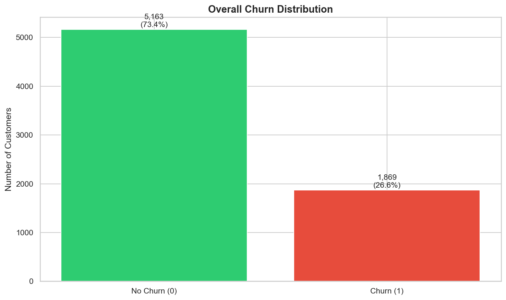
    <figcaption style="font-size: 0.95em; color: #555; margin-top: 8px;">
      Overall churn distribution &mdash; 5,163 customers retained (73.4%) vs. 1,869 churned (26.6%).
      The moderate imbalance drives the decision to use <code>class_weight='balanced'</code> in modeling and
      evaluate with recall/AUC rather than accuracy.
    </figcaption>
  </figure>

  <h3>Chart 2: Churn Rate by Contract Type</h3>
  

    This is the single most impactful chart from the entire EDA. Contract type is the strongest churn predictor
    by a wide margin: month-to-month customers churn at <strong>42.7%</strong>, one-year contract customers at
    <strong>11.3%</strong>, and two-year contract customers at just <strong>2.8%</strong>. This 15&times;
    difference between the highest and lowest churn rates makes contract type the clearest lever for retention
    strategy.
  

  <pre><code class="language-python"># Churn rate by contract type — the single most impactful EDA chart
contract_churn = df.groupby('Contract')['Churn'].mean().sort_values(ascending=False)

fig, ax = plt.subplots(figsize=(8, 5))
colors = ['#e74c3c', '#f39c12', '#2ecc71']
bars = ax.bar(contract_churn.index, contract_churn.values * 100,
              color=colors, edgecolor='black', linewidth=0.5)

for bar, rate in zip(bars, contract_churn.values):
    ax.text(bar.get_x() + bar.get_width()/2, bar.get_height() + 0.8,
            f'{rate*100:.1f}%', ha='center', fontsize=13, fontweight='bold')

ax.set_title('Churn Rate by Contract Type', fontsize=14, fontweight='bold')
ax.set_ylabel('Churn Rate (%)')
ax.set_ylim(0, 50)
plt.tight_layout()
plt.savefig('../outputs/figures/churn_by_contract.png', dpi=150, bbox_inches='tight')
plt.show()</code></pre>

  <figure style="margin: 20px 0;">
    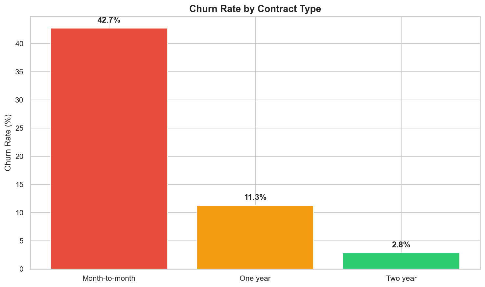
    <figcaption style="font-size: 0.95em; color: #555; margin-top: 8px;">
      Churn rate by contract type &mdash; month-to-month customers churn at 42.7% vs. just 2.8% for two-year
      contracts. This chart was reused in the Streamlit app's Data Insights page. The 15&times; spread directly
      informed the top business recommendation: incentivize annual contracts.
    </figcaption>
  </figure>

  <h3>Chart 3: Tenure Distribution by Churn Status</h3>
  

    This visualization confirms that <strong>churn is heavily front-loaded</strong>. Customers who churned
    are concentrated in the first 0&ndash;12 months of tenure, while retained customers are distributed more
    evenly across the full 0&ndash;72 month range. Long-tenured customers (60+ months) rarely churn. This
    pattern directly motivated the <code>TenureGroup</code> and <code>is_new_customer</code> engineered
    features in Phase 3.
  

  <pre><code class="language-python"># Tenure distribution by churn status — overlapping histograms
fig, ax = plt.subplots(figsize=(10, 6))
ax.hist(df[df['Churn'] == 0]['tenure'], bins=40, alpha=0.6,
        label='No Churn', color='#2ecc71', edgecolor='black', linewidth=0.3)
ax.hist(df[df['Churn'] == 1]['tenure'], bins=40, alpha=0.6,
        label='Churn', color='#e74c3c', edgecolor='black', linewidth=0.3)

ax.set_title('Tenure Distribution by Churn Status', fontsize=14, fontweight='bold')
ax.set_xlabel('Tenure (months)')
ax.set_ylabel('Number of Customers')
ax.legend(fontsize=12)
plt.tight_layout()
plt.savefig('../outputs/figures/tenure_by_churn.png', dpi=150, bbox_inches='tight')
plt.show()</code></pre>

  <figure style="margin: 20px 0;">
    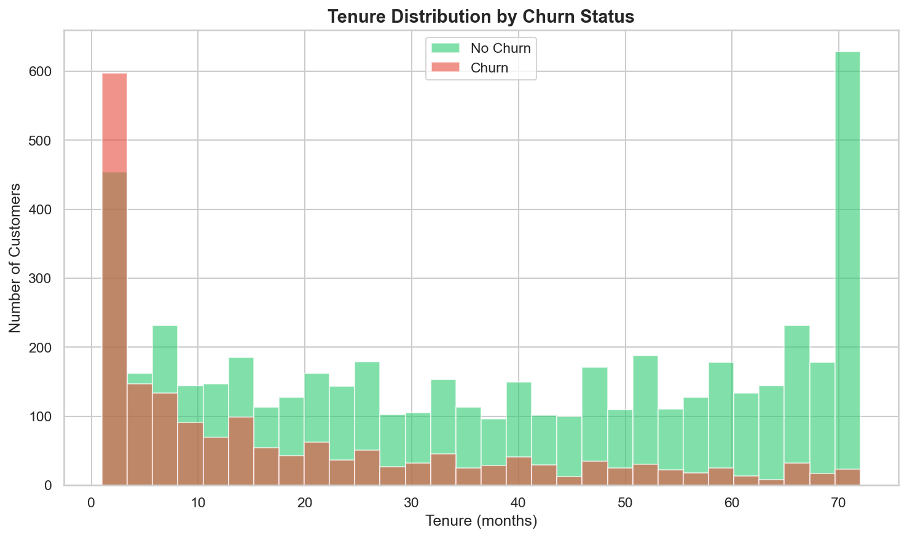
    <figcaption style="font-size: 0.95em; color: #555; margin-top: 8px;">
      Tenure distribution by churn status &mdash; churners (red) are concentrated in the first 0&ndash;12 months,
      while retained customers (green) spread across the full range. Also reused in the Streamlit app.
    </figcaption>
  </figure>

  <h3>Chart 4: Monthly Charges Distribution by Churn Status</h3>
  

    Customers who churned skew toward <strong>higher monthly charges ($70&ndash;$100/month)</strong>, while retained
    customers cluster at the low end (~$20). This aligns with the fiber optic finding (fiber costs more) and
    suggests that higher-paying customers may feel they're not getting enough value for the premium.
  

  <pre><code class="language-python"># Monthly charges distribution by churn status
fig, ax = plt.subplots(figsize=(10, 6))
ax.hist(df[df['Churn'] == 0]['MonthlyCharges'], bins=40, alpha=0.6,
        label='No Churn', color='#2ecc71', edgecolor='black', linewidth=0.3)
ax.hist(df[df['Churn'] == 1]['MonthlyCharges'], bins=40, alpha=0.6,
        label='Churn', color='#e74c3c', edgecolor='black', linewidth=0.3)

ax.set_title('Monthly Charges by Churn Status', fontsize=14, fontweight='bold')
ax.set_xlabel('Monthly Charges ($)')
ax.set_ylabel('Number of Customers')
ax.legend(fontsize=12)
plt.tight_layout()
plt.savefig('../outputs/figures/monthly_charges_by_churn.png', dpi=150, bbox_inches='tight')
plt.show()</code></pre>

  <figure style="margin: 20px 0;">
    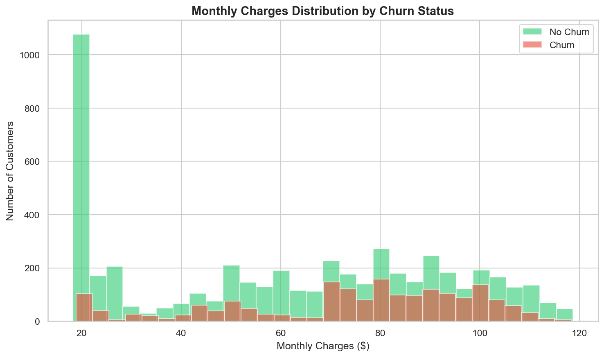
    <figcaption style="font-size: 0.95em; color: #555; margin-top: 8px;">
      Monthly charges by churn status &mdash; churners (red) skew toward $70&ndash;$100/month,
      while retained customers (green) cluster at the low end (~$20/month).
    </figcaption>
  </figure>

  <h3>Chart 5: Churn Rate Across All Categorical Features</h3>
  

    A 4&times;4 grid of bar charts shows the churn rate across all 16 categorical features in a single view.
    This comprehensive visual makes it easy to spot which features have a strong signal (Contract, InternetService,
    OnlineSecurity, TechSupport, PaymentMethod) versus those with little or no signal (gender, PhoneService).
  

  <pre><code class="language-python"># Churn rate by ALL categorical features — 4×4 grid
cat_cols = ['gender', 'SeniorCitizen', 'Partner', 'Dependents',
            'PhoneService', 'MultipleLines', 'InternetService', 'OnlineSecurity',
            'OnlineBackup', 'DeviceProtection', 'TechSupport', 'StreamingTV',
            'StreamingMovies', 'Contract', 'PaperlessBilling', 'PaymentMethod']

fig, axes = plt.subplots(4, 4, figsize=(20, 16))
axes = axes.flatten()

for i, col in enumerate(cat_cols):
    churn_rate = df.groupby(col)['Churn'].mean().sort_values(ascending=False)
    axes[i].bar(range(len(churn_rate)), churn_rate.values * 100,
                color='#3498db', edgecolor='black', linewidth=0.3)
    axes[i].set_title(col, fontsize=11, fontweight='bold')
    axes[i].set_xticks(range(len(churn_rate)))
    axes[i].set_xticklabels(churn_rate.index, rotation=45, ha='right', fontsize=8)
    axes[i].set_ylabel('Churn %')

    # Add value labels
    for j, (rate, label) in enumerate(zip(churn_rate.values, churn_rate.index)):
        axes[i].text(j, rate * 100 + 0.5, f'{rate*100:.1f}%',
                     ha='center', fontsize=7, fontweight='bold')

plt.suptitle('Churn Rate by Categorical Feature', fontsize=16, fontweight='bold', y=1.01)
plt.tight_layout()
plt.savefig('../outputs/figures/churn_by_categories.png', dpi=150, bbox_inches='tight')
plt.show()</code></pre>

  <figure style="margin: 20px 0;">
    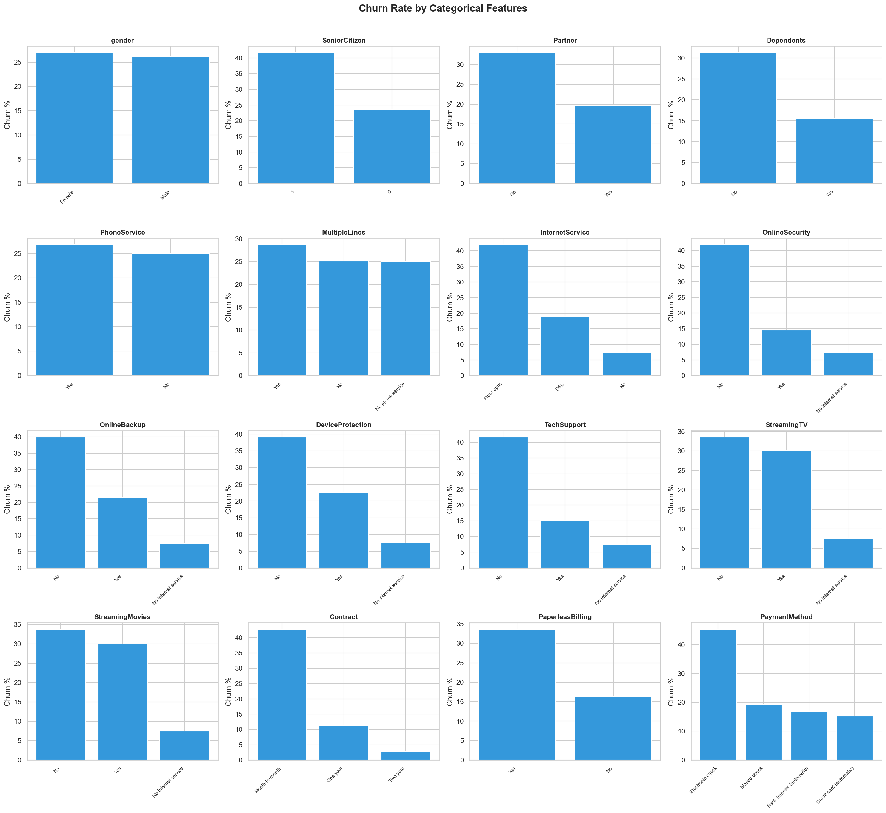
    <figcaption style="font-size: 0.95em; color: #555; margin-top: 8px;">
      Churn rate across all 16 categorical features &mdash; Contract, InternetService, OnlineSecurity,
      TechSupport, and PaymentMethod show the strongest signals. Gender and PhoneService show virtually
      no difference in churn rates.
    </figcaption>
  </figure>

  <h3>Chart 6: Correlation Heatmap</h3>
  

    The correlation heatmap quantifies relationships between the numeric features and the encoded churn target.
    Key correlations: <code>tenure</code> vs. Churn is <strong>&minus;0.35</strong> (the strongest single
    predictor), <code>TotalCharges</code> vs. <code>tenure</code> is <strong>0.83</strong> (expected &mdash;
    charges accumulate with time), <code>MonthlyCharges</code> vs. Churn is <strong>0.19</strong> (moderate
    positive), and <code>TotalCharges</code> vs. Churn is <strong>&minus;0.20</strong> (loyal customers
    accumulate more charges). The high correlation between TotalCharges and tenure (0.83) was noted but
    both were kept because the model can handle multicollinearity in tree-based methods, and the linear model
    benefits from their distinct information.
  

  <pre><code class="language-python"># Correlation heatmap for numeric features + target
numeric_cols = ['SeniorCitizen', 'tenure', 'MonthlyCharges', 'TotalCharges', 'Churn']
corr_matrix = df[numeric_cols].corr()

fig, ax = plt.subplots(figsize=(8, 6))
sns.heatmap(corr_matrix, annot=True, fmt='.2f', cmap='RdBu_r', center=0,
            square=True, linewidths=0.5, ax=ax,
            vmin=-1, vmax=1, cbar_kws={'shrink': 0.8})
ax.set_title('Correlation Heatmap — Numeric Features + Churn', fontsize=14, fontweight='bold')
plt.tight_layout()
plt.savefig('../outputs/figures/correlation_heatmap.png', dpi=150, bbox_inches='tight')
plt.show()</code></pre>

  <figure style="margin: 20px 0;">
    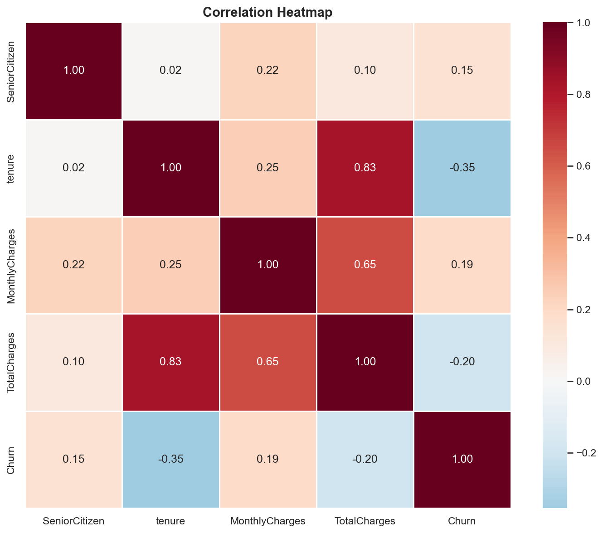
    <figcaption style="font-size: 0.95em; color: #555; margin-top: 8px;">
      Correlation heatmap &mdash; tenure has the strongest correlation with churn (&minus;0.35), while
      TotalCharges and tenure are highly correlated (0.83) as expected. MonthlyCharges shows a moderate
      positive correlation with churn (0.19).
    </figcaption>
  </figure>

  <h3>Chart 7: Tenure vs. Monthly Charges Scatter Plot</h3>
  

    This scatter plot explores whether there is a visible boundary between churners and non-churners in
    the tenure&ndash;MonthlyCharges feature space. The pattern shows that churners (red) tend to cluster in the
    <strong>low-tenure, high-charge</strong> region (bottom-right area), while retained customers are spread
    more broadly. This confirms the intuition that customers paying a lot as new subscribers are the highest
    risk &mdash; a pattern captured by the <code>AvgMonthlyCharge</code> engineered feature in Phase 3.
  

  <pre><code class="language-python"># Scatter plot: tenure vs monthly charges colored by churn
fig, ax = plt.subplots(figsize=(10, 6))

# Plot retained customers first (background), then churners (foreground)
retained = df[df['Churn'] == 0]
churned = df[df['Churn'] == 1]

ax.scatter(retained['tenure'], retained['MonthlyCharges'],
           alpha=0.3, c='#2ecc71', label='No Churn', s=15, edgecolors='none')
ax.scatter(churned['tenure'], churned['MonthlyCharges'],
           alpha=0.5, c='#e74c3c', label='Churn', s=15, edgecolors='none')

ax.set_title('Tenure vs Monthly Charges by Churn Status', fontsize=14, fontweight='bold')
ax.set_xlabel('Tenure (months)')
ax.set_ylabel('Monthly Charges ($)')
ax.legend(fontsize=12)
plt.tight_layout()
plt.savefig('../outputs/figures/tenure_vs_charges_scatter.png', dpi=150, bbox_inches='tight')
plt.show()</code></pre>

  <figure style="margin: 20px 0;">
    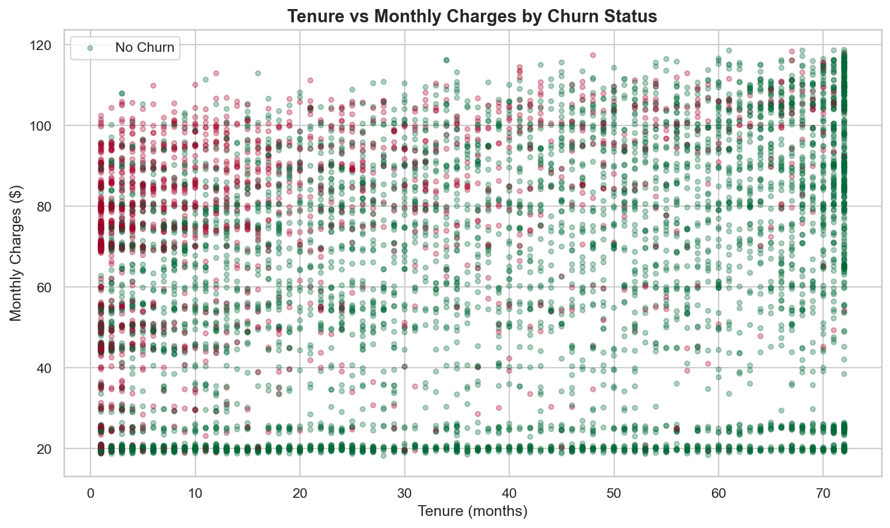
    <figcaption style="font-size: 0.95em; color: #555; margin-top: 8px;">
      Tenure vs. monthly charges &mdash; churners (red) cluster in the low-tenure, high-charge region,
      while retained customers (green) spread more broadly. No clean linear boundary, confirming that
      multiple features interact to drive churn.
    </figcaption>
  </figure>

  <h3>Key Findings Summary</h3>
  

    The EDA findings are ranked by importance to churn prediction. These directly informed feature engineering
    decisions in Phase 3 and business recommendations at the end of the project:
  

  <table>
    <thead>
      <tr><th>#</th><th>Finding</th><th>Evidence</th><th>Impact on Later Phases</th></tr>
    </thead>
    <tbody>
      <tr>
        <td>1</td>
        <td><strong>Contract type is the strongest predictor</strong></td>
        <td>Month-to-month: 42.7% churn, One year: 11.3%, Two year: 2.8%</td>
        <td>Became the #2 SHAP feature (<code>Contract_Two year</code>); drove the top business recommendation</td>
      </tr>
      <tr>
        <td>2</td>
        <td><strong>Churn is front-loaded by tenure</strong></td>
        <td>Most churners leave within first 12 months; 60+ month customers rarely churn</td>
        <td>Motivated <code>TenureGroup</code> engineered feature; tenure became #1 SHAP feature</td>
      </tr>
      <tr>
        <td>3</td>
        <td><strong>Higher monthly charges correlate with churn</strong></td>
        <td>Churners skew $70&ndash;$100/month; retained cluster at ~$20</td>
        <td>MonthlyCharges kept as numeric feature; correlation = 0.19 with churn</td>
      </tr>
      <tr>
        <td>4</td>
        <td><strong>Fiber optic customers churn more</strong></td>
        <td>Higher churn despite paying more &mdash; suggests service quality issue</td>
        <td>Became #3 SHAP feature (<code>InternetService_Fiber optic</code>); drove business recommendation</td>
      </tr>
      <tr>
        <td>5</td>
        <td><strong>Lack of support add-ons increases churn</strong></td>
        <td>No OnlineSecurity / No TechSupport have significantly higher churn rates</td>
        <td>Motivated <code>ServiceCount</code> and <code>HasInternet</code> engineered features</td>
      </tr>
      <tr>
        <td>6</td>
        <td><strong>Electronic check has higher churn</strong></td>
        <td>Noticeably higher churn rate than mailed check, bank transfer, or credit card</td>
        <td>Became #8 SHAP feature; drove "migrate payment methods" recommendation</td>
      </tr>
      <tr>
        <td>7</td>
        <td><strong>Gender and phone service have no signal</strong></td>
        <td>Virtually identical churn rates across categories</td>
        <td>Kept in model (let the model confirm) but expected near-zero SHAP importance &mdash; confirmed</td>
      </tr>
    </tbody>
  </table>

  <h3>Correlation Highlights</h3>
  <table>
    <thead>
      <tr><th>Feature Pair</th><th>Correlation</th><th>Interpretation</th></tr>
    </thead>
    <tbody>
      <tr>
        <td><code>tenure</code> vs. <code>Churn</code></td>
        <td>&minus;0.35</td>
        <td>Strongest single numeric predictor &mdash; longer tenure = less churn</td>
      </tr>
      <tr>
        <td><code>TotalCharges</code> vs. <code>tenure</code></td>
        <td>0.83</td>
        <td>High positive &mdash; expected, as charges accumulate over time</td>
      </tr>
      <tr>
        <td><code>MonthlyCharges</code> vs. <code>Churn</code></td>
        <td>0.19</td>
        <td>Moderate positive &mdash; higher monthly bills correlate with more churn</td>
      </tr>
      <tr>
        <td><code>TotalCharges</code> vs. <code>Churn</code></td>
        <td>&minus;0.20</td>
        <td>Negative &mdash; loyal customers accumulate more total charges</td>
      </tr>
      <tr>
        <td><code>SeniorCitizen</code> vs. <code>Churn</code></td>
        <td>0.15</td>
        <td>Slight positive &mdash; senior citizens churn somewhat more</td>
      </tr>
    </tbody>
  </table>

  <h3>Charts Generated</h3>
  <table>
    <thead>
      <tr><th>File</th><th>Description</th><th>Reused In</th></tr>
    </thead>
    <tbody>
      <tr>
        <td><code>churn_distribution.png</code></td>
        <td>Overall churn bar chart: 5,163 No (73.4%) / 1,869 Yes (26.6%)</td>
        <td>Portfolio page</td>
      </tr>
      <tr>
        <td><code>churn_by_contract.png</code></td>
        <td>Churn rate by contract type: 42.7% / 11.3% / 2.8%</td>
        <td>Streamlit app (Page 3), portfolio page</td>
      </tr>
      <tr>
        <td><code>tenure_by_churn.png</code></td>
        <td>Overlapping histograms of tenure by churn status</td>
        <td>Streamlit app (Page 3), portfolio page</td>
      </tr>
      <tr>
        <td><code>monthly_charges_by_churn.png</code></td>
        <td>Overlapping histograms of monthly charges by churn</td>
        <td>Portfolio page</td>
      </tr>
      <tr>
        <td><code>churn_by_categories.png</code></td>
        <td>4&times;4 grid of churn rate across all 16 categorical features</td>
        <td>Portfolio page</td>
      </tr>
      <tr>
        <td><code>correlation_heatmap.png</code></td>
        <td>Heatmap of numeric feature correlations including Churn</td>
        <td>Portfolio page</td>
      </tr>
      <tr>
        <td><code>tenure_vs_charges_scatter.png</code></td>
        <td>Scatter: tenure vs. monthly charges colored by churn</td>
        <td>Portfolio page</td>
      </tr>
    </tbody>
  </table>

  <h3>EDA &rarr; Feature Engineering Connection</h3>
  

    The EDA findings directly shaped the five engineered features created in Phase 3. The front-loaded tenure
    pattern motivated <code>TenureGroup</code> (bucketing tenure into 0&ndash;12, 13&ndash;24, 25&ndash;48,
    49+ month bins). The support add-on signal motivated <code>ServiceCount</code> (counting how many optional
    services a customer has &mdash; more services = more switching cost = stickier customer). The
    internet/phone service patterns motivated <code>HasInternet</code> and <code>HasPhone</code> as binary
    consolidation features. And the observation that churners cluster in the low-tenure, high-charge region
    motivated <code>AvgMonthlyCharge</code> (TotalCharges / tenure) to capture the cost-to-loyalty ratio.
  

  

    Two additional EDA-only analyses were performed but <strong>intentionally excluded from the model</strong>:
    <code>tenure_group</code> (binned churn rates for visualization only &mdash; redundant with raw
    <code>tenure</code> for modeling) and a <code>TotalCharges / (tenure + 1)</code> validation check
    (confirming data consistency &mdash; nearly identical to MonthlyCharges, would add multicollinearity if
    used as a feature).
  

  
<strong>Phase 3 &mdash; Feature Engineering &amp; Preprocessing</strong>

  

  <h3>Overview</h3>
  

    Phase 3 transforms the cleaned dataset into a model-ready format through three steps: engineering 5 new
    domain-informed features, splitting the data into train/test sets with stratification, and building a
    scikit-learn preprocessing pipeline that scales numeric features and one-hot encodes categorical features.
    A critical design decision was placing all feature engineering logic in a <strong>shared Python module</strong>
    (<code>feature_helpers.py</code>) used by both the training notebooks and the deployed Streamlit app &mdash;
    guaranteeing identical transformations at train time and serve time. All work runs in
    <code>notebooks/03_feature_engineering.ipynb</code>.
  

  <h3>Key Code: Load Cleaned Data &amp; Apply Feature Engineering</h3>
  

    The notebook loads the cleaned CSV from Phase 1, imports the shared <code>engineer_features()</code> function,
    and applies it to create the 5 new columns. The output is verified by inspecting the first 10 rows of the
    new features alongside the original columns they were derived from:
  

  <pre><code class="language-python">import pandas as pd
import numpy as np
from sklearn.model_selection import train_test_split
from sklearn.preprocessing import StandardScaler, OneHotEncoder
from sklearn.compose import ColumnTransformer
import joblib
import os

# Load cleaned dataset from Phase 1
df = pd.read_csv('../data/telco_churn_cleaned.csv')

# Import and apply shared feature engineering function
from feature_helpers import engineer_features
df = engineer_features(df)

print(f"Shape after feature engineering: {df.shape}")
print(f"\nNew columns: ServiceCount, HasInternet, HasPhone, AvgMonthlyCharge, TenureGroup")
# Output:
# Shape after feature engineering: (7032, 25)
# New columns: ServiceCount, HasInternet, HasPhone, AvgMonthlyCharge, TenureGroup

# Verify new features
print(f"\nSample of new features:")
df[['tenure', 'MonthlyCharges', 'TotalCharges', 'ServiceCount',
    'HasInternet', 'HasPhone', 'AvgMonthlyCharge', 'TenureGroup']].head(10)
# Output:
#    tenure  MonthlyCharges  TotalCharges  ServiceCount  HasInternet  HasPhone  AvgMonthlyCharge  TenureGroup
# 0       1           29.85         29.85             1            1         0         29.850000            0
# 1      34           56.95       1889.50             2            1         1         55.573529            2
# 2       2           53.85        108.15             2            1         1         54.075000            0
# 3      45           42.30       1840.75             3            1         0         40.905556            2
# 4       2           70.70        151.65             0            1         1         75.825000            0
# 5       8           99.65        820.50             3            1         1        102.562500            0
# 6      22           89.10       1949.40             2            1         1         88.609091            1
# 7      10           29.75        301.90             1            1         0         30.190000            0
# 8      28          104.80       3046.05             4            1         1        108.787500            2
# 9      62           56.15       3487.95             2            1         1         56.257258            3</code></pre>

  <h3>The Shared Feature Engineering Function</h3>
  

    This is the <strong>single source of truth</strong> for all feature transformations. The function lives in
    <code>notebooks/feature_helpers.py</code> and is copied identically to <code>app/feature_helpers.py</code>
    for the Streamlit deployment. Any change to feature logic must be made in this one function to guarantee
    train/serve consistency:
  

  <pre><code class="language-python">"""
Shared feature engineering function.
Used by notebooks (training) and Streamlit app (prediction)
to ensure identical transformations.
"""

def engineer_features(df):
    """
    Create engineered features from the cleaned telco churn dataset.

    Parameters:
        df: pandas DataFrame with cleaned columns

    Returns:
        df: DataFrame with new features added
    """
    df = df.copy()

    # 1. Service count: how many optional services does the customer have?
    service_cols = ['OnlineSecurity', 'OnlineBackup', 'DeviceProtection',
                    'TechSupport', 'StreamingTV', 'StreamingMovies']
    df['ServiceCount'] = df[service_cols].apply(
        lambda row: (row == 'Yes').sum(), axis=1
    )

    # 2. Has internet service (binary)
    df['HasInternet'] = (df['InternetService'] != 'No').astype(int)

    # 3. Has phone service (binary)
    df['HasPhone'] = (df['PhoneService'] == 'Yes').astype(int)

    # 4. Average monthly charge (TotalCharges / tenure), handle tenure=0
    df['AvgMonthlyCharge'] = df.apply(
        lambda row: row['TotalCharges'] / row['tenure'] if row['tenure'] > 0
        else row['MonthlyCharges'], axis=1
    )

    # 5. Tenure group (numeric encoding for modeling)
    def tenure_bucket(t):
        if t <= 12: return 0
        elif t <= 24: return 1
        elif t <= 48: return 2
        else: return 3

    df['TenureGroup'] = df['tenure'].apply(tenure_bucket)

    return df</code></pre>

  <h3>5 Engineered Features</h3>
  <table>
    <thead>
      <tr><th>Feature</th><th>Logic</th><th>Type</th><th>EDA Insight That Motivated It</th></tr>
    </thead>
    <tbody>
      <tr>
        <td><code>ServiceCount</code></td>
        <td>Count of "Yes" across 6 optional service columns (OnlineSecurity, OnlineBackup, DeviceProtection, TechSupport, StreamingTV, StreamingMovies)</td>
        <td>int (0&ndash;6)</td>
        <td>EDA showed lack of add-ons increases churn &mdash; more services = more switching cost = stickier customer</td>
      </tr>
      <tr>
        <td><code>HasInternet</code></td>
        <td>1 if InternetService &ne; "No", else 0</td>
        <td>binary</td>
        <td>Internet customers (especially fiber optic) churn at higher rates &mdash; consolidates the signal</td>
      </tr>
      <tr>
        <td><code>HasPhone</code></td>
        <td>1 if PhoneService = "Yes", else 0</td>
        <td>binary</td>
        <td>Parallel to HasInternet &mdash; consolidates base service indicator</td>
      </tr>
      <tr>
        <td><code>AvgMonthlyCharge</code></td>
        <td>TotalCharges / tenure (uses MonthlyCharges if tenure = 0)</td>
        <td>float</td>
        <td>Churners cluster in the low-tenure, high-charge scatter region &mdash; captures the cost-to-loyalty ratio</td>
      </tr>
      <tr>
        <td><code>TenureGroup</code></td>
        <td>0&ndash;12 &rarr; 0, 13&ndash;24 &rarr; 1, 25&ndash;48 &rarr; 2, 49+ &rarr; 3</td>
        <td>int (0&ndash;3)</td>
        <td>Churn is heavily front-loaded in the first 12 months &mdash; bucketing captures this non-linear relationship</td>
      </tr>
    </tbody>
  </table>

  <h4>Features Intentionally Excluded from the Model</h4>
  

    Two additional features were computed during EDA but <strong>intentionally excluded</strong> from the
    modeling pipeline:
  

  <table>
    <thead>
      <tr><th>Feature</th><th>Used In</th><th>Why Excluded</th></tr>
    </thead>
    <tbody>
      <tr>
        <td><code>tenure_group</code> (string bins)</td>
        <td>EDA only (binned churn rate chart)</td>
        <td>Redundant with raw <code>tenure</code> for modeling; the numeric <code>TenureGroup</code> serves the same role more efficiently</td>
      </tr>
      <tr>
        <td><code>TotalCharges / (tenure + 1)</code></td>
        <td>EDA only (data quality validation)</td>
        <td>Nearly identical to <code>MonthlyCharges</code> &mdash; would add multicollinearity without new signal</td>
      </tr>
    </tbody>
  </table>

  <h3>Key Code: Define Feature Lists &amp; Separate Target</h3>
  

    After feature engineering, the 24 features (excluding the <code>Churn</code> target) are explicitly split
    into numeric and categorical lists. This separation drives the preprocessing pipeline &mdash; numeric
    features get <code>StandardScaler</code>, categorical features get <code>OneHotEncoder</code>:
  

  <pre><code class="language-python"># Define feature lists
numeric_features = ['SeniorCitizen', 'tenure', 'MonthlyCharges', 'TotalCharges',
                    'ServiceCount', 'HasInternet', 'HasPhone', 'AvgMonthlyCharge',
                    'TenureGroup']

categorical_features = ['gender', 'Partner', 'Dependents', 'PhoneService',
                        'MultipleLines', 'InternetService', 'OnlineSecurity',
                        'OnlineBackup', 'DeviceProtection', 'TechSupport',
                        'StreamingTV', 'StreamingMovies', 'Contract',
                        'PaperlessBilling', 'PaymentMethod']

print(f"Numeric features ({len(numeric_features)}): {numeric_features}")
print(f"\nCategorical features ({len(categorical_features)}): {categorical_features}")
print(f"\nTotal features: {len(numeric_features) + len(categorical_features)}")
# Output:
# Numeric features (9): ['SeniorCitizen', 'tenure', 'MonthlyCharges', ...]
# Categorical features (15): ['gender', 'Partner', 'Dependents', ...]
# Total features: 24

# Separate features and target
X = df[numeric_features + categorical_features]
y = df['Churn']

print(f"\nX shape: {X.shape}")
print(f"y shape: {y.shape}")
print(f"y distribution:\n{y.value_counts(normalize=True).round(4)}")
# Output:
# X shape: (7032, 24)
# y shape: (7032,)
# y distribution:
# Churn
# 0    0.7342
# 1    0.2658</code></pre>

  <h3>Key Code: Train/Test Split with Stratification</h3>
  

    The data is split <strong>before any preprocessing</strong> to prevent data leakage. The
    <code>stratify=y</code> parameter ensures both train and test sets preserve the original 73.4/26.6 class
    distribution, which is critical for reliable evaluation on imbalanced data:
  

  <pre><code class="language-python"># Train-test split (80/20) with stratification to preserve churn ratio
X_train, X_test, y_train, y_test = train_test_split(
    X, y, test_size=0.2, random_state=42, stratify=y
)

print(f"X_train: {X_train.shape}")
print(f"X_test:  {X_test.shape}")
print(f"\nTrain churn rate: {y_train.mean():.4f}")
print(f"Test churn rate:  {y_test.mean():.4f}")
# Output:
# X_train: (5625, 24)
# X_test:  (1407, 24)
#
# Train churn rate: 0.2658
# Test churn rate:  0.2658  ← stratification confirmed</code></pre>

  <h3>Key Code: Build Preprocessing Pipeline</h3>
  

    The <code>ColumnTransformer</code> applies <code>StandardScaler</code> to the 9 numeric features and
    <code>OneHotEncoder</code> to the 15 categorical features. Three key design decisions:
  

  

    <strong><code>drop='first'</code></strong> avoids the dummy variable trap for Logistic Regression and SVM
    (e.g., for a 3-category column like InternetService, only 2 binary columns are created, with the dropped
    category becoming the implicit baseline).
  

  

    <strong><code>handle_unknown='ignore'</code></strong> makes the pipeline robust for the Streamlit app &mdash;
    if a user enters a category combination not seen during training, the encoder outputs zeros instead of
    throwing an error.
  

  

    <strong>Fit on training data only, transform both</strong> &mdash; the scaler learns means/stds and the
    encoder learns categories exclusively from the training set. The test set is transformed using those
    learned parameters, preventing any information leakage from test to train.
  

  <pre><code class="language-python"># Build preprocessing pipeline
# StandardScaler for numeric features, OneHotEncoder for categorical features
preprocessor = ColumnTransformer(
    transformers=[
        ('num', StandardScaler(), numeric_features),
        ('cat', OneHotEncoder(drop='first', sparse_output=False,
                              handle_unknown='ignore'), categorical_features)
    ]
)

# Fit on training data only, transform both
X_train_processed = preprocessor.fit_transform(X_train)
X_test_processed = preprocessor.transform(X_test)

# Extract feature names for later use (SHAP needs these)
cat_feature_names = preprocessor.named_transformers_['cat'] \
    .get_feature_names_out(categorical_features).tolist()
all_feature_names = numeric_features + cat_feature_names

print(f"X_train_processed shape: {X_train_processed.shape}")
print(f"X_test_processed shape:  {X_test_processed.shape}")
print(f"\nTotal feature columns after encoding: {len(all_feature_names)}")
print(f"\nFirst 10 feature names: {all_feature_names[:10]}")
# Output:
# X_train_processed shape: (5625, 35)
# X_test_processed shape:  (1407, 35)
#
# Total feature columns after encoding: 35
#
# First 10 feature names: ['SeniorCitizen', 'tenure', 'MonthlyCharges',
#   'TotalCharges', 'ServiceCount', 'HasInternet', 'HasPhone',
#   'AvgMonthlyCharge', 'TenureGroup', 'gender_Male']</code></pre>

  <h3>Key Code: Save All Artifacts</h3>
  

    Four serialized artifacts are saved for consumption by the model training notebook (Phase 4),
    the tuning/SHAP notebook (Phase 5&ndash;6), and the Streamlit app:
  

  <pre><code class="language-python"># Save the preprocessor and feature names for later use
os.makedirs('../models', exist_ok=True)

joblib.dump(preprocessor, '../models/preprocessor.pkl')
joblib.dump(all_feature_names, '../models/feature_names.pkl')

# Also save the split data for the next notebook
joblib.dump((X_train, X_test, y_train, y_test), '../models/train_test_split.pkl')
joblib.dump((X_train_processed, X_test_processed), '../models/processed_data.pkl')

print("Saved:")
print("  - models/preprocessor.pkl")
print("  - models/feature_names.pkl")
print("  - models/train_test_split.pkl")
print("  - models/processed_data.pkl")</code></pre>

  <h3>Feature Summary: Before &amp; After Encoding</h3>
  <table>
    <thead>
      <tr><th>Stage</th><th>Numeric</th><th>Categorical</th><th>Total Columns</th></tr>
    </thead>
    <tbody>
      <tr>
        <td>After feature engineering (before encoding)</td>
        <td>9</td>
        <td>15</td>
        <td>24</td>
      </tr>
      <tr>
        <td>After OneHotEncoding (<code>drop='first'</code>)</td>
        <td>9</td>
        <td>26 (from 15 original)</td>
        <td>35</td>
      </tr>
    </tbody>
  </table>

  <h3>Complete Feature Lists</h3>
  <h4>9 Numeric Features (StandardScaler)</h4>
  <table>
    <thead>
      <tr><th>Feature</th><th>Source</th><th>Description</th></tr>
    </thead>
    <tbody>
      <tr><td><code>SeniorCitizen</code></td><td>Original</td><td>0/1 binary &mdash; already numeric in raw data</td></tr>
      <tr><td><code>tenure</code></td><td>Original</td><td>Months with the company (0&ndash;72)</td></tr>
      <tr><td><code>MonthlyCharges</code></td><td>Original</td><td>Monthly bill amount ($18.25&ndash;$118.75)</td></tr>
      <tr><td><code>TotalCharges</code></td><td>Original</td><td>Cumulative charges over customer lifetime</td></tr>
      <tr><td><code>ServiceCount</code></td><td>Engineered</td><td>Count of optional services (0&ndash;6)</td></tr>
      <tr><td><code>HasInternet</code></td><td>Engineered</td><td>1 if customer has any internet service</td></tr>
      <tr><td><code>HasPhone</code></td><td>Engineered</td><td>1 if customer has phone service</td></tr>
      <tr><td><code>AvgMonthlyCharge</code></td><td>Engineered</td><td>TotalCharges / tenure (cost-to-loyalty ratio)</td></tr>
      <tr><td><code>TenureGroup</code></td><td>Engineered</td><td>Bucketed tenure: 0&ndash;12&rarr;0, 13&ndash;24&rarr;1, 25&ndash;48&rarr;2, 49+&rarr;3</td></tr>
    </tbody>
  </table>

  <h4>15 Categorical Features (OneHotEncoder, drop='first')</h4>
  <table>
    <thead>
      <tr><th>Feature</th><th>Values</th><th>Columns After Encoding</th></tr>
    </thead>
    <tbody>
      <tr><td><code>gender</code></td><td>Male, Female</td><td>1 (<code>gender_Male</code>)</td></tr>
      <tr><td><code>Partner</code></td><td>Yes, No</td><td>1</td></tr>
      <tr><td><code>Dependents</code></td><td>Yes, No</td><td>1</td></tr>
      <tr><td><code>PhoneService</code></td><td>Yes, No</td><td>1</td></tr>
      <tr><td><code>MultipleLines</code></td><td>Yes, No, No phone service</td><td>2</td></tr>
      <tr><td><code>InternetService</code></td><td>DSL, Fiber optic, No</td><td>2</td></tr>
      <tr><td><code>OnlineSecurity</code></td><td>Yes, No, No internet service</td><td>2</td></tr>
      <tr><td><code>OnlineBackup</code></td><td>Yes, No, No internet service</td><td>2</td></tr>
      <tr><td><code>DeviceProtection</code></td><td>Yes, No, No internet service</td><td>2</td></tr>
      <tr><td><code>TechSupport</code></td><td>Yes, No, No internet service</td><td>2</td></tr>
      <tr><td><code>StreamingTV</code></td><td>Yes, No, No internet service</td><td>2</td></tr>
      <tr><td><code>StreamingMovies</code></td><td>Yes, No, No internet service</td><td>2</td></tr>
      <tr><td><code>Contract</code></td><td>Month-to-month, One year, Two year</td><td>2</td></tr>
      <tr><td><code>PaperlessBilling</code></td><td>Yes, No</td><td>1</td></tr>
      <tr><td><code>PaymentMethod</code></td><td>Electronic check, Mailed check, Bank transfer, Credit card</td><td>3</td></tr>
    </tbody>
  </table>
  

    <strong>Total after encoding:</strong> 9 numeric + 26 one-hot = <strong>35 columns</strong> entering the model.
  

  <h3>Train/Test Split Summary</h3>
  <table>
    <thead>
      <tr><th>Set</th><th>Rows</th><th>Features (before encoding)</th><th>Features (after encoding)</th><th>Churn Rate</th></tr>
    </thead>
    <tbody>
      <tr><td>Training</td><td>5,625</td><td>24</td><td>35</td><td>0.2658</td></tr>
      <tr><td>Test</td><td>1,407</td><td>24</td><td>35</td><td>0.2658</td></tr>
    </tbody>
  </table>
  

    The identical churn rates (0.2658) confirm that <code>stratify=y</code> worked correctly &mdash; both sets
    preserve the original class distribution.
  

  <h3>Saved Artifacts</h3>
  <table>
    <thead>
      <tr><th>File</th><th>Contents</th><th>Consumed By</th></tr>
    </thead>
    <tbody>
      <tr>
        <td><code>models/preprocessor.pkl</code></td>
        <td>Fitted <code>ColumnTransformer</code> (scaler + encoder)</td>
        <td>Phase 4 notebook, Phase 5&ndash;6 notebook, Streamlit app</td>
      </tr>
      <tr>
        <td><code>models/feature_names.pkl</code></td>
        <td>List of 35 post-encoding feature names</td>
        <td>SHAP explainability (Phase 6)</td>
      </tr>
      <tr>
        <td><code>models/train_test_split.pkl</code></td>
        <td>(X_train, X_test, y_train, y_test) before encoding</td>
        <td>Phase 4 notebook</td>
      </tr>
      <tr>
        <td><code>models/processed_data.pkl</code></td>
        <td>(X_train_processed, X_test_processed) after encoding</td>
        <td>Phase 4 notebook, Phase 5&ndash;6 notebook</td>
      </tr>
    </tbody>
  </table>

  <h3>Class Imbalance Strategy</h3>
  

    The 73.4/26.6 class split is moderate &mdash; not extreme enough for SMOTE (synthetic oversampling) but
    significant enough to require explicit handling. The chosen approach:
  

  <table>
    <thead>
      <tr><th>Strategy</th><th>Applied To</th><th>How It Works</th></tr>
    </thead>
    <tbody>
      <tr>
        <td><code>class_weight='balanced'</code></td>
        <td>Logistic Regression, Random Forest, SVM</td>
        <td>Adjusts the loss function to penalize misclassification of the minority class (churners) more heavily, proportional to class frequency</td>
      </tr>
      <tr>
        <td><code>scale_pos_weight</code></td>
        <td>XGBoost, LightGBM</td>
        <td>Set to ratio of negatives to positives (&asymp; 2.76) &mdash; equivalent effect to <code>class_weight='balanced'</code> for gradient boosting models</td>
      </tr>
      <tr>
        <td>Threshold tuning</td>
        <td>Final evaluation (Phase 6)</td>
        <td>Analyzed precision-recall tradeoff across thresholds to understand business impact of different cutoff points</td>
      </tr>
    </tbody>
  </table>

  <h3>SHAP Interpretation Note</h3>
  

    With <code>drop='first'</code>, SHAP values for one-hot encoded categories are interpreted
    <strong>relative to the dropped baseline category</strong>. For example, the SHAP value for
    <code>InternetService_Fiber optic</code> represents the effect of fiber optic <em>compared to the dropped
    baseline</em> (which is DSL). Similarly, <code>Contract_Two year</code> shows the effect compared to
    the dropped month-to-month baseline. This is technically correct and actually makes business interpretation
    intuitive &mdash; the most common/default category becomes the implicit reference point.
  

  
<strong>Phase 4 &mdash; Model Training &amp; Comparison</strong>

  

  <h3>Overview</h3>
  

    Phase 4 trains five classification algorithms head-to-head on the preprocessed training set, evaluates
    each with 5-fold stratified cross-validation, then scores them on the held-out test set across multiple
    metrics. The goal is not just to find the best model, but to compare algorithmic families &mdash; linear
    (Logistic Regression), ensemble (Random Forest), gradient boosting (XGBoost, LightGBM), and geometric
    (SVM) &mdash; and document <em>why</em> the winner was selected based on business-relevant criteria. All
    work runs in <code>notebooks/04_model_training.ipynb</code>.
  

  <h3>Why These 5 Models</h3>
  <table>
    <thead>
      <tr><th>#</th><th>Model</th><th>Library</th><th>Family</th><th>Why Include It</th></tr>
    </thead>
    <tbody>
      <tr>
        <td>1</td>
        <td>Logistic Regression</td>
        <td>sklearn</td>
        <td>Linear</td>
        <td>Baseline &mdash; simple, interpretable, fast. If this does well, complex models need to beat it to justify their complexity.</td>
      </tr>
      <tr>
        <td>2</td>
        <td>Random Forest</td>
        <td>sklearn</td>
        <td>Ensemble</td>
        <td>Ensemble of decision trees. Handles non-linear relationships, resistant to overfitting. Industry workhorse.</td>
      </tr>
      <tr>
        <td>3</td>
        <td>XGBoost</td>
        <td>xgboost</td>
        <td>Gradient Boosting</td>
        <td>Consistently wins Kaggle competitions for tabular data. Level-wise tree growth strategy.</td>
      </tr>
      <tr>
        <td>4</td>
        <td>LightGBM</td>
        <td>lightgbm</td>
        <td>Gradient Boosting</td>
        <td>Microsoft&rsquo;s gradient boosting framework. Leaf-wise tree growth &mdash; often faster than XGBoost with competitive accuracy.</td>
      </tr>
      <tr>
        <td>5</td>
        <td>SVM</td>
        <td>sklearn</td>
        <td>Geometric</td>
        <td>Different mathematical approach (finds optimal separating hyperplane). Shows breadth across algorithmic families.</td>
      </tr>
    </tbody>
  </table>

  <h3>Key Code: Load Artifacts &amp; Define All 5 Models</h3>
  

    The notebook loads the preprocessed data and fitted artifacts from Phase 3, then defines all five models
    with explicit class imbalance handling. Logistic Regression, Random Forest, and SVM use
    <code>class_weight='balanced'</code>, while XGBoost and LightGBM use <code>scale_pos_weight</code>
    (the ratio of non-churners to churners &asymp; 2.76):
  

  <pre><code class="language-python">import joblib
import pandas as pd
import numpy as np
from sklearn.linear_model import LogisticRegression
from sklearn.ensemble import RandomForestClassifier
from xgboost import XGBClassifier
from lightgbm import LGBMClassifier
from sklearn.svm import SVC
from sklearn.model_selection import cross_val_score, StratifiedKFold
from sklearn.metrics import (accuracy_score, precision_score, recall_score,
                              f1_score, roc_auc_score, classification_report,
                              confusion_matrix, RocCurveDisplay)
import matplotlib.pyplot as plt
import seaborn as sns

# Load preprocessed data and artifacts from Phase 3
X_train, X_test, y_train, y_test = joblib.load('../models/train_test_split.pkl')
X_train_processed, X_test_processed = joblib.load('../models/processed_data.pkl')
all_feature_names = joblib.load('../models/feature_names.pkl')

# Calculate class weight ratio for gradient boosting models
pos_weight = y_train.value_counts()[0] / y_train.value_counts()[1]
print(f"scale_pos_weight: {pos_weight:.2f}") # Output: scale_pos_weight: 2.76

# Define all 5 models with class imbalance handling
models = {
    'Logistic Regression': LogisticRegression(
        class_weight='balanced', max_iter=1000, random_state=42
    ),
    'Random Forest': RandomForestClassifier(
        class_weight='balanced', n_estimators=100, random_state=42
    ),
    'XGBoost': XGBClassifier(
        scale_pos_weight=pos_weight, n_estimators=100,
        random_state=42, eval_metric='logloss'
    ),
    'LightGBM': LGBMClassifier(
        scale_pos_weight=pos_weight, n_estimators=100,
        random_state=42, verbose=-1
    ),
    'SVM': SVC(
        class_weight='balanced', probability=True, random_state=42
    ),
}</code></pre>

  <h3>Key Code: 5-Fold Stratified Cross-Validation</h3>
  

    Each model is evaluated with 5-fold stratified cross-validation on the training set to assess
    generalization performance and stability. The stratified folds ensure each fold preserves the
    73.4/26.6 class ratio. Cross-validation scores are collected for AUC before any test set evaluation:
  

  <pre><code class="language-python"># 5-fold stratified cross-validation
cv = StratifiedKFold(n_splits=5, shuffle=True, random_state=42)

cv_results = {}
for name, model in models.items():
    cv_auc = cross_val_score(model, X_train_processed, y_train,
                              cv=cv, scoring='roc_auc')
    cv_results[name] = {
        'cv_auc_mean': cv_auc.mean(),
        'cv_auc_std': cv_auc.std(),
    }
    print(f"{name}: CV AUC = {cv_auc.mean():.4f} (±{cv_auc.std():.4f})")

# Output:
# Logistic Regression: CV AUC = 0.8453 (±0.0187)
# Random Forest:       CV AUC = 0.8282 (±0.0150)
# XGBoost:             CV AUC = 0.8212 (±0.0142)
# LightGBM:            CV AUC = 0.8346 (±0.0144)
# SVM:                 CV AUC = 0.8286 (±0.0190)</code></pre>

  <h3>Key Code: Train on Full Training Set &amp; Evaluate on Test Set</h3>
  

    After cross-validation, each model is trained on the full training set and evaluated on the held-out
    test set. Six metrics are collected per model: accuracy, precision, recall, F1, and AUC on the test set,
    plus the cross-validation AUC mean and standard deviation:
  

  <pre><code class="language-python"># Train each model and evaluate on test set
results = []
fitted_models = {}

for name, model in models.items():
    # Train on full training set
    model.fit(X_train_processed, y_train)
    fitted_models[name] = model

    # Predict on test set
    y_pred = model.predict(X_test_processed)
    y_prob = model.predict_proba(X_test_processed)[:, 1]

    # Collect all metrics
    results.append({
        'Model': name,
        'CV AUC (mean)': cv_results[name]['cv_auc_mean'],
        'CV AUC (std)': cv_results[name]['cv_auc_std'],
        'Accuracy': accuracy_score(y_test, y_pred),
        'Precision': precision_score(y_test, y_pred),
        'Recall': recall_score(y_test, y_pred),
        'F1': f1_score(y_test, y_pred),
        'AUC': roc_auc_score(y_test, y_prob),
    })

# Create comparison DataFrame sorted by Test AUC
results_df = pd.DataFrame(results).sort_values('AUC', ascending=False).round(4)
print(results_df.to_string(index=False))</code></pre>

  <h3>Results: Head-to-Head Comparison</h3>
  

    The complete results table, sorted by test AUC (the primary overall quality metric):
  

  <table>
    <thead>
      <tr>
        <th>Model</th>
        <th>CV AUC (mean)</th>
        <th>CV AUC (std)</th>
        <th>Accuracy</th>
        <th>Precision</th>
        <th>Recall</th>
        <th>F1</th>
        <th>AUC</th>
      </tr>
    </thead>
    <tbody>
      <tr>
        <td><strong>Logistic Regression</strong></td>
        <td><strong>0.8453</strong></td>
        <td>0.0187</td>
        <td>0.7242</td>
        <td>0.4884</td>
        <td><strong>0.7888</strong></td>
        <td>0.6033</td>
        <td><strong>0.8344</strong></td>
      </tr>
      <tr>
        <td>LightGBM</td>
        <td>0.8346</td>
        <td>0.0144</td>
        <td>0.7548</td>
        <td>0.5263</td>
        <td>0.7754</td>
        <td><strong>0.6270</strong></td>
        <td>0.8292</td>
      </tr>
      <tr>
        <td>Random Forest</td>
        <td>0.8282</td>
        <td>0.0150</td>
        <td><strong>0.7861</strong></td>
        <td><strong>0.6229</strong></td>
        <td>0.4947</td>
        <td>0.5514</td>
        <td>0.8170</td>
      </tr>
      <tr>
        <td>SVM</td>
        <td>0.8286</td>
        <td>0.0190</td>
        <td>0.7257</td>
        <td>0.4900</td>
        <td><strong>0.7888</strong></td>
        <td>0.6045</td>
        <td>0.8151</td>
      </tr>
      <tr>
        <td>XGBoost</td>
        <td>0.8212</td>
        <td>0.0142</td>
        <td>0.7456</td>
        <td>0.5164</td>
        <td>0.6738</td>
        <td>0.5847</td>
        <td>0.8095</td>
      </tr>
    </tbody>
  </table>
  

    Bold values indicate the best score in each column. Full CSV:
    <a href="./outputs/metrics/model_comparison.csv">model_comparison.csv</a>
  

  <h3>Key Code: Model Comparison Bar Chart</h3>

  <pre><code class="language-python"># Model comparison bar chart — AUC, Recall, F1 for all 5 models
metrics_to_plot = ['AUC', 'Recall', 'F1']
fig, axes = plt.subplots(1, 3, figsize=(18, 5))

for i, metric in enumerate(metrics_to_plot):
    values = results_df.sort_values(metric, ascending=True)
    axes[i].barh(values['Model'], values[metric], color='#3498db',
                 edgecolor='black', linewidth=0.5)
    axes[i].set_title(metric, fontsize=14, fontweight='bold')
    axes[i].set_xlim(0, 1)
    for j, (val, name) in enumerate(zip(values[metric], values['Model'])):
        axes[i].text(val + 0.01, j, f'{val:.4f}', va='center', fontsize=10)

plt.suptitle('Model Comparison — Key Metrics', fontsize=16, fontweight='bold')
plt.tight_layout()
plt.savefig('../outputs/figures/model_comparison.png', dpi=150, bbox_inches='tight')
plt.show()</code></pre>

  <figure style="margin: 20px 0;">
    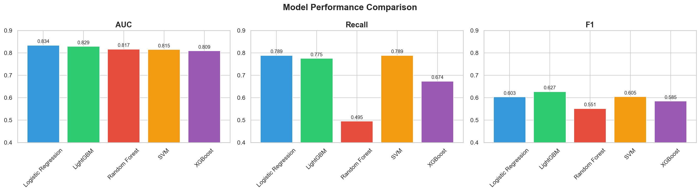
    <figcaption style="font-size: 0.95em; color: #555; margin-top: 8px;">
      Model comparison across AUC, Recall, and F1 &mdash; Logistic Regression leads on AUC (0.8344) and
      Recall (0.7888), while LightGBM has the highest F1 (0.6270). Also displayed in the Streamlit app
      (Page 2: Model Performance).
    </figcaption>
  </figure>

  <h3>Key Code: ROC Curves Overlay</h3>

  <pre><code class="language-python"># ROC curves — all 5 models on the same plot
fig, ax = plt.subplots(figsize=(8, 6))

for name, model in fitted_models.items():
    y_prob = model.predict_proba(X_test_processed)[:, 1]
    RocCurveDisplay.from_predictions(y_test, y_prob, name=name, ax=ax)

# Add random baseline
ax.plot([0, 1], [0, 1], 'k--', label='Random (AUC = 0.50)', alpha=0.5)
ax.set_title('ROC Curves — All 5 Models', fontsize=14, fontweight='bold')
ax.legend(loc='lower right')
plt.tight_layout()
plt.savefig('../outputs/figures/roc_curves.png', dpi=150, bbox_inches='tight')
plt.show()</code></pre>

  <figure style="margin: 20px 0;">
    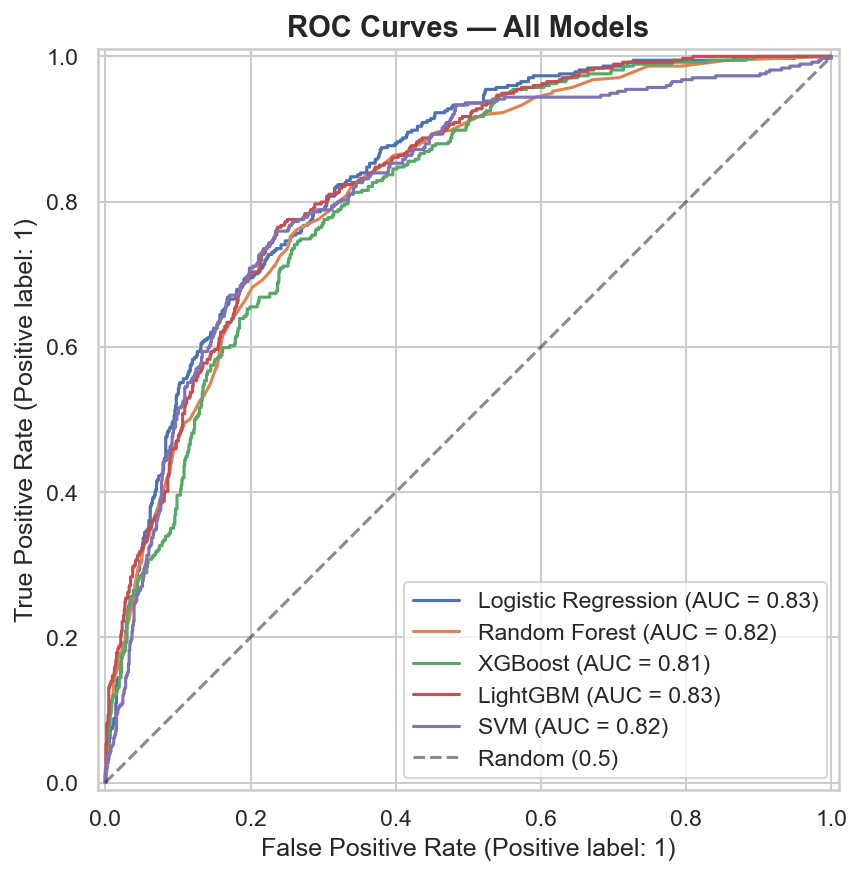
    <figcaption style="font-size: 0.95em; color: #555; margin-top: 8px;">
      ROC curves for all 5 models &mdash; all models significantly outperform the random baseline (dashed),
      with Logistic Regression (AUC=0.834) and LightGBM (AUC=0.829) showing the best discriminative ability.
      Also displayed in the Streamlit app (Page 2).
    </figcaption>
  </figure>

  <h3>Key Code: Confusion Matrices</h3>

  <pre><code class="language-python"># Confusion matrices — all 5 models side by side
fig, axes = plt.subplots(1, 5, figsize=(25, 4))

for i, (name, model) in enumerate(fitted_models.items()):
    y_pred = model.predict(X_test_processed)
    cm = confusion_matrix(y_test, y_pred)
    sns.heatmap(cm, annot=True, fmt='d', cmap='Blues', ax=axes[i],
                xticklabels=['No Churn', 'Churn'],
                yticklabels=['No Churn', 'Churn'])
    axes[i].set_title(name, fontsize=10, fontweight='bold')
    axes[i].set_ylabel('Actual' if i == 0 else '')
    axes[i].set_xlabel('Predicted')

plt.suptitle('Confusion Matrices — All 5 Models', fontsize=14, fontweight='bold')
plt.tight_layout()
plt.savefig('../outputs/figures/confusion_matrix.png', dpi=150, bbox_inches='tight')
plt.show()</code></pre>

  <figure style="margin: 20px 0;">
    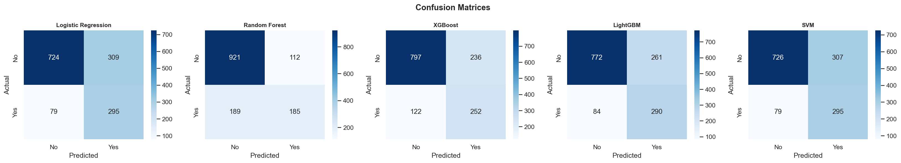
    <figcaption style="font-size: 0.95em; color: #555; margin-top: 8px;">
      Confusion matrices for all 5 models &mdash; Logistic Regression and SVM catch the most churners
      (295 of 374 = 79% recall) but generate more false positives, while Random Forest has the fewest
      false positives but misses over half of actual churners (49% recall). Also displayed in the Streamlit
      app (Page 2).
    </figcaption>
  </figure>

  <h3>Key Code: Save Artifacts</h3>

  <pre><code class="language-python"># Save the best model and all models
best_model = fitted_models['Logistic Regression']
joblib.dump(best_model, '../models/best_model.pkl')
joblib.dump(fitted_models, '../models/all_models.pkl')

# Save comparison table for Streamlit app
results_df.to_csv('../outputs/metrics/model_comparison.csv', index=False)

print("Saved:")
print("  - models/best_model.pkl (Logistic Regression)")
print("  - models/all_models.pkl (all 5 fitted models)")
print("  - outputs/metrics/model_comparison.csv")</code></pre>

  <h3>Best Model Selection: Logistic Regression</h3>
  

    The model selection criteria, ranked by priority for a churn prediction use case:
  

  <table>
    <thead>
      <tr><th>Priority</th><th>Criterion</th><th>Why It Matters for Churn</th><th>Winner</th></tr>
    </thead>
    <tbody>
      <tr>
        <td>1</td>
        <td><strong>Recall</strong></td>
        <td>A missed churner = lost customer (expensive). A false alarm = unnecessary retention offer (cheap). Optimize for catching churners.</td>
        <td>Logistic Regression &amp; SVM (tied: 0.7888)</td>
      </tr>
      <tr>
        <td>2</td>
        <td><strong>ROC-AUC</strong></td>
        <td>Overall discriminative ability across all thresholds &mdash; how well can the model separate churners from non-churners?</td>
        <td>Logistic Regression (0.8344)</td>
      </tr>
      <tr>
        <td>3</td>
        <td><strong>F1 Score</strong></td>
        <td>Balance of precision and recall &mdash; secondary to recall but useful as a tiebreaker.</td>
        <td>LightGBM (0.6270)</td>
      </tr>
      <tr>
        <td>4</td>
        <td><strong>CV Stability</strong></td>
        <td>Low cross-validation variance means the model generalizes well and isn&rsquo;t overfitting to a lucky split.</td>
        <td>Logistic Regression (0.8453 &plusmn; 0.0187)</td>
      </tr>
    </tbody>
  </table>

  

    <strong>Winner: Logistic Regression.</strong> It achieved the highest test AUC (0.8344), the highest
    recall tied with SVM (0.7888 &mdash; catching 79% of all churners), and the highest cross-validated AUC
    (0.8453) with low variance (&plusmn;0.0187). Since it tied SVM on recall but beat it on AUC, and since
    logistic regression is far more interpretable and faster to deploy, it was the clear choice.
  

  <h4>The Surprise: Simplest Model Won</h4>
  

    The project plan predicted that XGBoost or LightGBM would win. Instead, the simplest model outperformed
    the ensemble and gradient boosting methods on the two priority metrics. This is an important finding:
    <strong>model complexity doesn&rsquo;t always win</strong>. On this dataset with properly engineered features,
    the relationships between features and churn are approximately linear &mdash; a well-configured logistic
    regression on good features is highly effective. This result also makes the model much easier to explain
    to stakeholders and more efficient to deploy.
  

  <h4>Why Not Random Forest?</h4>
  

    Random Forest had the highest accuracy (0.7861) and precision (0.6229) but the <strong>lowest recall
    (0.4947)</strong> &mdash; it only caught 49% of actual churners, missing more than half. In a churn context,
    this model would let 51% of at-risk customers walk out the door unidentified. High precision (fewer false
    alarms) is meaningless if you&rsquo;re missing the majority of churners.
  

  <h3>Metric Definitions Reference</h3>
  <table>
    <thead>
      <tr><th>Metric</th><th>What It Measures</th><th>For Churn, Higher Is Better?</th></tr>
    </thead>
    <tbody>
      <tr><td>Accuracy</td><td>Overall correct predictions</td><td>Yes, but misleading with imbalanced classes (73.4% baseline)</td></tr>
      <tr><td>Precision</td><td>Of predicted churners, how many actually churned</td><td>Yes &mdash; fewer false alarms</td></tr>
      <tr><td>Recall</td><td>Of actual churners, how many did we catch</td><td><strong>YES &mdash; priority metric</strong></td></tr>
      <tr><td>F1</td><td>Harmonic mean of precision and recall</td><td>Yes &mdash; balanced tradeoff</td></tr>
      <tr><td>ROC-AUC</td><td>Discriminative ability across all thresholds</td><td>Yes &mdash; overall model quality</td></tr>
    </tbody>
  </table>

  <h3>Charts Generated</h3>
  <table>
    <thead>
      <tr><th>File</th><th>Description</th><th>Reused In</th></tr>
    </thead>
    <tbody>
      <tr>
        <td><code>model_comparison.png</code></td>
        <td>Bar chart comparing AUC, Recall, F1 across all 5 models</td>
        <td>Streamlit app (Page 2), portfolio page</td>
      </tr>
      <tr>
        <td><code>roc_curves.png</code></td>
        <td>ROC curves overlay for all 5 models + random baseline</td>
        <td>Streamlit app (Page 2), portfolio page</td>
      </tr>
      <tr>
        <td><code>confusion_matrix.png</code></td>
        <td>5 confusion matrices side by side</td>
        <td>Streamlit app (Page 2), portfolio page</td>
      </tr>
    </tbody>
  </table>

  <h3>Saved Artifacts</h3>
  <table>
    <thead>
      <tr><th>File</th><th>Contents</th><th>Consumed By</th></tr>
    </thead>
    <tbody>
      <tr>
        <td><code>models/best_model.pkl</code></td>
        <td>Fitted Logistic Regression (<code>class_weight='balanced'</code>)</td>
        <td>Phase 5&ndash;6 notebook, Streamlit app</td>
      </tr>
      <tr>
        <td><code>models/all_models.pkl</code></td>
        <td>Dictionary of all 5 fitted models</td>
        <td>Phase 5 notebook (comparison reference)</td>
      </tr>
      <tr>
        <td><code>outputs/metrics/model_comparison.csv</code></td>
        <td>Full results table (all models, all metrics)</td>
        <td>Streamlit app (Page 2)</td>
      </tr>
    </tbody>
  </table>

  
<strong>Phase 5 &mdash; Hyperparameter Tuning</strong>

  

  <h3>Overview</h3>
  

    Phase 5 attempts to improve the winning Logistic Regression model from Phase 4 by searching across
    hyperparameter combinations using <code>RandomizedSearchCV</code>. The tuning runs 50 random parameter
    combinations with 5-fold stratified cross-validation, optimizing for AUC. The result was a tuned model
    that improved accuracy and precision but <strong>sacrificed 22 percentage points of recall</strong> &mdash;
    leading to a principled decision to <strong>reject the tuned model and keep the default</strong>. This
    phase runs in the first half of <code>notebooks/05_tuning_evaluation.ipynb</code>.
  

  <h3>Key Code: Tuning Setup</h3>
  

    The parameter search space covers the regularization strength (<code>C</code>), penalty type
    (<code>l1</code> vs <code>l2</code>), solver algorithm, and critically whether to use
    <code>class_weight='balanced'</code> or <code>None</code>. Including <code>class_weight</code> in the
    search space allows the tuner to explore whether removing class balancing improves overall AUC &mdash;
    which it did, but at a cost:
  

  <pre><code class="language-python">from sklearn.model_selection import RandomizedSearchCV, StratifiedKFold
from sklearn.linear_model import LogisticRegression
from sklearn.metrics import (accuracy_score, precision_score, recall_score,
                              f1_score, roc_auc_score, classification_report)

# Define hyperparameter search space
param_dist = {
    'C': [0.001, 0.01, 0.1, 0.5, 1, 5, 10, 50, 100],
    'penalty': ['l1', 'l2'],
    'solver': ['liblinear', 'saga'],
    'class_weight': ['balanced', None],
    'max_iter': [1000]
}

# RandomizedSearchCV: 50 iterations, 5-fold stratified CV, optimize AUC
search = RandomizedSearchCV(
    LogisticRegression(random_state=42),
    param_distributions=param_dist,
    n_iter=50,
    scoring='roc_auc',
    cv=StratifiedKFold(n_splits=5, shuffle=True, random_state=42),
    random_state=42,
    n_jobs=-1,
    verbose=1
)

search.fit(X_train_processed, y_train)

print(f"Best CV AUC: {search.best_score_:.4f}")
print(f"Best params: {search.best_params_}")
# Output:
# Best CV AUC: 0.8459
# Best params: {'solver': 'liblinear', 'penalty': 'l2',
#               'max_iter': 1000, 'class_weight': None, 'C': 1}</code></pre>

  <h3>Tuning Configuration</h3>
  <table>
    <thead>
      <tr><th>Setting</th><th>Value</th><th>Why</th></tr>
    </thead>
    <tbody>
      <tr>
        <td>Method</td>
        <td><code>RandomizedSearchCV</code></td>
        <td>More efficient than GridSearch for multi-parameter spaces &mdash; samples random combinations rather than exhaustive grid</td>
      </tr>
      <tr>
        <td>Iterations</td>
        <td>50</td>
        <td>50 random parameter combinations evaluated &mdash; sufficient coverage for a 5-parameter space</td>
      </tr>
      <tr>
        <td>CV Folds</td>
        <td>5 (stratified)</td>
        <td>Same fold strategy as Phase 4 &mdash; preserves class ratio in each fold</td>
      </tr>
      <tr>
        <td>Scoring</td>
        <td><code>roc_auc</code></td>
        <td>Optimizes overall discriminative ability across all thresholds</td>
      </tr>
      <tr>
        <td>Random State</td>
        <td>42</td>
        <td>Reproducibility &mdash; same random combinations every run</td>
      </tr>
    </tbody>
  </table>

  <h3>Parameter Search Space</h3>
  <table>
    <thead>
      <tr><th>Parameter</th><th>Values Searched</th><th>What It Controls</th></tr>
    </thead>
    <tbody>
      <tr>
        <td><code>C</code></td>
        <td>0.001, 0.01, 0.1, 0.5, 1, 5, 10, 50, 100</td>
        <td>Inverse regularization strength &mdash; smaller C = stronger regularization (simpler model), larger C = less regularization (more complex model)</td>
      </tr>
      <tr>
        <td><code>penalty</code></td>
        <td>l1, l2</td>
        <td>Regularization type &mdash; L1 (Lasso) can drive coefficients to exactly zero (feature selection), L2 (Ridge) shrinks coefficients toward zero</td>
      </tr>
      <tr>
        <td><code>solver</code></td>
        <td>liblinear, saga</td>
        <td>Optimization algorithm &mdash; liblinear is efficient for small datasets, saga supports L1 and L2 on larger data</td>
      </tr>
      <tr>
        <td><code>class_weight</code></td>
        <td>balanced, None</td>
        <td><strong>Critical parameter</strong> &mdash; 'balanced' upweights the minority class; None treats both classes equally. This is where the recall tradeoff occurs.</td>
      </tr>
      <tr>
        <td><code>max_iter</code></td>
        <td>1000</td>
        <td>Fixed &mdash; ensures convergence for all solver/penalty combinations</td>
      </tr>
    </tbody>
  </table>

  <h3>Best Tuned Parameters</h3>
  <table>
    <thead>
      <tr><th>Parameter</th><th>Best Value</th></tr>
    </thead>
    <tbody>
      <tr><td><code>C</code></td><td>1</td></tr>
      <tr><td><code>penalty</code></td><td>l2</td></tr>
      <tr><td><code>solver</code></td><td>liblinear</td></tr>
      <tr><td><code>class_weight</code></td><td><strong>None</strong></td></tr>
      <tr><td><code>max_iter</code></td><td>1000</td></tr>
      <tr><td>Best CV AUC</td><td>0.8459</td></tr>
    </tbody>
  </table>
  

    The tuner selected <code>class_weight=None</code> &mdash; removing class balancing. This is the key
    finding: without balanced class weights, the model optimizes for the majority class (no churn), which
    improves accuracy and precision but reduces recall.
  

  <h3>Key Code: Evaluate Tuned Model on Test Set</h3>

  <pre><code class="language-python"># Get the best tuned model
tuned_model = search.best_estimator_

# Predict on test set with tuned model
y_pred_tuned = tuned_model.predict(X_test_processed)
y_prob_tuned = tuned_model.predict_proba(X_test_processed)[:, 1]

# Collect tuned metrics
tuned_metrics = {
    'Accuracy': accuracy_score(y_test, y_pred_tuned),
    'Precision': precision_score(y_test, y_pred_tuned),
    'Recall': recall_score(y_test, y_pred_tuned),
    'F1': f1_score(y_test, y_pred_tuned),
    'AUC': roc_auc_score(y_test, y_prob_tuned),
}

for metric, value in tuned_metrics.items():
    print(f"{metric}: {value:.4f}")
# Output:
# Accuracy:  0.7982
# Precision: 0.6347
# Recall:    0.5668
# F1:        0.5989
# AUC:       0.8346</code></pre>

  <h3>Key Code: Default vs Tuned Side-by-Side Comparison</h3>

  <pre><code class="language-python"># Load the default model from Phase 4
default_model = joblib.load('../models/best_model.pkl')

# Predict with default model
y_pred_default = default_model.predict(X_test_processed)
y_prob_default = default_model.predict_proba(X_test_processed)[:, 1]

# Default metrics
default_metrics = {
    'Accuracy': accuracy_score(y_test, y_pred_default),
    'Precision': precision_score(y_test, y_pred_default),
    'Recall': recall_score(y_test, y_pred_default),
    'F1': f1_score(y_test, y_pred_default),
    'AUC': roc_auc_score(y_test, y_prob_default),
}

# Side-by-side comparison
print(f"{'Metric':<12} {'Default':>10} {'Tuned':>10} {'Change':>10}")
print("-" * 44)
for metric in default_metrics:
    d = default_metrics[metric]
    t = tuned_metrics[metric]
    change = t - d
    print(f"{metric:<12} {d:>10.4f} {t:>10.4f} {change:>+10.4f}")
# Output:
# Metric        Default      Tuned     Change
# --------------------------------------------
# Accuracy       0.7242     0.7982    +0.0740
# Precision      0.4884     0.6347    +0.1463
# Recall         0.7888     0.5668    -0.2220
# F1             0.6033     0.5989    -0.0044
# AUC            0.8344     0.8346    +0.0002</code></pre>

  <h3>Results: Default vs Tuned Comparison</h3>
  <table>
    <thead>
      <tr><th>Metric</th><th>Default (Balanced)</th><th>Tuned</th><th>Change</th><th>Better For Churn?</th></tr>
    </thead>
    <tbody>
      <tr>
        <td>Accuracy</td>
        <td>0.7242</td>
        <td><strong>0.7982</strong></td>
        <td style="color: green;">+0.0740</td>
        <td>Misleading &mdash; mostly from predicting more "no churn" correctly</td>
      </tr>
      <tr>
        <td>Precision</td>
        <td>0.4884</td>
        <td><strong>0.6347</strong></td>
        <td style="color: green;">+0.1463</td>
        <td>Yes &mdash; fewer false alarms, but at what cost?</td>
      </tr>
      <tr>
        <td><strong>Recall</strong></td>
        <td><strong>0.7888</strong></td>
        <td>0.5668</td>
        <td style="color: red;">&minus;0.2220</td>
        <td><strong>NO &mdash; 22 percentage points lost. Now misses 43% of churners.</strong></td>
      </tr>
      <tr>
        <td>F1</td>
        <td><strong>0.6033</strong></td>
        <td>0.5989</td>
        <td style="color: red;">&minus;0.0044</td>
        <td>Essentially flat &mdash; precision gains offset by recall losses</td>
      </tr>
      <tr>
        <td>AUC</td>
        <td>0.8344</td>
        <td><strong>0.8346</strong></td>
        <td style="color: green;">+0.0002</td>
        <td>Negligible improvement &mdash; essentially identical</td>
      </tr>
    </tbody>
  </table>

  <h3>Decision: Keep the Default Balanced Model</h3>
  

    The tuned model gained accuracy (+7.4pp) and precision (+14.6pp) but <strong>lost 22 percentage points
    of recall</strong> (from 79% down to 57%). AUC was essentially unchanged (+0.0002). This tradeoff is
    unacceptable for a churn prediction use case:
  

  <table>
    <thead>
      <tr><th>Scenario</th><th>Default Model</th><th>Tuned Model</th></tr>
    </thead>
    <tbody>
      <tr>
        <td>Out of 374 actual churners in the test set&hellip;</td>
        <td><strong>Catches 295</strong> (79%)</td>
        <td>Catches 212 (57%)</td>
      </tr>
      <tr>
        <td>Misses&hellip;</td>
        <td>79 churners</td>
        <td><strong>162 churners</strong></td>
      </tr>
      <tr>
        <td>False alarms (loyal customers flagged)&hellip;</td>
        <td>309</td>
        <td><strong>122</strong></td>
      </tr>
    </tbody>
  </table>
  

    The tuned model generates fewer false alarms (122 vs 309), but it <strong>doubles the number of missed
    churners</strong> (162 vs 79). In business terms: the cost of sending 187 extra retention offers to loyal
    customers (the false alarm difference) is far lower than the cost of losing 83 additional customers who
    churn undetected. A $10 retention offer sent to 187 non-churners costs $1,870. Losing 83 customers with
    an average lifetime value of even $500 costs $41,500. The math is clear.
  

  <h3>Key Code: Final Model Confirmation &amp; Classification Report</h3>

  <pre><code class="language-python"># Decision: KEEP the default balanced model
# The tuned model sacrifices too much recall for marginal AUC gain
final_model = default_model  # LogisticRegression(class_weight='balanced')

# Save final model (overwrite with the confirmed default)
joblib.dump(final_model, '../models/best_model.pkl')

# Final classification report on test set
y_pred_final = final_model.predict(X_test_processed)
print(classification_report(y_test, y_pred_final, target_names=['No Churn', 'Churn']))
# Output:
#               precision    recall  f1-score   support
#
#    No Churn       0.90      0.70      0.79      1033
#        Churn       0.49      0.79      0.60       374
#
#     accuracy                           0.72      1407
#    macro avg       0.70      0.74      0.70      1407
# weighted avg       0.79      0.72      0.74      1407</code></pre>

  <h3>Final Deployed Model</h3>
  <table>
    <thead>
      <tr><th>Property</th><th>Value</th></tr>
    </thead>
    <tbody>
      <tr><td>Model Type</td><td>LogisticRegression</td></tr>
      <tr><td>Key Parameter</td><td><code>class_weight='balanced'</code></td></tr>
      <tr><td>Other Parameters</td><td><code>max_iter=1000, random_state=42</code></td></tr>
      <tr><td>Test AUC</td><td>0.8344</td></tr>
      <tr><td>Test Recall</td><td>0.7888 (catches 79% of churners)</td></tr>
      <tr><td>Test F1</td><td>0.6033</td></tr>
      <tr><td>Test Accuracy</td><td>0.7242</td></tr>
      <tr><td>Serialized To</td><td><code>models/best_model.pkl</code></td></tr>
    </tbody>
  </table>

  <h3>Why This Matters: Principled Model Selection</h3>
  

    This phase demonstrates something more valuable than finding the best hyperparameters &mdash; it
    demonstrates <strong>principled model selection based on business cost asymmetry</strong>. The tuned model
    "looks better" on accuracy (a metric most people intuitively understand), but a model that catches only
    57% of churners is less useful than one that catches 79%, even if it generates more false positives.
    Knowing <em>when not to tune</em> &mdash; when the default configuration already makes the right tradeoff
    for the business problem &mdash; is a judgment call that separates thoughtful analysis from blind
    optimization.
  

  
<strong>Phase 6 &mdash; SHAP Explainability</strong>

  

  <h3>Overview</h3>
  

    Phase 6 is the crown jewel of the project &mdash; what separates it from a tutorial. SHAP (SHapley
    Additive exPlanations) values are computed for every test set customer to answer two questions:
    <strong>globally</strong>, which features drive churn predictions across the entire customer base? And
    <strong>locally</strong>, for any individual customer, exactly which features pushed their risk score up
    or down, and by how much? The result is a model that doesn&rsquo;t just predict &mdash; it <em>explains</em>.
    This phase runs in the second half of <code>notebooks/05_tuning_evaluation.ipynb</code>.
  

  <h3>What Is SHAP?</h3>
  

    SHAP is rooted in cooperative game theory (specifically Shapley values). For each prediction, SHAP
    assigns every feature an additive contribution showing how it pushed the prediction away from the
    baseline (the average prediction across all customers). Features with positive SHAP values push toward
    churn; features with negative SHAP values push away from churn. The values are additive &mdash; the
    base value plus all SHAP values equals the model&rsquo;s log-odds output for that customer.
  

  <h3>Key Code: Create SHAP Explainer &amp; Compute Values</h3>
  

    Since the final model is Logistic Regression, <code>shap.LinearExplainer</code> is used (the appropriate
    explainer for linear models). SHAP values are computed for all 1,407 test set customers, producing a
    matrix of shape (1407, 35) &mdash; one SHAP value per feature per customer:
  

  <pre><code class="language-python">import shap
import matplotlib.pyplot as plt

# Load the final model and processed test data
final_model = joblib.load('../models/best_model.pkl')
X_train_processed, X_test_processed = joblib.load('../models/processed_data.pkl')
all_feature_names = joblib.load('../models/feature_names.pkl')

# Create SHAP explainer (LinearExplainer for logistic regression)
explainer = shap.LinearExplainer(final_model, X_train_processed,
                                  feature_names=all_feature_names)

# Compute SHAP values for all test set customers
shap_values = explainer.shap_values(X_test_processed)

print(f"SHAP values shape: {shap_values.shape}")
print(f"Base value (expected value): {explainer.expected_value:.4f}")
# Output:
# SHAP values shape: (1407, 35)
# Base value (expected value): -1.0175  (log-odds space)</code></pre>

  <h3>Key Code: SHAP Summary Plot (Beeswarm)</h3>
  

    The beeswarm plot is the most informative SHAP visualization. Each dot represents one customer&rsquo;s
    SHAP value for one feature. The horizontal position shows the magnitude and direction of impact (right =
    pushes toward churn, left = pushes away from churn), and the color indicates whether the feature value
    itself was high (red) or low (blue). Features are ranked top-to-bottom by mean absolute SHAP value
    (global importance):
  

  <pre><code class="language-python"># SHAP Summary Plot (Beeswarm) — global feature importance + direction
plt.figure(figsize=(10, 8))
shap.summary_plot(shap_values, X_test_processed,
                  feature_names=all_feature_names,
                  max_display=15, show=False)
plt.tight_layout()
plt.savefig('../outputs/figures/shap_summary.png', dpi=150, bbox_inches='tight')
plt.show()</code></pre>

  <figure style="margin: 20px 0;">
    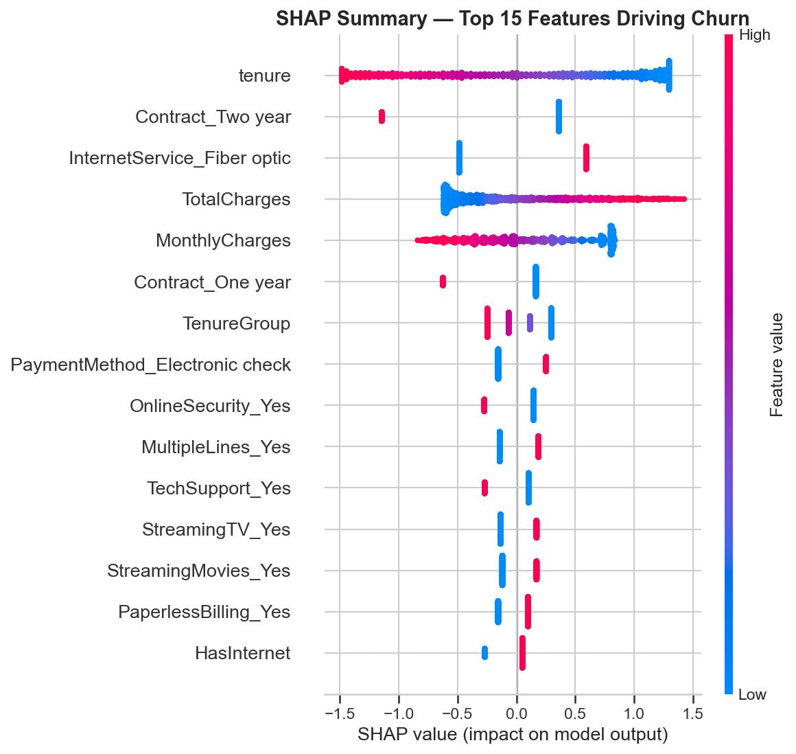
    <figcaption style="font-size: 0.95em; color: #555; margin-top: 8px;">
      SHAP summary (beeswarm) plot &mdash; top 15 features driving churn predictions across all 1,407 test
      customers. Each dot is one customer; horizontal position shows impact direction and magnitude; color
      shows feature value (red = high, blue = low). Also displayed in the Streamlit app (Page 3: Data Insights).
    </figcaption>
  </figure>

  <h3>Key Code: SHAP Bar Plot (Global Importance)</h3>
  

    The bar plot provides a simpler view of global importance &mdash; showing just the mean absolute SHAP
    value per feature without the directional detail of the beeswarm:
  

  <pre><code class="language-python"># SHAP Bar Plot — mean absolute SHAP values (simpler global importance)
plt.figure(figsize=(10, 8))
shap.summary_plot(shap_values, X_test_processed,
                  feature_names=all_feature_names,
                  plot_type='bar', max_display=15, show=False)
plt.tight_layout()
plt.savefig('../outputs/figures/shap_bar.png', dpi=150, bbox_inches='tight')
plt.show()</code></pre>

  <figure style="margin: 20px 0;">
    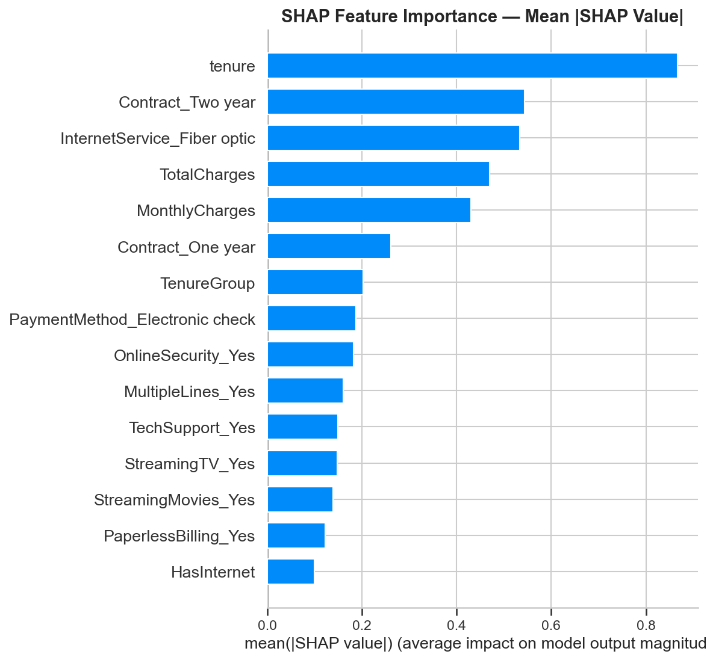
    <figcaption style="font-size: 0.95em; color: #555; margin-top: 8px;">
      SHAP bar plot &mdash; mean absolute SHAP value per feature, showing overall importance ranking
      without directional detail. Tenure, Contract_Two year, and InternetService_Fiber optic are the
      top three drivers.
    </figcaption>
  </figure>

  <h3>Global Feature Importance: Top 15</h3>
  

    The top 15 features by mean absolute SHAP value, with business interpretation for each:
  

  <table>
    <thead>
      <tr><th>Rank</th><th>Feature</th><th>Direction</th><th>Business Interpretation</th></tr>
    </thead>
    <tbody>
      <tr>
        <td>1</td>
        <td><code>tenure</code></td>
        <td>Low tenure &rarr; churn</td>
        <td>The single strongest predictor. New customers are the highest risk &mdash; the first 12 months are critical.</td>
      </tr>
      <tr>
        <td>2</td>
        <td><code>Contract_Two year</code></td>
        <td>Having two-year contract &rarr; no churn</td>
        <td>Strongest churn <em>reducer</em>. Long-term contracts lock in loyalty. (Baseline: month-to-month)</td>
      </tr>
      <tr>
        <td>3</td>
        <td><code>InternetService_Fiber optic</code></td>
        <td>Fiber optic &rarr; churn</td>
        <td>Fiber customers churn more despite paying more &mdash; points to a service quality or expectations gap.</td>
      </tr>
      <tr>
        <td>4</td>
        <td><code>TotalCharges</code></td>
        <td>Higher total charges &rarr; no churn</td>
        <td>Proxy for loyalty &mdash; customers who&rsquo;ve paid more have been around longer and are stickier.</td>
      </tr>
      <tr>
        <td>5</td>
        <td><code>MonthlyCharges</code></td>
        <td>Higher monthly charges &rarr; churn</td>
        <td>Higher monthly bills correlate with churn &mdash; customers may feel they&rsquo;re not getting value.</td>
      </tr>
      <tr>
        <td>6</td>
        <td><code>Contract_One year</code></td>
        <td>Having one-year contract &rarr; no churn</td>
        <td>Reduces churn, but less strongly than two-year. Any commitment beyond month-to-month helps.</td>
      </tr>
      <tr>
        <td>7</td>
        <td><code>TenureGroup</code></td>
        <td>Lower group &rarr; churn</td>
        <td>Reinforces the tenure signal &mdash; the 0&ndash;12 month bucket is the danger zone.</td>
      </tr>
      <tr>
        <td>8</td>
        <td><code>PaymentMethod_Electronic check</code></td>
        <td>Electronic check &rarr; churn</td>
        <td>Manual payment = less friction to leave. Automatic payments create passive retention.</td>
      </tr>
      <tr>
        <td>9</td>
        <td><code>OnlineSecurity_Yes</code></td>
        <td>Having security &rarr; no churn</td>
        <td>Support add-ons increase switching cost and perceived value.</td>
      </tr>
      <tr>
        <td>10</td>
        <td><code>MultipleLines_Yes</code></td>
        <td>Multiple lines &rarr; slight churn</td>
        <td>May correlate with higher bills; minor effect.</td>
      </tr>
      <tr>
        <td>11</td>
        <td><code>TechSupport_Yes</code></td>
        <td>Having tech support &rarr; no churn</td>
        <td>Customers who feel supported stay longer. Bundling tech support is a direct retention lever.</td>
      </tr>
      <tr>
        <td>12</td>
        <td><code>StreamingTV_Yes</code></td>
        <td>Streaming TV &rarr; slight churn</td>
        <td>Correlated with higher monthly charges; minor independent effect.</td>
      </tr>
      <tr>
        <td>13</td>
        <td><code>StreamingMovies_Yes</code></td>
        <td>Streaming movies &rarr; slight churn</td>
        <td>Same pattern as StreamingTV &mdash; service usage correlated with higher bills.</td>
      </tr>
      <tr>
        <td>14</td>
        <td><code>PaperlessBilling_Yes</code></td>
        <td>Paperless billing &rarr; slight churn</td>
        <td>Digital-first customers may be more tech-savvy and more willing to switch providers.</td>
      </tr>
      <tr>
        <td>15</td>
        <td><code>HasInternet</code></td>
        <td>Having internet &rarr; churn</td>
        <td>Internet customers face more competition and have more reasons to switch than phone-only customers.</td>
      </tr>
    </tbody>
  </table>

  <h3>Key Code: SHAP Waterfall Plot (Individual Customer Explanation)</h3>
  

    The waterfall plot explains a <strong>single customer&rsquo;s prediction</strong> feature by feature.
    Starting from the base value (average prediction), each bar shows how one feature pushed the prediction
    up (toward churn, red) or down (away from churn, blue). This is the visualization that appears in the
    Streamlit app&rsquo;s Predict page for every customer scored in real time:
  

  <pre><code class="language-python"># Find the highest-risk customer in the test set
y_prob_final = final_model.predict_proba(X_test_processed)[:, 1]
high_risk_idx = y_prob_final.argmax()

print(f"Highest-risk customer index: {high_risk_idx}")
print(f"Churn probability: {y_prob_final[high_risk_idx]:.4f}")
print(f"Actual churn: {y_test.iloc[high_risk_idx]}")

# Build SHAP Explanation object for this customer
explanation = shap.Explanation(
    values=shap_values[high_risk_idx],
    base_values=explainer.expected_value,
    data=X_test_processed[high_risk_idx],
    feature_names=all_feature_names
)

# Generate waterfall plot
fig, ax = plt.subplots(figsize=(10, 6))
shap.waterfall_plot(explanation, max_display=10, show=False)
plt.tight_layout()
plt.savefig('../outputs/figures/shap_waterfall_example.png', dpi=150,
            bbox_inches='tight')
plt.show()</code></pre>

  <figure style="margin: 20px 0;">
    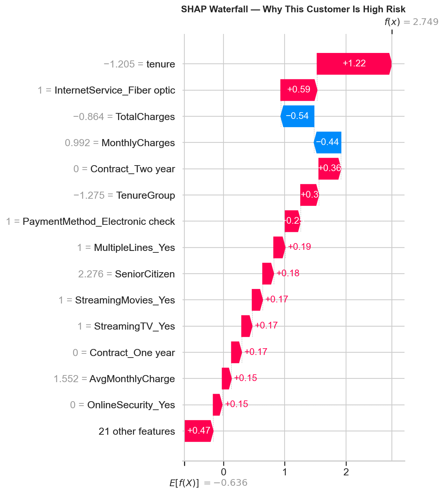
    <figcaption style="font-size: 0.95em; color: #555; margin-top: 8px;">
      SHAP waterfall plot for the highest-risk customer in the test set. Each bar shows one feature&rsquo;s
      contribution, starting from the base value (average prediction). Red bars push toward churn; blue bars
      push away from churn. This same type of plot is generated in real time in the Streamlit app for every
      customer scored.
    </figcaption>
  </figure>

  <h3>Waterfall Decomposition: High-Risk Customer</h3>
  

    The highest-risk customer in the test set was correctly predicted as a churner. The waterfall plot breaks
    down exactly why the model flagged them:
  

  <h4>Features Pushing Toward Churn (Red)</h4>
  <table>
    <thead>
      <tr><th>Feature</th><th>SHAP Value</th><th>Plain-Language Meaning</th></tr>
    </thead>
    <tbody>
      <tr><td><code>tenure</code></td><td>+1.22</td><td>Very low tenure &mdash; brand new customer, highest risk window</td></tr>
      <tr><td><code>InternetService_Fiber optic</code></td><td>+0.59</td><td>Fiber optic customer &mdash; higher churn rate segment</td></tr>
      <tr><td><code>Contract_Two year</code> = 0</td><td>+0.36</td><td>Not on a two-year contract &mdash; no long-term commitment</td></tr>
      <tr><td><code>TenureGroup</code></td><td>+0.30</td><td>Falls in the 0&ndash;12 month danger zone bucket</td></tr>
      <tr><td><code>PaymentMethod_Electronic check</code></td><td>+0.20</td><td>Manual payment method &mdash; less friction to leave</td></tr>
      <tr><td><code>MultipleLines_Yes</code></td><td>+0.19</td><td>Multiple lines &mdash; correlated with higher bills</td></tr>
      <tr><td><code>SeniorCitizen</code></td><td>+0.18</td><td>Senior citizen &mdash; slightly higher churn demographic</td></tr>
      <tr><td><code>StreamingMovies_Yes</code></td><td>+0.17</td><td>Streaming movies &mdash; adds to monthly cost</td></tr>
      <tr><td><code>StreamingTV_Yes</code></td><td>+0.17</td><td>Streaming TV &mdash; adds to monthly cost</td></tr>
    </tbody>
  </table>

  <h4>Features Pushing Away from Churn (Blue)</h4>
  <table>
    <thead>
      <tr><th>Feature</th><th>SHAP Value</th><th>Plain-Language Meaning</th></tr>
    </thead>
    <tbody>
      <tr><td><code>TotalCharges</code></td><td>&minus;0.54</td><td>Relatively low total charges partially offset risk</td></tr>
      <tr><td><code>MonthlyCharges</code></td><td>&minus;0.44</td><td>Monthly charges not at the extreme high end</td></tr>
    </tbody>
  </table>

  

    <strong>Plain-language summary:</strong> &ldquo;This customer is high risk because they have very low
    tenure, use fiber optic internet, are not on a long-term contract, pay by electronic check, and are a
    senior citizen. Their relatively low total and monthly charges partially offset the risk, but not
    enough.&rdquo;
  

  <h3>Key Code: SHAP in the Streamlit App (Real-Time Per-Customer Explanations)</h3>
  

    The Streamlit app generates SHAP waterfall plots on-the-fly for every customer scored. When a user
    submits a customer profile through the form, the app loads the model and preprocessor, transforms
    the input, predicts the churn probability, and then runs SHAP to explain that specific prediction:
  

  <pre><code class="language-python"># From app/app.py — real-time SHAP explanation in the Streamlit app

# After preprocessing and prediction...
churn_prob = model.predict_proba(input_processed)[0][1]

# Generate per-customer SHAP explanation
cat_names = preprocessor.named_transformers_['cat'] \
    .get_feature_names_out(categorical_features).tolist()
all_names = numeric_features + cat_names

explainer = shap.LinearExplainer(model, input_processed,
                                  feature_names=all_names)
shap_values = explainer.shap_values(input_processed)

explanation = shap.Explanation(
    values=shap_values[0],
    base_values=explainer.expected_value,
    data=input_processed[0],
    feature_names=all_names
)

# Display waterfall in Streamlit
fig, ax = plt.subplots(figsize=(8, 5))
shap.waterfall_plot(explanation, max_display=10, show=False)
plt.tight_layout()
st.pyplot(fig)
plt.close()</code></pre>

  <h3>Business Translations of SHAP Findings</h3>
  

    SHAP values translate model predictions into actionable business insights. Here are the key
    translations from the global importance ranking:
  

  <table>
    <thead>
      <tr><th>SHAP Finding</th><th>Business Translation</th><th>Recommended Action</th></tr>
    </thead>
    <tbody>
      <tr>
        <td>Tenure is the #1 driver; low tenure pushes strongly toward churn</td>
        <td>New customers are the highest risk segment &mdash; most attrition happens in the first 12 months</td>
        <td>Focus retention programs on the first-year experience: onboarding, check-ins, early loyalty incentives</td>
      </tr>
      <tr>
        <td>Contract_Two year is the #1 churn <em>reducer</em></td>
        <td>Long-term contracts are the single most effective retention mechanism in the data</td>
        <td>Incentivize annual/two-year contracts &mdash; even small discounts would likely pay for themselves through reduced churn</td>
      </tr>
      <tr>
        <td>InternetService_Fiber optic pushes toward churn despite higher revenue</td>
        <td>Fiber customers pay more but leave more &mdash; this is a service quality or expectations problem, not a pricing problem</td>
        <td>Investigate fiber optic service quality, speed consistency, and support experience</td>
      </tr>
      <tr>
        <td>OnlineSecurity and TechSupport reduce churn when present</td>
        <td>Support add-ons create both perceived value and switching cost</td>
        <td>Bundle OnlineSecurity and TechSupport at reduced cost or include by default for at-risk segments</td>
      </tr>
      <tr>
        <td>Electronic check payment increases churn</td>
        <td>Manual payment = less friction to cancel; automatic payments create passive retention</td>
        <td>Migrate electronic check users to automatic payment methods (bank transfer, credit card)</td>
      </tr>
    </tbody>
  </table>

  <h3>Connection to Teaching Background</h3>
  

    SHAP values translate black-box model predictions into plain-language explanations that any business
    stakeholder can understand. Instead of just saying &ldquo;this customer is high risk,&rdquo; the model
    says &ldquo;this customer is high risk <em>because</em> they&rsquo;re on a month-to-month contract, have
    been here only 3 months, and don&rsquo;t have tech support.&rdquo; This ability to make complex analytical
    outputs accessible to non-technical audiences directly ties to a background in mathematics education and
    translating abstract concepts for diverse learners.
  

  <h3>Charts Generated</h3>
  <table>
    <thead>
      <tr><th>File</th><th>Description</th><th>Reused In</th></tr>
    </thead>
    <tbody>
      <tr>
        <td><code>shap_summary.png</code></td>
        <td>Beeswarm plot &mdash; top 15 features with direction + magnitude for all 1,407 test customers</td>
        <td>Streamlit app (Page 3), portfolio page</td>
      </tr>
      <tr>
        <td><code>shap_bar.png</code></td>
        <td>Bar plot &mdash; mean absolute SHAP values (simpler global importance view)</td>
        <td>Portfolio page</td>
      </tr>
      <tr>
        <td><code>shap_waterfall_example.png</code></td>
        <td>Waterfall plot &mdash; single high-risk customer showing feature-by-feature contribution</td>
        <td>Portfolio page</td>
      </tr>
    </tbody>
  </table>

  
<strong>Streamlit App</strong>

  

  <h3>Overview</h3>
  

    The project culminates in a deployed, interactive Streamlit web application where anyone can input a
    customer profile and receive a churn risk score with a SHAP waterfall explanation &mdash; no code required.
    The app has four pages: a real-time churn predictor with per-customer explanations, a model performance
    dashboard, a data insights &amp; SHAP explainability page, and a sample predictions table. A live
    Streamlit app is significantly more compelling than a static Jupyter notebook &mdash; it demonstrates
    deployment skills and makes the project accessible to non-technical stakeholders.
  

  

    <strong><a href="https://nadeaujonnyappio-ba7xf6aknjidd9ppd5ww3t.streamlit.app" target="_blank">Launch Live App &rarr;</a></strong>
  

  <h3>Key Code: App Initialization &amp; Model Loading</h3>
  

    The app loads the serialized model and preprocessor once using Streamlit&rsquo;s
    <code>@st.cache_resource</code> decorator (caches across reruns and sessions for performance),
    imports the shared <code>engineer_features()</code> function, and sets up sidebar navigation
    across the four pages:
  

  <pre><code class="language-python">import streamlit as st
import pandas as pd
import numpy as np
import joblib
import shap
import matplotlib.pyplot as plt
import os, sys

# Get the directory where app.py lives (works on both local and Streamlit Cloud)
APP_DIR = os.path.dirname(os.path.abspath(__file__))
sys.path.insert(0, APP_DIR)

from feature_helpers import engineer_features

# Page config
st.set_page_config(page_title="Customer Churn Predictor",
                   page_icon="📊", layout="wide")

# Load model and preprocessor (cached across sessions)
@st.cache_resource
def load_model():
    model = joblib.load(os.path.join(APP_DIR, 'best_model.pkl'))
    preprocessor = joblib.load(os.path.join(APP_DIR, 'preprocessor.pkl'))
    return model, preprocessor

model, preprocessor = load_model()

# Sidebar navigation
st.sidebar.title("📊 Churn Predictor")
page = st.sidebar.radio("Navigate", [
    "Predict Churn Risk", "Model Performance",
    "Data Insights", "Sample Predictions"
])</code></pre>

  <h3>Page 1: Predict Churn Risk</h3>
  

    The centerpiece of the app. A three-column input form captures all customer attributes &mdash;
    demographics, services, and account details &mdash; using dropdowns for categorical features and sliders
    for numeric features. When the user clicks "Predict," the app builds a DataFrame from the inputs,
    auto-computes <code>TotalCharges</code> from <code>tenure &times; MonthlyCharges</code>, applies the
    shared <code>engineer_features()</code> function (guaranteeing identical transformations to training),
    transforms with the fitted preprocessor, predicts churn probability, and generates a SHAP waterfall
    plot explaining that specific prediction &mdash; all in under a second.
  

  <h4>Key Code: Input Form (3-Column Layout)</h4>

  <pre><code class="language-python">col1, col2, col3 = st.columns(3)

with col1:
    st.subheader("Demographics")
    gender = st.selectbox("Gender", ["Male", "Female"])
    senior_citizen = st.selectbox("Senior Citizen", ["No", "Yes"])
    partner = st.selectbox("Partner", ["Yes", "No"])
    dependents = st.selectbox("Dependents", ["Yes", "No"])

with col2:
    st.subheader("Services")
    tenure = st.slider("Tenure (months)", 0, 72, 12)
    phone_service = st.selectbox("Phone Service", ["Yes", "No"])
    multiple_lines = st.selectbox("Multiple Lines",
                                  ["Yes", "No", "No phone service"])
    internet_service = st.selectbox("Internet Service",
                                    ["DSL", "Fiber optic", "No"])
    online_security = st.selectbox("Online Security",
                                   ["Yes", "No", "No internet service"])
    online_backup = st.selectbox("Online Backup",
                                 ["Yes", "No", "No internet service"])
    device_protection = st.selectbox("Device Protection",
                                     ["Yes", "No", "No internet service"])
    tech_support = st.selectbox("Tech Support",
                                ["Yes", "No", "No internet service"])
    streaming_tv = st.selectbox("Streaming TV",
                                ["Yes", "No", "No internet service"])
    streaming_movies = st.selectbox("Streaming Movies",
                                    ["Yes", "No", "No internet service"])

with col3:
    st.subheader("Account")
    contract = st.selectbox("Contract",
                            ["Month-to-month", "One year", "Two year"])
    paperless_billing = st.selectbox("Paperless Billing", ["Yes", "No"])
    payment_method = st.selectbox("Payment Method", [
        "Electronic check", "Mailed check",
        "Bank transfer (automatic)", "Credit card (automatic)"
    ])
    monthly_charges = st.slider("Monthly Charges ($)", 18.0, 120.0, 70.0)</code></pre>

  <h4>Key Code: Build DataFrame, Engineer Features &amp; Predict</h4>

  <pre><code class="language-python">if st.button("Predict Churn Risk", type="primary"):
    # Build input DataFrame matching the training schema exactly
    input_data = pd.DataFrame([{
        'gender': gender,
        'SeniorCitizen': 1 if senior_citizen == "Yes" else 0,
        'Partner': partner,
        'Dependents': dependents,
        'tenure': tenure,
        'PhoneService': phone_service,
        'MultipleLines': multiple_lines,
        'InternetService': internet_service,
        'OnlineSecurity': online_security,
        'OnlineBackup': online_backup,
        'DeviceProtection': device_protection,
        'TechSupport': tech_support,
        'StreamingTV': streaming_tv,
        'StreamingMovies': streaming_movies,
        'Contract': contract,
        'PaperlessBilling': paperless_billing,
        'PaymentMethod': payment_method,
        'MonthlyCharges': monthly_charges,
        'TotalCharges': monthly_charges * tenure,  # Auto-computed
    }])

    # Apply shared feature engineering (identical to training)
    input_engineered = engineer_features(input_data)

    # Define feature order (must match training preprocessor)
    numeric_features = ['SeniorCitizen', 'tenure', 'MonthlyCharges',
                        'TotalCharges', 'ServiceCount', 'HasInternet',
                        'HasPhone', 'AvgMonthlyCharge', 'TenureGroup']
    categorical_features = ['gender', 'Partner', 'Dependents',
                            'PhoneService', 'MultipleLines',
                            'InternetService', 'OnlineSecurity',
                            'OnlineBackup', 'DeviceProtection',
                            'TechSupport', 'StreamingTV',
                            'StreamingMovies', 'Contract',
                            'PaperlessBilling', 'PaymentMethod']

    input_final = input_engineered[numeric_features + categorical_features]

    # Preprocess and predict
    input_processed = preprocessor.transform(input_final)
    churn_prob = model.predict_proba(input_processed)[0][1]</code></pre>

  <h4>Key Code: Risk Display &amp; Real-Time SHAP Waterfall</h4>

  <pre><code class="language-python">    # Display color-coded risk level
    if churn_prob >= 0.5:
        st.error(f"⚠️ HIGH RISK — Churn Probability: {churn_prob:.1%}")
    elif churn_prob >= 0.3:
        st.warning(f"⚡ MEDIUM RISK — Churn Probability: {churn_prob:.1%}")
    else:
        st.success(f"✅ LOW RISK — Churn Probability: {churn_prob:.1%}")

    # Generate per-customer SHAP explanation
    st.subheader("Why this prediction?")
    cat_names = preprocessor.named_transformers_['cat'] \
        .get_feature_names_out(categorical_features).tolist()
    all_names = numeric_features + cat_names

    explainer = shap.LinearExplainer(model, input_processed,
                                     feature_names=all_names)
    shap_values = explainer.shap_values(input_processed)

    explanation = shap.Explanation(
        values=shap_values[0],
        base_values=explainer.expected_value,
        data=input_processed[0],
        feature_names=all_names
    )

    fig, ax = plt.subplots(figsize=(8, 5))
    shap.waterfall_plot(explanation, max_display=10, show=False)
    plt.tight_layout()
    st.pyplot(fig)
    plt.close()</code></pre>

  <h4>Risk Thresholds</h4>
  <table>
    <thead>
      <tr><th>Probability Range</th><th>Risk Level</th><th>Display Color</th><th>Streamlit Component</th></tr>
    </thead>
    <tbody>
      <tr><td>&ge; 50%</td><td>HIGH RISK</td><td>Red</td><td><code>st.error()</code></td></tr>
      <tr><td>30% &ndash; 49%</td><td>MEDIUM RISK</td><td>Yellow</td><td><code>st.warning()</code></td></tr>
      <tr><td>&lt; 30%</td><td>LOW RISK</td><td>Green</td><td><code>st.success()</code></td></tr>
    </tbody>
  </table>

  <h3>Page 2: Model Performance</h3>
  

    Displays the full model comparison from Phase 4 &mdash; the 5-model results table loaded from
    <code>model_comparison.csv</code>, a blue info box explaining why Logistic Regression was selected,
    the model comparison bar chart, the ROC curves overlay, and all 5 confusion matrices. All charts are
    pre-generated PNGs loaded from the <code>figures/</code> directory.
  

  <pre><code class="language-python"># PAGE 2: Model Performance
st.title("📈 Model Performance")
st.write("Comparison of 5 classification models trained on the "
         "Telco Customer Churn dataset.")

# Model comparison table
comparison_df = pd.read_csv(os.path.join(APP_DIR, 'model_comparison.csv'))
st.dataframe(comparison_df, use_container_width=True)

st.info("**Best Model: Logistic Regression** — Highest AUC (0.834) "
        "and Recall (0.789). Recall is our priority metric: it's "
        "cheaper to send a retention offer to a loyal customer "
        "than to miss a churner.")

# Charts in two columns
col1, col2 = st.columns(2)
with col1:
    st.subheader("Model Comparison")
    st.image(os.path.join(APP_DIR, 'figures/model_comparison.png'),
             use_container_width=True)
with col2:
    st.subheader("ROC Curves")
    st.image(os.path.join(APP_DIR, 'figures/roc_curves.png'),
             use_container_width=True)

st.subheader("Confusion Matrices")
st.image(os.path.join(APP_DIR, 'figures/confusion_matrix.png'),
         use_container_width=True)</code></pre>

  <h3>Page 3: Data Insights &amp; SHAP Explainability</h3>
  

    Combines key EDA charts (churn by contract type, tenure distribution by churn) with the SHAP
    beeswarm summary plot and the five business recommendations. This page bridges the analytical
    findings and the model&rsquo;s learned patterns into a single view.
  

  <pre><code class="language-python"># PAGE 3: Data Insights & SHAP Explainability
st.title("🔍 Data Insights & SHAP Explainability")

# EDA charts in two columns
st.subheader("Key EDA Findings")
col1, col2 = st.columns(2)
with col1:
    st.image(os.path.join(APP_DIR, 'figures/churn_by_contract.png'),
             caption='Churn Rate by Contract Type',
             use_container_width=True)
with col2:
    st.image(os.path.join(APP_DIR, 'figures/tenure_by_churn.png'),
             caption='Tenure Distribution by Churn Status',
             use_container_width=True)

# SHAP summary
st.markdown("---")
st.subheader("SHAP Feature Importance")
st.write("SHAP values show how each feature contributes to the "
         "model's churn predictions.")
st.image(os.path.join(APP_DIR, 'figures/shap_summary.png'),
         caption='SHAP Summary — Top 15 Features Driving Churn',
         use_container_width=True)

# Business recommendations
st.subheader("Business Recommendations")
st.markdown("""
1. **Incentivize annual contracts** — Month-to-month customers
   churn at 42.7% vs 2.8% for two-year contracts
2. **Focus retention on new customers** — Most churn happens
   in the first few months
3. **Bundle support add-ons** — Customers with OnlineSecurity
   and TechSupport churn significantly less
4. **Address fiber optic experience** — Fiber customers churn
   more despite paying more (potential service quality issue)
5. **Migrate electronic check users** — This payment method
   correlates with higher churn
""")</code></pre>

  <h3>Page 4: Sample Predictions</h3>
  

    Displays a table of 15 test set customers with their actual churn status, the model&rsquo;s predicted
    status, and the churn probability score. The probability column is color-coded with a red-yellow-green
    gradient so visitors can immediately see the model&rsquo;s confidence level. This gives a concrete
    sense of model accuracy without needing to input values manually.
  

  <pre><code class="language-python"># PAGE 4: Sample Predictions
st.title("📋 Sample Predictions")
st.write("Predictions on 15 test set customers showing actual vs "
         "predicted churn with probability scores.")

sample_df = pd.read_csv(
    os.path.join(APP_DIR, '..', 'outputs', 'metrics',
                 'sample_predictions.csv')
)

# Color-coded probability column
st.dataframe(
    sample_df.style.background_gradient(
        subset=['Churn_Probability'], cmap='RdYlGn_r'
    ),
    use_container_width=True
)

st.markdown("---")
st.write("**How to read this table:**")
st.markdown("""
- **Actual**: Whether the customer actually churned (1) or stayed (0)
- **Predicted**: The model's binary prediction at the 0.5 threshold
- **Churn_Probability**: The model's confidence score
  (0 = definitely staying, 1 = definitely churning)
""")</code></pre>

  <h3>4-Page Summary</h3>
  <table>
    <thead>
      <tr><th>Page</th><th>Title</th><th>Purpose</th><th>Key Features</th></tr>
    </thead>
    <tbody>
      <tr>
        <td>1</td>
        <td>Predict Churn Risk</td>
        <td>Real-time scoring of any customer profile</td>
        <td>3-column input form (16 fields), auto-computed TotalCharges, color-coded risk level, live SHAP waterfall explanation</td>
      </tr>
      <tr>
        <td>2</td>
        <td>Model Performance</td>
        <td>Show all 5-model comparison results</td>
        <td>Results table from CSV, info box explaining winner, model comparison chart, ROC curves, confusion matrices</td>
      </tr>
      <tr>
        <td>3</td>
        <td>Data Insights</td>
        <td>Bridge EDA findings and SHAP importance</td>
        <td>Churn by contract chart, tenure histogram, SHAP beeswarm, 5 business recommendations</td>
      </tr>
      <tr>
        <td>4</td>
        <td>Sample Predictions</td>
        <td>Concrete examples of model accuracy</td>
        <td>15 test customers with actual vs predicted, color-gradient probability column</td>
      </tr>
    </tbody>
  </table>

  <h3>Train/Serve Consistency Guarantees</h3>
  

    A common deployment failure is a mismatch between training-time and serve-time feature transformations.
    This app avoids that through three design decisions:
  

  <table>
    <thead>
      <tr><th>Risk</th><th>Mitigation</th></tr>
    </thead>
    <tbody>
      <tr>
        <td>Feature engineering differs between training and prediction</td>
        <td><code>feature_helpers.py</code> is a single shared module &mdash; identical copy in <code>notebooks/</code> and <code>app/</code></td>
      </tr>
      <tr>
        <td>Preprocessing pipeline differs (different scaling, different encoding)</td>
        <td>The fitted <code>ColumnTransformer</code> is serialized via joblib &mdash; same scaler means, stds, and encoder categories at serve time</td>
      </tr>
      <tr>
        <td>Feature column order mismatch</td>
        <td>Feature lists are explicitly defined in the same order as training (<code>numeric_features + categorical_features</code>)</td>
      </tr>
      <tr>
        <td>Unknown categories in user input</td>
        <td><code>handle_unknown='ignore'</code> in OneHotEncoder &mdash; unseen categories produce zeros instead of errors</td>
      </tr>
      <tr>
        <td>SeniorCitizen encoding mismatch</td>
        <td>App converts "Yes"/"No" dropdown to 1/0 integer before building the DataFrame</td>
      </tr>
    </tbody>
  </table>

  <h3>App Files</h3>
  <table>
    <thead>
      <tr><th>File</th><th>Purpose</th><th>Source</th></tr>
    </thead>
    <tbody>
      <tr><td><code>app/app.py</code></td><td>Main Streamlit application (4 pages)</td><td>Written in Phase 7</td></tr>
      <tr><td><code>app/feature_helpers.py</code></td><td>Shared feature engineering function</td><td>Copied from <code>notebooks/feature_helpers.py</code></td></tr>
      <tr><td><code>app/best_model.pkl</code></td><td>Serialized LogisticRegression model</td><td>Copied from <code>models/best_model.pkl</code></td></tr>
      <tr><td><code>app/preprocessor.pkl</code></td><td>Fitted ColumnTransformer (scaler + encoder)</td><td>Copied from <code>models/preprocessor.pkl</code></td></tr>
      <tr><td><code>app/model_comparison.csv</code></td><td>5-model results table for Page 2</td><td>Copied from <code>outputs/metrics/</code></td></tr>
      <tr><td><code>app/requirements.txt</code></td><td>Streamlit-specific dependencies</td><td>Written in Phase 7</td></tr>
      <tr><td><code>app/figures/</code></td><td>6 pre-generated chart PNGs for Pages 2 &amp; 3</td><td>Copied from <code>outputs/figures/</code></td></tr>
    </tbody>
  </table>

  <h3>Key Code: Streamlit Requirements</h3>

  <pre><code class="language-text"># app/requirements.txt
streamlit
pandas
numpy
scikit-learn
shap
matplotlib
joblib</code></pre>

  <h3>Deployment</h3>
  <table>
    <thead>
      <tr><th>Property</th><th>Value</th></tr>
    </thead>
    <tbody>
      <tr><td>Platform</td><td>Streamlit Community Cloud (free tier)</td></tr>
      <tr><td>Repository</td><td><code>nadeaujonny/nadeaujonny.github.io</code></td></tr>
      <tr><td>Branch</td><td><code>main</code></td></tr>
      <tr><td>Entry File</td><td><code>projects/ml-churn-prediction/app/app.py</code></td></tr>
      <tr><td>Live URL</td><td><a href="https://nadeaujonnyappio-ba7xf6aknjidd9ppd5ww3t.streamlit.app" target="_blank">nadeaujonnyappio-ba7xf6aknjidd9ppd5ww3t.streamlit.app</a></td></tr>
    </tbody>
  </table>

  <h3>Why a Deployed App Matters</h3>
  

    A deployed Streamlit app is significantly more impactful than a static notebook for three reasons:
    it demonstrates <strong>deployment skills</strong> (model serialization, dependency management,
    cloud hosting), it makes the project <strong>accessible to non-technical stakeholders</strong>
    (a hiring manager can try the predictor without installing Python), and the real-time SHAP
    waterfall explanations demonstrate <strong>explainability in action</strong> rather than as a static
    screenshot. The app turns a completed analysis into a usable tool.
  

  
<strong>Key Findings &amp; Business Recommendations</strong>

  

  <h3>Overview</h3>
  

    This section synthesizes the &ldquo;so what&rdquo; of the entire project &mdash; the analytical findings
    and modeling insights that translate into concrete, actionable business recommendations. Every finding
    listed below is supported by evidence from multiple phases: EDA visualizations (Phase 2), SHAP feature
    importance rankings (Phase 6), and the model selection and tuning decisions (Phases 4&ndash;5). These
    aren&rsquo;t hypothetical suggestions &mdash; they are data-driven conclusions backed by a trained,
    validated, and explainable model.
  

  <h3>Key Findings</h3>

  <table>
    <thead>
      <tr><th>#</th><th>Finding</th><th>Evidence</th><th>Where Discovered</th></tr>
    </thead>
    <tbody>
      <tr>
        <td>1</td>
        <td><strong>Contract type is the single strongest churn predictor</strong></td>
        <td>Month-to-month: 42.7% churn rate vs. One year: 11.3% vs. Two year: 2.8% &mdash; a 15&times; spread. <code>Contract_Two year</code> is the #2 SHAP feature globally.</td>
        <td>EDA (Phase 2), SHAP (Phase 6)</td>
      </tr>
      <tr>
        <td>2</td>
        <td><strong>Churn is heavily front-loaded by tenure</strong></td>
        <td>Most churners leave within the first 12 months. Customers who survive the first year are significantly more likely to stay. <code>tenure</code> is the #1 SHAP feature globally (correlation: &minus;0.35).</td>
        <td>EDA (Phase 2), SHAP (Phase 6), Feature Engineering (Phase 3 &mdash; motivated <code>TenureGroup</code>)</td>
      </tr>
      <tr>
        <td>3</td>
        <td><strong>Fiber optic customers churn more despite paying more</strong></td>
        <td>Fiber optic internet has significantly higher churn than DSL or no internet &mdash; suggesting a service quality or expectations gap, not a pricing problem. <code>InternetService_Fiber optic</code> is the #3 SHAP feature.</td>
        <td>EDA (Phase 2), SHAP (Phase 6)</td>
      </tr>
      <tr>
        <td>4</td>
        <td><strong>Support add-ons (OnlineSecurity, TechSupport) significantly reduce churn</strong></td>
        <td>Customers without these services churn at notably higher rates. <code>OnlineSecurity_Yes</code> is SHAP #9, <code>TechSupport_Yes</code> is SHAP #11 &mdash; both push strongly away from churn when present.</td>
        <td>EDA (Phase 2), SHAP (Phase 6), Feature Engineering (Phase 3 &mdash; motivated <code>ServiceCount</code>)</td>
      </tr>
      <tr>
        <td>5</td>
        <td><strong>Electronic check payment method correlates with higher churn</strong></td>
        <td><code>PaymentMethod_Electronic check</code> is SHAP #8. Manual payment creates less friction to cancel compared to automatic payment methods.</td>
        <td>EDA (Phase 2), SHAP (Phase 6)</td>
      </tr>
      <tr>
        <td>6</td>
        <td><strong>The simplest model outperformed ensemble methods</strong></td>
        <td>Logistic Regression achieved the highest AUC (0.8344) and highest recall (0.7888) &mdash; beating Random Forest, XGBoost, LightGBM, and SVM. This means the churn relationships in this dataset are approximately linear, and a well-configured simple model on properly engineered features is highly effective.</td>
        <td>Model Training (Phase 4)</td>
      </tr>
      <tr>
        <td>7</td>
        <td><strong>Hyperparameter tuning improved precision but sacrificed recall &mdash; the default was kept</strong></td>
        <td>The tuned model gained +14.6pp precision but lost &minus;22pp recall (from 79% down to 57%). Since the cost of missing a churner far exceeds the cost of a false alarm, the default balanced model was the better business choice. This demonstrates principled model selection based on cost asymmetry.</td>
        <td>Hyperparameter Tuning (Phase 5)</td>
      </tr>
    </tbody>
  </table>

  <h3>Key Code: Evidence Behind the Top Finding</h3>
  

    The contract type finding emerged independently from two completely different analytical approaches
    &mdash; EDA churn rate calculations and SHAP model-learned importance &mdash; which strengthens
    confidence in the conclusion:
  

  <pre><code class="language-python"># Evidence 1: EDA — raw churn rates by contract type (Phase 2)
contract_churn = df.groupby('Contract')['Churn'].mean()
print(contract_churn.sort_values(ascending=False))
# Output:
# Contract
# Month-to-month    0.4271
# One year          0.1129
# Two year          0.0283

# Evidence 2: SHAP — model-learned feature importance (Phase 6)
# Contract_Two year is the #2 global SHAP feature
# Contract_One year is the #6 global SHAP feature
# Both push strongly AWAY from churn when present
# (relative to the dropped baseline: month-to-month)</code></pre>

  <h3>Key Code: Evidence Behind Tenure as #1 Predictor</h3>

  <pre><code class="language-python"># Correlation: tenure vs Churn (Phase 2)
print(f"tenure vs Churn correlation: {df['tenure'].corr(df['Churn']):.4f}")
# Output: tenure vs Churn correlation: -0.3530

# SHAP: tenure is the #1 feature globally (Phase 6)
# Low tenure → SHAP value of +1.22 for highest-risk customer
# High tenure → SHAP values strongly negative (pushes away from churn)

# Feature Engineering response (Phase 3)
# Created TenureGroup to capture the non-linear relationship:
def tenure_bucket(t):
    if t <= 12: return 0    # Danger zone
    elif t <= 24: return 1  # Transition period
    elif t <= 48: return 2  # Established
    else: return 3          # Loyal
df['TenureGroup'] = df['tenure'].apply(tenure_bucket)</code></pre>

  <h3>Key Code: The Cost Asymmetry That Drove Model Selection</h3>

  <pre><code class="language-python"># Phase 5: Why we kept the default model despite tuning finding
# a "better" model by standard metrics

# Default model (class_weight='balanced'):
#   Recall = 0.7888 → catches 295 of 374 churners → misses 79
#   False alarms = 309 loyal customers flagged

# Tuned model (class_weight=None):
#   Recall = 0.5668 → catches 212 of 374 churners → misses 162
#   False alarms = 122 loyal customers flagged

# Business cost comparison:
extra_false_alarms = 309 - 122          # 187 more false alarms
extra_missed_churners = 162 - 79        # 83 more missed churners
cost_per_false_alarm = 10               # $10 retention offer
cost_per_missed_churner = 500           # $500 lifetime value lost

cost_of_extra_false_alarms = extra_false_alarms * cost_per_false_alarm
cost_of_extra_missed = extra_missed_churners * cost_per_missed_churner

print(f"Cost of extra false alarms:  ${cost_of_extra_false_alarms:,}")
print(f"Cost of extra missed churners: ${cost_of_extra_missed:,}")
# Output:
# Cost of extra false alarms:  $1,870
# Cost of extra missed churners: $41,500
# → Default model is clearly the better business choice</code></pre>

  <h3>Business Recommendations</h3>

  <table>
    <thead>
      <tr><th>#</th><th>Recommendation</th><th>Rationale</th><th>Expected Impact</th></tr>
    </thead>
    <tbody>
      <tr>
        <td>1</td>
        <td><strong>Incentivize annual contracts</strong></td>
        <td>Month-to-month customers churn at 42.7% vs. 2.8% for two-year contracts. Contract type is the #2 SHAP feature. Even small discounts on annual plans would likely pay for themselves through reduced churn.</td>
        <td>Highest-impact single intervention &mdash; converting even 10% of month-to-month customers to annual would significantly reduce overall churn rate</td>
      </tr>
      <tr>
        <td>2</td>
        <td><strong>Focus retention efforts on new customers (first 12 months)</strong></td>
        <td>Tenure is the #1 SHAP feature. Most churn happens in the first year. Customers who survive 12 months are far more likely to stay long-term.</td>
        <td>Targeted onboarding programs, check-in calls at 30/60/90 days, early loyalty incentives for first-year customers</td>
      </tr>
      <tr>
        <td>3</td>
        <td><strong>Bundle OnlineSecurity and TechSupport add-ons</strong></td>
        <td>Both reduce churn when present (SHAP #9 and #11). Customers with support add-ons have more perceived value and higher switching costs.</td>
        <td>Offer these services at reduced cost or include by default for at-risk segments &mdash; the retention value likely exceeds the cost of the service</td>
      </tr>
      <tr>
        <td>4</td>
        <td><strong>Investigate fiber optic service quality</strong></td>
        <td>Fiber optic is the #3 SHAP feature pushing toward churn, despite being the highest-revenue internet tier. Higher churn at higher price points signals an experience problem, not a pricing problem.</td>
        <td>Audit fiber optic speed consistency, installation experience, and support response times. The revenue-at-risk from fiber churn likely justifies investment in service quality.</td>
      </tr>
      <tr>
        <td>5</td>
        <td><strong>Migrate electronic check users to automatic payment methods</strong></td>
        <td>Electronic check is SHAP #8, pushing toward churn. Manual payment = lower friction to cancel. Automatic payments (bank transfer, credit card) create passive retention.</td>
        <td>Offer a small discount or incentive for switching to autopay &mdash; even a $5/month discount costs less than losing the customer</td>
      </tr>
    </tbody>
  </table>

  <h3>Modeling Insights</h3>
  

    Beyond the business recommendations, the project produced two modeling insights worth documenting:
  

  <table>
    <thead>
      <tr><th>Insight</th><th>What It Means</th><th>Why It Matters</th></tr>
    </thead>
    <tbody>
      <tr>
        <td><strong>Simplest model won</strong></td>
        <td>Logistic Regression outperformed Random Forest, XGBoost, LightGBM, and SVM on the two priority metrics (AUC and recall)</td>
        <td>Demonstrates that model complexity doesn&rsquo;t always win &mdash; well-engineered features on approximately linear relationships make simple models highly effective. Also makes deployment and explainability far easier.</td>
      </tr>
      <tr>
        <td><strong>Knowing when <em>not</em> to tune</strong></td>
        <td>Hyperparameter tuning found a &ldquo;better&rdquo; model by accuracy (+7.4pp) but a worse model by recall (&minus;22pp) &mdash; the default was kept</td>
        <td>Demonstrates principled model selection based on business cost asymmetry rather than blind optimization. The tuned model would have missed 83 additional churners to avoid 187 false alarms &mdash; a $41,500 loss to save $1,870.</td>
      </tr>
    </tbody>
  </table>

  <h3>EDA &rarr; SHAP Alignment</h3>
  

    A strong validation of the project&rsquo;s analytical integrity is that the EDA findings (computed from
    raw churn rates with no model involved) align closely with the SHAP feature importance rankings (learned
    by the trained model). The features that showed the strongest churn signal in EDA &mdash; contract type,
    tenure, internet service type, support add-ons, payment method &mdash; are the same features that SHAP
    ranks as most important. This convergence from two independent methods means the findings are robust,
    not artifacts of a particular analytical approach.
  

  <table>
    <thead>
      <tr><th>Feature</th><th>EDA Rank (by churn rate spread)</th><th>SHAP Rank (by mean |SHAP value|)</th><th>Aligned?</th></tr>
    </thead>
    <tbody>
      <tr><td>Contract type</td><td>#1</td><td>#2 and #6 (Two year, One year)</td><td>Yes</td></tr>
      <tr><td>Tenure</td><td>#2</td><td>#1</td><td>Yes</td></tr>
      <tr><td>Internet service type</td><td>#3 (fiber optic)</td><td>#3</td><td>Yes</td></tr>
      <tr><td>Monthly charges</td><td>#4</td><td>#5</td><td>Yes</td></tr>
      <tr><td>Support add-ons</td><td>#5</td><td>#9 and #11</td><td>Yes</td></tr>
      <tr><td>Payment method</td><td>#6</td><td>#8</td><td>Yes</td></tr>
      <tr><td>Gender</td><td>No signal</td><td>Not in top 15</td><td>Yes</td></tr>
    </tbody>
  </table>

  
<strong>Technical Details</strong>

  

  <h3>Libraries &amp; Dependencies</h3>
  <table>
    <thead>
      <tr><th>Library</th><th>Role in This Project</th><th>Phase(s) Used</th></tr>
    </thead>
    <tbody>
      <tr>
        <td><code>pandas</code></td>
        <td>Data loading, cleaning, manipulation, feature engineering, DataFrame operations throughout</td>
        <td>All phases (1&ndash;7)</td>
      </tr>
      <tr>
        <td><code>numpy</code></td>
        <td>Numerical computing, array operations</td>
        <td>All phases</td>
      </tr>
      <tr>
        <td><code>scikit-learn</code></td>
        <td>Logistic Regression, Random Forest, SVM, ColumnTransformer, StandardScaler, OneHotEncoder, train_test_split, StratifiedKFold, cross_val_score, RandomizedSearchCV, all evaluation metrics</td>
        <td>Phases 3&ndash;5</td>
      </tr>
      <tr>
        <td><code>xgboost</code></td>
        <td>XGBClassifier &mdash; gradient boosting (level-wise tree growth)</td>
        <td>Phase 4</td>
      </tr>
      <tr>
        <td><code>lightgbm</code></td>
        <td>LGBMClassifier &mdash; gradient boosting (leaf-wise tree growth)</td>
        <td>Phase 4</td>
      </tr>
      <tr>
        <td><code>shap</code></td>
        <td>LinearExplainer for global feature importance (beeswarm, bar plots) and per-customer waterfall explanations</td>
        <td>Phase 6, Streamlit app (Page 1)</td>
      </tr>
      <tr>
        <td><code>matplotlib</code></td>
        <td>All chart generation &mdash; EDA visualizations, model comparison, ROC curves, confusion matrices, SHAP plots</td>
        <td>Phases 2, 4, 6, Streamlit app</td>
      </tr>
      <tr>
        <td><code>seaborn</code></td>
        <td>Statistical visualization &mdash; heatmaps, styled plots built on top of matplotlib</td>
        <td>Phases 2, 4</td>
      </tr>
      <tr>
        <td><code>streamlit</code></td>
        <td>4-page interactive web application &mdash; input forms, predictions, chart display, data tables</td>
        <td>Phase 7 (deployment)</td>
      </tr>
      <tr>
        <td><code>joblib</code></td>
        <td>Serialization of model (<code>.pkl</code>), preprocessor, feature names, and train/test data for artifact handoff between notebooks and app</td>
        <td>Phases 3&ndash;7</td>
      </tr>
      <tr>
        <td><code>scipy</code></td>
        <td>Statistical distributions used by RandomizedSearchCV parameter spaces</td>
        <td>Phase 5</td>
      </tr>
      <tr>
        <td><code>jupyter</code></td>
        <td>Interactive notebook environment for all 5 analysis notebooks</td>
        <td>Phases 1&ndash;6</td>
      </tr>
    </tbody>
  </table>

  <h3>Key Code: Full Requirements</h3>

  <pre><code class="language-text"># requirements.txt (full project)
pandas>=2.0
numpy>=1.24
scikit-learn>=1.3
xgboost>=2.0
lightgbm>=4.0
shap>=0.42
matplotlib>=3.7
seaborn>=0.12
streamlit>=1.28
scipy>=1.10
joblib>=1.3
jupyter>=1.0</code></pre>

  <pre><code class="language-text"># app/requirements.txt (Streamlit deployment only)
streamlit
pandas
numpy
scikit-learn
shap
matplotlib
joblib</code></pre>

  <pre><code class="language-bash"># Install everything
pip install pandas numpy scikit-learn xgboost lightgbm shap \
    matplotlib seaborn streamlit scipy joblib jupyter</code></pre>

  

    All libraries install via pip with no special dependencies. <strong>No GPU required.</strong>
    Everything runs locally on any modern machine.
  

  <h3>Final Model Specification</h3>
  <table>
    <thead>
      <tr><th>Property</th><th>Value</th></tr>
    </thead>
    <tbody>
      <tr><td>Algorithm</td><td>Logistic Regression (<code>sklearn.linear_model.LogisticRegression</code>)</td></tr>
      <tr><td>Key Parameter</td><td><code>class_weight='balanced'</code></td></tr>
      <tr><td>Other Parameters</td><td><code>max_iter=1000, random_state=42</code></td></tr>
      <tr><td>Input Features</td><td>35 (9 numeric + 26 one-hot encoded from 15 categorical)</td></tr>
      <tr><td>Training Rows</td><td>5,625 (80% of 7,032)</td></tr>
      <tr><td>Test Rows</td><td>1,407 (20% of 7,032)</td></tr>
      <tr><td>Test AUC</td><td>0.8344</td></tr>
      <tr><td>Test Recall</td><td>0.7888 (catches 79% of churners)</td></tr>
      <tr><td>Test F1</td><td>0.6033</td></tr>
      <tr><td>Test Accuracy</td><td>0.7242</td></tr>
      <tr><td>Serialized File</td><td><code>models/best_model.pkl</code> (also copied to <code>app/best_model.pkl</code>)</td></tr>
      <tr><td>Explainer</td><td><code>shap.LinearExplainer</code></td></tr>
    </tbody>
  </table>

  <h3>How to Reproduce</h3>
  <ol>
    <li>
      <strong>Clone the repository:</strong>
      <pre><code class="language-bash">git clone https://github.com/nadeaujonny/nadeaujonny.github.io.git
cd projects/ml-churn-prediction</code></pre>
    </li>
    <li>
      <strong>Download the dataset</strong> from
      <a href="https://www.kaggle.com/datasets/blastchar/telco-customer-churn" target="_blank">Kaggle</a>
      and place the CSV file in <code>data/</code>:
      <pre><code class="language-text">data/WA_Fn-UseC_-Telco-Customer-Churn.csv</code></pre>
    </li>
    <li>
      <strong>Install dependencies:</strong>
      <pre><code class="language-bash">pip install -r requirements.txt</code></pre>
    </li>
    <li>
      <strong>Run the notebooks in order</strong> (each builds on the previous):
      <pre><code class="language-bash">jupyter notebook
# Execute in order:
# 01_data_cleaning.ipynb     → produces data/telco_churn_cleaned.csv
# 02_eda.ipynb               → produces outputs/figures/*.png
# 03_feature_engineering.ipynb → produces models/preprocessor.pkl + splits
# 04_model_training.ipynb    → produces models/best_model.pkl + charts
# 05_tuning_evaluation.ipynb → produces SHAP charts + final evaluation</code></pre>
    </li>
    <li>
      <strong>Run the Streamlit app locally:</strong>
      <pre><code class="language-bash">cd app
streamlit run app.py</code></pre>
    </li>
  </ol>

  <h3>Notebook Pipeline &amp; Data Flow</h3>
  <table>
    <thead>
      <tr><th>Notebook</th><th>Input</th><th>Output</th><th>Phase</th></tr>
    </thead>
    <tbody>
      <tr>
        <td><code>01_data_cleaning.ipynb</code></td>
        <td>Raw CSV (7,043 &times; 21)</td>
        <td><code>data/telco_churn_cleaned.csv</code> (7,032 &times; 20)</td>
        <td>Phase 1</td>
      </tr>
      <tr>
        <td><code>02_eda.ipynb</code></td>
        <td>Cleaned CSV</td>
        <td>7 chart PNGs in <code>outputs/figures/</code></td>
        <td>Phase 2</td>
      </tr>
      <tr>
        <td><code>03_feature_engineering.ipynb</code></td>
        <td>Cleaned CSV</td>
        <td><code>models/preprocessor.pkl</code>, <code>feature_names.pkl</code>, <code>train_test_split.pkl</code>, <code>processed_data.pkl</code></td>
        <td>Phase 3</td>
      </tr>
      <tr>
        <td><code>04_model_training.ipynb</code></td>
        <td>Preprocessed splits from Phase 3</td>
        <td><code>models/best_model.pkl</code>, <code>all_models.pkl</code>, <code>model_comparison.csv</code>, 3 chart PNGs</td>
        <td>Phase 4</td>
      </tr>
      <tr>
        <td><code>05_tuning_evaluation.ipynb</code></td>
        <td>Best model + preprocessed data from Phases 3&ndash;4</td>
        <td>Tuning results, 3 SHAP chart PNGs, <code>sample_predictions.csv</code>, final model confirmation</td>
        <td>Phases 5&ndash;6</td>
      </tr>
    </tbody>
  </table>

  <h3>Project Structure</h3>

  <pre><code class="language-text">projects/ml-churn-prediction/
├── index.md                            # Portfolio page (this page)
├── README.md                           # GitHub README
├── requirements.txt                    # Full project Python dependencies
├── .gitignore
│
├── data/
│   ├── WA_Fn-UseC_-Telco-Customer-Churn.csv   # Raw dataset (gitignored)
│   └── telco_churn_cleaned.csv                  # Cleaned dataset (gitignored)
│
├── notebooks/
│   ├── 01_data_cleaning.ipynb          # Phase 1: Load, inspect, clean, save
│   ├── 02_eda.ipynb                    # Phase 2: 7 visualizations, findings
│   ├── 03_feature_engineering.ipynb    # Phase 3: Features, split, preprocessing
│   ├── 04_model_training.ipynb         # Phase 4: Train 5 models, compare, save
│   ├── 05_tuning_evaluation.ipynb      # Phases 5–6: Tuning, SHAP, final eval
│   └── feature_helpers.py              # Shared feature engineering function
│
├── models/
│   ├── best_model.pkl                  # Final Logistic Regression model
│   ├── preprocessor.pkl                # Fitted ColumnTransformer
│   ├── feature_names.pkl               # 35 post-encoding feature names
│   ├── all_models.pkl                  # All 5 fitted models
│   ├── train_test_split.pkl            # (X_train, X_test, y_train, y_test)
│   └── processed_data.pkl              # (X_train_processed, X_test_processed)
│
├── outputs/
│   ├── figures/
│   │   ├── churn_distribution.png      # Overall churn bar chart
│   │   ├── churn_by_contract.png       # Churn rate by contract type ★
│   │   ├── tenure_by_churn.png         # Tenure histograms by churn ★
│   │   ├── monthly_charges_by_churn.png
│   │   ├── churn_by_categories.png     # 4×4 categorical grid
│   │   ├── correlation_heatmap.png
│   │   ├── tenure_vs_charges_scatter.png
│   │   ├── model_comparison.png        # Model comparison bar chart ★
│   │   ├── roc_curves.png              # ROC curves overlay ★
│   │   ├── confusion_matrix.png        # 5 confusion matrices ★
│   │   ├── shap_summary.png            # SHAP beeswarm ★
│   │   ├── shap_bar.png                # SHAP bar plot
│   │   └── shap_waterfall_example.png  # SHAP waterfall (high-risk)
│   └── metrics/
│       ├── model_comparison.csv        # 5-model results table ★
│       └── sample_predictions.csv      # 15 test customer predictions
│
└── app/
    ├── app.py                          # Streamlit application (4 pages)
    ├── feature_helpers.py              # Copy of shared function
    ├── best_model.pkl                  # Copy for deployment
    ├── preprocessor.pkl                # Copy for deployment
    ├── model_comparison.csv            # Copy for Page 2
    ├── requirements.txt                # Streamlit-specific deps
    └── figures/                        # ★ Chart copies for app
        ├── churn_by_contract.png
        ├── confusion_matrix.png
        ├── model_comparison.png
        ├── roc_curves.png
        ├── shap_summary.png
        └── tenure_by_churn.png</code></pre>

  

    ★ indicates files that are used by both the notebooks/portfolio page and the Streamlit app
    (copied into <code>app/figures/</code> for deployment).
  

  <h3>Serialized Artifacts &amp; Data Flow</h3>
  <table>
    <thead>
      <tr><th>Artifact</th><th>Created By</th><th>Consumed By</th><th>Contents</th></tr>
    </thead>
    <tbody>
      <tr>
        <td><code>telco_churn_cleaned.csv</code></td>
        <td>Notebook 01</td>
        <td>Notebooks 02, 03</td>
        <td>7,032 &times; 20 cleaned dataset</td>
      </tr>
      <tr>
        <td><code>preprocessor.pkl</code></td>
        <td>Notebook 03</td>
        <td>Notebooks 04, 05, Streamlit app</td>
        <td>Fitted ColumnTransformer (StandardScaler + OneHotEncoder)</td>
      </tr>
      <tr>
        <td><code>feature_names.pkl</code></td>
        <td>Notebook 03</td>
        <td>Notebooks 04, 05</td>
        <td>List of 35 post-encoding feature names (for SHAP)</td>
      </tr>
      <tr>
        <td><code>train_test_split.pkl</code></td>
        <td>Notebook 03</td>
        <td>Notebook 04</td>
        <td>(X_train, X_test, y_train, y_test) before encoding</td>
      </tr>
      <tr>
        <td><code>processed_data.pkl</code></td>
        <td>Notebook 03</td>
        <td>Notebooks 04, 05</td>
        <td>(X_train_processed, X_test_processed) after encoding</td>
      </tr>
      <tr>
        <td><code>best_model.pkl</code></td>
        <td>Notebook 04 (confirmed in 05)</td>
        <td>Notebook 05, Streamlit app</td>
        <td>Fitted LogisticRegression (<code>class_weight='balanced'</code>)</td>
      </tr>
      <tr>
        <td><code>all_models.pkl</code></td>
        <td>Notebook 04</td>
        <td>Notebook 05 (reference)</td>
        <td>Dictionary of all 5 fitted models</td>
      </tr>
      <tr>
        <td><code>model_comparison.csv</code></td>
        <td>Notebook 04</td>
        <td>Streamlit app (Page 2)</td>
        <td>5-model results table (all metrics)</td>
      </tr>
      <tr>
        <td><code>sample_predictions.csv</code></td>
        <td>Notebook 05</td>
        <td>Streamlit app (Page 4)</td>
        <td>15 test customers with actual, predicted, probability</td>
      </tr>
      <tr>
        <td><code>feature_helpers.py</code></td>
        <td>Written once</td>
        <td>Notebooks 03&ndash;05, Streamlit app</td>
        <td>Shared <code>engineer_features()</code> function &mdash; single source of truth</td>
      </tr>
    </tbody>
  </table>

  <h3>Environment &amp; Runtime</h3>
  <table>
    <thead>
      <tr><th>Property</th><th>Value</th></tr>
    </thead>
    <tbody>
      <tr><td>Python Version</td><td>3.13.9</td></tr>
      <tr><td>GPU Required</td><td>No &mdash; all models train in seconds on CPU</td></tr>
      <tr><td>Total Training Time (all 5 models)</td><td>&lt; 30 seconds on a modern laptop</td></tr>
      <tr><td>Streamlit Deployment</td><td>Streamlit Community Cloud (free tier)</td></tr>
      <tr><td>Repository</td><td><a href="https://github.com/nadeaujonny/nadeaujonny.github.io/tree/main/projects/ml-churn-prediction" target="_blank">github.com/nadeaujonny/&hellip;/ml-churn-prediction</a></td></tr>
      <tr><td>Random Seed</td><td><code>random_state=42</code> throughout &mdash; all results are reproducible</td></tr>
    </tbody>
  </table>

  
<strong>Project Files &amp; Repository</strong>

  

  <!-- TODO: Links to repo, notebooks, app, shared module, models -->

