<a href="/projects/" class="back-to-projects btn">← Back to Projects</a>

# Power BI — CDC Chronic Disease Analytics

> An end-to-end Power BI project analyzing the CDC's U.S. Chronic Disease Indicators dataset to track health trends across 9 topics, rank state performance, and quantify demographic disparities — demonstrating Power Query ETL, star schema modeling, and DAX measure development.

---

  
<strong>Project Overview</strong>

  

  

  <h3>Overview</h3>
  

    This project analyzes the CDC's U.S. Chronic Disease Indicators (CDI) dataset using Power BI to track chronic disease
    trends across the United States, compare state-level performance against national benchmarks, and quantify health
    disparities across demographic groups. The analysis covers 9 chronic disease topics, 52 locations, and 7 years of
    surveillance data.
  

  <h3>Why Power BI</h3>
  

    This project was designed to showcase practical Power BI skills used in analytics roles: building a complete ETL pipeline
    in Power Query, designing a normalized star schema data model, writing DAX measures for aggregations, time intelligence,
    rankings, and disparity calculations, and creating interactive report pages. The CDC dataset provides a real-world context
    that requires meaningful data transformation before analysis can begin.
  

  <h3>Project Goals</h3>
  <ul>
    <li>Build a complete Power Query ETL pipeline to import, filter, and reshape raw CDC data into an analysis-ready star schema</li>
    <li>Design a normalized data model with one fact table and four dimension tables optimized for DAX performance</li>
    <li>Develop 10 DAX measures covering core aggregations, time intelligence, state rankings, and demographic disparity calculations</li>
    <li>Create interactive dashboard pages that track health trends, compare states, and surface demographic inequities</li>
    <li>Demonstrate end-to-end Power BI proficiency from raw data ingestion through polished report delivery</li>
  </ul>

  <h3>Tools &amp; Skills Demonstrated</h3>
  <ul>
    <li><strong>Power BI Desktop:</strong> data modeling, relationships, DAX authoring, report design, and interactivity</li>
    <li><strong>Power Query (M):</strong> data import, type standardization, scope filtering, null removal, dimension table creation via duplicate-and-reduce method</li>
    <li><strong>DAX:</strong> SUM, AVERAGE, CALCULATE with ALL, RANKX, DATEADD time intelligence, ALLEXCEPT for group-level analysis, DIVIDE for safe division</li>
    <li><strong>Data Modeling:</strong> star schema design with one-to-many relationships, single-direction filter propagation, separate _Measures table</li>
    <li><strong>Visualization:</strong> KPI cards, line charts, filled maps, bar charts, matrix tables, conditional formatting</li>
  </ul>

  
<strong>Dataset</strong>

  

  

  <h3>Source</h3>
  

    <strong>CDC Open Data — U.S. Chronic Disease Indicators (CDI)</strong> 
    <a href="https://data.cdc.gov/Chronic-Disease-Indicators/U-S-Chronic-Disease-Indicators-CDI-/g4ie-h725" target="_blank" rel="noopener">
      https://data.cdc.gov/Chronic-Disease-Indicators/U-S-Chronic-Disease-Indicators-CDI-/g4ie-h725
    </a>
  

  <h3>Format</h3>
  <ul>
    <li><strong>File type:</strong> CSV in tidy/long format — one row per measurement observation</li>
    <li><strong>Granularity:</strong> Year × Location × Indicator × Stratification</li>
    <li><strong>Structure:</strong> Each row represents a single data point for a specific year, state, health indicator, and demographic group</li>
  </ul>

  <h3>Scope Decisions</h3>
  

    The full CDI dataset contains hundreds of thousands of rows spanning dozens of topics, all U.S. states and territories,
    and multiple stratification categories. To create a focused and meaningful analysis, I made the following scope decisions
    during the Power Query ETL phase:
  

  <h4>9 Topics Selected</h4>
  <ul>
    <li><strong>Alcohol</strong></li>
    <li><strong>Arthritis</strong></li>
    <li><strong>Asthma</strong></li>
    <li><strong>Cancer</strong></li>
    <li><strong>Cardiovascular Disease</strong></li>
    <li><strong>Chronic Kidney Disease</strong></li>
    <li><strong>Diabetes</strong></li>
    <li><strong>Nutrition, Physical Activity, and Weight Status</strong></li>
    <li><strong>Tobacco</strong></li>
  </ul>
  

    These 9 topics represent major chronic disease categories that collectively account for the leading causes of death
    and disability in the United States. They include both direct disease outcomes (Cancer, Cardiovascular Disease, Diabetes)
    and behavioral risk factors (Alcohol, Tobacco, Nutrition/Physical Activity) — enabling analysis of both upstream causes
    and downstream health impacts.
  

  <h4>52 Locations</h4>
  <ul>
    <li>50 U.S. states + District of Columbia + United States (national aggregate)</li>
    <li>Territories excluded to maintain consistency in state-to-state comparisons and national benchmark calculations</li>
  </ul>

  <h4>7 Years</h4>
  <ul>
    <li>2015, 2016, 2018, 2019, 2020, 2021, 2022</li>
    <li><strong>Note:</strong> 2017 is missing from the dataset — this is a gap in the source data, not a filtering decision</li>
  </ul>

  <h4>Filtered Result</h4>
  <ul>
    <li><strong>999+ rows</strong> after removing territories, null data values, and out-of-scope topics</li>
    <li>Rows with null <code>DataValue</code> were removed to ensure clean aggregations in DAX measures</li>
  </ul>

  
<strong>Data Preparation (Power Query / ETL)</strong>

  

  

  

    Before building the data model and DAX measures, I transformed the raw CDC dataset using <strong>Power Query</strong>
    in Power BI Desktop. The goal was to convert a single wide CSV file into a normalized star schema with one fact table
    and four dimension tables — each optimized for downstream analysis.
  

  <h3>Step 1 — Import Raw Data</h3>
  

    Imported the full CDI CSV file into Power BI and preserved it as <code>CDI_Raw</code>. This query serves as the
    unmodified reference copy of the original data — no manual edits or transformations applied.
  

  <figure style="margin: 0 0 18px 0;">
    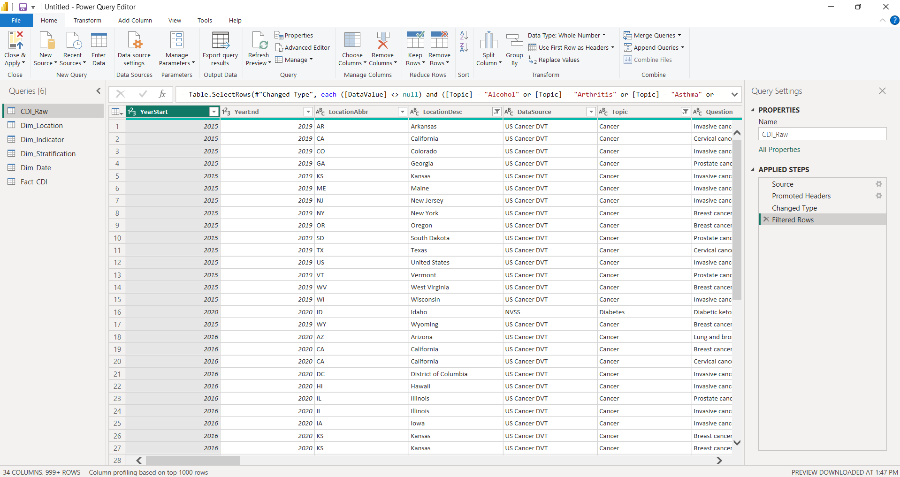
    <figcaption style="font-size: 0.95em; color: #555; margin-top: 6px;">
      <code>CDI_Raw</code> — original imported dataset preserved as-is before any transformations.
      
        <a href="images/powerbi-power-query-cdi-raw.png">Open full-size</a>
      
    </figcaption>
  </figure>

  <h3>Step 2 — Filter &amp; Scope</h3>
  <ul>
    <li>Filtered to 9 selected topics (Alcohol, Arthritis, Asthma, Cancer, Cardiovascular Disease, Chronic Kidney Disease, Diabetes, Nutrition/Physical Activity/Weight Status, Tobacco)</li>
    <li>Filtered to 52 locations (50 states + DC + national aggregate; territories excluded)</li>
    <li>Removed rows with null <code>DataValue</code> to prevent aggregation errors downstream</li>
    <li>Set correct data types: <code>YearStart</code> → Whole Number, <code>DataValue</code> → Decimal, <code>LowConfidenceLimit</code> → Decimal, <code>HighConfidenceLimit</code> → Decimal, text fields → Text</li>
  </ul>

  <h3>Step 3 — Create Dimension Tables</h3>
  

    Used the <strong>duplicate-and-reduce method</strong>: duplicated the filtered base query, then removed all columns
    except the dimension attributes, and applied <em>Remove Duplicates</em> to produce clean lookup tables. This approach
    ensures every value in each dimension table has a corresponding record in the fact table.
  

  <h4>Dim_Location (52 rows, 4 columns)</h4>
  <figure style="margin: 0 0 18px 0;">
    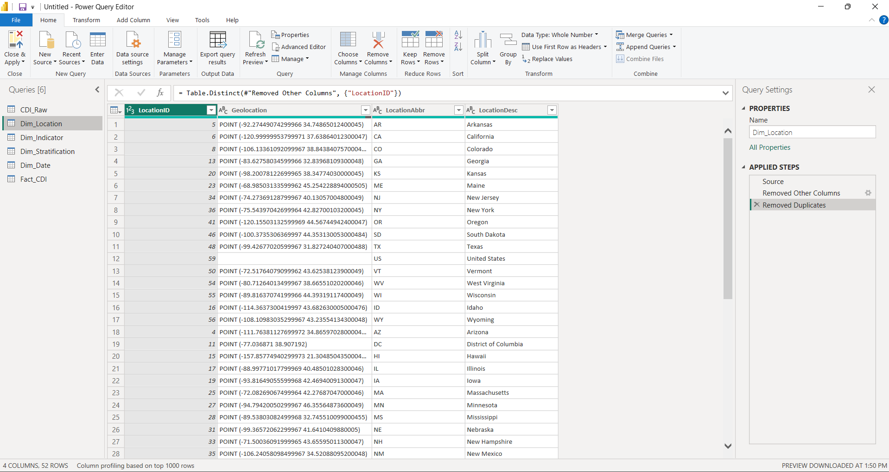
    <figcaption style="font-size: 0.95em; color: #555; margin-top: 6px;">
      <code>Dim_Location</code> — 52 unique locations with <code>LocationAbbr</code>, <code>LocationDesc</code>, <code>Geolocation</code>, and <code>LocationID</code>.
      
        <a href="images/powerbi-power-query-dim-location.png">Open full-size</a>
      
    </figcaption>
  </figure>

  <h4>Dim_Indicator (9 rows, 7 columns)</h4>
  <figure style="margin: 0 0 18px 0;">
    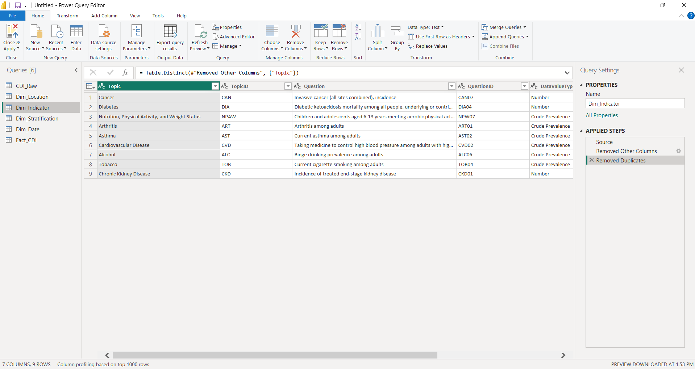
    <figcaption style="font-size: 0.95em; color: #555; margin-top: 6px;">
      <code>Dim_Indicator</code> — 9 unique health indicators with <code>Topic</code>, <code>TopicID</code>, <code>Question</code>, <code>QuestionID</code>, <code>DataValueType</code>, <code>DataValueTypeID</code>, and <code>DataValueUnit</code>.
      
        <a href="images/powerbi-power-query-dim-indicator.png">Open full-size</a>
      
    </figcaption>
  </figure>

  

    Each indicator maps a broad topic to a specific measurement question. For example:
  

  <ul>
    <li><strong>Cancer</strong> → Invasive cancer incidence</li>
    <li><strong>Diabetes</strong> → Diabetic ketoacidosis mortality</li>
    <li><strong>Tobacco</strong> → Current cigarette smoking among adults</li>
  </ul>

  <h4>Dim_Stratification (5 rows, 4 columns)</h4>
  <figure style="margin: 0 0 18px 0;">
    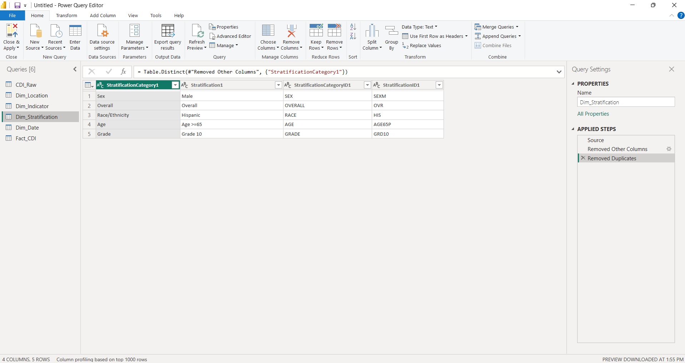
    <figcaption style="font-size: 0.95em; color: #555; margin-top: 6px;">
      <code>Dim_Stratification</code> — 5 unique demographic groups with <code>StratificationCategory1</code>, <code>Stratification1</code>, <code>StratificationCategoryID1</code>, and <code>StratificationID1</code>.
      
        <a href="images/powerbi-power-query-dim-stratification.png">Open full-size</a>
      
    </figcaption>
  </figure>

  

    The stratification dimension enables both executive-level views (Overall) and demographic disparity analysis:
  

  <ul>
    <li><strong>Overall</strong> — aggregate population values</li>
    <li><strong>Sex (Male)</strong></li>
    <li><strong>Race/Ethnicity (Hispanic)</strong></li>
    <li><strong>Age (Age >=65)</strong></li>
    <li><strong>Grade (Grade 10)</strong></li>
  </ul>

  <h4>Dim_Date (7 rows, 2 columns)</h4>
  <figure style="margin: 0 0 18px 0;">
    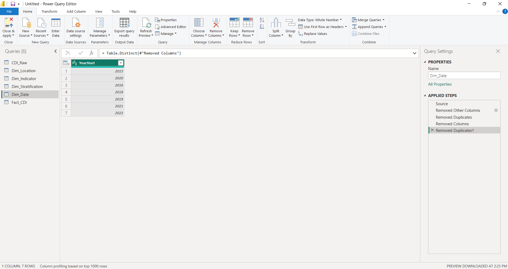
    <figcaption style="font-size: 0.95em; color: #555; margin-top: 6px;">
      <code>Dim_Date</code> — 7 unique year records with <code>YearStart</code> and <code>YearEnd</code> covering 2015–2022 (2017 absent from source data).
      
        <a href="images/powerbi-power-query-dim-date.png">Open full-size</a>
      
    </figcaption>
  </figure>

  <h3>Step 4 — Build Fact Table</h3>
  

    Created <code>Fact_CDI</code> by selecting only the foreign key columns and metric columns from the filtered base
    query. This table contains the measurement data that connects to all four dimension tables through key relationships.
  

  <figure style="margin: 0 0 18px 0;">
    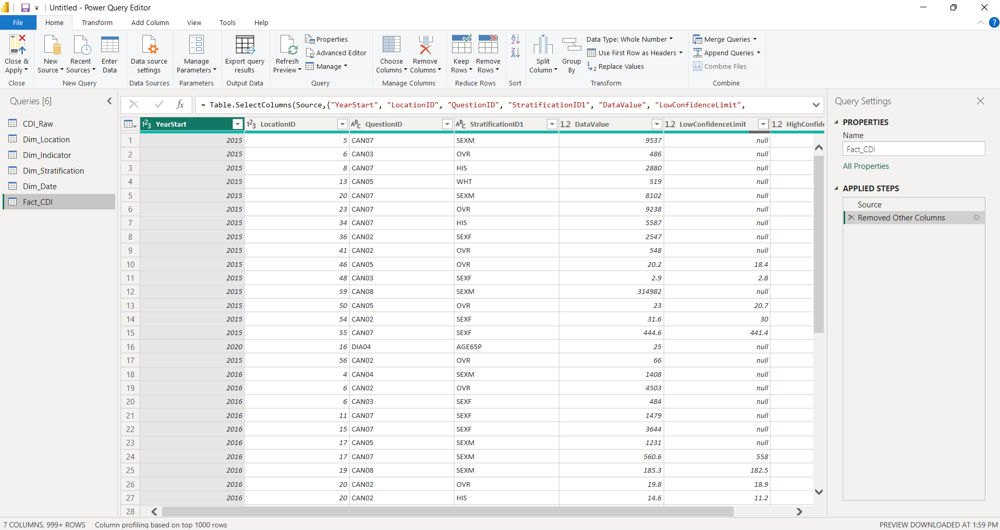
    <figcaption style="font-size: 0.95em; color: #555; margin-top: 6px;">
      <code>Fact_CDI</code> — 999+ rows with 7 columns: <code>YearStart</code>, <code>LocationID</code>, <code>QuestionID</code>, <code>StratificationID1</code>, <code>DataValue</code>, <code>LowConfidenceLimit</code>, <code>HighConfidenceLimit</code>.
      
        <a href="images/powerbi-power-query-fact-cdi.png">Open full-size</a>
      
    </figcaption>
  </figure>

  <h3>Why This ETL Approach Matters</h3>
  <ul>
    <li><strong>Accuracy:</strong> removing null values and territories prevents inflated or misleading aggregations in DAX measures</li>
    <li><strong>Performance:</strong> normalized dimension tables reduce data redundancy and optimize Power BI's VertiPaq storage engine</li>
    <li><strong>Maintainability:</strong> the duplicate-and-reduce method ensures dimension values always align with fact table records</li>
    <li><strong>Scalability:</strong> adding new years or topics requires updating scope filters rather than restructuring the model</li>
  </ul>

  
<strong>Data Model (Star Schema)</strong>

  

  

  <h3>What Is a Star Schema</h3>
  

    A star schema organizes data into a central <strong>fact table</strong> containing measurable values (metrics) surrounded
    by <strong>dimension tables</strong> that provide descriptive context (who, what, where, when). This structure is the
    standard for analytical data models in Power BI because it optimizes query performance, simplifies DAX measure writing,
    and creates predictable filter propagation across report visuals.
  

  <h3>Model Architecture</h3>

  <figure style="margin: 0 0 18px 0;">
    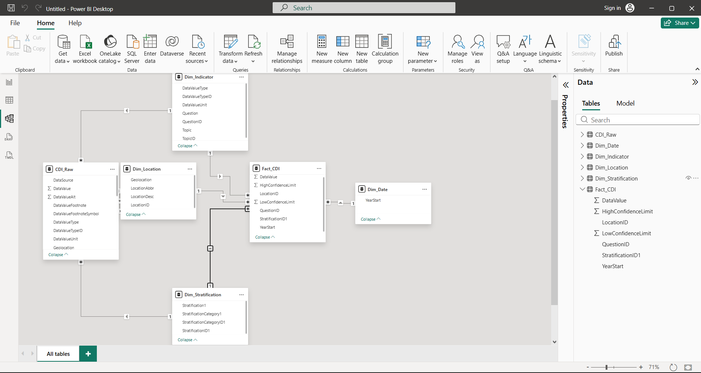
    <figcaption style="font-size: 0.95em; color: #555; margin-top: 6px;">
      Star schema data model with <code>Fact_CDI</code> at the center connected to <code>Dim_Date</code>, <code>Dim_Location</code>, <code>Dim_Indicator</code>, and <code>Dim_Stratification</code>.
      
        <a href="images/powerbi-data-connections.png">Open full-size</a>
      
    </figcaption>
  </figure>

  <h3>Fact Table</h3>
  

    <strong>Fact_CDI</strong> (999+ rows, 7 columns) — the central measurement table containing one row per observation.
  

  <ul>
    <li><strong>Foreign keys:</strong> <code>YearStart</code>, <code>LocationID</code>, <code>QuestionID</code>, <code>StratificationID1</code></li>
    <li><strong>Metrics:</strong> <code>DataValue</code>, <code>LowConfidenceLimit</code>, <code>HighConfidenceLimit</code></li>
  </ul>

  <h3>Dimension Tables</h3>

  <h4>Dim_Location (52 rows, 4 columns)</h4>
  <ul>
    <li><strong>Key:</strong> <code>LocationID</code></li>
    <li><strong>Attributes:</strong> <code>LocationAbbr</code> (state abbreviation), <code>LocationDesc</code> (full state name), <code>Geolocation</code> (coordinates)</li>
    <li><strong>Purpose:</strong> enables geographic filtering, map visualizations, and state-level comparisons</li>
  </ul>

  <h4>Dim_Indicator (9 rows, 7 columns)</h4>
  <ul>
    <li><strong>Key:</strong> <code>QuestionID</code></li>
    <li><strong>Attributes:</strong> <code>Topic</code>, <code>TopicID</code>, <code>Question</code>, <code>DataValueType</code>, <code>DataValueTypeID</code>, <code>DataValueUnit</code></li>
    <li><strong>Purpose:</strong> provides indicator metadata including the specific measurement question, data value type, and unit of measurement for each topic</li>
  </ul>

  <h4>Dim_Stratification (5 rows, 4 columns)</h4>
  <ul>
    <li><strong>Key:</strong> <code>StratificationID1</code></li>
    <li><strong>Attributes:</strong> <code>StratificationCategory1</code>, <code>Stratification1</code>, <code>StratificationCategoryID1</code></li>
    <li><strong>Purpose:</strong> enables filtering between overall population values and specific demographic group breakdowns for disparity analysis</li>
  </ul>

  <h4>Dim_Date (7 rows, 2 columns)</h4>
  <ul>
    <li><strong>Key:</strong> <code>YearStart</code></li>
    <li><strong>Attributes:</strong> <code>YearEnd</code></li>
    <li><strong>Purpose:</strong> supports time-series trend analysis and year-over-year DAX calculations using DATEADD</li>
  </ul>

  <h3>Relationships</h3>
  

    All relationships follow the same pattern: <strong>one-to-many</strong> from each dimension table to <code>Fact_CDI</code>,
    with <strong>single-direction</strong> filter propagation flowing from dimension to fact. This ensures:
  

  <ul>
    <li>Slicer selections on any dimension (year, state, indicator, demographic group) correctly filter the fact table</li>
    <li>DAX measures using <code>CALCULATE</code> and <code>ALL</code> can override filter context predictably</li>
    <li>No circular dependencies or ambiguous filter paths exist in the model</li>
  </ul>

  <h3>Why This Structure Improves Performance and Analysis</h3>
  <ul>
    <li><strong>VertiPaq optimization:</strong> narrow dimension tables with low cardinality compress efficiently in Power BI's in-memory engine</li>
    <li><strong>DAX clarity:</strong> measures reference dimension attributes for context and fact columns for calculations — the separation makes formulas easier to write and debug</li>
    <li><strong>Filter propagation:</strong> one-to-many relationships ensure that slicers and cross-filters work consistently across all report pages</li>
    <li><strong>Reduced redundancy:</strong> descriptive text (state names, indicator descriptions) is stored once in dimensions rather than repeated across 999+ fact rows</li>
  </ul>

  
<strong>Key DAX Measures</strong>

  

  

  <h3>Measures Table</h3>
  

    All DAX measures are organized in a dedicated <code>_Measures</code> table — a best practice in Power BI that
    separates calculation logic from data tables. This keeps the model clean, makes measures easy to find in the
    Fields pane, and prevents accidental aggregation of measure columns alongside raw data.
  

  

    The 10 measures below are grouped into three functional categories: <strong>Core Aggregations</strong>,
    <strong>Time Intelligence</strong>, and <strong>Disparity Analysis</strong>. Each measure is designed to
    leverage the star schema's filter context for accurate, context-aware calculations.
  

  <h3>Core Aggregations</h3>
  

    These foundational measures drive all primary visualizations — KPI cards, trend lines, bar charts, and map shading.
  

  <h4>Total Value</h4>
  <pre><code class="language-dax">Total Value = SUM(Fact_CDI[DataValue])</code></pre>
  
Aggregate sum of all data values within the current filter context. Used for total-volume views where the sum across locations or indicators is meaningful.

  <h4>Average Value</h4>
  <pre><code class="language-dax">Average Value = AVERAGE(Fact_CDI[DataValue])</code></pre>
  
Mean data value within the current filter context. This is the <strong>primary metric for analysis</strong> — most health indicators are rates or percentages where the average is more meaningful than the sum.

  <h4>National Average</h4>
  <pre><code class="language-dax">National Average =
CALCULATE(
    [Average Value],
    ALL(Dim_Location)
)</code></pre>
  

    Calculates the national benchmark by removing all location filters from the <code>[Average Value]</code> calculation.
    When a slicer selects a specific state, this measure still returns the all-states average — enabling state-vs-national
    comparison in KPI cards and reference lines.
  

  <h4>State Rank</h4>
  <pre><code class="language-dax">State Rank =
RANKX(
    ALL(Dim_Location[LocationDesc]),
    [Average Value],
    ,
    DESC
)</code></pre>
  

    Ranks states from highest to lowest average value (1 = highest value). Uses <code>ALL(Dim_Location[LocationDesc])</code>
    to evaluate every state regardless of the current filter context, then ranks them by <code>[Average Value]</code>.
    This enables dynamic state rankings that update as indicator and year selections change.
  

  <h3>Time Intelligence</h3>
  

    These measures track how health indicators change over time, supporting trend analysis and identifying whether
    conditions are improving or deteriorating year over year.
  

  <h4>YoY Change</h4>
  <pre><code class="language-dax">YoY Change =
VAR CurrentValue = [Average Value]
VAR PreviousValue =
    CALCULATE(
        [Average Value],
        DATEADD(Dim_Date[YearStart], -1, YEAR)
    )
RETURN
    CurrentValue - PreviousValue</code></pre>
  
Calculates the absolute year-over-year change in average value. A positive result means the value increased from the prior year; a negative result means it decreased.

  <h4>Previous Year Value</h4>
  <pre><code class="language-dax">Previous Year Value =
CALCULATE(
    [Average Value],
    PREVIOUSYEAR(Dim_Date[YearStart])
)</code></pre>
  

    A helper measure that returns the average value from the prior year. Uses <code>PREVIOUSYEAR</code> to shift the date
    context back one year, providing a clean reference point for year-over-year calculations.
  

  <h4>YoY % Change</h4>
  <pre><code class="language-dax">YoY % Change =
DIVIDE(
    [Average Value] - [Previous Year Value],
    [Previous Year Value]
)</code></pre>
  

    Calculates the percentage year-over-year change using <code>DIVIDE</code> for safe division (returns blank instead of
    error when the prior year value is zero or missing). References the <code>[Previous Year Value]</code> helper measure
    for a cleaner, more maintainable formula. For example, a result of 0.05 means the indicator increased 5%
    compared to the previous year.
  

  <h3>Disparity Analysis</h3>
  

    These measures quantify the gap between the best-performing and worst-performing demographic groups within a given
    state, indicator, and year. Disparity analysis is critical in public health analytics because it reveals whether
    improvements in population-level averages are shared equitably across demographic groups or are masking widening
    inequities.
  

  <h4>Group Max</h4>
  <pre><code class="language-dax">Group Max =
CALCULATE(
    MAX(Fact_CDI[DataValue]),
    ALLEXCEPT(Fact_CDI, Dim_Location, Dim_Indicator, Dim_Date)
)</code></pre>
  

    Finds the highest data value among all demographic groups for a given location, indicator, and year combination.
    <code>ALLEXCEPT</code> removes the stratification filter while preserving location, indicator, and date context —
    so the measure scans across all demographic groups within the current state and indicator.
  

  <h4>Group Min</h4>
  <pre><code class="language-dax">Group Min =
CALCULATE(
    MIN(Fact_CDI[DataValue]),
    ALLEXCEPT(Fact_CDI, Dim_Location, Dim_Indicator, Dim_Date)
)</code></pre>
  

    Finds the lowest data value among all demographic groups for a given location, indicator, and year combination.
    The counterpart to <code>[Group Max]</code>, enabling the calculation of disparity measures below.
  

  <h4>Disparity Gap</h4>
  <pre><code class="language-dax">Disparity Gap = [Group Max] - [Group Min]</code></pre>
  

    The absolute difference between the highest and lowest performing demographic groups. A gap of 10 means the worst-performing
    group's rate is 10 percentage points (or units) higher than the best-performing group. Larger gaps indicate greater health inequity.
  

  <h4>Disparity Ratio</h4>
  <pre><code class="language-dax">Disparity Ratio = DIVIDE([Group Max], [Group Min])</code></pre>
  

    The relative inequality between demographic groups. A ratio of 2.0 means the highest-burden group's rate is 2x
    the lowest-burden group's rate. This measure is especially useful for comparing disparity severity across indicators
    with different scales — a 5-point gap means something different for an indicator measured in percentages versus one
    measured in rates per 100,000.
  

  <h3>Why These Measures Matter for Health Analytics</h3>
  <ul>
    <li><strong>Core aggregations</strong> provide the foundation for every visualization — KPI cards, trend lines, maps, and ranking tables all depend on <code>[Average Value]</code>, <code>[National Average]</code>, and <code>[State Rank]</code></li>
    <li><strong>Time intelligence</strong> enables trend detection — policymakers need to know not just current values but whether conditions are improving or deteriorating, and at what rate</li>
    <li><strong>Disparity measures</strong> go beyond population averages to surface inequities — a state's overall rate may look acceptable while specific demographic groups face significantly higher burden, requiring targeted interventions</li>
  </ul>

  
<strong>Dashboard Page 1 — Executive Overview</strong>

  

  

  

    A high-level population health snapshot designed for quick assessment of chronic disease indicators across the
    United States. This page provides at-a-glance KPIs, geographic comparisons, and trend context — enabling
    analysts and decision-makers to identify which indicators are most pressing and where to focus deeper analysis.
  

  <h4>Business Questions Answered</h4>
  <ul>
    <li>Which chronic disease indicators have the highest or lowest average values nationally?</li>
    <li>How do states compare against each other for a selected health topic?</li>
    <li>What are the trends over time — are conditions improving or worsening year over year?</li>
  </ul>

  <h4>Visuals on This Page</h4>
  <ul>
    <li><strong>4 KPI Cards:</strong> Total Value, Average Value, National Average, and State Rank — providing immediate numeric context for the selected filters</li>
    <li><strong>Trend Line Chart:</strong> Average Value over time by year, showing directional movement across the 2015–2022 period</li>
    <li><strong>Top 10 Bar Chart:</strong> states ranked by Average Value, highlighting the highest-burden locations for the selected topic</li>
    <li><strong>Filled Map:</strong> geographic view with color-coded states based on Average Value, revealing regional patterns and clusters</li>
    <li><strong>3 Interactive Slicers:</strong> Topic, Year, and Stratification — enabling dynamic filtering across all visuals on the page</li>
  </ul>

  <figure style="margin: 0 0 18px 0;">
    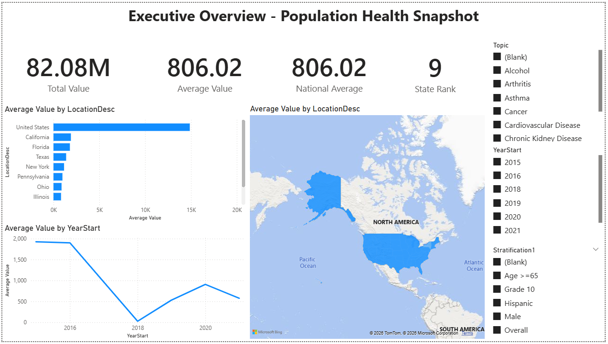
    <figcaption style="font-size: 0.95em; color: #555; margin-top: 6px;">
      Executive Overview — national KPI snapshot with geographic comparison, trend analysis, and interactive filtering.
      
        <a href="images/powerbi-dashboard-1.png">Open full-size</a>
      
    </figcaption>
  </figure>

  <h4>Key Insights</h4>
  <ul>
    <li><strong>State rankings shift by topic:</strong> states that rank highest for one health indicator (e.g., Tobacco use) often differ from those ranking highest for another (e.g., Cardiovascular Disease), revealing that chronic disease burden is not uniformly distributed</li>
    <li><strong>Trend patterns vary across indicators:</strong> some topics show steady year-over-year improvement while others plateau or worsen — the trend line makes it easy to distinguish improving conditions from stagnating ones</li>
    <li><strong>Geographic clustering is visible:</strong> the filled map reveals regional patterns where neighboring states share similar indicator values, suggesting that shared environmental, economic, or policy factors may drive health outcomes in those areas</li>
  </ul>

  
<strong>Dashboard Page 2 — Trends &amp; Indicator Comparison</strong>

  

  

  

    A multi-indicator trend analysis dashboard designed to track how chronic disease indicators evolve over time and
    compare performance across topics and states. This page enables analysts to identify which health conditions are
    improving versus worsening, evaluate year-over-year momentum, and assess cross-indicator performance in a single
    unified view.
  

  <h4>Business Questions Answered</h4>
  <ul>
    <li>Which chronic disease indicators are improving or worsening over the 2018–2022 period?</li>
    <li>How do year-over-year change rates compare across different health topics?</li>
    <li>What is the longitudinal trend pattern for each indicator — steady improvement, plateau, or deterioration?</li>
    <li>How do states perform across multiple indicators simultaneously — which locations excel or struggle across the board?</li>
  </ul>

  <h4>Visuals on This Page</h4>
  <ul>
    <li><strong>Multi-Line Trend Chart:</strong> Average Value by YearStart and Topic — showing all 9 chronic disease topics simultaneously on a 2018–2022 timeline to reveal directional patterns and relative magnitude differences</li>
    <li><strong>Indicator Performance Summary Table:</strong> matrix displaying Topic, Average Value, and YoY % Change — providing a sortable reference table that quantifies both current state and recent momentum for each indicator</li>
    <li><strong>State Performance by Indicator Matrix:</strong> cross-tabulation showing each state's Average Value broken out by all topics — enabling quick identification of states with consistently high or low values across multiple health domains</li>
    <li><strong>YoY % Change Bar Chart:</strong> horizontal bars color-coded by direction (red for worsening, green for improving) — making it immediately clear which topics gained or lost ground in the most recent year</li>
    <li><strong>4 Interactive Slicers:</strong> Topic, LocationDesc (state), Stratification, and YearStart — supporting focused drill-downs into specific indicators, geographies, demographic groups, or time periods</li>
  </ul>

  <figure style="margin: 0 0 18px 0;">
    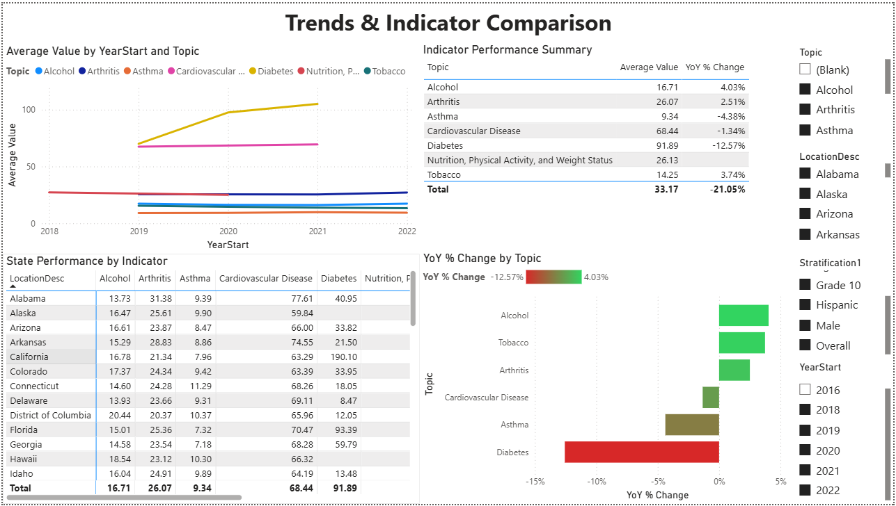
    <figcaption style="font-size: 0.95em; color: #555; margin-top: 6px;">
      Trends &amp; Indicator Comparison — longitudinal view tracking year-over-year changes and cross-indicator performance patterns from 2018–2022.
      
        <a href="images/powerbi-dashboard-2.png">Open full-size</a>
      
    </figcaption>
  </figure>

  <h4>Key Insights</h4>
  <ul>
    <li><strong>Diabetes shows the most significant improvement:</strong> with a year-over-year decline of -12.57%, Diabetes indicators demonstrate the steepest downward trend — suggesting that public health interventions targeting diabetes management (screening programs, medication adherence, lifestyle modification support) may be yielding measurable population-level improvements</li>
    <li><strong>Alcohol and Tobacco trends are moving in the wrong direction:</strong> both indicators show positive YoY % Change values (Alcohol +4.03%, Tobacco +3.74%), meaning prevalence or burden is increasing rather than decreasing — this signals that risk factor mitigation efforts for these behavioral health domains may be losing effectiveness or facing new barriers</li>
    <li><strong>Asthma indicators also improving:</strong> the -4.38% YoY change for Asthma suggests recent reductions in prevalence or severity, potentially linked to environmental interventions (air quality improvements, allergen reduction) or better access to controller medications</li>
    <li><strong>Cardiovascular Disease remains the highest-magnitude indicator:</strong> despite a modest -1.34% YoY improvement, Cardiovascular Disease maintains an average value of 68.44 — substantially higher than most other topics — highlighting that heart disease and stroke continue to represent the largest chronic disease burden in the dataset</li>
    <li><strong>Cross-indicator variability reveals uneven progress:</strong> the multi-line chart shows that not all chronic diseases move in the same direction — some topics plateau while others improve or worsen — indicating that blanket public health strategies may not be sufficient and topic-specific interventions are required</li>
    <li><strong>State-level heterogeneity is visible in the matrix:</strong> states do not perform uniformly across all indicators — a state ranking poorly for Alcohol may rank well for Diabetes, suggesting that local policy environments, healthcare infrastructure, and demographic compositions create indicator-specific outcomes rather than universal health system quality</li>
  </ul>

  <h4>Why This Dashboard Matters for Public Health Decision-Making</h4>
  

    Executive overviews provide snapshots, but trend analysis reveals <em>direction and momentum</em> — the difference
    between a static problem and a worsening crisis. This dashboard enables public health agencies to:
  

  <ul>
    <li><strong>Prioritize resource allocation:</strong> indicators showing positive YoY % Change (worsening conditions) may require immediate intervention funding, while those improving can inform best-practice replication</li>
    <li><strong>Evaluate policy effectiveness:</strong> longitudinal trends help assess whether recent legislation, funding initiatives, or awareness campaigns are producing measurable outcomes over multi-year horizons</li>
    <li><strong>Identify emerging concerns early:</strong> topics that were stable but recently show upward momentum (like Alcohol and Tobacco in this view) can be flagged before they escalate into larger-scale public health challenges</li>
    <li><strong>Support evidence-based advocacy:</strong> when requesting budget increases or policy changes, stakeholders can point to specific YoY % Change values and trend lines as quantitative justification rather than relying on anecdotal evidence</li>
  </ul>

  
<strong>Dashboard Page 3 — State Performance Analysis</strong>

  

  

  

    A state-level deep dive dashboard designed to profile individual state performance across chronic disease indicators.
    This page enables analysts to select a specific state, assess how it compares to the national average across all
    health topics, drill into topic-level and demographic breakdowns, and track indicator trends over time — providing
    the detailed context needed for state-specific policy evaluation and resource allocation decisions.
  

  <h4>Business Questions Answered</h4>
  <ul>
    <li>How does a selected state's overall chronic disease burden compare to the national average?</li>
    <li>Which health indicators contribute the most to a state's overall average value?</li>
    <li>Where does a state rank nationally for each chronic disease topic?</li>
    <li>How do demographic subgroups (Male, Hispanic, Overall) differ within a given indicator for that state?</li>
    <li>Are the state's indicator values trending upward or downward over recent years?</li>
  </ul>

  <h4>Visuals on This Page</h4>
  <ul>
    <li><strong>4 KPI Cards:</strong> Average Value, National Average, State Rank, and YoY Change — providing immediate numeric context for the selected state across all filtered indicators</li>
    <li><strong>Health Indicator Breakdown (Decomposition Tree):</strong> a hierarchical visual that starts with the state's overall Average Value and branches first by Topic (Arthritis, Alcohol, Tobacco), then by Stratification group (Male, Hispanic, Overall) — enabling interactive drill-down from aggregate performance to topic-level and demographic-level detail</li>
    <li><strong>State Rankings Table:</strong> a summary matrix showing each Topic alongside its Average Value and State Rank — providing a compact view of where the state stands nationally across all indicators in a single sortable reference</li>
    <li><strong>Average Value and National Average by Topic (Horizontal Bar Chart):</strong> side-by-side comparison of the selected state's Average Value against the National Average for each topic — making it immediately visible which indicators fall above or below the national benchmark</li>
    <li><strong>Average Value by YearStart and Topic (Multi-Line Trend Chart):</strong> longitudinal view tracking each topic's Average Value from 2019–2022 — revealing whether specific indicators are improving, worsening, or holding steady over time for the selected state</li>
    <li><strong>3 Interactive Slicers:</strong> LocationDesc (state dropdown selector), YearStart (multi-select checkboxes for 2015–2022), and Topic (multi-select checkboxes for all 9 chronic disease categories) — enabling flexible filtering to isolate specific states, time periods, or health topics</li>
  </ul>

  <figure style="margin: 0 0 18px 0;">
    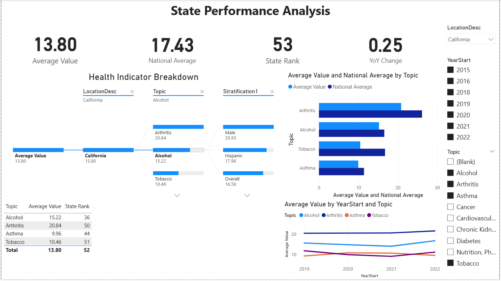
    <figcaption style="font-size: 0.95em; color: #555; margin-top: 6px;">
      State Performance Analysis — state-level profile with indicator breakdown, national benchmarking, rankings, and trend tracking (California selected).
      
        <a href="images/powerbi-dashboard-3.png">Open full-size</a>
      
    </figcaption>
  </figure>

  <h4>Key Insights</h4>
  <ul>
    <li><strong>California's overall average (13.80) falls well below the national average (17.43):</strong> this positions California among the lowest-burden states in the dataset, suggesting that the state's public health infrastructure and policy environment contribute to better-than-average chronic disease outcomes across the board</li>
    <li><strong>Arthritis is California's highest-burden indicator (20.84) but still ranks 50th nationally:</strong> even California's weakest-performing topic places it near the bottom of the national rankings (where higher rank = higher burden), reinforcing the state's consistently strong relative performance</li>
    <li><strong>The decomposition tree reveals demographic variation within indicators:</strong> for Arthritis, the Male subgroup (20.93) and Hispanic subgroup (17.98) both exceed the Overall population average (16.58) — highlighting that aggregate state values can mask meaningful demographic differences that warrant targeted public health attention</li>
    <li><strong>Tobacco ranks 51st (10.46 average) — among the lowest nationally:</strong> this is consistent with California's historically aggressive tobacco control policies, including high cigarette excise taxes, comprehensive smoke-free workplace laws, and sustained public education campaigns through the California Tobacco Control Program</li>
    <li><strong>The state-vs-national bar chart shows California consistently below the national average across all topics:</strong> Arthritis, Alcohol, Tobacco, and Asthma all show the state's light blue bars falling short of the darker national average bars — visually confirming that California outperforms the national benchmark in every displayed category</li>
    <li><strong>Trend lines (2019–2022) show relatively stable indicator values:</strong> Arthritis holds steady around 20–21, while Alcohol, Asthma, and Tobacco remain flat in the 10–15 range — suggesting California's chronic disease indicators are neither significantly improving nor deteriorating, maintaining a stable baseline during a period that includes the COVID-19 pandemic disruption</li>
    <li><strong>The rankings table provides actionable prioritization:</strong> with Alcohol ranking 36th (the highest/worst-performing rank among California's topics), it stands out as the indicator where California has the most room for improvement relative to other states — making it a candidate for additional investment or policy intervention</li>
  </ul>

  <h4>Why This Dashboard Matters for State-Level Decision-Making</h4>
  

    National averages and aggregate rankings provide useful benchmarks, but public health decisions are ultimately made
    at the state level — where budgets are allocated, programs are designed, and policies are enacted. This dashboard
    enables state-level stakeholders to:
  

  <ul>
    <li><strong>Identify relative strengths and weaknesses:</strong> the rankings table and bar chart make it clear which topics a state handles well versus where it lags — allowing health departments to allocate resources toward their highest-burden indicators rather than spreading effort uniformly</li>
    <li><strong>Detect demographic disparities within state borders:</strong> the decomposition tree's stratification breakdowns reveal whether a state's strong overall performance masks inequities in specific demographic groups — a critical insight for health equity planning</li>
    <li><strong>Track progress over time:</strong> the multi-line trend chart provides longitudinal accountability — if a state launches a new tobacco reduction program, this visual tracks whether indicator values actually decline in subsequent years</li>
    <li><strong>Support evidence-based benchmarking:</strong> by comparing a state's values directly against the national average for each topic, decision-makers can quantify exactly how far above or below the benchmark they fall and set realistic improvement targets</li>
  </ul>

  
<strong>Dashboard Page 4 — Health Disparities</strong>

  

  

  

    A demographic disparity analysis dashboard designed to quantify and visualize health inequities across population
    subgroups within a selected state and chronic disease topic. This page leverages the Disparity Gap, Disparity Ratio,
    Group Max, and Group Min DAX measures to surface where demographic groups experience significantly different health
    outcomes — enabling public health analysts to move beyond population-level averages and identify the specific groups
    bearing disproportionate disease burden.
  

  <h4>Business Questions Answered</h4>
  <ul>
    <li>How large is the gap between the highest-burden and lowest-burden demographic groups for a selected state and health topic?</li>
    <li>Which demographic groups carry the highest and lowest chronic disease burden within a given state?</li>
    <li>Is the disparity between demographic groups widening, narrowing, or holding steady over time?</li>
    <li>Where does a state's overall average fall relative to its highest- and lowest-performing demographic groups?</li>
    <li>How do group-level values compare across all available demographic stratifications simultaneously?</li>
  </ul>

  <h4>Visuals on This Page</h4>
  <ul>
    <li><strong>4 KPI Cards:</strong> Disparity Gap, Disparity Ratio, Group Max, and Group Min — quantifying both the absolute difference and relative inequality between the highest-burden and lowest-burden demographic groups for the selected state and topic</li>
    <li><strong>Health Burden by Demographic Group (Horizontal Bar Chart):</strong> Average Value by Stratification1 — displaying each demographic group's burden side-by-side to reveal which subpopulations face the greatest and least disease impact for the selected topic</li>
    <li><strong>Disparity Trend Over Time (Multi-Line Chart):</strong> Group Max, Group Min, and Disparity Gap plotted across 2019–2022 — tracking whether the inequality between demographic groups is widening, narrowing, or holding steady over the analysis period</li>
    <li><strong>Demographic Disparity Matrix (Conditional Formatting Table):</strong> LocationDesc × Stratification cross-tabulation with color-coded cells — red for higher burden, green for lower burden — enabling quick visual pattern recognition across all demographic groups in a single compact reference</li>
    <li><strong>Average Value, Group Min and Group Max (Gauge Chart):</strong> a gauge visual displaying the state's overall Average Value positioned between the Group Min and Group Max boundaries — providing intuitive context for where the population average falls within the full range of demographic outcomes</li>
    <li><strong>3 Interactive Slicers:</strong> Topic (dropdown selector), LocationDesc (state dropdown selector), and YearStart (multi-select dropdown) — enabling focused analysis on specific state-topic-year combinations for targeted disparity investigation</li>
  </ul>

  <figure style="margin: 0 0 18px 0;">
    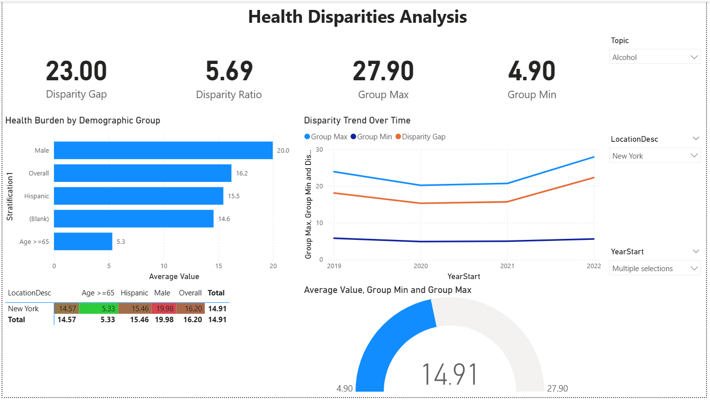
    <figcaption style="font-size: 0.95em; color: #555; margin-top: 6px;">
      Health Disparities Analysis — demographic gap quantification with disparity trend tracking, group-level burden comparison, and conditional formatting matrix (New York, Alcohol selected).
      
        <a href="images/powerbi-dashboard-4.png">Open full-size</a>
      
    </figcaption>
  </figure>

  <h4>Key Insights</h4>
  <ul>
    <li><strong>Male demographic group carries the highest alcohol-related burden (20.0):</strong> among all stratification groups in New York, males show the highest Average Value for Alcohol indicators — consistent with national epidemiological data showing higher rates of heavy drinking, binge drinking, and alcohol-related morbidity among men compared to other demographic groups</li>
    <li><strong>Age >=65 group shows dramatically lower alcohol burden (5.3):</strong> the oldest demographic group's Average Value is less than one-third of the Male group's value, creating the floor of the disparity range — this likely reflects both lower alcohol consumption rates among older adults and survivorship effects where individuals with severe alcohol-related conditions may not reach age 65</li>
    <li><strong>Disparity Ratio of 5.69 indicates severe demographic inequality:</strong> the highest-burden group's rate is nearly 6 times the lowest-burden group's rate — a ratio this large signals that population-level averages substantially understate the burden experienced by the most affected demographic groups and overstate the burden for the least affected, making targeted interventions essential</li>
    <li><strong>Disparity Gap is widening over the 2019–2022 period:</strong> the multi-line trend chart shows the Group Max line trending upward while the Group Min line remains relatively flat — driving the Disparity Gap (orange line) from approximately 15 in 2019 to 23 by 2022, indicating that alcohol-related health inequities in New York are growing rather than narrowing over time</li>
    <li><strong>New York's overall average (14.91) sits in the lower half of the demographic range:</strong> the gauge chart positions the state's overall Average Value closer to the Group Min (4.90) than the Group Max (27.90), indicating that the population-level average is pulled down by lower-burden groups — masking the substantially higher burden experienced by the Male and Overall stratification categories</li>
    <li><strong>The conditional formatting matrix reveals at-a-glance disparity patterns:</strong> color-coded cells in the matrix table immediately highlight which demographic groups fall above (red) or below (green) average — for New York's Alcohol indicators, the Male group (19.98) and Overall group (16.20) show elevated values while Age >=65 (5.33) stands out as markedly lower, making the demographic disparity pattern visible without reading individual numbers</li>
  </ul>

  <h4>Why This Dashboard Matters for Health Equity Analysis</h4>
  

    Population-level averages are useful for benchmarking, but they can mask critical inequities between demographic
    groups. A state may appear to perform well on an aggregate metric while specific subpopulations experience
    disproportionately high disease burden — making disparity analysis essential for equitable public health
    decision-making. This dashboard enables health equity analysts to:
  

  <ul>
    <li><strong>Quantify the equity gap:</strong> the Disparity Gap and Disparity Ratio KPIs transform abstract concerns about inequality into concrete, measurable values that can be tracked over time and compared across states or topics — providing the numeric foundation for equity-focused goal-setting</li>
    <li><strong>Identify which groups need targeted intervention:</strong> the horizontal bar chart and conditional formatting matrix make it immediately clear which demographic subpopulations face the highest burden — enabling health departments to design interventions tailored to specific groups rather than applying uniform strategies that may not reach those most affected</li>
    <li><strong>Monitor whether disparities are improving or worsening:</strong> the Disparity Trend Over Time chart provides longitudinal accountability — if a state launches an equity-focused initiative, this visual tracks whether the gap between Group Max and Group Min actually narrows in subsequent years or continues to widen despite intervention</li>
    <li><strong>Contextualize overall averages:</strong> the gauge chart and matrix together reveal how a state's overall average relates to the full range of demographic outcomes — preventing decision-makers from being misled by favorable aggregate statistics that obscure significant within-state inequities</li>
  </ul>

  
<strong>Dashboard Page 5 — Action Prioritization</strong>

  

  

  

    An action-oriented prioritization dashboard designed to identify which states require the most urgent public health
    intervention based on a combination of disease burden (Average Value) and trend direction (YoY % Change). This page
    uses a scatter plot priority matrix to classify states into quadrants — highlighting those with both high burden and
    worsening trends as top candidates for resource allocation — while a ranked table and topic burden comparison provide
    the supporting detail needed to justify intervention decisions.
  

  <h4>Business Questions Answered</h4>
  <ul>
    <li>Which states have both high chronic disease burden and worsening year-over-year trends — making them the highest priority for intervention?</li>
    <li>How do states distribute across the burden-vs-trend priority matrix — are most states improving, worsening, or stagnating?</li>
    <li>Which health topics contribute the most to overall chronic disease burden across the selected indicators?</li>
    <li>What are the top-ranked states by average value, and how fast are their conditions deteriorating?</li>
    <li>Where should public health agencies focus limited resources for maximum population health impact?</li>
  </ul>

  <h4>Visuals on This Page</h4>
  <ul>
    <li><strong>State Priority Matrix — Burden vs. Trend (Scatter Plot):</strong> a quadrant-style scatter plot with YoY % Change on the x-axis and Average Value on the y-axis — each bubble represents a state color-coded by location, with dashed reference lines dividing the chart into four priority zones: upper-right (high burden + worsening) = highest priority, upper-left (high burden + improving) = monitor, lower-right (low burden + worsening) = watch, and lower-left (low burden + improving) = lowest priority — enabling immediate visual triage of all states simultaneously</li>
    <li><strong>Health Topics Ranked by Burden (Horizontal Bar Chart):</strong> Average Value by Topic — ranking the selected health topics from highest to lowest burden to reveal which chronic disease categories contribute the most to overall population health impact across the filtered scope</li>
    <li><strong>High-Priority States Table (High Burden + Worsening):</strong> a ranked table displaying LocationDesc, Average Value, YoY % Change, and State Rank — listing the top states that fall in the high-burden, worsening-trend zone of the priority matrix with detailed numeric context for each</li>
    <li><strong>2 Interactive Slicers:</strong> Health Topic (multi-select checkboxes for all 9 chronic disease categories) and Year (multi-select checkboxes for 2015–2022) — enabling analysts to focus the prioritization analysis on specific health domains and time periods</li>
  </ul>

  <figure style="margin: 0 0 18px 0;">
    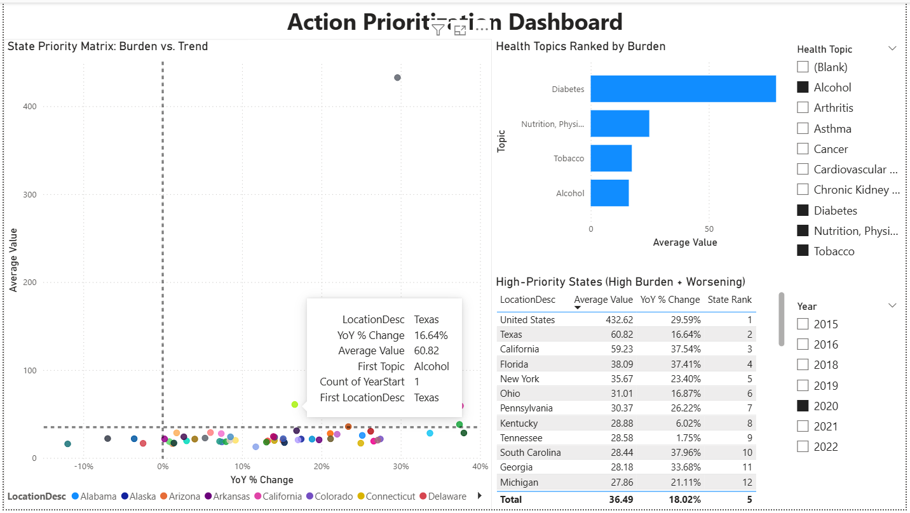
    <figcaption style="font-size: 0.95em; color: #555; margin-top: 6px;">
      Action Prioritization — state-level triage using burden vs. trend priority matrix, topic burden ranking, and high-priority state identification (Alcohol, Diabetes, Nutrition/Physical Activity, and Tobacco selected; 2020).
      
        <a href="images/powerbi-dashboard-5.png">Open full-size</a>
      
    </figcaption>
  </figure>

  <h4>Key Insights</h4>
  <ul>
    <li><strong>The majority of states cluster in the lower-right quadrant (low burden + worsening):</strong> most state bubbles sit below the horizontal reference line with positive YoY % Change values, indicating that while absolute burden levels remain moderate for most states, the trend direction is unfavorable — conditions are getting worse rather than better across the selected health topics in 2020</li>
    <li><strong>Diabetes dominates the topic burden ranking by a wide margin:</strong> the horizontal bar chart shows Diabetes with an Average Value roughly 4–5 times higher than the next-highest topics (Nutrition/Physical Activity, Tobacco, and Alcohol) — confirming that Diabetes-related indicators represent the single largest contributor to chronic disease burden among the selected topics and should be weighted heavily in any composite prioritization scoring</li>
    <li><strong>Texas emerges as a high-priority state (Average Value: 60.82, YoY % Change: 16.64%):</strong> positioned well above the cluster of states in the scatter plot, Texas combines a substantially above-average burden with a double-digit worsening trend — placing it firmly in the upper-right priority quadrant and flagging it as a candidate for targeted intervention across the selected health topics</li>
    <li><strong>California and Florida show alarming trend acceleration despite high burden:</strong> California (59.23 average, 37.54% YoY change) and Florida (38.09 average, 37.41% YoY change) both exhibit YoY % Change rates exceeding 37% — among the highest deterioration rates in the table — indicating that these large-population states are not only carrying significant disease burden but are experiencing rapid year-over-year worsening that demands immediate attention</li>
    <li><strong>South Carolina and Georgia represent emerging high-priority states:</strong> both states show YoY % Change rates above 33% (South Carolina: 37.96%, Georgia: 33.68%) with Average Values around 28 — while their absolute burden is moderate, the steep upward trajectory suggests they could move into the high-burden zone within 1–2 years if current trends continue unchecked</li>
    <li><strong>The national aggregate (United States) sits as a dramatic outlier at 432.62 Average Value:</strong> the gray bubble at the top of the scatter plot represents the summed national figure, which is not directly comparable to individual state values but serves as a reference point — its 29.59% YoY increase underscores that the worsening trend is not isolated to a few states but reflects a broad national pattern across the selected health topics in 2020</li>
    <li><strong>Tennessee shows relatively stable trends compared to peers (1.75% YoY change):</strong> despite ranking 9th by Average Value (28.58), Tennessee's near-flat year-over-year change suggests its chronic disease burden is holding steady rather than accelerating — making it lower priority for immediate intervention compared to states with similar burden levels but steeper upward trends like South Carolina or Georgia</li>
  </ul>

  <h4>Why This Dashboard Matters for Public Health Resource Allocation</h4>
  

    Public health agencies operate with finite budgets and must allocate intervention resources where they will have the
    greatest population health impact. Simple rankings by burden alone miss a critical dimension: <em>trend direction</em>.
    A state with moderate burden but rapidly worsening trends may warrant more urgent attention than a high-burden state
    where conditions are stable or improving. This dashboard enables public health decision-makers to:
  

  <ul>
    <li><strong>Triage states using two dimensions simultaneously:</strong> the scatter plot priority matrix combines burden level and trend direction into a single visual, allowing analysts to immediately identify which states fall into the critical upper-right quadrant (high burden + worsening) versus those in lower-priority zones — replacing subjective prioritization with a data-driven framework</li>
    <li><strong>Allocate resources proportionally to disease burden by topic:</strong> the topic burden ranking reveals that Diabetes accounts for a disproportionate share of overall chronic disease impact — informing decisions about whether intervention budgets should be distributed equally across topics or weighted toward the highest-burden categories</li>
    <li><strong>Build evidence-based justification for intervention targeting:</strong> the high-priority states table provides the specific numeric values (Average Value, YoY % Change, State Rank) needed to justify why particular states were selected for intervention — replacing anecdotal reasoning with quantifiable metrics that can withstand scrutiny from budget committees and oversight bodies</li>
    <li><strong>Monitor intervention urgency over time:</strong> by changing the Year slicer, analysts can track whether high-priority states are responding to interventions (moving left in the scatter plot as YoY % Change decreases) or continuing to deteriorate — providing longitudinal accountability for resource allocation decisions</li>
  </ul>

  
<strong>Conclusion</strong>

  

  

  

    This project demonstrates an end-to-end Power BI analytics workflow using real-world CDC chronic disease surveillance
    data. From raw CSV import through polished interactive dashboards, the analysis covers the full Power BI development
    lifecycle: Power Query ETL, star schema data modeling, DAX measure authoring, and multi-page report design — applied
    to a dataset spanning 9 chronic disease topics, 52 locations, and 7 years of public health surveillance.
  

  <h3>What the Data Revealed</h3>
  

    Across five dashboard pages, the analysis surfaced distinct patterns at every level — national trends, state-level
    performance, demographic disparities, and actionable prioritization signals:
  

  <ul>
    <li><strong>Uneven progress across health topics:</strong> Diabetes showed the strongest improvement (-12.57% YoY), while Alcohol (+4.03%) and Tobacco (+3.74%) moved in the wrong direction — confirming that blanket public health strategies are insufficient and topic-specific interventions are required</li>
    <li><strong>Cardiovascular Disease dominates overall burden:</strong> with an average value of 68.44, Cardiovascular Disease remains substantially higher than all other topics in the dataset, reinforcing heart disease and stroke as the single largest chronic disease challenge nationally</li>
    <li><strong>State performance varies by indicator:</strong> states that rank poorly for one topic often perform well on others — California ranks 50th for Arthritis but 36th for Alcohol — indicating that chronic disease outcomes are shaped by local policy environments and healthcare infrastructure rather than uniform system quality</li>
    <li><strong>Demographic disparities are significant and widening:</strong> in New York, the Alcohol-related disparity ratio reached 5.69 (the highest-burden group's rate was nearly 6x the lowest), and the disparity gap widened from approximately 15 in 2019 to 23 by 2022 — showing that population-level averages mask growing inequities between demographic groups</li>
    <li><strong>High-burden states with worsening trends require urgent attention:</strong> the priority matrix identified Texas (60.82 average, 16.64% YoY increase), California (59.23 average, 37.54% YoY increase), and Florida (38.09 average, 37.41% YoY increase) as states combining high disease burden with rapid deterioration — placing them in the highest-priority quadrant for intervention</li>
  </ul>

  <h3>Connecting the Analyses</h3>
  

    Each dashboard was designed to answer a distinct set of business questions, but the findings compound when viewed
    together. The Executive Overview identified which topics carry the highest national burden and where geographic
    clusters exist. The Trends dashboard revealed whether those burdens are improving or worsening over time. The State
    Performance page enabled drill-down into individual states to compare against national benchmarks. The Health
    Disparities dashboard exposed that favorable state-level averages can mask significant demographic inequities. And
    the Action Prioritization page synthesized burden and trend data into a two-dimensional triage framework for
    resource allocation decisions.
  

  

    The technical implementation progressed from foundational Power Query transformations through normalized star schema
    design, 10 purpose-built DAX measures across three functional categories, and five interactive report pages with
    KPI cards, scatter plots, decomposition trees, conditional formatting matrices, gauge charts, and multi-line trend
    analysis — demonstrating how increasing analytical complexity can be layered into a cohesive, decision-ready deliverable.
  

  <h3>Skills Demonstrated</h3>
  <ul>
    <li><strong>Power Query (M):</strong> data import, type standardization, scope filtering, null handling, and dimension table creation via the duplicate-and-reduce method</li>
    <li><strong>Data Modeling:</strong> star schema design with one fact table and four dimension tables, one-to-many relationships, single-direction filter propagation, and a dedicated <code>_Measures</code> table</li>
    <li><strong>DAX:</strong> SUM, AVERAGE, CALCULATE with ALL/ALLEXCEPT, RANKX, DATEADD time intelligence, DIVIDE for safe division, MAX/MIN for group-level analysis, and VAR for readable multi-step formulas</li>
    <li><strong>Report Design:</strong> 5 interactive dashboard pages with KPI cards, filled maps, scatter plot priority matrices, decomposition trees, conditional formatting matrices, gauge charts, trend lines, bar charts, and multi-select slicers</li>
    <li><strong>Analytical Thinking:</strong> scoping decisions that balance breadth with focus, disparity analysis that goes beyond population averages, and a two-dimensional prioritization framework combining burden level with trend direction</li>
  </ul>

  <h3>Future Enhancements</h3>
  <ul>
    <li>Add composite Burden Index and Priority Score measures combining multiple indicators into a single state-level ranking</li>
    <li>Implement bookmarks for guided analysis flow between executive overview and detailed drill-downs</li>
    <li>Create custom tooltips showing state profiles on map hover</li>
    <li>Publish to Power BI Service for web-based interactive access</li>
  </ul>

