<a href="/projects/" class="back-to-projects btn">&larr; Back to Projects</a>

# Python Financial Analysis: Portfolio Performance &amp; Risk (2015&ndash;2024)

> Time series analysis, risk metrics, and predictive modeling across six diversified assets using 10 years of daily market data retrieved via the yfinance API.

**Tools:** Python &middot; pandas &middot; NumPy &middot; matplotlib &middot; seaborn &middot; statsmodels &middot; scikit-learn &middot; yfinance &middot; Jupyter Notebook

<!-- TODO: Update GitHub repo link below -->
<p>
  <a href="https://github.com/nadeaujonny/nadeaujonny.github.io/tree/main/projects/python-financial-analysis" target="_blank" rel="noopener">View on GitHub &rarr;</a>
</p>

<!-- TODO: Update date completed -->
**Date Completed:** [TBD]

---

<details>
  <summary><strong>Overview</strong></summary>

  <div style="margin-top: 12px;"></div>
  <hr style="border: none; border-top: 1px solid #e0e0e0; margin: 12px 0 20px 0;">

  <h3>Project Goal</h3>
  <!-- TODO: Replace placeholder text with actual project goal -->
  <p>
    This project analyzes 10 years of daily financial market data (2015&ndash;2024) for a diversified portfolio of six assets
    to evaluate historical performance, quantify risk, identify diversification opportunities, and generate short-term
    forecasts. The analysis simulates the role of a data analyst supporting portfolio management and investment
    decision-making with data-driven insights.
  </p>

  <h3>Why Financial Analysis Matters</h3>
  <!-- TODO: Replace placeholder text with actual context -->
  <p>
    Understanding portfolio risk and return characteristics is essential for informed investment decisions. This project
    demonstrates how Python and statistical methods can be applied to real market data to move beyond intuition and
    toward evidence-based portfolio evaluation &mdash; covering volatility measurement, drawdown analysis, correlation
    dynamics, and predictive modeling.
  </p>

  <h3>Skills Demonstrated</h3>
  <!-- TODO: Update list with actual skills demonstrated -->
  <ul>
    <li><strong>Data Engineering:</strong> API integration, data cleaning, feature engineering with pandas</li>
    <li><strong>Exploratory Data Analysis:</strong> Descriptive statistics, distribution analysis, trend identification</li>
    <li><strong>Risk Analytics:</strong> Volatility, Sharpe ratio, maximum drawdown, Value at Risk (VaR), correlation analysis</li>
    <li><strong>Time Series Analysis:</strong> Decomposition, stationarity testing, rolling statistics, regime detection</li>
    <li><strong>Predictive Modeling:</strong> ARIMA/SARIMA forecasting, machine learning regression</li>
    <li><strong>Data Visualization:</strong> Publication-quality charts using matplotlib and seaborn</li>
    <li><strong>Statistical Methods:</strong> Hypothesis testing, distribution fitting, statistical significance</li>
  </ul>

</details>

---

<details>
  <summary><strong>Dataset</strong></summary>

  <div style="margin-top: 12px;"></div>
  <hr style="border: none; border-top: 1px solid #e0e0e0; margin: 12px 0 20px 0;">

  <h3>Assets Analyzed</h3>
  <table>
    <thead>
      <tr>
        <th>Ticker</th>
        <th>Name</th>
        <th>Asset Class</th>
        <th>Purpose</th>
      </tr>
    </thead>
    <tbody>
      <tr><td>SPY</td><td>S&amp;P 500 ETF</td><td>US Large Cap Stocks</td><td>Market Benchmark</td></tr>
      <tr><td>AAPL</td><td>Apple Inc.</td><td>Technology Stock</td><td>Growth</td></tr>
      <tr><td>XLE</td><td>Energy Select Sector ETF</td><td>Energy Sector</td><td>Cyclical</td></tr>
      <tr><td>TLT</td><td>20+ Year Treasury Bond ETF</td><td>Bonds</td><td>Safe Haven</td></tr>
      <tr><td>GLD</td><td>SPDR Gold Trust</td><td>Commodities</td><td>Inflation Hedge</td></tr>
      <tr><td>EFA</td><td>MSCI EAFE ETF</td><td>International Stocks</td><td>Diversification</td></tr>
    </tbody>
  </table>

  <h3>Data Source</h3>
  <p>
    All price data is retrieved programmatically via the
    <a href="https://github.com/ranaroussi/yfinance" target="_blank" rel="noopener">yfinance</a>
    API &mdash; no static data files are included in this repository. Daily OHLCV (Open, High, Low, Close, Volume)
    data is pulled for the period January 2015 through December 2024.
  </p>

  <h3>Time Period</h3>
  <ul>
    <li><strong>Start:</strong> January 1, 2015</li>
    <li><strong>End:</strong> December 31, 2024</li>
    <li><strong>Granularity:</strong> Daily trading data (~2,500 trading days per asset)</li>
    <li><strong>Total observations:</strong> ~15,000 daily records across 6 assets</li>
  </ul>

  <h3>Rationale for Asset Selection</h3>
  <!-- TODO: Replace placeholder text with actual rationale -->
  <p>
    These six assets were chosen to represent a diversified portfolio spanning domestic equities (SPY), individual
    growth stocks (AAPL), sector exposure (XLE), fixed income (TLT), commodities (GLD), and international markets
    (EFA). This mix enables meaningful analysis of cross-asset correlations, diversification benefits, and
    risk-return tradeoffs across different market environments.
  </p>

</details>

---

<details markdown="1">
  <summary><strong>Analysis 1 &mdash; Data Acquisition &amp; Exploratory Data Analysis</strong></summary>

  <div style="margin-top: 12px;"></div>
  <hr style="border: none; border-top: 1px solid #e0e0e0; margin: 12px 0 20px 0;">

  <h3>Business Question</h3>
  <p>
    What are the fundamental characteristics of each asset's price history over the 2015&ndash;2024 period?
    How do the assets compare in terms of price levels, growth trajectories, and basic statistical properties,
    and what preliminary relationships exist between them?
  </p>

  <h3>Methodology</h3>
  <p>
    The first step in any financial analysis is acquiring reliable data and understanding its structure. Using the
    <a href="https://github.com/ranaroussi/yfinance" target="_blank" rel="noopener">yfinance</a> Python library,
    I programmatically downloaded 10 years of daily price data (January 2015 through December 2024) for six
    diversified assets: SPY (S&amp;P 500), AAPL (Apple), XLE (Energy), TLT (Bonds), GLD (Gold), and EFA
    (International Equities). This yielded 2,515 trading days of data per asset.
  </p>
  <p>
    After retrieval, I validated the dataset for completeness and quality. The data contained zero missing values
    across all six tickers &mdash; a 100% complete dataset requiring no imputation or interpolation. I then computed
    descriptive statistics to understand the central tendency, dispersion, and shape of each asset's price
    distribution over the full period.
  </p>
  <p>
    Finally, I generated two key exploratory visualizations: a normalized price history chart to compare growth
    trajectories across assets with different price scales, and a correlation heatmap of daily returns to identify
    preliminary relationships and potential diversification opportunities within the portfolio.
  </p>

  <h3>Code</h3>

```python
# Define portfolio assets
tickers = ['SPY', 'AAPL', 'XLE', 'TLT', 'GLD', 'EFA']

# Download data via Yahoo Finance API
data = yf.download(
    tickers=tickers,
    start='2015-01-01',
    end='2024-12-31',
    auto_adjust=True
)

# Extract closing prices
prices = data['Close']
print(f"Downloaded {len(prices)} days of data")
```

  <h3>Results</h3>

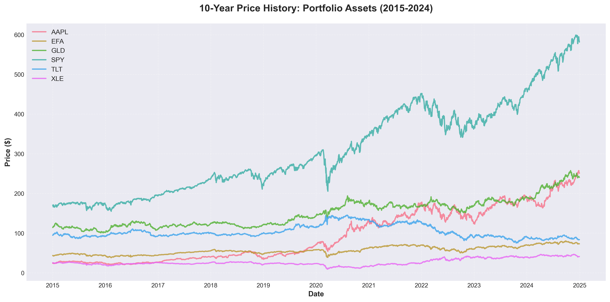
*Figure 1: Normalized price history (base = 100) for all six assets over the 2015-2024 period, allowing direct comparison of cumulative growth across assets with different price scales.*

  <h4>Summary Statistics</h4>
  <p>
    Descriptive statistics were computed across all 2,515 trading days for each asset. Key observations from the
    summary table include wide variation in price ranges (AAPL traded from approximately $27 to over $250, while
    TLT ranged from $82 to $138), confirming the need for normalization when comparing growth trajectories. Standard
    deviations also varied significantly across assets, reflecting their different volatility profiles &mdash; a
    characteristic explored further in Analysis&nbsp;2.
  </p>

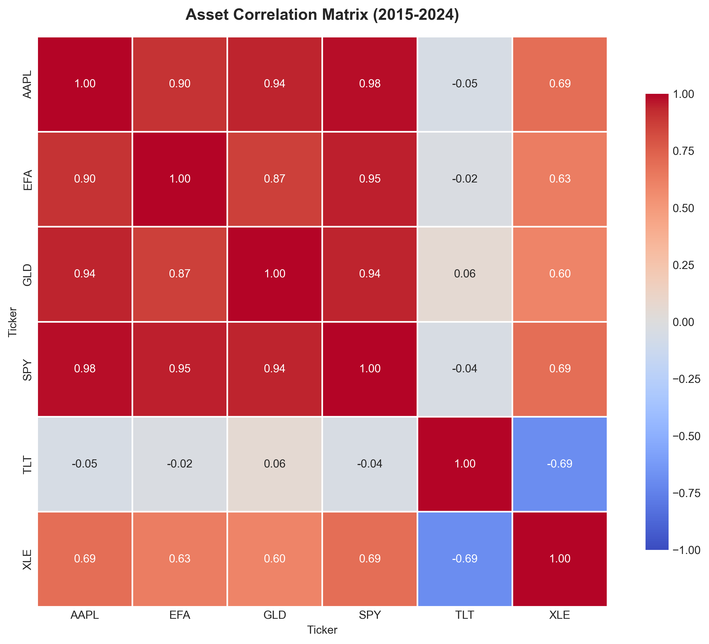
*Figure 2: Pairwise correlation heatmap of daily returns across all six assets, highlighting diversification opportunities where correlations are low or negative.*


  <h3>Key Insights</h3>
  <ul>
    <li><strong>Massive performance divergence:</strong> AAPL gained approximately 935% over the 10-year period, far outpacing SPY at 240%, while TLT (long-term bonds) lost roughly 11% &mdash; highlighting the enormous spread in outcomes across asset classes.</li>
    <li><strong>100% data completeness:</strong> All 2,515 trading days across all six tickers contained valid price data with zero missing values, confirming the reliability of the yfinance API for historical financial data retrieval.</li>
    <li><strong>Bonds as a diversifier:</strong> TLT (20+ Year Treasury Bonds) showed negative correlation with equity assets, confirming its role as a portfolio diversification tool that tends to move inversely to stocks during market stress.</li>
    <li><strong>Equity clustering:</strong> SPY, AAPL, XLE, and EFA exhibited moderate-to-strong positive correlations with each other, indicating that equity assets across sectors and geographies share common risk factors and tend to move together.</li>
    <li><strong>Gold&rsquo;s independence:</strong> GLD displayed low correlation with both equities and bonds, suggesting it provides a distinct return driver that is relatively uncoupled from traditional asset class movements.</li>
    <li><strong>Foundation for deeper analysis:</strong> The clean, complete dataset and initial correlation patterns established a solid basis for the risk metrics, time series decomposition, and forecasting analyses that follow.</li>
  </ul>

</details>

---

<details>
  <summary><strong>Analysis 2 &mdash; Returns &amp; Risk Analysis</strong></summary>

  <div style="margin-top: 12px;"></div>
  <hr style="border: none; border-top: 1px solid #e0e0e0; margin: 12px 0 20px 0;">

  <h3>Methodology</h3>
  <p>
    I converted adjusted close prices into daily percentage returns to create a consistent basis for comparing assets with very different price levels. From those daily returns, I built cumulative return series using a buy-and-hold assumption to show how each investment compounded over the full 2015&ndash;2024 window.
  </p>
  <p>
    I then calculated core risk metrics, including annualized volatility and Sharpe ratio. Annualized volatility captures the magnitude of return fluctuations (total risk), while the Sharpe ratio measures return per unit of risk after subtracting a 2% risk-free baseline. This made it possible to compare not only which asset returned more, but which delivered more efficient risk-adjusted performance.
  </p>
  <p>
    Finally, I evaluated maximum drawdown for each asset to quantify investor pain during market stress. Maximum drawdown represents the worst peak-to-trough decline before recovery, which is critical for understanding downside exposure. This drawdown analysis also highlights crisis periods, including the sharp COVID-19 selloff in March 2020.
  </p>

  <h3>Code</h3>

<pre><code class="language-python"># Calculate daily returns
daily_returns = prices.pct_change().dropna()

# Calculate cumulative returns (buy-and-hold performance)
cumulative_returns = (1 + daily_returns).cumprod()

# Calculate annualized volatility
volatility = daily_returns.std() * np.sqrt(252) * 100

# Calculate Sharpe Ratio (risk-adjusted return)
sharpe_ratio = (annual_return - 2.0) / volatility

# Display final values
print(f"$1 in AAPL became: ${cumulative_returns['AAPL'].iloc[-1]:.2f}")</code></pre>

  <h3>Visualizations</h3>

  <figure style="margin: 0 0 18px 0;">
    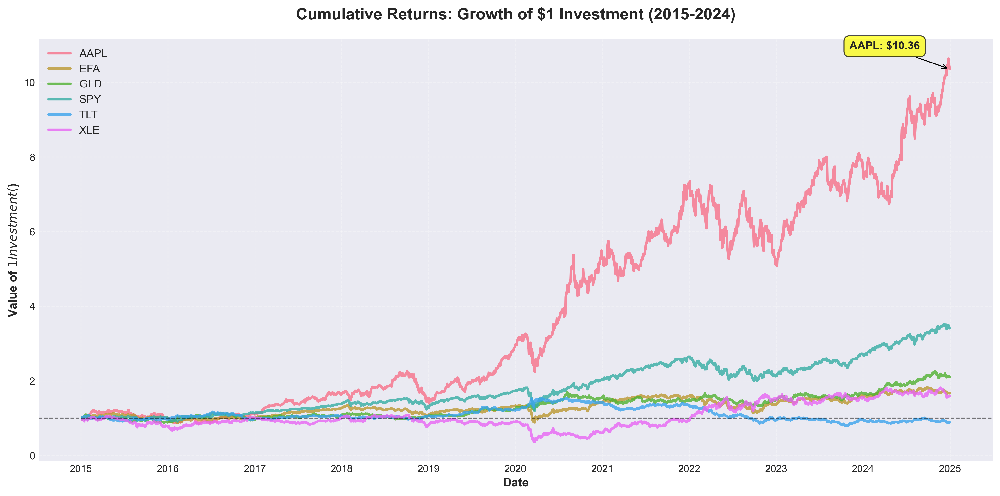
    <figcaption style="font-size: 0.95em; color: #555; margin-top: 6px;">
      Cumulative return trajectories for all six assets, showing that $1 invested in AAPL grew to $10.36 versus $3.41 in SPY over the same period.
      <span style="display:block; margin-top:4px;">
        <a href="./outputs/figures/python_cumulative_returns.png">Open full-size</a>
      </span>
    </figcaption>
  </figure>

  <figure style="margin: 0 0 18px 0;">
    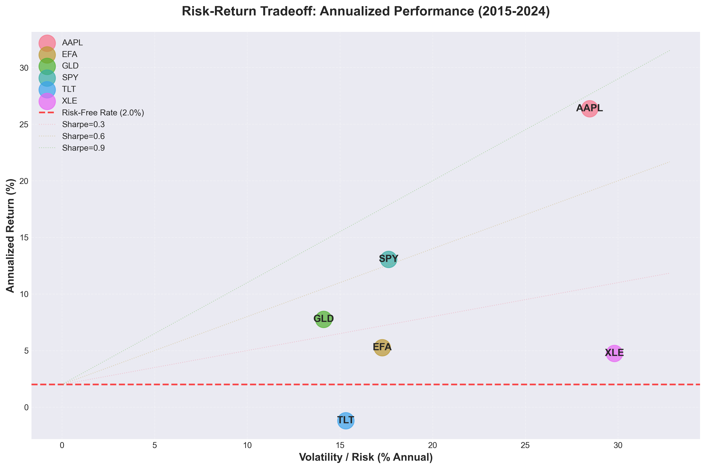
    <figcaption style="font-size: 0.95em; color: #555; margin-top: 6px;">
      Risk-return comparison across assets; higher returns generally came with higher volatility, with AAPL leading on risk-adjusted efficiency via the strongest Sharpe ratio.
      <span style="display:block; margin-top:4px;">
        <a href="./outputs/figures/python_risk_return_scatter.png">Open full-size</a>
      </span>
    </figcaption>
  </figure>

  <figure style="margin: 0 0 18px 0;">
    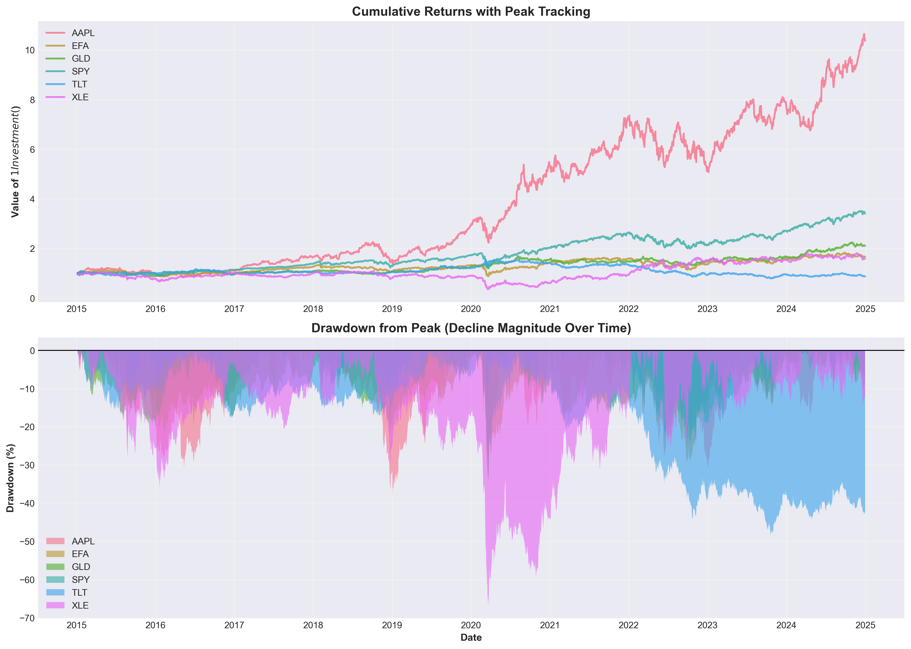
    <figcaption style="font-size: 0.95em; color: #555; margin-top: 6px;">
      Drawdown profiles across the decade, highlighting deep stress episodes such as the March 2020 COVID-19 crash and XLE&rsquo;s worst decline of -66.81%.
      <span style="display:block; margin-top:4px;">
        <a href="./outputs/figures/python_maximum_drawdown.png">Open full-size</a>
      </span>
    </figcaption>
  </figure>

  <h3>Key Insights</h3>
  <ul>
    <li><strong>AAPL delivered the strongest absolute growth:</strong> $1 invested in 2015 compounded to $10.36 by 2024, compared with $3.41 for SPY.</li>
    <li><strong>AAPL also led on risk-adjusted returns:</strong> its Sharpe ratio of 0.856 indicates the highest return per unit of risk among the assets analyzed.</li>
    <li><strong>Risk-return tradeoff was clear:</strong> AAPL posted a higher annual return (26.36%) but also materially higher volatility (28.47%) versus SPY&rsquo;s 13.05% return and 17.62% volatility.</li>
    <li><strong>Maximum drawdown highlighted downside pain:</strong> XLE experienced the deepest peak-to-trough decline at -66.81%, underscoring sector-specific crash risk in energy.</li>
    <li><strong>Systemic stress appeared across all assets in March 2020:</strong> the COVID-19 shock is visible as a synchronized drawdown event in the portfolio.</li>
    <li><strong>Return quality matters as much as return level:</strong> Sharpe ratio analysis helped separate assets that merely rose from those that compensated investors more efficiently for risk taken.</li>
  </ul>

</details>

---

<details>
  <summary><strong>Analysis 3 &mdash; Correlation &amp; Diversification</strong></summary>

  <div style="margin-top: 12px;"></div>
  <hr style="border: none; border-top: 1px solid #e0e0e0; margin: 12px 0 20px 0;">

  <h3>Business Question</h3>
  <p>
    How strongly do the portfolio assets move together, and which combinations actually improve diversification?
    More specifically, this analysis tests whether cross-asset correlations remain stable or shift across market
    regimes &mdash; and what those shifts imply for portfolio risk management.
  </p>

  <h3>Methodology</h3>
  <p>
    To evaluate diversification properly, I used <em>daily returns</em> rather than raw prices. Returns place all
    assets on a comparable scale and capture day-to-day co-movement, which is the relevant input for correlation and
    portfolio risk analysis.
  </p>
  <p>
    I first computed a full-period correlation matrix to provide a static baseline view of how each asset pair behaved
    across 2015&ndash;2024. I then added rolling correlations (60-day and 252-day windows) for key pairs such as SPY-TLT
    and SPY-GLD to show that relationships are dynamic, not fixed, and can change materially across market regimes.
  </p>
  <p>
    Finally, I translated the correlation findings into a simple diversification demonstration by comparing the
    volatility of a concentrated portfolio against a diversified allocation. This illustrates the core portfolio
    principle: combining lower-correlated assets can reduce total risk even when individual assets remain volatile.
  </p>

  <h3>Code</h3>
<pre><code class="language-python"># Load daily return data used in Notebook 3
daily_returns = pd.read_csv(
    "./data/daily_returns_2015_2024.csv",
    index_col=0,
    parse_dates=True
)

# Static correlation view across the full sample
correlation_matrix = daily_returns.corr()

# Rolling correlations to capture regime shifts
rolling_corr_spy_tlt_60 = daily_returns["SPY"].rolling(60).corr(daily_returns["TLT"])
rolling_corr_spy_tlt_252 = daily_returns["SPY"].rolling(252).corr(daily_returns["TLT"])
rolling_corr_spy_gld_60 = daily_returns["SPY"].rolling(60).corr(daily_returns["GLD"])

# Simple concentrated vs diversified risk comparison
concentrated = daily_returns[["SPY"]].mean(axis=1)
diversified = daily_returns[["SPY", "TLT", "GLD"]].mean(axis=1)
vol_compare = pd.Series({
    "Concentrated": concentrated.std() * np.sqrt(252),
    "Diversified": diversified.std() * np.sqrt(252)
})

# Figure exports from Notebook 3
plt.savefig("./outputs/figures/python_correlation_heatmap_detailed.png", dpi=300)
plt.savefig("./outputs/figures/python_rolling_correlations.png", dpi=300)
plt.savefig("./outputs/figures/python_diversification_benefit.png", dpi=300)</code></pre>

  <h3>Visualizations</h3>

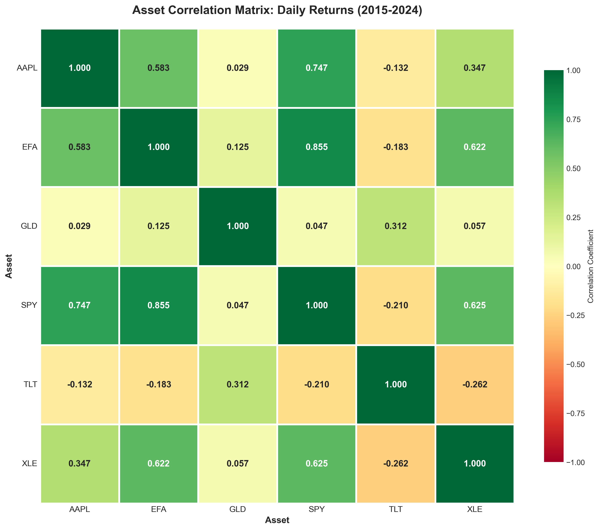
<p><em>Figure 1: Full-period correlations of daily returns across all six assets, providing a static view of cross-asset co-movement and diversification potential.</em></p>

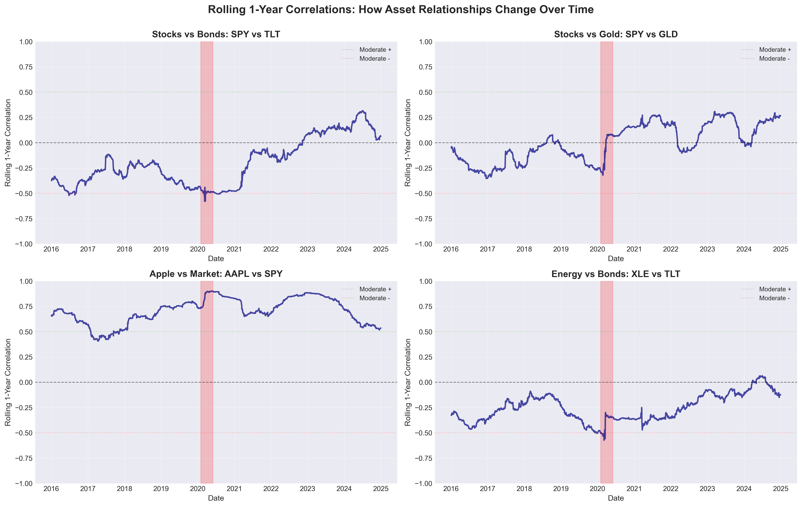
<p><em>Figure 2: Rolling correlation trends for key asset pairs, showing that correlation changes across market regimes and can spike during stress periods.</em></p>

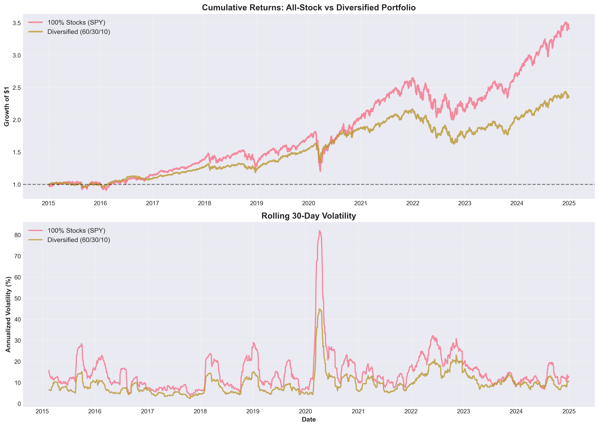
<p><em>Figure 3: Concentrated vs diversified portfolio risk comparison, illustrating how blending lower-correlated assets can reduce overall volatility.</em></p>

  <h3>Key Insights</h3>
  <ul>
    <li><strong>Equity clustering is persistent:</strong> SPY and EFA generally move together, showing that international developed equities are not fully independent from U.S. equity risk.</li>
    <li><strong>Bonds diversify equities:</strong> TLT maintains low to negative correlation with SPY in many periods, supporting its role as a core portfolio stabilizer.</li>
    <li><strong>Gold is a partial diversifier:</strong> GLD typically shows lower and less stable correlation versus equities, adding a distinct return stream rather than equity-like behavior.</li>
    <li><strong>Correlations are regime-dependent:</strong> Rolling windows show that relationships shift over time, which means static assumptions can understate portfolio risk.</li>
    <li><strong>Stress periods weaken diversification:</strong> During market shocks, equity-linked correlations tend to rise, reducing diversification benefits exactly when protection is most needed.</li>
    <li><strong>Diversification lowers volatility:</strong> A blended multi-asset allocation produces smoother return behavior than concentrated equity exposure.</li>
    <li><strong>Risk management requires monitoring:</strong> Correlation should be treated as a dynamic risk input and reviewed continuously, not as a one-time estimate.</li>
  </ul>

  <h3>Business Recommendations</h3>
  <ul>
    <li>Use TLT and GLD as intentional diversifiers rather than adding only equity-like exposures.</li>
    <li>Track rolling correlations in portfolio monitoring to detect diversification breakdowns during stressed markets.</li>
    <li>Avoid assuming EFA provides strong downside insulation versus SPY in crisis regimes.</li>
    <li>Rebalance periodically so target diversification weights are maintained as market moves shift exposures.</li>
    <li>In risk planning, stress-test portfolios under higher-correlation scenarios rather than relying on long-run averages.</li>
  </ul>

</details>

---

<details markdown="1">
  <summary><strong>Analysis 4 &mdash; Time Series Decomposition</strong></summary>

<div markdown="1">

---  Analysis 4 — Time Series Decomposition

* * *

### Business Question
How can we separate long-term market direction from short-term noise in SPY, and how clearly do moving-average regimes and decomposition components reflect major market events such as the COVID crash and the 2022 rate-hike environment?

### Methodology
Moving averages are used as a practical regime filter. The 50-day average reacts faster to recent changes, while the 200-day average captures the broader trend; comparing the two helps identify whether market behavior is strengthening or weakening over time.

Time-series decomposition helps isolate structure in the data. Instead of treating price movement as one signal, decomposition splits it into trend, seasonal, and residual components so we can distinguish persistent direction from transient variation.

This approach also supports structural-break interpretation. In this dataset, key windows to monitor include the abrupt disruption during COVID-19 in 2020 and the choppier repricing period during aggressive rate hikes in 2022.

### Code
<pre><code class="language-python">from statsmodels.tsa.seasonal import seasonal_decompose
from statsmodels.tsa.stattools import adfuller

# 50-day and 200-day moving averages (trend signals)
prices["SPY_MA50"] = prices["SPY"].rolling(50).mean()
prices["SPY_MA200"] = prices["SPY"].rolling(200).mean()

# Time series decomposition (trend/seasonal/residual)
decomp = seasonal_decompose(prices["SPY"].dropna(), model="multiplicative", period=252)

# Stationarity test (returns are typically more stationary than prices)
adf_stat, p_value, *_ = adfuller(daily_returns["SPY"].dropna())
print(f"ADF Statistic: {adf_stat:.3f}, p-value: {p_value:.4f}")

# Export figures (these files exist in outputs/figures)
# python_moving_averages.png
# python_time_series_decomposition.png</code></pre>

### Visualizations
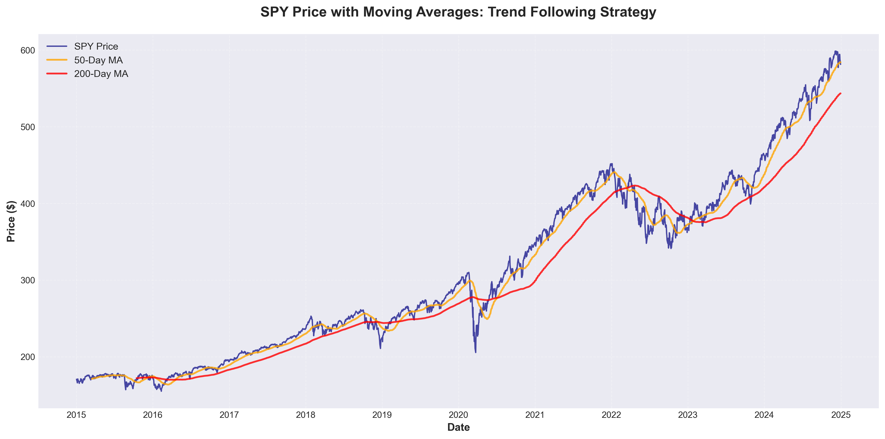
<p><em>Figure 1: SPY price with 50-day and 200-day moving averages highlighting trend direction and crossover signals.</em></p>

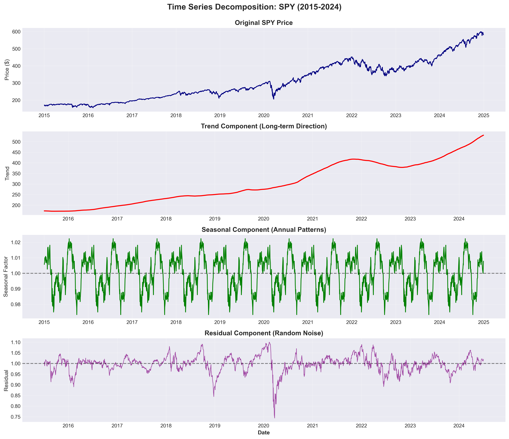
<p><em>Figure 2: Decomposition of SPY into observed, trend, seasonal, and residual components to separate long-term movement from short-term noise.</em></p>

### Key Insights
<ul>
  <li><strong>Trend carries most of the signal:</strong> The decomposition trend component explains the broad multi-year direction more clearly than raw day-to-day price movement.</li>
  <li><strong>Moving averages clarify regimes:</strong> The 50/200-day pair smooths short-term noise and makes regime shifts easier to interpret visually.</li>
  <li><strong>COVID is a clear structural break:</strong> The 2020 shock appears as an abrupt disruption relative to the surrounding trend path.</li>
  <li><strong>2022 reflects a distinct policy regime:</strong> The rate-hike period shows a different market character with choppier behavior and sharper reversals than the prior expansion phase.</li>
  <li><strong>Residuals capture shock behavior:</strong> The residual component concentrates event-driven volatility that is not explained by long-run trend or recurring seasonal structure.</li>
  <li><strong>Crossover signals are useful but lagging:</strong> Moving-average crossovers can support risk monitoring, but they typically confirm transitions after they begin.</li>
</ul>

</div>

</details>

---

<details>
  <summary><strong>Analysis 5 &mdash; Forecasting</strong></summary>

  <div style="margin-top: 12px;"></div>
  <hr style="border: none; border-top: 1px solid #e0e0e0; margin: 12px 0 20px 0;">

---  Analysis 5 — Forecasting

* * *

### Business Question
ARIMA can provide a useful baseline for short-term SPY forecasting, especially as a structured starting point for comparing more advanced models. The core business question is whether a classical statistical model can produce directionally helpful out-of-sample estimates on recent market data.

Forecast quality is evaluated with a realistic time-based train/test split so the model only learns from earlier history and is tested on later periods. Even with this setup, forecasting prices remains difficult because markets experience regime shifts, non-stationarity, and shock events that can quickly invalidate historical relationships.

### Methodology
The analysis uses cleaned daily prices from 2015 to 2024 and focuses on SPY as the benchmark series. To preserve temporal integrity, the dataset is split using an 80/20 time-based approach, where the earlier portion is used for training and the later portion is reserved for testing.

An ARIMA(1,1,1) model is then fit on the training segment of SPY prices. After fitting, the model generates out-of-sample forecasts across the entire test horizon to simulate forward prediction in a production-style setting.

Forecast quality is assessed using MAE, RMSE, and MAPE. MAE and RMSE summarize average and squared error magnitude, while MAPE expresses error relative to price level; together they provide a practical accuracy view, while still requiring caution because financial series are noisy and prone to structural breaks.

### Code
<pre><code class="language-python">import pandas as pd
import numpy as np
import matplotlib.pyplot as plt
from statsmodels.tsa.arima.model import ARIMA
from sklearn.metrics import mean_absolute_error, mean_squared_error

# Load cleaned prices (2015–2024)
prices = pd.read_csv("cleaned_prices_2015_2024.csv", index_col=0, parse_dates=True)
spy_prices = prices["SPY"]

# Time-based train/test split (80/20)
split_point = int(len(spy_prices) * 0.8)
train_data = spy_prices[:split_point]
test_data = spy_prices[split_point:]

# ARIMA(1,1,1) model on training data
model = ARIMA(train_data, order=(1, 1, 1))
fitted_model = model.fit()

# Forecast across the test horizon
predictions = fitted_model.forecast(steps=len(test_data))

# Evaluate forecast accuracy
mae = mean_absolute_error(test_data, predictions)
rmse = np.sqrt(mean_squared_error(test_data, predictions))
mape = np.mean(np.abs((test_data - predictions) / test_data)) * 100

print(f"MAE: ${mae:.2f}")
print(f"RMSE: ${rmse:.2f}")
print(f"MAPE: {mape:.2f}%")

# Figures exported by Notebook 5:
# python_train_test_split.png
# python_arima_predictions.png</code></pre>

### Visualizations
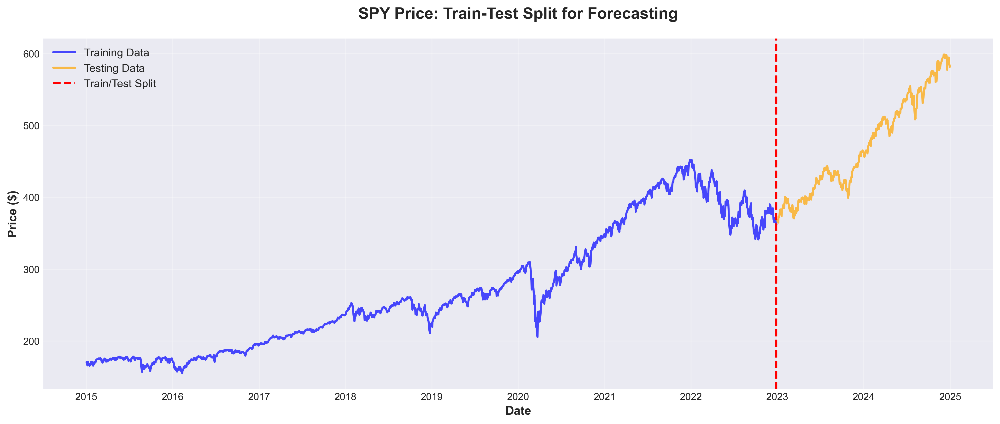
<p><em>Figure 1: Time-based 80/20 train-test split for SPY (train on earlier history, test on later period) to simulate real-world forecasting.</em></p>

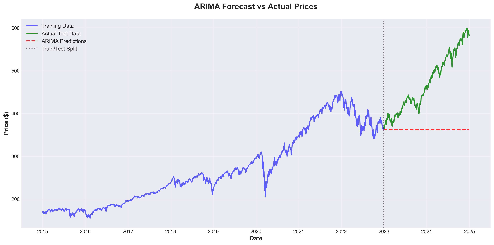
<p><em>Figure 2: ARIMA(1,1,1) out-of-sample forecast versus actual SPY prices on the test set. The split line marks the transition from training to testing.</em></p>

### Key Insights
<ul>
  <li><strong>ARIMA is a practical baseline:</strong> ARIMA(1,1,1) provides a transparent benchmark for short-horizon SPY forecasting and model comparison.</li>
  <li><strong>Price-level forecasting is inherently hard:</strong> Financial markets are noisy and adaptive, which limits the stability of learned time-series patterns.</li>
  <li><strong>Regime shifts weaken generalization:</strong> Model performance can deteriorate when market structure changes between training and test periods.</li>
  <li><strong>Volatility changes increase forecast error:</strong> Sudden expansions in volatility often produce larger misses than calmer market intervals.</li>
  <li><strong>Trend tracking can lag:</strong> Forecasts may follow broad direction at times but can react slowly to sharp accelerations or reversals.</li>
  <li><strong>Error metrics serve different purposes:</strong> MAE and RMSE summarize magnitude error, while MAPE adds a scale-aware perspective for interpretation.</li>
  <li><strong>Uncertainty should be explicit:</strong> Forecast outputs are better treated as probabilistic guidance than deterministic signals in investment workflows.</li>
</ul>

### Business Recommendations
<ul>
  <li>Treat ARIMA as a benchmark and compare it directly against naive baselines such as random walk before adopting more complex models.</li>
  <li>Model returns or volatility, not only raw prices, to improve stationarity and reduce sensitivity to non-constant levels.</li>
  <li>Introduce exogenous drivers (e.g., rates, VIX, macro indicators) to improve regime awareness and contextual forecasting.</li>
  <li>Use rolling or expanding retraining windows so models adapt more quickly to changing market conditions.</li>
  <li>Report prediction intervals and scenario ranges alongside point forecasts to support risk-aware decision-making.</li>
</ul>

</details>

---

<details>
  <summary><strong>Key Findings &amp; Recommendations</strong></summary>

  <div style="margin-top: 12px;"></div>
  <hr style="border: none; border-top: 1px solid #e0e0e0; margin: 12px 0 20px 0;">

  <h3>Major Insights</h3>
  <!-- TODO: Replace placeholder insights with actual summary findings -->
  <ul>
    <li><strong>[TBD]:</strong> Placeholder summary insight about overall portfolio performance across the 10-year period</li>
    <li><strong>[TBD]:</strong> Placeholder summary insight about risk-return tradeoffs and the most efficient assets</li>
    <li><strong>[TBD]:</strong> Placeholder summary insight about diversification effectiveness and correlation dynamics</li>
    <li><strong>[TBD]:</strong> Placeholder summary insight about time series patterns and regime behavior</li>
    <li><strong>[TBD]:</strong> Placeholder summary insight about forecasting model performance and limitations</li>
  </ul>

  <h3>Portfolio Recommendations</h3>
  <!-- TODO: Replace placeholder recommendations with actual data-driven recommendations -->
  <ul>
    <li><strong>[TBD]:</strong> Placeholder recommendation about optimal asset allocation based on risk-return analysis</li>
    <li><strong>[TBD]:</strong> Placeholder recommendation about diversification strategy using correlation insights</li>
    <li><strong>[TBD]:</strong> Placeholder recommendation about rebalancing approach based on regime analysis</li>
    <li><strong>[TBD]:</strong> Placeholder recommendation about risk management using drawdown and VaR metrics</li>
  </ul>

  <h3>Business Value</h3>
  <!-- TODO: Replace placeholder text with actual business value statement -->
  <p>
    This analysis demonstrates how Python-based quantitative methods can support portfolio evaluation and
    risk management decisions. The combination of exploratory analysis, statistical modeling, and machine
    learning provides a comprehensive toolkit for data-driven investment insights.
  </p>

  <h3>Disclaimer</h3>
  <p>
    <em>This project is for educational and portfolio demonstration purposes only. It does not constitute
    financial advice, investment recommendations, or trading signals. Past performance does not guarantee
    future results. Always consult a qualified financial advisor before making investment decisions.</em>
  </p>

</details>

---

<details>
  <summary><strong>Technical Details</strong></summary>

  <div style="margin-top: 12px;"></div>
  <hr style="border: none; border-top: 1px solid #e0e0e0; margin: 12px 0 20px 0;">

  <h3>Libraries Used</h3>
  <!-- TODO: Update versions after project completion -->
  <ul>
    <li><strong>Python 3.10+</strong></li>
    <li><strong>pandas</strong> &mdash; data manipulation and analysis</li>
    <li><strong>NumPy</strong> &mdash; numerical computing</li>
    <li><strong>yfinance</strong> &mdash; Yahoo Finance API for market data retrieval</li>
    <li><strong>matplotlib</strong> &mdash; static data visualization</li>
    <li><strong>seaborn</strong> &mdash; statistical data visualization</li>
    <li><strong>statsmodels</strong> &mdash; time series analysis, decomposition, ARIMA, statistical tests</li>
    <li><strong>SciPy</strong> &mdash; scientific computing and statistical functions</li>
    <li><strong>scikit-learn</strong> &mdash; machine learning models and evaluation metrics</li>
    <li><strong>Jupyter Notebook</strong> &mdash; interactive analysis environment</li>
  </ul>

  <h3>How to Reproduce</h3>
  <!-- TODO: Update reproduction steps after project completion -->
  <ol>
    <li>Clone the repository: <code>git clone https://github.com/nadeaujonny/nadeaujonny.github.io.git</code></li>
    <li>Navigate to the project: <code>cd projects/python-financial-analysis</code></li>
    <li>Install dependencies: <code>pip install -r requirements.txt</code></li>
    <li>Run the notebooks in order (01 through 05) in Jupyter</li>
    <li>Charts and outputs will be saved to the <code>outputs/</code> directory</li>
  </ol>

  <h3>Project Structure</h3>
  <!-- TODO: Update project structure after completion -->
  <pre><code>python-financial-analysis/
├── index.md                  # This project page
├── requirements.txt          # Python dependencies
├── README.md                 # Project README
├── data/                     # Data directory (API-sourced, not committed)
├── notebooks/                # Jupyter notebooks (01-05)
│   ├── 01_data_acquisition_eda.ipynb
│   ├── 02_returns_risk_metrics.ipynb
│   ├── 03_correlation_diversification.ipynb
│   ├── 04_time_series_decomposition.ipynb
│   └── 05_forecasting.ipynb
├── images/                   # Charts and visualizations
└── outputs/                  # Generated outputs and exports
</code></pre>

  <h3>Contact</h3>
  <!-- TODO: Update LinkedIn link -->
  <p>
    <a href="https://www.linkedin.com/in/nadeaujonny/" target="_blank" rel="noopener">Connect on LinkedIn &rarr;</a>
  </p>

</details>
