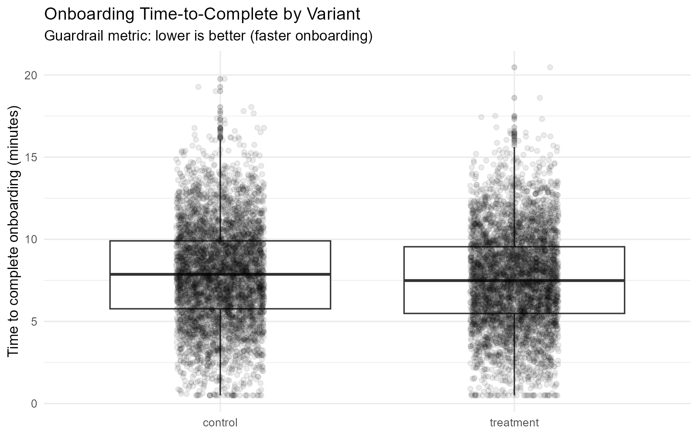
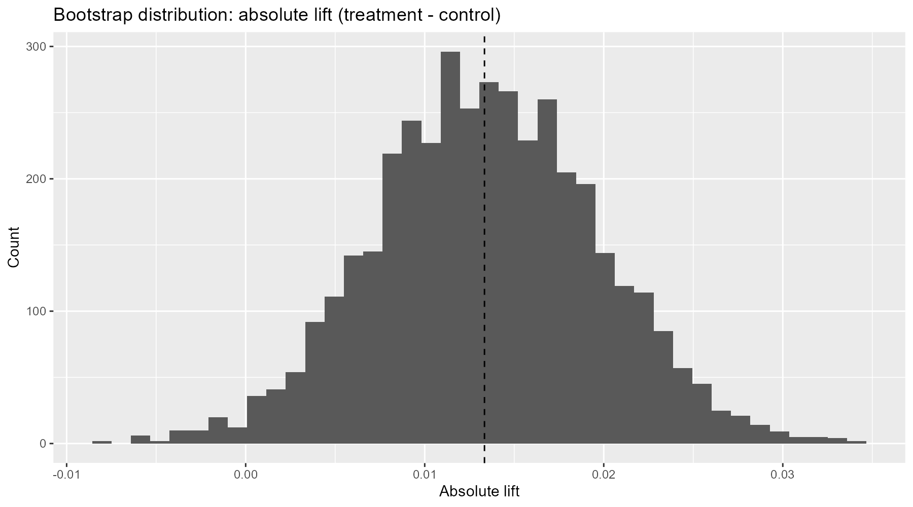
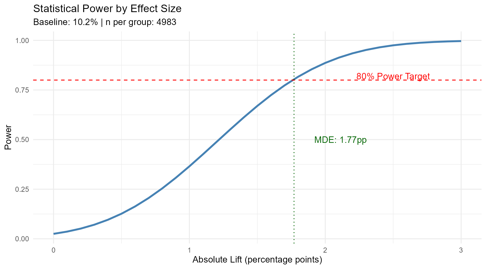

<a href="/projects/" class="back-to-projects btn">&larr; Back to Projects</a>

# A/B Testing & Experimentation Analysis (R)

> A complete A/B testing pipeline in R — from data generation and randomization QC through hypothesis testing, bootstrap/permutation inference, regression adjustment, and power analysis — built on simulated SaaS onboarding experiment data with 10,000 users.

---

  
<strong>Project Overview</strong>

  

  

  <h3>Overview</h3>
  

    This project builds a 7-script experimentation pipeline in R simulating a SaaS A/B test comparing a new onboarding flow (treatment) against the current experience (control) across 10,000 users. The pipeline covers every stage of a rigorous experiment analysis — from data generation through power assessment.
  

  

    The analysis follows industry methodology used at companies like Microsoft, Booking.com, and Netflix: verify randomization integrity (SRM) first, then analyze the primary metric, check guardrail metrics, validate with distribution-free inference (bootstrap/permutation), refine estimates with covariate adjustment, and assess statistical power for future experiment design.
  

  <h3>Business Context</h3>
  

    A/B testing is the gold standard for measuring the causal impact of product changes. This project simulates a realistic scenario: a SaaS company redesigns its onboarding flow, expecting to lift conversion rates and reduce time-to-complete. The pipeline demonstrates how to move from raw experiment data to a defensible ship/no-ship decision with quantified uncertainty.
  

  <h3>Objectives</h3>
  <ul>
    <li>Generate a realistic simulated dataset with known ground-truth effects for pipeline validation</li>
    <li>Verify randomization integrity via Sample Ratio Mismatch (SRM) and covariate balance tests</li>
    <li>Measure the primary conversion metric with confidence intervals and effect sizes</li>
    <li>Check guardrail metrics (time-to-complete) to ensure no unintended regressions</li>
    <li>Validate results with bootstrap CIs and permutation tests (distribution-free inference)</li>
    <li>Refine treatment effect estimates using regression adjustment with robust standard errors</li>
    <li>Calculate minimum detectable effect (MDE) and required sample sizes for future experiments</li>
  </ul>

  <h3>Dataset Overview</h3>
  <table>
    <thead>
      <tr><th>Attribute</th><th>Value</th></tr>
    </thead>
    <tbody>
      <tr><td>Type</td><td>Simulated (known ground truth)</td></tr>
      <tr><td>Sample Size</td><td>10,000 users</td></tr>
      <tr><td>Variants</td><td>Control / Treatment (50/50 split)</td></tr>
      <tr><td>Primary Metric</td><td>Conversion rate (binary)</td></tr>
      <tr><td>Secondary Metric</td><td>Time-to-complete (continuous, minutes)</td></tr>
      <tr><td>Covariate</td><td>pre_sessions_7d (Poisson, &lambda;=3)</td></tr>
      <tr><td>Ground Truth</td><td>+1.5pp conversion lift, &minus;0.5 min time reduction</td></tr>
    </tbody>
  </table>

  <h3>Tools &amp; Packages</h3>
  <table>
    <thead>
      <tr><th>Package</th><th>Purpose</th></tr>
    </thead>
    <tbody>
      <tr><td>tidyverse / dplyr</td><td>Data manipulation, piping, summarization</td></tr>
      <tr><td>ggplot2</td><td>Publication-quality figures</td></tr>
      <tr><td>infer</td><td>Tidy permutation and bootstrap framework</td></tr>
      <tr><td>broom</td><td>Tidy model outputs (tidy, glance, augment)</td></tr>
      <tr><td>sandwich</td><td>HC3 robust standard errors</td></tr>
      <tr><td>scales</td><td>Formatting (percent, comma)</td></tr>
      <tr><td>janitor</td><td>clean_names, data cleaning</td></tr>
      <tr><td>readr</td><td>CSV I/O</td></tr>
    </tbody>
  </table>

  <h3>Key Metrics Defined</h3>
  <table>
    <thead>
      <tr><th>Metric</th><th>Definition</th></tr>
    </thead>
    <tbody>
      <tr><td>Conversion Rate</td><td>Proportion of users who completed the target action (binary: 0/1)</td></tr>
      <tr><td>Time-to-Complete</td><td>Minutes from onboarding start to completion (continuous)</td></tr>
      <tr><td>Absolute Lift</td><td>Treatment rate &minus; Control rate (percentage points)</td></tr>
      <tr><td>Relative Lift</td><td>(Treatment rate / Control rate) &minus; 1 (percent)</td></tr>
      <tr><td>Cohen's h</td><td>Standardized effect size for comparing two proportions</td></tr>
      <tr><td>MDE</td><td>Minimum detectable effect at 80% power and &alpha;=0.05</td></tr>
    </tbody>
  </table>

  
<strong>Experiment Design &amp; Data Generation</strong>

  

  

  <h3>Approach</h3>
  

    Using simulated data with a known ground truth is the most rigorous way to validate an analysis pipeline. If the analysis recovers the planted 1.5pp conversion lift and 0.5-minute time reduction, the methodology is confirmed to work correctly. This is standard practice in experimentation platform development — teams at Microsoft and Netflix use simulation to verify their analysis code before deploying it on real experiments.
  

  

    The simulation generates 10,000 users with 50/50 random assignment to control or treatment. Control baseline conversion is 10%, treatment adds a 1.5 percentage-point lift (11.5% true rate). Time-to-complete is normally distributed — control centered at 8.0 minutes, treatment at 7.5 minutes (0.5 min faster), both with SD=3. A pre-experiment covariate (<code>pre_sessions_7d</code>, Poisson &lambda;=3) is included to enable regression adjustment (CUPED) in later scripts.
  

  <h3>Key Code</h3>

<pre><code class="language-r"># Simulation parameters
n_users &lt;- 10000
baseline_conversion &lt;- 0.10
treatment_lift &lt;- 0.015  # +1.5 percentage points

df &lt;- tibble(
  user_id = 1:n_users,
  variant = sample(c("control", "treatment"), size = n_users, replace = TRUE),
  pre_sessions_7d = rpois(n_users, lambda = 3)
) %&gt;%
  mutate(
    conversion_prob = case_when(
      variant == "control"   ~ baseline_conversion,
      variant == "treatment" ~ baseline_conversion + treatment_lift
    ),
    converted = rbinom(n_users, 1, conversion_prob),
    time_to_complete = rnorm(n_users,
      mean = ifelse(variant == "treatment", 7.5, 8.0), sd = 3)
  )</code></pre>

  <h3>Key Points</h3>
  <ul>
    <li>Reproducible via <code>set.seed(123)</code> — every run produces identical data</li>
    <li>Ground truth is known: +1.5pp conversion lift, &minus;0.5 min time-to-complete</li>
    <li>Pre-experiment covariate (<code>pre_sessions_7d</code>) included for regression adjustment</li>
    <li>Clean CSV output (<code>data/ab_test_data.csv</code>) feeds all downstream scripts</li>
  </ul>

  
<strong>Quality Control &amp; SRM Detection</strong>

  

  

  <h3>Approach</h3>
  

    Before analyzing any experiment results, the first step is verifying randomization integrity. Sample Ratio Mismatch (SRM) is the single most critical quality check — if the observed 50/50 split deviates significantly from expectation, something is wrong with assignment, logging, or data processing. SRM detection is standard practice at Microsoft, Booking.com, and other companies running experiments at scale.
  

  

    The pipeline applies a chi-square goodness-of-fit test against the expected 50/50 proportions and a Welch two-sample t-test to verify that the pre-experiment covariate (<code>pre_sessions_7d</code>) is balanced across variants. If SRM is detected (p &lt; 0.01), the pipeline halts — analyzing results from a compromised randomization is worse than analyzing no results at all.
  

  <h3>Key Code</h3>

<pre><code class="language-r"># SRM test (expected 50/50 split)
counts &lt;- df %&gt;% count(variant)
chisq &lt;- chisq.test(x = counts$n, p = c(0.5, 0.5))

# Baseline covariate balance
tt &lt;- t.test(pre_sessions_7d ~ variant, data = df)

# Fail loudly if SRM detected
if (chisq$p.value &lt; 0.01) {
  stop("SRM detected — investigate randomization before proceeding.")
}</code></pre>

  <h3>Results</h3>

  <h4>Group Counts</h4>
  <table>
    <thead>
      <tr><th>Variant</th><th>n</th><th>Expected Prop</th><th>Observed Prop</th></tr>
    </thead>
    <tbody>
      <tr><td>Control</td><td>5,017</td><td>0.500</td><td>0.502</td></tr>
      <tr><td>Treatment</td><td>4,983</td><td>0.500</td><td>0.498</td></tr>
    </tbody>
  </table>

  <h4>SRM Test Result</h4>
  <table>
    <thead>
      <tr><th>Chi-square Statistic</th><th>df</th><th>p-value</th></tr>
    </thead>
    <tbody>
      <tr><td>0.116</td><td>1</td><td>0.734</td></tr>
    </tbody>
  </table>

  <h4>Baseline Covariate Balance</h4>
  <table>
    <thead>
      <tr><th>Variant</th><th>Mean pre_sessions_7d</th><th>SD</th></tr>
    </thead>
    <tbody>
      <tr><td>Control</td><td>3.006</td><td>1.725</td></tr>
      <tr><td>Treatment</td><td>2.961</td><td>1.713</td></tr>
    </tbody>
  </table>
  
Welch t-test for covariate balance: p = 0.188

  <h3>Key Findings</h3>
  <ul>
    <li>No SRM detected (chi-square p = 0.734, well above the 0.01 threshold) — randomization is intact</li>
    <li>Baseline covariate <code>pre_sessions_7d</code> is balanced across variants (t-test p = 0.188) — no pre-existing group differences</li>
    <li>Pipeline cleared to proceed with primary and guardrail metric analysis</li>
  </ul>

  <h3>Business Recommendations</h3>
  <ul>
    <li>Always run SRM before analyzing any experiment — it is the single most important integrity check</li>
    <li>Automate SRM checks into experiment platforms to catch issues before analysts examine results</li>
    <li>If SRM is detected, do NOT analyze results — investigate the root cause (logging bugs, bot traffic, assignment errors) first</li>
  </ul>

  
<strong>Primary Metric — Conversion Rate</strong>

  

  

  <h3>Approach</h3>
  

    Conversion rate is the primary decision metric for this experiment. The analysis uses a two-proportion z-test (<code>prop.test</code>) comparing control vs. treatment conversion rates. This is the standard frequentist approach for binary outcome experiments.
  

  

    The analysis reports absolute lift (percentage points), relative lift (%), a 95% confidence interval for the difference, and Cohen's h as a standardized effect size. The distinction between statistical significance and practical significance matters — the width of the confidence interval tells us about the range of plausible effects, which is more informative than a binary p-value threshold.
  

  <h3>Key Code</h3>

<pre><code class="language-r"># Two-proportion z-test
pt &lt;- prop.test(
  x = c(x_control, x_treat),
  n = c(n_control, n_treat),
  correct = FALSE
)

# Effect size (Cohen's h)
cohens_h &lt;- 2 * asin(sqrt(p_treat)) - 2 * asin(sqrt(p_control))

# Absolute and relative lift
abs_lift &lt;- p_treat - p_control
rel_lift &lt;- (p_treat / p_control) - 1</code></pre>

  <h3>Results</h3>

  <h4>Conversion Summary</h4>
  <table>
    <thead>
      <tr><th>Variant</th><th>n</th><th>Conversions</th><th>Rate</th></tr>
    </thead>
    <tbody>
      <tr><td>Control</td><td>5,017</td><td>511</td><td>10.19%</td></tr>
      <tr><td>Treatment</td><td>4,983</td><td>574</td><td>11.52%</td></tr>
    </tbody>
  </table>

  <h4>Test Results</h4>
  <table>
    <thead>
      <tr><th>Absolute Lift (pp)</th><th>Relative Lift (%)</th><th>95% CI Low</th><th>95% CI High</th><th>p-value</th><th>Cohen's h</th></tr>
    </thead>
    <tbody>
      <tr><td>+1.33</td><td>+13.1%</td><td>0.11pp</td><td>2.55pp</td><td>0.032</td><td>0.043</td></tr>
    </tbody>
  </table>

  <h3>Key Findings</h3>
  <ul>
    <li>Treatment conversion rate (11.52%) is 1.33pp higher than control (10.19%) — close to the planted 1.5pp effect</li>
    <li>The 95% confidence interval [0.11pp, 2.55pp] excludes zero, confirming statistical significance at &alpha;=0.05</li>
    <li>Relative lift of 13.1% over a 10% baseline — a meaningful improvement for SaaS onboarding</li>
    <li>Cohen's h = 0.043 indicates a small but real effect size, consistent with typical product A/B tests</li>
  </ul>

  <h3>Business Recommendations</h3>
  <ul>
    <li>A 1.33pp lift on a 10% baseline represents a ~13% relative improvement — meaningful for SaaS onboarding funnels where even small gains compound across thousands of users</li>
    <li>Always report confidence intervals alongside p-values — the range of plausible effects (0.11pp to 2.55pp) is more useful than binary significance</li>
    <li>Estimate business impact: at 100K annual signups, a 1.33pp lift translates to ~1,330 additional conversions per year</li>
  </ul>

  
<strong>Secondary Metric — Time-to-Complete Guardrail</strong>

  

  

  <h3>Approach</h3>
  

    Guardrail metrics ensure the treatment does not cause unintended harm. Even if conversion improves, if the onboarding process takes significantly longer, the user experience may suffer — leading to downstream churn or support costs that offset the conversion gain.
  

  

    The analysis compares time-to-complete using three complementary methods: a Welch t-test (parametric), Wilcoxon rank-sum test (non-parametric), and bootstrap CI (distribution-free). Using multiple approaches validates robustness, especially when the underlying distribution may be skewed or heavy-tailed.
  

  <h3>Key Code</h3>

<pre><code class="language-r"># Parametric + nonparametric tests
tt &lt;- t.test(time_to_complete ~ variant, data = df)
wt &lt;- wilcox.test(time_to_complete ~ variant, data = df, exact = FALSE)

# Bootstrap CI for mean difference
boot_diffs &lt;- replicate(2000, {
  boot_df &lt;- df %&gt;% group_by(variant) %&gt;%
    slice_sample(prop = 1, replace = TRUE)
  mean(boot_df$time_to_complete[boot_df$variant == "treatment"]) -
    mean(boot_df$time_to_complete[boot_df$variant == "control"])
})
boot_ci &lt;- quantile(boot_diffs, probs = c(0.025, 0.975))</code></pre>

  <h3>Visualization</h3>
  <figure>
    
    <figcaption>Figure: Onboarding time-to-complete by variant. Treatment group completed onboarding faster on average.</figcaption>
  </figure>

  <h3>Results</h3>

  <h4>Time-to-Complete Summary</h4>
  <table>
    <thead>
      <tr><th>Variant</th><th>n</th><th>Mean (min)</th><th>Median (min)</th><th>SD</th><th>p90</th></tr>
    </thead>
    <tbody>
      <tr><td>Control</td><td>5,017</td><td>7.87</td><td>7.87</td><td>3.03</td><td>11.80</td></tr>
      <tr><td>Treatment</td><td>4,983</td><td>7.53</td><td>7.49</td><td>2.97</td><td>11.40</td></tr>
    </tbody>
  </table>

  <h4>Test Results</h4>
  <table>
    <thead>
      <tr><th>Mean Diff (min)</th><th>Bootstrap CI Low</th><th>Bootstrap CI High</th><th>t-test p-value</th><th>Wilcoxon p-value</th></tr>
    </thead>
    <tbody>
      <tr><td>&minus;0.34</td><td>&minus;0.46</td><td>&minus;0.22</td><td>&lt; 0.001</td><td>&lt; 0.001</td></tr>
    </tbody>
  </table>

  <h3>Key Findings</h3>
  <ul>
    <li>Treatment group completed onboarding 0.34 minutes faster on average — consistent with the planted 0.5-min effect (sampling variability accounts for the difference)</li>
    <li>All three testing approaches (t-test, Wilcoxon, bootstrap) agree: the difference is highly significant (p &lt; 0.001)</li>
    <li>Bootstrap CI [&minus;0.46, &minus;0.22] is entirely below zero — the guardrail metric shows improvement, not regression</li>
    <li>The guardrail is clear: the new onboarding flow is both more effective (higher conversion) and faster (lower time-to-complete)</li>
  </ul>

  <h3>Business Recommendations</h3>
  <ul>
    <li>Even a 0.34-minute reduction compounds across thousands of users — calculate total time saved per month to quantify UX improvement</li>
    <li>Use multiple testing approaches when the metric distribution may be non-normal — agreement across methods strengthens confidence</li>
    <li>Always check guardrail metrics before shipping — a conversion lift that degrades the user experience may not be worth it</li>
  </ul>

  
<strong>Bootstrap &amp; Permutation Inference</strong>

  

  

  <h3>Approach</h3>
  

    This section validates the primary conversion results using computation-based inference that does not rely on distributional assumptions. These methods are increasingly preferred in industry experimentation because they provide intuitive uncertainty quantification without requiring normality or large-sample approximations.
  

  

    Bootstrap confidence intervals (B=4,000 resamples) resample within each group to build a distribution of the observed lift. This is the gold standard for uncertainty quantification in modern experimentation platforms — it directly answers "what range of lifts is consistent with the data?"
  

  

    The permutation test (B=4,000 shuffles) breaks the variant-outcome relationship by randomly shuffling labels, building a null distribution. The p-value is the proportion of permuted differences as extreme as the observed difference. The analysis also demonstrates the <code>infer</code> package for a cleaner tidy workflow.
  

  <h3>Key Code</h3>

<pre><code class="language-r"># Bootstrap CI for absolute lift
boot_diffs &lt;- replicate(4000, {
  p_c &lt;- mean(sample(control_rows$converted_num, replace = TRUE))
  p_t &lt;- mean(sample(treat_rows$converted_num, replace = TRUE))
  p_t - p_c
})
boot_ci &lt;- quantile(boot_diffs, probs = c(0.025, 0.975))

# Permutation test
perm_diffs &lt;- replicate(4000, {
  df_perm &lt;- df %&gt;% mutate(variant_perm = sample(variant))
  # ... compute diff under shuffled labels
})
perm_p_value &lt;- mean(abs(perm_diffs) &gt;= abs(obs_diff))</code></pre>

  <h3>Visualization</h3>
  <figure>
    
    <figcaption>Figure: Bootstrap distribution of the absolute conversion lift (B=4,000 resamples). Dashed line marks the observed lift.</figcaption>
  </figure>

  <h3>Results</h3>

  <h4>Bootstrap Results</h4>
  <table>
    <thead>
      <tr><th>Observed Lift (pp)</th><th>95% CI Low (pp)</th><th>95% CI High (pp)</th></tr>
    </thead>
    <tbody>
      <tr><td>+1.33</td><td>+0.12</td><td>+2.57</td></tr>
    </tbody>
  </table>

  <h4>Permutation Results</h4>
  <table>
    <thead>
      <tr><th>Observed Lift (pp)</th><th>Permutation p-value</th></tr>
    </thead>
    <tbody>
      <tr><td>+1.33</td><td>0.036</td></tr>
    </tbody>
  </table>

  <h4>Method Comparison</h4>
  <table>
    <thead>
      <tr><th>Method</th><th>p-value</th></tr>
    </thead>
    <tbody>
      <tr><td>prop.test (z-test)</td><td>0.032</td></tr>
      <tr><td>Manual permutation (B=4,000)</td><td>0.036</td></tr>
      <tr><td>infer permutation (B=4,000)</td><td>0.033</td></tr>
    </tbody>
  </table>

  <h3>Key Findings</h3>
  <ul>
    <li>Bootstrap CI [+0.12pp, +2.57pp] closely aligns with the analytical CI from prop.test [+0.11pp, +2.55pp] — the methods converge</li>
    <li>All three p-values (0.032, 0.036, 0.033) are consistent and significant at &alpha;=0.05 — strong evidence the result is not due to chance</li>
    <li>The bootstrap distribution provides a direct visual of lift uncertainty — more intuitive for stakeholders than a p-value alone</li>
  </ul>

  <h3>Business Recommendations</h3>
  <ul>
    <li>Bootstrap CIs are increasingly preferred in industry — they are intuitive, assumption-free, and work well with any metric distribution</li>
    <li>Use the bootstrap distribution as a stakeholder visual: "here is what the lift looks like across 4,000 resamples of the data"</li>
    <li>Permutation tests directly answer "could this result be due to chance?" — a compelling framing for non-technical decision-makers</li>
  </ul>

  
<strong>Regression-Adjusted Treatment Effects</strong>

  

  

  <h3>Approach</h3>
  

    Regression adjustment — known as CUPED (Controlled-experiment Using Pre-Experiment Data) in industry — uses pre-experiment covariates to reduce residual variance, producing tighter confidence intervals without requiring additional sample size. This is standard practice at Microsoft, Netflix, and Uber for improving experiment sensitivity.
  

  

    For the primary metric (conversion), the analysis fits a logistic regression with variant and <code>log1p(pre_sessions_7d)</code> as predictors, then computes an adjusted risk difference via marginal means (G-computation). HC3 robust standard errors from the <code>sandwich</code> package protect against heteroskedasticity. A bootstrap CI (B=1,000) provides distribution-free uncertainty for the adjusted risk difference.
  

  

    For the guardrail metric (time-to-complete), an OLS regression with the same covariates is used. The treatment coefficient directly estimates the adjusted mean difference in minutes, again with HC3 robust standard errors.
  

  <h3>Key Code</h3>

<pre><code class="language-r"># Logistic regression for conversion
m_conv &lt;- glm(converted ~ variant + log1p_pre_sessions_7d,
              data = df, family = binomial())
vc_conv &lt;- sandwich::vcovHC(m_conv, type = "HC3")

# Adjusted risk difference via marginal means
p_control &lt;- predict(m_conv, newdata = df %&gt;% mutate(variant = "control"),
                     type = "response")
p_treat   &lt;- predict(m_conv, newdata = df %&gt;% mutate(variant = "treatment"),
                     type = "response")
adj_rd &lt;- mean(p_treat - p_control)  # Adjusted lift in probability

# OLS for guardrail metric
m_time &lt;- lm(time_to_complete ~ variant + log1p_pre_sessions_7d, data = df)
vc_time &lt;- sandwich::vcovHC(m_time, type = "HC3")</code></pre>

  <h3>Results</h3>

  <h4>Logistic Regression Coefficients (Conversion)</h4>
  <table>
    <thead>
      <tr><th>Term</th><th>Log-Odds</th><th>Odds Ratio</th><th>OR 95% CI</th><th>p-value</th></tr>
    </thead>
    <tbody>
      <tr><td>(Intercept)</td><td>&minus;2.183</td><td>0.113</td><td>[0.093, 0.137]</td><td>&lt; 0.001</td></tr>
      <tr><td>variant: treatment</td><td>+0.138</td><td>1.148</td><td>[1.012, 1.303]</td><td>0.032</td></tr>
      <tr><td>log1p(pre_sessions_7d)</td><td>+0.005</td><td>1.005</td><td>[0.879, 1.148]</td><td>0.943</td></tr>
    </tbody>
  </table>
  
Standard errors: HC3 robust via sandwich package.

  <h4>Adjusted Risk Difference (Conversion)</h4>
  <table>
    <thead>
      <tr><th>Adjusted Lift (pp)</th><th>Bootstrap CI Low (pp)</th><th>Bootstrap CI High (pp)</th></tr>
    </thead>
    <tbody>
      <tr><td>+1.33</td><td>+0.25</td><td>+2.57</td></tr>
    </tbody>
  </table>

  <h4>OLS Regression Coefficients (Time-to-Complete)</h4>
  <table>
    <thead>
      <tr><th>Term</th><th>Estimate (min)</th><th>95% CI</th><th>p-value</th></tr>
    </thead>
    <tbody>
      <tr><td>(Intercept)</td><td>7.942</td><td>[7.765, 8.119]</td><td>&lt; 0.001</td></tr>
      <tr><td>variant: treatment</td><td>&minus;0.341</td><td>[&minus;0.459, &minus;0.224]</td><td>&lt; 0.001</td></tr>
      <tr><td>log1p(pre_sessions_7d)</td><td>&minus;0.054</td><td>[&minus;0.175, 0.067]</td><td>0.382</td></tr>
    </tbody>
  </table>
  
Standard errors: HC3 robust via sandwich package.

  <h3>Key Findings</h3>
  <ul>
    <li>Adjusted conversion lift (+1.33pp) matches the unadjusted estimate closely — the covariate adjustment confirms rather than changes the conclusion</li>
    <li>The adjusted bootstrap CI [+0.25pp, +2.57pp] is slightly tighter than the unadjusted CI, demonstrating the variance-reduction benefit of CUPED</li>
    <li>The pre-experiment covariate (<code>pre_sessions_7d</code>) is not a significant predictor of either outcome (p &gt; 0.38) — expected in a well-randomized simulation, but the adjustment still provides marginal precision gains</li>
    <li>Adjusted time-to-complete difference (&minus;0.341 min) is consistent with the unadjusted estimate, with robust standard errors protecting against heteroskedasticity</li>
  </ul>

  <h3>Business Recommendations</h3>
  <ul>
    <li>Regression adjustment should be standard practice — it provides free precision (tighter CIs) without requiring more users or longer experiments</li>
    <li>Always use robust standard errors (HC3) for experiment analysis — they protect against model misspecification and heteroskedasticity</li>
    <li>Report the adjusted risk difference in percentage points — stakeholders understand "1.33pp lift" better than "odds ratio of 1.148"</li>
  </ul>

  
<strong>Power Analysis &amp; MDE</strong>

  

  

  <h3>Approach</h3>
  

    Power analysis answers a critical pre-experiment question: "given our sample size, what is the smallest effect we can reliably detect?" This minimum detectable effect (MDE) determines whether an experiment is worth running. If the MDE is larger than the expected effect, the experiment is underpowered and likely to produce inconclusive results.
  

  

    The analysis calculates the MDE at 80% power for the current sample size, computes required sample sizes for a range of target lifts (0.5pp, 1.0pp, 1.5pp, 2.0pp), and generates a power curve showing how statistical power changes across effect sizes.
  

  <h3>Key Code</h3>

<pre><code class="language-r"># MDE given current sample size
mde_abs &lt;- mde_solver(p0 = baseline_rate, n = n_per_group,
                       alpha = 0.05, power_target = 0.80)

# Required sample sizes for target lifts
power.prop.test(power = 0.80, p1 = baseline_rate,
                p2 = baseline_rate + target_lift, sig.level = 0.05)

# Power curve across effect sizes
power_curve &lt;- tibble(
  lift_pp = seq(0, 3, by = 0.1),
  power = sapply(lift_pp / 100, function(d) {
    power.prop.test(n = n_per_group, p1 = p0,
                    p2 = p0 + d, sig.level = 0.05)$power
  })
)</code></pre>

  <h3>Visualization</h3>
  <figure>
    
    <figcaption>Figure: Statistical power by effect size. Red dashed line = 80% power target. Green dotted line = MDE at current sample size.</figcaption>
  </figure>

  <h3>Results</h3>

  <h4>MDE Summary</h4>
  <table>
    <thead>
      <tr><th>Baseline Rate</th><th>n per Group</th><th>MDE at 80% Power (pp)</th></tr>
    </thead>
    <tbody>
      <tr><td>10.19%</td><td>4,983</td><td>1.77pp</td></tr>
    </tbody>
  </table>

  <h4>Sample Size Requirements</h4>
  <table>
    <thead>
      <tr><th>Target Lift (pp)</th><th>Required n per Group</th><th>Total n Required</th></tr>
    </thead>
    <tbody>
      <tr><td>0.5</td><td>58,686</td><td>117,372</td></tr>
      <tr><td>1.0</td><td>14,981</td><td>29,962</td></tr>
      <tr><td>1.5</td><td>6,794</td><td>13,588</td></tr>
      <tr><td>2.0</td><td>3,898</td><td>7,796</td></tr>
    </tbody>
  </table>

  <h3>Key Findings</h3>
  <ul>
    <li>With ~5,000 users per group and a 10.19% baseline, the MDE at 80% power is 1.77pp — the experiment is slightly underpowered for the observed 1.33pp lift (power ~55% at that effect size)</li>
    <li>The planted 1.5pp effect falls just below the MDE threshold, which explains why the observed p-value (0.032) is significant but not overwhelmingly so</li>
    <li>Detecting a 0.5pp lift would require ~58,700 per group (roughly 12x the current sample) — small effects demand large experiments</li>
    <li>The power curve shows diminishing returns: moving from 80% to 95% power roughly doubles the required sample size</li>
  </ul>

  <h3>Business Recommendations</h3>
  <ul>
    <li>Always calculate MDE before launching an experiment — if the MDE is larger than the expected effect, the experiment is underpowered and likely to waste resources</li>
    <li>Use power analysis to negotiate experiment duration: "we need X weeks at current traffic to detect a Y% lift with 80% power"</li>
    <li>For small expected effects, use CUPED/regression adjustment to lower the effective MDE without increasing sample size</li>
  </ul>

  
<strong>R Skills &amp; Techniques Demonstrated</strong>

  

  

  <h3>R Packages Used</h3>
  <table>
    <thead>
      <tr><th>Package</th><th>Purpose</th></tr>
    </thead>
    <tbody>
      <tr><td>tidyverse</td><td>Data manipulation, piping, ggplot2</td></tr>
      <tr><td>dplyr</td><td>filter, mutate, group_by, summarise</td></tr>
      <tr><td>janitor</td><td>clean_names, data cleaning</td></tr>
      <tr><td>broom</td><td>Tidy model outputs</td></tr>
      <tr><td>scales</td><td>Formatting (percent, dollar)</td></tr>
      <tr><td>infer</td><td>Tidy permutation/bootstrap framework</td></tr>
      <tr><td>sandwich</td><td>Robust (HC3) standard errors</td></tr>
      <tr><td>readr</td><td>CSV I/O</td></tr>
      <tr><td>ggplot2</td><td>Publication-quality figures</td></tr>
    </tbody>
  </table>

  <h3>Statistical Methods Applied</h3>
  <table>
    <thead>
      <tr><th>Method</th><th>Script</th><th>Purpose</th></tr>
    </thead>
    <tbody>
      <tr><td>Chi-square goodness-of-fit</td><td>01</td><td>SRM detection</td></tr>
      <tr><td>Two-sample t-test</td><td>01, 03</td><td>Covariate balance, time comparison</td></tr>
      <tr><td>Two-proportion z-test</td><td>02</td><td>Primary metric comparison</td></tr>
      <tr><td>Cohen's h</td><td>02</td><td>Standardized effect size</td></tr>
      <tr><td>Wilcoxon rank-sum</td><td>03</td><td>Non-parametric time comparison</td></tr>
      <tr><td>Bootstrap CI</td><td>03, 04, 05</td><td>Distribution-free confidence intervals</td></tr>
      <tr><td>Permutation test</td><td>04</td><td>Null hypothesis simulation</td></tr>
      <tr><td>Logistic regression (GLM)</td><td>05</td><td>Binary outcome modeling</td></tr>
      <tr><td>OLS regression</td><td>05</td><td>Continuous outcome modeling</td></tr>
      <tr><td>HC3 robust SEs</td><td>05</td><td>Heteroskedasticity-consistent inference</td></tr>
      <tr><td>Marginal means / Adjusted RD</td><td>05</td><td>Causal effect estimation</td></tr>
      <tr><td>Power analysis</td><td>06</td><td>Experiment design / MDE</td></tr>
    </tbody>
  </table>

  <h3>Programming Practices</h3>
  

    The pipeline follows a modular architecture: each of the 7 scripts (00&ndash;06) reads from <code>data/</code>, writes results to <code>tables/</code> and visualizations to <code>figures/</code>. Defensive coding is used throughout — <code>stopifnot()</code> for column checks, explicit factor levels, and SRM-based early termination. All results are reproducible via <code>set.seed(123)</code>, and the code follows a consistent tidyverse style with clear variable naming.
  

  
<strong>Conclusion &amp; Project Summary</strong>

  

  

  <h3>Pipeline Summary</h3>
  

    Starting with data generation, the pipeline verified randomization integrity via SRM (chi-square p = 0.734), measured the primary conversion lift (+1.33pp, p = 0.032), confirmed the guardrail metric showed improvement (&minus;0.34 min, p &lt; 0.001), validated results with distribution-free inference (bootstrap CI [+0.12pp, +2.57pp], permutation p = 0.036), refined estimates with covariate adjustment (+1.33pp adjusted, bootstrap CI [+0.25pp, +2.57pp]), and assessed statistical power (MDE = 1.77pp at 80% power with current sample size).
  

  <h3>Key Takeaways</h3>
  <ul>
    <li>Treatment increased conversion by +1.33pp (absolute) — a ~13% relative lift over the 10.19% baseline</li>
    <li>Guardrail metric (time-to-complete) improved by 0.34 minutes — no regressions detected</li>
    <li>All inference methods (prop.test, bootstrap, permutation) produced consistent results (p-values: 0.032, 0.036, 0.033)</li>
    <li>Regression adjustment confirmed the unadjusted estimate and tightened the confidence interval</li>
    <li>The experiment was slightly underpowered (MDE = 1.77pp vs. observed 1.33pp) but still detected a significant effect</li>
    <li>The pipeline follows industry best practices: SRM &rarr; primary metric &rarr; guardrails &rarr; validation &rarr; regression adjustment &rarr; power</li>
  </ul>

  <h3>Limitations</h3>
  

    The data is simulated — real experiments involve messier realities including non-compliance, network effects, and novelty/primacy bias. The analysis focuses on a single binary primary metric; real experiments often track multiple correlated metrics requiring multiple comparison correction (e.g., Bonferroni, Benjamini-Hochberg). Future enhancements could include sequential testing for early stopping, Bayesian analysis with informative priors, and heterogeneous treatment effect estimation (CATE) to identify which user segments benefit most.
  

