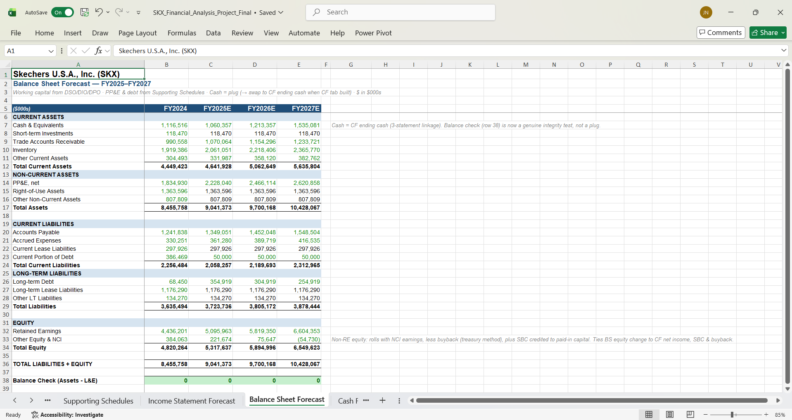
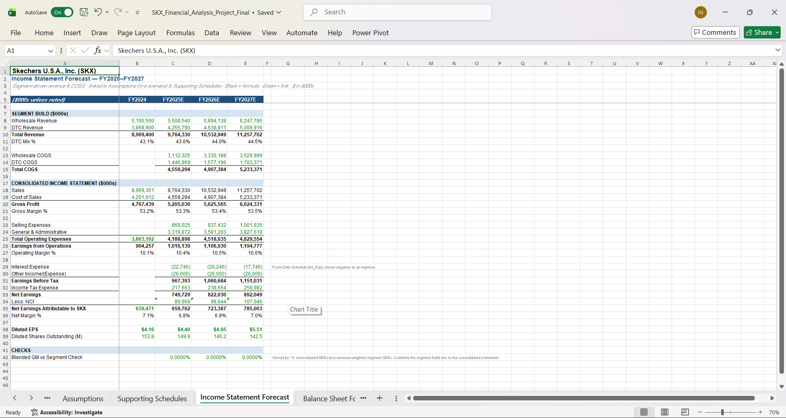
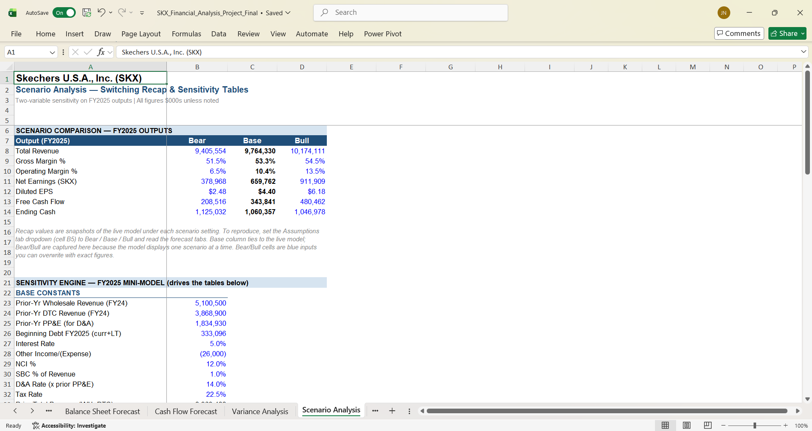
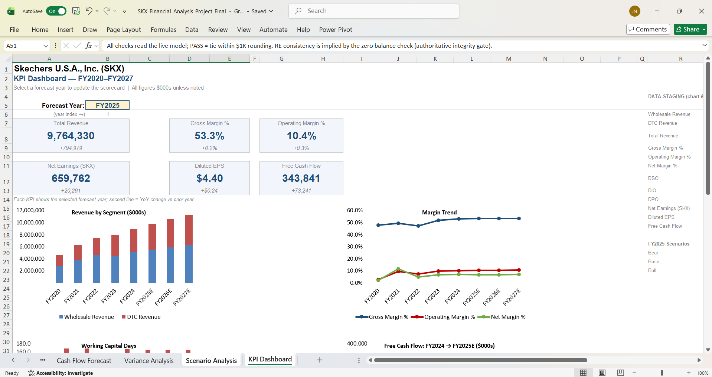
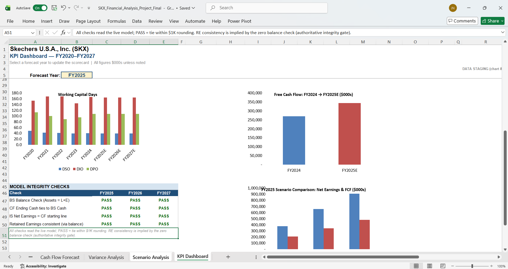

<a href="/projects/" class="back-to-projects btn">&larr; Back to Projects</a>

# FP&amp;A Financial Model – Skechers U.S.A. (SKX)

> A fully-integrated, three-statement financial model for Skechers U.S.A., Inc. &mdash; five years of historical actuals (FY2020&ndash;FY2024) plus a three-year forecast (FY2025&ndash;FY2027), built entirely from public SEC 10-K filings. Segment-level revenue, working-capital forecasting via DSO/DIO/DPO, scenario analysis with live sensitivity tables, and a KPI dashboard with self-checking model-integrity gates. The balance sheet ties to zero across all three scenarios.

**Tools:** Excel (3-statement modeling, named ranges, CHOOSE/MATCH, sensitivity tables, conditional formatting, charts) &middot; SEC EDGAR 10-K filings &middot; Python / openpyxl (build automation) &middot; Git/GitHub

---

  
<strong>Project Overview</strong>

  

  <h3>Overview</h3>
  

    This project is a complete three-statement financial model for Skechers U.S.A., Inc. (NYSE: SKX) &mdash; an income statement, balance sheet, and cash flow statement that fully articulate, so that a change to any driver flows correctly through all three. It covers five years of historical results (FY2020&ndash;FY2024) reconstructed from the company's SEC 10-K filings, plus a three-year forward forecast (FY2025&ndash;FY2027) driven by a transparent, switchable set of assumptions.
  

  

    The headline result is integrity: the balance sheet balances to zero and the cash flow statement ties to the balance sheet exactly &mdash; not by a forced plug, but as a genuine consequence of the accounting linking up correctly. A full audit confirmed these ties hold under the Bear, Base, and Bull scenarios across every forecast year.
  

  <h3>The Analytical Thesis</h3>
  

    Skechers runs two reportable segments: Wholesale and Direct-to-Consumer (DTC). DTC grew from 38.5% of revenue in FY2020 to 43.1% in FY2024, and it carries a materially higher gross margin (~66%) than Wholesale (~40&ndash;43%). Every point of mix shift toward DTC therefore expands the blended gross margin. The forecast models each segment separately and continues that mix shift (DTC 43.6% &rarr; 44.5% across FY2025&ndash;27), making the margin-expansion story visible and auditable rather than buried in a single blended revenue line.
  

  <h3>Base-Case Headline Outputs (FY2025)</h3>
  <ul>
    <li><strong>Total Revenue:</strong> ~$9.76B</li>
    <li><strong>Gross Margin:</strong> 53.3%</li>
    <li><strong>Operating Margin:</strong> 10.4%</li>
    <li><strong>Diluted EPS:</strong> $4.40</li>
    <li><strong>Free Cash Flow:</strong> $343.8M</li>
  </ul>
  

    Both revenue and EPS land inside the company's February 2025 forward guidance, anchoring the Base case to real-world expectations.
  

  <h3>Data Sources</h3>
  

    Built entirely from public data: Skechers' SEC EDGAR 10-K filings for FY2020 through FY2024, plus the company's February 2025 forward guidance for calibrating the Base case. (Note: 3G Capital took Skechers private in September 2025 for $9.4B / $63 per share; the model uses public data through FY2024 and is unaffected as a portfolio demonstration of modeling methodology.)
  

  
<strong>Model Architecture &amp; Integrity</strong>

  

  <h3>Ten Linked Tabs</h3>
  

    The workbook is organized as a navigable model, opening with a README cover page and flowing from historical data through the forecast engine to the analysis tabs and dashboard:
  

  <ul>
    <li><strong>Historical Financials</strong> &mdash; FY2020&ndash;24 income statement, balance sheet, cash flow, and segment detail reconstructed from the 10-Ks, with derived working-capital metrics. Balance checks tie to zero in every historical year.</li>
    <li><strong>Assumptions</strong> &mdash; Bear / Base / Bull driver sets side by side; the active set is chosen by a dropdown via <code>CHOOSE</code>/<code>MATCH</code>.</li>
    <li><strong>Supporting Schedules</strong> &mdash; PP&amp;E and depreciation, debt, and shares-outstanding rollforwards that feed the forecast statements.</li>
    <li><strong>Income Statement Forecast</strong> &mdash; segment-level (Wholesale/DTC) revenue and COGS build, consolidating up to the income statement.</li>
    <li><strong>Balance Sheet Forecast</strong> &mdash; working capital derived from DSO/DIO/DPO; PP&amp;E and debt from the schedules; an equity rollforward.</li>
    <li><strong>Cash Flow Forecast</strong> &mdash; indirect method; the ending cash balance flows back into the balance sheet to produce a genuine three-statement tie.</li>
    <li><strong>Variance Analysis</strong> &mdash; a guidance-calibrated FY2024 budget vs. actuals, with dollar and percent variances and direction-aware conditional formatting.</li>
    <li><strong>Scenario Analysis</strong> &mdash; a Bear/Base/Bull recap plus a self-contained FY2025 mini-model driving live sensitivity tables.</li>
    <li><strong>KPI Dashboard</strong> &mdash; a year-selectable scorecard (six KPIs), five charts, and a live model-integrity PASS/FAIL table.</li>
    <li><strong>README</strong> &mdash; a cover page documenting the model map, color legend, data sources, and caveats.</li>
  </ul>

  <h3>Why the Tie Is Genuine, Not Forced</h3>
  

    The balance sheet was first built with cash as a temporary balancing plug, so every <em>other</em> line could be verified independently. The cash flow statement was then built separately from the income statement and working-capital movements, and its ending cash was swapped into the balance sheet. Because cash is no longer a free plug, the balance check passing to zero is a real test that the model articulates correctly &mdash; if any line were wrong, it would not balance.
  

  <h3>No Circular Reference</h3>
  

    Interest expense is calculated on beginning-of-period debt, which breaks the interest &rarr; net income &rarr; cash &rarr; debt &rarr; interest circular loop. This is a standard, documented modeling simplification that keeps the workbook free of circular references and iterative-calculation dependencies.
  

  <figure style="margin: 20px 0;">
    
    <figcaption style="font-size: 0.95em; color: #555; margin-top: 8px;">Balance Sheet Forecast &mdash; the Assets = Liabilities + Equity check resolves to zero in every forecast year, confirming the three statements articulate correctly.</figcaption>
  </figure>

  
<strong>The Forecast Engine</strong>

  

  <h3>Segment-Level Revenue Build</h3>
  

    Rather than forecasting one blended revenue line, the model builds Wholesale and DTC separately, each with its own growth and gross-margin assumptions. The two segments consolidate to total revenue and total gross profit, and a blended-gross-margin reconciliation check confirms the consolidation is internally consistent. This structure is what makes the DTC mix-shift thesis directly visible in the output.
  

  <h3>Working Capital from Operating Ratios</h3>
  

    Accounts receivable, inventory, and accounts payable are driven from days-based ratios (DSO, DIO, DPO) rather than hardcoded, so the balance sheet's working-capital lines respond to revenue and COGS automatically and tie back into the cash flow statement through the change in net working capital.
  

  <h3>Switchable Assumptions</h3>
  

    A single dropdown on the Assumptions tab selects Bear, Base, or Bull; a <code>CHOOSE</code>/<code>MATCH</code> mechanism feeds the chosen driver set into the entire forecast. Flipping the selector re-drives the whole model &mdash; every statement, the dashboard, and the integrity checks all update together.
  

  <figure style="margin: 20px 0;">
    
    <figcaption style="font-size: 0.95em; color: #555; margin-top: 8px;">Income Statement Forecast &mdash; segment-level revenue and COGS build consolidating to the full income statement.</figcaption>
  </figure>

  
<strong>Scenario &amp; Sensitivity Analysis</strong>

  

  <h3>Bear / Base / Bull &mdash; Audited Outputs</h3>
  

    Each scenario was run through the full model and verified. The spread shows operating leverage at work: a roughly &plusmn;4% swing in revenue produces a far wider swing in EPS, exactly as a fixed-cost-bearing earnings stream should behave.
  

  <table>
    <thead>
      <tr><th>FY2025 Output</th><th>Bear</th><th>Base</th><th>Bull</th></tr>
    </thead>
    <tbody>
      <tr><td>Total Revenue ($000s)</td><td>9,405,554</td><td>9,764,330</td><td>10,174,111</td></tr>
      <tr><td>Gross Margin %</td><td>51.5%</td><td>53.3%</td><td>54.5%</td></tr>
      <tr><td>Operating Margin %</td><td>6.5%</td><td>10.4%</td><td>13.5%</td></tr>
      <tr><td>Net Earnings (SKX, $000s)</td><td>378,968</td><td>659,762</td><td>911,909</td></tr>
      <tr><td>Diluted EPS</td><td>$2.48</td><td>$4.40</td><td>$6.18</td></tr>
      <tr><td>Free Cash Flow ($000s)</td><td>208,516</td><td>343,841</td><td>480,462</td></tr>
    </tbody>
  </table>

  <h3>Live, Formula-Filled Sensitivity Tables</h3>
  

    The Scenario tab also carries two-variable sensitivity grids built as a self-contained FY2025 mini-model. Each grid cell recomputes from its own row and column drivers, so the tables recalculate live rather than being static snapshots. This was an engineering decision: the model's active inputs are <code>CHOOSE</code>-driven formulas, which Excel's native Data Tables cannot use as input cells, so the equivalent was engineered with formula-filled grids that are fully auditable and live-recalculating.
  

  <figure style="margin: 20px 0;">
    
    <figcaption style="font-size: 0.95em; color: #555; margin-top: 8px;">Scenario Analysis &mdash; Bear/Base/Bull recap and a live two-variable sensitivity grid.</figcaption>
  </figure>

  
<strong>KPI Dashboard &amp; Model Integrity Checks</strong>

  

  <h3>A Self-Checking Dashboard</h3>
  

    The dashboard presents six KPIs on a scorecard driven by a forecast-year selector, five charts (revenue by segment, margin trend, working-capital days, a free-cash-flow bridge, and a scenario comparison), and &mdash; critically &mdash; a model-integrity table that reads the live model and reports PASS/FAIL on four checks: the balance-sheet balance, the cash-flow tie, net earnings flowing correctly into the cash flow statement, and retained-earnings consistency. All four pass across FY2025&ndash;27.
  

  <h3>Verified by Audit</h3>
  

    A full project audit confirmed: zero formula errors across the workbook, all named ranges intact, and the balance and tie checks holding at zero under Bear, Base, and Bull in every forecast year. The integrity of the model is not an assertion &mdash; the dashboard proves it on every recalculation.
  

  <figure style="margin: 20px 0;">
    
    <figcaption style="font-size: 0.95em; color: #555; margin-top: 8px;">KPI Dashboard &mdash; year-selectable scorecard and segment/margin charts.</figcaption>
  </figure>

  <figure style="margin: 20px 0;">
    
    <figcaption style="font-size: 0.95em; color: #555; margin-top: 8px;">Dashboard integrity table &mdash; all four model checks read PASS across FY2025&ndash;27.</figcaption>
  </figure>

  
<strong>Skills Demonstrated</strong>

  

  <ul>
    <li>Three-statement financial modeling with genuine cross-statement articulation</li>
    <li>Segment-level revenue and margin build (Wholesale / DTC)</li>
    <li>Working-capital forecasting via DSO / DIO / DPO</li>
    <li>Scenario analysis with CHOOSE/MATCH-driven switchable assumptions</li>
    <li>Two-variable sensitivity tables (formula-filled, live-recalculating)</li>
    <li>Variance analysis with direction-aware conditional formatting</li>
    <li>PP&amp;E / depreciation, debt, and share-count rollforward schedules</li>
    <li>Circular-reference avoidance (beginning-of-period interest)</li>
    <li>Named-range architecture for clean cross-tab references</li>
    <li>KPI dashboard design with self-checking model-integrity gates</li>
    <li>Reading and reconstructing financials from SEC 10-K filings</li>
    <li>Build automation and verification via Python / openpyxl</li>
  </ul>

  
<strong>Project Files &amp; Repository</strong>

  

  <h3>Files</h3>
  <ul>
    <li><strong>excel/</strong> &mdash; <a href="excel/SKX_Financial_Analysis_Project_Final.xlsx">SKX_Financial_Analysis_Project_Final.xlsx</a> &mdash; the complete 10-tab workbook: 3-statement engine, supporting schedules, variance and scenario analysis, sensitivity tables, and the KPI dashboard with live integrity checks. Open and inspect any formula &mdash; the model is fully transparent.</li>
    <li><strong>images/</strong> &mdash; dashboard and key-tab screenshots.</li>
  </ul>

  

    <strong>GitHub Repository:</strong>
    <a href="https://github.com/nadeaujonny/nadeaujonny.github.io/tree/main/projects/skechers-fpa-model">
      nadeaujonny/nadeaujonny.github.io/projects/skechers-fpa-model
    </a>
  

