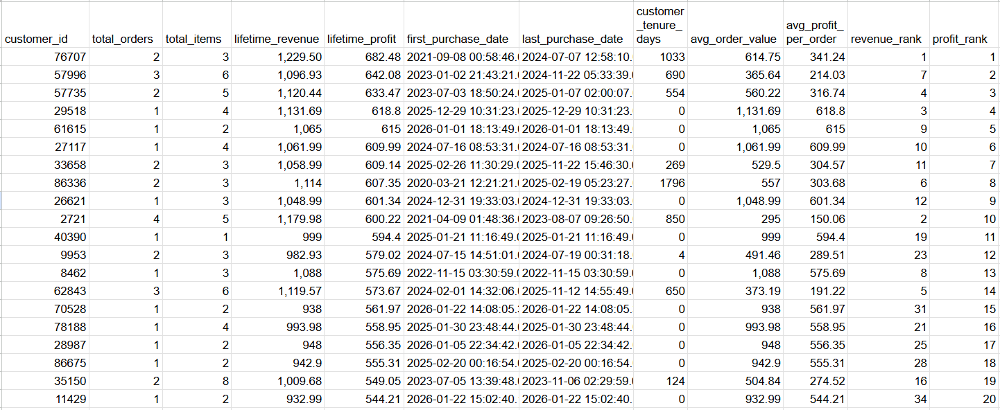

# E-commerce Revenue & Returns Analysis (SQL)

> This project analyzes sales and returns activity from the BigQuery **thelook_ecommerce** dataset to identify revenue drivers, profit concentration, return-risk patterns, and actionable operational insights using advanced SQL.

---

  
<strong>Project Overview</strong>

  

  

  <h2>Objectives</h2>
  <ul>
    <li>Identify key revenue and profit drivers across products, categories, and brands</li>
    <li>Quantify return behavior and evaluate how returns affect profitability</li>
    <li>Analyze customer value and purchasing patterns (CLV, AOV, tenure)</li>
    <li>Evaluate long-term and seasonal trends in revenue, profit, and return rates</li>
    <li>Demonstrate advanced SQL techniques (CTEs, joins, window functions, segmentation, time-series analysis)</li>
  </ul>

  

  <h2>SQL Techniques Demonstrated</h2>
  <ul>
    <li>Multi-table joins (orders, order_items, products, users)</li>
    <li>Aggregations and GROUP BY</li>
    <li>Common Table Expressions (CTEs)</li>
    <li>Window functions (RANK, ROW_NUMBER, LAG, rolling averages)</li>
    <li>CASE statements for tiering/segmentation</li>
    <li>Date/time analysis (DATE_TRUNC, EXTRACT, time-series grouping)</li>
    <li>Filtering for business relevance (minimum volume thresholds)</li>
    <li>Metric engineering (profit, margin, return rate, estimated profit impact)</li>
  </ul>

  

  <h2>Dataset Overview</h2>
  

    <code>thelook_ecommerce</code> is a public BigQuery dataset that simulates an online retail business.
    It contains transactional order data, line-item purchases, product attributes, and customer information.
    The relational schema supports analysis across product performance, profitability, returns, and customer behavior.
  

  <h3>Core Tables</h3>
  <ul>
    <li><code>orders</code>: one row per order (timestamps, status, user_id, etc.)</li>
    <li><code>order_items</code>: one row per item purchased within an order (sale_price, product_id, order_id)</li>
    <li><code>products</code>: product metadata (category, brand, cost)</li>
    <li><code>users</code>: customer attributes (demographics, geography)</li>
  </ul>

  

  <h2>KPI Definitions</h2>
  <ul>
    <li><strong>Total Revenue</strong> — SUM of <code>sale_price</code> for <strong>Completed</strong> order items</li>
    <li><strong>Total Profit</strong> — SUM of <code>(sale_price - cost)</code> for <strong>Completed</strong> order items</li>
    <li><strong>Units Sold</strong> — COUNT of order items with status <strong>Complete</strong></li>
    <li><strong>Units Returned</strong> — COUNT of order items with status <strong>Returned</strong></li>
    <li><strong>Return Rate (%)</strong> — <code>units_returned / (units_completed + units_returned)</code></li>
    <li><strong>Profit Margin (%)</strong> — <code>profit / revenue</code></li>
  </ul>

  

    <em>Note:</em> Revenue and profit are calculated using completed purchases only. Return rate calculations use
    <strong>both</strong> completed and returned units to ensure a realistic denominator.
  

  

  <h2>Key Business Questions</h2>
  <ul>
    <li>Which products and brands generate the most revenue and profit?</li>
    <li>Which products are the most margin-efficient (profit margin), and can they be scaled?</li>
    <li>Which products have the highest return rates, and what is the profit at risk from returns?</li>
    <li>How have revenue, profit, and returns changed over time (long-term and seasonal)?</li>
    <li>Which customers generate the highest lifetime profit and what purchasing patterns define them?</li>
  </ul>

  

  <h2>Tools Used</h2>
  <ul>
    <li>Google BigQuery (SQL)</li>
    <li>GitHub (version control)</li>
    <li>GitHub Pages (documentation &amp; portfolio publishing)</li>
  </ul>

---

  
<strong>Analysis 1 — Top Products by Revenue</strong>

  

  

  <h3>Business Question</h3>
  <ul>
    <li>Which products generate the highest completed-sales revenue?</li>
  </ul>

  <h3>SQL Query</h3>
  <pre><code class="language-sql">SELECT 
  p.name AS product_name,
  p.category AS product_category,
  ROUND(SUM(oi.sale_price), 2) AS total_revenue,
  ROUND(SUM(oi.sale_price - p.cost), 2) AS total_profit,
  COUNT(*) AS units_sold
FROM `bigquery-public-data.thelook_ecommerce.products` p
JOIN `bigquery-public-data.thelook_ecommerce.order_items` oi
  ON p.id = oi.product_id
JOIN `bigquery-public-data.thelook_ecommerce.orders` o
  ON o.order_id = oi.order_id
WHERE o.status = 'Complete'
GROUP BY product_name, product_category
ORDER BY total_revenue DESC
LIMIT 10;</code></pre>

  <h3>Result Table</h3>
  <figure style="margin: 0 0 18px 0;">
    
    <figcaption style="font-size:0.95em; color:#555; margin-top:6px;">
      Top 10 products by completed-sales revenue.
      <a href="images/top_products_by_revenue.png">Open full-size</a>
    </figcaption>
  </figure>

  <h3>Insights</h3>
  <ul>
    <li>Top revenue products are concentrated in premium apparel/outerwear, indicating pricing power and strong demand.</li>
    <li>Category concentration suggests revenue is sensitive to a small subset of high-ticket items.</li>
    <li>Revenue appears driven more by price per unit than extreme differences in unit volume among the top products.</li>
  </ul>

  <h3>Business Recommendations</h3>
  <ul>
    <li><strong>Defend top SKUs:</strong> prioritize inventory availability and paid visibility for the highest-revenue products.</li>
    <li><strong>Increase AOV:</strong> cross-sell accessories (hats, gloves, base layers) alongside premium outerwear.</li>
    <li><strong>Validate net value:</strong> review return rates for top-revenue products to ensure revenue isn’t offset by returns.</li>
    <li><strong>Improve margins:</strong> negotiate supplier cost improvements or shipping terms for consistently high-volume premium items.</li>
  </ul>

---

  
<strong>Analysis 2 — Top Products by Profit</strong>

  

  

  <h3>Business Question</h3>
  <ul>
    <li>Which products generate the highest total profit from completed purchases?</li>
  </ul>

  <h3>SQL Query</h3>
  <pre><code class="language-sql">WITH product_profit AS (
  SELECT
    p.id AS product_id,
    p.name AS product_name,
    ROUND(SUM(oi.sale_price), 2) AS revenue,
    ROUND(SUM(oi.sale_price - p.cost), 2) AS profit,
    COUNT(*) AS units_sold
  FROM `bigquery-public-data.thelook_ecommerce.order_items` oi
  JOIN `bigquery-public-data.thelook_ecommerce.orders` o
    ON oi.order_id = o.order_id
  JOIN `bigquery-public-data.thelook_ecommerce.products` p
    ON oi.product_id = p.id
  WHERE o.status = 'Complete'
  GROUP BY p.id, p.name
)
SELECT *
FROM product_profit
ORDER BY profit DESC
LIMIT 10;</code></pre>

  <h3>Result Table</h3>
  <figure style="margin: 0 0 18px 0;">
    
    <figcaption style="font-size:0.95em; color:#555; margin-top:6px;">
      Top 10 products by total profit (completed purchases).
      <a href="images/top-products-by-profit.png">Open full-size</a>
    </figcaption>
  </figure>

  <h3>Insights</h3>
  <ul>
    <li>Profit is concentrated in a small subset of products, indicating a “profit core” within the catalog.</li>
    <li>Premium products can produce outsized profit even without extreme unit volume, reinforcing margin as a key driver.</li>
    <li>Revenue rank and profit rank overlap but are not identical—product economics differ meaningfully by SKU.</li>
  </ul>

  <h3>Business Recommendations</h3>
  <ul>
    <li><strong>Protect the profit core:</strong> monitor stockouts and supply lead times for top-profit SKUs.</li>
    <li><strong>Scale profit:</strong> test higher visibility placements (homepage modules, email features, remarketing) for these items.</li>
    <li><strong>Optimize pricing:</strong> test modest price changes to measure elasticity while preserving margins.</li>
    <li><strong>Reduce hidden drag:</strong> track return rates for top-profit products to confirm net profitability.</li>
  </ul>

---

  
<strong>Analysis 3 — Top Brands by Profit</strong>

  

  

  <h3>Business Question</h3>
  <ul>
    <li>Which brands generate the highest total profit from completed purchases?</li>
  </ul>

  <h3>SQL Query</h3>
  <pre><code class="language-sql">WITH brand_metrics AS (
  SELECT
    p.brand,
    ROUND(SUM(oi.sale_price), 2) AS revenue,
    ROUND(SUM(oi.sale_price - p.cost), 2) AS profit,
    COUNT(*) AS units_sold
  FROM `bigquery-public-data.thelook_ecommerce.order_items` oi
  JOIN `bigquery-public-data.thelook_ecommerce.orders` o
    ON oi.order_id = o.order_id
  JOIN `bigquery-public-data.thelook_ecommerce.products` p
    ON oi.product_id = p.id
  WHERE o.status = 'Complete'
  GROUP BY p.brand
),
ranked_brands AS (
  SELECT
    *,
    RANK() OVER (ORDER BY profit DESC) AS profit_rank,
    RANK() OVER (ORDER BY revenue DESC) AS revenue_rank
  FROM brand_metrics
)
SELECT *
FROM ranked_brands
ORDER BY profit_rank
LIMIT 10;</code></pre>

  <h3>Result Table</h3>
  <figure style="margin: 0 0 18px 0;">
    
    <figcaption style="font-size:0.95em; color:#555; margin-top:6px;">
      Top 10 brands by total profit (completed purchases).
      <a href="images/top-brands-by-profit.png">Open full-size</a>
    </figcaption>
  </figure>

  <h3>Insights</h3>
  <ul>
    <li>Profit is dependent on a limited set of key brands, creating partner concentration risk.</li>
    <li>Brand profit and revenue ranks differ, indicating meaningful differences in brand-level margin structure.</li>
    <li>Brands are a stable unit of strategy: brand performance is often more predictable than single-SKU performance.</li>
  </ul>

  <h3>Business Recommendations</h3>
  <ul>
    <li><strong>Deepen key partnerships:</strong> explore exclusive drops, co-marketing, or preferred terms with top-profit brands.</li>
    <li><strong>Allocate marketing by margin:</strong> bias spend toward brands with strong profit contribution, not just revenue.</li>
    <li><strong>De-risk concentration:</strong> develop emerging brands with strong growth in profit/revenue to diversify profit sources.</li>
    <li><strong>Fix low performers:</strong> investigate low-margin brands (pricing, cost, assortment, discount behavior).</li>
  </ul>

---

  
<strong>Analysis 4 — Top Products by Profit Margin</strong>

  

  

  <h3>Business Question</h3>
  <ul>
    <li>Which products are most margin-efficient (profit ÷ revenue), after filtering out low-volume noise?</li>
  </ul>

  <h3>SQL Query</h3>
  <pre><code class="language-sql">WITH product_totals AS (
  SELECT
    p.id AS product_id,
    p.name AS product_name,
    p.category AS product_category,
    SUM(oi.sale_price) AS revenue,
    SUM(oi.sale_price - p.cost) AS profit,
    COUNT(*) AS units_sold
  FROM `bigquery-public-data.thelook_ecommerce.order_items` AS oi
  JOIN `bigquery-public-data.thelook_ecommerce.orders` AS o
    ON oi.order_id = o.order_id
  JOIN `bigquery-public-data.thelook_ecommerce.products` AS p
    ON oi.product_id = p.id
  WHERE o.status = 'Complete'
  GROUP BY 1, 2, 3
),
metrics AS (
  SELECT
    product_id,
    product_name,
    product_category,
    ROUND(revenue, 2) AS revenue,
    ROUND(profit, 2) AS profit,
    units_sold,
    ROUND(profit / NULLIF(revenue, 0), 4) AS profit_margin,
    RANK() OVER (ORDER BY profit DESC) AS profit_rank,
    RANK() OVER (ORDER BY profit / NULLIF(revenue, 0) DESC) AS margin_rank,
    CASE
      WHEN revenue = 0 THEN 'Undefined'
      WHEN profit / revenue >= 0.50 THEN 'Very High (&gt;= 50%)'
      WHEN profit / revenue >= 0.30 THEN 'High (30%–49.9%)'
      WHEN profit / revenue >= 0.15 THEN 'Medium (15%–29.9%)'
      WHEN profit / revenue &gt; 0 THEN 'Low (0%–14.9%)'
      ELSE 'Negative (&lt;= 0%)'
    END AS margin_tier
  FROM product_totals
)
SELECT *
FROM metrics
WHERE revenue &gt; 0
  AND units_sold &gt;= 3
  AND revenue &gt;= 50
ORDER BY profit_margin DESC, profit DESC
LIMIT 10;</code></pre>

  <h3>Result Table</h3>
  <figure style="margin: 0 0 18px 0;">
    
    <figcaption style="font-size:0.95em; color:#555; margin-top:6px;">
      Top products by profit margin (filtered for business relevance).
      <a href="images/top-products-by-profit-margin.png">Open full-size</a>
    </figcaption>
  </figure>

  <h3>Insights</h3>
  <ul>
    <li>High-margin products can differ significantly from top-profit products because margin does not guarantee scale.</li>
    <li>Applying minimum thresholds (units sold, revenue) produces a more business-relevant view and avoids tiny-denominator artifacts.</li>
    <li>Margin tiers provide a portfolio-friendly way to communicate product efficiency and pricing power.</li>
  </ul>

  <h3>Business Recommendations</h3>
  <ul>
    <li><strong>Scale what’s efficient:</strong> run marketing tests on high-margin SKUs to see if demand can be increased without eroding margins.</li>
    <li><strong>Use margin for discount strategy:</strong> high-margin products can support promotions while staying profitable.</li>
    <li><strong>Balance the catalog:</strong> manage assortment using both total profit (scale) and margin (efficiency) to optimize long-term profitability.</li>
    <li><strong>Investigate low-margin volume items:</strong> identify pricing, shipping, or sourcing changes to improve contribution.</li>
  </ul>

---

  
<strong>Analysis 5 — Top Products by Return Rate</strong>

  

  

  <h3>Business Question</h3>
  <ul>
    <li>Which products have the highest return rates, and what profit is at risk from those returns?</li>
  </ul>

  <h3>SQL Query</h3>
  <pre><code class="language-sql">WITH product_status_counts AS (
  SELECT
    p.id AS product_id,
    p.name AS product_name,
    p.category AS product_category,

    -- Denominator: all purchased units that are either Complete or Returned
    COUNT(*) AS total_purchased_units,

    -- Status-based unit counts
    SUM(CASE WHEN o.status = 'Returned' THEN 1 ELSE 0 END) AS units_returned,
    SUM(CASE WHEN o.status = 'Complete' THEN 1 ELSE 0 END) AS units_completed,

    -- Sales metrics based on completed purchases only
    SUM(CASE WHEN o.status = 'Complete' THEN oi.sale_price ELSE 0 END) AS revenue,
    SUM(CASE WHEN o.status = 'Complete' THEN (oi.sale_price - p.cost) ELSE 0 END) AS profit

  FROM `bigquery-public-data.thelook_ecommerce.order_items` AS oi
  JOIN `bigquery-public-data.thelook_ecommerce.orders` AS o
    ON oi.order_id = o.order_id
  JOIN `bigquery-public-data.thelook_ecommerce.products` AS p
    ON oi.product_id = p.id
  WHERE o.status IN ('Complete', 'Returned')
  GROUP BY 1, 2, 3
),
final AS (
  SELECT
    product_id,
    product_name,
    product_category,

    total_purchased_units AS units_purchased,
    units_completed,
    units_returned,

    ROUND(units_returned / NULLIF(total_purchased_units, 0) * 100, 2) AS return_rate_pct,

    ROUND(revenue, 2) AS revenue,
    ROUND(profit, 2) AS profit,

    ROUND(profit / NULLIF(units_completed, 0), 2) AS avg_profit_per_completed_unit,

    ROUND(units_returned * (profit / NULLIF(units_completed, 0)), 2) AS est_profit_lost_to_returns,

    RANK() OVER (ORDER BY units_returned / NULLIF(total_purchased_units, 0) DESC) AS return_rate_rank,
    RANK() OVER (ORDER BY units_returned DESC) AS returns_volume_rank,

    CASE
      WHEN total_purchased_units = 0 THEN 'Undefined'
      WHEN units_returned / NULLIF(total_purchased_units, 0) &gt;= 0.30 THEN 'Very High (&gt;= 30%)'
      WHEN units_returned / NULLIF(total_purchased_units, 0) &gt;= 0.20 THEN 'High (20%–29.9%)'
      WHEN units_returned / NULLIF(total_purchased_units, 0) &gt;= 0.10 THEN 'Medium (10%–19.9%)'
      WHEN units_returned &gt; 0 THEN 'Low (0%–9.9%)'
      ELSE 'None (0%)'
    END AS return_risk_tier

  FROM product_status_counts
)
SELECT
  product_id,
  product_name,
  product_category,
  units_purchased,
  units_completed,
  units_returned,
  return_rate_pct,
  revenue,
  profit,
  avg_profit_per_completed_unit,
  est_profit_lost_to_returns,
  return_risk_tier,
  return_rate_rank,
  returns_volume_rank
FROM final
WHERE units_purchased &gt;= 5
  AND revenue &gt;= 50
ORDER BY return_rate_pct DESC, units_returned DESC, revenue DESC
LIMIT 10;</code></pre>

  <h3>Result Table</h3>
  <figure style="margin: 0 0 18px 0;">
    
    <figcaption style="font-size:0.95em; color:#555; margin-top:6px;">
      Top products by return rate (with estimated profit impact).
      <a href="images/top-products-by-return-rate.png">Open full-size</a>
    </figcaption>
  </figure>

  <h3>Insights</h3>
  <ul>
    <li>Return rate should be evaluated with a realistic denominator (Completed + Returned units) to avoid misleading values.</li>
    <li>High return rates represent operational and financial risk—profitability can look strong on completed sales but be eroded by returns.</li>
    <li>Estimated profit-at-risk provides a portfolio-friendly proxy for understanding which return-heavy products matter financially.</li>
  </ul>

  <h3>Business Recommendations</h3>
  <ul>
    <li><strong>Audit high-risk SKUs:</strong> review sizing guidance, imagery, materials, and customer feedback for top return-rate products.</li>
    <li><strong>Improve fit confidence:</strong> add better size charts, model measurements, and fit reviews for apparel.</li>
    <li><strong>Reduce scaling risk:</strong> avoid aggressively promoting high-return products until root causes are addressed.</li>
    <li><strong>Operationalize returns:</strong> track return rate and profit-at-risk alongside revenue and profit in reporting.</li>
  </ul>

---

  
<strong>Analysis 6 — Long-Term Trends in Revenue, Profit, and Returns</strong>

  

  

  <h3>Business Question</h3>
  <ul>
    <li>How have revenue, profit, and return rates evolved over time, and what structural trends are visible?</li>
  </ul>

  <h3>SQL Query</h3>
  <pre><code class="language-sql">WITH base AS (
  SELECT
    DATE_TRUNC(DATE(o.created_at), MONTH) AS month,

    COUNT(*) AS total_units,

    SUM(CASE WHEN o.status = 'Complete' THEN 1 ELSE 0 END) AS units_completed,
    SUM(CASE WHEN o.status = 'Returned' THEN 1 ELSE 0 END) AS units_returned,

    SUM(CASE WHEN o.status = 'Complete' THEN oi.sale_price ELSE 0 END) AS revenue,
    SUM(CASE WHEN o.status = 'Complete' THEN (oi.sale_price - p.cost) ELSE 0 END) AS profit

  FROM `bigquery-public-data.thelook_ecommerce.order_items` oi
  JOIN `bigquery-public-data.thelook_ecommerce.orders` o
    ON oi.order_id = o.order_id
  JOIN `bigquery-public-data.thelook_ecommerce.products` p
    ON oi.product_id = p.id

  WHERE o.status IN ('Complete', 'Returned')
  GROUP BY 1
),
metrics AS (
  SELECT
    month,
    total_units,
    units_completed,
    units_returned,

    ROUND(units_returned / NULLIF(total_units, 0) * 100, 2) AS return_rate_pct,
    ROUND(revenue, 2) AS revenue,
    ROUND(profit, 2) AS profit,

    ROUND(
      (revenue - LAG(revenue) OVER (ORDER BY month))
      / NULLIF(LAG(revenue) OVER (ORDER BY month), 0) * 100,
      2
    ) AS revenue_mom_growth_pct,

    ROUND(
      (profit - LAG(profit) OVER (ORDER BY month))
      / NULLIF(LAG(profit) OVER (ORDER BY month), 0) * 100,
      2
    ) AS profit_mom_growth_pct,

    ROUND(AVG(revenue) OVER (ORDER BY month ROWS BETWEEN 2 PRECEDING AND CURRENT ROW), 2) AS revenue_3mo_avg,
    ROUND(AVG(profit)  OVER (ORDER BY month ROWS BETWEEN 2 PRECEDING AND CURRENT ROW), 2) AS profit_3mo_avg

  FROM base
)
SELECT *
FROM metrics
ORDER BY month;</code></pre>

  <h3>Results</h3>

  <h4>Revenue and Profit</h4>
  <figure style="margin: 0 0 18px 0;">
    
    <figcaption style="font-size:0.95em; color:#555; margin-top:6px;">
      Long-term trends in revenue and profit (completed purchases).
      <a href="images/long-term-trends-revenue-and-profit.png">Open full-size</a>
    </figcaption>
  </figure>

  <h4>Units Completed vs Returned</h4>
  <figure style="margin: 0 0 18px 0;">
    
    <figcaption style="font-size:0.95em; color:#555; margin-top:6px;">
      Order-item units over time (completed vs returned).
      <a href="images/long-term-trends-returns.png">Open full-size</a>
    </figcaption>
  </figure>

  <h3>Insights</h3>
  <ul>
    <li>Revenue and profit rise over time, indicating sustained business growth.</li>
    <li>Profit generally tracks revenue, suggesting relatively stable unit economics during expansion.</li>
    <li>Returned units grow in absolute terms as volume grows; monitoring return rate is critical as scale increases.</li>
  </ul>

  <h3>Business Recommendations</h3>
  <ul>
    <li><strong>Scale operations with volume:</strong> align fulfillment and customer support capacity to rising order throughput.</li>
    <li><strong>Protect margins:</strong> monitor shipping cost, product cost, and return-related costs as volume increases.</li>
    <li><strong>Use return rate as a leading indicator:</strong> small return-rate increases at scale can materially reduce profit.</li>
    <li><strong>Forecast using trend + seasonality:</strong> leverage historical patterns for staffing, procurement, and inventory planning.</li>
  </ul>

---

  
<strong>Analysis 7 — Seasonal Trends in Revenue, Profit, and Returns</strong>

  

  

  <h3>Business Question</h3>
  <ul>
    <li>How do revenue, profit, and return rates vary by month of the year, and which seasons represent peak performance or elevated return risk?</li>
  </ul>

  <h3>SQL Query</h3>
  <pre><code class="language-sql">WITH base AS (
  SELECT
    EXTRACT(MONTH FROM DATE(o.created_at)) AS month_num,
    FORMAT_DATE('%B', DATE(o.created_at)) AS month_name,

    COUNT(*) AS total_units,
    SUM(CASE WHEN o.status = 'Complete' THEN 1 ELSE 0 END) AS units_completed,
    SUM(CASE WHEN o.status = 'Returned' THEN 1 ELSE 0 END) AS units_returned,

    SUM(CASE WHEN o.status = 'Complete' THEN oi.sale_price ELSE 0 END) AS revenue,
    SUM(CASE WHEN o.status = 'Complete' THEN (oi.sale_price - p.cost) ELSE 0 END) AS profit

  FROM `bigquery-public-data.thelook_ecommerce.order_items` oi
  JOIN `bigquery-public-data.thelook_ecommerce.orders` o
    ON oi.order_id = o.order_id
  JOIN `bigquery-public-data.thelook_ecommerce.products` p
    ON oi.product_id = p.id

  WHERE o.status IN ('Complete', 'Returned')
  GROUP BY 1, 2
),
metrics AS (
  SELECT
    month_num,
    month_name,

    total_units AS units_purchased,
    units_completed,
    units_returned,

    ROUND(units_returned / NULLIF(total_units, 0) * 100, 2) AS return_rate_pct,
    ROUND(revenue, 2) AS revenue,
    ROUND(profit, 2) AS profit

  FROM base
)
SELECT *
FROM metrics
ORDER BY month_num;</code></pre>

  <h3>Results</h3>

  <h4>Revenue and Profit (by Month)</h4>
  <figure style="margin: 0 0 18px 0;">
    
    <figcaption style="font-size:0.95em; color:#555; margin-top:6px;">
      Seasonal pattern in revenue and profit by month of year.
      <a href="images/seasonal-trends-revenue-and-profit.png">Open full-size</a>
    </figcaption>
  </figure>

  <h4>Units Completed vs Returned (by Month)</h4>
  <figure style="margin: 0 0 18px 0;">
    
    <figcaption style="font-size:0.95em; color:#555; margin-top:6px;">
      Seasonal pattern in completed and returned units by month of year.
      <a href="images/seasonal-trends-returns.png">Open full-size</a>
    </figcaption>
  </figure>

  <h3>Insights</h3>
  <ul>
    <li>Revenue and profit show clear seasonality, with performance building toward late-year peaks.</li>
    <li>Return volumes rise during peak demand months; operational readiness must scale with both sales and reverse logistics.</li>
    <li>Seasonality is consistent enough to support forecasting and staffing/inventory planning.</li>
  </ul>

  <h3>Business Recommendations</h3>
  <ul>
    <li><strong>Plan inventory early:</strong> increase stock coverage ahead of peak months for high-demand categories.</li>
    <li><strong>Scale reverse logistics:</strong> allocate seasonal capacity for returns processing, inspections, and refunds.</li>
    <li><strong>Smooth demand:</strong> run early-year promotions to reduce revenue volatility and better utilize capacity.</li>
    <li><strong>Reduce peak returns:</strong> improve product pages and sizing guidance prior to peak seasons.</li>
  </ul>

---

  
<strong>Analysis 8 — Customer Lifetime Value (CLV) and Retention Patterns</strong>

  

  

  <h3>Business Question</h3>
  <ul>
    <li>Which customers generate the highest lifetime profit, and what purchasing patterns define high-value customers?</li>
  </ul>

  <h3>SQL Query</h3>
  <pre><code class="language-sql">WITH completed_orders AS (
  SELECT
    o.user_id AS customer_id,
    o.order_id,
    o.created_at,
    oi.sale_price,
    p.cost
  FROM `bigquery-public-data.thelook_ecommerce.orders` o
  JOIN `bigquery-public-data.thelook_ecommerce.order_items` oi
    ON o.order_id = oi.order_id
  JOIN `bigquery-public-data.thelook_ecommerce.products` p
    ON oi.product_id = p.id
  WHERE o.status = 'Complete'
),
customer_aggregates AS (
  SELECT
    customer_id,
    COUNT(DISTINCT order_id) AS total_orders,
    COUNT(*) AS total_items,
    ROUND(SUM(sale_price), 2) AS lifetime_revenue,
    ROUND(SUM(sale_price - cost), 2) AS lifetime_profit,
    MIN(created_at) AS first_purchase_date,
    MAX(created_at) AS last_purchase_date,
    DATE_DIFF(DATE(MAX(created_at)), DATE(MIN(created_at)), DAY) AS customer_tenure_days
  FROM completed_orders
  GROUP BY customer_id
),
final AS (
  SELECT
    *,
    ROUND(lifetime_revenue / NULLIF(total_orders, 0), 2) AS avg_order_value,
    ROUND(lifetime_profit  / NULLIF(total_orders, 0), 2) AS avg_profit_per_order,
    RANK() OVER (ORDER BY lifetime_revenue DESC) AS revenue_rank,
    RANK() OVER (ORDER BY lifetime_profit DESC) AS profit_rank
  FROM customer_aggregates
)
SELECT *
FROM final
ORDER BY lifetime_profit DESC
LIMIT 20;</code></pre>

  <h3>Result Table</h3>
  <figure style="margin: 0 0 18px 0;">
    
    <figcaption style="font-size:0.95em; color:#555; margin-top:6px;">
      Top customers by lifetime profit (completed purchases).
      <a href="images/top-customers-by-profit.png">Open full-size</a>
    </figcaption>
  </figure>

  <h3>Insights</h3>
  <ul>
    <li>High customer value is often driven by large baskets (high AOV) rather than high purchase frequency.</li>
    <li>Customer tenure varies: some high-value customers are long-term repeat buyers while others are high-impact one-time purchasers.</li>
    <li>Revenue and profit ranks are closely aligned, suggesting cost structure is relatively consistent across customers.</li>
    <li>Top customers represent a meaningful profit segment worth protecting through retention and VIP strategies.</li>
  </ul>

  <h3>Business Recommendations</h3>
  <ul>
    <li><strong>Build a VIP segment:</strong> create tiers using lifetime profit/AOV and offer early access, perks, or personalized outreach.</li>
    <li><strong>Increase basket size:</strong> deploy bundling and cross-sell flows since AOV is a major driver of profitability.</li>
    <li><strong>Differentiate strategies:</strong> retain repeat VIPs (loyalty) vs. re-engage high-impact one-time buyers (win-back).</li>
    <li><strong>Guide merchandising:</strong> analyze top-customer category/brand mix to inform assortment and premium expansion.</li>
  </ul>

---

  
<strong>Conclusion</strong>

  

  

  

    This project demonstrates an end-to-end SQL analytics workflow using the BigQuery public
    <code>thelook_ecommerce</code> dataset. Across eight analyses, I engineered business KPIs and used joins, CTEs,
    window functions, and time-series logic to evaluate product performance, profitability, returns risk,
    and customer value.
  

  <h3>Key Takeaways</h3>
  <ul>
    <li><strong>Profit concentration:</strong> a relatively small subset of products and brands drive a disproportionate share of total profit.</li>
    <li><strong>Margin vs scale:</strong> high-margin products are not always the highest-profit products, reinforcing the need to balance efficiency with volume.</li>
    <li><strong>Returns risk:</strong> return behavior can materially reduce net profit; return rate should be monitored alongside revenue and profit.</li>
    <li><strong>Predictable trends:</strong> long-term growth and seasonality support forecasting, inventory planning, and capacity management.</li>
    <li><strong>Customer value:</strong> the most profitable customers are often defined by high order value; retention and VIP strategies can protect this segment.</li>
  </ul>

  

    Together, these analyses show how SQL can transform raw transactional data into decision-ready insights that support
    pricing, merchandising, inventory planning, marketing strategy, and operational improvements.
  

