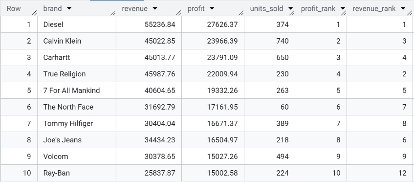
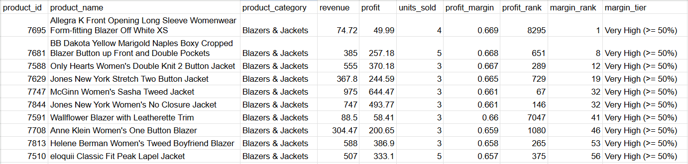
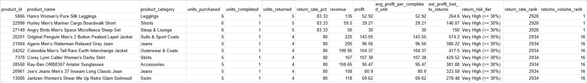
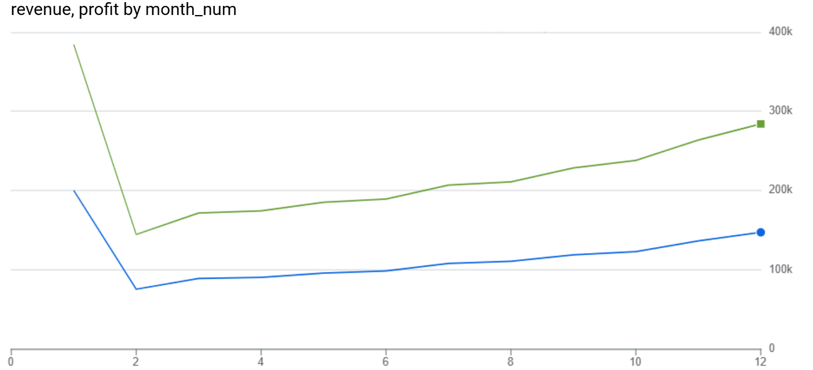
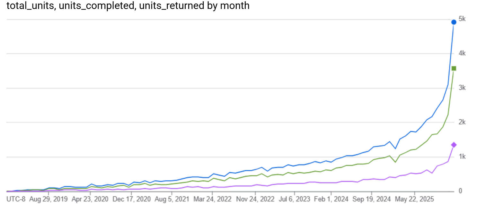
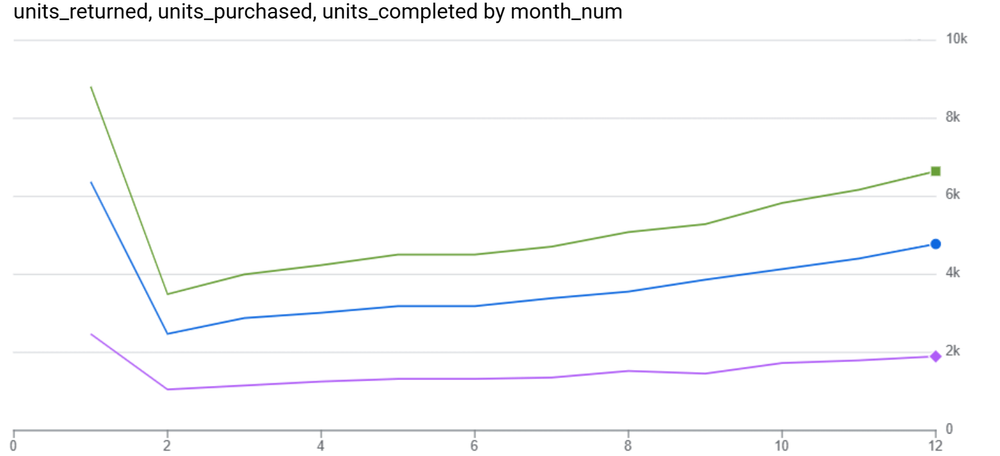

<a href="/projects" class="back-btn">← Back to Projects</a>

# E-commerce Revenue & Returns Analysis (SQL)

This project analyzes sales and returns data from the BigQuery **thelook_ecommerce** dataset to uncover revenue drivers, product performance, return patterns, and operational insights.

---

## Objectives

- Identify key revenue and profit drivers
- Analyze return behavior by product and category
- Evaluate customer purchasing patterns
- Demonstrate advanced SQL techniques (CTEs, joins, window functions, aggregations)

---

## SQL Techniques Demonstrated

- Multi-table joins
- Aggregations and GROUP BY
- Common Table Expressions (CTEs)
- Window functions (RANK, ROW_NUMBER)
- CASE statements
- Date/time analysis
- Subqueries
- Filtering and segmentation

---

## Dataset Overview

The `thelook_ecommerce` dataset is a public BigQuery dataset that simulates the operations of an online retail company. It contains detailed transactional data covering customer orders, individual items within each order, product attributes, and user information.

The data is structured in a relational format:

- `orders` contains one row per order and includes timestamps, order status (e.g., Complete, Returned), and user identifiers.  
- `order_items` contains one row per product purchased within an order, allowing revenue, profit, and return behavior to be analyzed at the product level.  
- `products` provides product metadata such as category, brand, and cost, enabling profitability and margin calculations.  
- `users` contains customer-level demographic and geographic attributes.

This structure supports analysis across multiple business dimensions including product performance, brand contribution, customer behavior, operational efficiency (returns), and time-based trends. The dataset is well-suited for demonstrating SQL techniques such as joins, aggregations, window functions, and time-series analysis in an e-commerce context.

---

## Key Metrics (KPIs)

- Total Revenue
- Total Profit
- Units Sold
- Return Rate
- Average Order Value (AOV)
- Customer Lifetime Value (CLV)
- Monthly Revenue Growth

---

## Key Business Questions

- Which products and categories generate the most revenue and profit?
- Which products are returned most frequently?
- How do returns affect overall profitability?
- Which customers generate the highest lifetime value?
- How does revenue trend over time?

---

## Tools Used

- Google BigQuery (SQL)
- GitHub Pages (documentation)
- GitHub (version control)

---

## Analysis 1 - Top Products by Revenue

### Business Question
- Which products generate the highest revenue?

### SQL Query
```sql
SELECT 
  p.name AS product_name,
  p.category AS product_category,
  ROUND(SUM(oi.sale_price), 2) AS total_revenue,
  ROUND(SUM(oi.sale_price - p.cost), 2) AS total_profit,
  COUNT(*) AS units_sold
FROM `bigquery-public-data.thelook_ecommerce.products` p
JOIN `bigquery-public-data.thelook_ecommerce.order_items` oi
  ON p.id = oi.product_id
JOIN `bigquery-public-data.thelook_ecommerce.orders` o
  ON o.order_id = oi.order_id
WHERE o.status = 'Complete'
GROUP BY product_name, product_category
ORDER BY total_revenue DESC
LIMIT 10;
```

### Result Table


### Insights
- The highest-revenue products are dominated by premium outerwear brands (North Face, Canada Goose).
- Outerwear & Coats appears multiple times in the top 10, indicating category concentration.
- Top products generate both high revenue and strong profit margins, suggesting pricing power.
- Unit sales are relatively balanced among top products, implying revenue is driven more by price than volume.

### Business Recommendations
- Prioritize inventory and marketing spend on top-performing outerwear products.
- Bundle or cross-sell accessories with premium jackets to increase AOV.
- Analyze return rates for these top products to ensure high revenue is not offset by returns.
- Negotiate supplier costs for high-volume premium brands to improve margins further.

---

## Analysis 2 - Top Products by Profit

### Business Question
- Which products generate the highest profit?

### SQL Query
```sql
WITH product_profit AS (
  SELECT
    p.id AS product_id,
    p.name AS product_name,
    ROUND(SUM(oi.sale_price), 2) AS revenue,
    ROUND(SUM(oi.sale_price - p.cost), 2) AS profit,
    COUNT(*) AS units_sold
  FROM `bigquery-public-data.thelook_ecommerce.order_items` oi
  JOIN `bigquery-public-data.thelook_ecommerce.orders` o
    ON oi.order_id = o.order_id
  JOIN `bigquery-public-data.thelook_ecommerce.products` p
    ON oi.product_id = p.id
  WHERE o.status = 'Complete'
  GROUP BY p.id, p.name
)

SELECT *
FROM product_profit
ORDER BY profit DESC
LIMIT 10;
```

### Result Table


### Insights
- Profit is highly concentrated among a small number of products, indicating that a limited subset of the catalog drives a disproportionate share of total profit.
- Most top-profit products are premium outerwear and apparel items (jackets, hoodies, ski pants), suggesting higher margins compared to lower-priced categories.
- Several products achieve high profit despite relatively low unit sales, indicating that per-unit margin is a more important driver of profitability than sales volume for these items.
- Well-known premium brands (e.g., Nike/Jordan, The North Face, Canada Goose) appear frequently in the top results, highlighting the impact of brand positioning and pricing power.
- Revenue and profit rankings are similar but not identical, reinforcing that revenue alone does not fully capture business performance.

### Business Recommendations
- Prioritize inventory availability for these high-profit products to avoid stockouts, especially during peak seasonal demand.
- Increase marketing visibility for these items through homepage placement, targeted email campaigns, and paid advertising to maximize profit contribution.
- Test modest price increases on top-profit products to evaluate demand sensitivity while potentially improving margins further.
- Create product bundles or cross-sell complementary items (e.g., accessories or base layers) to increase average order value without relying on heavy discounting.
- Closely monitor return rates for these products to ensure high profitability is not offset by reverse-logistics and refund costs.

---

## Analysis 3 - Top Brands by Profit

### Business Question
- Which brands generate the highest profit?

### SQL Query
```sql
WITH brand_metrics AS (
  SELECT
    p.brand,
    ROUND(SUM(oi.sale_price), 2) AS revenue,
    ROUND(SUM(oi.sale_price - p.cost), 2) AS profit,
    COUNT(*) AS units_sold
  FROM `bigquery-public-data.thelook_ecommerce.order_items` oi
  JOIN `bigquery-public-data.thelook_ecommerce.orders` o
    ON oi.order_id = o.order_id
  JOIN `bigquery-public-data.thelook_ecommerce.products` p
    ON oi.product_id = p.id
  WHERE o.status = 'Complete'
  GROUP BY p.brand
),

ranked_brands AS (
  SELECT *,
         RANK() OVER (ORDER BY profit DESC) AS profit_rank,
         RANK() OVER (ORDER BY revenue DESC) AS revenue_rank
  FROM brand_metrics
)

SELECT *
FROM ranked_brands
ORDER BY profit_rank
LIMIT 10;
```

### Result Table


### Insights
- Profit is highly concentrated among a small subset of brands, indicating that overall profitability depends heavily on a limited number of key partners.
- While high-profit brands also tend to generate strong revenue, the rankings differ, showing that margin structure varies significantly between brands.
- Some brands achieve high profitability with relatively fewer units sold, suggesting premium pricing power or more efficient cost structures.
- Brand-level performance is more stable and predictable than individual product performance, making it a stronger signal for long-term strategic planning.
- The presence of premium brands among the top performers highlights the importance of brand positioning in driving sustainable profit.

### Business Recommendations
- Strengthen relationships with top-performing brands through exclusive product lines, co-marketing campaigns, or preferred supplier agreements.
- Allocate a larger share of marketing budget to high-profit brands to maximize return on advertising spend.
- Expand the product assortment from the most profitable brands to capitalize on demonstrated customer demand.
- Review pricing and cost structures for lower-performing brands to identify opportunities for margin improvement or renegotiation.
- Reduce dependency risk by identifying and developing emerging mid-tier brands that show strong growth potential in profit or revenue.

---

## Analysis 4 - Top Products by Profit Margin

### Business Question
- Which products generate the highest profit margins? (profit margin being defined as profit/revenue)

### SQL Query
```sql
WITH product_totals AS (
  SELECT
    p.id AS product_id,
    p.name AS product_name,
    p.category AS product_category,
    SUM(oi.sale_price) AS revenue,
    SUM(oi.sale_price - p.cost) AS profit,
    COUNT(*) AS units_sold
  FROM `bigquery-public-data.thelook_ecommerce.order_items` AS oi
  JOIN `bigquery-public-data.thelook_ecommerce.orders` AS o
    ON oi.order_id = o.order_id
  JOIN `bigquery-public-data.thelook_ecommerce.products` AS p
    ON oi.product_id = p.id
  WHERE o.status = 'Complete'
  GROUP BY 1, 2, 3
),

metrics AS (
  SELECT
    product_id,
    product_name,
    product_category,
    ROUND(revenue, 2) AS revenue,
    ROUND(profit, 2) AS profit,
    units_sold,

    ROUND(profit / NULLIF(revenue, 0), 4) AS profit_margin,

    RANK() OVER (ORDER BY profit DESC) AS profit_rank,
    RANK() OVER (ORDER BY profit / NULLIF(revenue, 0) DESC) AS margin_rank,

    CASE
      WHEN revenue = 0 THEN 'Undefined'
      WHEN profit / revenue >= 0.50 THEN 'Very High (>= 50%)'
      WHEN profit / revenue >= 0.30 THEN 'High (30%–49.9%)'
      WHEN profit / revenue >= 0.15 THEN 'Medium (15%–29.9%)'
      WHEN profit / revenue > 0 THEN 'Low (0%–14.9%)'
      ELSE 'Negative (<= 0%)'
    END AS margin_tier
  FROM product_totals
)

SELECT *
FROM metrics
WHERE revenue > 0
  AND units_sold >= 3     
  AND revenue >= 50   --takes extremely low volume products out of the picture    
ORDER BY profit_margin DESC, profit DESC
LIMIT 10;
```

### Result Table


### Insights
- The top profit-margin products are high-margin apparel items, with margins clustered around 65–67%, indicating strong pricing power relative to cost.
- All top-margin products fall within the “Blazers & Jackets” category, suggesting that this category benefits from either premium pricing, efficient sourcing, or both.
- These products generate moderate revenue but relatively small sales volumes (3–5 units each), which explains why they did not appear in the top products by total profit or revenue analyses.
- The large gap between profit margin rankings and profit rankings highlights that high margin does not necessarily translate to high total profit without sufficient sales volume.
- Applying minimum thresholds for units sold and revenue helps eliminate misleading results driven by extremely small denominators, producing a more business-relevant view of product efficiency.

### Business Recommendations
- Prioritize marketing tests for high-margin products. Increase visibility of these products through targeted promotions, homepage placement, or paid ads to determine whether demand can be scaled while maintaining strong margins.
- Evaluate supply chain scalability for high-margin categories. Investigate whether the cost structure that enables these margins (supplier contracts, materials, manufacturing) can be maintained at higher volumes.
- Use profit margin to guide discount strategy. High-margin products can tolerate deeper discounts while remaining profitable, making them ideal candidates for seasonal promotions or customer acquisition campaigns.
- Reassess low-margin, high-volume products. Products with strong sales but weak margins should be reviewed for potential price optimization, cost reduction, or bundling strategies.
- Incorporate margin metrics into assortment planning. Future product selection and inventory decisions should consider profit margin alongside revenue and volume to optimize long-term profitability.

---

## Analysis 5 - Top Products by Return Rate

### Business Question
- Which products have the highest return rates?

### SQL Query
```sql
WITH product_status_counts AS (
  SELECT
    p.id AS product_id,
    p.name AS product_name,
    p.category AS product_category,

    -- Denominator: all purchased units that are either Complete or Returned
    COUNT(*) AS total_purchased_units,

    -- Status-based unit counts
    SUM(CASE WHEN o.status = 'Returned' THEN 1 ELSE 0 END) AS units_returned,
    SUM(CASE WHEN o.status = 'Complete' THEN 1 ELSE 0 END) AS units_completed,

    -- Sales metrics based on completed purchases only
    SUM(CASE WHEN o.status = 'Complete' THEN oi.sale_price ELSE 0 END) AS revenue,
    SUM(CASE WHEN o.status = 'Complete' THEN (oi.sale_price - p.cost) ELSE 0 END) AS profit

  FROM `bigquery-public-data.thelook_ecommerce.order_items` AS oi
  JOIN `bigquery-public-data.thelook_ecommerce.orders` AS o
    ON oi.order_id = o.order_id
  JOIN `bigquery-public-data.thelook_ecommerce.products` AS p
    ON oi.product_id = p.id
  WHERE o.status IN ('Complete', 'Returned')
  GROUP BY 1, 2, 3
),

final AS (
  SELECT
    product_id,
    product_name,
    product_category,

    total_purchased_units AS units_purchased,
    units_completed,
    units_returned,

    -- Return rate as a percentage
    ROUND(units_returned / NULLIF(total_purchased_units, 0) * 100, 2) AS return_rate_pct,

    ROUND(revenue, 2) AS revenue,
    ROUND(profit, 2) AS profit,

    -- Average profit per completed unit (simple proxy used to estimate profit at risk from returns)
    ROUND(profit / NULLIF(units_completed, 0), 2) AS avg_profit_per_completed_unit,

    -- Estimated profit impacted by returns (simple proxy)
    ROUND(units_returned * (profit / NULLIF(units_completed, 0)), 2) AS est_profit_lost_to_returns,

    -- Ranks (portfolio-friendly context)
    RANK() OVER (ORDER BY units_returned / NULLIF(total_purchased_units, 0) DESC) AS return_rate_rank,
    RANK() OVER (ORDER BY units_returned DESC) AS returns_volume_rank,

    -- Risk tiers via CASE
    CASE
      WHEN total_purchased_units = 0 THEN 'Undefined'
      WHEN units_returned / NULLIF(total_purchased_units, 0) >= 0.30 THEN 'Very High (>= 30%)'
      WHEN units_returned / NULLIF(total_purchased_units, 0) >= 0.20 THEN 'High (20%–29.9%)'
      WHEN units_returned / NULLIF(total_purchased_units, 0) >= 0.10 THEN 'Medium (10%–19.9%)'
      WHEN units_returned > 0 THEN 'Low (0%–9.9%)'
      ELSE 'None (0%)'
    END AS return_risk_tier

  FROM product_status_counts
)

SELECT
  product_id,
  product_name,
  product_category,
  units_purchased,
  units_completed,
  units_returned,
  return_rate_pct,
  revenue,
  profit,
  avg_profit_per_completed_unit,
  est_profit_lost_to_returns,
  return_risk_tier,
  return_rate_rank,
  returns_volume_rank
FROM final
-- Filters to reduce noise (tune as needed; these align with your earlier low-volume filtering approach)
WHERE units_purchased >= 5
  AND revenue >= 50
ORDER BY return_rate_pct DESC, units_returned DESC, revenue DESC
LIMIT 10;
```

### Result Table


### Insights
- The top return-rate products exhibit extremely high return rates (80%–83%), meaning that only 1 out of every 5–6 purchases is ultimately kept by the customer.
- These high-return products span multiple apparel categories (leggings, shorts, jeans, outerwear, suits, skirts, swimwear) as well as accessories, indicating that the issue is not isolated to a single product type but is broader across fit- and style-sensitive items.
- Despite relatively low sales volumes, these products generate meaningful revenue and profit on completed purchases, but the estimated profit lost to returns is substantial relative to their realized profit, significantly reducing net contribution.
- Several products fall into the “Very High (≥ 30%)” return-risk tier by a wide margin, suggesting systematic problems such as sizing inconsistencies, misleading product images/descriptions, or quality issues.
- The presence of both high return rates and high estimated profit loss highlights returns as a critical operational risk, not just a customer-experience issue.
- Using total purchased units (completed + returned) as the denominator produces realistic return rates and avoids misleading values above 100%, strengthening the reliability of the analysis.

### Business Recommendations
- Audit high-return products individually. Review product pages, size charts, material descriptions, and customer feedback for these SKUs to identify common reasons for dissatisfaction or mismatch with customer expectations.
- Improve sizing and fit guidance for apparel. Introduce enhanced sizing charts, customer fit reviews, model measurements, and fit-prediction tools to reduce uncertainty before purchase.
- Prioritize quality control for repeat offenders. Products with consistently high return rates should undergo supplier and manufacturing reviews to detect defects or inconsistencies.
- Adjust merchandising and promotion strategy. Avoid aggressively promoting high-return products until root causes are addressed, as scaling sales would likely amplify profit losses.
- Introduce targeted return-reduction experiments. Test changes such as improved product photography, clearer fabric descriptions, or virtual try-on tools on high-risk products to measure their impact on return rates.
- Incorporate return-rate thresholds into product lifecycle decisions. Consider redesigning, repricing, renegotiating supplier terms, or discontinuing products that remain in the “Very High” risk tier after remediation efforts.
- Track return rate alongside revenue and profit in performance reporting. Product success should be evaluated using a balanced scorecard of sales volume, profit margin, and return rate to avoid optimizing for revenue at the expense of profitability.

---

## Analysis 6 - Long-Term Trends in Revenue, Profit, and Returns

### Business Question
- How have revenue, profit, and return rates evolved over the company’s lifetime, and what long-term trends or structural shifts are observable?

### SQL Query
```sql
WITH base AS (
  SELECT
    DATE_TRUNC(o.created_at, MONTH) AS month,

    COUNT(*) AS total_units,

    SUM(CASE WHEN o.status = 'Complete' THEN 1 ELSE 0 END) AS units_completed,
    SUM(CASE WHEN o.status = 'Returned' THEN 1 ELSE 0 END) AS units_returned,

    SUM(CASE WHEN o.status = 'Complete' THEN oi.sale_price ELSE 0 END) AS revenue,
    SUM(CASE WHEN o.status = 'Complete' THEN (oi.sale_price - p.cost) ELSE 0 END) AS profit

  FROM `bigquery-public-data.thelook_ecommerce.order_items` oi
  JOIN `bigquery-public-data.thelook_ecommerce.orders` o
    ON oi.order_id = o.order_id
  JOIN `bigquery-public-data.thelook_ecommerce.products` p
    ON oi.product_id = p.id

  WHERE o.status IN ('Complete', 'Returned')
  GROUP BY 1
),

metrics AS (
  SELECT
    month,
    total_units,
    units_completed,
    units_returned,

    ROUND(units_returned / NULLIF(total_units, 0) * 100, 2) AS return_rate_pct,
    ROUND(revenue, 2) AS revenue,
    ROUND(profit, 2) AS profit,

    -- Month-over-month growth
    ROUND(
      (revenue - LAG(revenue) OVER (ORDER BY month))
      / NULLIF(LAG(revenue) OVER (ORDER BY month), 0) * 100,
      2
    ) AS revenue_mom_growth_pct,

    ROUND(
      (profit - LAG(profit) OVER (ORDER BY month))
      / NULLIF(LAG(profit) OVER (ORDER BY month), 0) * 100,
      2
    ) AS profit_mom_growth_pct,

    -- Rolling 3-month averages (trend smoothing)
    ROUND(AVG(revenue) OVER (ORDER BY month ROWS BETWEEN 2 PRECEDING AND CURRENT ROW), 2)
      AS revenue_3mo_avg,

    ROUND(AVG(profit) OVER (ORDER BY month ROWS BETWEEN 2 PRECEDING AND CURRENT ROW), 2)
      AS profit_3mo_avg

  FROM base
)

SELECT *
FROM metrics
ORDER BY month;
```

### Result Tables
#### Renevue and Profit
- REVENUE is GREEN
- PROFIT is BLUE


#### Returns
- UNITS PURCHASED is BLUE
- UNITS COMPLETED is GREEN
- UNITS RETURNED is PURPLE


### Insights
- Revenue (green line) and profit (blue line) both show strong long-term upward growth, indicating sustained expansion of the business over time.
- Profit closely tracks revenue throughout the company’s lifetime, suggesting that operating costs and pricing strategy have remained relatively stable as sales volume increased.
- The gap between revenue and profit remains consistent, implying that margins have not materially deteriorated during periods of rapid growth.
- Units purchased (blue) and units completed (green) rise steadily over time, confirming that revenue growth is primarily driven by increased transaction volume rather than short-term pricing spikes.
- Units returned (purple) also increase as sales scale, but remain substantially lower than completed purchases, indicating that returns have not outpaced business growth.
- A noticeable acceleration in all metrics occurs in the later periods, signaling either increased customer acquisition, expanded product offerings, or improved marketing effectiveness.
- The early years exhibit lower and more volatile performance, consistent with a typical early-stage growth phase before reaching operational maturity.

### Business Recommendations
- Continue investing in scalable operations. The rapid growth in order volume suggests that fulfillment, logistics, and customer support infrastructure should be continuously expanded to avoid bottlenecks and service degradation.
- Protect profit margins during expansion. As revenue grows, closely monitor unit economics to ensure rising costs (shipping, returns, marketing, suppliers) do not erode profitability.
- Track return rate as a leading risk indicator. Although returns remain proportionally smaller than completed orders, their absolute growth means even small increases in return rate could significantly impact future profit.
- Use historical growth patterns for forecasting. The consistent upward trajectory can be leveraged to build more accurate revenue, staffing, and inventory forecasts for upcoming quarters.
- Identify drivers behind recent acceleration. Analyze marketing campaigns, product launches, or channel expansion that coincided with the latest growth phase to replicate successful strategies.
- Introduce capacity planning for peak growth periods. The steep upward trend in recent months suggests upcoming demand surges should be anticipated with proactive inventory purchasing and supplier coordination.
- Pair volume growth with customer experience optimization. As scale increases, improving product descriptions, sizing accuracy, and post-purchase support can prevent returns from becoming a larger drag on profitability.

---

## Analysis 7 - Seasonal Trends in Revenue, Profit, and Returns

### Business Question
- How do revenue, profit, and return rates vary by month of the year, and which seasons represent peak performance or elevated return risk?

### SQL Query
```sql
WITH base AS (
  SELECT
    EXTRACT(MONTH FROM o.created_at) AS month_num,
    FORMAT_DATE('%B', DATE(o.created_at)) AS month_name,

    COUNT(*) AS total_units,

    SUM(CASE WHEN o.status = 'Complete' THEN 1 ELSE 0 END) AS units_completed,
    SUM(CASE WHEN o.status = 'Returned' THEN 1 ELSE 0 END) AS units_returned,

    SUM(CASE WHEN o.status = 'Complete' THEN oi.sale_price ELSE 0 END) AS revenue,
    SUM(CASE WHEN o.status = 'Complete' THEN (oi.sale_price - p.cost) ELSE 0 END) AS profit

  FROM `bigquery-public-data.thelook_ecommerce.order_items` oi
  JOIN `bigquery-public-data.thelook_ecommerce.orders` o
    ON oi.order_id = o.order_id
  JOIN `bigquery-public-data.thelook_ecommerce.products` p
    ON oi.product_id = p.id

  WHERE o.status IN ('Complete', 'Returned')
  GROUP BY 1, 2
),

metrics AS (
  SELECT
    month_num,
    month_name,

    total_units AS units_purchased,
    units_completed,
    units_returned,

    ROUND(units_returned / NULLIF(total_units, 0) * 100, 2) AS return_rate_pct,

    ROUND(revenue, 2) AS revenue,
    ROUND(profit, 2) AS profit,

    ROUND(profit / NULLIF(units_completed, 0), 2) AS avg_profit_per_completed_unit

  FROM base
)

SELECT *
FROM metrics
ORDER BY month_num;
```

### Result Tables
#### Revenue and Profit
- REVENUE is GREEN
- PROFIT is BLUE


#### Returns
- UNITS PURCHASED is GREEN
- UNITS COMPLETED is BLUE
- UNITS RETURNED is PURPLE


### Insights
- Revenue (green) and profit (blue) both exhibit clear seasonality, with performance weakest early in the year and steadily increasing toward year-end, peaking in late Q4.
- The consistent gap between revenue and profit across months suggests that profit margins remain relatively stable throughout the year, even during high-volume periods.
- Units purchased and units completed follow the same seasonal pattern as revenue, confirming that sales volume — not price fluctuations — is the primary driver of seasonal performance.
- Units returned (purple) also increase toward the end of the year, indicating that higher sales volumes are accompanied by higher absolute return volumes during peak seasons.
- Despite higher return volumes in late months, completed purchases remain substantially higher than returns, suggesting that peak-season growth remains net-positive for profitability.
- The sharp drop in performance from January to February followed by gradual growth throughout the year highlights a post-holiday slowdown and a steady build-up toward holiday demand.
- Seasonal alignment across revenue, profit, and operational volume indicates predictable consumer behavior patterns that can be leveraged for planning and forecasting.

### Business Recommendations
- Increase inventory levels ahead of peak months. Stock critical and high-demand products earlier in Q3 and Q4 to avoid stockouts during the highest-revenue periods.
- Scale fulfillment and customer support capacity seasonally. Prepare warehouses, shipping partners, and support teams for higher order and return volumes in late-year months to prevent operational bottlenecks.
- Launch targeted promotions during low-demand months. Use discounts, bundles, or loyalty incentives in early-year months to smooth demand and reduce seasonal revenue volatility.
- Proactively manage returns during peak season. Improve product descriptions, sizing guidance, and quality checks ahead of Q4 to limit the financial and operational impact of increased returns.
- Align marketing spend with seasonal ROI. Concentrate advertising budgets in months with historically higher conversion and profitability to maximize return on marketing investment.
- Incorporate seasonality into financial forecasting. Budgeting, staffing, and procurement plans should explicitly account for cyclical demand patterns to avoid over- or under-resourcing.
- Monitor seasonal return rates as a profitability safeguard. Tracking return rates alongside revenue ensures that peak sales periods do not mask rising hidden costs from excessive returns.
