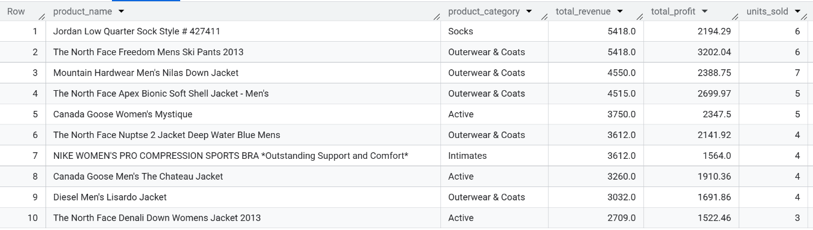
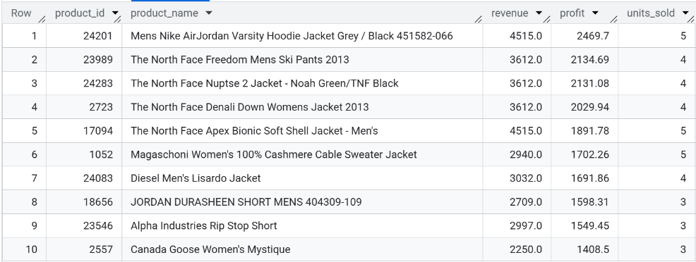

# E-commerce Revenue & Returns Analysis (SQL)

This project analyzes sales and returns data from the BigQuery **thelook_ecommerce** dataset to uncover revenue drivers, product performance, return patterns, and operational insights.

---

## Objectives

- Identify key revenue and profit drivers
- Analyze return behavior by product and category
- Evaluate customer purchasing patterns
- Demonstrate advanced SQL techniques (CTEs, joins, window functions, aggregations)

---

## SQL Techniques Demonstrated

- Multi-table joins
- Aggregations and GROUP BY
- Common Table Expressions (CTEs)
- Window functions (RANK, ROW_NUMBER)
- CASE statements
- Date/time analysis
- Subqueries
- Filtering and segmentation

---

## Dataset

Source: BigQuery Public Dataset – `thelook_ecommerce`

Tables used:
- orders
- order_items
- products
- users

---

## Key Metrics (KPIs)

- Total Revenue
- Total Profit
- Units Sold
- Return Rate
- Average Order Value (AOV)
- Customer Lifetime Value (CLV)
- Monthly Revenue Growth

---

## Key Business Questions

- Which products and categories generate the most revenue and profit?
- Which products are returned most frequently?
- How do returns affect overall profitability?
- Which customers generate the highest lifetime value?
- How does revenue trend over time?

---

## Tools Used

- Google BigQuery (SQL)
- GitHub Pages (documentation)
- GitHub (version control)

---

## Analysis 1 - Top Products by Revenue

### Business Question
- Which products generate the highest revenue?

### SQL Query
```sql
SELECT 
  p.name AS product_name,
  p.category AS product_category,
  ROUND(SUM(oi.sale_price), 2) AS total_revenue,
  ROUND(SUM(oi.sale_price - p.cost), 2) AS total_profit,
  COUNT(*) AS units_sold
FROM `bigquery-public-data.thelook_ecommerce.products` p
JOIN `bigquery-public-data.thelook_ecommerce.order_items` oi
  ON p.id = oi.product_id
JOIN `bigquery-public-data.thelook_ecommerce.orders` o
  ON o.order_id = oi.order_id
WHERE o.status = 'Complete'
GROUP BY product_name, product_category
ORDER BY total_revenue DESC
LIMIT 10;
```

### Result Table


### Insights
- The highest-revenue products are dominated by premium outerwear brands (North Face, Canada Goose).
- Outerwear & Coats appears multiple times in the top 10, indicating category concentration.
- Top products generate both high revenue and strong profit margins, suggesting pricing power.
- Unit sales are relatively balanced among top products, implying revenue is driven more by price than volume.

### Business Recommendations
- Prioritize inventory and marketing spend on top-performing outerwear products.
- Bundle or cross-sell accessories with premium jackets to increase AOV.
- Analyze return rates for these top products to ensure high revenue is not offset by returns.
- Negotiate supplier costs for high-volume premium brands to improve margins further.

---

## Analysis 2 - Top Products by Profit

### Business Question
- Which products generate the highest profit?

### SQL Query
```sql
WITH product_profit AS (
  SELECT
    p.id AS product_id,
    p.name AS product_name,
    ROUND(SUM(oi.sale_price), 2) AS revenue,
    ROUND(SUM(oi.sale_price - p.cost), 2) AS profit,
    COUNT(*) AS units_sold
  FROM `bigquery-public-data.thelook_ecommerce.order_items` oi
  JOIN `bigquery-public-data.thelook_ecommerce.orders` o
    ON oi.order_id = o.order_id
  JOIN `bigquery-public-data.thelook_ecommerce.products` p
    ON oi.product_id = p.id
  WHERE o.status = 'Complete'
  GROUP BY p.id, p.name
)

SELECT *
FROM product_profit
ORDER BY profit DESC
LIMIT 10;
```

### Result Table


### Insights
- Profit is highly concentrated among a small number of products, indicating that a limited subset of the catalog drives a disproportionate share of total profit.
- Most top-profit products are premium outerwear and apparel items (jackets, hoodies, ski pants), suggesting higher margins compared to lower-priced categories.
- Several products achieve high profit despite relatively low unit sales, indicating that per-unit margin is a more important driver of profitability than sales volume for these items.
- Well-known premium brands (e.g., Nike/Jordan, The North Face, Canada Goose) appear frequently in the top results, highlighting the impact of brand positioning and pricing power.
- Revenue and profit rankings are similar but not identical, reinforcing that revenue alone does not fully capture business performance.


### Business Recommendations
- Prioritize inventory availability for these high-profit products to avoid stockouts, especially during peak seasonal demand.
- Increase marketing visibility for these items through homepage placement, targeted email campaigns, and paid advertising to maximize profit contribution.
- Test modest price increases on top-profit products to evaluate demand sensitivity while potentially improving margins further.
- Create product bundles or cross-sell complementary items (e.g., accessories or base layers) to increase average order value without relying on heavy discounting.
- Closely monitor return rates for these products to ensure high profitability is not offset by reverse-logistics and refund costs.
