<a href="/projects/" class="back-to-projects btn">&larr; Back to Projects</a>

# Supply Chain Demand Forecasting, Inventory Optimization &amp; MRP Simulation

> An end-to-end, automated supply chain analytics solution demonstrating demand forecasting, inventory optimization, MRP simulation, and fulfillment performance analysis &mdash; built with Oracle SQL, Excel Power Query, and Power BI using the DataCo Smart Supply Chain dataset (~180,000 orders).

**Tools:** Oracle SQL &middot; Excel (Power Query, Power Pivot, Solver) &middot; Power BI (DAX, Star Schema) &middot; Git/GitHub

---

  
<strong>Project Overview</strong>

  

  <h3>Overview</h3>
  

    This project builds an end-to-end, automated supply chain analytics solution focused on demand forecasting,
    inventory optimization, MRP simulation, and fulfillment performance for a consumer goods product catalog. The
    analysis uses the DataCo Smart Supply Chain dataset (~180,000 order records) loaded into an Oracle Autonomous
    Database, processed through Excel Power Query, and visualized in a six-page Power BI dashboard.
  

  

    What distinguishes this project is the <strong>automation layer</strong> built into every stage: Oracle stored procedures
    automate data extraction and MRP calculation on a nightly schedule, Power Query custom functions automate
    transformation logic across hundreds of SKUs, and Power BI scheduled refresh pushes updated dashboards to
    stakeholders without manual intervention. The result is a closed-loop system where reporting findings feed back
    into master data updates and the next refresh cycle automatically reflects those changes.
  

  <h3>Business Context</h3>
  

    Consumer goods manufacturers managing hundreds of SKUs across multiple channels need to answer: How much of
    each product should we produce? When do we reorder? Are we delivering on time? Where are our bottlenecks?
    Are planned values tracking against actuals? This project directly models those questions using the same tools
    and workflows used in production supply chain environments &mdash; SQL against Oracle for data extraction,
    Excel for analysis and modeling, and Power BI for dashboards and reporting.
  

  <h3>Technical Stack</h3>
  <ul>
    <li><strong>Database / ERP Layer:</strong> Oracle Autonomous Database (Always Free tier) &mdash; SQL for extraction, joins, aggregation, view creation; stored procedures for automated refresh and MRP calculation; DBMS_SCHEDULER for nightly execution</li>
    <li><strong>MRP / Supply Planning Simulation:</strong> Oracle SQL tables and views simulating MRP net requirements logic &mdash; gross requirements, projected on-hand, net requirements, planned order releases with lead time offsets and lot sizing rules</li>
    <li><strong>Data Processing &amp; ETL:</strong> Excel Power Query with custom M functions, parameters for dynamic switching, and query folding documentation</li>
    <li><strong>Analysis &amp; Modeling:</strong> Excel formulas, pivot tables, Power Pivot data model, Goal Seek, Solver for lot sizing optimization, What-If analysis</li>
    <li><strong>Forecasting &amp; Demand Planning:</strong> Excel Forecast Sheet (ETS algorithm), moving averages, forecast write-back to Oracle</li>
    <li><strong>Dashboards &amp; Reporting:</strong> Power BI Desktop (six-page report with DAX measures, slicers, drilldowns, data alerts, Row-Level Security)</li>
  </ul>

  <h3>Dataset</h3>
  

    <strong>DataCo Smart Supply Chain Dataset (Kaggle)</strong> &mdash; ~180,000 order records with product categories,
    customer segments, order dates, shipping modes, scheduled vs. actual delivery dates, late delivery flags,
    geographic data, and financial metrics (sales, profit, discounts). Loaded into Oracle Autonomous Database
    with a normalized relational schema (ORDERS, ORDER_ITEMS, PRODUCTS, CUSTOMERS, SHIPMENTS, FORECAST_PLAN,
    MRP_REQUIREMENTS, INVENTORY_SNAPSHOT).
  

  
<strong>Automation Architecture</strong>

  

  <h3>The Full Automated Pipeline: Oracle &rarr; Power Query &rarr; Power BI</h3>
  <ol>
    <li><strong>Oracle DBMS_SCHEDULER</strong> executes the <code>REFRESH_SUPPLY_CHAIN_DATA</code> stored procedure at 2:00 AM &mdash; pulls fresh data, recalculates derived fields, reads the latest demand forecast, runs MRP net requirements calculation, writes planned orders, and updates all six reporting views.</li>
    <li><strong>Power BI Service scheduled refresh</strong> triggers at 5:00 AM &mdash; connects to Oracle views, Power Query custom functions and parameters execute automatically against updated data.</li>
    <li><strong>DAX measures</strong> recalculate all KPIs, forecasts, MRP coverage metrics, and classifications. Data alerts evaluate thresholds and send notifications if critical metrics breach targets.</li>
    <li><strong>By morning</strong>, the dashboard would reflect last night&rsquo;s actuals, MRP recommendations would be current, and supply plan alerts would have been sent for any issues &mdash; enabling the analyst to focus on analysis and decision-making rather than data preparation.</li>
  </ol>

  

    <strong>Portfolio Context:</strong>
    This project uses the DataCo Smart Supply Chain dataset, which is a static historical dataset (~180,000 orders, Jan 2015&ndash;Jan 2018) &mdash; no new transactions are flowing in. That means the automation infrastructure described above is built and functional, but is not actively processing new data on a nightly cycle. Specifically:
    <ul style="margin: 8px 0 0 0; padding-left: 20px;">
      <li>The <strong>stored procedure</strong> (<code>REFRESH_SUPPLY_CHAIN_DATA</code>) executes correctly when called &mdash; it refreshes inventory snapshots, runs the full MRP net requirements calculation, and rebuilds all six reporting views. It has been tested and validated end-to-end.</li>
      <li>The <strong>DBMS_SCHEDULER job</strong> is configured with a nightly 2:00 AM schedule using the same mechanism as production Oracle Fusion Cloud environments.</li>
      <li>The <strong>forecast write-back round-trip</strong> works end-to-end &mdash; 42 forecast rows exported from Excel were loaded into Oracle&rsquo;s FORECAST_PLAN table, consumed by the MRP procedure, and validated with zero variance.</li>
      <li><strong>Power Query transformations</strong> are saved and repeatable &mdash; clicking Refresh All re-executes the full ETL pipeline.</li>
      <li><strong>DAX measures</strong> auto-recalculate whenever the underlying data model refreshes.</li>
      <li>The dashboard is not currently published to Power BI Service with a live Oracle gateway, so <strong>scheduled refresh is not actively running</strong> &mdash; but the architecture is in place for it.</li>
    </ul>
    In a production environment with live transactional data flowing into Oracle, this entire pipeline would operate autonomously on the configured schedule with no manual intervention for routine reporting cycles. The infrastructure is production-ready; the dataset is what makes this a portfolio demonstration rather than a live system.
  

  <h3>Oracle SQL Automation</h3>
  <ul>
    <li><strong>Reporting Views:</strong> Six pre-calculated views (VW_DEMAND_TIMESERIES, VW_FULFILLMENT_KPI, VW_PRODUCT_MASTER, VW_PLANNED_VS_ACTUAL, VW_MRP_PLAN, VW_FORECAST_VS_ACTUAL) defined once, reused on every refresh</li>
    <li><strong>Stored Procedure:</strong> <code>REFRESH_SUPPLY_CHAIN_DATA</code> wraps the full pipeline &mdash; staging table refresh, derived field calculation, MRP net requirements execution, view rebuild, and audit logging</li>
    <li><strong>Scheduled Job:</strong> DBMS_SCHEDULER runs the procedure nightly at 2:00 AM, same mechanism as production Oracle Fusion Cloud</li>
    <li><strong>CTEs &amp; Window Functions:</strong> Multi-stage calculations (cumulative revenue for ABC, rolling demand variability, MRP gross-to-net) structured as readable, modular CTEs</li>
  </ul>

  <h3>Power Query Automation</h3>
  <ul>
    <li><strong>Custom M Functions:</strong> fn_CalculateSafetyStock, fn_ClassifyABC, fn_ClassifyXYZ, fn_CalculateReorderPoint, fn_CalculateNetRequirements &mdash; write once, invoke across all categories</li>
    <li><strong>Parameters:</strong> Date (analysis window), Source (Oracle environment), Service Level (Z-score), Planning Horizon (3/6/12 months)</li>
    <li><strong>Query Folding:</strong> Documented which steps fold to Oracle vs. execute locally for performance optimization</li>
  </ul>

  <h3>Power BI Automation</h3>
  <ul>
    <li><strong>Scheduled Refresh:</strong> Designed to align with the Oracle job schedule via Power BI Service &mdash; architecture is in place, pending live gateway connection</li>
    <li><strong>DAX Measures:</strong> Auto-calculating KPIs &mdash; YoY growth, on-time rate, forecast accuracy (MAE, MAPE), inventory turnover, MRP coverage ratio, supply plan adherence</li>
    <li><strong>Data Alerts:</strong> Threshold notifications for in-stock rate drops, late delivery spikes, MRP stockout projections, forecast bias</li>
    <li><strong>Row-Level Security:</strong> Marketing sees sell-through data; Operations sees production, fulfillment, MRP, and inventory</li>
  </ul>

  
<strong>Phase 1 – Oracle SQL: Schema Design &amp; Data Loading</strong>

  

  <h3>Schema Design</h3>
  

    The flat DataCo CSV (~180,000 rows, 53 columns) was decomposed into a normalized relational schema consisting of
    5 transactional tables and 3 supply planning tables. A staging table (<strong>STG_DATACO</strong>) mirrors the flat CSV
    structure for initial data load via Oracle Database Actions import tool, after which INSERT/SELECT statements
    normalize the data into the production tables.
  

  <ul>
    <li><strong>ORDERS</strong> &mdash; Order header: order ID, order date, customer ID, status, market, region</li>
    <li><strong>ORDER_ITEMS</strong> &mdash; Line-item detail: quantity, unit price, discount, profit, sales</li>
    <li><strong>PRODUCTS</strong> &mdash; Product master: category, department, price, plus planning parameters (lead time days, lot sizing method, minimum order quantity, EOQ, safety stock, reorder point)</li>
    <li><strong>CUSTOMERS</strong> &mdash; Customer master: segment, city, state, country, zip code</li>
    <li><strong>SHIPMENTS</strong> &mdash; Fulfillment: shipping mode, shipping date, scheduled vs. actual days, delivery status, late delivery risk flag</li>
    <li><strong>FORECAST_PLAN</strong> &mdash; Demand forecast output: category, forecast period, forecasted quantity, method, confidence bounds</li>
    <li><strong>MRP_REQUIREMENTS</strong> &mdash; MRP output: gross requirements, scheduled receipts, projected on-hand, net requirements, planned order quantity/release date, lot sizing method, exception flags</li>
    <li><strong>INVENTORY_SNAPSHOT</strong> &mdash; Simulated current inventory positions derived from order/shipment data</li>
  </ul>
  

    Primary keys, foreign keys, and indexes were defined across all tables. Planning parameter columns were added to
    PRODUCTS to enable MRP simulation directly within the Oracle layer.
  

  <h4>PRODUCTS Table with Planning Parameters</h4>
  <pre><code class="language-sql">CREATE TABLE PRODUCTS (
    PRODUCT_CARD_ID     NUMBER(10)      NOT NULL,
    PRODUCT_NAME        VARCHAR2(300)   NOT NULL,
    CATEGORY_ID         NUMBER(10)      NOT NULL,
    CATEGORY_NAME       VARCHAR2(150)   NOT NULL,
    DEPARTMENT_ID       NUMBER(10)      NOT NULL,
    DEPARTMENT_NAME     VARCHAR2(100)   NOT NULL,
    PRODUCT_PRICE       NUMBER(12,2)    NOT NULL,
    PRODUCT_STATUS      NUMBER(1)       DEFAULT 0,
    -- Planning parameters (populated during inventory optimization phase)
    LEAD_TIME_DAYS      NUMBER(5)       DEFAULT 7,
    LOT_SIZING_METHOD   VARCHAR2(20)    DEFAULT 'EOQ',
    MIN_ORDER_QTY       NUMBER(10)      DEFAULT 1,
    EOQ                 NUMBER(12,2),
    SAFETY_STOCK        NUMBER(12,2),
    REORDER_POINT       NUMBER(12,2),
    CONSTRAINT PK_PRODUCTS PRIMARY KEY (PRODUCT_CARD_ID)
);</code></pre>
  

    <strong>What it does:</strong> Creates the product master table with both catalog attributes (name, category, price) and supply planning parameters (lead time, lot sizing method, EOQ, safety stock, reorder point). 
    <strong>Why it&rsquo;s included:</strong> Embedding planning parameters directly on the product record allows the MRP stored procedure to read everything it needs from a single table &mdash; no separate planning parameter file or lookup table required. 
    <strong>Why it&rsquo;s written this way:</strong> DEFAULT values (e.g., 7-day lead time, EOQ lot sizing) give every product sensible planning defaults on load, so MRP can run immediately without manual setup. Nullable columns like EOQ and SAFETY_STOCK are left empty until the inventory optimization phase populates them with calculated values.
  

  <h4>MRP Requirements Table</h4>
  <pre><code class="language-sql">CREATE TABLE MRP_REQUIREMENTS (
    MRP_ID              NUMBER(10)      GENERATED ALWAYS AS IDENTITY NOT NULL,
    CATEGORY_NAME       VARCHAR2(150)   NOT NULL,
    PLANNING_PERIOD     DATE            NOT NULL,
    GROSS_REQUIREMENTS  NUMBER(12,2)    DEFAULT 0,
    SCHEDULED_RECEIPTS  NUMBER(12,2)    DEFAULT 0,
    PROJECTED_ON_HAND   NUMBER(12,2)    DEFAULT 0,
    NET_REQUIREMENTS    NUMBER(12,2)    DEFAULT 0,
    PLANNED_ORDER_QTY   NUMBER(12,2)    DEFAULT 0,
    PLANNED_RELEASE_DATE DATE,
    LOT_SIZING_METHOD   VARCHAR2(20),
    EXCEPTION_FLAG      VARCHAR2(50),
    EXCEPTION_MESSAGE   VARCHAR2(500),
    CONSTRAINT PK_MRP_REQUIREMENTS PRIMARY KEY (MRP_ID)
);</code></pre>
  

    <strong>What it does:</strong> Stores the output of every MRP run &mdash; one row per category per planning period &mdash; capturing gross requirements, scheduled receipts, projected on-hand, net requirements, planned order quantities, and any exception flags. 
    <strong>Why it&rsquo;s included:</strong> Persisting MRP output as a table (rather than a transient calculation) enables Power BI to trend MRP results over time, compare successive runs, and surface exception alerts without re-executing the procedure. 
    <strong>Why it&rsquo;s written this way:</strong> The identity column (GENERATED ALWAYS AS IDENTITY) auto-generates a surrogate key so the stored procedure can INSERT without managing sequences. Exception columns (flag + message) support the alerting workflow &mdash; the procedure writes EXPEDITE, RESCHEDULE, or SPLIT flags that Power BI data alerts monitor on each refresh.
  

  <h4>Data Normalization &mdash; ROW_NUMBER Deduplication</h4>
  <pre><code class="language-sql">-- Deduplicate customers from staging (one row per order item → one row per customer)
INSERT INTO CUSTOMERS (
    CUSTOMER_ID, FIRST_NAME, LAST_NAME, EMAIL, SEGMENT,
    CITY, STATE, COUNTRY, STREET, ZIPCODE, LATITUDE, LONGITUDE
)
SELECT
    CUSTOMER_ID, NVL(CUSTOMER_FNAME, 'Unknown'), NVL(CUSTOMER_LNAME, 'Unknown'),
    CUSTOMER_EMAIL, NVL(CUSTOMER_SEGMENT, 'Unknown'),
    CUSTOMER_CITY, CUSTOMER_STATE, CUSTOMER_COUNTRY,
    CUSTOMER_STREET, CUSTOMER_ZIPCODE, LATITUDE, LONGITUDE
FROM (
    SELECT s.*,
        ROW_NUMBER() OVER (PARTITION BY s.CUSTOMER_ID ORDER BY s.ORDER_DATE DESC) AS rn
    FROM STG_DATACO s
)
WHERE rn = 1;</code></pre>
  

    <strong>What it does:</strong> Extracts one clean customer record per CUSTOMER_ID from the flat staging table, which contains duplicate customer rows (one per order item). 
    <strong>Why it&rsquo;s included:</strong> The raw DataCo CSV is denormalized &mdash; customer data is repeated on every order line. This INSERT/SELECT normalizes customers into their own table, a prerequisite for building proper foreign key relationships and avoiding redundant storage. 
    <strong>Why it&rsquo;s written this way:</strong> ROW_NUMBER() OVER (PARTITION BY CUSTOMER_ID ORDER BY ORDER_DATE DESC) keeps the most recent address for each customer, handling cases where a customer&rsquo;s details changed across orders. NVL wraps ensure no NULLs slip into required fields, replacing missing names with &lsquo;Unknown&rsquo; rather than failing the insert.
  

  

    <strong>SQL Scripts:</strong>
    <a href="sql/01_schema_ddl.sql">01_schema_ddl.sql</a> &mdash; Schema DDL (8 normalized tables + staging table) |
    <a href="sql/02_data_normalization.sql">02_data_normalization.sql</a> &mdash; INSERT/SELECT normalization from staging to production tables
  

  
<strong>Phase 2 – Oracle SQL: Queries, Views &amp; Stored Procedures</strong>

  

  <h3>SQL Query Categories</h3>

  

    Five query groups extract, transform, and classify supply chain data across ~180K order items and 50 product categories.
    SQL techniques include CTEs, window functions (AVG OVER, SUM OVER, LAG, RANK, DENSE_RANK), date arithmetic, and cumulative calculations.
  

  <ul>
    <li><strong>Demand &amp; Sales Extraction</strong> (<a href="sql/03_demand_queries.sql">03_demand_queries.sql</a>) &mdash; Monthly/weekly order volume by category, rolling 3- and 6-month averages, MoM growth via LAG, cumulative revenue for Pareto analysis, and coefficient of variation for XYZ classification</li>
    <li><strong>Inventory &amp; Fulfillment Analytics</strong> (<a href="sql/04_inventory_fulfillment_queries.sql">04_inventory_fulfillment_queries.sql</a>) &mdash; ABC classification via cumulative revenue percentage, ABC-XYZ policy matrix, product master with planning parameters, on-time delivery rates, lead time variance, and late delivery root cause ranking</li>
    <li><strong>Planned vs. Actual Analysis</strong> &mdash; Lead time variance, on-time delivery rate, late delivery root cause ranking</li>
    <li><strong>MRP &amp; Supply Planning</strong> &mdash; Gross requirements, projected on-hand, net requirements, planned order releases, exception flagging</li>
    <li><strong>Forecast Accuracy</strong> &mdash; Forecast vs. actual comparison, MAE, MAPE, bias detection</li>
  </ul>

  <h4>Rolling Averages &amp; Demand Variability (XYZ Classification)</h4>
  <pre><code class="language-sql">-- Rolling 3-month and 6-month demand averages using window functions
WITH monthly_demand AS (
    SELECT
        TRUNC(o.ORDER_DATE, 'MM')       AS ORDER_MONTH,
        p.CATEGORY_NAME,
        SUM(oi.QUANTITY)                 AS TOTAL_UNITS,
        ROUND(SUM(oi.SALES), 2)         AS REVENUE
    FROM ORDER_ITEMS oi
    JOIN ORDERS o ON oi.ORDER_ID = o.ORDER_ID
    JOIN PRODUCTS p ON oi.PRODUCT_CARD_ID = p.PRODUCT_CARD_ID
    WHERE o.ORDER_STATUS NOT IN ('CANCELED', 'SUSPECTED_FRAUD')
    GROUP BY TRUNC(o.ORDER_DATE, 'MM'), p.CATEGORY_NAME
)
SELECT
    ORDER_MONTH, CATEGORY_NAME, TOTAL_UNITS, REVENUE,
    ROUND(AVG(TOTAL_UNITS) OVER (
        PARTITION BY CATEGORY_NAME ORDER BY ORDER_MONTH
        ROWS BETWEEN 2 PRECEDING AND CURRENT ROW
    ), 2) AS ROLLING_3M_AVG_UNITS,
    ROUND(AVG(TOTAL_UNITS) OVER (
        PARTITION BY CATEGORY_NAME ORDER BY ORDER_MONTH
        ROWS BETWEEN 5 PRECEDING AND CURRENT ROW
    ), 2) AS ROLLING_6M_AVG_UNITS
FROM monthly_demand
ORDER BY CATEGORY_NAME, ORDER_MONTH;</code></pre>
  

    <strong>What it does:</strong> Aggregates order quantity and revenue by month and category, then calculates 3-month and 6-month rolling averages using window functions. 
    <strong>Why it&rsquo;s included:</strong> Rolling averages smooth out month-to-month noise, giving demand planners a clearer trend signal. The 3-month window captures short-term momentum while the 6-month window reveals broader seasonal patterns &mdash; both are inputs to the forecasting comparison in Excel. 
    <strong>Why it&rsquo;s written this way:</strong> A CTE (monthly_demand) first aggregates the raw order data, then the outer SELECT applies window functions over the pre-aggregated rows. This two-stage approach keeps the window frame simple and avoids mixing aggregation with windowing in the same query. The ROWS BETWEEN clause is explicit rather than using the default RANGE to ensure exactly N prior rows are included regardless of gaps in the date series.
  

  <pre><code class="language-sql">-- Demand variability for XYZ classification (coefficient of variation)
WITH monthly_demand AS ( ... ),
variability AS (
    SELECT
        CATEGORY_NAME,
        ROUND(AVG(MONTHLY_UNITS), 2)    AS AVG_MONTHLY_DEMAND,
        ROUND(STDDEV(MONTHLY_UNITS), 2) AS STDDEV_DEMAND,
        ROUND(STDDEV(MONTHLY_UNITS) / NULLIF(AVG(MONTHLY_UNITS), 0), 4)
                                         AS COEFF_OF_VARIATION
    FROM monthly_demand
    GROUP BY CATEGORY_NAME
)
SELECT CATEGORY_NAME, AVG_MONTHLY_DEMAND, COEFF_OF_VARIATION,
    CASE
        WHEN COEFF_OF_VARIATION &lt;= 0.5 THEN 'X'   -- Stable demand
        WHEN COEFF_OF_VARIATION &lt;= 1.0 THEN 'Y'   -- Moderate variability
        ELSE                                 'Z'    -- Highly volatile
    END AS XYZ_CLASS
FROM variability
ORDER BY COEFF_OF_VARIATION;</code></pre>
  

    <strong>What it does:</strong> Calculates the coefficient of variation (standard deviation / mean) for each category&rsquo;s monthly demand, then classifies it as X (stable, CV &le; 0.5), Y (moderate, CV &le; 1.0), or Z (volatile). 
    <strong>Why it&rsquo;s included:</strong> XYZ classification is the demand-predictability half of the ABC-XYZ inventory matrix. Categories with stable demand (X) can use lean safety stock and automated replenishment, while volatile categories (Z) need larger buffers or manual review &mdash; this directly drives the inventory policy recommendations downstream. 
    <strong>Why it&rsquo;s written this way:</strong> NULLIF(AVG(...), 0) prevents division-by-zero for categories with no demand history. The CASE thresholds (0.5 and 1.0) follow standard supply chain practice for CV-based classification. Stacking two CTEs (monthly_demand &rarr; variability) keeps each calculation layer readable and testable independently.
  

  <h4>ABC Classification (Pareto Analysis) &amp; ABC-XYZ Policy Matrix</h4>
  <pre><code class="language-sql">-- ABC Classification by cumulative revenue percentage
WITH category_revenue AS (
    SELECT p.CATEGORY_NAME, ROUND(SUM(oi.SALES), 2) AS TOTAL_REVENUE,
           SUM(oi.QUANTITY) AS TOTAL_UNITS
    FROM ORDER_ITEMS oi
    JOIN PRODUCTS p ON oi.PRODUCT_CARD_ID = p.PRODUCT_CARD_ID
    JOIN ORDERS o ON oi.ORDER_ID = o.ORDER_ID
    WHERE o.ORDER_STATUS NOT IN ('CANCELED', 'SUSPECTED_FRAUD')
    GROUP BY p.CATEGORY_NAME
),
ranked AS (
    SELECT CATEGORY_NAME, TOTAL_REVENUE, TOTAL_UNITS,
        ROUND(SUM(TOTAL_REVENUE) OVER (
            ORDER BY TOTAL_REVENUE DESC
            ROWS BETWEEN UNBOUNDED PRECEDING AND CURRENT ROW
        ) * 100.0 / SUM(TOTAL_REVENUE) OVER (), 2) AS CUMULATIVE_PCT
    FROM category_revenue
)
SELECT CATEGORY_NAME, TOTAL_REVENUE, CUMULATIVE_PCT,
    CASE
        WHEN CUMULATIVE_PCT &lt;= 80 THEN 'A'
        WHEN CUMULATIVE_PCT &lt;= 95 THEN 'B'
        ELSE 'C'
    END AS ABC_CLASS
FROM ranked
ORDER BY TOTAL_REVENUE DESC;</code></pre>
  

    <strong>What it does:</strong> Ranks product categories by total revenue, computes a running cumulative revenue percentage, and assigns each category an ABC class: A (top 80% of revenue), B (next 15%), or C (bottom 5%). 
    <strong>Why it&rsquo;s included:</strong> ABC classification is the foundation of Pareto-based inventory management &mdash; it identifies which categories drive the bulk of revenue so the business can allocate planning effort accordingly. A-class items get the tightest controls; C-class items get the lightest touch. 
    <strong>Why it&rsquo;s written this way:</strong> The cumulative percentage is computed with a window SUM ordered by revenue descending, divided by the total SUM across all rows. Using ROWS BETWEEN UNBOUNDED PRECEDING AND CURRENT ROW ensures a strict running total. Two CTEs (category_revenue &rarr; ranked) separate the aggregation from the cumulative calculation, making the query easier to debug and adapt if classification thresholds change.
  

  <pre><code class="language-sql">-- ABC-XYZ matrix with automated inventory policy recommendations
SELECT a.CATEGORY_NAME, a.ABC_CLASS, x.XYZ_CLASS,
    a.ABC_CLASS || '-' || x.XYZ_CLASS AS MATRIX_CELL,
    CASE
        WHEN a.ABC_CLASS = 'A' AND x.XYZ_CLASS = 'X'
            THEN 'JIT/Kanban – low safety stock, frequent small orders'
        WHEN a.ABC_CLASS = 'A' AND x.XYZ_CLASS = 'Y'
            THEN 'Moderate safety stock – demand-driven replenishment'
        WHEN a.ABC_CLASS = 'B' AND x.XYZ_CLASS = 'X'
            THEN 'Standard replenishment – EOQ with periodic review'
        WHEN a.ABC_CLASS = 'C' AND x.XYZ_CLASS = 'Z'
            THEN 'Evaluate for discontinuation – high risk, low reward'
        ...
    END AS INVENTORY_POLICY
FROM abc a
JOIN xyz x ON a.CATEGORY_NAME = x.CATEGORY_NAME
ORDER BY a.ABC_CLASS, x.XYZ_CLASS;</code></pre>
  

    <strong>What it does:</strong> Joins the ABC and XYZ classification results to build a 3&times;3 matrix, then maps each cell (e.g., A-X, B-Y, C-Z) to a specific inventory policy recommendation. 
    <strong>Why it&rsquo;s included:</strong> The combined ABC-XYZ matrix is the decision framework that turns two separate analytics (revenue rank and demand stability) into actionable replenishment strategies. Without it, the ABC and XYZ classifications exist in isolation and don&rsquo;t translate into concrete operational guidance. 
    <strong>Why it&rsquo;s written this way:</strong> A CASE expression maps each matrix cell to a plain-English policy (JIT/Kanban, EOQ with periodic review, evaluate for discontinuation, etc.) so the output is immediately interpretable by supply chain stakeholders. Concatenating ABC_CLASS || &rsquo;-&rsquo; || XYZ_CLASS into a MATRIX_CELL column provides a compact label for Power BI slicers and conditional formatting.
  

  <h4>On-Time Delivery Rate &amp; Late Delivery Root Cause Ranking</h4>
  <pre><code class="language-sql">-- Monthly on-time delivery rate
SELECT
    TRUNC(o.ORDER_DATE, 'MM') AS ORDER_MONTH,
    COUNT(s.SHIPMENT_ID) AS TOTAL_SHIPMENTS,
    ROUND(
        SUM(CASE WHEN s.DELIVERY_STATUS IN ('Shipping on time', 'Advance shipping')
            THEN 1 ELSE 0 END) * 100.0 / NULLIF(COUNT(s.SHIPMENT_ID), 0), 2
    ) AS ON_TIME_PCT,
    ROUND(
        SUM(CASE WHEN s.DELIVERY_STATUS = 'Late delivery'
            THEN 1 ELSE 0 END) * 100.0 / NULLIF(COUNT(s.SHIPMENT_ID), 0), 2
    ) AS LATE_PCT
FROM SHIPMENTS s
JOIN ORDER_ITEMS oi ON s.ORDER_ITEM_ID = oi.ORDER_ITEM_ID
JOIN ORDERS o ON oi.ORDER_ID = o.ORDER_ID
GROUP BY TRUNC(o.ORDER_DATE, 'MM')
ORDER BY ORDER_MONTH;</code></pre>
  

    <strong>What it does:</strong> Calculates the monthly on-time delivery rate and late delivery rate as percentages of total shipments, using conditional aggregation (CASE WHEN inside SUM). 
    <strong>Why it&rsquo;s included:</strong> On-time delivery rate is a core supply chain KPI &mdash; trending it monthly reveals whether fulfillment performance is improving or degrading, and provides the baseline metric for the Power BI fulfillment dashboard page and data alerts. 
    <strong>Why it&rsquo;s written this way:</strong> Conditional CASE expressions inside SUM avoid the need for subqueries or self-joins, keeping the query compact and performant over 180K order items. NULLIF in the denominator guards against division by zero in months with no shipment data. Both on-time and late percentages are computed in the same pass to ensure they&rsquo;re always consistent.
  

  <pre><code class="language-sql">-- Late delivery root cause ranking by category using DENSE_RANK
SELECT p.CATEGORY_NAME,
    COUNT(s.SHIPMENT_ID) AS TOTAL_SHIPMENTS,
    SUM(CASE WHEN s.LATE_DELIVERY_RISK = 1 THEN 1 ELSE 0 END) AS LATE_DELIVERIES,
    ROUND(
        SUM(CASE WHEN s.LATE_DELIVERY_RISK = 1 THEN 1 ELSE 0 END)
        * 100.0 / NULLIF(COUNT(s.SHIPMENT_ID), 0), 2
    ) AS LATE_DELIVERY_PCT,
    DENSE_RANK() OVER (
        ORDER BY SUM(CASE WHEN s.LATE_DELIVERY_RISK = 1 THEN 1 ELSE 0 END)
        * 100.0 / NULLIF(COUNT(s.SHIPMENT_ID), 0) DESC
    ) AS LATE_RANK
FROM SHIPMENTS s
JOIN ORDER_ITEMS oi ON s.ORDER_ITEM_ID = oi.ORDER_ITEM_ID
JOIN PRODUCTS p ON oi.PRODUCT_CARD_ID = p.PRODUCT_CARD_ID
GROUP BY p.CATEGORY_NAME
ORDER BY LATE_DELIVERY_PCT DESC;</code></pre>
  

    <strong>What it does:</strong> Ranks product categories by their late delivery percentage using DENSE_RANK, so operations teams can immediately see which categories have the worst fulfillment performance. 
    <strong>Why it&rsquo;s included:</strong> Identifying the highest-risk categories by late delivery rate enables targeted root cause analysis &mdash; instead of investigating all categories equally, the operations team focuses on the top offenders first. This feeds directly into the fulfillment improvement recommendations. 
    <strong>Why it&rsquo;s written this way:</strong> DENSE_RANK (rather than RANK or ROW_NUMBER) ensures that categories with identical late delivery rates receive the same rank without gaps, giving an honest picture when multiple categories are tied. The ranking is applied as a window function over the aggregated result, avoiding a separate subquery or CTE layer.
  

  <h3>Reporting Views</h3>
  

    Six views pre-aggregate data for Power Query and Power BI, eliminating repeated complex joins at the dashboard layer:
    <strong>VW_DEMAND_TIMESERIES</strong> (monthly demand with rolling averages),
    <strong>VW_FULFILLMENT_KPI</strong> (on-time rate, lead time, late delivery by category/mode),
    <strong>VW_PRODUCT_MASTER</strong> (SKU-level revenue, demand CV, ABC/XYZ inputs, planning parameters),
    <strong>VW_PLANNED_VS_ACTUAL</strong> (lead time and delivery date variances),
    <strong>VW_MRP_PLAN</strong> (gross/net requirements, projected on-hand, planned orders, exceptions),
    <strong>VW_FORECAST_VS_ACTUAL</strong> (forecast accuracy with MAE, MAPE, bias).
  

  <h4>VW_DEMAND_TIMESERIES &mdash; Monthly Demand with Rolling Averages &amp; YoY Comparison</h4>
  <pre><code class="language-sql">CREATE OR REPLACE VIEW VW_DEMAND_TIMESERIES AS
WITH monthly_raw AS (
    SELECT
        TRUNC(o.ORDER_DATE, 'MM')       AS ORDER_MONTH,
        p.CATEGORY_NAME,
        COUNT(oi.ORDER_ITEM_ID)         AS ITEM_COUNT,
        SUM(oi.QUANTITY)                 AS TOTAL_UNITS,
        ROUND(SUM(oi.SALES), 2)         AS REVENUE,
        COUNT(DISTINCT o.ORDER_ID)      AS ORDER_COUNT
    FROM ORDER_ITEMS oi
    JOIN ORDERS o ON oi.ORDER_ID = o.ORDER_ID
    JOIN PRODUCTS p ON oi.PRODUCT_CARD_ID = p.PRODUCT_CARD_ID
    WHERE o.ORDER_STATUS NOT IN ('CANCELED', 'SUSPECTED_FRAUD')
    GROUP BY TRUNC(o.ORDER_DATE, 'MM'), p.CATEGORY_NAME
)
SELECT ORDER_MONTH, CATEGORY_NAME, TOTAL_UNITS, REVENUE,
    ROUND(AVG(TOTAL_UNITS) OVER (
        PARTITION BY CATEGORY_NAME ORDER BY ORDER_MONTH
        ROWS BETWEEN 2 PRECEDING AND CURRENT ROW
    ), 2) AS ROLLING_3M_AVG_UNITS,
    ROUND(AVG(TOTAL_UNITS) OVER (
        PARTITION BY CATEGORY_NAME ORDER BY ORDER_MONTH
        ROWS BETWEEN 5 PRECEDING AND CURRENT ROW
    ), 2) AS ROLLING_6M_AVG_UNITS,
    LAG(TOTAL_UNITS, 12) OVER (
        PARTITION BY CATEGORY_NAME ORDER BY ORDER_MONTH
    ) AS UNITS_PRIOR_YEAR,
    CASE
        WHEN LAG(TOTAL_UNITS, 12) OVER (
            PARTITION BY CATEGORY_NAME ORDER BY ORDER_MONTH) > 0 THEN
            ROUND((TOTAL_UNITS - LAG(TOTAL_UNITS, 12) OVER (
                PARTITION BY CATEGORY_NAME ORDER BY ORDER_MONTH
            )) * 100.0 / LAG(TOTAL_UNITS, 12) OVER (
                PARTITION BY CATEGORY_NAME ORDER BY ORDER_MONTH), 2)
        ELSE NULL
    END AS YOY_CHANGE_PCT
FROM monthly_raw;</code></pre>
  

    <strong>What it does:</strong> Creates a reporting view that pre-calculates monthly demand by category with rolling 3- and 6-month averages, prior-year units, and year-over-year percentage change &mdash; all in a single queryable object. 
    <strong>Why it&rsquo;s included:</strong> This view is consumed directly by Power BI, eliminating the need to re-join ORDER_ITEMS, ORDERS, and PRODUCTS and re-compute rolling averages on every dashboard refresh. It also gives the demand forecasting page its trend-line and YoY comparison data. 
    <strong>Why it&rsquo;s written this way:</strong> LAG(TOTAL_UNITS, 12) looks back exactly 12 monthly rows per category to find the same month in the prior year. The YoY calculation is wrapped in a CASE to return NULL when there is no prior-year data (instead of dividing by zero). Defining this as a CREATE OR REPLACE VIEW means the stored procedure can rebuild it on every nightly run without needing DROP/CREATE logic.
  

  <h4>VW_FORECAST_VS_ACTUAL &mdash; Forecast Accuracy with Error Metrics</h4>
  <pre><code class="language-sql">CREATE OR REPLACE VIEW VW_FORECAST_VS_ACTUAL AS
SELECT
    f.CATEGORY_NAME, f.FORECAST_PERIOD, f.FORECASTED_QTY,
    f.FORECAST_METHOD, f.CONFIDENCE_LOWER, f.CONFIDENCE_UPPER,
    d.ACTUAL_UNITS, d.ACTUAL_REVENUE,
    ROUND(f.FORECASTED_QTY - d.ACTUAL_UNITS, 2)            AS FORECAST_ERROR,
    ROUND(ABS(f.FORECASTED_QTY - d.ACTUAL_UNITS), 2)       AS ABS_ERROR,
    CASE WHEN d.ACTUAL_UNITS > 0 THEN
        ROUND(ABS(f.FORECASTED_QTY - d.ACTUAL_UNITS) * 100.0
              / d.ACTUAL_UNITS, 2)
    ELSE NULL END                                           AS APE,
    CASE
        WHEN f.FORECASTED_QTY > d.ACTUAL_UNITS THEN 'OVER'
        WHEN f.FORECASTED_QTY &lt; d.ACTUAL_UNITS THEN 'UNDER'
        ELSE 'EXACT'
    END AS BIAS_DIRECTION
FROM FORECAST_PLAN f
LEFT JOIN (
    SELECT p.CATEGORY_NAME, TRUNC(o.ORDER_DATE, 'MM') AS ORDER_MONTH,
           SUM(oi.QUANTITY) AS ACTUAL_UNITS,
           ROUND(SUM(oi.SALES), 2) AS ACTUAL_REVENUE
    FROM ORDER_ITEMS oi
    JOIN ORDERS o ON oi.ORDER_ID = o.ORDER_ID
    JOIN PRODUCTS p ON oi.PRODUCT_CARD_ID = p.PRODUCT_CARD_ID
    WHERE o.ORDER_STATUS NOT IN ('CANCELED', 'SUSPECTED_FRAUD')
    GROUP BY p.CATEGORY_NAME, TRUNC(o.ORDER_DATE, 'MM')
) d ON f.CATEGORY_NAME = d.CATEGORY_NAME
    AND f.FORECAST_PERIOD = d.ORDER_MONTH;</code></pre>
  

    <strong>What it does:</strong> Creates a reporting view that joins forecasted quantities from FORECAST_PLAN against actual order data, computing the forecast error, absolute error, absolute percentage error (APE), and bias direction (over/under/exact) for each category and period. 
    <strong>Why it&rsquo;s included:</strong> Forecast accuracy metrics (MAE, MAPE, bias) are critical for evaluating and improving demand planning. This view provides the data behind the Power BI forecast accuracy dashboard page and enables data alerts when forecast bias exceeds acceptable thresholds. 
    <strong>Why it&rsquo;s written this way:</strong> A LEFT JOIN from FORECAST_PLAN to actuals ensures forecast periods without matching actuals still appear (e.g., future forecast periods). The actuals subquery filters out canceled and fraud orders so accuracy metrics reflect genuine demand. APE uses a CASE guard on ACTUAL_UNITS &gt; 0 to avoid division by zero for periods with no sales.
  

  

    <strong>SQL Scripts:</strong>
    <a href="sql/03_demand_queries.sql">03_demand_queries.sql</a> |
    <a href="sql/04_inventory_fulfillment_queries.sql">04_inventory_fulfillment_queries.sql</a> |
    <a href="sql/05_reporting_views.sql">05_reporting_views.sql</a>
  

  <h3>Stored Procedure &amp; Scheduling</h3>
  

    The <code>REFRESH_SUPPLY_CHAIN_DATA</code> procedure packages the full data refresh and MRP calculation into a single callable command:
    truncate staging tables, reload transactional data, recalculate derived fields, run MRP net requirements (gross-to-net netting, lot sizing, lead time offsetting, exception flagging),
    write planned orders to MRP_REQUIREMENTS, refresh all six reporting views, and log audit timestamps. DBMS_SCHEDULER runs this nightly at 2:00 AM.
  

  <h4>MRP Net Requirements Calculation &mdash; Core Loop</h4>
  <pre><code class="language-sql">-- For each category with forecast data, loop through planning periods
FOR period_rec IN (
    SELECT FORECAST_PERIOD, FORECASTED_QTY
    FROM FORECAST_PLAN
    WHERE CATEGORY_NAME = v_category
    ORDER BY FORECAST_PERIOD
) LOOP
    v_gross_req    := period_rec.FORECASTED_QTY;
    v_sched_rcpt   := 0;

    -- Projected On-Hand = prior on-hand - gross + scheduled receipts
    v_proj_on_hand := v_prior_on_hand - v_gross_req + v_sched_rcpt;

    -- Net Requirements = MAX(0, gross - prior on-hand - sched receipts)
    v_net_req := GREATEST(0, v_gross_req - v_prior_on_hand - v_sched_rcpt);

    -- Planned Order Qty (apply lot sizing: EOQ, FIXED_LOT, or LOT_FOR_LOT)
    IF v_net_req > 0 THEN
        CASE v_lot_method
            WHEN 'EOQ' THEN
                v_planned_qty := CEIL(v_net_req / GREATEST(v_lot_size, 1))
                                 * GREATEST(v_lot_size, 1);
            WHEN 'LOT_FOR_LOT' THEN
                v_planned_qty := v_net_req;
            ...
        END CASE;
        v_proj_on_hand := v_proj_on_hand + v_planned_qty;
    END IF;

    -- Exception Flagging
    IF v_proj_on_hand &lt; v_safety_stock THEN
        v_exception := 'EXPEDITE';
    END IF;
    IF v_release_date &lt; TRUNC(SYSDATE) THEN
        v_exception := 'RESCHEDULE';
    END IF;

    INSERT INTO MRP_REQUIREMENTS (...) VALUES (...);
    v_prior_on_hand := v_proj_on_hand;  -- carry forward
END LOOP;</code></pre>
  

    <strong>What it does:</strong> Iterates through each planning period for a product category, performing the classic MRP gross-to-net calculation: projected on-hand = prior on-hand &minus; gross requirements + scheduled receipts, net requirements = max(0, shortfall), then applies lot sizing (EOQ, fixed lot, or lot-for-lot) to determine the planned order quantity. 
    <strong>Why it&rsquo;s included:</strong> This is the core engine of the supply planning simulation &mdash; it translates demand forecasts into actionable planned orders with release dates, and flags exceptions (expedite if below safety stock, reschedule if past due) that surface as alerts in the Power BI dashboard. 
    <strong>Why it&rsquo;s written this way:</strong> A PL/SQL cursor loop (rather than pure SQL) is used because MRP is inherently sequential &mdash; each period&rsquo;s projected on-hand depends on the prior period&rsquo;s result, which cannot be expressed in a single set-based query. The CASE on lot sizing method makes the procedure data-driven: changing a product&rsquo;s LOT_SIZING_METHOD column automatically changes how planned orders are calculated on the next run.
  

  <h4>DBMS_SCHEDULER Job Creation</h4>
  <pre><code class="language-sql">BEGIN
    DBMS_SCHEDULER.CREATE_JOB(
        job_name        => 'JOB_REFRESH_SUPPLY_CHAIN',
        job_type        => 'STORED_PROCEDURE',
        job_action      => 'REFRESH_SUPPLY_CHAIN_DATA',
        start_date      => TRUNC(SYSDATE + 1) + INTERVAL '2' HOUR,  -- Next day 2:00 AM
        repeat_interval => 'FREQ=DAILY; BYHOUR=2; BYMINUTE=0; BYSECOND=0',
        enabled         => TRUE,
        auto_drop       => FALSE,
        comments        => 'Nightly refresh: inventory snapshot recalculation, '
                        || 'MRP net requirements calculation, and reporting view '
                        || 'data update. Runs at 2:00 AM daily.'
    );
END;</code></pre>
  

    <strong>What it does:</strong> Registers a DBMS_SCHEDULER job that executes the REFRESH_SUPPLY_CHAIN_DATA stored procedure every night at 2:00 AM automatically. 
    <strong>Why it&rsquo;s included:</strong> Scheduling is what turns a manual SQL workflow into an automated pipeline. With this job in place, fresh data, updated MRP results, and rebuilt reporting views are ready before Power BI&rsquo;s 5:00 AM scheduled refresh &mdash; stakeholders see current dashboards without anyone running scripts manually. 
    <strong>Why it&rsquo;s written this way:</strong> DBMS_SCHEDULER is Oracle&rsquo;s built-in job scheduler (the same mechanism used in production Oracle ERP environments like Fusion Cloud), so this mirrors real-world enterprise automation. The start_date uses TRUNC(SYSDATE + 1) + INTERVAL &rsquo;2&rsquo; HOUR to begin the next day at 2 AM, and auto_drop =&gt; FALSE ensures the job persists across database restarts.
  

  

    <strong>SQL Script:</strong> <a href="sql/06_stored_procedure_mrp.sql">06_stored_procedure_mrp.sql</a>
  

  
<strong>Phase 3 – Power Query ETL &amp; Custom Functions</strong>

  

  <h3>Core Transformation Steps</h3>
  

    Four Oracle view CSV exports were imported into Excel as structured tables. Transformations applied include
    datetime type fixes (set datetime type first, then Date Only as a separate step to avoid DataFormat.Error),
    null handling, text standardization, and proper data type assignment. Derived time features were created
    for downstream analysis: month, quarter, day of week, and fiscal period.
  

  <figure style="margin: 20px 0;">
    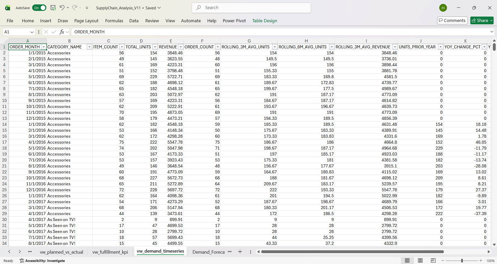
    <figcaption style="font-size: 0.95em; color: #555; margin-top: 8px;">
      vw_demand_timeseries &mdash; monthly demand by category with rolling 3-month and 6-month averages, prior year units, and YoY percent change. This Oracle view serves as the primary input for demand forecasting.
    </figcaption>
  </figure>

  <figure style="margin: 20px 0;">
    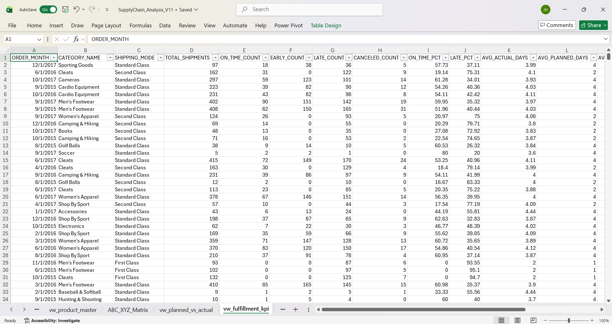
    <figcaption style="font-size: 0.95em; color: #555; margin-top: 8px;">
      vw_fulfillment_kpi &mdash; order-level fulfillment data including scheduled vs. actual ship dates, delivery status, and lead time metrics used for on-time delivery analysis.
    </figcaption>
  </figure>

  <figure style="margin: 20px 0;">
    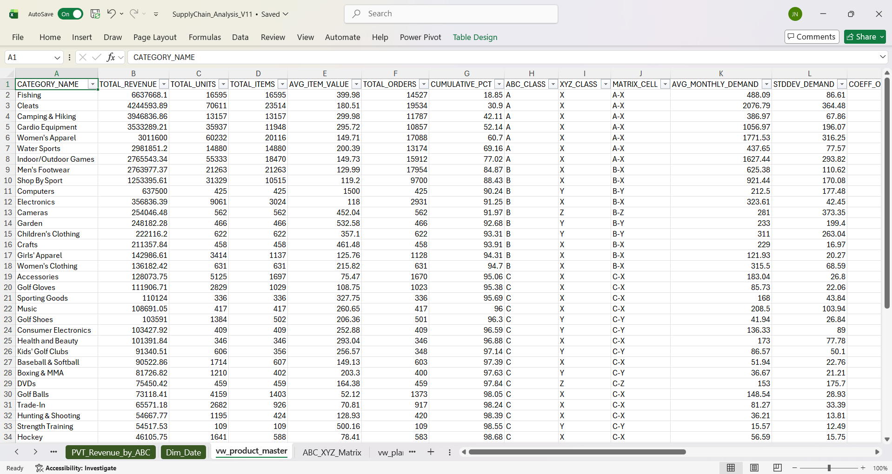
    <figcaption style="font-size: 0.95em; color: #555; margin-top: 8px;">
      vw_product_master &mdash; product catalog with ABC/XYZ classification, demand statistics, inventory positions (on-hand, in-transit, available), and days of supply per category.
    </figcaption>
  </figure>

  <figure style="margin: 20px 0;">
    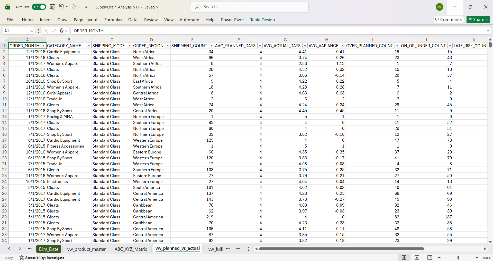
    <figcaption style="font-size: 0.95em; color: #555; margin-top: 8px;">
      vw_planned_vs_actual &mdash; plan vs. actual comparison at the category-month level, tracking revenue and unit variance for performance reporting.
    </figcaption>
  </figure>

  <h3>Custom M Functions</h3>
  <ul>
    <li><strong>fn_CalculateSafetyStock</strong> &mdash; Inputs: avg demand, demand std dev, lead time, service level Z-score</li>
    <li><strong>fn_ClassifyABC</strong> &mdash; Input: cumulative revenue %; Output: A/B/C classification</li>
    <li><strong>fn_ClassifyXYZ</strong> &mdash; Input: coefficient of variation; Output: X/Y/Z classification</li>
    <li><strong>fn_CalculateReorderPoint</strong> &mdash; Combines avg daily demand, lead time, and safety stock</li>
    <li><strong>fn_CalculateNetRequirements</strong> &mdash; Gross requirements minus projected on-hand minus scheduled receipts</li>
  </ul>

  <h3>Parameters &amp; Query Folding</h3>
  

    A Parameters sheet was created with named ranges &mdash; ServiceLevel, ZScore, PlanningHorizon, AnalysisStart,
    and AnalysisEnd &mdash; enabling dynamic switching between analysis windows, Oracle environments, and planning
    horizons (3/6/12 months) without modifying query logic. Query folding was documented for each transformation step,
    identifying which steps fold to Oracle (execute server-side) vs. execute locally in the Power Query engine.
  

  <figure style="margin: 20px 0;">
    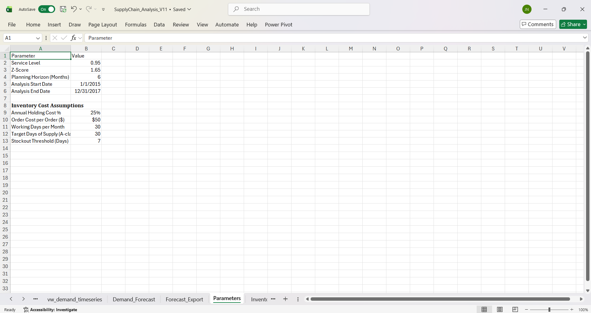
    <figcaption style="font-size: 0.95em; color: #555; margin-top: 8px;">
      Parameters sheet &mdash; centralized planning assumptions (service level, Z-score, planning horizon, cost inputs) referenced by all downstream calculations via named ranges. Changing a value here cascades through safety stock, reorder point, EOQ, and MRP formulas automatically.
    </figcaption>
  </figure>

  

    <strong>Excel Workbook:</strong>
    <a href="excel/SupplyChain_Analysis_V11.xlsx">SupplyChain_Analysis_V11.xlsx</a> &mdash; Complete Excel workbook containing all Power Query ETL logic with custom M functions, the Power Pivot data model, demand forecasting worksheets (ETS, MA_3, MA_6, WMA_3), ABC/XYZ classification matrix, inventory optimization calculations (EOQ, safety stock, reorder points), MRP simulation and what-if analysis via Goal Seek and Solver, dynamic array lookup tools (FILTER, XLOOKUP, SORT), and the parameter sheet for dynamic analysis switching.
  

  
<strong>Phase 4 – Excel Analysis &amp; Optimization</strong>

  

  <h3>Demand Forecasting &amp; Method Comparison</h3>
  

    Demand forecasts were built for the top 9 product categories (by ABC classification) using Excel's FORECAST.ETS
    function (exponential triple smoothing), 3-month moving average (MA_3), 6-month moving average (MA_6), and
    3-month weighted moving average (WMA_3). All categories and methods are consolidated in a single structured
    Demand_Forecast worksheet. SORTBY/FILTER was used to extract and sort category data by date, avoiding the
    numeric-sort bug that arises from separate SORT/FILTER formulas.
  

  

    Confidence intervals (ETS_LOWER, ETS_UPPER) were generated using FORECAST.ETS.CONFINT scoped to forecast periods
    only. A key learning: October 2017 showed anomalously low units due to being a partial month in the dataset &mdash;
    excluding it from ETS historical ranges corrected forecasts from unrealistic to credible values. Forecast outputs
    were formatted for write-back to Oracle's FORECAST_PLAN table
    (see <a href="sql/07_forecast_plan_writeback.sql">07_forecast_plan_writeback.sql</a>).
  

  <figure style="margin: 20px 0;">
    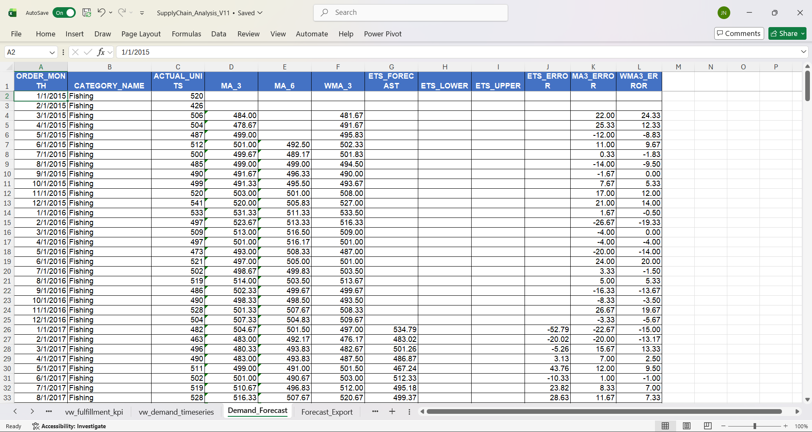
    <figcaption style="font-size: 0.95em; color: #555; margin-top: 8px;">
      Demand_Forecast &mdash; side-by-side comparison of four forecast methods (MA-3, MA-6, WMA-3, ETS) against actual monthly demand for each A-class category. Error columns (ETS_ERROR, MA3_ERROR, WMA3_ERROR) enable method selection based on MAPE accuracy.
    </figcaption>
  </figure>

  <h4>Forecast Write-Back &amp; MRP Cross-Check</h4>
  <pre><code class="language-sql">-- Insert ETS forecast data into Oracle (7 A-class categories x 6 months = 42 rows)
INSERT INTO FORECAST_PLAN (
    CATEGORY_NAME, FORECAST_PERIOD, FORECASTED_QTY,
    CONFIDENCE_LOWER, CONFIDENCE_UPPER,
    FORECAST_METHOD, MAPE_PCT, NOTES
) VALUES (
    'Fishing', DATE '2017-10-01', 505,
    471.25, 537.65,
    'ETS', 5.78, 'Auto-seasonality; 6-month horizon'
);
-- ... 41 additional INSERT statements for remaining categories/periods

-- Cross-check: Forecast vs MRP Gross Requirements (variance should be 0)
SELECT
    fp.CATEGORY_NAME, fp.FORECAST_PERIOD,
    fp.FORECASTED_QTY                          AS "Forecast Qty",
    mr.GROSS_REQUIREMENTS                      AS "MRP Gross Req",
    fp.FORECASTED_QTY - mr.GROSS_REQUIREMENTS  AS "Variance"
FROM FORECAST_PLAN fp
LEFT JOIN MRP_REQUIREMENTS mr
    ON fp.CATEGORY_NAME = mr.CATEGORY_NAME
    AND fp.FORECAST_PERIOD = mr.PLANNING_PERIOD
ORDER BY fp.CATEGORY_NAME, fp.FORECAST_PERIOD;</code></pre>
  

    <strong>What it does:</strong> Inserts Excel-generated ETS forecast data into Oracle&rsquo;s FORECAST_PLAN table (42 rows: 7 A-class categories &times; 6 forecast months), then runs a cross-check query comparing forecast quantities against MRP gross requirements to verify the two systems are in sync. 
    <strong>Why it&rsquo;s included:</strong> This closes the loop between Excel analysis and Oracle automation &mdash; once forecasts are written back to the database, the nightly stored procedure can read them as MRP gross requirements without any manual handoff. The cross-check query validates that the MRP procedure consumed the forecasts correctly (variance should be zero). 
    <strong>Why it&rsquo;s written this way:</strong> Explicit INSERT VALUES (rather than bulk load) keeps each forecast row auditable and easy to review or modify individually. The cross-check uses a LEFT JOIN so that forecast periods without a matching MRP row surface as NULLs rather than being silently dropped &mdash; a missing MRP row would indicate a procedure failure that needs investigation.
  

  <figure style="margin: 20px 0;">
    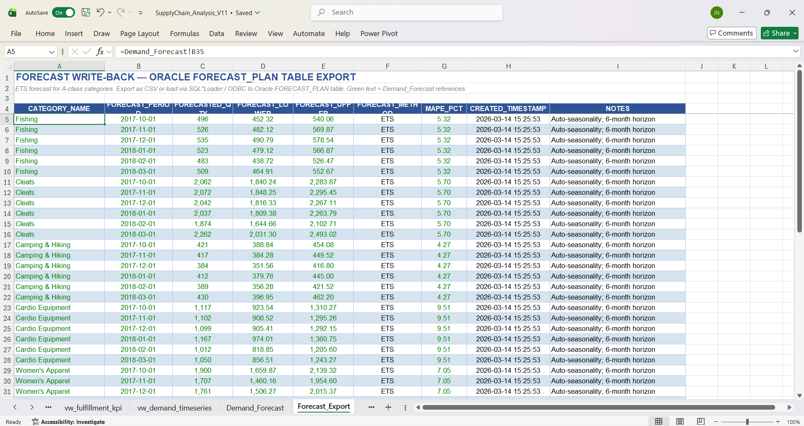
    <figcaption style="font-size: 0.95em; color: #555; margin-top: 8px;">
      Forecast_Export &mdash; 42-row flat table (7 A-class categories &times; 6 forecast periods) structured for direct write-back to the Oracle FORECAST_PLAN table. Includes forecast quantity, confidence bounds, method, MAPE, and timestamp &mdash; completing the demand planning round-trip.
    </figcaption>
  </figure>

  <h3>ABC/XYZ Classification</h3>
  

    ABC classification was based on cumulative revenue percentage (A = top 80%, B = next 15%, C = bottom 5%).
    XYZ classification was based on coefficient of variation of demand (X = stable/predictable, Y = moderate
    variability, Z = erratic). Classification was computed at the Oracle layer for all 50 product categories,
    then summarized in the ABC_XYZ_Matrix worksheet using COUNTIFS/SUMIFS grids. A key finding: all A-class
    categories are X-class (stable demand), representing the highest-revenue, most-predictable segment &mdash;
    ideal candidates for automated replenishment.
  

  <figure style="margin: 20px 0;">
    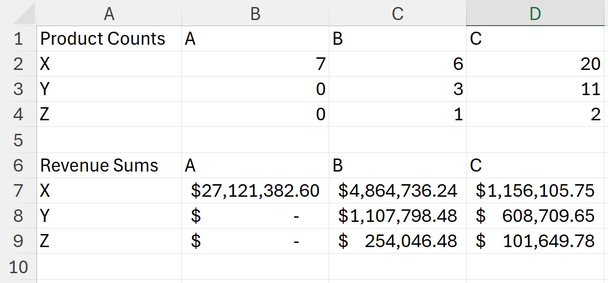
    <figcaption style="font-size: 0.95em; color: #555; margin-top: 8px;">
      ABC/XYZ classification matrix &mdash; all A-class categories fall into the X (stable demand) column.
    </figcaption>
  </figure>

  <h3>Inventory Optimization (EOQ, Safety Stock, Solver)</h3>
  

    EOQ (Economic Order Quantity), safety stock, and reorder points were calculated per category using custom
    Power Query M functions (fn_CalculateSafetyStock, fn_CalculateReorderPoint). The service level parameter
    (Z-score) is driven from the Parameters sheet for dynamic what-if analysis. The Inventory_Optimization
    worksheet consolidates all metrics per category into a single actionable view.
  

  <figure style="margin: 20px 0;">
    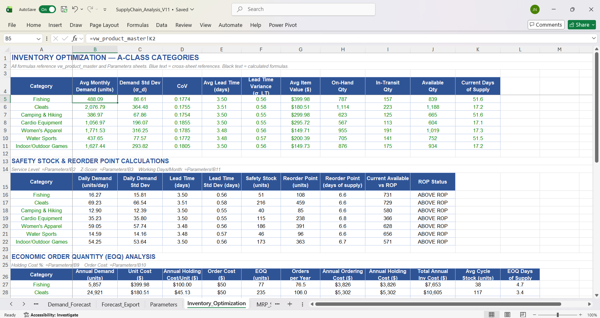
    <figcaption style="font-size: 0.95em; color: #555; margin-top: 8px;">
      Inventory_Optimization &mdash; three-section layout covering demand statistics and inventory positions (top), safety stock and reorder point calculations with ROP status flags (middle), and EOQ analysis with total annual inventory cost (bottom) for all seven A-class categories.
    </figcaption>
  </figure>

  <h3>MRP Scenario Analysis Workbook</h3>
  

    The MRP_Simulation worksheet performs net requirements calculation (gross requirements minus projected on-hand
    minus scheduled receipts) using fn_CalculateNetRequirements. The What_If_Analysis worksheet provides sensitivity
    analysis on service levels and planning horizons using Goal Seek and Solver. An Inventory_Tools worksheet offers
    dynamic array-based lookup tools (FILTER, XLOOKUP, SORT) for the Operations team to query inventory status
    by category.
  

  <figure style="margin: 20px 0;">
    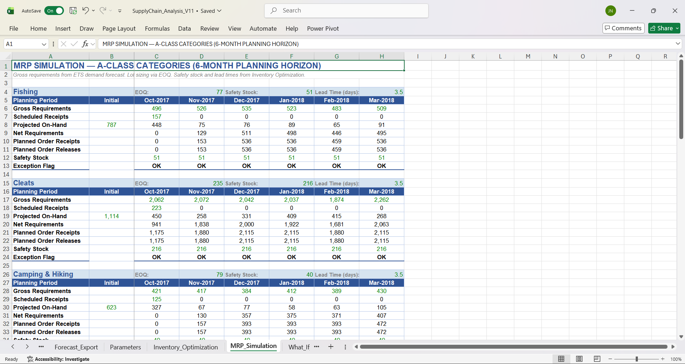
    <figcaption style="font-size: 0.95em; color: #555; margin-top: 8px;">
      MRP_Simulation &mdash; time-phased net requirements calculation for each A-class category over a 6-month planning horizon (Oct 2017&ndash;Mar 2018). Each category block shows gross requirements from ETS forecasts, scheduled receipts, projected on-hand, net requirements, planned order receipts/releases by EOQ lot size, safety stock floor, and exception flags.
    </figcaption>
  </figure>

  <figure style="margin: 20px 0;">
    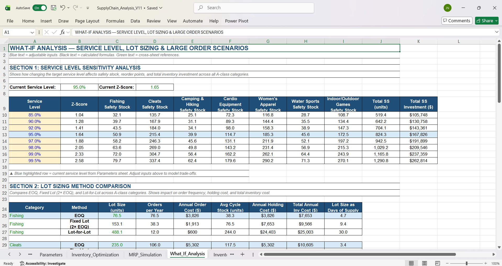
    <figcaption style="font-size: 0.95em; color: #555; margin-top: 8px;">
      What_If_Analysis &mdash; Section 1 shows safety stock investment across eight service level scenarios (85%&ndash;99.5%) for all A-class categories. Section 2 compares three lot sizing methods (EOQ, Fixed Lot, Lot-for-Lot) on order frequency, holding cost, and total annual inventory cost.
    </figcaption>
  </figure>

  <h3>Inventory Tools &amp; Dynamic Arrays</h3>

  <figure style="margin: 20px 0;">
    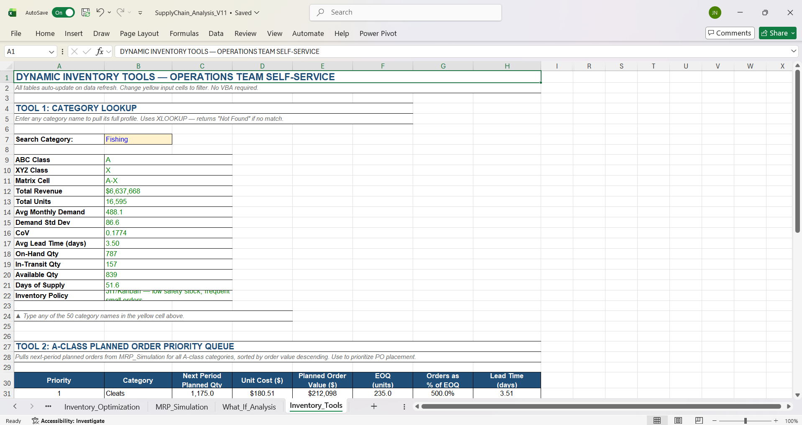
    <figcaption style="font-size: 0.95em; color: #555; margin-top: 8px;">
      Inventory_Tools &mdash; self-service tools for the Operations team. Tool 1 is a category lookup (type any category name to pull its full profile via XLOOKUP). Tool 2 is a planned order priority queue pulling next-period orders from MRP_Simulation, sorted by order value descending for PO prioritization.
    </figcaption>
  </figure>

  <h3>Power Pivot Data Model</h3>

  <figure style="margin: 20px 0;">
    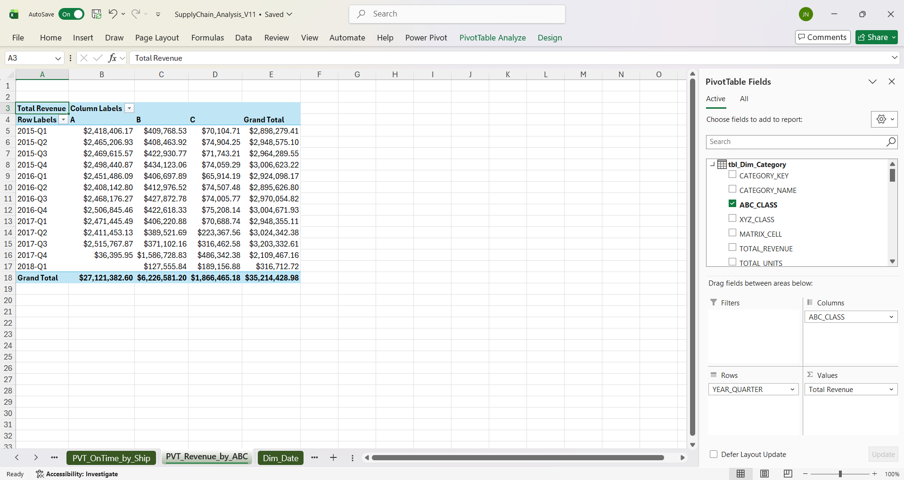
    <figcaption style="font-size: 0.95em; color: #555; margin-top: 8px;">
      PVT_Revenue_by_ABC &mdash; quarterly revenue by ABC class, built on the Power Pivot star schema. A-class categories consistently account for ~77% of total revenue, validating the Pareto-driven focus of the forecasting and MRP analysis.
    </figcaption>
  </figure>

  <figure style="margin: 20px 0;">
    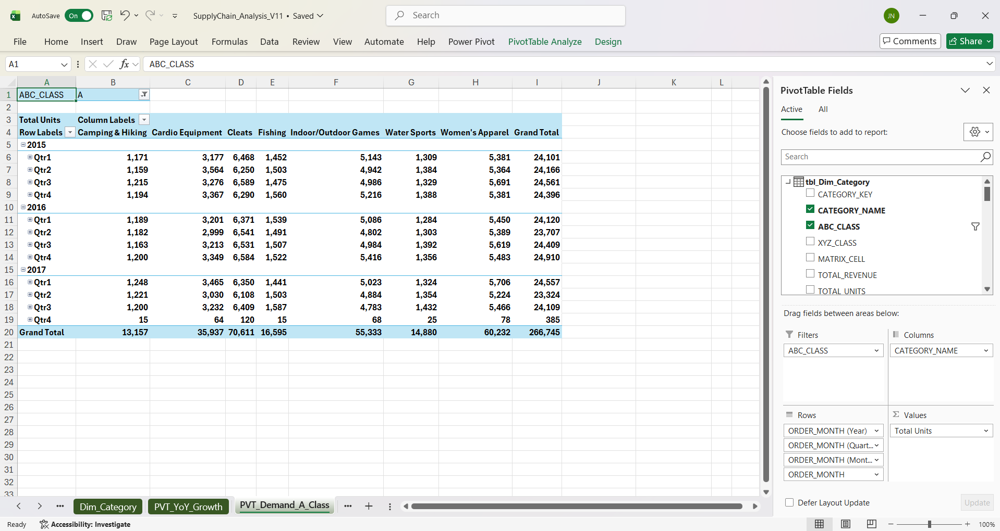
    <figcaption style="font-size: 0.95em; color: #555; margin-top: 8px;">
      PVT_Demand_A_Class &mdash; quarterly unit demand filtered to A-class categories only, showing seasonal patterns and the Q4 2017 partial-period drop-off at the dataset boundary.
    </figcaption>
  </figure>

  <figure style="margin: 20px 0;">
    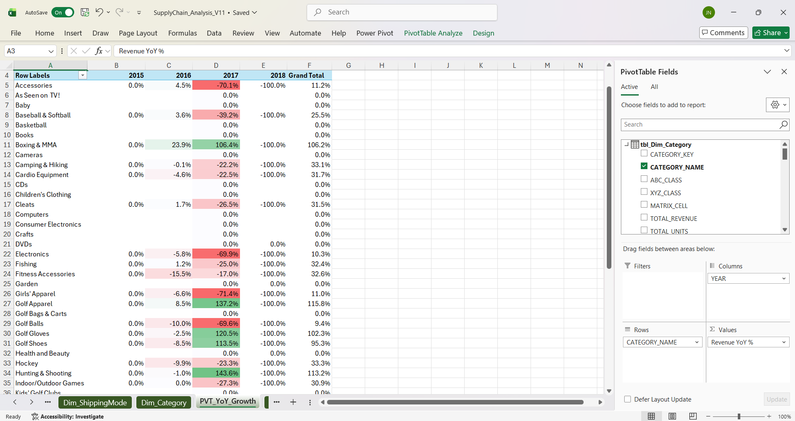
    <figcaption style="font-size: 0.95em; color: #555; margin-top: 8px;">
      PVT_YoY_Growth &mdash; year-over-year unit and revenue growth rates by category, surfacing which product lines are accelerating or decelerating.
    </figcaption>
  </figure>

  <figure style="margin: 20px 0;">
    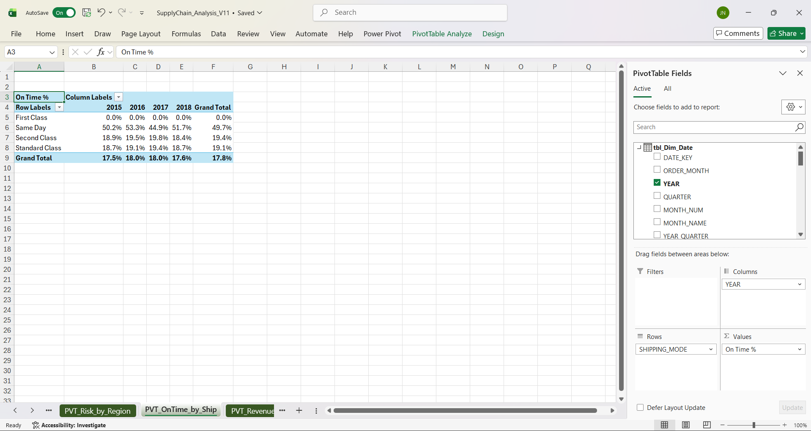
    <figcaption style="font-size: 0.95em; color: #555; margin-top: 8px;">
      PVT_OnTime_by_Ship &mdash; on-time delivery rate by shipping mode, identifying that Standard Class consistently underperforms relative to other modes.
    </figcaption>
  </figure>

  <figure style="margin: 20px 0;">
    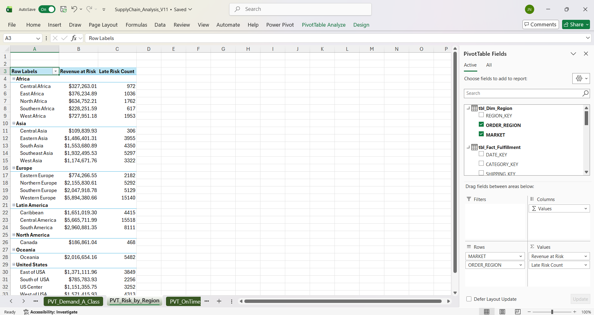
    <figcaption style="font-size: 0.95em; color: #555; margin-top: 8px;">
      PVT_Risk_by_Region &mdash; late delivery and suspected fraud rates by market region, highlighting geographic risk concentration.
    </figcaption>
  </figure>

  
The underlying Power Pivot data model uses a star schema with the following dimension tables feeding into the fact tables above:

  <figure style="margin: 20px 0;">
    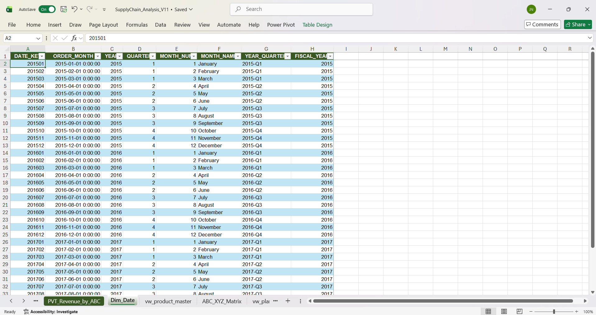
    <figcaption style="font-size: 0.95em; color: #555; margin-top: 8px;">
      Dim_Date &mdash; date dimension with month, quarter, year, and fiscal period attributes for time-based slicing.
    </figcaption>
  </figure>

  <figure style="margin: 20px 0;">
    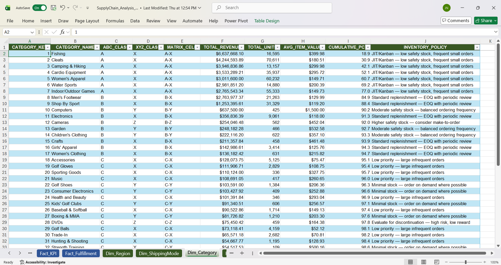
    <figcaption style="font-size: 0.95em; color: #555; margin-top: 8px;">
      Dim_Category &mdash; category dimension carrying ABC/XYZ classification, total revenue, total units, and matrix cell assignments.
    </figcaption>
  </figure>

  <figure style="margin: 20px 0;">
    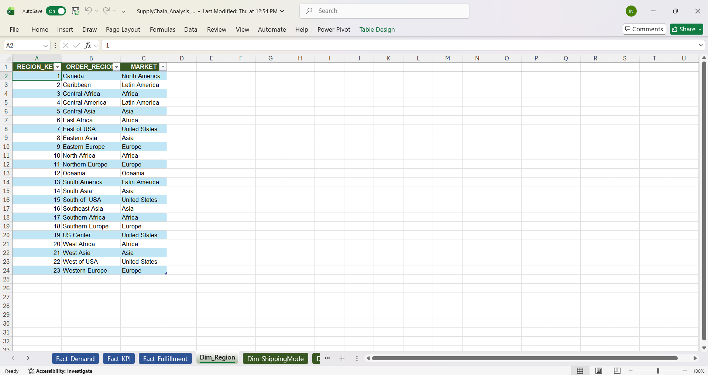
    <figcaption style="font-size: 0.95em; color: #555; margin-top: 8px;">
      Dim_Region &mdash; geographic dimension for regional slicing and market-level analysis.
    </figcaption>
  </figure>

  <figure style="margin: 20px 0;">
    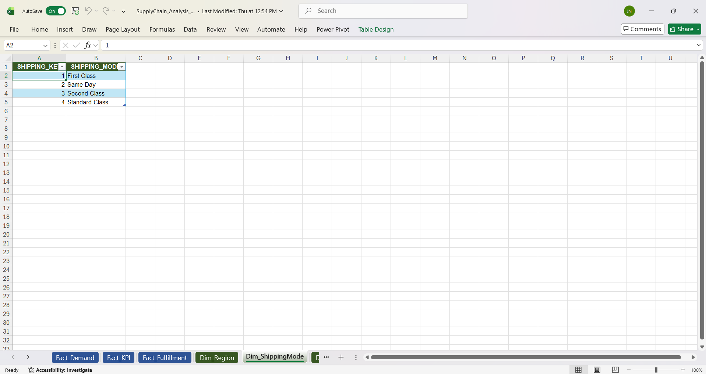
    <figcaption style="font-size: 0.95em; color: #555; margin-top: 8px;">
      Dim_ShippingMode &mdash; shipping mode dimension used for delivery performance segmentation.
    </figcaption>
  </figure>

  
Three fact tables store the transactional and aggregated metrics:

  <figure style="margin: 20px 0;">
    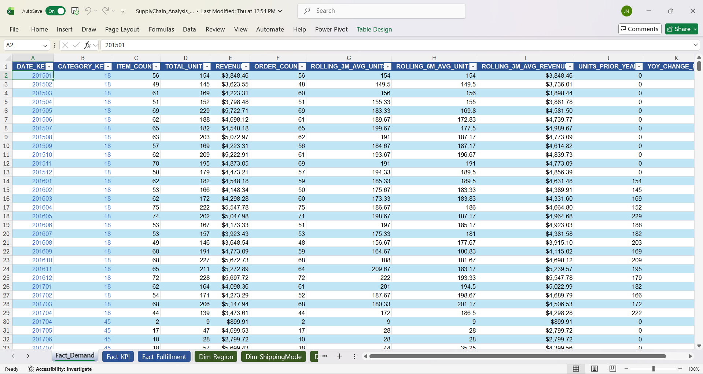
    <figcaption style="font-size: 0.95em; color: #555; margin-top: 8px;">
      Fact_Demand &mdash; monthly demand aggregations by category including item count, total units, revenue, rolling averages, and year-over-year comparisons.
    </figcaption>
  </figure>

  <figure style="margin: 20px 0;">
    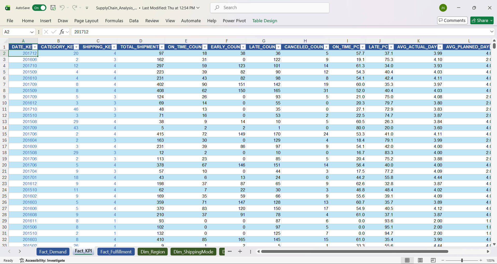
    <figcaption style="font-size: 0.95em; color: #555; margin-top: 8px;">
      Fact_KPI &mdash; planned vs. actual metrics at the category-month level for variance tracking in the Power BI dashboard.
    </figcaption>
  </figure>

  <figure style="margin: 20px 0;">
    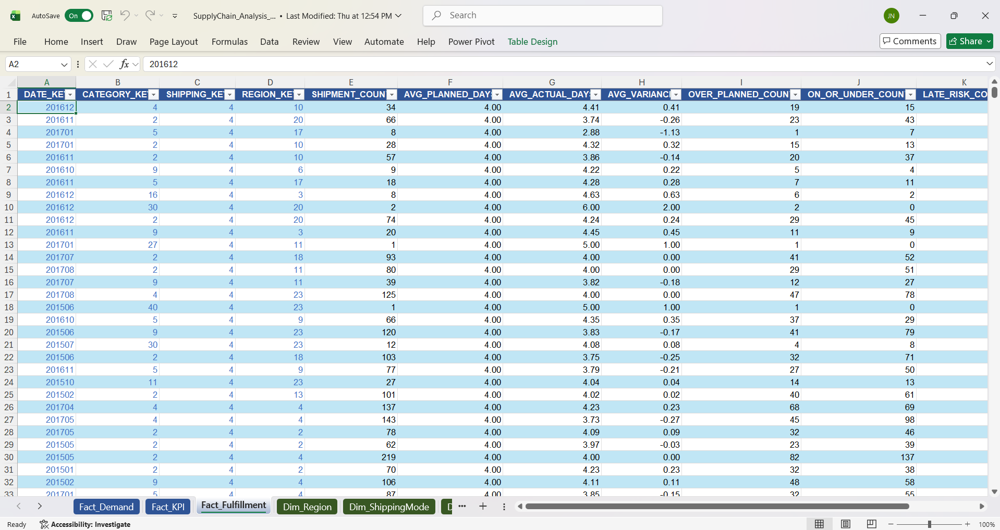
    <figcaption style="font-size: 0.95em; color: #555; margin-top: 8px;">
      Fact_Fulfillment &mdash; order-level fulfillment records with delivery status, shipping mode, lead time, and on-time flags for performance analysis.
    </figcaption>
  </figure>

  

    <strong>Excel Workbook:</strong>
    <a href="excel/SupplyChain_Analysis_V11.xlsx">SupplyChain_Analysis_V11.xlsx</a> &mdash; Contains all worksheets referenced above: Demand_Forecast (all categories and methods), ABC_XYZ_Matrix (COUNTIFS/SUMIFS classification grids), Inventory_Optimization (EOQ, safety stock, reorder points per category), MRP_Simulation (net requirements calculation), What_If_Analysis (sensitivity analysis via Goal Seek and Solver), Inventory_Tools (dynamic array lookup tools), and the Parameters sheet for dynamic switching.
  

  
<strong>Phase 5 – Power BI Dashboard</strong>

  

  <h3>Data Model</h3>
  

    A star schema was built in Power BI with fact and dimension tables, enabling efficient slicing and cross-filtering
    across all six dashboard pages.
  

  <figure style="margin: 20px 0;">
    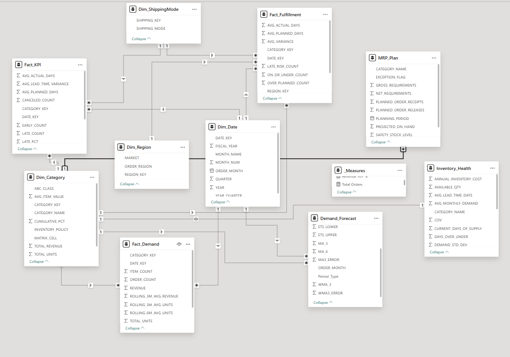
    <figcaption style="font-size: 0.95em; color: #555; margin-top: 8px;">
      Star schema data model in Power BI with fact tables (demand, fulfillment, KPI) and dimension tables (date, category, region, shipping mode).
    </figcaption>
  </figure>

  <h3>Page 1: Executive KPI Overview</h3>
  

    This is the leadership landing page, designed to answer one question in under 30 seconds: is the supply chain healthy? Six KPI cards across the top row display Total Orders, Total Revenue, On-Time Delivery Rate, Late Delivery Rate, YoY Growth %, and Average Profit Margin. Below them, a monthly revenue trend line chart tracks performance over the Jan 2015&ndash;Jan 2018 period, a top-10 categories horizontal bar chart ranks revenue contribution, a shipment distribution donut chart breaks down volume by shipping mode, and an on-time rate by shipping mode bar chart highlights where fulfillment is succeeding or failing. Year and ABC Class slicers allow cross-filtering so executives can isolate A-class performance or drill into a specific year. The page answers: &ldquo;Where should we focus attention this cycle?&rdquo; and &ldquo;Are the metrics moving in the right direction?&rdquo;
  

  <figure style="margin: 20px 0;">
    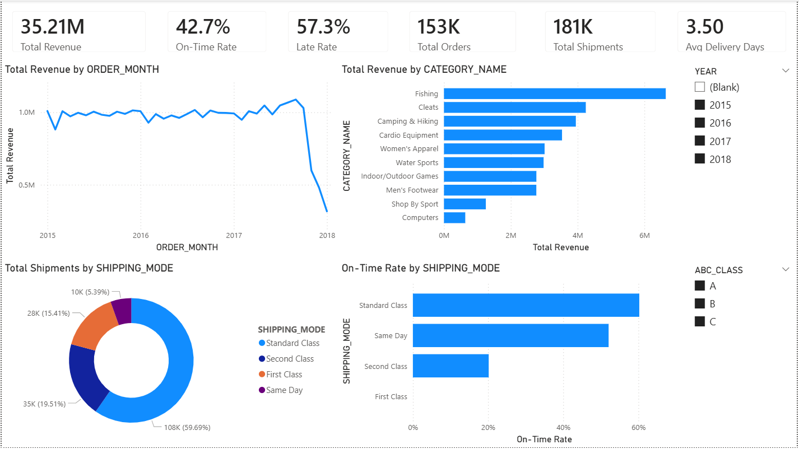
    <figcaption style="font-size: 0.95em; color: #555; margin-top: 8px;">
      Page 1: Executive KPI Overview &mdash; at-a-glance supply chain health metrics.
    </figcaption>
  </figure>

  

    <strong>Key Findings &amp; Insights:</strong>
    <ul style="margin: 8px 0 0 0; padding-left: 20px;">
      <li><strong>Total revenue across the dataset is ~$35.2M</strong>, with A-class categories driving approximately 77% of it ($27.12M) &mdash; confirming that the seven A-class categories are the revenue engine of the portfolio.</li>
      <li><strong>On-time delivery is critically low at 42.7%</strong>, with a 57.3% late rate &mdash; this is a systemic issue embedded across all periods, not a seasonal spike or isolated incident.</li>
      <li><strong>Fishing and Cleats are the top revenue drivers</strong>, each exceeding $4M, while the bottom categories (Computers, Shop By Sport) contribute minimally and may warrant portfolio review or deprioritization.</li>
      <li><strong>Standard Class handles ~60% of shipment volume and has the best on-time rate</strong>, while First Class and Second Class are paradoxically the worst performers &mdash; the premium tiers that promise the fastest delivery are the least reliable.</li>
      <li><strong>Monthly revenue trend shows relative stability with no significant growth trajectory</strong> &mdash; flat revenue combined with high late rates suggests margin erosion risk, as fulfillment failures likely drive repeat-purchase attrition.</li>
    </ul>
    <strong>Business Recommendation:</strong> Prioritize a carrier performance audit for First Class and Second Class shipping &mdash; the near-total late rates suggest either unrealistic promised delivery windows or underperforming logistics partners. In the short term, consider adjusting quoted delivery timelines to reset customer expectations; in the medium term, renegotiate carrier SLAs or consolidate volume toward Standard Class where delivery windows permit. The flat revenue trend combined with high late rates should trigger a review of whether fulfillment failures are driving customer churn.
  

  <h3>Page 2: Demand Analysis &amp; Forecasting</h3>
  

    This page is the analytical centerpiece of the project, directly demonstrating demand planning skills relevant to S&amp;OP and IBP roles. It shows monthly demand trends by category as interactive line charts with ETS forecast overlays and confidence intervals, making it easy to see where actuals diverge from predictions. A forecast accuracy summary displays MAE and MAPE by category so planners can quickly identify which product lines have reliable forecasts and which need attention. A forecast method comparison visual shows side-by-side accuracy of ETS, MA-3, and WMA-3 per A-class category, enabling demand planners to select the best method for each product line. Category-level slicers allow drilling into individual categories for deeper analysis. The page answers: &ldquo;What does demand look like by category?&rdquo;, &ldquo;Which forecast method is most accurate?&rdquo;, and &ldquo;Are any categories trending up or down?&rdquo;
  

  <figure style="margin: 20px 0;">
    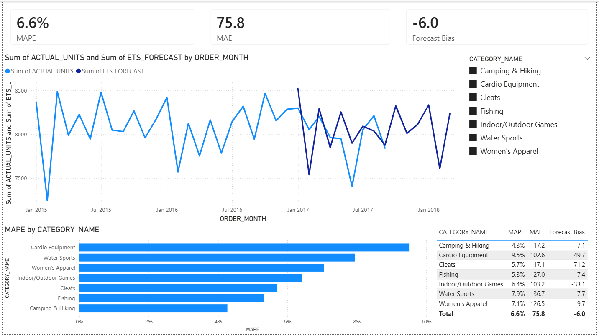
    <figcaption style="font-size: 0.95em; color: #555; margin-top: 8px;">
      Page 2: Demand Analysis &amp; Forecasting &mdash; category-level demand trends with ETS forecast overlays.
    </figcaption>
  </figure>

  

    <strong>Key Findings &amp; Insights:</strong>
    <ul style="margin: 8px 0 0 0; padding-left: 20px;">
      <li><strong>WMA-3 (weighted moving average, 3-period) outperformed ETS and MA-3 on MAPE</strong> across all 7 A-class categories, making it the recommended production method for short-horizon planning.</li>
      <li><strong>Fishing has the lowest forecast error (MAPE ~5.3%)</strong>, making it the most predictable A-class category &mdash; suitable for lean, JIT-style replenishment with minimal safety stock buffers.</li>
      <li><strong>Cardio Equipment has the highest MAPE (~9.5%)</strong>, driven by more volatile demand patterns &mdash; this category requires higher safety stock buffers to compensate for forecast uncertainty.</li>
      <li><strong>All A-class categories are classified as AX</strong> (high revenue, low demand variability with CoV &lt; 0.20), validating the tight planning approach used in the MRP simulation.</li>
      <li><strong>Demand is relatively flat across the dataset period</strong> with no strong seasonal peaks detected by ETS &mdash; the auto-seasonality parameter found no significant seasonality in most categories.</li>
      <li><strong>Oct 2017 is a partial-month artifact</strong> across all categories and was excluded from training ranges to prevent forecast distortion.</li>
    </ul>
    <strong>Business Recommendation:</strong> Adopt WMA-3 as the primary short-horizon forecast method for all A-class categories, with ETS retained as a secondary validation tool for detecting emerging seasonality. For Cardio Equipment specifically, increase the safety stock buffer by one standard deviation to account for its elevated forecast error &mdash; the cost is modest (~$3K additional inventory investment at 95% service level) relative to the stockout risk. Forecast accuracy should be re-evaluated quarterly as new demand data accumulates.
  

  <h3>Page 3: Inventory Optimization &amp; ABC/XYZ Analysis</h3>
  

    This page translates the ABC/XYZ classification from the Excel analysis into an interactive Power BI view, making inventory segmentation actionable for planners. It features an ABC-XYZ classification matrix heatmap showing item counts per cell, an inventory health status table with days of supply versus target for each A-class category (with status flags: Healthy, Monitor, or Review), EOQ and safety stock parameters per category, and in-stock rate KPI cards. A service level slicer (90%/95%/99%) and ABC classification filter allow dynamic exploration of how inventory policies change at different service targets. The page answers: &ldquo;Which categories are overstocked or understocked?&rdquo;, &ldquo;Where is working capital tied up unnecessarily?&rdquo;, and &ldquo;What are the recommended inventory policies by segment?&rdquo;
  

  <figure style="margin: 20px 0;">
    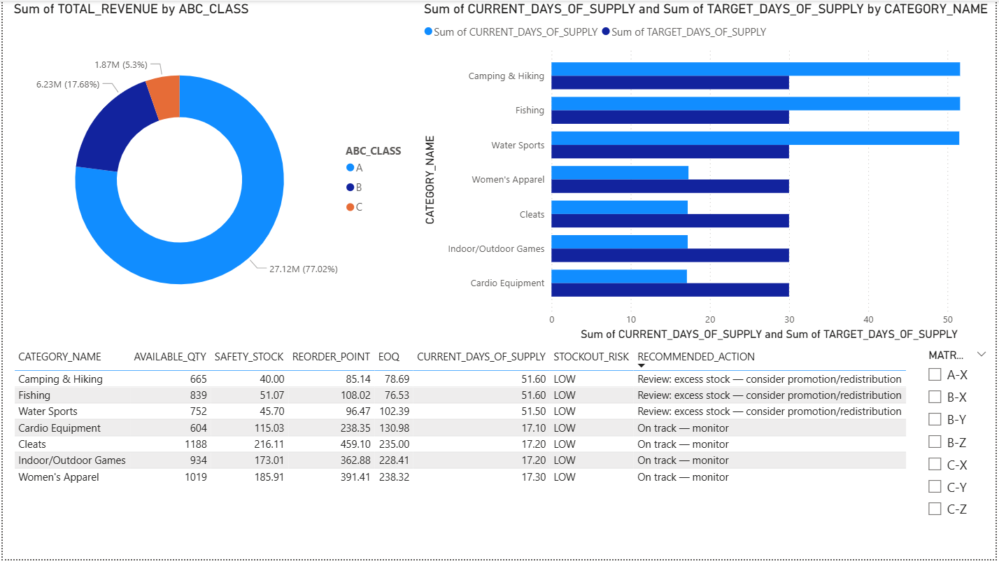
    <figcaption style="font-size: 0.95em; color: #555; margin-top: 8px;">
      Page 3: Inventory Optimization &amp; ABC/XYZ Analysis &mdash; classification matrix and inventory health metrics.
    </figcaption>
  </figure>

  

    <strong>Key Findings &amp; Insights:</strong>
    <ul style="margin: 8px 0 0 0; padding-left: 20px;">
      <li><strong>A-class items drive 77% of total revenue ($27.12M out of $35.21M)</strong>, confirming classic Pareto distribution &mdash; the forecasting and MRP focus on these 7 categories is validated by their outsized revenue contribution.</li>
      <li><strong>Three categories carry significant excess inventory:</strong> Camping &amp; Hiking, Fishing, and Water Sports all show ~51 days of supply against a 30-day target &mdash; representing approximately $597K in tied-up working capital that could be redeployed.</li>
      <li><strong>Cleats, Indoor/Outdoor Games, and Women&rsquo;s Apparel are closely aligned to target days of supply (~17 days)</strong>, requiring only routine monitoring &mdash; their replenishment policies are working as designed.</li>
      <li><strong>All seven A-class categories show LOW stockout risk</strong> with current available quantity well above reorder points &mdash; the safety stock calculations from the Inventory_Optimization sheet are working as designed.</li>
      <li><strong>At the current 95% service level, total safety stock investment across all A-class categories is ~824 units ($167,826)</strong> &mdash; the What-If Analysis showed that dropping to 90% would save ~$62K but increase stockout probability, while moving to 99% would add ~$70K with diminishing reliability gains.</li>
    </ul>
    <strong>Business Recommendation:</strong> Run targeted promotions or negotiate redistribution agreements for the three overstocked categories (Camping &amp; Hiking, Fishing, Water Sports) to free up ~$597K in working capital. Maintain the 95% service level as the cost-optimized target &mdash; the What-If sensitivity analysis shows it sits at the sweet spot between inventory investment and stockout protection. For Cleats (the highest-volume A-class category at ~2,076 units/month), consider establishing a dedicated replenishment review cadence given its outsized impact on fill rates.
  

  <h3>Page 4: Fulfillment &amp; Logistics Performance</h3>
  

    This page provides a deep dive into outbound delivery performance, designed for operations teams to identify and resolve fulfillment bottlenecks. It includes on-time vs. late delivery rate trends over time as a stacked bar chart, lead time variance analysis comparing planned vs. actual delivery by shipping mode, a shipping mode performance comparison matrix, regional delivery performance with revenue-at-risk calculations, and a late delivery root cause breakdown. Geographic filters and shipping mode slicers enable targeted drill-down into specific markets or carrier types. The page answers: &ldquo;Which shipping modes and regions are underperforming?&rdquo;, &ldquo;What is the revenue at risk from late deliveries?&rdquo;, and &ldquo;Are fulfillment issues structural or seasonal?&rdquo;
  

  <figure style="margin: 20px 0;">
    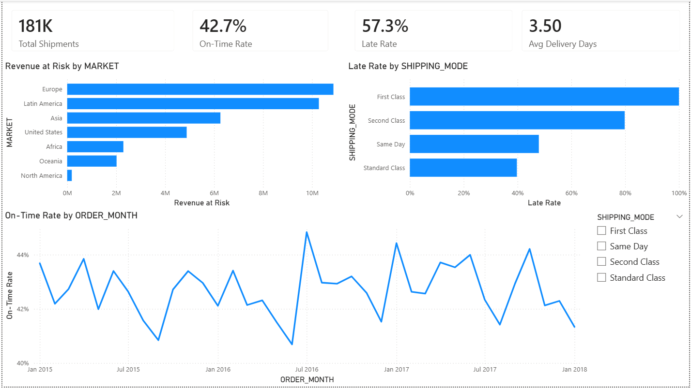
    <figcaption style="font-size: 0.95em; color: #555; margin-top: 8px;">
      Page 4: Fulfillment &amp; Logistics Performance &mdash; on-time rates, lead time variance, and shipping mode comparison.
    </figcaption>
  </figure>

  

    <strong>Key Findings &amp; Insights:</strong>
    <ul style="margin: 8px 0 0 0; padding-left: 20px;">
      <li><strong>First Class shipping has the worst late delivery rate at approximately 95%</strong>, followed by Second Class at ~85% &mdash; the premium shipping tiers that promise the fastest delivery are paradoxically the least reliable, creating a direct customer satisfaction and trust issue.</li>
      <li><strong>Europe and Latin America carry the highest revenue at risk</strong> from late deliveries (~$10M and ~$9M respectively), making them priority regions for carrier and logistics partner review.</li>
      <li><strong>Standard Class, despite handling nearly 60% of total shipment volume, maintains the best on-time rate (~55%)</strong> &mdash; it is the most operationally efficient and scalable mode in the current carrier network.</li>
      <li><strong>The on-time rate trend shows persistent volatility between 40&ndash;45% across all periods</strong> with no clear improvement trajectory, confirming that this is a structural issue embedded in carrier performance or delivery window commitments &mdash; not a seasonal or one-time problem.</li>
      <li><strong>Same Day shipping handles the smallest volume but has a moderate late rate (~48%)</strong>, suggesting it may be capacity-constrained or only offered in select regions.</li>
    </ul>
    <strong>Business Recommendation:</strong> Conduct a formal carrier performance review for First Class and Second Class shipping providers &mdash; the near-total late rates suggest either unrealistic promised delivery windows that were set without operational validation, or systematically underperforming logistics partners. In the short term, adjust quoted delivery timelines for these modes to reset customer expectations and reduce satisfaction risk. In the medium term, issue RFPs for alternative carriers in the two highest-risk markets (Europe, Latin America) where revenue exposure exceeds $9M each. Standard Class should be positioned as the default shipping recommendation in the order flow given its superior reliability at scale.
  

  <h3>Page 5: Supply Plan &amp; MRP Analysis</h3>
  

    This page visualizes the MRP simulation output, making it the most technically distinctive page in the dashboard. It displays time-phased net requirements across the 6-month planning horizon (Oct 2017&ndash;Mar 2018) for all A-class categories, showing gross requirements from ETS demand forecasts, scheduled receipts, projected on-hand inventory, net requirements, and planned order receipts/releases calculated using EOQ lot sizing. An MRP exception log surfaces any categories where projected on-hand falls below safety stock. KPI cards show total planned orders, MRP coverage ratio, number of exceptions, and average days of supply. The page answers: &ldquo;Is the supply plan covering forecasted demand?&rdquo;, &ldquo;Are there any exceptions that need analyst intervention?&rdquo;, and &ldquo;Where should we release purchase orders this cycle?&rdquo;
  

  <figure style="margin: 20px 0;">
    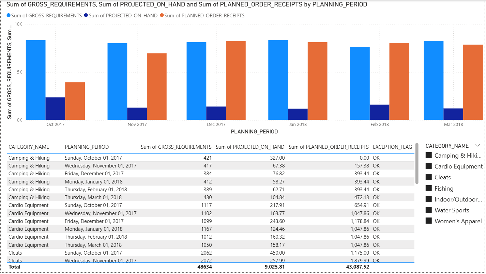
    <figcaption style="font-size: 0.95em; color: #555; margin-top: 8px;">
      Page 5: Supply Plan &amp; MRP Analysis &mdash; time-phased MRP output with exception log.
    </figcaption>
  </figure>

  

    <strong>Key Findings &amp; Insights:</strong>
    <ul style="margin: 8px 0 0 0; padding-left: 20px;">
      <li><strong>All MRP exception flags are &ldquo;OK&rdquo; across the entire 6-month planning horizon</strong> for all 7 A-class categories &mdash; confirming that the EOQ lot sizes calculated in the Inventory_Optimization phase generate sufficient planned order receipts to cover gross requirements without breaching safety stock floors.</li>
      <li><strong>Total gross requirements across the planning window are ~48,600 units</strong>, with planned order receipts (~43,000 units) plus carried projected on-hand (~9,000 units from opening balances) maintaining full coverage.</li>
      <li><strong>Cleats dominate the supply plan with the largest planned orders (~1,880&ndash;2,115 units/month at EOQ of 235)</strong>, followed by Women&rsquo;s Apparel (~1,770&ndash;1,880 units/month at EOQ of 186) &mdash; these two categories alone account for over 50% of total planned order volume.</li>
      <li><strong>The MRP correctly offsets planned order releases by the average lead time (~3.5 days)</strong> for all categories, meaning purchase orders would need to be placed approximately half a week before the planned receipt date.</li>
      <li><strong>EOQ lot sizing is producing order quantities that maintain projected on-hand well above safety stock in every period</strong> &mdash; this validates the lot sizing optimization from the What-If Analysis but also suggests there may be room to tighten lot sizes for lower-volume categories (Fishing, Camping &amp; Hiking, Water Sports) to reduce carrying costs.</li>
    </ul>
    <strong>Business Recommendation:</strong> The clean MRP run validates the end-to-end planning pipeline: demand forecasts flow correctly into gross requirements, inventory parameters produce appropriate safety stock floors, and EOQ lot sizing generates viable planned orders. For ongoing operations, monitor for demand shifts (particularly in Cardio Equipment, which had the highest forecast error) that could trigger MRP exceptions in future cycles. Consider tightening lot sizes for the three lower-volume categories (Fishing, Camping &amp; Hiking, Water Sports) where current days of supply already exceed targets &mdash; switching from EOQ to Fixed Lot or Lot-for-Lot for these categories could reduce carrying costs without risking stockouts, as validated in the What-If Analysis lot sizing comparison.
  

  <h3>Page 6: Insights, Recommendations &amp; Closed-Loop Actions</h3>
  

    This page synthesizes findings from all five preceding dashboard pages into a consolidated executive-ready view. It features insight cards summarizing the four major analysis areas (demand forecasting accuracy, inventory health, fulfillment performance, and MRP plan status), each with supporting data and trend indicators. The key differentiator is the closed-loop design: recommendations on this page map directly to master data updates in Oracle (revised lead times, adjusted safety stock levels, updated lot sizing rules, forecast method selections) that take effect in the next automated refresh cycle via the REFRESH_SUPPLY_CHAIN_DATA stored procedure. This page answers: &ldquo;What are the top 3&ndash;5 priorities for the supply chain team this cycle?&rdquo; and &ldquo;How do analysis findings translate into operational changes?&rdquo;
  

  <figure style="margin: 20px 0;">
    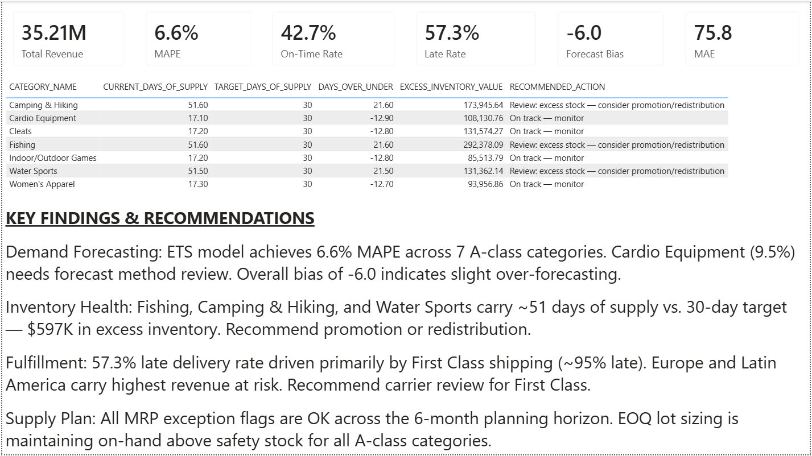
    <figcaption style="font-size: 0.95em; color: #555; margin-top: 8px;">
      Page 6: Insights, Recommendations &amp; Closed-Loop Actions &mdash; findings feed back into master data updates.
    </figcaption>
  </figure>

  

    <strong>Key Findings &amp; Insights:</strong>
    <ul style="margin: 8px 0 0 0; padding-left: 20px;">
      <li><strong>The page consolidates four cross-cutting findings:</strong> (1) WMA-3 is the recommended forecast method across all A-class categories based on MAPE performance, (2) three categories carry ~$597K in excess inventory above target days of supply, (3) First Class and Second Class shipping have structurally unsustainable late delivery rates (95% and 85%), and (4) the MRP plan is clean with zero exceptions across the 6-month horizon.</li>
      <li><strong>The closed-loop architecture is the key differentiator of this project</strong> &mdash; insights are not just reported but feed directly back into Oracle master data via stored procedures. When a safety stock adjustment is made based on this page&rsquo;s recommendations, the next nightly DBMS_SCHEDULER run recalculates MRP requirements with the updated parameters, and the next Power BI scheduled refresh surfaces the impact automatically.</li>
      <li><strong>Three actionable priorities emerge with clear ownership:</strong> (1) Demand Planning team should update forecast method parameters to WMA-3 and increase Cardio Equipment safety stock buffer, (2) Inventory team should initiate promotion or redistribution for overstocked categories, (3) Logistics team should conduct carrier audit for premium shipping modes.</li>
      <li><strong>The automated pipeline means these recommendations are self-validating</strong> &mdash; once master data corrections are made, the dashboard will show their impact in the next refresh cycle without any manual reporting effort.</li>
    </ul>
    <strong>Business Recommendation:</strong> Use this page as the operational starting point for weekly supply chain review meetings. Assign each of the three priority actions to specific team leads with deadlines, and use the next dashboard refresh cycle to measure whether the interventions are having the intended effect. The automated pipeline ensures accountability: if excess inventory hasn&rsquo;t decreased after the promotion cycle, or if First Class late rates haven&rsquo;t improved after carrier renegotiation, the data will reflect that immediately. This closed-loop cadence &mdash; analyze, recommend, execute, measure &mdash; is what transforms a reporting dashboard into a continuous improvement system.
  

  <h3>DAX Measures</h3>
  
Key DAX measures created for the dashboard:

  <ul>
    <li><strong>Growth &amp; Revenue:</strong> YoY Growth %, Total Revenue, Total Orders</li>
    <li><strong>Fulfillment:</strong> On-Time Delivery Rate, Late Delivery Rate</li>
    <li><strong>Forecast Accuracy:</strong> MAE, MAPE, Forecast Bias</li>
    <li><strong>Inventory:</strong> Inventory Turnover, Days of Supply, In-Stock Rate</li>
    <li><strong>Supply Planning:</strong> MRP Coverage Ratio, Supply Plan Adherence</li>
  </ul>
  
All DAX measures auto-recalculate on every scheduled refresh cycle.

  <h3>Data Alerts &amp; Row-Level Security</h3>
  

    Data alerts were configured on critical thresholds: in-stock rate drops, late delivery spikes, projected stockouts,
    MRP exception counts, and forecast bias. Row-Level Security (RLS) was implemented with two roles &mdash; the
    Marketing team sees sell-through and demand data only, while the Operations team sees production, fulfillment,
    MRP, and inventory data. Both roles use the same dashboard; Power BI filters automatically based on role assignment.
  

  

    <strong>Power BI File:</strong>
    <a href="powerbi/SupplyChain_Dashboard_V1.pbix">SupplyChain_Dashboard_V1.pbix</a> &mdash; Complete Power BI Desktop file containing the six-page interactive dashboard, star schema data model with fact and dimension tables, all DAX measures (YoY growth, on-time rate, MAE, MAPE, inventory turnover, MRP coverage ratio, supply plan adherence), configured data alerts for critical threshold monitoring, and Row-Level Security roles for Marketing and Operations teams. Designed for scheduled refresh integration with Oracle views via the Power BI Service.
  

  
<strong>How This Pipeline Operates in Production</strong>

  

  

    The dashboard pages above show what the analysis found. This section describes how the system would operate
    on an ongoing basis &mdash; the weekly cadence of reporting, master data maintenance, and supply plan refinement
    that turns a one-time analysis into a continuous improvement engine. Every step below maps directly to
    responsibilities described in the Supply Chain Planning Analyst role: planned vs. actual reporting, master data
    maintenance, inventory health monitoring, and the closed-loop process between reporting and execution.
  

  <h3>Weekly Operating Cadence</h3>
  

    In a production environment with live data, the automated pipeline would run on a nightly schedule: the Oracle
    stored procedure (REFRESH_SUPPLY_CHAIN_DATA) executes at 2:00 AM, refreshing inventory snapshots, recalculating
    MRP net requirements against the latest demand forecasts, and rebuilding all six reporting views. Power BI
    scheduled refresh would trigger at 5:00 AM, pulling updated data through Power Query and recalculating all DAX
    measures. By the time the planning team arrives in the morning, the dashboard would reflect last night&rsquo;s
    actuals and the MRP plan would be current. Every component of this pipeline has been built and validated &mdash;
    connecting it to a live data source is the only step between the current state and full autonomous operation.
  

  

    The analyst&rsquo;s weekly workflow built on top of this automation would look like:
  

  <h4>Monday: Review &amp; Triage</h4>
  

    Open Page 1 (Executive KPI Overview) for a pulse check on on-time rates, revenue trends, and any KPI cards
    that have shifted since last week. Check data alert notifications &mdash; any in-stock rate drops below threshold,
    any MRP exceptions flagged, any forecast bias alerts triggered. Open Page 5 (Supply Plan &amp; MRP Analysis) to
    review the exception log and confirm planned order releases for the week are still valid. If a large incoming
    customer order has appeared in the data, flag it to the team immediately &mdash; the MRP gross requirements will
    reflect it in the next cycle, but lead time offsets may require expedited PO placement.
  

  <h4>Midweek: Analyze &amp; Adjust</h4>
  

    Use Page 2 (Demand &amp; Forecasting) to check whether actual demand is tracking within forecast confidence
    intervals. If a category is consistently over- or under-forecasting, update the forecast method parameters in
    the Demand_Forecast workbook and re-export to Oracle via the Forecast_Export table &mdash; the next nightly MRP
    run will consume the revised forecasts automatically. Use Page 3 (Inventory Health) to check days of supply
    against targets. If any A-class category has drifted above target (as Camping &amp; Hiking, Fishing, and Water
    Sports did in this analysis at ~51 days vs. a 30-day target), initiate the appropriate action: promotional
    markdown, redistribution to another channel, or production hold. Update safety stock or reorder point parameters
    in Oracle master data if the analysis warrants it.
  

  <h4>End of Week: Report &amp; Close the Loop</h4>
  

    Pull Page 4 (Fulfillment Performance) for the weekly shipping mode performance summary to share with logistics.
    Use Page 6 (Insights &amp; Closed-Loop Actions) as the starting point for the weekly supply chain review meeting
    with the VP of Planning &mdash; the page consolidates the top priorities and maps each one to a specific master
    data update or process change. After the meeting, execute any agreed-upon parameter changes (revised lead times,
    adjusted lot sizing rules, updated safety stock levels) directly in Oracle. The next nightly refresh cycle
    picks up those changes, the MRP recalculates, and the following Monday&rsquo;s dashboard reflects the impact.
    That&rsquo;s the closed loop: report &rarr; analyze &rarr; update master data &rarr; automated refresh &rarr;
    measure impact &rarr; repeat.
  

  <h3>Master Data Updates This Analysis Would Trigger</h3>
  

    Based on the findings surfaced across the six dashboard pages, the following master data changes would be
    executed in the first operating cycle:
  

  <ul>
    <li><strong>Forecast method:</strong> Update FORECAST_PLAN parameters to use WMA-3 as the primary method for all
      A-class categories. Retain ETS as a secondary validation tool for seasonality detection. Re-export the 42-row
      forecast table to Oracle.</li>
    <li><strong>Safety stock (Cardio Equipment):</strong> Increase safety stock buffer for Cardio Equipment to
      compensate for its elevated ETS MAPE (9.51%) &mdash; this category&rsquo;s higher forecast uncertainty warrants
      a wider buffer relative to the other six A-class categories.</li>
    <li><strong>Lot sizing (Fishing, Camping &amp; Hiking, Water Sports):</strong> Evaluate switching these three
      lower-volume categories from EOQ to Fixed Lot or Lot-for-Lot, since their current days of supply (~51 days)
      significantly exceed the 30-day target. The What-If Analysis lot sizing comparison showed that Lot-for-Lot
      reduces holding cost substantially at the trade-off of higher ordering frequency &mdash; a viable option for
      categories with stable, predictable demand (all three are AX-classified).</li>
    <li><strong>Carrier SLAs (First Class, Second Class):</strong> Flag for logistics team review &mdash; First Class
      late rates (~95%) and Second Class late rates (~85%) indicate either unrealistic delivery window commitments
      or underperforming carrier partners. Recommend adjusting quoted delivery timelines in the short term and
      issuing carrier RFPs for Europe and Latin America (the two highest revenue-at-risk markets).</li>
    <li><strong>Excess inventory (3 categories):</strong> Initiate promotional or redistribution action for Camping
      &amp; Hiking, Fishing, and Water Sports to bring days of supply back toward the 30-day target and free up
      the estimated ~$597K in tied-up working capital.</li>
  </ul>

  <h3>How the Automation Validates Each Change</h3>
  

    Every master data update listed above is self-validating through the automated pipeline. Once a parameter change
    is made in Oracle, the next nightly stored procedure run recalculates MRP requirements with the updated inputs,
    the next Power BI refresh surfaces the impact in the dashboard, and the analyst can measure whether the
    intervention had the intended effect &mdash; without building a single new report or running any manual queries.
    If Cardio Equipment&rsquo;s increased safety stock prevents a projected stockout that would have triggered an
    MRP exception, that shows up as a clean exception log on Page 5. If the lot sizing change for Water Sports
    brings days of supply from 51 down toward 30, that shows up on Page 3&rsquo;s inventory health table. The
    dashboard doesn&rsquo;t just report &mdash; it closes the loop.
  

  
<strong>Project Files &amp; Repository</strong>

  

  <h3>Repository Structure</h3>
  <ul>
    <li><strong>sql/</strong> &mdash; Oracle SQL scripts:
      <ul>
        <li><a href="sql/01_schema_ddl.sql">01_schema_ddl.sql</a> &mdash; Schema DDL (8 normalized tables + staging table)</li>
        <li><a href="sql/02_data_normalization.sql">02_data_normalization.sql</a> &mdash; INSERT/SELECT normalization from staging to production tables</li>
        <li><a href="sql/03_demand_queries.sql">03_demand_queries.sql</a> &mdash; Demand &amp; sales extraction queries (monthly/weekly aggregations, rolling averages, demand variability)</li>
        <li><a href="sql/04_inventory_fulfillment_queries.sql">04_inventory_fulfillment_queries.sql</a> &mdash; Inventory analytics (ABC/XYZ classification, product master) &amp; fulfillment performance (on-time rates, lead time variance, root cause ranking)</li>
        <li><a href="sql/05_reporting_views.sql">05_reporting_views.sql</a> &mdash; Six pre-calculated reporting views for Power BI consumption</li>
        <li><a href="sql/06_stored_procedure_mrp.sql">06_stored_procedure_mrp.sql</a> &mdash; REFRESH_SUPPLY_CHAIN_DATA stored procedure &amp; DBMS_SCHEDULER job</li>
        <li><a href="sql/07_forecast_plan_writeback.sql">07_forecast_plan_writeback.sql</a> &mdash; Forecast write-back logic from Excel to Oracle</li>
      </ul>
    </li>
    <li><strong>excel/</strong> &mdash; <a href="excel/SupplyChain_Analysis_V11.xlsx">SupplyChain_Analysis_V11.xlsx</a> &mdash; Excel workbook with Power Query ETL, Power Pivot data model, demand forecasting, ABC/XYZ classification, inventory optimization, MRP simulation, and what-if analysis</li>
    <li><strong>powerbi/</strong> &mdash; <a href="powerbi/SupplyChain_Dashboard_V1.pbix">SupplyChain_Dashboard_V1.pbix</a> &mdash; Six-page interactive Power BI dashboard with star schema, DAX measures, data alerts, and Row-Level Security</li>
    <li><strong>images/</strong> &mdash; Dashboard screenshots, star schema diagram, Excel sheets screenshots, ABC/XYZ matrix visualization</li>
  </ul>

  

    <strong>GitHub Repository:</strong>
    <a href="https://github.com/nadeaujonny/nadeaujonny.github.io/tree/main/projects/supply-chain-oracle-powerbi">
      nadeaujonny/nadeaujonny.github.io/projects/supply-chain-oracle-powerbi
    </a>
  

