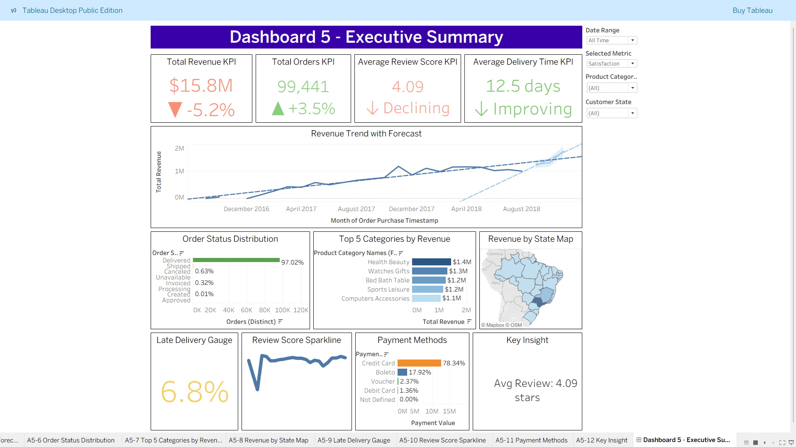
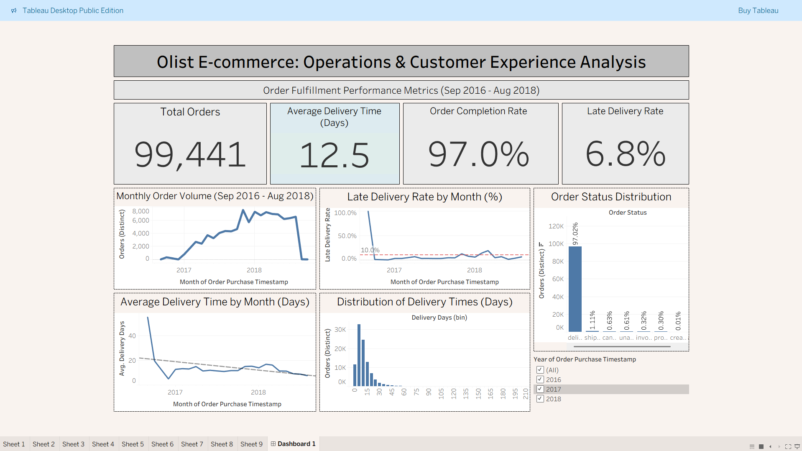
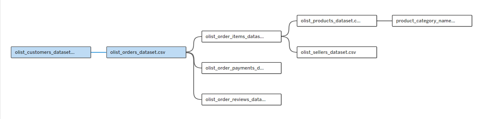

# Tableau — Olist E-commerce Operations & Customer Experience Analysis

> A comprehensive Tableau analysis of 99,441 Olist Brazilian e-commerce orders covering order fulfillment performance, delivery efficiency, revenue trends, customer experience metrics, and marketplace dynamics across five interconnected dashboards.

**Tools:** Tableau Desktop · Calculated Fields · LOD Expressions · Parameters · Forecasting · Dashboard Actions

🔗 **[View Full Project Page](https://nadeaujonny.github.io/projects/tableau-olist-ops-cx/)**

---

## Dashboard Preview

### Executive Summary (Dashboard 5)

*Executive-level overview with KPI cards, revenue forecasting, geographic drill-downs, and parameter-driven interactive filters.*

### Order Fulfillment Performance (Dashboard 1)

*Operational KPIs, delivery time trends, late delivery rate monitoring, and order status distribution.*

---

## Project Overview

This project analyzes operational performance and customer experience in the Olist e-commerce marketplace using Tableau. The analysis spans five dashboards examining order fulfillment metrics, revenue and sales performance, customer review patterns, marketplace ecosystem dynamics, and an executive summary — all built from 8 related tables connected through Tableau's relationship model.

### Business Context

E-commerce marketplaces depend on reliable fulfillment and delivery performance to maintain customer satisfaction and drive repeat purchases. This analysis provides operations, finance, and customer experience teams with visibility into delivery times, revenue trends, review score drivers, seller performance, and marketplace health to support data-driven decision making.

### Dataset

- **Source:** Olist Brazilian E-commerce Public Dataset ([Kaggle](https://www.kaggle.com/datasets/olistbr/brazilian-ecommerce))
- **Time Range:** September 2016 – August 2018
- **Total Orders:** 99,441
- **Granularity:** Order-level data with customer, seller, product, payment, and review information
- **Tables Used:** Orders, Order Items, Customers, Sellers, Products, Product Category Translation, Order Payments, Order Reviews
- **Total Revenue:** $15.8M | **AOV:** $159.33 | **Avg Review Score:** 4.09/5

---

## Objectives

- Measure and track core operational KPIs: total orders, average delivery time, order completion rate, and late delivery rate
- Analyze revenue growth, product category performance, payment method distribution, and geographic revenue concentration
- Evaluate customer satisfaction through review score analysis, delivery impact on ratings, and category-level quality comparison
- Examine marketplace ecosystem health through seller distribution, revenue concentration, and category-seller dynamics
- Synthesize all findings into an executive summary dashboard with forecasting, interactive filters, and drill-down capabilities

---

## Tools & Skills Demonstrated

| Skill Area | Details |
|---|---|
| **Tableau Desktop** | Data relationships, calculated fields, parameters, filters, dashboard design, formatting |
| **Data Modeling** | Multi-table relationships using order_id, customer_id, product_id, seller_id (8 tables) |
| **Calculated Fields** | 17 calculated fields including delivery days, late delivery flags, completion rate, MoM changes, trend indicators |
| **LOD Expressions** | 8 FIXED LOD expressions for period-over-period comparisons and conditional formatting |
| **Parameters** | Date Range parameter (5 options), Selected Metric parameter (4 options) for dynamic filtering |
| **Forecasting** | Tableau's native 3-month forecasting engine with 95% confidence intervals and linear trend lines |
| **Visualization** | KPI cards, time series, bar charts, histograms, treemaps, Pareto charts, scatter plots, choropleth maps, heatmaps, sparklines, gauge charts |
| **Interactivity** | Dashboard actions (Highlight on Hover, Filter from Map), connected filters, Top N sets |

---

## Key Metrics Defined

| Metric | Definition |
|---|---|
| Total Orders | COUNT(DISTINCT Order ID) for delivered orders |
| Average Delivery Time | AVG(Delivered Date - Purchase Date) in days |
| Order Completion Rate | Delivered orders / All orders |
| Late Delivery Rate | Orders delivered after estimated date / All delivered orders |
| Total Revenue | SUM(Price + Freight) across all order items |
| Average Order Value | Total Revenue / Total Orders |
| Revenue Growth Rate | Year-over-year revenue change (2017 → 2018) |
| Average Review Score | AVG(Review Score) across all reviews |

---

## Data Modeling

Connected 8 Olist tables using Tableau's relationship model (rather than joins) to maintain flexibility and proper granularity across different levels of analysis.



**Table Relationships:**
- **olist_orders_dataset** — Central fact table (order_id as primary key)
- **olist_customers_dataset** — Linked via customer_id
- **olist_order_items_dataset** — Linked via order_id (many-to-one)
- **olist_products_dataset** — Linked via product_id
- **product_category_name_translation** — Linked via product_category_name
- **olist_sellers_dataset** — Linked via seller_id
- **olist_order_payments_dataset** — Linked via order_id
- **olist_order_reviews_dataset** — Linked via order_id

**Key Calculated Fields:**
- `Delivery Days`: DATEDIFF('day', [Order Purchase Timestamp], [Order Delivered Customer Date])
- `Late Delivery Flag`: IF [Delivered Date] > [Estimated Date] THEN 1 ELSE 0 END
- `Is Delivered`: IF [Order Status] = "delivered" THEN 1 ELSE 0 END
- MoM change percentages with conditional arrows and color coding
- FIXED LOD expressions for previous-period comparisons

---

## Analyses

### Analysis 1 — Order Fulfillment Performance

**Business Question:** How is the Olist marketplace performing on core operational KPIs, and how have delivery performance and late deliveries trended over time?

**Key Findings:**
- 97% order completion rate indicates reliable fulfillment operations
- Monthly order volume grew from ~400 in late 2016 to ~7,500 in early 2018
- Average delivery time improved from 50+ days in early operations to 12.5 days by 2017–2018
- 6.8% overall late delivery rate with periodic spikes reaching 10–20%
- Most orders delivered within 10–30 days, with a long tail extending beyond 60 days

---

### Analysis 2 — Revenue & Sales Performance

**Business Question:** How has revenue grown over time, which product categories and payment methods drive the most revenue, and how is revenue distributed geographically?

**Key Findings:**
- 21.01% year-over-year growth rate from 2017 to 2018
- Monthly revenue grew from near zero in late 2016 to exceeding $1.2M by early 2018
- Top categories: Health & Beauty ($1.44M), Watches & Gifts ($1.31M), Bed Bath & Table ($1.16M)
- Credit card dominates at 79.68% of revenue; boleto (bank slip) at 17.94%
- Sao Paulo alone accounts for 37% of total revenue; Southeast region drives 60%+

---

### Analysis 3 — Customer Experience & Review Quality

**Business Question:** How satisfied are Olist customers, and how do review scores vary by delivery performance and product category?

**Key Findings:**
- Average review score of 4.09 with 58.25% 5-star rate
- 11.61% 1-star rate indicates a sizable group of poor experiences
- Faster delivery windows align with higher review scores; long delivery times correlate with lower ratings
- Bottom 10 categories trail the average by 0.2–0.5 points
- Category performance scatterplot identifies high-volume categories where small score lifts yield meaningful impact

---

### Analysis 4 — Marketplace Ecosystem: Products & Sellers

**Business Question:** How does the marketplace ecosystem perform across product categories and seller dynamics?

**Key Findings:**
- 32,216 products sold across 71 unique categories; 2,970 active sellers across 22 states
- Low seller concentration (12.93% top 10) indicates a competitive, democratized platform
- Sao Paulo dominates the category-seller heatmap; clear white-space expansion opportunities in underserved states
- Average 1.142 items per order suggests cross-selling opportunity
- Pareto principle validated: ~20% of categories drive ~80% of revenue

---

### Analysis 5 — Executive Summary Dashboard

**Business Question:** What is the overall health of the marketplace, and how can executives quickly assess business status?

**Key Features:**
- 4 KPI cards with MoM percentage changes using FIXED LOD expressions and color-coded trend indicators
- Revenue trend with 3-month forecast, 95% confidence intervals, and linear trend line
- Core analytics row: order status distribution, Top 5 categories (Top N sets), geographic choropleth map
- Performance indicators: late delivery gauge (5% threshold), review sparkline, payment breakdown, dynamic Key Insight box
- Interactive filters: Date Range parameter, Selected Metric parameter, Product Category and Customer State multi-selects
- Dashboard actions: Highlight on Hover across all sheets, Filter from State Map for geographic drill-down

---

## Key Findings (Cross-Analysis)

- **Delivery drives satisfaction:** 6.8% late delivery rate exceeds the 5% target, and late deliveries directly correlate with lower review scores — the most actionable finding across all five analyses
- **Strong growth with concentration risk:** $15.8M revenue with 21% YoY growth, but Sao Paulo accounts for 37% and the Southeast region 60%+
- **Healthy marketplace structure:** 2,970 sellers with low concentration (12.93% top 10) and 97% order completion rate demonstrate reliable core operations
- **AOV compression signal:** Orders grew +3.5% MoM while revenue declined -5.2%, indicating customers are ordering more but spending less per order
- **Declining satisfaction trend:** Average review score of 4.09 with a declining trend requires intervention before it impacts repeat purchases

---

## Project Structure

```
tableau-olist-ops-cx/
├── index.md                                                  # Project page (GitHub Pages)
├── README.md                                                 # This file
├── workbook/
│   └── tableau_olist_ops_cx_v1_raw_load.twbx                 # Tableau Packaged Workbook
└── images/                                                   # Dashboard screenshots & visualizations
    ├── tableau-data-connections.png                            # Data model diagram
    ├── tableau-analysis-1-dashboard.png                       # Fulfillment Performance
    ├── tableau-analysis-1-*.png                               # Analysis 1 charts (10 images)
    ├── tableau-analysis-2-dashboard.png                       # Revenue & Sales
    ├── tableau-analysis-2-*.png                               # Analysis 2 charts (8 images)
    ├── tableau-analysis-3-dashboard.png                       # Customer Experience
    ├── tableau-analysis-3-*.png                               # Analysis 3 charts (11 images)
    ├── tableau-analysis-4-dashboard-shot-*.png                # Marketplace Ecosystem (4 images)
    └── tableau-analysis-5-dashboard.png                       # Executive Summary
```

---

## Explore the Dashboard

- **Tableau Public:** [View Interactive Dashboard](https://public.tableau.com/views/tableau_olist_ops_cx_v1_raw_load/Dashboard5-ExecutiveSummary?:language=en-US&:sid=&:redirect=auth&:display_count=n&:origin=viz_share_link)
- **Dataset:** [Brazilian E-commerce Public Dataset by Olist (Kaggle)](https://www.kaggle.com/datasets/olistbr/brazilian-ecommerce)

---

## Conclusion

This project demonstrates a complete Tableau analytics workflow applied to a real-world e-commerce dataset: connecting 8 related tables through Tableau's relationship model, building 17 calculated fields and 8 FIXED LOD expressions, and delivering 5 interconnected dashboards that progress from operational detail to executive synthesis. The analysis covers fulfillment operations, revenue and sales trends, customer experience drivers, marketplace ecosystem dynamics, and an executive summary with forecasting and interactive drill-down capabilities.

Each dashboard was designed to answer a distinct business question, but the findings compound when viewed together: fulfillment issues identified in Analysis 1 directly explain the satisfaction patterns in Analysis 3, geographic concentration from Analysis 2 maps to seller distribution in Analysis 4, and the Executive Summary synthesizes all threads into a single monitoring surface for ongoing operational use.

---

## Author

**Jonathan Nadeau**

- 🌐 [Portfolio Website](https://nadeaujonny.github.io/)
- 💼 [LinkedIn](https://www.linkedin.com/in/nadeau-jonathan)
- 📧 [nadeau.jonny@gmail.com](mailto:nadeau.jonny@gmail.com)
