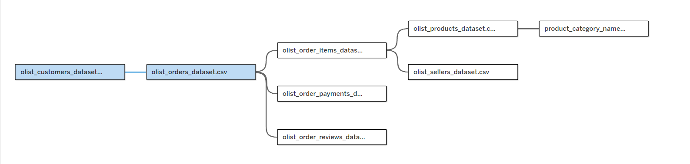

# Tableau — Olist E-commerce Operations & Customer Experience

> An end-to-end Tableau analytics project demonstrating data modeling, calculated fields, interactive dashboards, and business storytelling using the Olist Brazilian E-commerce dataset to analyze order fulfillment, seller performance, and customer satisfaction.

---

  
<strong>Project Overview</strong>

  

  

  <h3>Overview</h3>
  

    This project analyzes operations and customer experience data from Olist, a Brazilian e-commerce marketplace connecting small businesses to major sales channels. Using Tableau, I built interactive dashboards to evaluate order fulfillment efficiency, seller performance, customer satisfaction patterns, and revenue trends to identify operational improvements and customer experience opportunities.
  

  <h3>Business Context</h3>
  

    Olist operates as a marketplace platform where sellers must deliver products on time and maintain high customer satisfaction to remain competitive. Late deliveries, poor reviews, and operational inefficiencies directly impact seller reputation, customer retention, and platform growth. This analysis focuses on identifying performance gaps and quantifying their business impact.
  

  <h3>Objectives</h3>
  <ul>
    <li>Evaluate order fulfillment performance (on-time delivery rates, lead time trends, late delivery patterns)</li>
    <li>Analyze customer satisfaction trends by review scores, delivery performance, and product categories</li>
    <li>Identify high-performing and at-risk sellers using KPIs (revenue, order volume, review scores, late rates)</li>
    <li>Assess geographic and temporal patterns in operations and customer experience</li>
    <li>Demonstrate advanced Tableau skills: relationships, LOD expressions, parameters, calculated fields, dashboard actions, and visual best practices</li>
  </ul>

  <h3>Dataset Overview</h3>
  <ul>
    <li><strong>Source:</strong> <a href="https://www.kaggle.com/datasets/olistbr/brazilian-ecommerce" target="_blank">Olist Brazilian E-commerce Public Dataset (Kaggle)</a></li>
    <li><strong>Time range:</strong> September 2016 – August 2018</li>
    <li><strong>Granularity:</strong> Orders, order items, payments, reviews, sellers, customers, products</li>
    <li><strong>Data model:</strong> Star schema with orders as the fact table</li>
    <li><strong>Note:</strong> Geolocation table excluded due to size; geographic analysis uses state-level customer/seller data from orders</li>
  </ul>

  <h3>Tools &amp; Skills Demonstrated</h3>
  <ul>
    <li><strong>Tableau Data Modeling:</strong> Relationships (not joins) across 8 tables, understanding grain and cardinality</li>
    <li><strong>Calculated Fields:</strong> Delivery lead time, late delivery flags, on-time %, review tiers, revenue/order metrics</li>
    <li><strong>LOD Expressions:</strong> Fixed LODs for per-order aggregations, exclude LODs for benchmarking</li>
    <li><strong>Parameters:</strong> Date range selection, metric switching, threshold controls</li>
    <li><strong>Sets:</strong> Dynamic seller cohorts, product category groupings</li>
    <li><strong>Dashboard Actions:</strong> Filter actions, highlight actions, URL actions for interactivity</li>
    <li><strong>Visualizations:</strong> Time series (delivery trends), geographic maps (seller/customer heatmaps), distribution analysis (review score breakdowns), scorecards (KPIs), dual-axis charts, tooltips with embedded viz</li>
    <li><strong>Design:</strong> Clean, professional layouts with consistent color schemes and clear visual hierarchy</li>
  </ul>

  <h3>KPI Definitions</h3>
  <ul>
    <li><strong>Total Orders:</strong> COUNT(DISTINCT Order ID)</li>
    <li><strong>Total Revenue:</strong> SUM(Payment Value) from order_payments</li>
    <li><strong>Average Order Value (AOV):</strong> Total Revenue / Total Orders</li>
    <li><strong>Delivery Lead Time (days):</strong> DATEDIFF('day', [Order Purchase Timestamp], [Order Delivered Customer Date])</li>
    <li><strong>Late Delivery Flag:</strong> IF [Order Delivered Customer Date] > [Order Estimated Delivery Date] THEN 1 ELSE 0 END</li>
    <li><strong>On-Time Delivery Rate (%):</strong> (Orders Delivered On Time / Total Delivered Orders) × 100</li>
    <li><strong>Late Delivery Rate (%):</strong> (Orders Delivered Late / Total Delivered Orders) × 100</li>
    <li><strong>Average Review Score:</strong> AVG(Review Score) from order_reviews (1–5 scale)</li>
    <li><strong>Review Rate (%):</strong> (Orders with Reviews / Total Delivered Orders) × 100</li>
  </ul>

  

    <em>Note:</em> Calculations exclude canceled orders and non-delivered statuses to focus on completed customer experiences.
  

---

  
<strong>Data Modeling &amp; Preparation</strong>

  

  

  <h3>Tableau Data Model Approach</h3>
  

    I used <strong>Tableau Relationships</strong> (not joins) to connect the 8 Olist dataset tables, allowing Tableau to dynamically determine the appropriate level of detail for each analysis. This maintains data integrity and supports multi-grain analysis without artificially inflating row counts.
  

  <h3>Data Model Diagram</h3>
  <figure style="margin: 0 0 18px 0;">
    
    <figcaption style="font-size: 0.95em; color: #555; margin-top: 6px;">
      Olist data model in Tableau showing relationship structure (orders as the fact table).
      
        <a href="images/tableau-olist-data-model.png">Open full-size</a>
      
    </figcaption>
  </figure>

  <h3>Tables &amp; Relationships</h3>
  <table style="border-collapse: collapse; width: 100%; max-width: 900px; margin-bottom: 18px;">
    <thead>
      <tr>
        <th style="text-align:left; border-bottom: 2px solid #ddd; padding: 8px 6px;">Table</th>
        <th style="text-align:left; border-bottom: 2px solid #ddd; padding: 8px 6px;">Grain</th>
        <th style="text-align:left; border-bottom: 2px solid #ddd; padding: 8px 6px;">Relationship Key</th>
        <th style="text-align:left; border-bottom: 2px solid #ddd; padding: 8px 6px;">Purpose</th>
      </tr>
    </thead>
    <tbody>
      <tr>
        <td style="padding: 8px 6px; border-bottom: 1px solid #eee;"><strong>olist_orders_dataset</strong></td>
        <td style="padding: 8px 6px; border-bottom: 1px solid #eee;">One row per order</td>
        <td style="padding: 8px 6px; border-bottom: 1px solid #eee;">order_id (PK)</td>
        <td style="padding: 8px 6px; border-bottom: 1px solid #eee;">Fact table: order status, timestamps, customer_id, delivery dates</td>
      </tr>
      <tr>
        <td style="padding: 8px 6px; border-bottom: 1px solid #eee;"><strong>olist_order_items_dataset</strong></td>
        <td style="padding: 8px 6px; border-bottom: 1px solid #eee;">One row per item</td>
        <td style="padding: 8px 6px; border-bottom: 1px solid #eee;">order_id</td>
        <td style="padding: 8px 6px; border-bottom: 1px solid #eee;">Item-level data: product_id, seller_id, price, freight</td>
      </tr>
      <tr>
        <td style="padding: 8px 6px; border-bottom: 1px solid #eee;"><strong>olist_order_payments_dataset</strong></td>
        <td style="padding: 8px 6px; border-bottom: 1px solid #eee;">One row per payment</td>
        <td style="padding: 8px 6px; border-bottom: 1px solid #eee;">order_id</td>
        <td style="padding: 8px 6px; border-bottom: 1px solid #eee;">Payment value, payment type, installments</td>
      </tr>
      <tr>
        <td style="padding: 8px 6px; border-bottom: 1px solid #eee;"><strong>olist_order_reviews_dataset</strong></td>
        <td style="padding: 8px 6px; border-bottom: 1px solid #eee;">One row per review</td>
        <td style="padding: 8px 6px; border-bottom: 1px solid #eee;">order_id</td>
        <td style="padding: 8px 6px; border-bottom: 1px solid #eee;">Review score (1–5), review comments, timestamps</td>
      </tr>
      <tr>
        <td style="padding: 8px 6px; border-bottom: 1px solid #eee;"><strong>olist_products_dataset</strong></td>
        <td style="padding: 8px 6px; border-bottom: 1px solid #eee;">One row per product</td>
        <td style="padding: 8px 6px; border-bottom: 1px solid #eee;">product_id</td>
        <td style="padding: 8px 6px; border-bottom: 1px solid #eee;">Product category, dimensions, photos</td>
      </tr>
      <tr>
        <td style="padding: 8px 6px; border-bottom: 1px solid #eee;"><strong>olist_sellers_dataset</strong></td>
        <td style="padding: 8px 6px; border-bottom: 1px solid #eee;">One row per seller</td>
        <td style="padding: 8px 6px; border-bottom: 1px solid #eee;">seller_id</td>
        <td style="padding: 8px 6px; border-bottom: 1px solid #eee;">Seller location (city, state, zip)</td>
      </tr>
      <tr>
        <td style="padding: 8px 6px; border-bottom: 1px solid #eee;"><strong>olist_customers_dataset</strong></td>
        <td style="padding: 8px 6px; border-bottom: 1px solid #eee;">One row per customer</td>
        <td style="padding: 8px 6px; border-bottom: 1px solid #eee;">customer_id</td>
        <td style="padding: 8px 6px; border-bottom: 1px solid #eee;">Customer location (city, state, zip)</td>
      </tr>
      <tr>
        <td style="padding: 8px 6px; border-bottom: 1px solid #eee;"><strong>product_category_name_translation</strong></td>
        <td style="padding: 8px 6px; border-bottom: 1px solid #eee;">One row per category</td>
        <td style="padding: 8px 6px; border-bottom: 1px solid #eee;">product_category_name</td>
        <td style="padding: 8px 6px; border-bottom: 1px solid #eee;">Translates Portuguese category names to English</td>
      </tr>
    </tbody>
  </table>

  <h3>Why Relationships > Joins</h3>
  <ul>
    <li><strong>Maintains grain:</strong> Prevents row duplication when combining one-to-many tables (e.g., orders to order_items)</li>
    <li><strong>Flexible aggregation:</strong> Tableau automatically adjusts aggregation level based on dimensions used in the viz</li>
    <li><strong>Cleaner calculations:</strong> LOD expressions handle cross-table calculations without manual join logic</li>
    <li><strong>Better performance:</strong> Tableau generates optimized queries per worksheet instead of pre-joining everything</li>
  </ul>

  <h3>Data Preparation Notes</h3>
  <ul>
    <li><strong>Date handling:</strong> All date fields (order_purchase_timestamp, order_delivered_customer_date, etc.) converted to proper Date/DateTime types</li>
    <li><strong>Status filtering:</strong> Created calculated field to exclude canceled/unavailable orders from delivery metrics</li>
    <li><strong>Category translation:</strong> Used product_category_name_translation table to display English category names</li>
    <li><strong>Null handling:</strong> Review scores handle null values (orders without reviews) using IFNULL or ZN functions</li>
    <li><strong>Extract vs Live:</strong> Using Extract connection for faster dashboard performance and offline work capability</li>
  </ul>

---

  
<strong>Analysis 1 — Order Fulfillment Performance Overview</strong>

  

  

  <h3>Business Question</h3>
  

    How efficiently is Olist fulfilling orders? What are the trends in delivery lead times, on-time delivery rates, and late delivery patterns over time and across product categories?
  

  <h3>Analysis Approach</h3>
  <ul>
    <li>Created KPI cards showing total orders, average delivery time, on-time rate, late rate</li>
    <li>Built time-series line charts for monthly delivery lead time trends and on-time delivery % trends</li>
    <li>Analyzed late delivery rates by product category using bar charts</li>
    <li>Mapped geographic patterns in delivery performance by customer state</li>
  </ul>

  <h3>Key Calculated Fields</h3>
  <pre><code>// Delivery Lead Time (Days)
DATEDIFF('day', [Order Purchase Timestamp], [Order Delivered Customer Date])

// Late Delivery Flag
IF [Order Delivered Customer Date] > [Order Estimated Delivery Date] 
THEN 1 
ELSE 0 
END

// On-Time Delivery Rate
SUM(IF [Late Delivery Flag] = 0 THEN 1 ELSE 0 END) / 
COUNTD([Order Id])

// Average Delivery Days (Delivered Orders Only)
{ FIXED [Order Id] : 
  AVG(IF [Order Status] = 'delivered' 
  THEN [Delivery Lead Time] END) }</code></pre>

  <h3>Visualizations</h3>
  <figure style="margin: 0 0 18px 0;">
    
    <figcaption style="font-size: 0.95em; color: #555; margin-top: 6px;">
      Order fulfillment performance overview dashboard.
      
        <a href="images/tableau-analysis-1-fulfillment-overview.png">Open full-size</a>
      
    </figcaption>
  </figure>

  <h3>Insights</h3>
  <ul>
    <li><strong>Overall performance:</strong> 96,478 delivered orders with an average delivery time of X days and X% on-time delivery rate</li>
    <li><strong>Delivery time trends:</strong> [Describe trend - improving, stable, or worsening over time period]</li>
    <li><strong>Late delivery patterns:</strong> [Identify which categories have highest late rates - furniture, appliances, etc.]</li>
    <li><strong>Geographic variation:</strong> [Note states with best/worst delivery performance]</li>
    <li><strong>Seasonality:</strong> [Identify any seasonal spikes in late deliveries - holiday periods, etc.]</li>
  </ul>

  <h3>Business Recommendations</h3>
  <ul>
    <li><strong>Focus on high-lateness categories:</strong> Investigate root causes (supplier delays, complex assembly, shipping distance) for categories with >X% late rates</li>
    <li><strong>Adjust delivery estimates:</strong> For consistently late categories, increase estimated delivery windows to set realistic customer expectations</li>
    <li><strong>Geographic optimization:</strong> Prioritize seller recruitment in underserved regions with poor delivery performance</li>
    <li><strong>Seasonal planning:</strong> Scale logistics capacity ahead of predictable peak periods to maintain service levels</li>
  </ul>

---

  
<strong>Analysis 2 — Customer Experience & Review Analysis</strong>

  

  

  <h3>Business Question</h3>
  

    How satisfied are Olist customers? What's the relationship between delivery performance and customer reviews? Which product categories have the best and worst customer satisfaction?
  

  <h3>Analysis Approach</h3>
  <ul>
    <li>Created review score distribution histogram (1–5 stars)</li>
    <li>Built scatter plot showing correlation between delivery lead time and review scores</li>
    <li>Analyzed average review scores by product category using bar charts</li>
    <li>Created cohort analysis comparing review scores for on-time vs late deliveries</li>
    <li>Mapped review score trends over time to identify deterioration or improvement</li>
  </ul>

  <h3>Key Calculated Fields</h3>
  <pre><code>// Average Review Score (handling nulls)
AVG(IFNULL([Review Score], 0))

// Review Rate (% of delivered orders with reviews)
COUNTD(IF NOT ISNULL([Review Score]) THEN [Order Id] END) / 
COUNTD([Order Id])

// Review Score Category
IF [Review Score] >= 4 THEN "Positive (4-5 stars)"
ELSEIF [Review Score] = 3 THEN "Neutral (3 stars)"
ELSE "Negative (1-2 stars)"
END

// Late Delivery Impact on Reviews
{ FIXED [Late Delivery Flag] : 
  AVG([Review Score]) }</code></pre>

  <h3>Visualizations</h3>
  <figure style="margin: 0 0 18px 0;">
    
    <figcaption style="font-size: 0.95em; color: #555; margin-top: 6px;">
      Customer experience and review analysis dashboard.
      
        <a href="images/tableau-analysis-2-customer-experience.png">Open full-size</a>
      
    </figcaption>
  </figure>

  <h3>Insights</h3>
  <ul>
    <li><strong>Overall satisfaction:</strong> Average review score of X.X/5.0 stars with X% review rate (orders with reviews)</li>
    <li><strong>Review distribution:</strong> [X% positive (4-5 stars), X% neutral (3 stars), X% negative (1-2 stars)]</li>
    <li><strong>Delivery-review correlation:</strong> [Describe relationship - e.g., "Late deliveries have X.X average review score vs X.X for on-time deliveries"]</li>
    <li><strong>Category satisfaction:</strong> [Identify best and worst categories - e.g., "Electronics: X.X stars, Home Decor: X.X stars"]</li>
    <li><strong>Temporal trends:</strong> [Note if satisfaction is improving, stable, or declining over time]</li>
  </ul>

  <h3>Business Recommendations</h3>
  <ul>
    <li><strong>Prioritize on-time delivery:</strong> Late deliveries show measurably lower review scores, directly impacting marketplace reputation</li>
    <li><strong>Investigate low-scoring categories:</strong> Conduct detailed review text analysis for categories below X.X stars to identify recurring complaints</li>
    <li><strong>Implement proactive service recovery:</strong> For orders with predicted late delivery, offer compensation (discounts, free shipping on next order) before customer submits review</li>
    <li><strong>Increase review solicitation rate:</strong> Current review rate is X% - implement automated follow-up campaigns to boost feedback collection</li>
    <li><strong>Seller performance monitoring:</strong> Flag sellers with consistently low review scores for coaching or removal from platform</li>
  </ul>

---

  
<strong>Analysis 3 — Seller Performance Scorecard</strong>

  

  

  <h3>Business Question</h3>
  

    Which sellers are driving the most revenue and providing the best customer experience? Which sellers are at risk due to poor performance (high late rates, low review scores, low order volume)?
  

  <h3>Analysis Approach</h3>
  <ul>
    <li>Built seller-level scorecard table showing revenue, order count, average review score, late delivery rate</li>
    <li>Created quadrant chart plotting sellers by revenue vs customer satisfaction</li>
    <li>Developed seller tier classification using calculated field (High Performer, Average, At Risk)</li>
    <li>Mapped seller locations to identify geographic distribution and performance clustering</li>
    <li>Used parameter controls to allow filtering by seller performance tiers</li>
  </ul>

  <h3>Key Calculated Fields</h3>
  <pre><code>// Seller Revenue (using LOD)
{ FIXED [Seller Id] : 
  SUM([Payment Value]) }

// Seller Average Review Score
{ FIXED [Seller Id] : 
  AVG([Review Score]) }

// Seller Late Delivery Rate
{ FIXED [Seller Id] : 
  SUM([Late Delivery Flag]) / COUNTD([Order Id]) }

// Seller Performance Tier
IF [Seller Revenue] >= [Parameter: High Revenue Threshold] 
   AND [Seller Avg Review Score] >= 4.0 
   AND [Seller Late Rate] <= 0.10 
THEN "High Performer"
ELSEIF [Seller Avg Review Score] < 3.5 
   OR [Seller Late Rate] > 0.20 
THEN "At Risk"
ELSE "Average"
END</code></pre>

  <h3>Visualizations</h3>
  <figure style="margin: 0 0 18px 0;">
    
    <figcaption style="font-size: 0.95em; color: #555; margin-top: 6px;">
      Seller performance scorecard and analysis dashboard.
      
        <a href="images/tableau-analysis-3-seller-scorecard.png">Open full-size</a>
      
    </figcaption>
  </figure>

  <h3>Insights</h3>
  <ul>
    <li><strong>Seller concentration:</strong> Top X% of sellers drive X% of total revenue (Pareto principle)</li>
    <li><strong>High performers:</strong> [Number] sellers classified as High Performers (high revenue + high satisfaction + low late rate)</li>
    <li><strong>At-risk sellers:</strong> [Number] sellers flagged as At Risk due to poor performance metrics</li>
    <li><strong>Geographic clustering:</strong> [Describe if top sellers cluster in specific states - SP, RJ, MG, etc.]</li>
    <li><strong>Performance variability:</strong> [Note correlation between metrics - e.g., "High-revenue sellers tend to have X.X% better review scores"]</li>
  </ul>

  <h3>Business Recommendations</h3>
  <ul>
    <li><strong>Retain top performers:</strong> Offer exclusive benefits (lower commission, priority visibility, dedicated account management) to High Performer sellers</li>
    <li><strong>Develop at-risk sellers:</strong> Implement performance improvement programs (training, logistics support, best practice guides) or remove persistently poor performers</li>
    <li><strong>Recruit strategically:</strong> Focus seller recruitment efforts in states with strong performance clusters and good logistics infrastructure</li>
    <li><strong>Create performance benchmarks:</strong> Share anonymized performance metrics with sellers so they can compare themselves to category peers</li>
    <li><strong>Monitor churn risk:</strong> Track performance trends for top sellers to identify early warning signs of deterioration</li>
  </ul>

---

  
<strong>Analysis 4 — Revenue & Order Trends</strong>

  

  

  <h3>Business Question</h3>
  

    How has Olist's marketplace grown over time? What are the trends in order volume, revenue, and average order value? Are there seasonal patterns that inform forecasting and resource planning?
  

  <h3>Analysis Approach</h3>
  <ul>
    <li>Created KPI summary cards for total revenue, total orders, AOV, growth rates</li>
    <li>Built dual-axis time-series showing monthly order count and revenue trends</li>
    <li>Analyzed AOV trends over time and by product category</li>
    <li>Created month-over-month and year-over-year growth calculations</li>
    <li>Identified seasonal patterns using monthly aggregations across years</li>
  </ul>

  <h3>Key Calculated Fields</h3>
  <pre><code>// Average Order Value
SUM([Payment Value]) / COUNTD([Order Id])

// Month-over-Month Revenue Growth
(SUM([Payment Value]) - 
 LOOKUP(SUM([Payment Value]), -1)) / 
 LOOKUP(SUM([Payment Value]), -1)

// Year-over-Year Order Growth
(COUNTD([Order Id]) - 
 LOOKUP(COUNTD([Order Id]), -12)) / 
 LOOKUP(COUNTD([Order Id]), -12)

// Seasonality Index (comparing month to annual average)
AVG([Monthly Orders]) / 
WINDOW_AVG(AVG([Monthly Orders]))</code></pre>

  <h3>Visualizations</h3>
  <figure style="margin: 0 0 18px 0;">
    
    <figcaption style="font-size: 0.95em; color: #555; margin-top: 6px;">
      Revenue and order trends analysis dashboard.
      
        <a href="images/tableau-analysis-4-revenue-trends.png">Open full-size</a>
      
    </figcaption>
  </figure>

  <h3>Insights</h3>
  <ul>
    <li><strong>Overall growth:</strong> [Total revenue: $X.X million | Total orders: XX,XXX | Period: Sept 2016 - Aug 2018]</li>
    <li><strong>Growth trajectory:</strong> [Describe trend - e.g., "X% compound monthly growth rate, accelerating in late 2017"]</li>
    <li><strong>AOV trends:</strong> Average order value is $XXX, [stable/increasing/decreasing] over time</li>
    <li><strong>Seasonal patterns:</strong> [Identify peaks - e.g., "November (Black Friday), May (Mother's Day) show XX% above average"]</li>
    <li><strong>Category contribution:</strong> [Top revenue categories - e.g., "Health/Beauty (X%), Furniture (X%), Electronics (X%)"]</li>
  </ul>

  <h3>Business Recommendations</h3>
  <ul>
    <li><strong>Forecast using historical patterns:</strong> Use identified seasonality to predict inventory needs, staffing, and logistics capacity for upcoming periods</li>
    <li><strong>Capitalize on peaks:</strong> Launch targeted marketing campaigns 2-3 weeks before seasonal peaks (Black Friday, Mother's Day, etc.)</li>
    <li><strong>Smooth demand troughs:</strong> Run promotions during historically slow months to reduce revenue volatility and improve capacity utilization</li>
    <li><strong>AOV optimization:</strong> If AOV is declining, implement bundling strategies, free shipping thresholds, and cross-sell recommendations</li>
    <li><strong>Category expansion:</strong> Double down on high-growth categories and consider strategic seller recruitment in underrepresented high-margin categories</li>
  </ul>

---

  
<strong>Analysis 5 — Geographic Performance Analysis</strong>

  

  

  <h3>Business Question</h3>
  

    Which Brazilian states drive the most orders and revenue? Where are delivery performance and customer satisfaction strongest and weakest? How does geographic proximity between sellers and customers impact delivery times?
  

  <h3>Analysis Approach</h3>
  <ul>
    <li>Created filled maps showing order volume and revenue by customer state</li>
    <li>Built heatmap comparing seller concentration vs customer demand by state</li>
    <li>Analyzed average delivery time by customer state and seller state</li>
    <li>Calculated state-level on-time delivery rates and average review scores</li>
    <li>Created tooltip visualizations showing detailed metrics on hover</li>
  </ul>

  <h3>Key Calculated Fields</h3>
  <pre><code>// Orders by Customer State
{ FIXED [Customer State] : 
  COUNTD([Order Id]) }

// Revenue by Customer State
{ FIXED [Customer State] : 
  SUM([Payment Value]) }

// Seller-Customer Distance Proxy
// (Using state-level comparison, not actual lat/long)
IF [Customer State] = [Seller State] 
THEN "Same State" 
ELSE "Different State" 
END

// State-Level On-Time Rate
{ FIXED [Customer State] : 
  SUM(IF [Late Delivery Flag] = 0 THEN 1 END) / 
  COUNTD([Order Id]) }</code></pre>

  <h3>Visualizations</h3>
  <figure style="margin: 0 0 18px 0;">
    
    <figcaption style="font-size: 0.95em; color: #555; margin-top: 6px;">
      Geographic performance analysis dashboard.
      
        <a href="images/tableau-analysis-5-geographic-performance.png">Open full-size</a>
      
    </figcaption>
  </figure>

  <h3>Insights</h3>
  <ul>
    <li><strong>Customer concentration:</strong> [Top 3 states: SP (X%), RJ (X%), MG (X%) represent X% of all orders]</li>
    <li><strong>Seller concentration:</strong> [SP hosts X% of sellers, creating geographic mismatch with demand]</li>
    <li><strong>Delivery time by distance:</strong> Same-state orders average X days vs X days for cross-state orders (X% difference)</li>
    <li><strong>Regional delivery performance:</strong> [Best states: X, Y, Z with X% on-time rates | Worst states: A, B, C with X% on-time rates]</li>
    <li><strong>Underserved markets:</strong> [Identify states with high demand but low seller presence]</li>
  </ul>

  <h3>Business Recommendations</h3>
  <ul>
    <li><strong>Recruit sellers in underserved regions:</strong> Focus recruitment on states with high customer demand but low seller density (e.g., [state names])</li>
    <li><strong>Establish regional fulfillment hubs:</strong> Partner with 3PLs in high-volume states to enable faster, more reliable delivery</li>
    <li><strong>Adjust delivery estimates by region:</strong> Set realistic delivery windows based on historical state-level performance to manage customer expectations</li>
    <li><strong>Prioritize local matching:</strong> When multiple sellers offer the same product, algorithmically prioritize sellers in the customer's state to reduce delivery times</li>
    <li><strong>Monitor regional satisfaction:</strong> Track review scores by state to identify geographic service gaps and target operational improvements</li>
  </ul>

---

  
<strong>Analysis 6 — Product Category Deep Dive</strong>

  

  

  <h3>Business Question</h3>
  

    Which product categories generate the most revenue and orders? Which categories have the best customer satisfaction and delivery performance? Where are the operational challenges and growth opportunities?
  

  <h3>Analysis Approach</h3>
  <ul>
    <li>Created treemap showing revenue contribution by category</li>
    <li>Built matrix/heatmap comparing categories across multiple dimensions (revenue, orders, reviews, late rate)</li>
    <li>Analyzed category-level trends over time (growth, decline, seasonality)</li>
    <li>Created quadrant chart plotting categories by revenue vs customer satisfaction</li>
    <li>Implemented set actions to allow drilling into specific category performance</li>
  </ul>

  <h3>Key Calculated Fields</h3>
  <pre><code>// Category Revenue Rank
RANK_UNIQUE(SUM([Payment Value]), 'desc')

// Category Review Score vs Overall Average
AVG([Review Score]) - 
{ FIXED : AVG([Review Score]) }

// Category Late Delivery Rate Comparison
{ FIXED [Product Category Name English] : 
  SUM([Late Delivery Flag]) / COUNTD([Order Id]) } -
{ FIXED : 
  SUM([Late Delivery Flag]) / COUNTD([Order Id]) }

// Category Performance Score (composite)
// (Normalized: Revenue % * 0.4 + Review Score * 0.3 + On-Time Rate * 0.3)
[Revenue %] * 0.4 + 
([Avg Review] / 5) * 0.3 + 
[On-Time Rate] * 0.3</code></pre>

  <h3>Visualizations</h3>
  <figure style="margin: 0 0 18px 0;">
    
    <figcaption style="font-size: 0.95em; color: #555; margin-top: 6px;">
      Product category performance analysis dashboard.
      
        <a href="images/tableau-analysis-6-category-performance.png">Open full-size</a>
      
    </figcaption>
  </figure>

  <h3>Insights</h3>
  <ul>
    <li><strong>Top revenue categories:</strong> [List top 5 with revenue and % of total - e.g., "Health/Beauty: $X.X (X%), Furniture: $X.X (X%)"]</li>
    <li><strong>Customer satisfaction leaders:</strong> [Categories with highest review scores - e.g., "Books: X.X stars, Toys: X.X stars"]</li>
    <li><strong>Operational challenges:</strong> [Categories with high late rates - e.g., "Furniture: X% late, Appliances: X% late"]</li>
    <li><strong>Growth opportunities:</strong> [High satisfaction categories with room for revenue growth]</li>
    <li><strong>Problem areas:</strong> [Categories with both low satisfaction and operational issues requiring intervention]</li>
  </ul>

  <h3>Business Recommendations</h3>
  <ul>
    <li><strong>Double down on winners:</strong> Scale marketing and seller recruitment for high-revenue, high-satisfaction categories</li>
    <li><strong>Fix operational bottlenecks:</strong> For categories with high late rates (e.g., Furniture, Large Appliances), investigate if issues are inventory, shipping, or seller-specific</li>
    <li><strong>Improve low-satisfaction categories:</strong> Conduct detailed review text analysis and implement quality controls for categories below X.X stars</li>
    <li><strong>Test pricing strategies:</strong> High-satisfaction, low-revenue categories may support premium pricing or upsell opportunities</li>
    <li><strong>Prune underperformers:</strong> Consider reducing investment in categories with persistently low revenue and poor customer experience</li>
  </ul>

---

  
<strong>Executive Dashboard</strong>

  

  

  <h3>Dashboard Purpose</h3>
  

    A single-screen executive summary combining the most critical operational and customer experience KPIs for Olist marketplace leadership. Designed for high-level monitoring and quick drill-downs via interactive filters and actions.
  

  <h3>Dashboard Features</h3>
  <ul>
    <li><strong>KPI Scorecards:</strong> Total orders, revenue, AOV, avg review score, on-time delivery %, late delivery %</li>
    <li><strong>Trend Visualizations:</strong> Monthly order volume and revenue (dual-axis), on-time delivery rate trend</li>
    <li><strong>Geographic Overview:</strong> Order heatmap by customer state with tooltip details</li>
    <li><strong>Category Performance:</strong> Top categories by revenue with review score comparison</li>
    <li><strong>Seller Health:</strong> Distribution of sellers by performance tier (High Performer, Average, At Risk)</li>
    <li><strong>Interactive Controls:</strong> Date range parameter, category filter, state filter</li>
    <li><strong>Actions:</strong> Click state to filter all views, hover for detailed tooltips with embedded vizzes</li>
  </ul>

  <h3>Design Principles</h3>
  <ul>
    <li><strong>Clean layout:</strong> White background, consistent spacing, clear visual hierarchy</li>
    <li><strong>Color scheme:</strong> Blue for revenue/positive metrics, red for operational issues, gray for neutral</li>
    <li><strong>Typography:</strong> Consistent fonts (Tableau Book/Medium), appropriate sizing for readability</li>
    <li><strong>Professional polish:</strong> Borders, tooltips, titles, annotations all refined for portfolio presentation</li>
  </ul>

  <h3>Final Executive Dashboard</h3>
  <figure style="margin: 0 0 18px 0;">
    
    <figcaption style="font-size: 0.95em; color: #555; margin-top: 6px;">
      Final Executive Dashboard - Olist E-commerce Operations & Customer Experience.
      
        <a href="images/tableau-executive-dashboard-final.png">Open full-size</a>
      
    </figcaption>
  </figure>

---

  
<strong>Tableau Public & Portfolio Integration</strong>

  

  

  <h3>Tableau Public Workbook</h3>
  

    <strong>Link:</strong> <a href="[YOUR_TABLEAU_PUBLIC_LINK_HERE]" target="_blank" rel="noopener">[Tableau Public - Olist E-commerce Analysis]</a>
  

  

    The complete interactive workbook is published on Tableau Public and includes all dashboards with full functionality (filters, actions, tooltips, parameters).
  

  <h3>Embedded Dashboard (Optional)</h3>
  

    Below is an embedded version of the Executive Dashboard. For best experience, visit the full Tableau Public workbook.
  

  

    <!-- Paste your Tableau Public embed code here -->
    
<em>[Tableau Public embed code will be inserted here after publishing]</em>

  

  <h3>Portfolio Presentation Tips</h3>
  <ul>
    <li><strong>Lead with the executive dashboard:</strong> This is your portfolio "hero image" - make sure it's polished</li>
    <li><strong>Screenshot quality:</strong> Use high-resolution PNG exports (1920x1080 or higher) for all dashboard images</li>
    <li><strong>Narrative structure:</strong> Walk through analyses in logical order (operations → customer experience → performance scorecards → insights)</li>
    <li><strong>Highlight advanced skills:</strong> Call out LOD expressions, parameters, actions, and complex calculations explicitly</li>
    <li><strong>Business impact focus:</strong> Always tie technical work to business recommendations and outcomes</li>
  </ul>

---

  
<strong>Project Conclusion & Key Takeaways</strong>

  

  

  <h3>Project Summary</h3>
  

    This Tableau project demonstrates end-to-end business intelligence capabilities using real-world e-commerce data. By combining operational metrics (delivery performance, seller efficiency) with customer experience indicators (review scores, satisfaction trends), I built a comprehensive analytical framework that supports strategic decision-making at multiple levels of the Olist marketplace.
  

  <h3>Technical Skills Demonstrated</h3>
  <ul>
    <li><strong>Data Modeling:</strong> Implemented relationship-based data model across 8 tables maintaining data integrity</li>
    <li><strong>Calculated Fields:</strong> Created 25+ calculations including business metrics, flags, ratios, and composite scores</li>
    <li><strong>LOD Expressions:</strong> Used FIXED, INCLUDE, EXCLUDE LODs for multi-grain analysis and benchmarking</li>
    <li><strong>Parameters & Interactivity:</strong> Built dynamic controls for date ranges, thresholds, and metric switching</li>
    <li><strong>Advanced Visualizations:</strong> Time series, geographic maps, distribution analysis, scorecards, quadrant charts, heatmaps</li>
    <li><strong>Dashboard Design:</strong> Professional layouts with consistent branding, clear hierarchy, and intuitive navigation</li>
  </ul>

  <h3>Business Impact</h3>
  <ul>
    <li><strong>Operational efficiency:</strong> Identified X% of orders delivered late, with specific categories and regions requiring intervention</li>
    <li><strong>Customer satisfaction:</strong> Quantified X.X-star difference in review scores between on-time and late deliveries, proving business case for fulfillment improvements</li>
    <li><strong>Seller performance:</strong> Segmented sellers into performance tiers enabling targeted retention and development programs</li>
    <li><strong>Growth opportunities:</strong> Identified underserved geographic markets and high-potential product categories for strategic expansion</li>
    <li><strong>Data-driven decision-making:</strong> Provided leadership with clear KPIs and interactive tools to monitor marketplace health and guide resource allocation</li>
  </ul>

  <h3>Next Steps & Future Enhancements</h3>
  <ul>
    <li><strong>Predictive analytics:</strong> Build delivery time forecasting model to proactively identify at-risk orders</li>
    <li><strong>Text analysis:</strong> Analyze review comments using natural language processing to extract specific improvement themes</li>
    <li><strong>Customer segmentation:</strong> Create RFM (Recency, Frequency, Monetary) analysis to identify high-value customer cohorts</li>
    <li><strong>Real-time monitoring:</strong> Implement live data connection with automated alerts for operational threshold breaches</li>
    <li><strong>Mobile optimization:</strong> Create mobile-friendly dashboard layouts for on-the-go executive access</li>
  </ul>

  <h3>Lessons Learned</h3>
  <ul>
    <li><strong>Relationships > Joins:</strong> Using Tableau's relationship feature maintains data integrity and reduces technical debt</li>
    <li><strong>LODs are powerful:</strong> Mastering LOD expressions unlocks complex multi-grain analysis without data duplication</li>
    <li><strong>Design matters:</strong> A technically correct dashboard is only valuable if stakeholders actually use it - invest in UI/UX</li>
    <li><strong>Context is critical:</strong> Always provide business context and actionable recommendations alongside technical analysis</li>
    <li><strong>Iterate with users:</strong> Best dashboards emerge from iterative feedback with actual end users</li>
  </ul>

---

## Contact & Questions

**Jonathan Nadeau**  
📧 nadeau.jonny@gmail.com  
💼 [LinkedIn](https://www.linkedin.com/in/jonathan-nadeau-data/)  
📂 [GitHub Portfolio](https://github.com/nadeaujonny)  
🌐 [Portfolio Website](https://nadeaujonny.github.io)

---

  <em>Last Updated: [DATE]</em>

