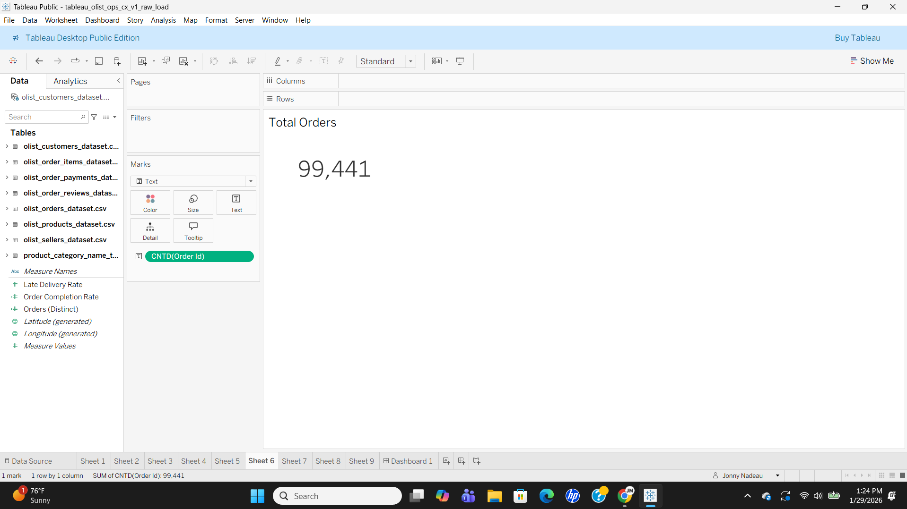
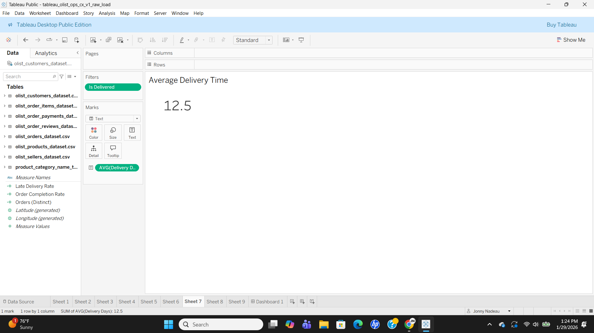
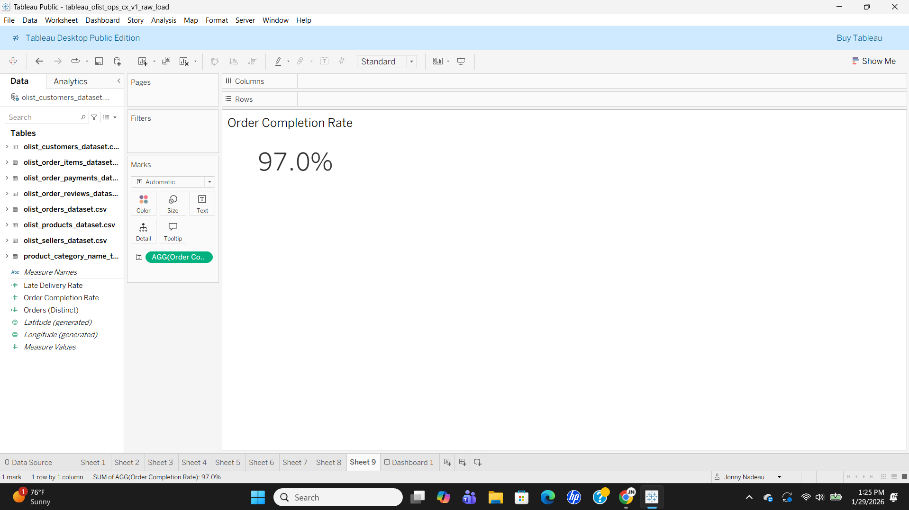
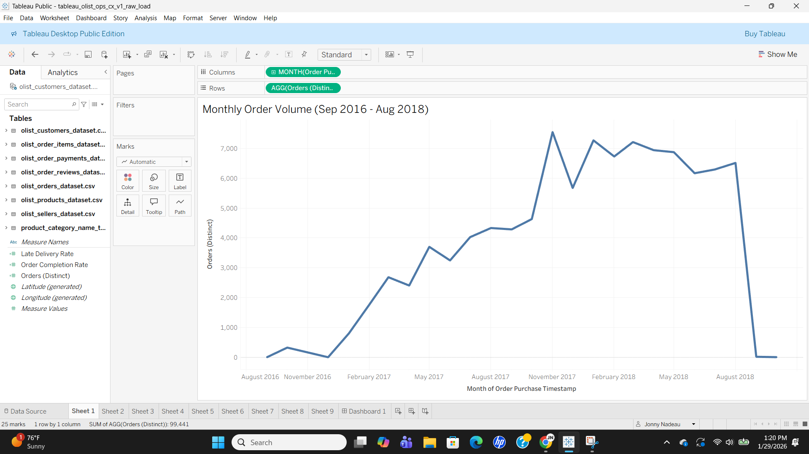
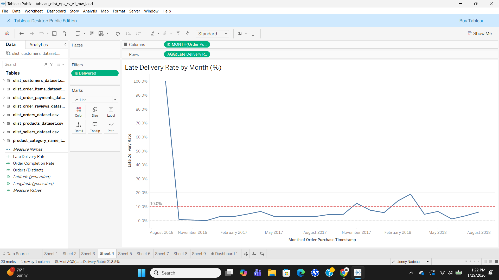
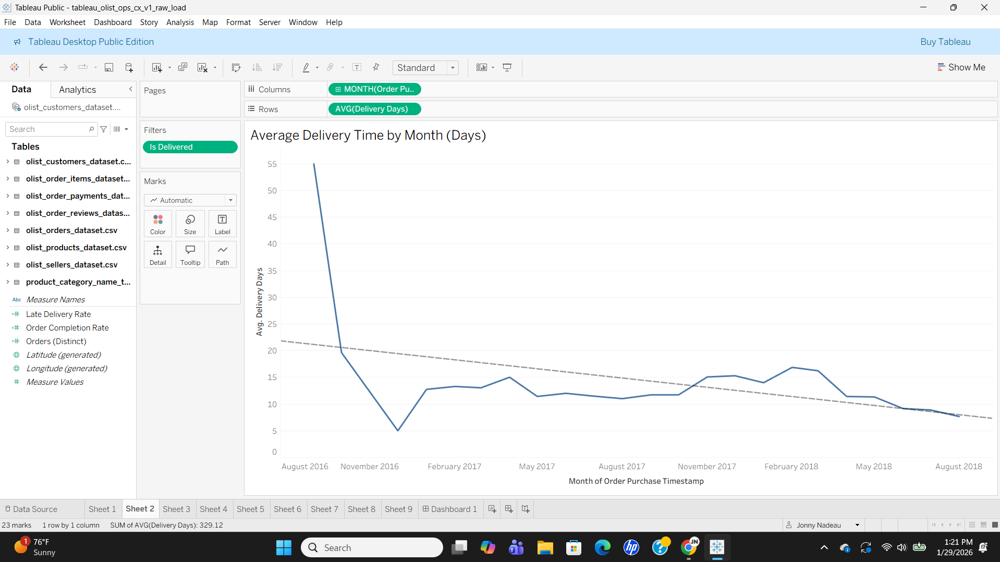
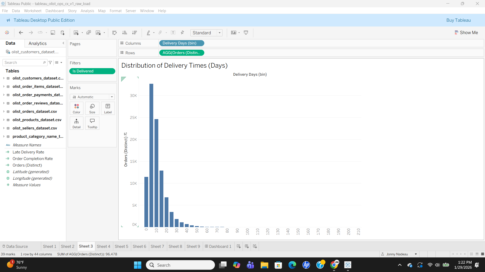
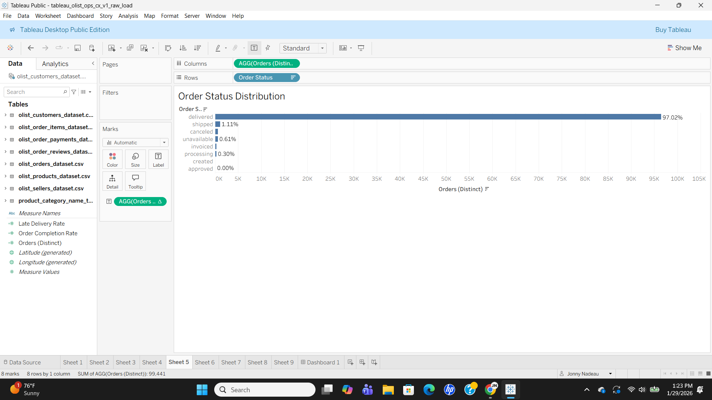
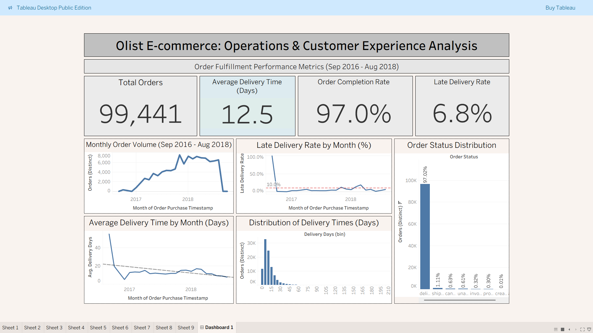

# Tableau — Marketplace Ops & Customer Experience (Olist)

> A Tableau dashboard analyzing operations and customer experience metrics for Olist, a Brazilian e-commerce marketplace. The project demonstrates data modeling, calculated field creation, interactive visualization design, and operational KPI tracking across order fulfillment, delivery performance, and customer satisfaction.

---

  
<strong>Project Overview</strong>

  

  

  <h3>Overview</h3>
  

    This Tableau dashboard analyzes operations and customer experience metrics for Olist, a Brazilian e-commerce 
    marketplace connecting small businesses with major marketplaces. The dashboard enables stakeholders to monitor 
    order fulfillment performance, identify delivery bottlenecks, and assess customer satisfaction trends across 
    the platform's two-year operational history.
  

  <h3>Business Context</h3>
  

    This analysis simulates a marketplace operations team evaluating fulfillment performance, delivery reliability, 
    and customer satisfaction to support data-driven decision making by operations managers, customer experience 
    teams, and executive leadership.
  

  <h3>Objectives</h3>
  <ul>
    <li>Define and calculate core KPIs: total orders, average delivery time, order completion rate, late delivery rate</li>
    <li>Build a multi-table data model in Tableau using relationships to preserve row-level detail across 7 datasets</li>
    <li>Create calculated fields for delivery metrics, late delivery flags, and time-series aggregations</li>
    <li>Develop an interactive dashboard with filters and drill-down capabilities for operational diagnostics</li>
  </ul>

  <h3>Dataset Overview</h3>
  <ul>
    <li><strong>Dataset:</strong> Olist Brazilian E-commerce Dataset (Kaggle)</li>
    <li><strong>Time range:</strong> September 2016 – August 2018 (23 months)</li>
    <li><strong>Granularity:</strong> Order-level with supporting item, payment, review, customer, seller, and product tables</li>
    <li><strong>Core tables:</strong> Orders (99,441), Order Items (112,650), Payments (103,886), Reviews (99,224), Customers (99,441), Sellers (3,095), Products (32,951)</li>
  </ul>

  <h3>Tools &amp; Skills Demonstrated</h3>
  <ul>
    <li><strong>Tableau Desktop:</strong> Data relationships (7 tables), calculated fields, parameters, dashboard actions, interactive filtering</li>
    <li><strong>Data Preparation:</strong> Power Query for data cleaning and transformation, custom column creation</li>
    <li><strong>Calculated Fields:</strong> Delivery days, late delivery flags, order completion rate, aggregated KPIs</li>
    <li><strong>Visualization:</strong> KPI cards, time series analysis, distribution histograms, status breakdowns</li>
  </ul>

  <h3>KPI Definitions</h3>
  <ul>
    <li><strong>Total Orders:</strong> COUNT(DISTINCT Order ID)</li>
    <li><strong>Order Completion Rate:</strong> COUNT(Order ID WHERE Order Status = "delivered") / COUNT(Order ID)</li>
    <li><strong>Average Delivery Time:</strong> AVG(Delivery Days) WHERE Order Status = "delivered"</li>
    <li><strong>Late Delivery Rate:</strong> SUM(Is Delivered Late) / COUNT(Order ID WHERE Order Status = "delivered")</li>
    <li><strong>Delivery Days:</strong> DATEDIFF('day', Order Purchase Timestamp, Order Delivered Customer Date)</li>
  </ul>

---

  
<strong>Data Modeling &amp; Preparation</strong>

  

  

  

    Before building visualizations and KPIs, I connected and modeled 7 related datasets in Tableau using 
    <strong>relationships</strong> (not joins) to preserve row-level detail and enable flexible analysis across 
    orders, items, payments, reviews, customers, sellers, and products.
  

  <h3>Data Modeling Summary</h3>
  <ul>
    <li><strong>Input:</strong> 7 CSV files from the Olist Brazilian E-commerce dataset (Kaggle)</li>
    <li><strong>Tool:</strong> Tableau Desktop data source relationships</li>
    <li><strong>Approach:</strong> Used Tableau relationships (not joins) to preserve row-level detail across all tables</li>
    <li><strong>Primary Key:</strong> order_id serves as the central relationship key connecting orders, items, payments, and reviews</li>
  </ul>

  <h3>Data Source Relationships (Evidence)</h3>
  <figure style="margin: 0 0 18px 0;">
    
    <figcaption style="font-size: 0.95em; color: #555; margin-top: 6px;">
      Tableau data model showing relationships between Orders, Items, Payments, Reviews, Customers, Sellers, and Products.
      
        <a href="images/tableau-data-connections.png">Open full-size</a>
      
    </figcaption>
  </figure>

  <h3>Grain Considerations</h3>
  <ul>
    <li><strong>Order-level metrics:</strong> completion rate, delivery time, late delivery flag</li>
    <li><strong>Item-level metrics:</strong> product categories, freight costs, pricing</li>
    <li><strong>Payment-level metrics:</strong> payment type distribution, installment analysis</li>
    <li><strong>Review-level metrics:</strong> satisfaction scores (average review score)</li>
  </ul>

  <h3>Dataset Notes &amp; Caveats</h3>
  <ul>
    <li>August 2016 contains partial month data (excluded from trend analyses)</li>
    <li>September 2018 has very limited data (dataset ends abruptly)</li>
    <li>Some orders lack review scores (not all customers submit reviews)</li>
    <li>Geolocation data available but not used in current analysis</li>
  </ul>

  <h3>Calculated Fields Created</h3>
  <ol>
    <li>
      <strong>Delivery Days</strong>
      <ul>
        <li>Formula: <code>DATEDIFF('day', [Order Purchase Timestamp], [Order Delivered Customer Date])</code></li>
        <li>Purpose: Calculate days between order purchase and actual delivery</li>
      </ul>
    </li>
    <li>
      <strong>Late Delivery Flag</strong>
      <ul>
        <li>Formula: <code>IF [Order Delivered Customer Date] > [Order Estimated Delivery Date] THEN 1 ELSE 0 END</code></li>
        <li>Purpose: Binary indicator for late deliveries used in aggregation</li>
      </ul>
    </li>
    <li>
      <strong>Is Delivered</strong>
      <ul>
        <li>Formula: <code>IF [Order Status] = "delivered" THEN 1 ELSE 0 END</code></li>
        <li>Purpose: Filter for completed orders in delivery metrics</li>
      </ul>
    </li>
    <li>
      <strong>Order Completion Rate</strong>
      <ul>
        <li>Formula: <code>SUM([Is Delivered]) / COUNT([Order Id])</code></li>
        <li>Purpose: Percentage of orders successfully delivered</li>
      </ul>
    </li>
    <li>
      <strong>Late Delivery Rate</strong>
      <ul>
        <li>Formula: <code>SUM([Late Delivery Flag]) / SUM([Is Delivered])</code></li>
        <li>Purpose: Percentage of delivered orders that arrived late</li>
      </ul>
    </li>
  </ol>

  <h3>Why This Approach Matters</h3>
  <ul>
    <li><strong>Flexibility:</strong> Relationships preserve all data combinations without pre-aggregation</li>
    <li><strong>Accuracy:</strong> Prevents double-counting and maintains correct grain for each metric</li>
    <li><strong>Scalability:</strong> Easy to add new tables or metrics without restructuring the entire model</li>
  </ul>

---

  
<strong>Analysis 1 — Order Fulfillment Performance Overview</strong>

  

  

  <h3>Business Question</h3>
  

    What is our overall order fulfillment performance? How have key operational metrics (order volume, delivery time, 
    completion rate, late delivery rate) trended over time? Where are the operational bottlenecks and anomalies that 
    require deeper investigation?
  

  <h3>Method</h3>
  <ul>
    <li>Created KPI summary cards for Total Orders, Average Delivery Time, Order Completion Rate, and Late Delivery Rate</li>
    <li>Built time-series line charts for Monthly Order Volume and Late Delivery Rate by Month</li>
    <li>Created Average Delivery Time by Month with trend line to show improvement over time</li>
    <li>Built histogram showing Distribution of Delivery Times to identify modal delivery ranges and outliers</li>
    <li>Created Order Status Distribution to show breakdown of order statuses (delivered, shipped, canceled, etc.)</li>
  </ul>

  <h3>Results</h3>

  <figure style="margin: 0 0 18px 0;">
    
    <figcaption style="font-size: 0.95em; color: #555; margin-top: 6px;">
      Total Orders KPI: 99,441 orders over the analysis period.
      
        <a href="images/tableau-analysis-1-total-orders.png">Open full-size</a>
      
    </figcaption>
  </figure>

  <figure style="margin: 0 0 18px 0;">
    
    <figcaption style="font-size: 0.95em; color: #555; margin-top: 6px;">
      Average Delivery Time KPI: 12.5 days for delivered orders.
      
        <a href="images/tableau-analysis-1-average-delivery-time-kpi-card.png">Open full-size</a>
      
    </figcaption>
  </figure>

  <figure style="margin: 0 0 18px 0;">
    
    <figcaption style="font-size: 0.95em; color: #555; margin-top: 6px;">
      Order Completion Rate KPI: 97.0% of orders successfully delivered.
      
        <a href="images/tableau-analysis-1-order-completion-rate-kpi-card.png">Open full-size</a>
      
    </figcaption>
  </figure>

  <figure style="margin: 0 0 18px 0;">
    
    <figcaption style="font-size: 0.95em; color: #555; margin-top: 6px;">
      Late Delivery Rate KPI: 6.8% of delivered orders arrived after estimated date.
      
        <a href="images/tableau-analysis-1-late-delivery-rate-kpi-card.png">Open full-size</a>
      
    </figcaption>
  </figure>

  <figure style="margin: 0 0 18px 0;">
    
    <figcaption style="font-size: 0.95em; color: #555; margin-top: 6px;">
      Monthly Order Volume showing steady growth from ~400 orders/month to 7,000+ orders/month.
      
        <a href="images/tableau-analysis-1-monthly-order-volume.png">Open full-size</a>
      
    </figcaption>
  </figure>

  <figure style="margin: 0 0 18px 0;">
    
    <figcaption style="font-size: 0.95em; color: #555; margin-top: 6px;">
      Late Delivery Rate by Month with 10% reference line showing stabilization around 5-10%.
      
        <a href="images/tableau-analysis-1-late-delivery-rate.png">Open full-size</a>
      
    </figcaption>
  </figure>

  <figure style="margin: 0 0 18px 0;">
    
    <figcaption style="font-size: 0.95em; color: #555; margin-top: 6px;">
      Average Delivery Time by Month with trend line showing 50% reduction from 20+ days to 10-15 days.
      
        <a href="images/tableau-analysis-1-average-delivery-time.png">Open full-size</a>
      
    </figcaption>
  </figure>

  <figure style="margin: 0 0 18px 0;">
    
    <figcaption style="font-size: 0.95em; color: #555; margin-top: 6px;">
      Distribution of Delivery Times showing right-skewed distribution with mode at 10-15 days.
      
        <a href="images/tableau-analysis-1-distribution-of-delivery-times.png">Open full-size</a>
      
    </figcaption>
  </figure>

  <figure style="margin: 0 0 18px 0;">
    
    <figcaption style="font-size: 0.95em; color: #555; margin-top: 6px;">
      Order Status Distribution showing 97.02% delivered, 1.11% shipped, 0.63% canceled.
      
        <a href="images/tableau-analysis-1-order-status-distribution.png">Open full-size</a>
      
    </figcaption>
  </figure>

  <h3>Insights</h3>
  <ul>
    <li><strong>Strong baseline performance:</strong> 97% order completion rate indicates reliable fulfillment infrastructure</li>
    <li><strong>Improving efficiency:</strong> Average delivery time decreased 50% from early 2017 to mid-2018</li>
    <li><strong>Consistent late delivery challenge:</strong> ~7% late delivery rate persists despite volume growth</li>
    <li><strong>Seasonal volume spikes:</strong> November-December show 30-40% order increases without proportional late delivery increases</li>
    <li><strong>Long tail of problematic deliveries:</strong> While most orders arrive in 10-15 days, outliers skew averages and likely drive negative reviews</li>
  </ul>

  <h3>Business Recommendations</h3>
  <ul>
    <li><strong>Investigate late delivery root causes:</strong> 7% late rate represents ~6,800 orders annually—conduct RCA on geographic, seller, or carrier factors</li>
    <li><strong>Set estimated delivery expectations conservatively:</strong> Add 2-3 day buffer to algorithmic estimates to underpromise/overdeliver</li>
    <li><strong>Proactive communication for delays:</strong> Automate notifications for orders exceeding 20 days to reduce support tickets</li>
    <li><strong>Seller performance tiering:</strong> Create accountability metrics for sellers with >15% late delivery rates</li>
    <li><strong>Black Friday preparation:</strong> Given November spikes, ensure carrier capacity agreements and warehouse staffing 2 months in advance</li>
  </ul>

---

  
<strong>Analysis 2 — [Ready for Content]</strong>

  

  

  <h3>Business Question</h3>
  

    [Coming soon - space reserved for geographic delivery analysis, product category performance, or carrier comparison]
  

  <h3>Method</h3>
  <ul>
    <li>[Placeholder for analysis 2 methodology]</li>
  </ul>

  <h3>Results</h3>
  
[Placeholder for analysis 2 visualizations and charts]

  <h3>Insights</h3>
  <ul>
    <li>[Placeholder for analysis 2 insights]</li>
  </ul>

  <h3>Business Recommendations</h3>
  <ul>
    <li>[Placeholder for analysis 2 recommendations]</li>
  </ul>

---

  
<strong>Analysis 3 — [Ready for Content]</strong>

  

  

  <h3>Business Question</h3>
  

    [Coming soon - space reserved for customer satisfaction analysis, review score correlations, or seller performance metrics]
  

  <h3>Method</h3>
  <ul>
    <li>[Placeholder for analysis 3 methodology]</li>
  </ul>

  <h3>Results</h3>
  
[Placeholder for analysis 3 visualizations and charts]

  <h3>Insights</h3>
  <ul>
    <li>[Placeholder for analysis 3 insights]</li>
  </ul>

  <h3>Business Recommendations</h3>
  <ul>
    <li>[Placeholder for analysis 3 recommendations]</li>
  </ul>

---

  
<strong>Analysis 4 — [Ready for Content]</strong>

  

  

  <h3>Business Question</h3>
  

    [Coming soon - space reserved for additional analysis dimension]
  

  <h3>Method</h3>
  <ul>
    <li>[Placeholder for analysis 4 methodology]</li>
  </ul>

  <h3>Results</h3>
  
[Placeholder for analysis 4 visualizations and charts]

  <h3>Insights</h3>
  <ul>
    <li>[Placeholder for analysis 4 insights]</li>
  </ul>

  <h3>Business Recommendations</h3>
  <ul>
    <li>[Placeholder for analysis 4 recommendations]</li>
  </ul>

---

  
<strong>Analysis 5 — [Ready for Content]</strong>

  

  

  <h3>Business Question</h3>
  

    [Coming soon - space reserved for additional analysis dimension]
  

  <h3>Method</h3>
  <ul>
    <li>[Placeholder for analysis 5 methodology]</li>
  </ul>

  <h3>Results</h3>
  
[Placeholder for analysis 5 visualizations and charts]

  <h3>Insights</h3>
  <ul>
    <li>[Placeholder for analysis 5 insights]</li>
  </ul>

  <h3>Business Recommendations</h3>
  <ul>
    <li>[Placeholder for analysis 5 recommendations]</li>
  </ul>

---

  
<strong>Dashboard &amp; Deliverables</strong>

  

  

  <h3>Dashboard Features</h3>
  <ul>
    <li><strong>Operations-oriented, single-screen layout</strong> designed for executive visibility</li>
    <li><strong>Interactive filters</strong> for date range and order status that update all visualizations</li>
    <li><strong>Core visuals:</strong> KPI summary cards, Monthly Order Volume, Late Delivery Rate trend, Average Delivery Time trend, Order Status Distribution, Delivery Time Distribution</li>
  </ul>

  

  <h3>Final Dashboard</h3>
  <figure style="margin: 0 0 18px 0;">
    
    <figcaption style="font-size: 0.95em; color: #555; margin-top: 6px;">
      Order Fulfillment Performance Dashboard with interactive filters and KPI cards.
      
        <a href="images/tableau-analysis-1-dashboard.png">Open full-size</a>
      
    </figcaption>
  </figure>

  <h3>Tableau Public</h3>
  <ul>
    <li>
      <strong>Dashboard Link:</strong>
      <a href="https://public.tableau.com/app/profile/your-profile-name" target="_blank" rel="noopener">
        View Interactive Dashboard
      </a>
       
      <em>(Link to be added after Tableau Public publication)</em>
    </li>
  </ul>

  

  <h3>Conclusion</h3>
  

    This project demonstrates a complete Tableau analytics workflow: connecting and modeling multi-table datasets, 
    creating calculated fields for operational metrics, building time-series and distribution visualizations, and 
    delivering an interactive dashboard optimized for operations monitoring. The final dashboard supports fast 
    exploration of order fulfillment performance and surfaces key operational bottlenecks (late deliveries, delivery 
    time volatility, order status issues) that require management attention.
  

