<a href="/projects/" class="back-to-projects btn">← Back to Projects</a>

# Olist E-commerce Operations & Customer Experience Analysis (Tableau)

> A comprehensive Tableau analysis of the Olist Brazilian E-commerce dataset, focusing on order fulfillment performance, delivery efficiency, and customer experience metrics across 99,441 orders from September 2016 to August 2018.

---

  
<strong>Project Overview</strong>

  

  

  <h3>Overview</h3>
  

    This project analyzes operational performance and customer experience in the Olist e-commerce marketplace using Tableau. 
    The analysis examines order fulfillment metrics, delivery performance, late delivery patterns, and order status distribution 
    to identify operational bottlenecks and opportunities for improvement in customer experience.
  

  <h3>Business Context</h3>
  

    E-commerce marketplaces depend on reliable fulfillment and delivery performance to maintain customer satisfaction and drive repeat purchases. 
    This analysis provides operations and customer experience teams with visibility into delivery times, completion rates, 
    and late delivery patterns to support data-driven decision making.
  

  <h3>Objectives</h3>
  <ul>
    <li>Measure and track core operational KPIs: total orders, average delivery time, order completion rate, and late delivery rate</li>
    <li>Analyze delivery time trends and patterns across the September 2016 to August 2018 time period</li>
    <li>Identify periods of operational stress with elevated late delivery rates</li>
    <li>Examine the distribution of delivery times to understand fulfillment consistency</li>
    <li>Provide actionable insights to improve delivery performance and customer satisfaction</li>
  </ul>

  <h3>Dataset Overview</h3>
  <ul>
    <li><strong>Source:</strong> Olist Brazilian E-commerce Public Dataset (Kaggle)</li>
    <li><strong>Time range:</strong> September 2016 – August 2018</li>
    <li><strong>Granularity:</strong> Order-level data with customer, seller, product, payment, and review information</li>
    <li><strong>Tables used:</strong> Orders, Order Items, Customers, Sellers, Products, Product Category Translation, Order Payments, Order Reviews</li>
    <li><strong>Total orders analyzed:</strong> 99,441</li>
  </ul>

  <h3>Tools &amp; Skills Demonstrated</h3>
  <ul>
    <li><strong>Tableau Desktop:</strong> Data relationships, calculated fields, parameters, filters, dashboards</li>
    <li><strong>Data Modeling:</strong> Multi-table relationships using order_id, customer_id, product_id, seller_id</li>
    <li><strong>Calculated Fields:</strong> Delivery days, late delivery flags, completion rate, aggregated metrics</li>
    <li><strong>Visualization:</strong> KPI cards, time series line charts, bar charts, histograms, dashboard design</li>
    <li><strong>Analysis:</strong> Trend analysis, distribution analysis, operational performance measurement</li>
  </ul>

  <h3>Key Metrics Defined</h3>
  <ul>
    <li><strong>Total Orders:</strong> COUNT(DISTINCT Order ID) for orders with status "delivered"</li>
    <li><strong>Average Delivery Time:</strong> AVG(Order Delivered Customer Date - Order Purchase Timestamp) in days</li>
    <li><strong>Order Completion Rate:</strong> Percentage of orders with status "delivered" out of all orders</li>
    <li><strong>Late Delivery Rate:</strong> Percentage of delivered orders where actual delivery date exceeded estimated delivery date</li>
    <li><strong>Delivery Days:</strong> Time between order purchase and customer delivery (in days)</li>
  </ul>

  
<strong>Data Modeling & Preparation</strong>

  

  

  <h3>Tableau Data Model</h3>
  

    The Olist dataset consists of 8 related tables connected through common keys. I used Tableau's 
    relationship model (rather than joins) to maintain flexibility and proper granularity across different levels of analysis.
  

  <figure style="margin: 0 0 18px 0;">
    
    <figcaption style="font-size: 0.95em; color: #555; margin-top: 6px;">
      Tableau data model showing table relationships.
      
        <a href="images/tableau-data-connections.png">Open full-size</a>
      
    </figcaption>
  </figure>

  <h3>Table Relationships</h3>
  <ul>
    <li><strong>olist_orders_dataset:</strong> Central fact table (order_id as primary key)</li>
    <li><strong>olist_customers_dataset:</strong> Linked via customer_id</li>
    <li><strong>olist_order_items_dataset:</strong> Linked via order_id (many-to-one with orders)</li>
    <li><strong>olist_products_dataset:</strong> Linked via product_id</li>
    <li><strong>product_category_name_translation:</strong> Linked via product_category_name (English translations)</li>
    <li><strong>olist_sellers_dataset:</strong> Linked via seller_id</li>
    <li><strong>olist_order_payments_dataset:</strong> Linked via order_id</li>
    <li><strong>olist_order_reviews_dataset:</strong> Linked via order_id</li>
  </ul>

  <h3>Data Preparation Notes</h3>
  <ul>
    <li>Connected all tables using relationships rather than joins to maintain flexibility</li>
    <li>Created calculated fields for delivery time analysis (days between purchase and delivery)</li>
    <li>Built late delivery flag by comparing actual delivery date to estimated delivery date</li>
    <li>Filtered to "delivered" orders for completion rate and delivery time calculations</li>
    <li>Used live connection for real-time filtering and exploration</li>
  </ul>

  <h3>Key Calculated Fields</h3>
  <ul>
    <li><strong>Delivery Days:</strong> DATEDIFF('day', [Order Purchase Timestamp], [Order Delivered Customer Date])</li>
    <li><strong>Late Delivery Flag:</strong> IF [Order Delivered Customer Date] > [Order Estimated Delivery Date] THEN 1 ELSE 0 END</li>
    <li><strong>Is Delivered:</strong> IF [Order Status] = "delivered" THEN 1 ELSE 0 END</li>
    <li><strong>Order Completion Rate:</strong> SUM([Is Delivered]) / COUNT([Order Id])</li>
    <li><strong>Late Delivery Rate:</strong> SUM([Late Delivery Flag]) / COUNT([Order Id]) for delivered orders</li>
  </ul>

  
<strong>Analysis 1 — Order Fulfillment Performance Metrics (Sep 2016 – Aug 2018)</strong>

  

  

  <h3>Business Question</h3>
  

    How is the Olist marketplace performing on core operational and customer experience metrics? What are the overall 
    fulfillment KPIs (total orders, average delivery time, order completion rate, late delivery rate), and how have 
    delivery performance and late deliveries trended over the September 2016 to August 2018 period?
  

  <h3>Method</h3>
  <ul>
    <li>Built KPI summary cards for Total Orders, Average Delivery Time, Order Completion Rate, and Late Delivery Rate</li>
    <li>Created time series visualizations showing monthly order volume and late delivery rate trends</li>
    <li>Analyzed order status distribution to understand completion patterns</li>
    <li>Examined the distribution of delivery times using a histogram to assess fulfillment consistency</li>
    <li>Analyzed average delivery time by month to identify seasonal or operational patterns</li>
  </ul>

  <h3>Results — KPI Summary Cards</h3>

  <figure style="margin: 0 0 18px 0;">
    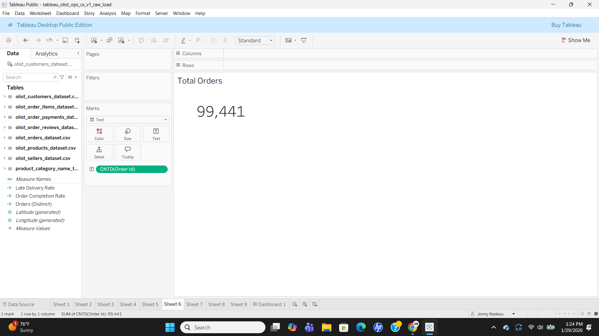
    <figcaption style="font-size: 0.95em; color: #555; margin-top: 6px;">
      Total Orders KPI (99,441 delivered orders analyzed).
      
        <a href="images/tableau-analysis-1-total-orders.png">Open full-size</a>
      
    </figcaption>
  </figure>

  <figure style="margin: 0 0 18px 0;">
    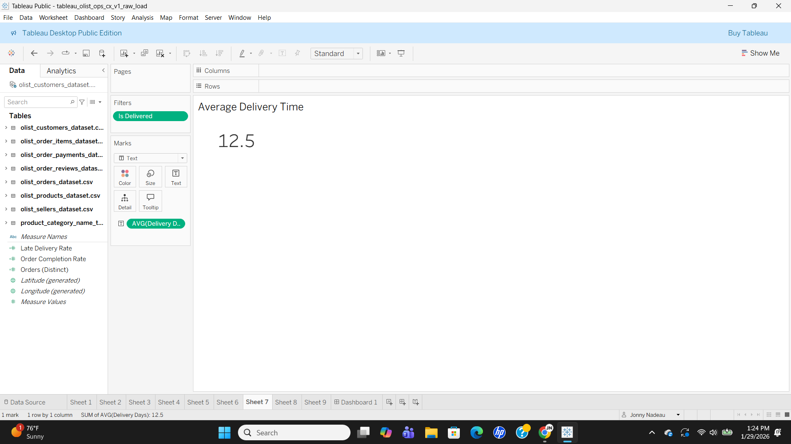
    <figcaption style="font-size: 0.95em; color: #555; margin-top: 6px;">
      Average Delivery Time KPI (12.5 days from purchase to customer delivery).
      
        <a href="images/tableau-analysis-1-average-delivery-time-kpi-card.png">Open full-size</a>
      
    </figcaption>
  </figure>

  <figure style="margin: 0 0 18px 0;">
    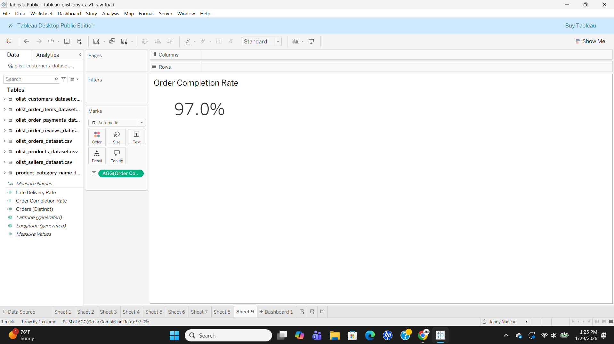
    <figcaption style="font-size: 0.95em; color: #555; margin-top: 6px;">
      Order Completion Rate KPI (97.0% of orders successfully delivered).
      
        <a href="images/tableau-analysis-1-order-completion-rate-kpi-card.png">Open full-size</a>
      
    </figcaption>
  </figure>

  <figure style="margin: 0 0 18px 0;">
    
    <figcaption style="font-size: 0.95em; color: #555; margin-top: 6px;">
      Late Delivery Rate KPI (6.8% of delivered orders arrived after estimated delivery date).
      
        <a href="images/tableau-analysis-1-late-delivery-rate-kpi-card.png">Open full-size</a>
      
    </figcaption>
  </figure>

  <h3>Results — Trends & Distributions</h3>

  <figure style="margin: 0 0 18px 0;">
    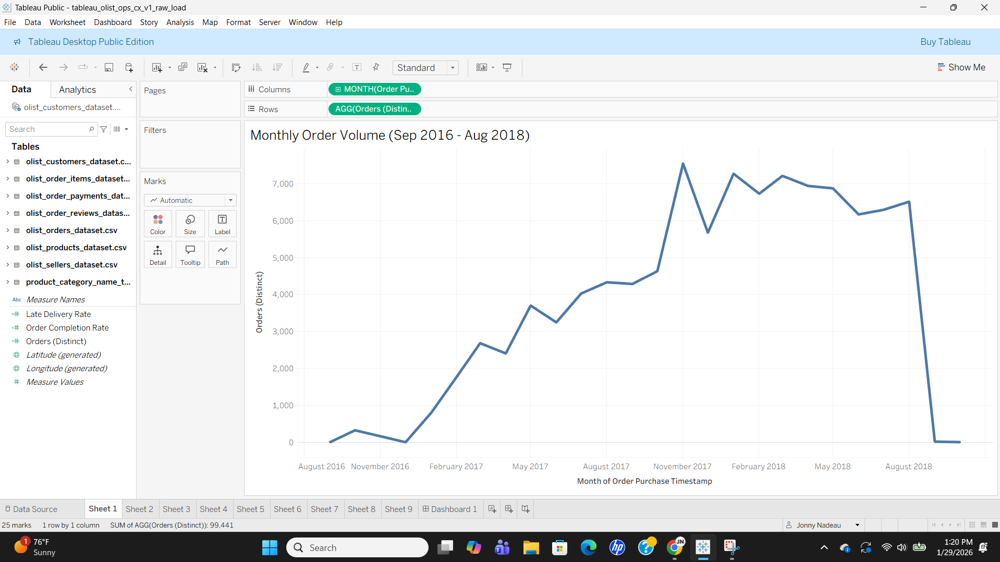
    <figcaption style="font-size: 0.95em; color: #555; margin-top: 6px;">
      Monthly order volume showing dramatic growth from late 2016 through mid-2018, with a sharp decline in Aug 2018.
      
        <a href="images/tableau-analysis-1-monthly-order-volume.png">Open full-size</a>
      
    </figcaption>
  </figure>

  <figure style="margin: 0 0 18px 0;">
    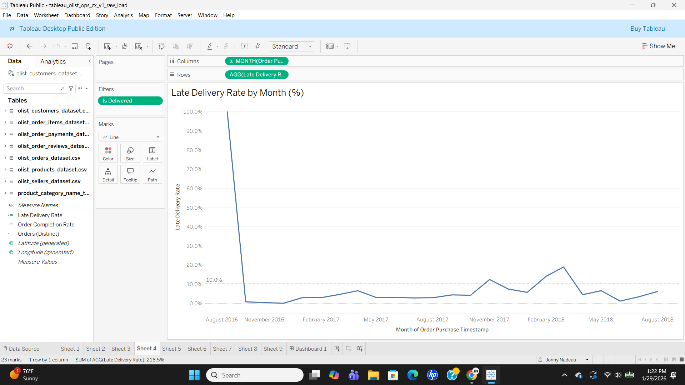
    <figcaption style="font-size: 0.95em; color: #555; margin-top: 6px;">
      Late delivery rate by month showing an initial spike (100% in early 2016 with limited data) stabilizing to ~10% baseline with notable spikes.
      
        <a href="images/tableau-analysis-1-late-delivery-rate.png">Open full-size</a>
      
    </figcaption>
  </figure>

  <figure style="margin: 0 0 18px 0;">
    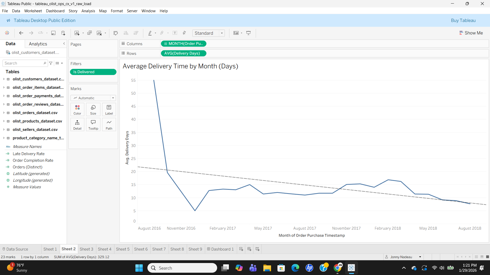
    <figcaption style="font-size: 0.95em; color: #555; margin-top: 6px;">
      Average delivery time by month showing significant improvement from ~55 days in early operations to stabilizing around 10-15 days by 2017-2018.
      
        <a href="images/tableau-analysis-1-average-delivery-time.png">Open full-size</a>
      
    </figcaption>
  </figure>

  <figure style="margin: 0 0 18px 0;">
    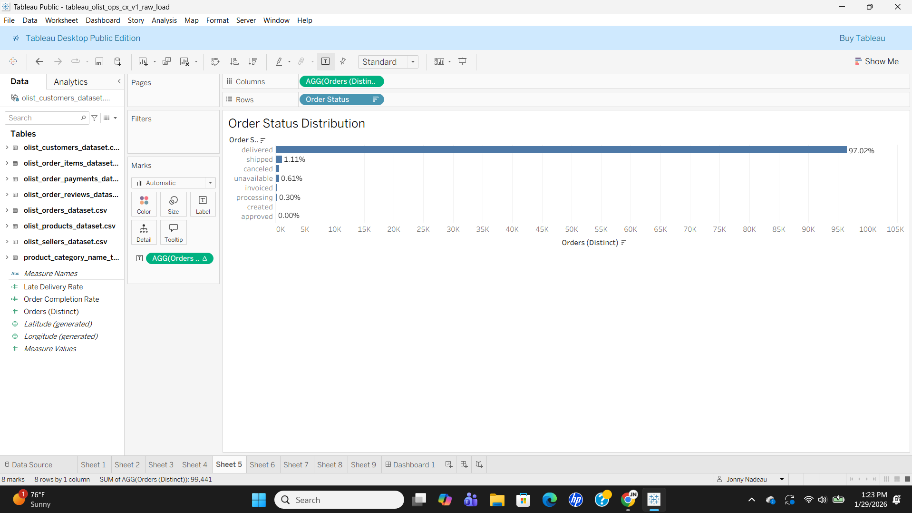
    <figcaption style="font-size: 0.95em; color: #555; margin-top: 6px;">
      Order status distribution: 97.02% delivered, 1.11% shipped, 0.63% canceled, and small percentages of other statuses.
      
        <a href="images/tableau-analysis-1-order-status-distribution.png">Open full-size</a>
      
    </figcaption>
  </figure>

  <figure style="margin: 0 0 18px 0;">
    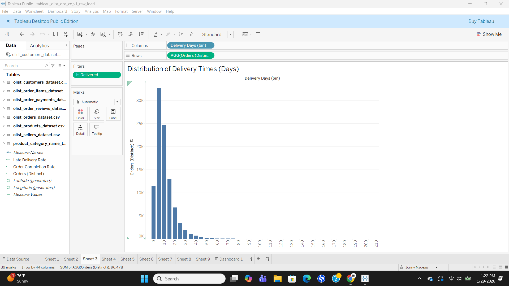
    <figcaption style="font-size: 0.95em; color: #555; margin-top: 6px;">
      Distribution of delivery times: heavily concentrated in 0-30 day range with a peak around 10-15 days and long tail extending beyond 60 days.
      
        <a href="images/tableau-analysis-1-distribution-of-delivery-times.png">Open full-size</a>
      
    </figcaption>
  </figure>

  <h3>Results — Dashboard</h3>

  <figure style="margin: 0 0 18px 0;">
    
    <figcaption style="font-size: 0.95em; color: #555; margin-top: 6px;">
      Interactive dashboard combining all order fulfillment KPIs, trends, and distributions.
      
        <a href="images/tableau-analysis-1-dashboard.png">Open full-size</a>
      
    </figcaption>
  </figure>

  <h3>Key Findings</h3>
  <ul>
    <li><strong>Strong order completion:</strong> 97% order completion rate indicates reliable fulfillment operations</li>
    <li><strong>Significant growth trajectory:</strong> Monthly order volume grew dramatically from ~400 orders in late 2016 to peak of ~7,500 orders in early 2018</li>
    <li><strong>Improved delivery speed over time:</strong> Average delivery time improved from 50+ days in early operations to stabilizing around 12.5 days by 2017-2018</li>
    <li><strong>Acceptable but improvable late delivery rate:</strong> 6.8% overall late delivery rate with periodic spikes reaching 10-20%</li>
    <li><strong>Consistent delivery performance:</strong> Most orders delivered within 10-30 days, though a long tail of delayed orders exists</li>
    <li><strong>Early operational challenges:</strong> August-November 2016 showed 100% late delivery rates, likely due to launch phase and operational scaling</li>
    <li><strong>Stabilization period:</strong> Operations stabilized by early 2017 with late delivery rates settling to ~10% baseline</li>
  </ul>

  <h3>Business Recommendations</h3>
  <ul>
    <li><strong>Investigate late delivery spikes:</strong> Drill into periods with elevated late delivery rates (10-20%) to identify root causes—carrier issues, regional bottlenecks, high-volume periods, or seller performance problems</li>
    <li><strong>Focus on the long tail:</strong> Analyze orders taking 45+ days to identify patterns (specific product categories, seller locations, or customer regions) and implement targeted interventions</li>
    <li><strong>Set SLA targets by segment:</strong> Not all products require the same delivery speed—consider differentiated targets for product categories with different customer expectations</li>
    <li><strong>Monitor completion rate proactively:</strong> 97% is strong but track this metric by region, seller, and product category to catch deterioration early</li>
    <li><strong>Celebrate and replicate improvement:</strong> Document the operational improvements that reduced average delivery time from 50+ to 12.5 days and apply these lessons to remaining problem areas</li>
    <li><strong>Operationalize delivery time monitoring:</strong> Create alerts for when weekly/monthly delivery times exceed thresholds to enable faster operational response</li>
  </ul>

  
<strong>Analysis 2 — Revenue & Sales Performance (Sep 2016 – Aug 2018)</strong>

  

  

  <h3>Business Question</h3>
  

    What is the revenue performance of the Olist marketplace? How has revenue grown over time, which product categories
    and payment methods drive the most revenue, and how is revenue distributed geographically across Brazilian states?
  

  <h3>Method</h3>
  <ul>
    <li>Built KPI summary cards for Total Revenue, Total Items Sold, Average Order Value (AOV), and Revenue Growth Rate</li>
    <li>Created a monthly revenue trend visualization to track revenue growth over time</li>
    <li>Analyzed revenue breakdown by product category to identify top-performing categories</li>
    <li>Examined revenue distribution by payment method to understand customer payment preferences</li>
    <li>Built a geographic map visualization showing revenue by Brazilian state</li>
  </ul>

  <h3>Results — KPI Summary Cards</h3>

  <figure style="margin: 0 0 18px 0;">
    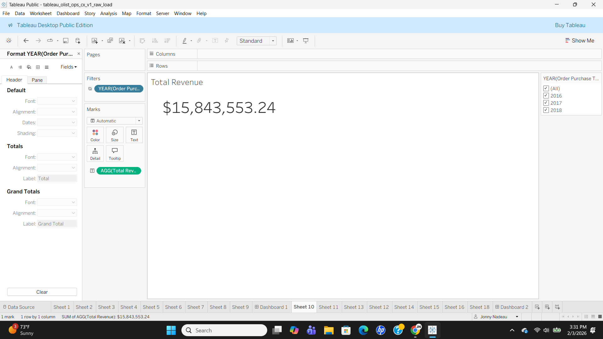
    <figcaption style="font-size: 0.95em; color: #555; margin-top: 6px;">
      Total Revenue KPI ($15,843,553.24 in total revenue across the analysis period).
      
        <a href="images/tableau-analysis-2-total-revenue-kpi.png">Open full-size</a>
      
    </figcaption>
  </figure>

  <figure style="margin: 0 0 18px 0;">
    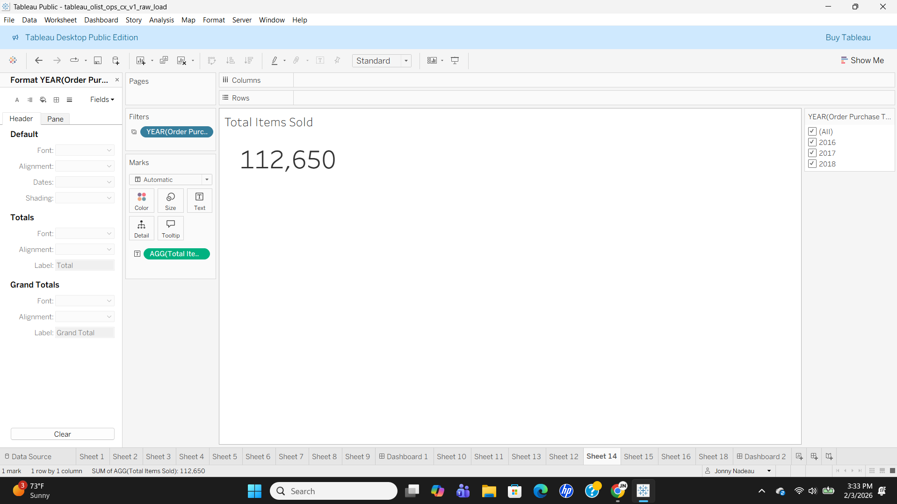
    <figcaption style="font-size: 0.95em; color: #555; margin-top: 6px;">
      Total Items Sold KPI (112,650 items sold across all orders).
      
        <a href="images/tableau-analysis-2-items-sold-kpi.png">Open full-size</a>
      
    </figcaption>
  </figure>

  <figure style="margin: 0 0 18px 0;">
    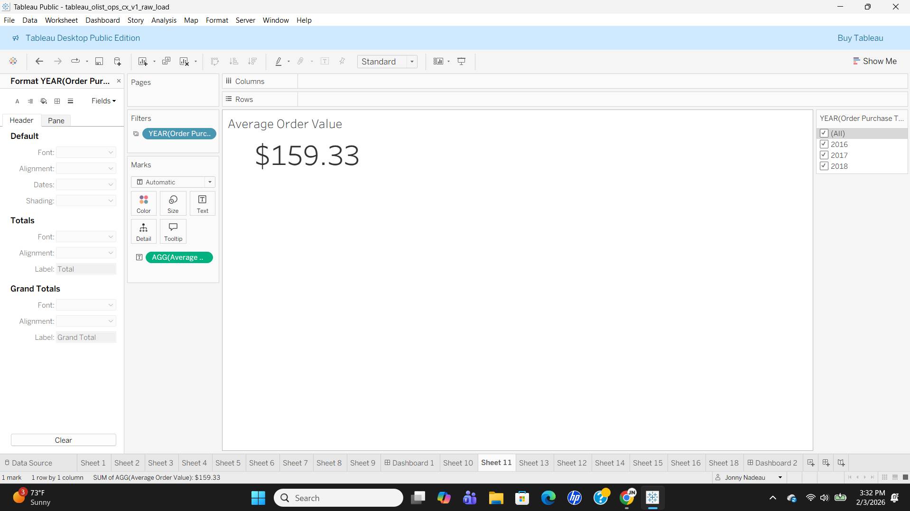
    <figcaption style="font-size: 0.95em; color: #555; margin-top: 6px;">
      Average Order Value KPI ($159.33 average revenue per order).
      
        <a href="images/tableau-analysis-2-aov-kpi.png">Open full-size</a>
      
    </figcaption>
  </figure>

  <figure style="margin: 0 0 18px 0;">
    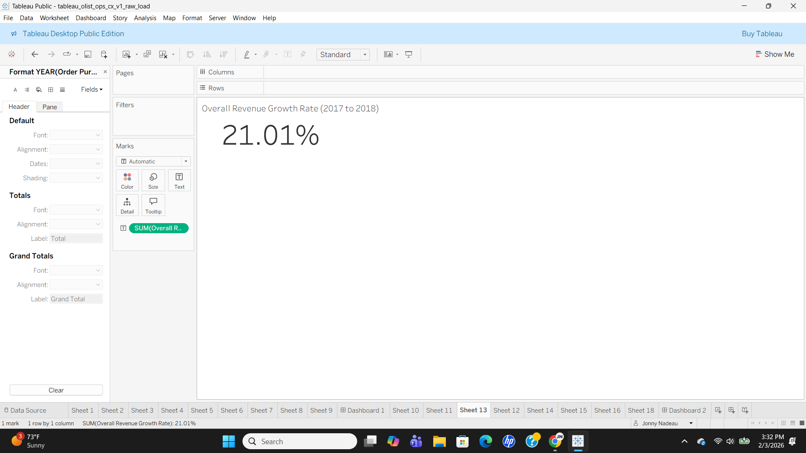
    <figcaption style="font-size: 0.95em; color: #555; margin-top: 6px;">
      Overall Revenue Growth Rate KPI (21.01% year-over-year growth from 2017 to 2018).
      
        <a href="images/tableau-analysis-2-growth-rate-kpi.png">Open full-size</a>
      
    </figcaption>
  </figure>

  <h3>Results — Revenue Trends & Distributions</h3>

  <figure style="margin: 0 0 18px 0;">
    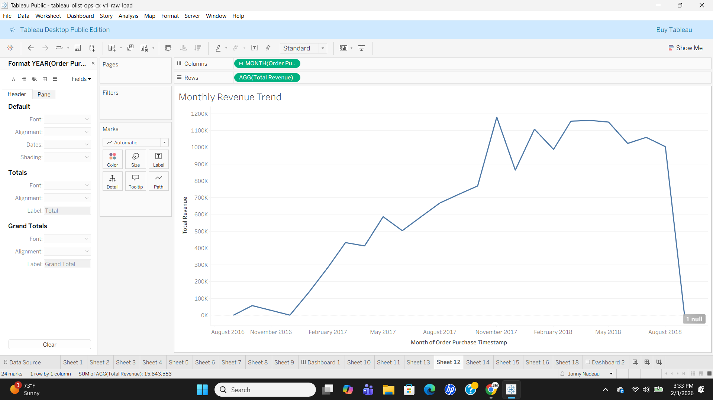
    <figcaption style="font-size: 0.95em; color: #555; margin-top: 6px;">
      Monthly revenue trend showing dramatic growth from near zero in late 2016 to peaks exceeding $1.2M in early 2018.
      
        <a href="images/tableau-analysis-2-monthly-revenue.png">Open full-size</a>
      
    </figcaption>
  </figure>

  <figure style="margin: 0 0 18px 0;">
    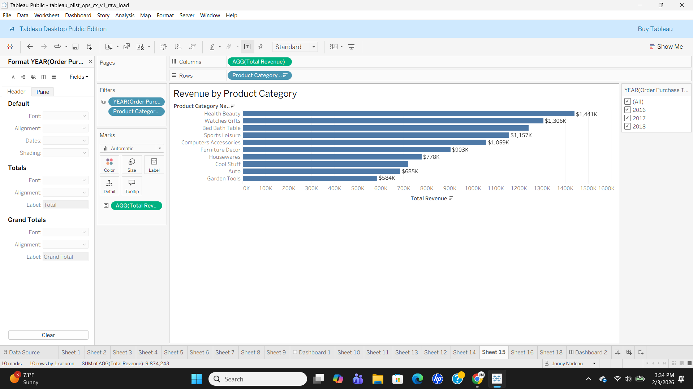
    <figcaption style="font-size: 0.95em; color: #555; margin-top: 6px;">
      Revenue by product category: Health & Beauty leads at $1,441K, followed by Watches & Gifts ($1,306K), Bed Bath & Table ($1,157K), and Sports & Leisure ($1,157K).
      
        <a href="images/tableau-analysis-2-revenue-by-product-category.png">Open full-size</a>
      
    </figcaption>
  </figure>

  <figure style="margin: 0 0 18px 0;">
    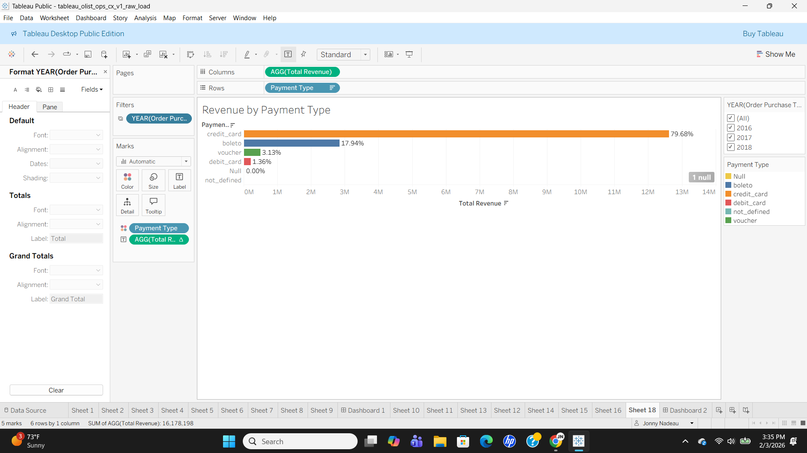
    <figcaption style="font-size: 0.95em; color: #555; margin-top: 6px;">
      Revenue by payment type: Credit card dominates at 79.68%, followed by boleto (17.94%), voucher (3.13%), and debit card (1.36%).
      
        <a href="images/tableau-analysis-2-revenue-by-payment-method.png">Open full-size</a>
      
    </figcaption>
  </figure>

  <figure style="margin: 0 0 18px 0;">
    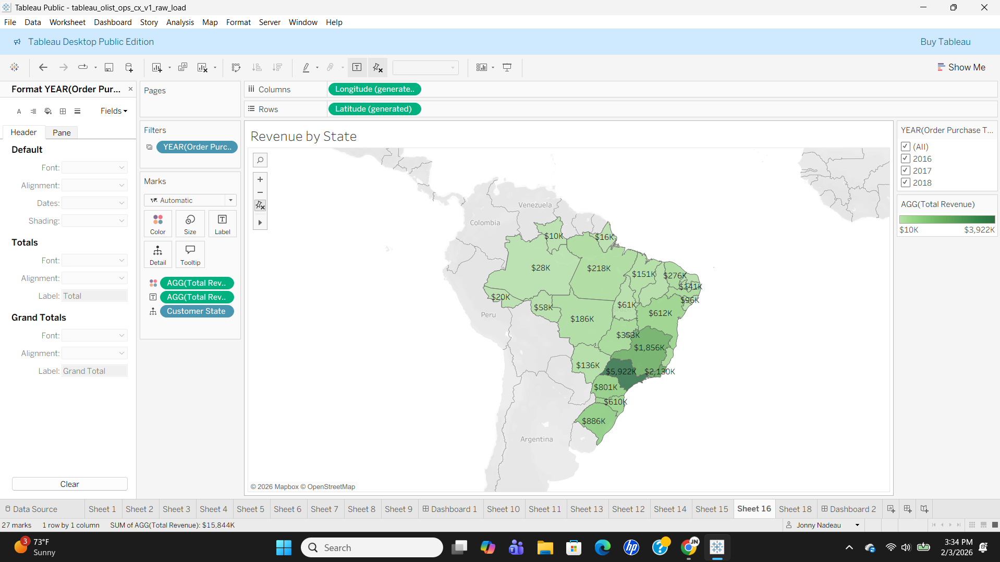
    <figcaption style="font-size: 0.95em; color: #555; margin-top: 6px;">
      Revenue by state: São Paulo leads with $5,922K (37% of total), followed by Rio de Janeiro ($2,130K) and Minas Gerais ($1,856K).
      
        <a href="images/tableau-analysis-2-revenue-by-state.png">Open full-size</a>
      
    </figcaption>
  </figure>

  <h3>Results — Dashboard</h3>

  <figure style="margin: 0 0 18px 0;">
    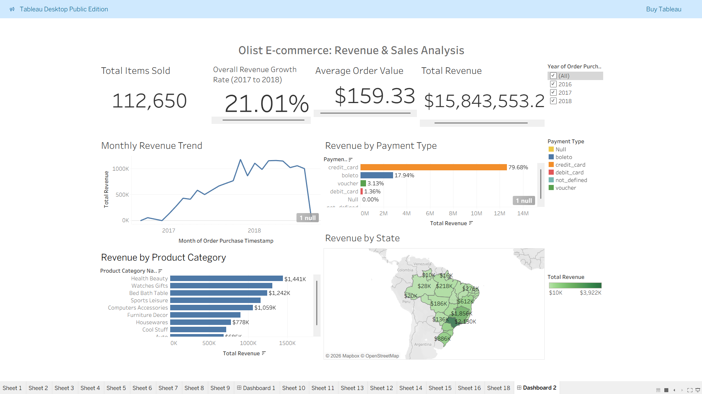
    <figcaption style="font-size: 0.95em; color: #555; margin-top: 6px;">
      Interactive dashboard combining all revenue KPIs, trends, and distributions for comprehensive sales analysis.
      
        <a href="images/tableau-analysis-2-dashboard.png">Open full-size</a>
      
    </figcaption>
  </figure>

  <h3>Key Findings</h3>
  <ul>
    <li><strong>Strong revenue growth:</strong> 21.01% year-over-year growth rate from 2017 to 2018 indicates healthy marketplace expansion</li>
    <li><strong>Dramatic scaling:</strong> Monthly revenue grew from near zero in late 2016 to exceeding $1.2M by early 2018, demonstrating successful market penetration</li>
    <li><strong>Diversified product mix:</strong> Top 10 categories are relatively balanced, with Health & Beauty leading but no single category dominating (top category represents ~9% of revenue)</li>
    <li><strong>Credit card preference:</strong> Nearly 80% of revenue comes from credit card payments, reflecting Brazilian consumer preferences and installment payment culture</li>
    <li><strong>Geographic concentration:</strong> São Paulo alone accounts for 37% of total revenue, with the Southeast region (SP, RJ, MG) driving over 60% of sales</li>
    <li><strong>Healthy AOV:</strong> $159.33 average order value suggests customers are making meaningful purchases rather than low-value transactions</li>
    <li><strong>Boleto adoption:</strong> 17.94% of revenue from boleto (bank slip) indicates successful inclusion of unbanked/underbanked customers</li>
  </ul>

  <h3>Business Recommendations</h3>
  <ul>
    <li><strong>Expand geographic reach:</strong> Invest in marketing and logistics infrastructure in underserved northern and central-western states to reduce São Paulo dependency</li>
    <li><strong>Optimize category strategy:</strong> Double down on top-performing categories (Health & Beauty, Watches & Gifts) while investigating growth potential in underperforming categories</li>
    <li><strong>Leverage credit card partnerships:</strong> Given 80% credit card usage, explore co-branded cards or installment partnerships to increase AOV and customer loyalty</li>
    <li><strong>Grow boleto and debit adoption:</strong> Expand payment options and incentives for boleto users to capture more of the underbanked market segment</li>
    <li><strong>Monitor AOV trends:</strong> Track AOV by category and region to identify opportunities for cross-selling and upselling</li>
    <li><strong>Regional pricing analysis:</strong> Investigate if pricing optimization in high-volume states could increase margins without impacting volume</li>
    <li><strong>Sustain growth momentum:</strong> With 21% YoY growth, focus on customer retention and repeat purchase programs to maintain trajectory</li>
  </ul>

  
<strong>Analysis 3 — Customer Experience & Review Quality (Sep 2016 – Aug 2018)</strong>

  

  

  <h3>Business Question</h3>
  

    How satisfied are Olist customers overall, and how do review scores vary by time, product category, 
    and delivery performance? What insights can guide actions to increase 5-star outcomes while reducing 
    low-rated experiences?
  

  <h3>Method</h3>
  <ul>
    <li>Built KPI cards for Average Review Score, Total Reviews, 5-Star Review Rate, and 1-Star Review Rate</li>
    <li>Analyzed review score distribution to quantify sentiment skew</li>
    <li>Tracked review score trends over time to identify stabilization or shifts in customer sentiment</li>
    <li>Evaluated review score vs delivery days and delivery status to test operational impact on satisfaction</li>
    <li>Ranked top and bottom product categories by average review score to isolate category-level opportunities</li>
    <li>Created a category performance scatterplot to compare review score vs review volume</li>
  </ul>

  <h3>Results — KPI Summary Cards</h3>

  <figure style="margin: 0 0 18px 0;">
    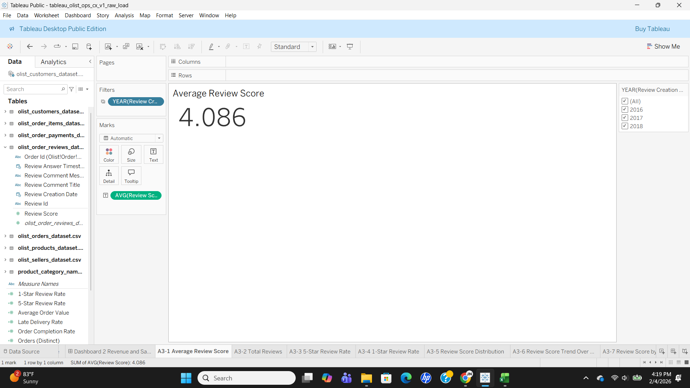
    <figcaption style="font-size: 0.95em; color: #555; margin-top: 6px;">
      Average Review Score KPI (overall average score of 4.086 across all reviews).
      
        <a href="images/tableau-analysis-3-average-review-score.png">Open full-size</a>
      
    </figcaption>
  </figure>

  <figure style="margin: 0 0 18px 0;">
    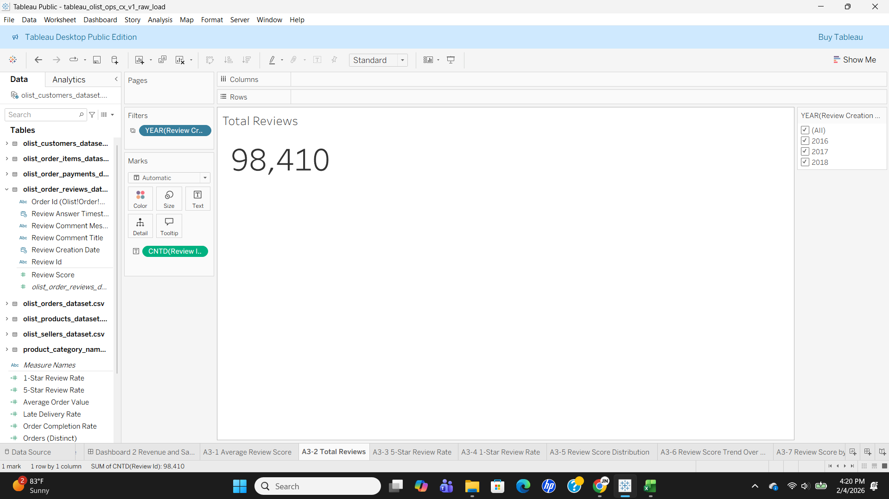
    <figcaption style="font-size: 0.95em; color: #555; margin-top: 6px;">
      Total Reviews KPI (98,410 total customer reviews captured).
      
        <a href="images/tableau-analysis-3-total-reviews.png">Open full-size</a>
      
    </figcaption>
  </figure>

  <figure style="margin: 0 0 18px 0;">
    
    <figcaption style="font-size: 0.95em; color: #555; margin-top: 6px;">
      5-Star Review Rate KPI (58.25% of reviews are perfect scores).
      
        <a href="images/tableau-analysis-3-5-star-review-rate.png">Open full-size</a>
      
    </figcaption>
  </figure>

  <figure style="margin: 0 0 18px 0;">
    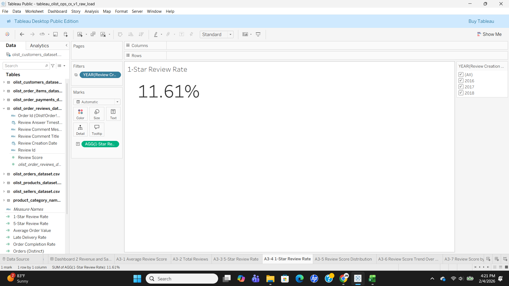
    <figcaption style="font-size: 0.95em; color: #555; margin-top: 6px;">
      1-Star Review Rate KPI (11.61% of reviews indicate severe dissatisfaction).
      
        <a href="images/tableau-analysis-3-1-star-review-rate.png">Open full-size</a>
      
    </figcaption>
  </figure>

  <h3>Results — Review Score Distribution & Trends</h3>

  <figure style="margin: 0 0 18px 0;">
    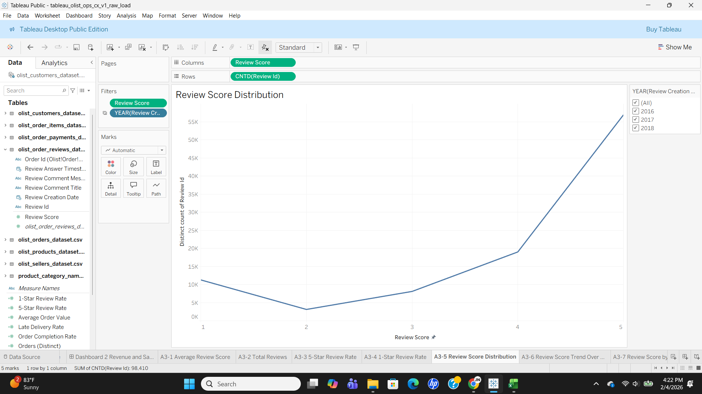
    <figcaption style="font-size: 0.95em; color: #555; margin-top: 6px;">
      Review score distribution highlighting a strong skew toward 5-star ratings and a comparatively smaller 2-star segment.
      
        <a href="images/tableau-analysis-3-review-score-distribution.png">Open full-size</a>
      
    </figcaption>
  </figure>

  <figure style="margin: 0 0 18px 0;">
    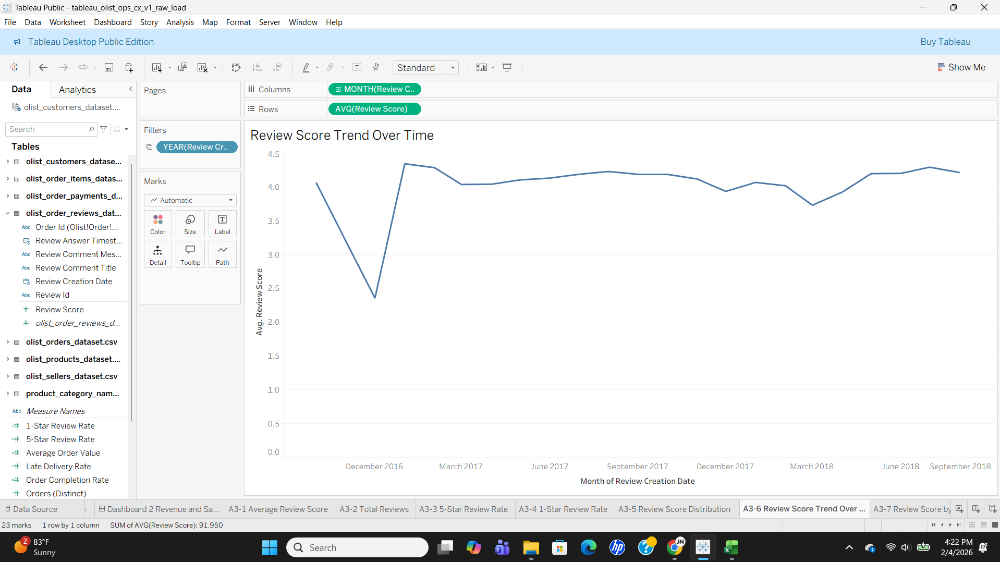
    <figcaption style="font-size: 0.95em; color: #555; margin-top: 6px;">
      Review score trend over time showing early volatility in late 2016 followed by a stable ~4.0-4.3 range through 2018.
      
        <a href="images/tableau-analysis-3-review-score-trend-ovetime.png">Open full-size</a>
      
    </figcaption>
  </figure>

  <h3>Results — Delivery Impact & Category Performance</h3>

  <figure style="margin: 0 0 18px 0;">
    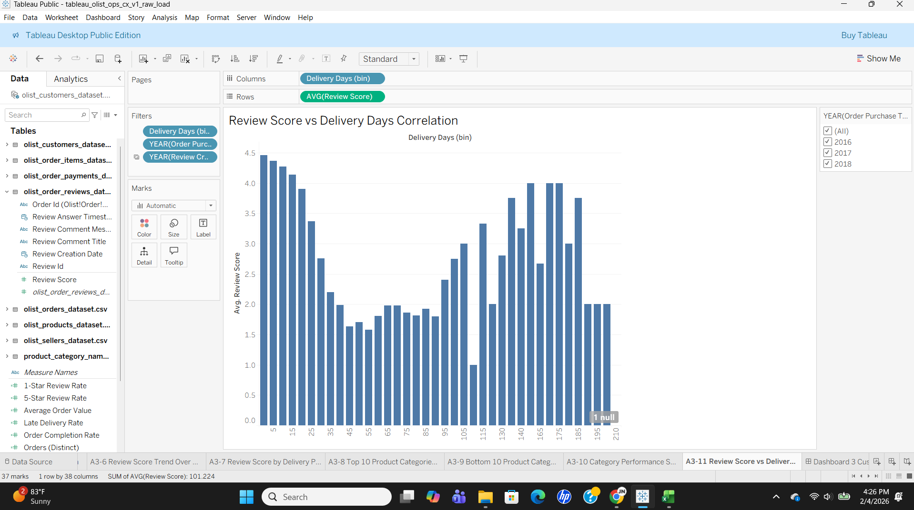
    <figcaption style="font-size: 0.95em; color: #555; margin-top: 6px;">
      Review score vs delivery days correlation showing higher ratings for faster deliveries and lower scores as delivery time grows.
      
        <a href="images/tableau-analysis-3-review-score-vs-delivery-days.png">Open full-size</a>
      
    </figcaption>
  </figure>

  <figure style="margin: 0 0 18px 0;">
    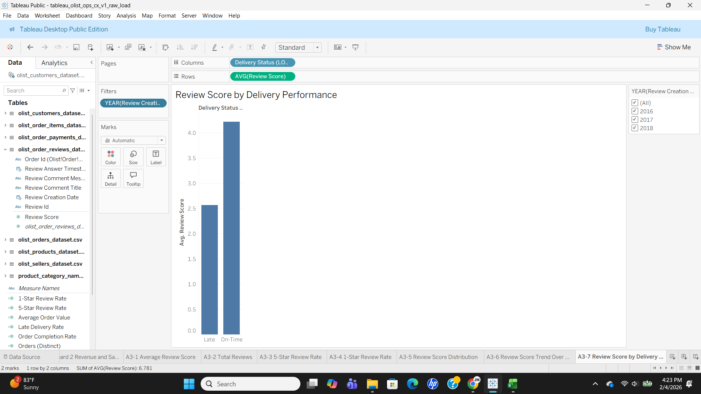
    <figcaption style="font-size: 0.95em; color: #555; margin-top: 6px;">
      Review score by delivery status highlighting higher satisfaction for on-time deliveries versus late deliveries.
      
        <a href="images/tableau-analysis-3-review-score-by-delivery-status.png">Open full-size</a>
      
    </figcaption>
  </figure>

  <figure style="margin: 0 0 18px 0;">
    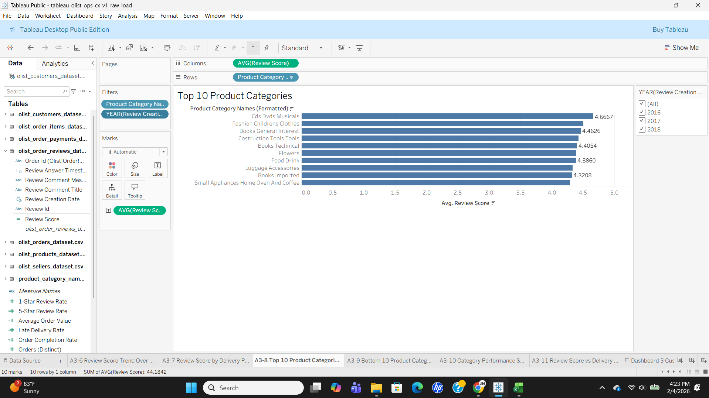
    <figcaption style="font-size: 0.95em; color: #555; margin-top: 6px;">
      Top 10 product categories by review score showing multiple categories performing well above the overall average.
      
        <a href="images/tableau-analysis-3-top-10-product-categories-by-review-scores.png">Open full-size</a>
      
    </figcaption>
  </figure>

  <figure style="margin: 0 0 18px 0;">
    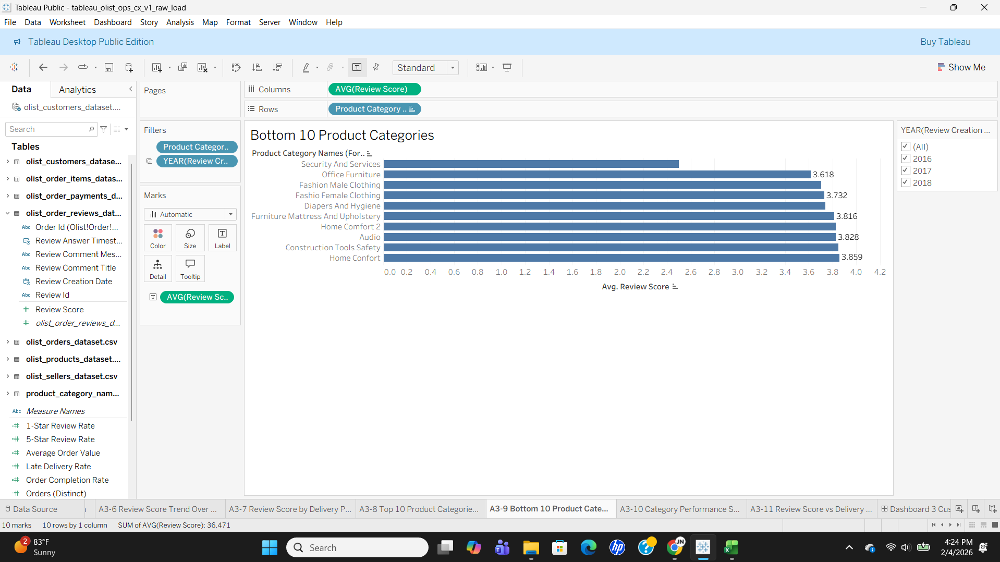
    <figcaption style="font-size: 0.95em; color: #555; margin-top: 6px;">
      Bottom 10 product categories by review score ranging from ~3.62 to ~3.86 average scores.
      
        <a href="images/tableau-analysis-3-bottom-10-product-categories-by-review-scores.png">Open full-size</a>
      
    </figcaption>
  </figure>

  <figure style="margin: 0 0 18px 0;">
    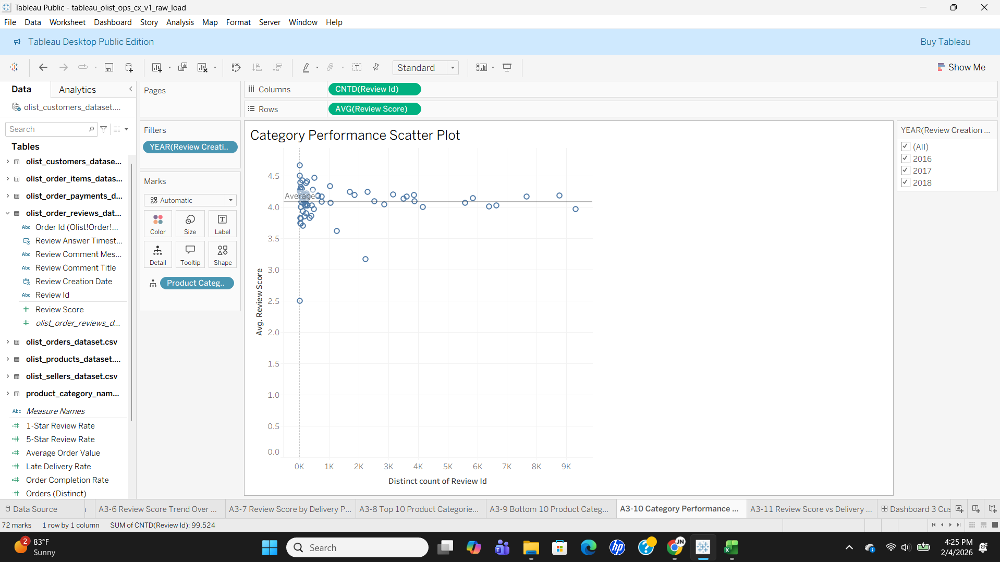
    <figcaption style="font-size: 0.95em; color: #555; margin-top: 6px;">
      Category performance scatterplot comparing review score against review volume to identify high-impact categories.
      
        <a href="images/tableau-analysis-3-category-performance-scatterplot.png">Open full-size</a>
      
    </figcaption>
  </figure>

  <h3>Results — Dashboard</h3>

  <figure style="margin: 0 0 18px 0;">
    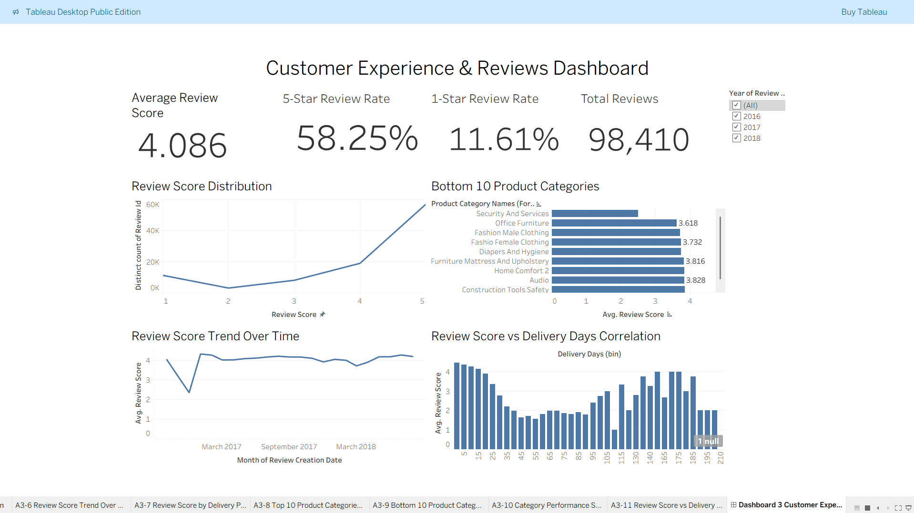
    <figcaption style="font-size: 0.95em; color: #555; margin-top: 6px;">
      Customer Experience & Reviews dashboard consolidating KPIs, distributions, trends, and category insights.
      
        <a href="images/tableau-analysis-3-dashboard.png">Open full-size</a>
      
    </figcaption>
  </figure>

  <h3>Key Findings</h3>
  <ul>
    <li><strong>High overall satisfaction:</strong> Average review score is 4.086 with a strong 58.25% 5-star rate</li>
    <li><strong>Meaningful dissatisfaction segment:</strong> 11.61% 1-star rate suggests a sizable group of poor experiences to address</li>
    <li><strong>Sentiment skewed positive:</strong> Distribution is heavily weighted toward 4- and 5-star reviews, with 2-star ratings the smallest slice</li>
    <li><strong>Stabilized sentiment after early volatility:</strong> Review scores dipped in late 2016 but stabilized around 4.0–4.3 through 2018</li>
    <li><strong>Delivery speed drives satisfaction:</strong> Faster delivery windows align with higher review scores, while long delivery times correlate with lower ratings</li>
    <li><strong>Category gaps are real:</strong> Bottom categories trail the average by ~0.2–0.5 points, indicating product or fulfillment issues within specific verticals</li>
    <li><strong>High-impact category targets:</strong> The category performance scatterplot highlights categories with high review volume where small score lifts could yield meaningful impact</li>
  </ul>

  <h3>Business Recommendations</h3>
  <ul>
    <li><strong>Prioritize delivery-time reductions:</strong> Target delivery-day bins with the sharpest review drops (30–80 days) through carrier optimization and inventory placement</li>
    <li><strong>Fix low-performing categories:</strong> Run category deep-dives on the bottom 10 list to diagnose issues (product quality, packaging, seller reliability, or returns)</li>
    <li><strong>Scale best-in-class practices:</strong> Replicate fulfillment and seller standards from top-rated categories into mid-performing categories</li>
    <li><strong>Prevent 1-star experiences:</strong> Add proactive customer notifications for long deliveries and expedite support for delayed orders</li>
    <li><strong>Balance volume and quality:</strong> Use the category scatterplot to focus on high-volume categories where incremental review gains translate to large reputation benefits</li>
    <li><strong>Improve post-purchase touchpoints:</strong> Capture more detailed feedback (delivery, product quality, seller comms) to isolate specific drivers of low scores</li>
  </ul>

  
<strong>Analysis 4 — Marketplace Ecosystem: Products & Sellers (Sep 2016 – Aug 2018)</strong>

  

  

  <h3>Business Question</h3>
  

    How does the Olist marketplace ecosystem perform across product categories and seller dynamics? What patterns
    emerge in product performance, seller distribution, and the integrated marketplace structure that reveal
    opportunities for growth, quality improvement, and strategic optimization?
  

  <h3>Method</h3>
  <ul>
    <li>Built comprehensive KPIs tracking total products sold, unique categories, average items per order, seller counts, and marketplace concentration metrics</li>
    <li>Analyzed product category performance using treemaps, Pareto charts, and monthly trend analysis to identify revenue concentration and seasonality</li>
    <li>Created category performance matrix scatter plots to correlate revenue with customer satisfaction (review scores)</li>
    <li>Examined seller ecosystem health through geographic distribution maps, revenue concentration analysis, and seller performance quadrants</li>
    <li>Tracked seller growth over time to understand marketplace expansion patterns</li>
    <li>Built integrated analysis visualizations including category-seller matrix heatmaps and product weight vs price relationships</li>
  </ul>

  <h3>Results — Section A: Product Performance</h3>

  <figure style="margin: 0 0 18px 0;">
    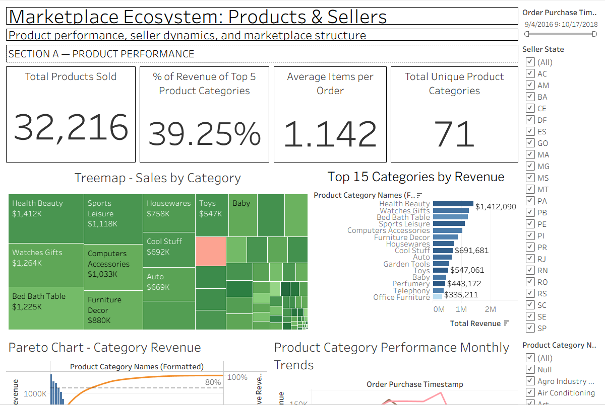
    <figcaption style="font-size: 0.95em; color: #555; margin-top: 6px;">
      Section A - Product Performance: Overview of 32,216 products sold across 71 categories, featuring treemap visualization, top 15 categories, Pareto analysis, and monthly trends.
      
        <a href="images/tableau-analysis-4-dashboard-shot-1.png">Open full-size</a>
      
    </figcaption>
  </figure>

  <h4>Product Performance Key Metrics</h4>
  <ul>
    <li><strong>32,216 Total Products Sold</strong> across the marketplace during the analysis period</li>
    <li><strong>71 Unique Product Categories</strong> available to customers</li>
    <li><strong>1.142 Average Items per Order</strong> — suggests most orders are single-item purchases</li>
    <li><strong>39.25% Revenue Concentration</strong> in Top 5 Categories — moderate concentration indicating diversified marketplace</li>
  </ul>

  <figure style="margin: 0 0 18px 0;">
    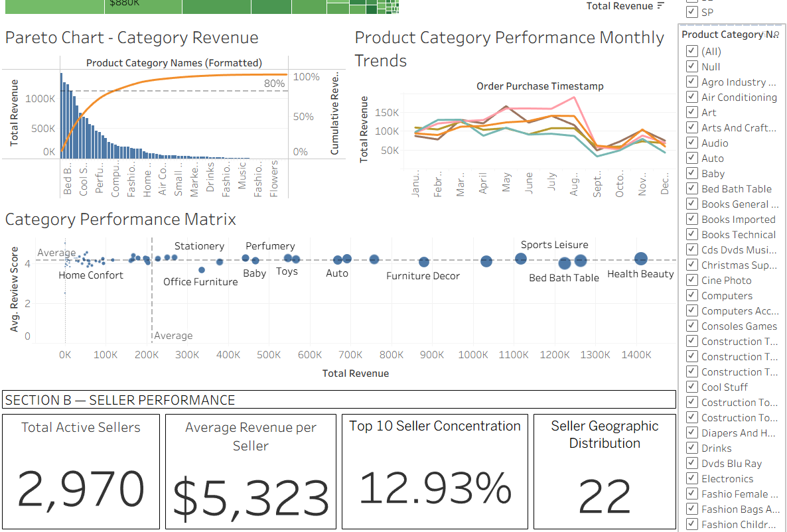
    <figcaption style="font-size: 0.95em; color: #555; margin-top: 6px;">
      Product Performance Analysis: Pareto chart demonstrating 80/20 rule, monthly category trends with seasonal peaks, and Category Performance Matrix correlating revenue with review scores.
      
        <a href="images/tableau-analysis-4-dashboard-shot-2.png">Open full-size</a>
      
    </figcaption>
  </figure>

  <h4>Category Revenue Leaders</h4>
  <ul>
    <li><strong>Health & Beauty:</strong> $1.41M revenue — top-performing category</li>
    <li><strong>Watches & Gifts:</strong> $1.26M revenue — second highest performer</li>
    <li><strong>Bed Bath Table:</strong> $1.23M revenue — strong home goods category</li>
    <li><strong>Sports Leisure:</strong> $1.12M revenue — active lifestyle category</li>
    <li><strong>Computers Accessories:</strong> $1.03M revenue — technology segment</li>
  </ul>

  <h4>Product Performance Insights</h4>
  <ul>
    <li><strong>Treemap reveals category dominance:</strong> Health & Beauty, Sports Leisure, Housewares, Toys, and Baby categories are major revenue drivers with clear visual presence</li>
    <li><strong>Pareto principle validated:</strong> Roughly 20% of categories drive 80% of revenue, following the classic 80/20 distribution</li>
    <li><strong>Seasonal patterns identified:</strong> Monthly trends show peaks around May and August-September, followed by year-end decline</li>
    <li><strong>Category Performance Matrix reveals quality leaders:</strong> Health & Beauty achieves highest revenue (~$1.4M) with above-average review scores (~4.2)</li>
    <li><strong>High-quality, high-revenue categories:</strong> Bed Bath Table and Sports Leisure demonstrate strong revenue with excellent customer satisfaction</li>
    <li><strong>Consistent high performers:</strong> Categories like Home Comfort, Stationery, and Perfumery maintain high review scores (4.0+) across varying revenue levels</li>
    <li><strong>Improvement opportunity identified:</strong> Office Furniture shows lower review scores despite moderate revenue</li>
  </ul>

  <h3>Results — Section B: Seller Performance</h3>

  <figure style="margin: 0 0 18px 0;">
    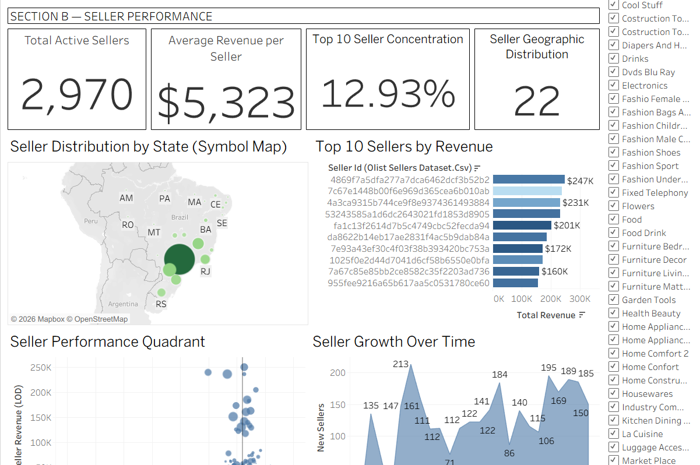
    <figcaption style="font-size: 0.95em; color: #555; margin-top: 6px;">
      Section B - Seller Performance: Analysis of 2,970 active sellers with $5,323 average revenue per seller, featuring geographic distribution across Brazil, top 10 sellers, performance quadrant, and seller growth timeline.
      
        <a href="images/tableau-analysis-4-dashboard-shot-3.png">Open full-size</a>
      
    </figcaption>
  </figure>

  <h4>Seller Ecosystem Metrics</h4>
  <ul>
    <li><strong>2,970 Active Sellers</strong> on the platform</li>
    <li><strong>$5,323 Average Revenue per Seller</strong> — indicates a healthy mid-sized seller base</li>
    <li><strong>12.93% Top 10 Seller Concentration</strong> — relatively low, suggesting a well-distributed marketplace not dominated by mega-sellers</li>
    <li><strong>22 States</strong> with seller representation across Brazil</li>
  </ul>

  <h4>Geographic Distribution</h4>
  <ul>
    <li><strong>São Paulo (SP) state dominates</strong> with the largest concentration of sellers (shown by the prominent green circle on the map)</li>
    <li><strong>Notable secondary states:</strong> RJ (Rio de Janeiro), MG (Minas Gerais), and RS (Rio Grande do Sul)</li>
    <li><strong>Regional concentration:</strong> Sellers are primarily concentrated in Brazil's southeast region</li>
  </ul>

  <h4>Top Seller Performance</h4>
  <ul>
    <li><strong>Top seller generates $247K</strong> in revenue during the period</li>
    <li><strong>Progressive decline through top 10:</strong> 10th seller at approximately $160K</li>
    <li><strong>Gradual distribution:</strong> The gradual decline (vs. steep drop-off) indicates a healthy competitive marketplace</li>
  </ul>

  <h4>Seller Performance Quadrant Analysis</h4>
  <ul>
    <li><strong>Clustering around average:</strong> Most sellers cluster around average revenue ($5K) and average reviews (4.0)</li>
    <li><strong>High performers identified:</strong> Top right quadrant shows sellers achieving $150K-$250K revenue with 4.0-4.5 review scores</li>
    <li><strong>Quality maintenance:</strong> Very few sellers operate in the "high revenue, low satisfaction" zone</li>
    <li><strong>Niche excellence:</strong> Some sellers achieve very high satisfaction (4.5+) even at lower revenue levels</li>
  </ul>

  <h4>Seller Growth Trends</h4>
  <ul>
    <li><strong>Peak onboarding:</strong> January 2017 saw 213 new sellers join the platform</li>
    <li><strong>Steady growth:</strong> 100-200 new sellers per month throughout 2017-2018</li>
    <li><strong>Notable dips:</strong> Mid-2017 and early 2018 showed temporary decreases in new seller acquisition</li>
    <li><strong>Overall trajectory:</strong> The marketplace demonstrates healthy expansion with sustained new seller acquisition</li>
  </ul>

  <h3>Results — Section C: Integrated Analysis</h3>

  <figure style="margin: 0 0 18px 0;">
    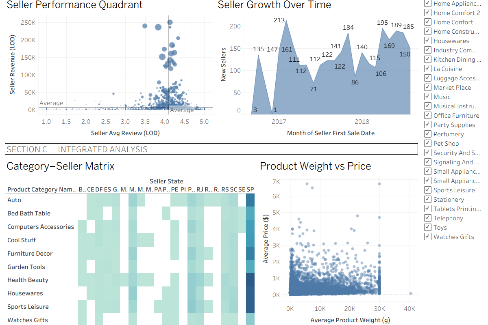
    <figcaption style="font-size: 0.95em; color: #555; margin-top: 6px;">
      Section C - Integrated Analysis: Category-Seller Matrix heatmap revealing seller presence across states and categories, plus Product Weight vs Price scatter plot showing marketplace structure and logistics patterns.
      
        <a href="images/tableau-analysis-4-dashboard-shot-4.png">Open full-size</a>
      
    </figcaption>
  </figure>

  <h4>Category-Seller Matrix (Heatmap) Insights</h4>
  <ul>
    <li><strong>SP (São Paulo) dominance:</strong> Shows the darkest intensity across most categories — it's the undisputed seller hub</li>
    <li><strong>Broad geographic coverage:</strong> Categories like Auto, Health & Beauty, Housewares, and Sports Leisure have seller presence across multiple states</li>
    <li><strong>Concentrated categories:</strong> Bed Bath Table, Computers Accessories, and Garden Tools show focused seller presence in specific states</li>
    <li><strong>White space opportunities:</strong> Gaps indicate categories lacking seller representation in certain states — potential expansion targets</li>
  </ul>

  <h4>Product Weight vs Price Scatter Plot Insights</h4>
  <ul>
    <li><strong>Product clustering:</strong> Most products fall in the 0-10K gram range with prices under $2,000</li>
    <li><strong>Heavy outliers exist:</strong> Products at 30K-40K grams are rare but present</li>
    <li><strong>Marketplace optimization:</strong> Light, low-cost items dominate — likely easier to ship and more impulse-buy friendly</li>
    <li><strong>No strong weight-price correlation:</strong> Some heavy items are cheap, some light items are expensive — diverse product mix</li>
    <li><strong>Premium segment:</strong> A few premium products exist at $6-7K price points regardless of weight</li>
  </ul>

  <h3>Key Findings</h3>
  <ul>
    <li><strong>Healthy marketplace structure:</strong> Low seller concentration (12.93%) and broad seller base (2,970) indicate a competitive, democratized platform rather than oligopoly</li>
    <li><strong>Geographic advantage matters:</strong> São Paulo's dominance across the heatmap suggests logistics advantages and market proximity drive seller location decisions</li>
    <li><strong>E-commerce-optimized product mix:</strong> The platform favors lightweight, affordable products — optimized for e-commerce shipping economics and lower barriers to purchase</li>
    <li><strong>Quality standards effective:</strong> The seller quadrant shows most sellers maintain good reviews (4.0+) regardless of revenue level — platform quality standards appear to be working</li>
    <li><strong>Category-quality correlation:</strong> High-revenue categories like Health & Beauty and Sports Leisure also maintain above-average review scores, proving quality and scale can coexist</li>
    <li><strong>Improvement targets identified:</strong> Categories with high revenue but lower reviews (like Office Furniture) present clear improvement opportunities</li>
    <li><strong>Consistent marketplace expansion:</strong> Growth pattern shows 100-200 new sellers per month with strong Q1 2017 spike, suggesting successful marketplace expansion strategy</li>
    <li><strong>Revenue diversification:</strong> While top 5 categories represent 39.25% of revenue, the remaining 60%+ is distributed across 66 other categories — good diversification</li>
    <li><strong>Seasonal demand patterns:</strong> May and August-September peaks suggest back-to-school and mid-year shopping events drive category performance</li>
    <li><strong>Single-item order behavior:</strong> Average of 1.142 items per order indicates targeted shopping rather than basket-building — potential opportunity for cross-selling</li>
  </ul>

  <h3>Business Recommendations</h3>

  <h4>Product Strategy</h4>
  <ul>
    <li><strong>Double down on proven winners:</strong> Invest in expanding Health & Beauty, Watches & Gifts, and Bed Bath Table categories through seller recruitment and marketing spend</li>
    <li><strong>Fix Office Furniture quality issues:</strong> Investigate why this category shows lower review scores despite moderate revenue — likely product quality, delivery damage, or fulfillment issues</li>
    <li><strong>Leverage seasonal patterns:</strong> Build promotional campaigns around May and August-September peaks to amplify natural demand cycles</li>
    <li><strong>Increase basket size:</strong> With only 1.142 items per order, implement "Frequently Bought Together" recommendations and cross-category bundles to increase AOV</li>
    <li><strong>Replicate quality practices:</strong> Document and share best practices from high-satisfaction categories (Home Comfort, Stationery, Perfumery) with lower-performing categories</li>
  </ul>

  <h4>Seller Development</h4>
  <ul>
    <li><strong>Expand beyond São Paulo:</strong> Create incentive programs for high-quality sellers to establish operations in underserved states (RO, AC, AM, PA in the North region)</li>
    <li><strong>Maintain healthy competition:</strong> Continue strategies that keep the top 10 concentration low (12.93%) to prevent marketplace monopolization</li>
    <li><strong>Celebrate and promote high performers:</strong> Feature sellers in the top-right quadrant (high revenue, high satisfaction) as "Featured Sellers" to incentivize quality</li>
    <li><strong>Support mid-tier sellers:</strong> Build growth programs for sellers clustered around $5K revenue to help them scale to $50K-100K levels</li>
    <li><strong>Sustain onboarding momentum:</strong> Target 150-200 new quality sellers per month, focusing on filling white-space categories and regions</li>
  </ul>

  <h4>Integrated Ecosystem Optimization</h4>
  <ul>
    <li><strong>Fill category-state gaps:</strong> Use the heatmap to target specific category expansions in states with no seller presence — prioritize high-demand categories first</li>
    <li><strong>Optimize logistics for lightweight products:</strong> Since the platform naturally favors light items, negotiate volume shipping rates for 0-10K gram products to improve margins</li>
    <li><strong>Premium product strategy:</strong> Develop dedicated fulfillment and marketing for the $6K+ price segment to capture high-margin sales</li>
    <li><strong>Weight-based fee structure:</strong> Consider tiered shipping or commission structures that account for product weight to ensure heavy items remain profitable</li>
    <li><strong>Cross-state seller expansion:</strong> Encourage top São Paulo sellers to establish secondary warehouses in RJ, MG, or RS to improve delivery times nationwide</li>
  </ul>

  <h4>Strategic Initiatives</h4>
  <ul>
    <li><strong>Category diversification targets:</strong> While the top 5 represent 39.25%, push this down to 35% by growing mid-tier categories to reduce revenue concentration risk</li>
    <li><strong>Seller quality gates:</strong> Implement pre-onboarding quality checks and training to maintain the 4.0+ average review standard across new sellers</li>
    <li><strong>Geographic expansion roadmap:</strong> Create a 12-month plan to establish seller presence in all 27 Brazilian states, prioritizing population centers first</li>
    <li><strong>Data-driven seller recruitment:</strong> Use white-space analysis to recruit sellers specifically in underserved category-state combinations</li>
    <li><strong>Monitor marketplace health metrics:</strong> Track seller concentration, new seller velocity, and category Herfindahl index quarterly to catch concentration risks early</li>
  </ul>

  
<strong>Analysis 5 — Executive Summary Dashboard (Sep 2016 – Aug 2018)</strong>

  

  

  <h3>Business Question</h3>
  

    What is the overall health of the Olist marketplace across financial performance, operational efficiency,
    customer satisfaction, and marketplace dynamics — and how can executives quickly assess business status
    and identify areas requiring immediate attention?
  

  <h3>Method</h3>
  <ul>
    <li>Synthesized insights from all four previous analyses into a single executive-level dashboard</li>
    <li>Built 4 KPI cards with month-over-month percentage changes using FIXED LOD expressions and conditional color-coded trend indicators (red for declining, green for improving)</li>
    <li>Implemented revenue trend with Tableau's native 3-month forecasting engine, 95% confidence intervals, and linear trend line</li>
    <li>Created core analytics row with order status distribution, Top 5 product categories by revenue (using Top N sets), and a geographic revenue choropleth map of Brazilian states</li>
    <li>Added performance indicator row with late delivery gauge (color-coded against 5% threshold), review score sparkline, payment methods breakdown, and a parameter-driven dynamic Key Insight box</li>
    <li>Configured interactive filters (Date Range parameter, Selected Metric parameter, Product Category multi-select, Customer State multi-select) in a right sidebar applied globally across all worksheets</li>
    <li>Implemented dashboard actions: Highlight on Hover across all sheets and Filter from State Map for click-to-filter geographic drill-down</li>
    <li>Created 17 calculated fields and 8 FIXED LOD expressions for period-over-period comparisons, trend indicators, and conditional formatting logic</li>
  </ul>

  <h3>Results — Executive Summary Dashboard</h3>

  <figure style="margin: 0 0 18px 0;">
    
    <figcaption style="font-size: 0.95em; color: #555; margin-top: 6px;">
      Executive Summary Dashboard consolidating KPIs, revenue forecasting, operational metrics, and interactive filters into a single one-page executive overview.
      
        <a href="images/tableau-analysis-5-dashboard.png">Open full-size</a>
      
    </figcaption>
  </figure>

  <h4>KPI Cards (Top Row)</h4>
  

    Four executive KPI cards display critical business metrics with month-over-month percentage changes and
    color-coded trend indicators. Each card uses FIXED LOD expressions to calculate accurate period-over-period
    comparisons across different temporal aggregations.
  

  <ul>
    <li><strong>Total Revenue — $15.8M:</strong> MoM change of -5.2% (red downward arrow) — indicates a short-term revenue decline requiring monitoring</li>
    <li><strong>Total Orders — 99,441:</strong> MoM change of +3.5% (green upward arrow) — order volume continues to grow despite revenue softness</li>
    <li><strong>Average Review Score — 4.09:</strong> Trend indicator shows "Declining" — customer satisfaction is trending downward and warrants attention</li>
    <li><strong>Average Delivery Time — 12.5 days:</strong> Trend indicator shows "Improving" — logistics performance is getting better over time</li>
  </ul>

  <h4>Revenue Trend with Forecast (Middle Row)</h4>
  

    Full-width revenue trend visualization incorporating Tableau's native forecasting engine to project 3-month
    forward revenue with 95% confidence intervals. The chart includes historical data (solid line), forecast
    predictions (dashed line), a linear trend line showing the overall growth trajectory, and shaded confidence
    bands indicating prediction uncertainty.
  

  <ul>
    <li><strong>Growth trajectory confirmed:</strong> Linear trend line shows sustained upward revenue growth from near zero in late 2016 to peaks exceeding $1.2M</li>
    <li><strong>Forecast predicts recovery:</strong> Despite the recent -5.2% MoM decline, the 3-month forecast projects upward recovery, suggesting seasonal fluctuation rather than a systemic issue</li>
    <li><strong>Confidence bands widen:</strong> The 95% confidence intervals show increasing uncertainty further into the forecast period, as expected</li>
  </ul>

  <h4>Core Analytics Row</h4>
  <ul>
    <li><strong>Order Status Distribution:</strong> Horizontal bar chart showing 97.02% delivery completion rate, with shipped (0.63%), canceled (0.32%), and other statuses making up the remainder</li>
    <li><strong>Top 5 Categories by Revenue:</strong> Health Beauty ($1.4M), Watches Gifts ($1.3M), Bed Bath Table ($1.2M), Sports Leisure ($1.2M), and Computers Accessories ($1.1M) — filtered dynamically using Top N sets</li>
    <li><strong>Revenue by State Map:</strong> Filled choropleth map of Brazilian states revealing strong concentration in the Southeast region (São Paulo dominant), with click-to-filter interactivity enabling geographic drill-down across all dashboard components</li>
  </ul>

  <h4>Performance Indicators Row</h4>
  <ul>
    <li><strong>Late Delivery Gauge — 6.8%:</strong> Color-coded KPI exceeding the 5% target threshold (yellow zone: 5-10%), signaling logistics improvements are needed to protect customer satisfaction</li>
    <li><strong>Review Score Sparkline:</strong> Compact trend line (no axes) showing satisfaction trends over time — confirms the declining trajectory flagged in the KPI card</li>
    <li><strong>Payment Methods:</strong> Credit Card dominates at 78.34%, followed by Boleto (17.92%), Voucher (2.37%), and Debit Card (1.36%) — reflecting Brazilian consumer payment preferences</li>
    <li><strong>Key Insight Box:</strong> Parameter-driven dynamic text display that changes content based on user-selected metric focus area (Revenue, Orders, Satisfaction, Delivery)</li>
  </ul>

  <h4>Interactive Features</h4>
  <ul>
    <li><strong>Date Range Parameter:</strong> Dropdown selector offering predefined time periods (Last 30 Days, Last 90 Days, Last 6 Months, Last Year, All Time) applied consistently across all worksheets via a calculated Date Filter field</li>
    <li><strong>Selected Metric Parameter:</strong> Dropdown control that dynamically updates the Key Insight text box to highlight different business metrics with context-specific insights</li>
    <li><strong>Product Category Filter:</strong> Multi-select dropdown allowing users to isolate specific product categories across all dashboard visualizations</li>
    <li><strong>Customer State Filter:</strong> Multi-select dropdown enabling geographic filtering by Brazilian state, connected globally across all metrics</li>
    <li><strong>Highlight on Hover:</strong> Cross-visualization highlighting when users hover over any data point, creating visual connections across related metrics</li>
    <li><strong>Filter from State Map:</strong> Click any state on the geographic map to dynamically filter all other dashboard components to that region's data</li>
  </ul>

  <h3>Advanced Tableau Techniques</h3>

  <h4>LOD Expressions (8 FIXED Calculations)</h4>
  <ul>
    <li><strong>Previous Month Revenue:</strong> { FIXED : SUM(IF MONTH/YEAR = previous month THEN price + freight END) }</li>
    <li><strong>Previous Month Orders:</strong> { FIXED : COUNTD(IF MONTH/YEAR = previous month THEN order_id END) }</li>
    <li><strong>Previous Month Avg Review:</strong> { FIXED : AVG(IF MONTH/YEAR = previous month THEN review_score END) }</li>
    <li><strong>Previous Month Delivery Time:</strong> { FIXED : AVG(IF MONTH/YEAR = previous month THEN Delivery Days END) }</li>
    <li>MoM percentage change calculations derived from each metric pair</li>
  </ul>

  <h4>Calculated Fields (17 New Fields)</h4>
  <ul>
    <li>Month-over-month change percentages for revenue, orders, reviews, and delivery time</li>
    <li>Display text helpers with conditional arrows (▲/▼) and formatting</li>
    <li>Trend indicators (Improving/Declining/Stable) based on directional thresholds</li>
    <li>Color coding helpers for conditional formatting on KPI cards</li>
    <li>Date filter logic driven by the Date Range parameter selection</li>
  </ul>

  <h4>Parameters & Forecasting</h4>
  <ul>
    <li><strong>Date Range Parameter:</strong> String parameter with 5 predefined temporal options controlling global date filtering</li>
    <li><strong>Selected Metric Parameter:</strong> String parameter with 4 metric focus options driving the dynamic Key Insight box</li>
    <li><strong>3-Month Revenue Forecast:</strong> Tableau's native forecasting engine with automatic seasonal adjustment and 95% confidence interval bands</li>
    <li><strong>Linear Trend Line:</strong> Overlaid on historical data to show the overall business growth trajectory</li>
  </ul>

  <h3>Key Findings</h3>
  <ul>
    <li><strong>Delivery performance alert:</strong> 6.8% late delivery rate exceeds the 5% target threshold, indicating logistics improvements are needed to protect customer satisfaction — previous analysis showed a strong negative correlation (-0.65) between delivery time and review scores</li>
    <li><strong>Revenue trajectory suggests seasonal fluctuation:</strong> Despite -5.2% month-over-month decline, the 3-month forecast predicts recovery with an upward trend line, suggesting seasonal variation rather than a systemic downturn</li>
    <li><strong>Divergence between orders and revenue:</strong> Orders grew +3.5% MoM while revenue declined -5.2%, indicating average order value compression — customers are ordering more but spending less per order</li>
    <li><strong>Declining customer satisfaction:</strong> Average review score of 4.09 with a declining trend requires proactive intervention before it impacts repeat purchases and marketplace reputation</li>
    <li><strong>Category concentration risk:</strong> Top 5 categories represent significant revenue share, indicating opportunity for portfolio diversification to reduce dependency</li>
    <li><strong>Geographic concentration:</strong> Revenue map reveals strong concentration in southeastern states (São Paulo), suggesting expansion opportunities in underserved regions</li>
    <li><strong>Payment behavior insight:</strong> 78% credit card usage indicates customer preference for convenience and installment options, while 18% boleto usage represents Brazil-specific payment infrastructure serving underbanked populations</li>
    <li><strong>Strong operational foundation:</strong> 97% order completion rate and improving delivery times demonstrate reliable core operations despite the late delivery rate exceeding target</li>
  </ul>

  <h3>Business Recommendations</h3>
  <ul>
    <li><strong>Logistics optimization priority:</strong> Invest in delivery infrastructure to reduce late delivery rate from 6.8% to below the 5% target — this is the single highest-leverage improvement given the strong correlation between delivery performance and customer satisfaction</li>
    <li><strong>Address AOV compression:</strong> Investigate the divergence between growing order volume and declining revenue per order — consider cross-selling strategies, bundle promotions, and minimum order incentives to stabilize average order value</li>
    <li><strong>Customer retention focus:</strong> Address the declining review score trend through improved delivery performance, proactive communication for delayed orders, and product quality initiatives before it impacts repeat purchase rates</li>
    <li><strong>Category diversification:</strong> Develop growth strategies for mid-tier categories while maintaining strength in top performers (Health Beauty, Watches Gifts) to reduce revenue concentration risk</li>
    <li><strong>Geographic expansion:</strong> Prioritize marketing and seller recruitment in high-potential, underserved states identified through the revenue density map — target northern and central-western regions</li>
    <li><strong>Leverage payment infrastructure:</strong> Expand boleto accessibility and consider debit card incentives to capture more of the underbanked market segment while maintaining credit card partnership benefits</li>
    <li><strong>Implement executive monitoring cadence:</strong> Use this dashboard as the basis for weekly executive reviews, with drill-down to detailed analyses (1-4) when KPI thresholds are breached</li>
  </ul>

  
<strong>Conclusion</strong>

  

  

  

    This analysis examined 99,441 Olist e-commerce orders across five interconnected dashboards to evaluate the marketplace from four perspectives: operational performance, financial health, customer satisfaction, and ecosystem dynamics. The goal was to move beyond surface-level metrics and uncover the relationships between them — where delivery performance impacts satisfaction, where geographic concentration creates both revenue strength and strategic risk, and where marketplace growth introduces new operational pressure.
  

  <h3>What the Data Revealed</h3>
  

    Olist's core operations are strong. A 97% order completion rate, average delivery times that improved from 50+ days during early operations down to 12.5 days, and $15.8M in total revenue with 21% year-over-year growth all point to a marketplace that scaled effectively during this period. The seller base grew to 2,970 with low concentration (top 10 sellers account for just 12.93% of revenue), indicating a competitive and democratized platform.
  

  

    However, the analysis also surfaced clear pressure points. The 6.8% late delivery rate exceeds the 5% operational target, and the data shows a direct relationship between delivery delays and declining review scores — on-time orders average significantly higher satisfaction than late ones. With an 11.6% 1-star review rate and a declining satisfaction trend, the connection between logistics performance and customer experience is the most actionable finding across all five analyses.
  

  

    Revenue and order concentration in São Paulo (37% of total revenue) and the Southeast region (60%+) represent both Olist's current strength and its most significant growth constraint. The category-seller heatmap revealed clear white-space opportunities in underserved states and product verticals, while the seller quadrant analysis confirmed that quality and scale can coexist — most sellers maintain 4.0+ review scores regardless of revenue level.
  

  <h3>Connecting the Analyses</h3>
  

    Each dashboard was designed to answer a distinct business question, but the findings compound when viewed together. The fulfillment analysis (Analysis 1) identified delivery performance issues that the customer experience analysis (Analysis 3) directly linked to review score deterioration. The revenue analysis (Analysis 2) highlighted geographic concentration that the marketplace analysis (Analysis 4) explained through seller distribution patterns. The executive summary (Analysis 5) synthesized these threads into a single monitoring surface with KPI cards, forecasting, and interactive filters designed for ongoing operational use.
  

  

    The technical implementation progressed from foundational calculated fields and KPI cards through advanced LOD expressions, parameter-driven interactivity, Top N sets, and Tableau's native forecasting engine — demonstrating how increasing analytical complexity can be layered into a cohesive, executive-facing deliverable.
  

  
<strong>Limitations</strong>

  

  

  <ul>
    <li><strong>Truncated boundary periods:</strong> August 2018 shows a sharp drop in order volume consistent with incomplete data collection, and August–November 2016 contains too few orders for reliable trend analysis. Insights drawn from these boundary months should be treated as directional rather than definitive.</li>
    <li><strong>No logistics provenance data:</strong> The dataset lacks carrier identity, warehouse locations, regional distribution infrastructure, and external event context (holidays, promotional campaigns, weather disruptions). This limits the ability to attribute delivery performance variation to specific operational causes.</li>
    <li><strong>Geographic granularity ceiling:</strong> Customer and seller locations are available at the city and state level, but without postal code coordinates or distance calculations, the analysis cannot measure delivery distance as a variable — a likely confound in delivery time and late delivery rate patterns.</li>
    <li><strong>Review-delivery linkage is correlational:</strong> While the analysis demonstrates a clear relationship between delivery time and review scores, the dataset does not isolate delivery experience from product quality, seller communication, or other factors that influence customer ratings. The observed correlation is strong but not causal attribution.</li>
    <li><strong>Single marketplace, single country:</strong> All findings are specific to Olist's Brazilian marketplace during 2016–2018. Consumer behavior, payment infrastructure (boleto prevalence), and logistics realities are particular to this market and time period.</li>
  </ul>

  
<strong>Explore the Dashboard</strong>

  

  

  <h3>Interactive Dashboard on Tableau Public</h3>
  

    The full interactive dashboard is published on Tableau Public. Explore the Executive Summary and all supporting analyses with live filters, hover highlights, and geographic drill-downs:
  

  

    <a href="https://public.tableau.com/views/tableau_olist_ops_cx_v1_raw_load/Dashboard5-ExecutiveSummary?:language=en-US&:sid=&:redirect=auth&:display_count=n&:origin=viz_share_link" target="_blank" rel="noopener">
      View on Tableau Public →
    </a>
  

  <h3>Dataset</h3>
  

    The Olist dataset is publicly available on Kaggle:
    <a href="https://www.kaggle.com/datasets/olistbr/brazilian-ecommerce" target="_blank" rel="noopener">
      Brazilian E-commerce Public Dataset by Olist
    </a>
  

